# 1. 前言

在之前的文章都已经介绍了如何对APP应用及小程序的抓包方式，本次将主要探讨，如何更全面的获取详细信息与获取非HTTP/S的流量，同时利用自动化工具对APK文件继续自动化扫描相关的威胁。

# 2. 补充AppInfoScanner相关内容

在之前的演示中只是介绍了一下AppInfoScanner项目的使用方式，并没有更详细的介绍这个工具，这个工具是一款适用于以HW行动/红队/渗透测试团队为场景的移动端(Android、iOS、WEB、H5、静态网站)信息收集扫描工具，可以帮助渗透测试工程师、攻击队成员、红队成员快速收集到移动端或者静态WEB站点中关键的资产信息并提供基本的信息输出,如：Title、Domain、CDN、指纹信息、状态信息等。

但是在实际的信息获取过程中，发现收集到的相关信息还是比较少的，这时候就需要使用Fiddler共同进行收集，才可能将APK中的信息收集完成。

这是由于AppInfoScanner项目是通过提取APK中存在的URL地址信息，若获取到这个URL地址那么就会对其进行收集，除此之外的URL信息就收集不到了。

而Fiddler是在通信过程中进行收集，相较于AppInfoScanner项目可能会收集到更多在通信过程中访问的一些相关信息，但是FIddler想要收集完整就需要一个一个功能测试，同时可能会出现开会员才能够点击的功能或者一些特殊授权才能够使用的功能，这时候就会出现无法收集的情况，所以两个配合是最优的办法，当然不一定非要使用Fiddler或者AppInfoScanner项目，如果你有更好的项目当然更好拉，如果没有，那么这两个也不错。

# 3. MobSF安全评估

移动的安全框架（MobSF）是一个自动化的，一体化的移动应用程序（Android/iOS/Windows）笔测试，恶意软件分析和安全评估框架，能够执行静态和动态分析。MobSF支持移动的应用二进制文件（APK，XAPK，IPA&APPX）沿着压缩源代码，并提供REST API，以便与CI/CD或DevSecOps管道无缝集成。动态分析器可帮助您执行运行时安全评估和交互式仪表化测试。

## 3.1. 下载MobSF

这里最好使用Linux系统来安装，若安装在Windows系统上或者MAC上会比较麻烦，而使用Linux系统只需要在Linux系统上准备一个Docker即可实现一键安装。

[MobSF下载](https://github.com/MobSF/Mobile-Security-Framework-MobSF)

[MobSF官方手册](https://mobsf.github.io/docs/#/zh-cn/)

## 3.2. 安装Docker

我是虚拟机装的Centos7.6，linux 3.10 内核，docker官方说至少3.8以上，建议3.10以上（ubuntu下要linux内核3.8以上， RHEL/Centos 的内核修补过， centos6.5的版本就可以——这个可以试试）

需要使用root权限安装。

### 3.2.1. 查看Linux内核版本

```
uname -r
```

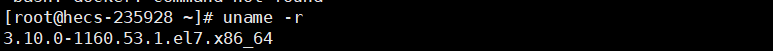

### 3.2.2. 更新yum包

这里需要将yum包，更新到最新，这里我是使用云服务器，我更新了一下，看没什么好更新的，而且比较慢，所以直接就没有更新。

```
yum update
```

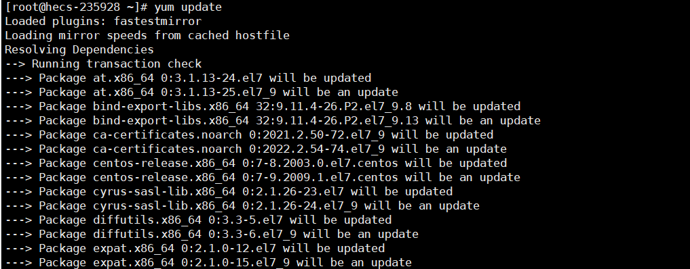

### 3.2.3. 安装Docker软件包

我这里显示好像是安装过了，我也不清楚之前安装啥了。

```
yum install -y yum-utils device-mapper-persistent-data lvm2
```

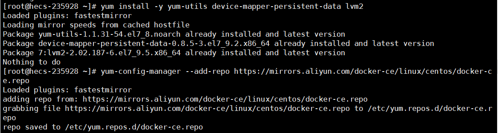

### 3.2.4. 设置yum源

```
yum-config-manager –add-repo http://download.docker.com/linux/centos/docker-ce.repo ##中央仓库
```

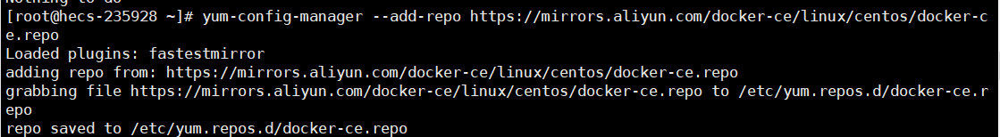

### 3.2.5. 查看Docker版本

这里我们可以看一下所有仓库中所有docker版本，并选择特定版本安装。

```
yum list docker-ce --showduplicates | sort -r
```

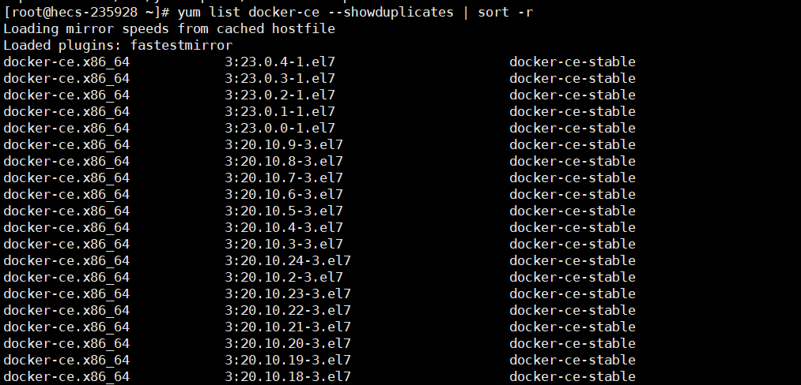

### 3.2.6. 安装Docker

版本号就是第二排这个版本号，比如我这里选择的是18.09 。

```
yum install docker-ce-版本号
```

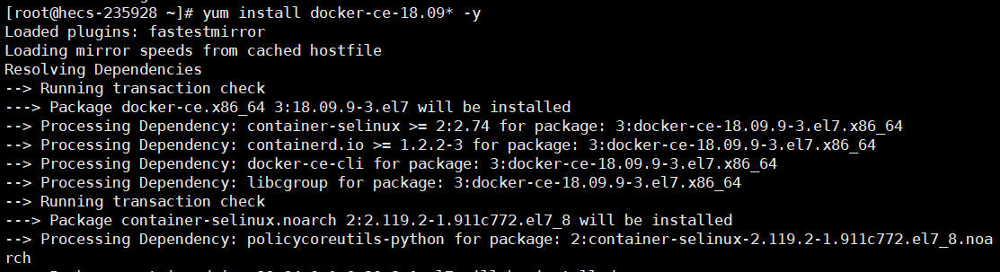

### 3.2.7. 设置Docker

这里设置Docker，主要就是设置启动、开机自启、查看版本，若能够查看到版本，基本上就是安装成功了。

```
systemctl start docker
systemctl enable  docker
docker version
```

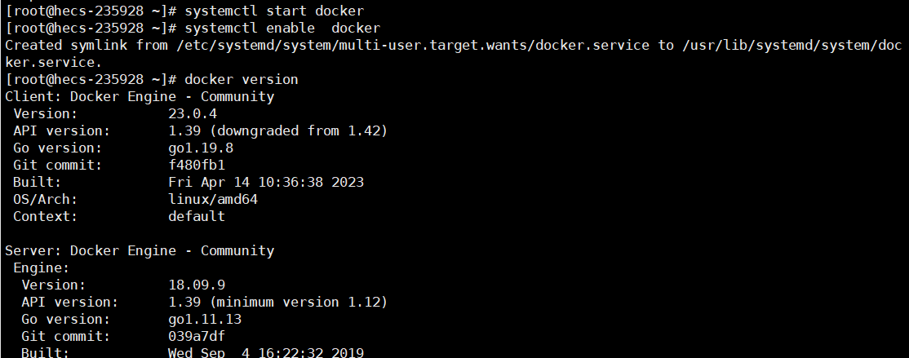

### 3.2.8. Docker其它命令

这里介绍一些常用的Docker命令。

```
docker ps              ##查看当前正在运行的容器
docker ps -a           ##查看所有容器的状态
docker start/stop id/name ##启动/停止某个容器
docker exec -ti id ##启动一个伪终端以交互式的方式进入某个容器（使用exit退出后容器不停止运行）
docker images          ##查看本地镜像
docker rm id/name      ##删除某个容器
docker rmi id/name     ##删除某个镜像
```

## 3.3. 安装MobSF

如果使用Linux的话，安装是很方便了，不需要操作太多，一条命令即可。

### 3.3.1. 一键安装

这里安装MobSF，可能稍微有点慢。

```
docker pull opensecurity/mobile-security-framework-mobsf
```

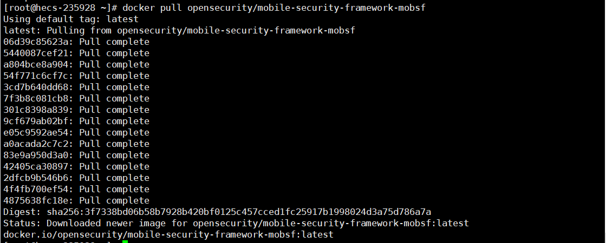

### 3.3.2. 启动MobSF

这里启动MobSF，如果你是使用云服务器，那么就需要在安全组中开启8000端口，当然端口是可以更改的。

```
docker run -it --rm -p 8000:8000 opensecurity/mobile-security-framework-mobsf:latest
```

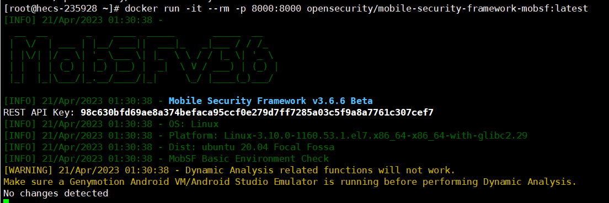

### 3.3.3. 打开MobSF

这里就可以通过网页打开MobSF了，访问地址:`http://IP地址:端口`

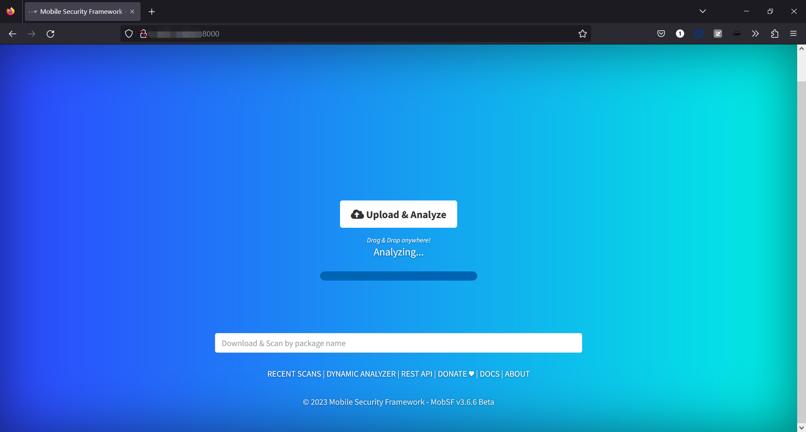

## 3.4. MobSF使用

这里简单来说就是将APK上传至MobSF中，若没有APK文件，可以使用资源提取器，将APP应用的APK文件提取出来，在上篇文章中已经介绍如何提取了，这里就不再赘述，这里我还是使用某妃进行操作。

### 3.4.1. 上传APK文件

点击中间的上传，将文件上传进去，就可以了，后面就是等待结果，时间可能有点长，大概率是由于APK文件的大小、是否加壳、编写内容导致分析时间长。

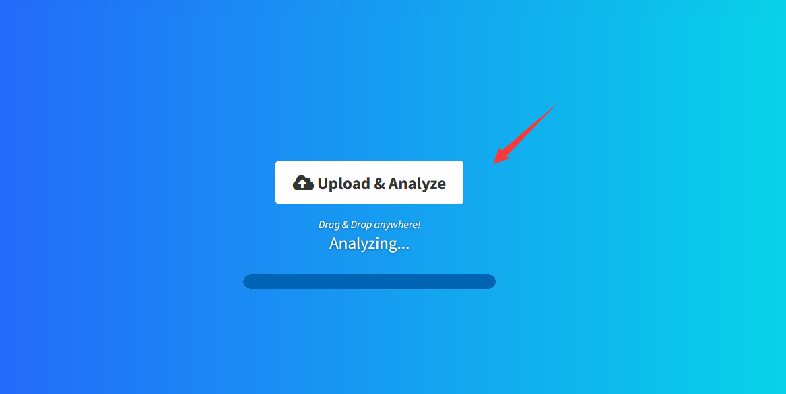

### 3.4.2. 查看APK分析结果

这里稍等后，就会出现分析的结果，这里都是英文，可以使用浏览器翻译成中文，就通俗易懂了，这里我就不一一介绍相关的信息，直接看一张大图吧！

具体的使用的方式可以自己去研究，我这里只是介绍怎么使用。

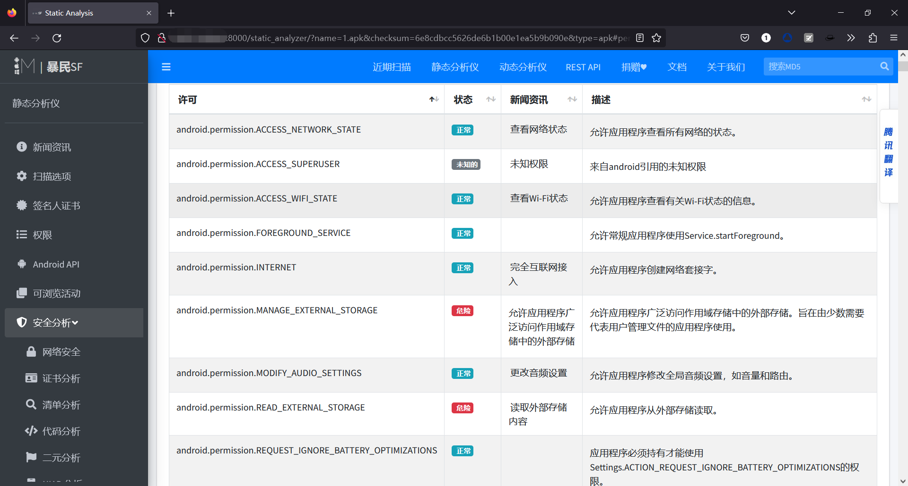

# 4. frida抓包

``Firda`` 是一款易用的跨平 `Hook `工具， `Java` 层到 `Native` 层的 `Hook` 无所不能，是一种 动态 的插桩工具，可以插入代码到原生 `App` 的内存空间中，动态的去监视和修改行为，原生平台包括 `Win、Mac、Linux、Android、iOS` 全平台。

大部分 App 对于我们来说都是黑盒，对 App 进行逆向和动态调试、或自动化分析、需要不断的进行动态调试，Frida 通过使用 Python 注入 JavaScript 脚本，都是通过 JS 脚本来操作设备上的 Java代码。

如果需要持久化的 Hook 还是需要通过 Xposed 等框架，但是 Frida 的动态和灵活性对逆向和自动化逆向提供了很大帮助。

## 4.1. frida介绍

`Frida` 分为客户端和服务端。

客户端：PC（控制端）

服务器：手机设备（被控制端）

客户端编写的 `Python` 代码，用于连接远程设备，提交要注入的 `JS` 代码到服务端，接受服务端发来的消息。

服务端中需要用 `JS` 代码注入到目标进程，操作内存数据，给客户端发送消息。

## 4.2. PC端配置

这里首先安装python，然后再去安装frida库以及frida-tools工具。

### 4.2.1. 安装python

我这里已经提权安装好python了，都学习到APP渗透了，不应该还没有安装python了吧！

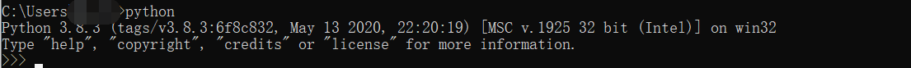

### 4.2.2. 安装frida与frida-tools

这里可能需要耐心等一等，安装过程很慢，但是退出几次，重新安装就快了，也很奇怪，这里安装完成后，通过查看版本来定服务端的版本，我这里是16.0.7，那么我安装服务端就需要下载16.0.7版本的。

```
pip install frida  ##安装frida
pip install frida-tools  ##frida-tools
frida --version    ##查看版本
```

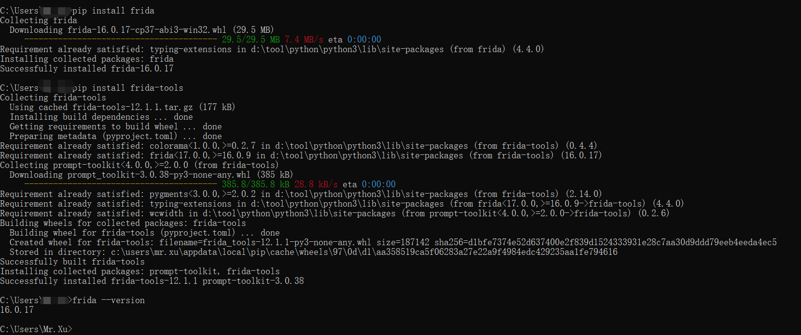

## 4.3. 模拟器配置

### 4.3.1. 查看模拟器位数

在下载的服务端版本中会存在位数，那么就需要查看模拟器的版本位数了。

首先需要打开模拟器，如果不打开模拟器是进不去的，同时由于我没有设置环境变量，那么我就在夜神模拟器的安装目录下的`bin`中打开`cmd`输入命令查看位数，这样我们就好判断下载什么位数的服务端了。

```
adb shell ##进入模拟器
getprop ro.product.cpu.abi ##查看位数
```

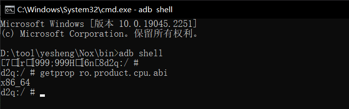

### 4.3.2. 下载Frida-server

上面我们获取到我们的客户端的版本是16.0.7版本的，同时模拟器的位数是64位，那么根据这些信息，来下载对应的服务端。注意服务端的 `Frida` 版本必须和客户端的 `Frida` 版本一致。

[Frida-server](https://github.com/frida/frida/releases)

这里需要注意，前缀需要为android，实体手机选在arm/arm64，模拟器选择X86/X86_64。

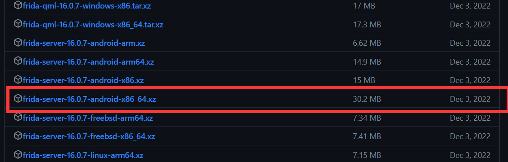

### 4.3.3. 上传模拟器

这里需要将服务端上传至模拟器中，需要退出来上传，不能在系统中上传。

```
adb push 文件位置 /data/local/tmp
```

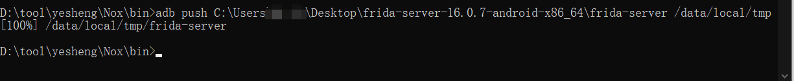

### 4.3.4. 给予权限

这里和Linux一样需要给予执行权限。

```
adb shell
cd /data/local/tmp
chmod 777 frida-server
```

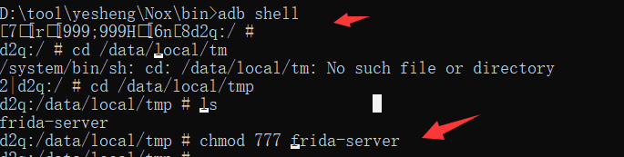

### 4.3.5. 运行frida-server

这里运行的时候，只要是卡住的状态就证明成功了。

```
./frida-server ##运行
```

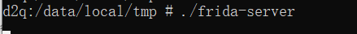

如果不确定，这时候可以在启动一个cmd，进入看一下是否在运行即可。

```
ps | grep frida-server
```

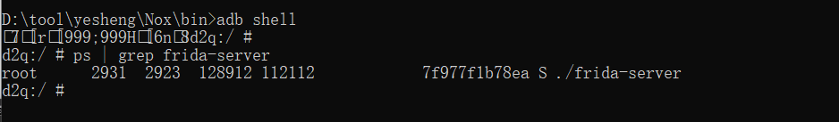

### 4.3.6. 判断连接状态

这里需要判断进行运行状态，这里显示的信息就是模拟器中的信息。

```
frida-ps -U
```

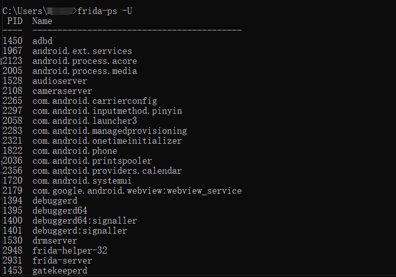

这里还需要输入一个命令，需要两个都能够执行成功才可以。

```
frida-ps -R
```

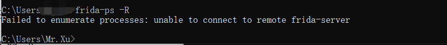

可以看到这里是没有执行成功的，那么就需要进行端口转发。

```
adb forward tcp:27042 tcp:27042
```

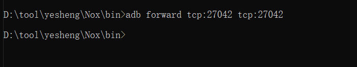

再次查看状态，可以看到成功执行，这里尽量将所有的`cmd`窗口都挂起来，不要关闭，避免后面还需要调试。

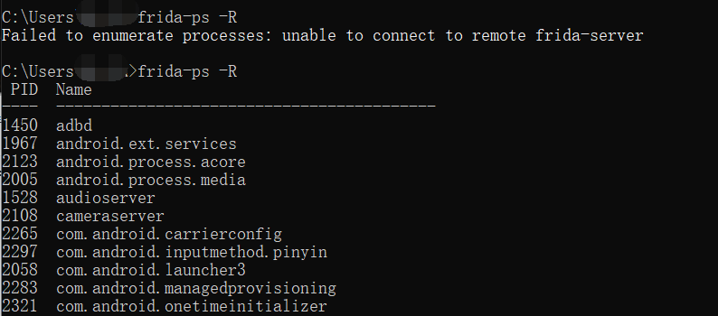

## 4.4. 总结

到这里关于Frida的操作就全部结束了，注意在以上操作中，尤其是在进行端口转发后，可能会出现卡死的情况，建议重新操作，运行服务端与端口转发这些测试。

# 5. 安卓应用层抓包通杀脚本

通常如果APP流量不走HTTP/S协议，那么就会导致fiddler与burp抓不到包，那么这里就可以使用fride配合下面的脚本抓取我们抓不到的包。

这里需要下载一个这个脚本，这个脚本可以自行去看相关的介绍，这里就简单的介绍一下。

- 仅限安卓平台，测试安卓7、8、9、10、11、12 可用 ；
- 无视所有证书校验或绑定，不用考虑任何证书的事情；
- 通杀TCP/IP四层模型中的应用层中的全部协议；
- 通杀协议包括：Http,WebSocket,Ftp,Xmpp,Imap,Smtp,Protobuf等等、以及它们的SSL版本；
- 通杀所有应用层框架，包括HttpUrlConnection、Okhttp1/3/4、Retrofit/Volley等等；
- 无视加固，不管是整体壳还是二代壳或VMP，不用考虑加固的事情；

[安卓应用层抓包通杀脚本](https://github.com/r0ysue/r0capture)

## 5.1. 测试前事项

这里需要注意，我发现当模拟器运行frida-server后，模拟器无法进行操作，当暂停运行frida-server，立刻能够操作。这个我还没太搞清楚是什么情况，这里是使用的是夜神模拟器，安卓版本7.0。

这里可能是由于我个人的环境问题导致的，不确定其它人会不会有这样的情况。

这里我摸索出一个流程，简单来说一下。

首先按照上面的流程运行`frida-server`并且测试`-R`与`-U`是否能够正常获取到信息。

然后再确保能够获取到信息后，发现模拟器无法操作了，这里就需要将`frida-server`暂停，测试模拟器是否恢复正常,如果没有继续暂停`frida-server`，然后再进行测试。

当模拟器恢复正常后，在使用r0capture.py进行抓包。

## 5.2. 获取包名方式

后面可能会用到包名，所以这里介绍一下，如何获取APP在模拟器中的包名，这里需要使用到MT管理器，在上一章中也提到MT管理器了，具体的介绍就不多废话了，这里直接介绍如何使用。

[MT管理器](https://coolapk.com/apk/bin.mt.plus)

### 5.2.1. 选择安装包提取

这里选择安装包提取。

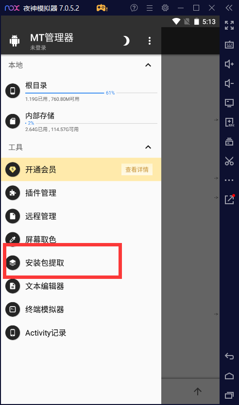

### 5.2.2. 查看包名

这里就能够看到包名叫什么了。

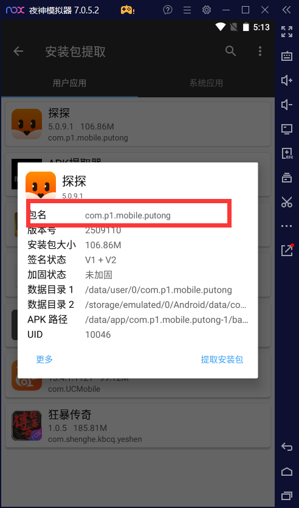

## 5.3. Attach 模式使用方式

在官方的注意事项中有显示，老版本Frida使用包名，新版本Frida使用APP名。APP名必须是点开app后，frida-ps -U显示的那个app名字。

### 5.3.1. Attach 模式操作

这里我使用的是Attach 模式，当访问什么界面才去抓取，简单来说就是抓取感兴趣流。

如果直接执行会报错，需要在开启探探APP的时候，立刻到`cmd`中执行回车，所以，就需要提前将命令输入进去。

```
python r0capture.py -U 探探  -v -p tantan.pcap
```

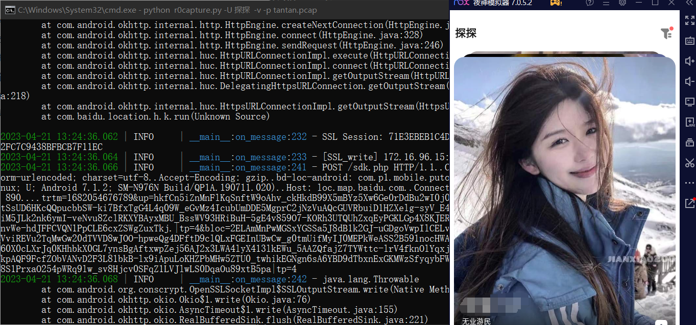

### 5.3.2. Attach 模式结果

这里获取到的结果是pcap也就是wiresharp的包，把包打开就能够看到访问了哪些地址以及一些相关的信息，这里就可以对这些IP以及内部的数据进行分析。

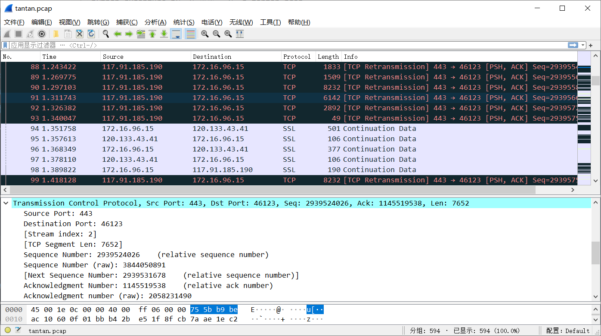

## 5.4. Spawn 模式使用方式

这里官方介绍是使用包名来操作，但是不会保存成一个数据包，只是会将结果导出到一个txt文件中，且非常的杂乱，所以官方也是建议使用attach模式。

### 5.4.1. Spawn 模式操作

这里在输入完成后，会自动跳转并打开包名所对应的APP应用。

```
python r0capture.py -U -f 包名
```

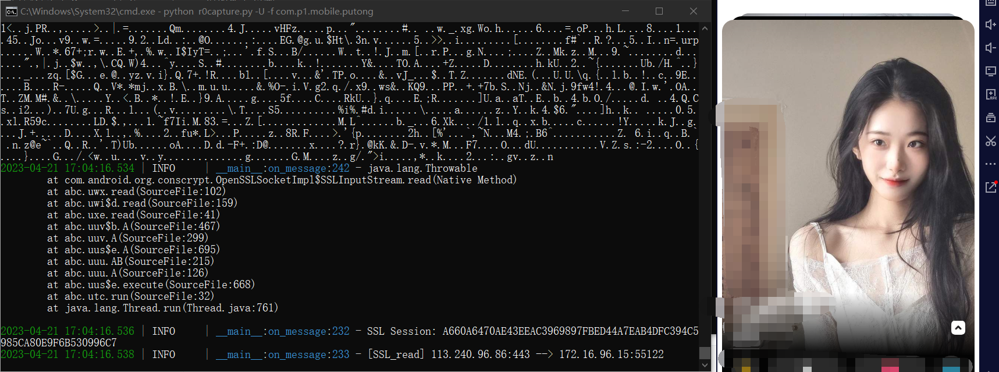

### 5.4.2. Spawn 模式结果

在文件夹下会自动生成一个txt文件，会将所有内容都放置这个txt文件中。

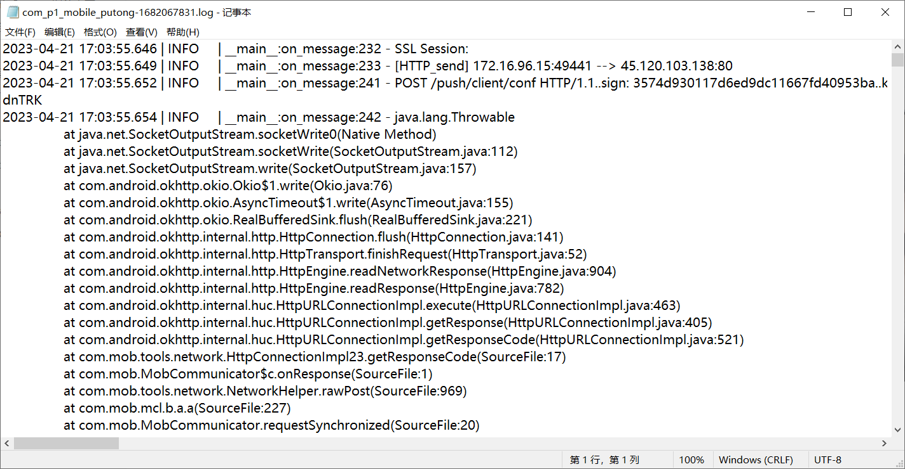

## 5.5. 总结

这里好像是可以和fiddler与burp联动的，这里暂时还没研究，期待下一章吧，应该会提到这方面的内容。
