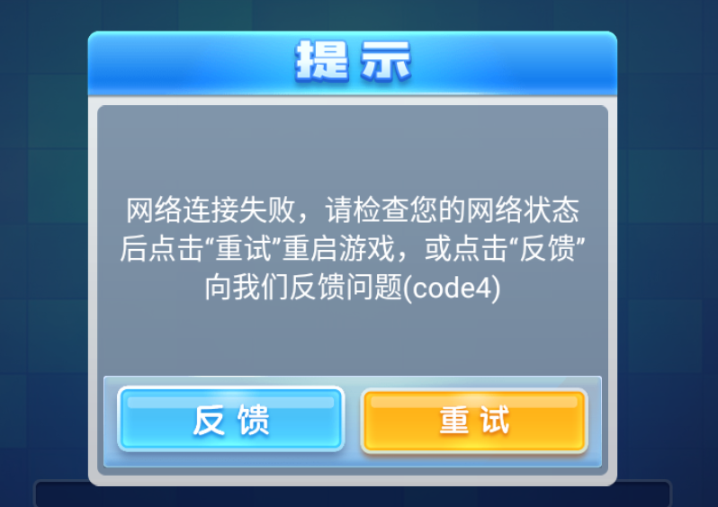
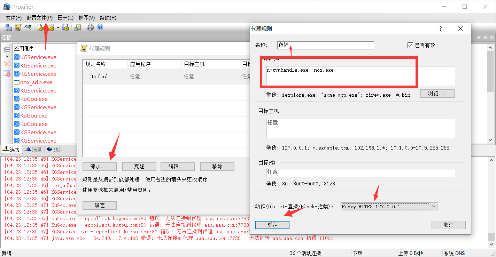
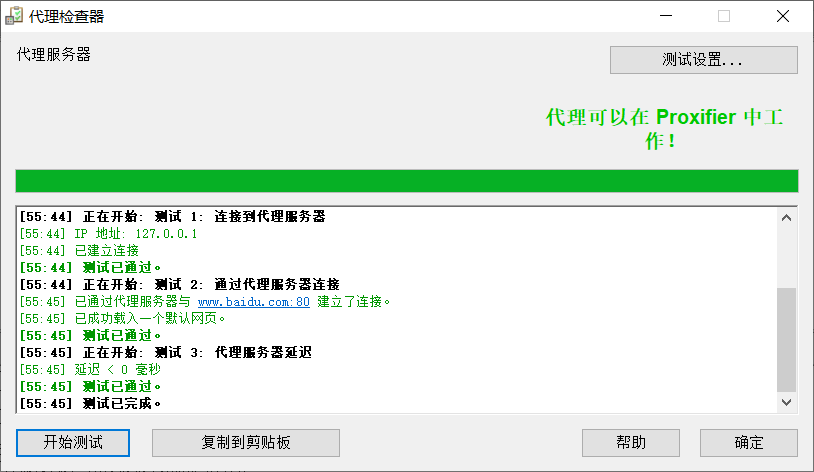
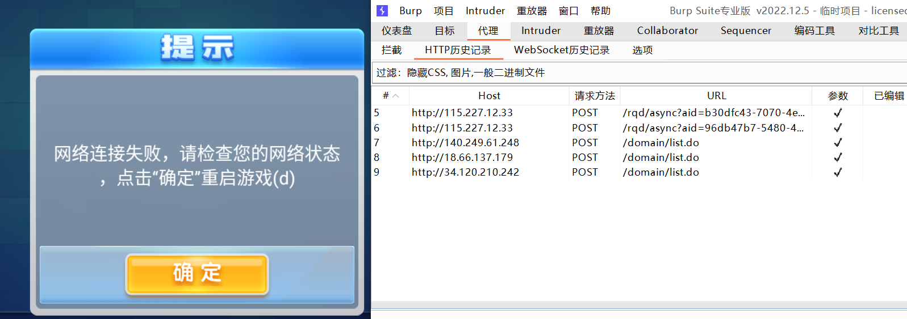
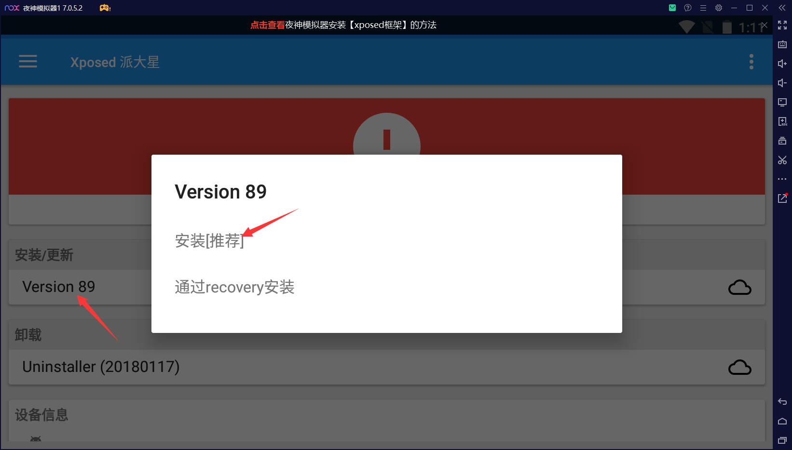
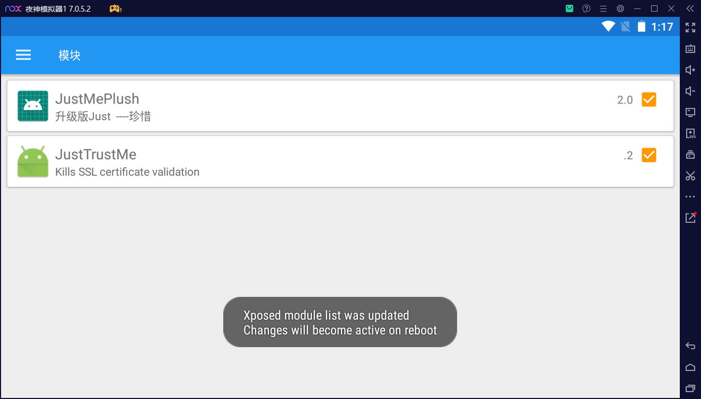
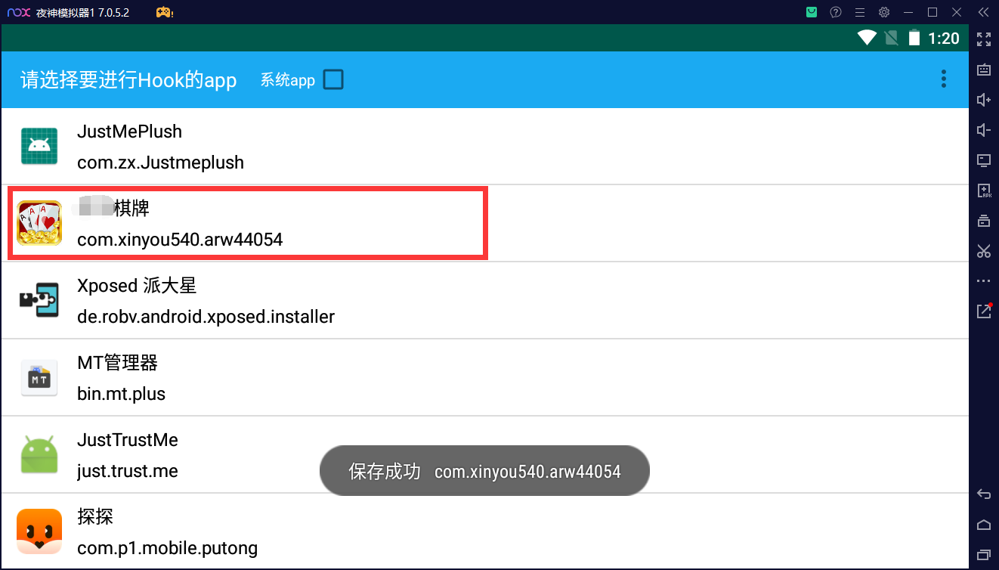
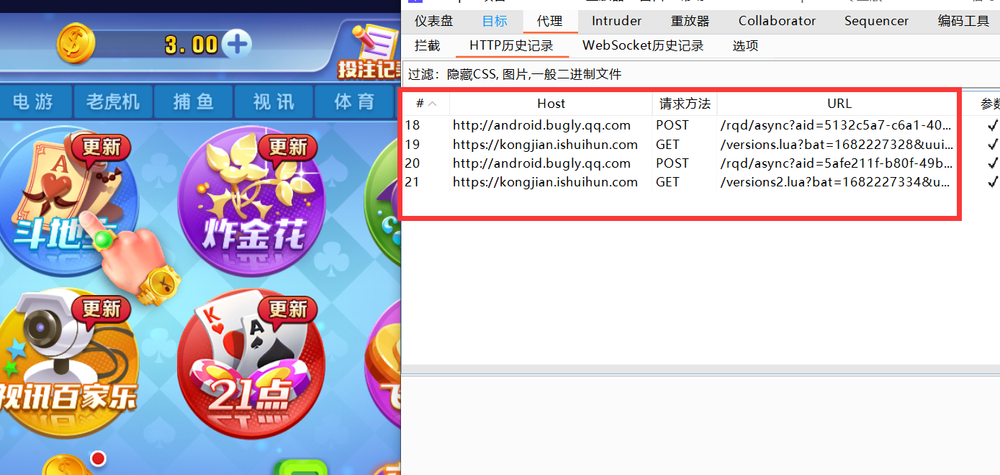
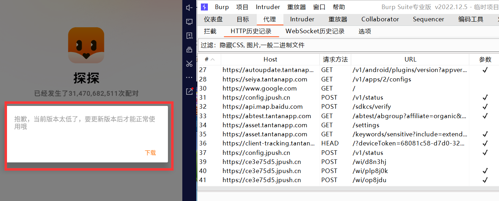

# 1. 前言

在之前的文章都写到了，如何对APP应用进行抓包，但是所演示的APP都是一些未设置防护的，或者使用的抓包工具能够避免这种情况的，所以都正常显示，本章就是针对APP设定了反代理或者反证书验证机制进行绕过。

## 1.1. 无法获取数据包情况

通常获取不到APP应用数据包会有两种情况：

- 反代理机制
- 反证书机制

如果数据走的ssl https，那么数据包有三种验证情况：

- 客户端不存在证书校验，服务器也不存在证书校验。
- 客户端存在校验服务端证书，服务器也不存在证书校验，单项校验。
- 客户端存在证书校验，服务器也存在证书校验，双向校验。

反证书就是在我们抓包的时候，APP接收数据是利用我们抓包软件产生的证书来进行交互的，但是服务端去校验的时候发现和APP的证书是不一致的，那么就会导致出现反证书机制，导致我们无法正常的进入软件或进行抓包。

# 2. 反代理

反代理简单来说就是APP在启动的时候检测是否开启了代理模式，如果开启了代理模式，那么就会出现无法连接的情况。

## 2.1. 反代理情况

### 2.1.1. 某牛牛反代理

这里可以看一下反代理效果，这里我首先开启模拟器的代理模式，然后打开APP，可以看到这里是提示了网络连接失败，其实这里就是在检测是否开启了代理，那么这里我开启了代理，所以就会出现这种情况。

### 2.1.2. 某探反代理

这里同样的配置，可以看一下某探探反代理情况，其实这里是一样的，虽然显示版本太低，但是却不是由于版本太低问题，而是检测到了代理的情况。

## 2.2. 绕过反代理

这里可以通过Proxifier绕过代理，以及上章中提到的r0capture安卓通杀脚本也可以，这由于r0capture上章提过，这里就不提了，到最好统一介绍一下即可，所以这里主要就是提一下Proxifier。

### 2.2.1. Proxifier设置

这里需要先将burp的监听开启，这里就不演示了。

#### 2.2.1.1. 设置代理服务器

在工具栏找到`配置文件`》`代理服务器`》`添加`》`127.0.0.1:8888`》`协议:https`》`确认`

#### 2.2.1.2. 配置代理规则

这里需要注意夜神模拟器有两个应用，两个应用都需要添加上去，才可以。

在工具栏找到`配置文件`》`代理规则`》`添加`》`名称随便`》`选择应用程序夜神模拟器`》`动作选择刚刚设定的`》`确定`

#### 2.2.1.3. 检测状态

这里通过检测状态也是正常的，那么就可以进行抓包测试了。

### 2.2.2. 抓包测试

这里我们抓某牛牛棋牌，验证是否为检测代理，可以看到，我们这里通过设置后，抓包依旧显示网络连接失败，但是你仔细，会发现这里的提示和没设代理之前的提示是不一样的，其实这里是还开启了证书验证，所以导致这中情况的。

但是从理论上我们是绕过反代理机制了。

## 2.3. 总结

在反代理这里我们只是介绍一下如果绕过反代理，但是通常情况下APP不单单只有一个反代理机制，还会存在反证书机制，这里我们算是绕过了一个机制。

由此也能推断出这个牛牛是反代理+反证书机制。

# 3. 反证书

关于反证书的效果图就不给各位看了，其实上面的牛牛在绕过反代理后，显示的就是反证书验证情况。

## 3.1. 绕过反证书

关于绕过反证书其实可以通过r0capture安卓通杀脚本，xp框架，反编译提取证书等手段进行绕过，这里我们演示一下Xposed框架的情况。

关于Xposed框架下载，这里直接在模拟器商店中也能够搜索到。

### 3.1.1. Xposed框架设置

#### 3.1.1.1. 安装框架

这里直接点击version 89 安装，后面根据提示操作，然后重启。

#### 3.1.1.2. 安装模块

安装两个apk：JustTrustMe.apk和JustMePlush.apk，然后再重启，点击xp框架进入模拟中勾选两个，然后再重启，简单来说就是利用这两个模块，把app里面的检测功能屏蔽掉。

[两个apk](https://pan.baidu.com/s/1IO69x6td8D1aiACJb8hkJQ?pwd=84zd)提取码：84zd 

#### 3.1.1.3. 选择应用

打开JustMePlush，选择某牛牛，然后点一下保存。

### 3.1.2. 抓包测试

这里需要将burp设置为本机的IP地址，模拟器也设置相应的代理，这里就不具体演示了。

设置完后，可以看到正常获取到相关的数据包了，这里数据包少是由于，这个软件本来就是zp软件，很多都是人机，都是软件定制好的，所以就没什么外部数据的交互。

### 3.1.3. 其它情况

这里会发现探探依旧抓不到，这是由于探探的证书是双向认证的，而Xposed框架只是解决单向验证证书，如果双向验证需要用到Frida来解决。

# 4. 解决双向认证

其实解决双向认证就使用上篇文章中提到的安卓通杀脚本就可以了。

