# 1. 前言

我关注到`POC&EXP`编写的文章，阅读量很低或者准确的来说是停留时间很短，但是也有很多人让我持续更新，这个也就引起我的关注，目前这个圈子出了很多一键工具，比如`oa`全套的利用，弱口令一键扫描，慢慢的很多人都变成了点鼠标的猴子，这也是圈子里面天天开玩笑说的。

我也坦白的说，这是我的学习笔记，一开始我也不会编写`POC`，但是看了视频，看了文章，我总觉得那些收费的视频只能说给你一个思路，很多情况下部分代码也不解释，直接告诉你可以套用，若想学的人，可能会仔细去研究一下代码，而部分的人可能会真的直接就拿去套用。

免费的文章不去看，几千块的学费笑着交，不行我也去干割韭菜吧！！！开玩笑，我还是当笔记发。。

主要是有人问的一些问题真的让人无语，又不看完，然后就来问我，文章都有答案不看非要问我或者就没用心看，走马观花.......

# 2. 编写思路

在编写`POC`或者`EXP`的时候，很多时候用户并非按照我们编写的思路去输入内容，例如，你设定的需要他输入：`http://127.0.0.1`,而用户输入：`http://127.0.0.1/`这时候就会导致用户输入进去的时候`python`对其进行解析的时候会出现问题！那么我们就需要对用户输入的内容进行二次处理。

参考文章：[干货｜从无到有学习Python编写poc - FreeBuf网络安全行业门户](https://www.freebuf.com/articles/web/370607.html)

# 3. URL处理

通常我们设定的时候希望用户能够输入`http://127.0.0.1`,而有时候用户可能直接就输入一个`IP`地址，就会导致无法发送`get`或者`post`请求，那么我们就需要对其判断。

## 3.1. 添加http://

如果用户在输入`URL`的时候添加了`http`那么我们就不做处理，如果没有，那么我们就对其添加`http://`。

```python
url = "192.168.1.1:8080/1.php"

##判断用户输入的开头有没有携带协议头，如果没有则添加。
if not url.startswith('http://') and not url.startswith('https://'):
    url = "http://" + url
    print(url)
```

通过`url.startswith`判断用户开头是否以`http://` 或 `https://`开头，那么代码就对`IP`地址添加`http://`。

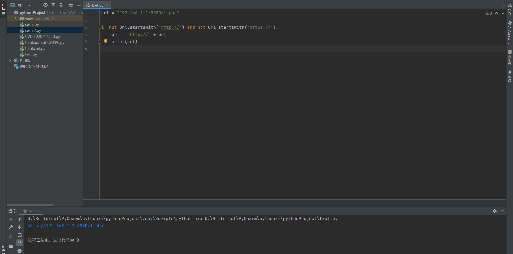

通过上述的图片测试，可以成功添加`http://`，那么最后就能组合起来。

## 3.2. 删除URL路径

例如用户输入：`http://127.0.0.1/1.php`,而我们在编写`POC`的时候我们后缀的`url`通常都是定义好的，也就是漏洞的后缀，例如我们组成的是`http://127.0.0.1/admin`,而用户输入的`1.php`我们是不需要的那么我们就需要对这部分的数据进行清除。

```python
url = "http://192.168.1.1:8080/1.php"

##以斜杠进行分割   
url = url.split("/")
##拼接字符，同时使用切片获取前面三个值，也就是（'http:', '', '192.168.1.1:8080'）
url = "/".join(url[:3])
print(url)
```

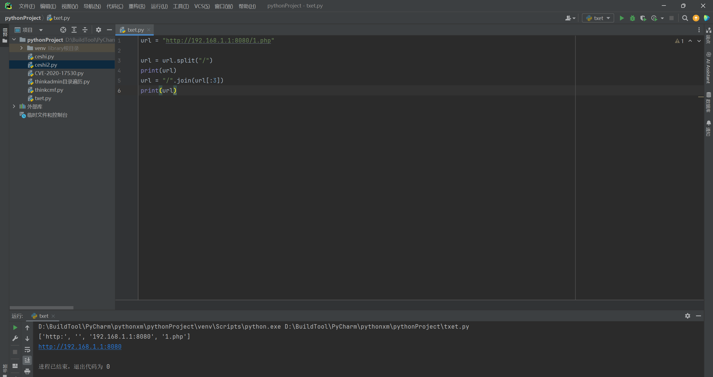

那么按照这样就能够得到我们想要让用户输入的内容。

## 3.3. 去掉URL末尾的斜杠

这个的话，就是单纯的去除斜杠，理论上其实可以通过删除`URL`路径的方式只是获取前三个值也能够实现，但是这里为了严谨，最好进行处理一下。

```python
url = "http://192.168.1.1:8080/"

##判断结尾有没有/，如果有就删除
if url.endswith("/"):
    url = url[:-1]
    print(url)
```

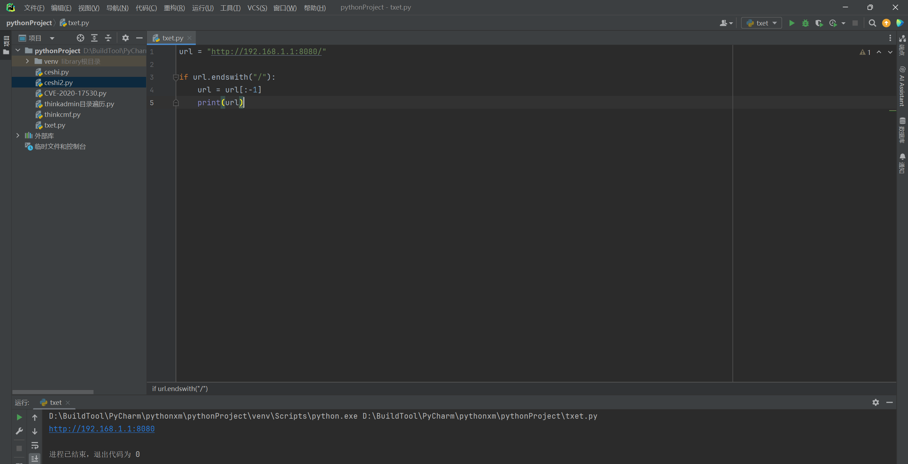

这里理论上来说，处理挺好的，但是有没有考虑过，如果用户结尾输入了很多的`"///"`，该怎么办，由于你无法控制用户输入，那么程序就会报错，看一个示例：

```python
url = "http://192.168.1.1:8080///////"

if url.endswith("/"):
    url = url[:-1]
    print(url)

url = url.split("/")
url = "/".join(url[:3])
print(url)
```

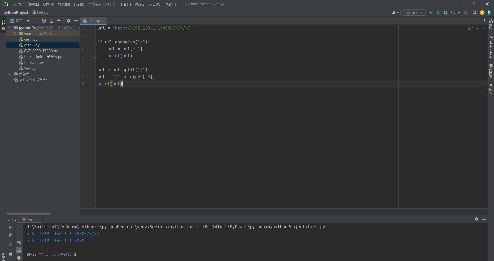

那么这样看下来还是直接取前三位值比较好，单纯的通过后面的"/"来判断，会导致切片值不好计算，不过影响也不大，可以结合起来用。

## 3.4. 结合模板

这里就是上述结合起来的模板，可以在写`POC`的时候添加进去，同时可能部分情况下考虑的并非那么准确，还需要对下面的代码根据实际情况进行优化，不过只要不是过于复杂的`POC`或`EXP`基本上可以拿过来直接用。

```python
def processing_url(url):
    ## 添加http://
    if not url.startswith('http://') and not url.startswith('https://'):
        url = 'http://' + url

        # 提取协议、域名和端口号
    url_parts = url.split('/')
    if len(url_parts) > 2:
        url_without_path = '/'.join(url_parts[:3])
    else:
        url_without_path = url  # 如果URL没有路径部分，则直接使用原URL

    # 去掉URL末尾的斜杠
    if url_without_path.endswith('/'):
        url_without_path = url_without_path[:-1]

    return url_without_path


if __name__ == "__main__":
    url = "192.168.1.1"
    processed_url = processing_url(url)  # 接收返回值
    print(processed_url)  # 打印处理后的URL

```

# 4. 响应码

在编写验证过程中，之前我们的代码都是依靠获取页面中的代码来校验是否存在漏洞，而这就会导致一个情况，假设地址是不通的，而我们的判断中会直接返回的是无漏洞，虽然不通确实相当于没有漏洞，但是还是不严谨，如下代码：

```python
if "code" in r.text and "info" in r.text:
   print(f"[+]{url}存在CVE-2020-25540目录遍历漏洞")
else:
   print(f"[-]{url}不存在CVE-2020-25540目录遍历漏洞")
```

## 4.1. 获取状态码

在编写脚本中，可以首先获取该IP地址的响应码，例如假设响应码是200，那么我们就定为能够通信，如果是403，那么我们定义为不通信。

```python
import requests


def code(url):
    try:
        ##对url进行get请求，设定响应时间
        response = requests.get(url, timeout=5)
        ##返回响应码
        return response.status_code
		##异常处理
    except requests.exceptions.RequestException as e:
        ##异常的时候返回异常内容，当然这里就需要靠自己去编写了，不过这里可以直接不输出，直接就判断URL有问题。
        print(f"Request error:{e}")
        return None


if __name__ == "__main__":
    url = "https://www.baidu.com/"
    content = code(url)
    ##判断状态码
    if content is not None:
        print("状态码:", content)
    else:
        print("url存在异常")

```

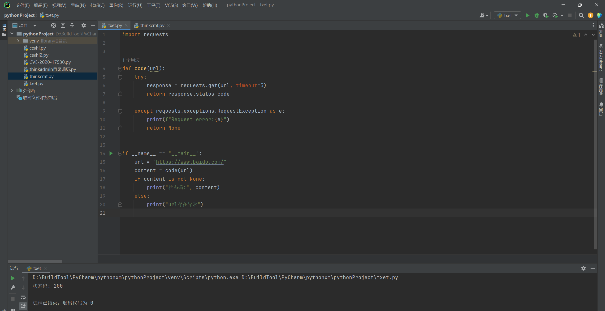

### 4.1.1. 错误状态

这里我将百度的域名修改一个字母，自然就不会通信了，那么就会返回报错值与通信状态，这里如果你不想让用户看到这个值，可以将我红框框选起来的地方删除。

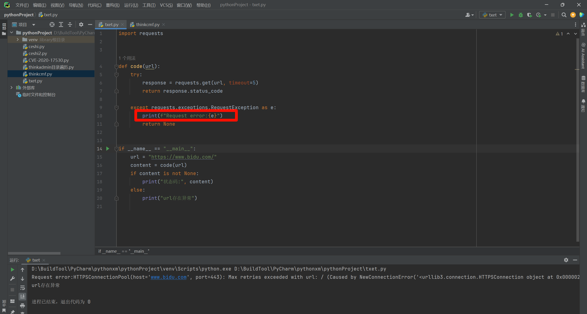

# 5. 文件读取

在使用的过程中，我们可能会存在需要测试多个`IP`地址的情况，需要从文件中读取`IP`，然后将`IP`地址提交给下一步处理。

读取一个文本文件，并将文件中的每一行（假定每行包含一个`URL`）作为一个元素添加到一个列表中。如果文件无法读取（例如，由于文件不存在或没有读取权限），则函数会捕获`OSError`异常，并打印一条错误消息，然后返回一个空列表。

```python
def readFile(file_path):
    try:
        with open(file_path, 'r') as file:
            urls = [line.strip() for line in file]   ## 这行代码使用了列表推导式（list comprehension）来创建一个新的列表，其中包含了从文件中读取的每一行，并移除了每行首尾的空白字符（如空格、换行符、制表符等）。
        return urls
    except OSError:
        print(f"无法读取文件: {file_path}")
        return []

    # 测试示例

file_path = 'urls.txt'  # 文件路径
url_list = readFile(file_path)
print(url_list)  # 输出文件中的所有URL列表
```

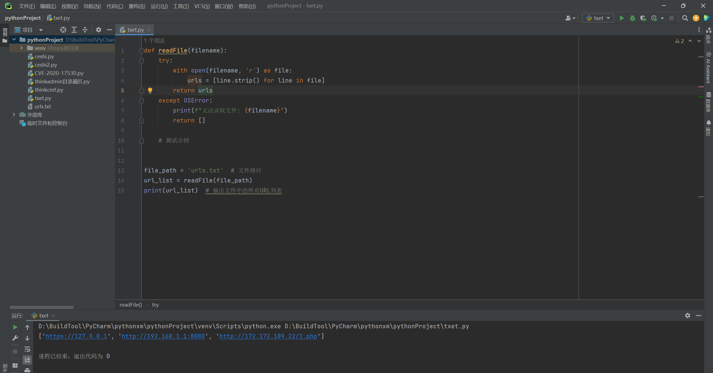

# 6. 颜色处理

这里我们在部分脚本中，可以看到存在漏洞显示绿色，不存在漏洞显示红色，而这里我们也对其进行添加一个代码，这个就是娱乐，可有可无，主要用于多线程测试的时候，可能存在闪屏很快的情况下，无法及时的看到。

## 6.1. 自定义颜色处理

这个自定义颜色就是手动制订好颜色，这个颜色我也是百度上中的，颜色的代码是需要其他的代码进行编制的，这里我们使用模2的方式模拟多线程。

```python
GREEN = '\033[92m'  ##绿色
RED = '\033[91m'  #红色
ENDC = '\033[0m'  # 重置颜色

for i in range(10):
    if i % 2 == 0:
        print(f"{GREEN}[+]{i}存在CVE-2020-17530远程命令执行漏洞{ENDC}")
    else:
        print(f"{RED}[-]{i}不存在CVE-2020-17530远程命令执行漏洞{ENDC}")
```

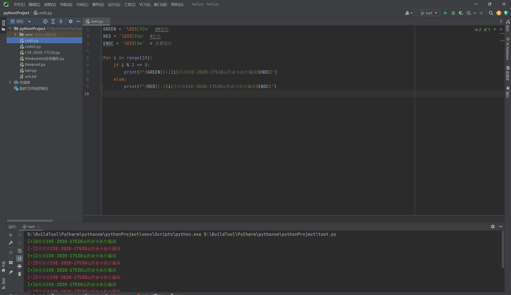

## 6.2. 颜色模块处理

这个就是使用模块进行处理颜色，但是这样的话，就需要用户在使用脚本的时候需要安装模块，整体来说并不是很好，但是作为了解吧。

代码中，`Fore.GREEN`和`Fore.RED`分别用于设置文本的前景色为绿色和红色。`Style.RESET_ALL`用于重置所有样式设置，确保之后的输出不会受到之前设置的影响。

```python
from colorama import Fore, Style

for i in range(10):
    if i % 2 == 0:
        print(f"{Fore.GREEN}[+]{i}存在CVE-2020-17530远程命令执行漏洞{Style.RESET_ALL}")
    else:
        print(f"{Fore.RED}[-]{i}不存在CVE-2020-17530远程命令执行漏洞{Style.RESET_ALL}")

```

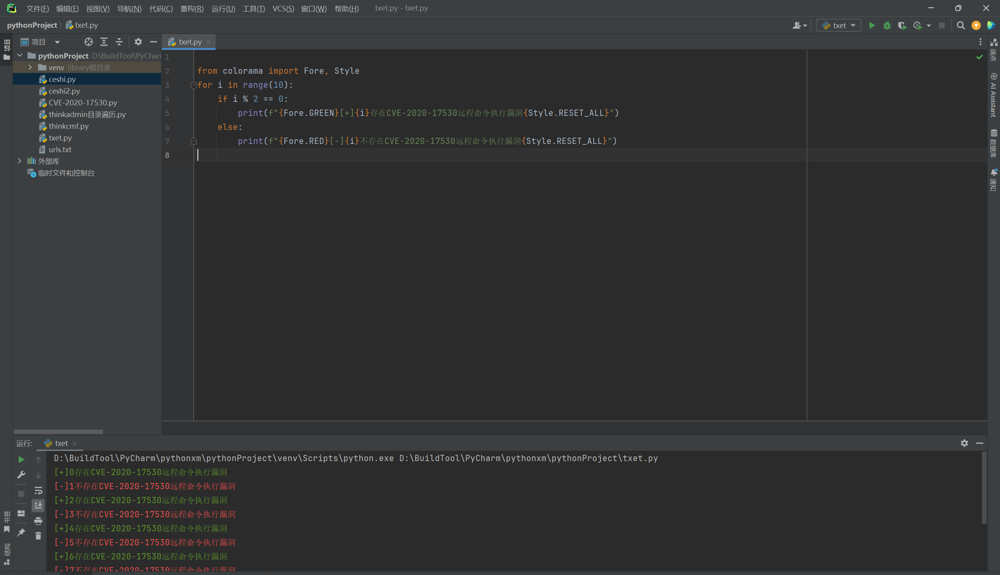

# 7. 进度条

关于进度条，这里我测试了很多办法，网上很多都是使用计算的方式来判断，很多只是通过模拟比如下载字节等等方式来展现进度条，但是真正去写入到脚本中就会发现很复杂，而使用`tqdm`模块就比较简单了，而正常我们需要展现进度条的情况下，一定是读取脚本中多个`url`测试的时候使用的，所以通常不会时时展现测试结果，正常都会将结果写入到一个文件中，而`cmd`页面只会展示一个进度条，用于估算。

但是这里有一个问题，就是需要使用者安装`tqdm`模块，但是吧，都使用脚本了，这些模块安装也都是小事。

```python
import requests
import argparse
from tqdm import tqdm


def file(file_name):
    try:
        ##读取用户输入的url文件，同时打开result.txt（存放运行后结果的，当然你也可以设定参数，让用户输入），同时注意编码问题，否则可能存在无法读取的情况，直接使用utf-8就可以了。
        with open(file_name, 'r', encoding='utf-8') as input_file, open("result.txt", 'w', encoding='utf-8') as output_file:
            #sum(1 for _ in input_file）主要是一个简短的计算，遍历文件的每一行，然后读一行计为1，最后相加得到总行数，这里是有一共模块的，但是消耗内存比较大，这里就计算吧
            num_lines = sum(1 for _ in input_file)
            ##重置文件头，刚刚我们读取完光标到最后了，我们重置光标
            input_file.seek(0)
            ##进度条，total=num_lines总行苏，desc="测试漏洞连通性" 提示语，ncols=100百分比一百，
            with tqdm(total=num_lines, desc="测试漏洞连通性", ncols=100) as pbar:
                ##读取文件的每一行
                for line in input_file:
                    ##去除每行末尾的换行符
                    url = line.strip()
                    ##下面还要说？？？？
                    try:
                        response = requests.get(f"{url}", timeout=3)
                        if response.status_code == 200:
                            ##写入文件
                            output_file.write(f"[+]{url}存在CVE-2020-25540目录遍历漏洞\n")
                        else:
                            output_file.write(f"[-]{url}不存在CVE-2020-25540目录遍历漏洞\n")
                    except Exception as e:
                        output_file.write(f"[-]{url}存在异常请检测！\n")
					##更新进度条
                    pbar.update()

    except Exception as e:
        print(e)


def main():
    parser = argparse.ArgumentParser()
    ##让用户输入
    parser.add_argument("-f", dest="file", required=False,
                        help="The default vulnerability port is 80")
    args = parser.parse_args()
    file(args.file)


if __name__ == '__main__':
    main()

```

上述代码，最核心的就是通过计算需要读取的文件总长度，如何根据运行的情况更新进度条，例如下面图，总行数是`4`行，那么每执行完一行就是更新`百分之25`进度。。。。。

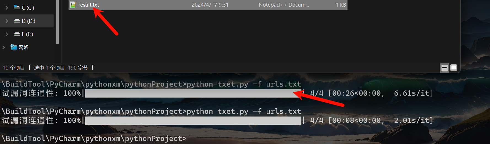

结果图片：

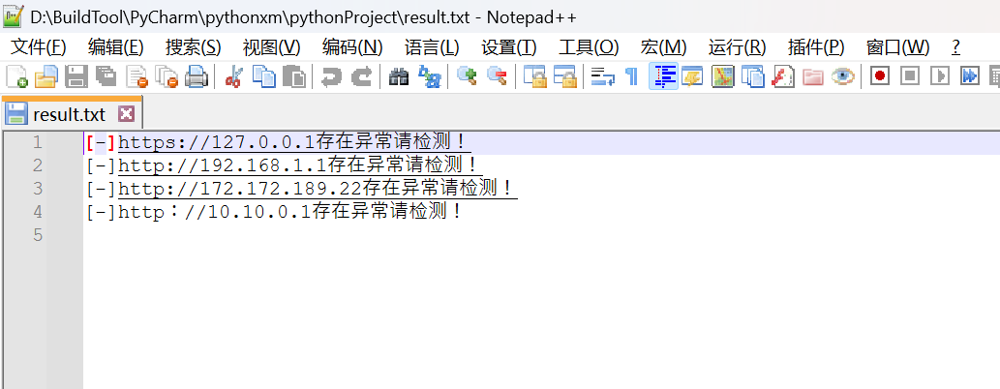

## 7.1. 暂停

在读取文件中，如果行数过多，但是我们又不想执行了，倘若直接快捷键`ctrl+c`会出现报错，这就是由于在代码中并未添加这个快捷键正常退出的判断。

那么这里我们就添加一个正常判断退出的程序，其实就是一条命令，在之前的程序中也提到过，但是用法好像存在问题，而且之前都是只是执行单条的验证，所以基本上也不会使用到这个快捷键。

下述代码就是在上述代码的第`33`行，我们将这个代码在添加上一条异常判断，而对于`KeyboardInterrupt异常`的解释是：在`Python`中，`Keyboard Interrupt`是一个特殊的异常，它的官方名称是`KeyboardInterrupt`。当用户在终端或命令行界面按下`"Ctrl+C"`组合键时，`Python`解释器会捕获到这个信号，并抛出一个`KeyboardInterrupt`异常。这个异常的目的是允许程序在需要时优雅地停止执行。

```python
    except KeyboardInterrupt:  # 捕获KeyboardInterrupt异常
        print("用户已中断程序执行。")
        sys.exit(0)  # 优雅地退出程序，返回状态码0表示正常退出
    except Exception as e:
        print(e)
```

# 8. 总结

基本上能使用到的函数或者模块等等，在上述几篇文章中基本上介绍的也都差不多了，后续就是根据不同的`POST`和`GET`请求不通或者类似文件上传这一类的漏洞编写几个案例`POC`或`EXP`。

目前我们基本上都是设计单线程运行，后续还会设计多线程、模板化、工具等编写`POC`的方式。
