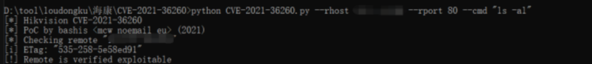
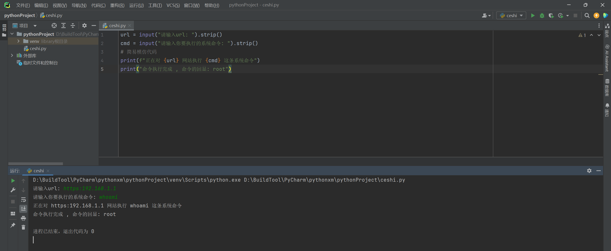
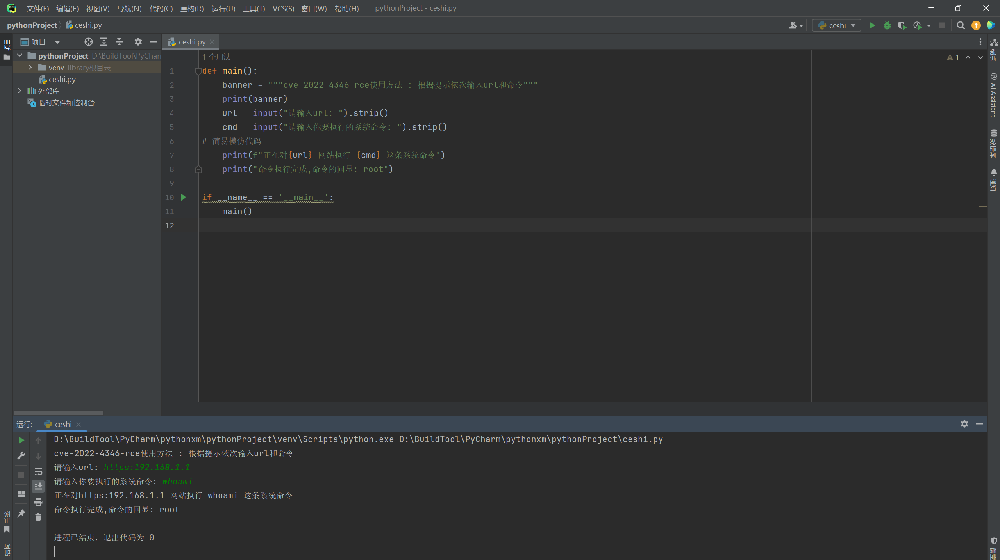
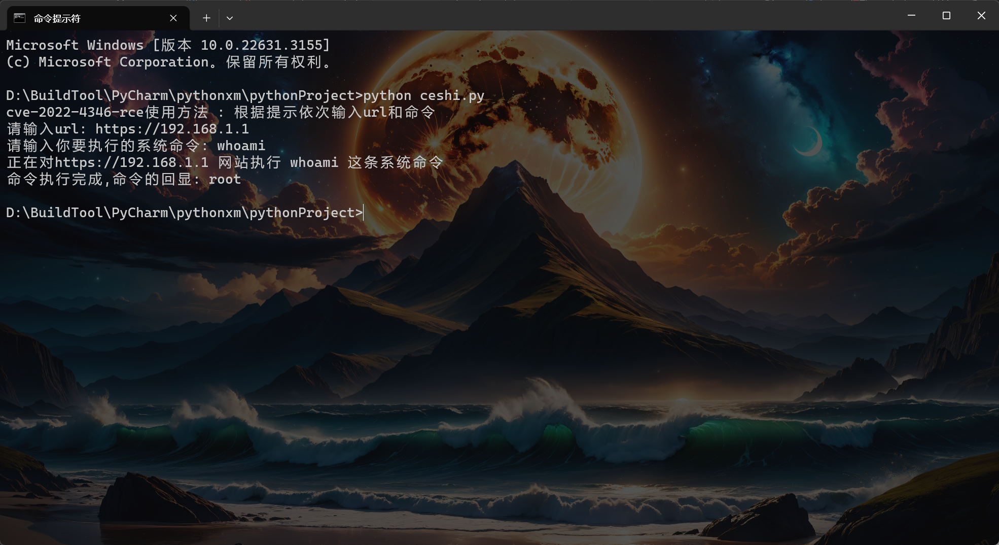
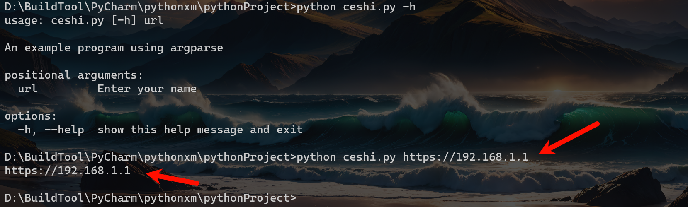
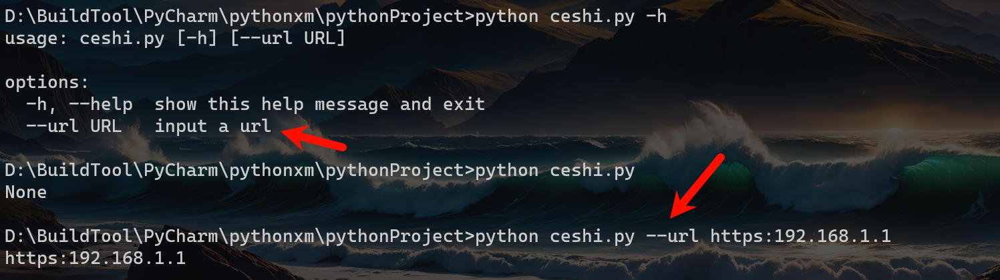
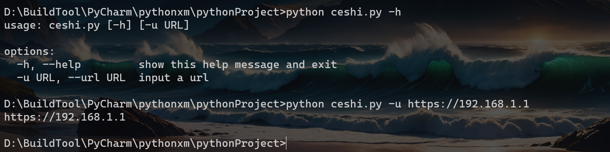
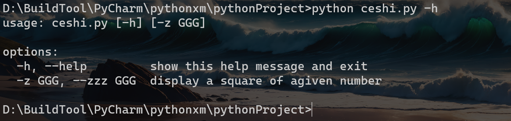
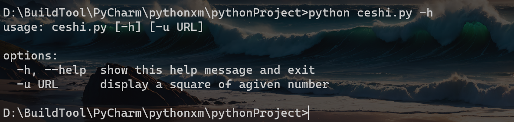
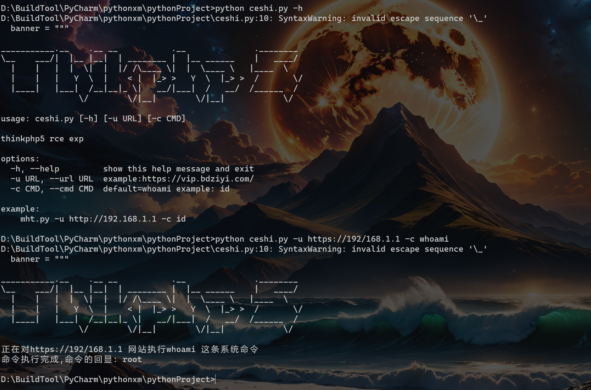

# 1. 命令行编写

我们在使用`POC`或者`EXP`的时候基本上都是在`CMD`的黑窗口中运行的，除非别人封装好的`.exe`文件，否则基本上都需要输入一些如：`python XXXX.py -u XXX.COM`等。

这里我们找一个`POC`来展示一下，这里直接找我以前写的一篇文章中使用的`POC`演示吧。可以看到这里我们需要输入一系列的参数，而所谓的命令行编写：

通过命令行的方式和用户交互 , 接收用户输入的数据 , 然后处理 , 结果再次通过命令行反馈给用户



python中有很多接收用户命令的方式，而这里我们就例举一些，但是不需要全部了解，比如我们主要以编写POC和EXP为主，并非为了学编程而看这个文章。

## 1.1. input

这个函数，应该但凡懂知道怎么输入`("Hello World")`应该都了解过这个参数，这里我也不说了，毕竟我也不是程序猿，我解释不清楚，自行百度。

案例：

这只是一个简单的小案例，而在实际编写中基本上不会使用input去接受参数，同时编写的时候我们的思路其实就是很简单，用户需要输入`URL`、`执行的命令`、`端口号`等，而这些值都需要去接收，然后将值复制到某给参数上，再将参数赋值到代码中去运行，这样就完成了大致的逻辑，同时逻辑多多少少会存在点问题，毕竟不是专业搞程序。

```python
url = input("请输入url: ").strip()  ##.strip()默认去除头尾指定的字符（默认空格）
cmd = input("请输入你要执行的系统命令: ").strip()
# 简易模仿代码
print(f"正在对{url} 网站执行 {cmd} 这条系统命令")
print("命令执行完成 , 命令的回显: root")
```



### 1.1.1. 美化代码

这里就添加一下提示语，所谓的提示语就是类似于说明，比如那个制作的，这个脚本是干嘛的......等等等，这里就添加一个`banner`并且将其封装到代码中。

```python
def main():
    banner = """cve-2022-4346-rce使用方法 : 根据提示依次输入url和命令"""
    print(banner)
    url = input("请输入url: ").strip()
    cmd = input("请输入你要执行的系统命令: ").strip()
# 简易模仿代码
    print(f"正在对{url} 网站执行 {cmd} 这条系统命令")
    print("命令执行完成,命令的回显: root")

if __name__ == '__main__':    ##主要是怕将main当成模块导入，而具体的解释自行搜索。
    main()
```



下面就是在命令行中去执行代码。



## 1.2. sys模块

`sys`即`system`，`系统之意`。该模块提供了一些接口，用于访问 Python 解释器自身使用和维护的变量，同时模块中还提供了一部分函数，可以与解释器进行比较深度的交互。

而这里我们更多的是需要使用到这个子参数`sys.argv`，其他的我们暂时不学，后面要是用到在解释。

```python
import sys #导入模块

print(sys.argv) # 接收py脚本传进来的参数 , 返回一个列表 , 一般用来获取命令行参数# 我们编写poc可以通过它来获取用户传递过来的url , 要执行的命令等
```

退出函数：

```
sys.exit(0) # 一旦执行这行代码 , 程序会直接退出 , 安全退出
sys.exit(1) # 一旦执行这行代码 , 程序会直接退出 , 报错退出
```

### 1.2.1. 美化代码

这里我们使用`sys模块`来对代码进行优化，这里会发现使用`PyCharm`直接执行的话就会出现里面退出的情况，这里就需要使用命令行终端来执行！

```python
import sys


def main(url, cmd):
    # 简易模仿代码
    """真正具体对指定url执行命令的代码"""
    print(f"正在对{url} 网站执行{cmd} 这条系统命令")
    print("命令执行完成,命令的回显: root")


if __name__ == '__main__':
    ##提示语
    banner = """welcome use ceshi
    使用方法 : python3 ceshi.py http://www.baidu.com id"""
    ##输出提示语
    print(banner)
    if len(sys.argv) == 3:    ## 判断用户输入的参数需要为三个，而这里相当于形成三个下标。而下标0其实就是这个脚本
        url = sys.argv[1]		## 其中下标为1的是URL。
        cmd = sys.argv[2]       ## 其中下标为2的是命令。
        main(url, cmd)
    else:
        print("请按照提示输入:")

```


## 1.3. 进度条编写

可能在我们很执行的界面中都会存在进度条，而这里我们就稍微了解一些，主要还是用在比如从文档中读取多个`URL`测试的时候显示进度，正常单个测试基本上不用。

```python
# 打印进度条
import time
def progress(percent):
    if percent > 1:
        percent = 1
    res = int(50 * percent) * '#'
    print('\r[%-50s] %d%%' % (res, int(100 * percent)), end='')

##以上代码可以直接用，不需要修改，以下内容需要根据实际情况进行替换，最终将数据提交即可。
    
recv_size = 0  #每次下载得到的数据
total_size = 786567  #总下载数据
while recv_size < total_size:  ##判断
    time.sleep(0.01) # 下载了1024个字节的数据
    recv_size += 1024 # recv_size=2048   ##模拟每一次下载的数据
# 打印进度条
    percent = recv_size / total_size # 1024/333333
    progress(percent)
```

第一段解释：

* 如果`percent`大于1，则将其设置为1（确保百分比不超过100%）。  
* 使用`int(50 * percent)`计算应该打印多少个`#`字符来代表进度。  
* 使用`print`函数打印进度条。`\r`是回车符，用于将光标移回行首，这样每次打印都在同一行。`end=''`表示打印结束后不换行。
* 同时这里注意，每一次我们看到的是增长的状态，实际是，第一打印一个#，然后暂替0.01秒，第二次打印两个##，依次实现，所以我们看来是增加，实际是不换行将每一次执行的值，在同一行输出，只是由于每次一次输出的值越多，所以显示的长度就越长。

第二段解释：

- 使用`time.sleep(0.01)`模拟每次下载需要的时间。  
- `recv_size += 1024`模拟每次下载1024个字节的数据。  
- 计算下载的百分比，并调用`progress`函数打印进度条。

## 1.4. argparse模块

`argparse`模块是 `Python` 标准库中推荐的命令行解析模块 , 也是一个内置模块，`argparse`模块是命令行选项、参数和子命令解析器。可以让人轻松编写用户友好的命令行接口。适用于代码需要频繁地修改参数的情况。

特点：

```
- 支持可选参数
- 支持子命令
- 支持重复参数个数统计
- 更加友好的使用提示
```

这里由于我们编写`POC`或者`EXP`，多数都是很难讲清楚这些模块的参数，这里最好就是自行去找一些专门搞编程人写的模块介绍，这里我们多数以编写`POC`或`EXP`编写角度去解释，甚至可能解释不清楚。

参考：[python命令行选项argparse模块详解](https://blog.csdn.net/weixin_41657089/article/details/135426689)

参考：[argparse --- 命令行选项、参数和子命令解析器 — Python 3.8.18 文档](https://docs.python.org/zh-cn/3.8/library/argparse.html)

基础必须要用的到命令，也是每次用模块都要使用的函数：

```python
# 导入模块
import argparse
# 实例化一个对象 , 并添加命令行的描述信息,一般在脚本中用来介绍脚本是干嘛的
parser = argparse.ArgumentParser(description="这是脚本的提示信息")
# 调用parse_args方法
parser.parse_args()
```

这里默认添加以上三条命令后，在执行的时候后面添加`-h`的操作，默认就会显示-h的内容，这部分内容可以修改的，同时如果执行的时候后面不添加`-h`的话，就是直接结束执行。


### 1.4.1. 位置参数

位置参数是在命令行中必须提供的参数，它们通常用于传递位置相关的信息或必需的参数值。在`argparse`中，要添加位置参数，我们使用`add_argument()`方法，并指定参数的名称和一些帮助信息。

```python
import argparse

parser = argparse.ArgumentParser(description="An example program using argparse")

parser.add_argument("url", help="Enter your name")   #前面的是url，后面的是介绍，这里前面写url，那么下面就是url

args= parser.parse_args() 

print(args.url)  ##将输入的内容返回，实际的情况的将这个数据带入，而这里直接展示出来
```



### 1.4.2. 可选参数

可选参数是在命令行中提供的，但不是必须的参数。它们通常用于配置程序行为，设置程序的不同模式，或者指定一些可选的参数值。

类似于位置参数，我们可以使用add_argument()方法来添加可选参数。我们可以指定短选项（使用单个破折号-）或长选项（使用双破折号--），并提供一些帮助信息。

```python
import argparse

parser = argparse.ArgumentParser()

parser.add_argument("--url", help="input a url")

args = parser.parse_args()
# 输入args.ver的值
print(args.url) # 默认不指定值的时候为None
```



#### 1.4.2.1. 短选项

短选项，简单来说就是输入两个`-`不方便，还要加一个`url`不方便，那就可以直接设置为`-u`，而写明的属性注意事项，能了解那么就知道怎么修改了。

```python
import argparse
parser = argparse.ArgumentParser()
parser.add_argument("-u", "--url", help="input a url",)   #前面是短选项，而后面的url是为了了解参数，同时下面联动
args = parser.parse_args()
print(args.url)  ##参数是写u，那么--url就无法用，同时显示的是u，不太容易理解。
```



#### 1.4.2.2. 部分属性注意事项

`dest` 通常会作为 `add_argument()`的第一个参数 , 对于可选参数来说 , 默认属性名就是参数名 , 如果有`dest`指定则是`dest值`如果你想给一个参数设置一个默认值 , 可以通过`default=1`关键字实现，当 `action="store"`也就是默认的 , 是接收参数存进来的值 , 并存储。

```python
import argparse
parser = argparse.ArgumentParser()
parser.add_argument("-z","--zzz", dest="ggg",type=int, default=1,help="display a square of agiven number",action="store")
args = parser.parse_args()
# print(args.zzz) # 报错 , 因为指定了dest关键字 , 一般情况下参数名
print(args.ggg)
```



示例：

```python
import argparse
parser = argparse.ArgumentParser()
parser.add_argument("-u",dest="url",type=int, default=1,help="display a square of agiven number",action="store")
args = parser.parse_args()
print(args.url)
```



# 2. 小模版

这里主要展示一个小模版条件允许下可以直接修改。

## 2.1. textwrap模块

`TextWrap`模块是一个`Python`模块，它提供了一些函数和方法来处理文本字符串的包装和填充。这个模块的主要功能是将一个长字符串根据指定的宽度分成多行，可以用于格式化文本输出，使其在指定的行数内完成显示。这个过程通常用于控制文本在终端、文本框、报表或其他输出媒介上的布局，以确保文本在不超出指定宽度的情况下可读性良好。

参考：[python textwrap 模块介绍](https://blog.csdn.net/hihell/article/details/114576570)

这里我们所需要的可以直接按照我下面的复制使用，如果想了解原理，自己去看吧！

## 2.2. 示例

这里看图片中的内容，第一行就显示报错了，但是这里的报错不用管，主要是由于字符画导致的，不会影响执行。

```python
import argparse
import textwrap
def main(url, cmd):
    # 简易模仿代码
    """真正具体对指定url执行命令的代码"""
    print(f"正在对{url} 网站执行{cmd} 这条系统命令")
    print("命令执行完成,命令的回显: root")

if __name__ == '__main__':
    banner = """
___________.__    .__ __           .__              .________
\__    ___/|  |__ |__|  | ________ |  |__ ______    |   ____/
  |    |   |  |  \|  |  |/ /\____ \|  |  \____ \   |____  \ 
  |    |   |   Y  \  |    < |  |_> >   Y  \  |_> >  /       \/
  |____|   |___|  /__|__|_ \|   __/|___|  /   __/  /______  /
                \/        \/|__|        \/|__|            \/ 
"""
    print(banner)
    parser = argparse.ArgumentParser(description='thinkphp5 rce exp',formatter_class=argparse.RawDescriptionHelpFormatter,epilog=textwrap.dedent('''example:
    mht.py -u http://192.168.1.1 -c id'''))  ##这里主要是使用了textwrap模块来辅助输入提示语，当然你也可以不写。
    parser.add_argument("-u", "--url", dest="url", type=str, help=" example:https://vip.bdziyi.com/")
    parser.add_argument("-c", "--cmd", dest="cmd", type=str, default="whoami",help="default=whoami example: id")
    args = parser.parse_args()
    main(args.url, args.cmd)
```



## 2.3. 字符画网站

```
根据文字生成字符画：
http://patorjk.com/software/taag
http://www.network-science.de/ascii/
根据图片生成字符画：
http://www.degraeve.com/img2txt.php
http://life.chacuo.net/convertphoto2char
根据流程图生成字符画：
http://asciiflow.com/
linux上生成字符画
https://www.jeddd.com/article/linux-fancy-text-generator.html
```


