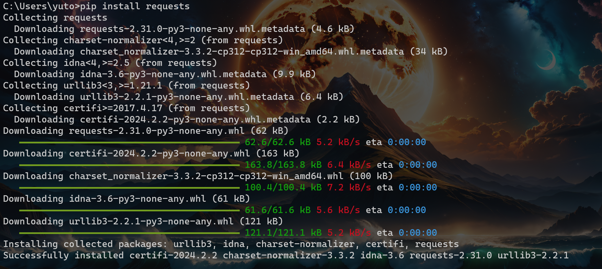
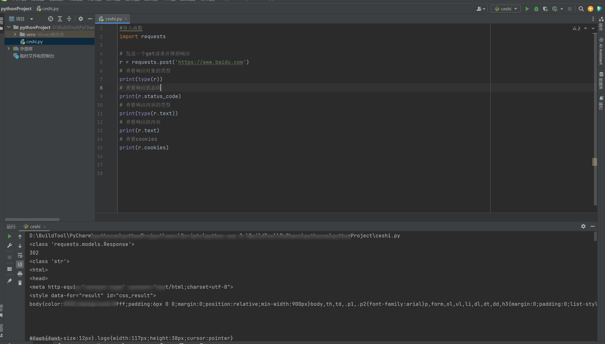
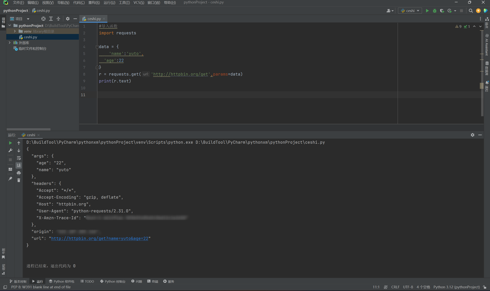
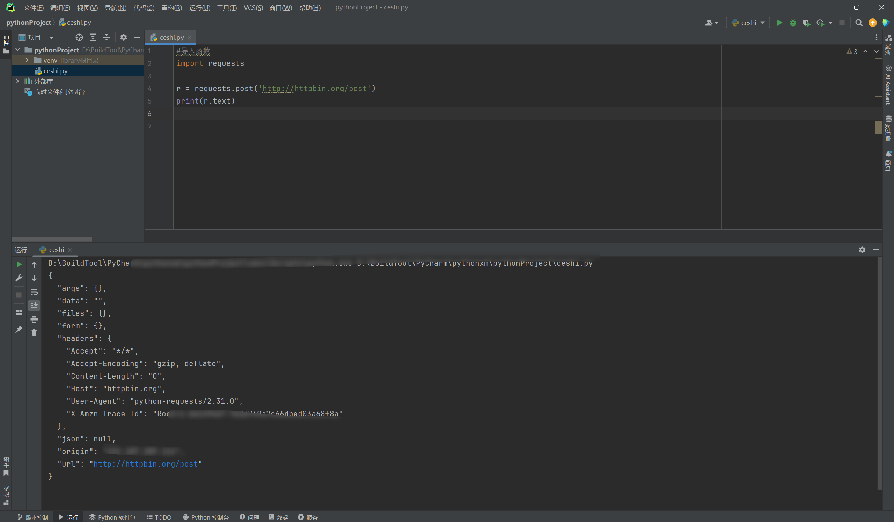
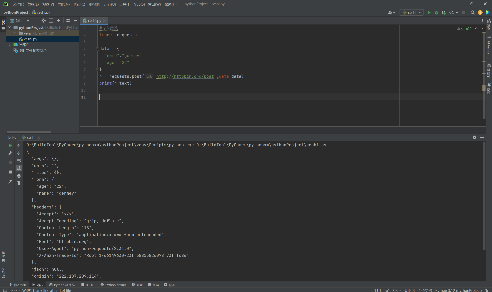
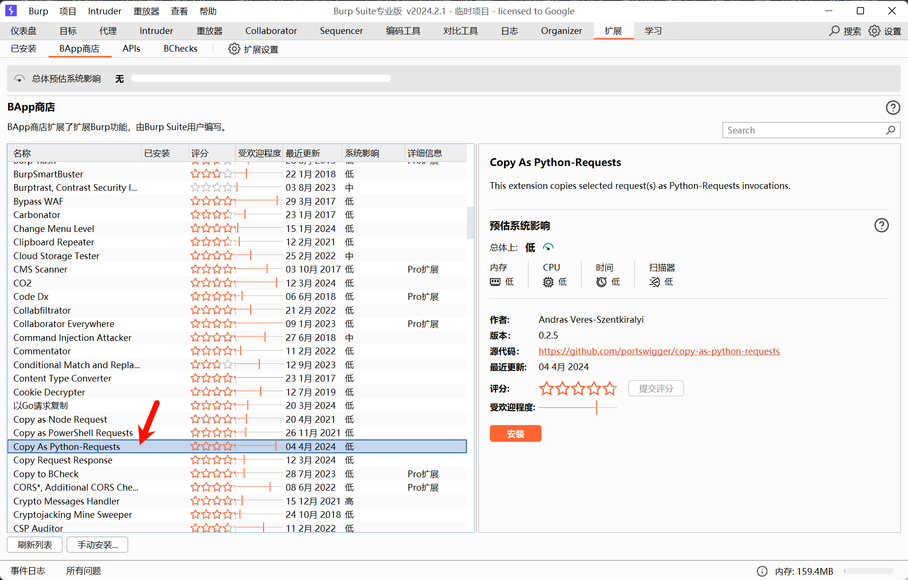

# 1. os模块

OS就是“operating system”的缩写，顾名思义，`os`模块提供的就是各种 Python 程序与操作系统进行交互的接口。而这里我们在编写POC或EXP的时候会用到文件夹类的操作，而如果当当是操作文件，这里还是建议使用Open()，以及还有一些其他的函数操作，这里不赘述，很多参数记不得无所谓，能看懂或者通过搜索来了解即可。

同时OS下还有一个Path子模块，下面又有很多的参数，这里就慢慢去了解吧。这里我也只是列举一些常见的函数用法。


```python
#导入函数
import os

#查看OS模块下的函数
print(dir(os))

#查看OS.path模块下的函数
print(dir(os.path))
```


## 1.1. os模块常用函数

这里我只是将一些常用的函数列举出来，具体的解释与语法，可以自行去百度搜索，或者使用人工智能举例给你看，我们是主要以写POC与EXP为主，并非是以编程的角度去学习，所以举例子的话，怕被编程人嘲笑~~~~~所以你们直接去看吧！！！（其实就是因为我也不熟练）。

以下是示例！！！

### 1.1.1. os.name()

显示当前平台（操作系统），nt表示Windows、posix表示Linux。

```python
>>> os.name
'nt'
```


### 1.1.2. os常用函数

没涉及到的或者没有的自行百度搜索！！

参考：[Python之OS模块39个常用函数详解](https://blog.csdn.net/wulishinian/article/details/106420532)

```python
os.name # 输出字符串指示当前使用平台。win-> 'nt '; Linux->'posix'
os.getcwd() # 返回当前进程的工作目录。
os.chdir("") # 改变当前工作目录到指定的路径;相当于cd。
os.curdir # 返回当前目录:('.')
os.pardir # 获取当前目录的父目录字符串名:( '..')
os.mkdir('目录') # 以数字权限模式创建目录。默认的模式为 0777 (八进制)
os.makedirs('目录1/目录2') # 可生成多层递归目录
os.rmdir('目录') # 删除单级空目录，若目录不为空则无法删除，报错;相当于shell中rmdirdirname
os.listdir('目录') # 列出指定目录下的所有文件和子目录，包括隐藏文件，并以列表方式打印
os.remove("目录文件") # 删除一个文件
os.removedirs('目录1') # 若目录为空,则删除,并递归到上一级目录，如若也为空，则删除,并递归倒上一层
os.rename("oldname", "newname") # 重命名文件/目录
os.system("bash command") # 运行shell命令，直接显示
```

## 1.2. os.path模块常用函数

os.path 模块是系统路径操作模块，但实际的原理可以把它认为是处理包含斜杠("/")和反斜杠("\")字符串的模块，其中，斜杠("/")是 linux 系统下的路径分隔符，和反斜杠("\")是 windows 系统下的路径分隔符。

也就是说，只要提供一个包含斜杠和反斜杠的字符串，os.path 模块都能处理，哪怕该字符串不是一个有效的真正路径，因为 os.path 模块的源码实现就是根据操作系统来处理斜杠和反斜杠的操作的。

### 1.2.1. 常用函数

没涉及到的或者没有的自行百度搜索！！

参考：[Python之 os.path 模块详解](https://blog.csdn.net/aiwangtingyun/article/details/105298831)

```python
os.path.abspath('path') # 返回path规范化(符合平台的路径分隔符)的绝对路径
os.path.split('path') # 将path(path的分隔符必须是/)分割成目录和文件名二元组返回
os.path.dirname(path) # 返回path的目录。其实就是os.path.split(path)的第一个元素
os.path.basename(path) # 返回path最后的文件名。如何path以/或\结尾，那么就会返回空值。即
os.path.split(path)的第二个元素
os.path.exists(path) # 如果path存在，返回True;如果path不存在，返回Falseos.path.isabs (path)如果path是绝对路径，返回True
os.path.isfile(path) # 如果path是一个存在的文件，返回True。否则返回False
os.path.isdir(path) # 如果path是一个存在的目录，则返回True。否则返回False
os.path.join(path1[, path2[，...]]) # 将多个路径组合后返回，第一个绝对路径之前的参数将被忽略
```

## 1.3. POC/EXP常用

```python
os.remove("filename") # 删除一个文件
os.rename("oldname", "newname") # 重命名文件/目录
os.name # 输出字符串指示当前使用平台。win-> 'nt '; Linux->'posix'
os.system("bash command") # 运行shell命令，直接显示
os.path.isfile(path) # 如果path是一个存在的文件，返回True。否则返回False
os.path.isdir(path) # 如果path是一个存在的目录，则返回True。否则返回False
os.path.abspath('path') # 返回path规范化(符合平台的路径分隔符)的绝对路径
os.path.exists(path) # 如果path存在，返回True;如果path不存在，返回Falseos.path.isabs (path)如
果path是绝对路径，返回True
os.path.join(path1[, path2[，...]]) # 将多个路径组合后返回，第一个绝对路径之前的参数将被忽略
```

# 2. time模块

Python 提供了一个 time 和 calendar 模块可以用于格式化日期和时间。时间间隔是以秒为单位的浮点小数。每个时间戳都以自从1970年1月1日午夜（历元）经过了多长时间来表示。Python 的 time 模块下有很多函数可以转换常见日期格式。

```python
#导入函数
import time

#查看时间
print(time.ctime())
```

## 2.1. time模块常用函数

这里我们多数是我们编写过程中会用到的，主要是列出时间，其他的用到的不多。

参考：[python time模块常用函数总结](https://blog.csdn.net/Huangqingmeng/article/details/110788850)

```python
#查看时间
print(time.ctime())
#2024-04-08 15:35:22
print(time.strftime("%Y-%m-%d %H:%M:%S"))
#2024-04-08 15:35:22 PM
print(time.strftime("%Y-%m-%d %H:%M:%S %p"))
#2024-04-08 15:35:22
print(time.strftime("%Y-%m-%d %X"))
#<class 'str'>
print(type(time.strftime("%Y-%m-%d %X")))
```

# 3. random模块

Python标准库中的random函数，可以生成随机浮点数、整数、字符串，甚至帮助你随机选择列表序列中的一个元素，打乱一组数据等。

```python
#导入函数
import random
```

## 3.1. random模块常用模块

参考：[标准库`random`函数大全：探索Python中的随机数生成【第107篇—`random`函数大全】_random标准库函数-CSDN博客](https://shangjinzhu.blog.csdn.net/article/details/136359543)

```python
import random
print(random.random()) #[0,1)----float    大于等于0且小于1之间的小数
print(random.randint(1,3))  #[1,3]    大于等于1且小于等于3之间的整数
print(random.randrange(1,3)) #[1,3）    大于等于1且小于3之间的整数（左开右闭）可指定步长
print(random.choice([1,'23',[4,5]]))   #1或者23或者[4,5]
print(random.sample([1,'23',[4,5]],2)) #列表元素任意2个组合
print(random.uniform(1,3)) #大于等于1小于等于3的小数，如1.927109612082716 
item=[1,3,5,7,9]
random.shuffle(item) #打乱item的顺序,相当于"洗牌"
print(item)
```

# 4. json模块

来源网上：

如果我们需要持久化 Java 对象比如将 Java 对象保存在文件中，或者在网络传输 Java 对象，这些场景都需要用到序列化。

简单来说：

- **序列化**：将数据结构或对象转换成二进制字节流的过程
- **反序列化**：将在序列化过程中所生成的二进制字节流转换成数据结构或者对象的过程

对于 Java 这种面向对象编程语言来说，我们序列化的都是对象（Object）也就是实例化后的类(Class)，但是在 C++这种半面向对象的语言中，struct(结构体)定义的是数据结构类型，而 class 对应的是对象类型。

下面是序列化和反序列化常见应用场景：

- 对象在进行网络传输（比如远程方法调用 RPC 的时候）之前需要先被序列化，接收到序列化的对象之后需要再进行反序列化；
- 将对象存储到文件之前需要进行序列化，将对象从文件中读取出来需要进行反序列化；
- 将对象存储到数据库（如 Redis）之前需要用到序列化，将对象从缓存数据库中读取出来需要反序列化；
- 将对象存储到内存之前需要进行序列化，从内存中读取出来之后需要进行反序列化。

维基百科是如是介绍序列化的：

> **序列化**（serialization）在计算机科学的数据处理中，是指将数据结构或对象状态转换成可取用格式（例如存成文件，存于缓冲，或经由网络中发送），以留待后续在相同或另一台计算机环境中，能恢复原先状态的过程。依照序列化格式重新获取字节的结果时，可以利用它来产生与原始对象相同语义的副本。对于许多对象，像是使用大量引用的复杂对象，这种序列化重建的过程并不容易。面向对象中的对象序列化，并不概括之前原始对象所关系的函数。这种过程也称为对象编组（marshalling）。从一系列字节提取数据结构的反向操作，是反序列化（也称为解编组、deserialization、unmarshalling）。

综上：序列化的主要目的是通过网络传输对象或者说是将对象存储到文件系统、数据库、内存中。

## 4.1. json模块常用函数

这里有错就点出来，或者自行去百度搜索吧，我是废物！！！

参考：[深入理解Python中的JSON模块](https://blog.csdn.net/weixin_52908342/article/details/136311503)

```python
import json

dic = {"status": 200, "msg": "success"}

# 序列化
res = json.dumps(dic)
print(res, type(res)) # {"status": 200, "msg": "success"} <class 'str'>

# 反序列化
l = json.loads(res)
print(l, type(l)) # {'status': 200, 'msg': 'success'} <class 'dict'>

# 将序列化的结果写入文件
res = json.dumps(dic)
with open('test.json', mode='w', encoding='utf-8') as f:
json.dump(dic, f)

# # 将文件读取的json格式的字符串反序列化出来
with open('test.json', mode='r', encoding='utf-8') as f:
res = json.load(f)
print(res, type(res)) # {"status": 200, "msg": "success"} <class 'str'>

# json验证: json格式兼容的是所有语言通用的数据类型 ,不能支持单一语言所有类型
# 不支持python的集合和元祖
```

我们用到的场景是 , 当后面我们使用python代码发送网络请求 , 得到服务器的响应是json格式的字符串的时候 , 可以通过反序列化 , 把字符串转成字典对象, 然后通过字典的方法 , 获取其中我们想要的数据。

# 5. re模块

在Python中需要通过正则表达式对字符串进⾏匹配的时候，可以使⽤⼀个python自带的模块，名字为re。

正则表达式的大致匹配过程是：
	1.依次拿出表达式和文本中的字符比较，
	2.如果每一个字符都能匹配，则匹配成功；一旦有匹配不成功的字符则匹配失败。
	3.如果表达式中有量词或边界，这个过程会稍微有一些不同。

r：Python 中字符串的前导 **`r`** 代表**原始字符串标识符**，该字符串中的特殊符号不会被转义，适用于正则表达式中繁杂的特殊符号表示。 因此 `r"\n"` 表示包含 `'\'` 和 `'n'` 两个字符的字符串，而 `"\n"` 则表示只包含一个换行符的字符串。

## 5.1. re模块常用函数

参考：[python——正则表达式(re模块)详解](https://blog.csdn.net/guo_qingxia/article/details/113979135)

```python
import re

#1 匹配所有,返回列表
print(re.findall('e','alex make love') ) #['e', 'e', 'e'],返回所有满足匹配条件的结果,放在列表里

#2 匹配到第一个就停止匹配
print(re.search('e','alex make love').group()) #e,只到找到第一个匹配然后返回一个包含匹配信息的对象,该对象可以通过调用group()方法得到匹配的字符串,如果字符串没有匹配，则返回None。

#3编译正则表达式 , 防止在for中重复编译 , 节省内存 , 提高效率
obj=re.compile('\d{2}')
print(obj.search('abc123eeee').group()) #12
print(obj.findall('abc123eeee')) #['12'],重用了obj

#4 用到可能最多的
print(re.findall('qq:(.*?),','下面是一些个人信息,李想,qq:123456789,李1,qq:123456789,李
2,qq:123459,李3,qq:12389,李4,qq:12399999,李5,qq:123412349,') )

#5 默认 . 是不匹配换行的 , 可以使用 re.S 使.可以匹配\n
import re
s = re.findall("好(.*?)你","你好1123\n1123你",re.S)
print(s)
```

# 6. Base64模块

Base64是一种基于64个可打印字符来表示二进制数据的表示方法。由于2^6=64，所以每6个比特为一个单元，对应某个可打印字符。

3个字节有24个比特，对应于4个Base64单元，即3个字节可由4个可打印字符来表示。在Base64中的可打印字符包括字母A-Z、a-z、数字0-9，这样共有62个字符，此外两个可打印符号在不同的系统中而不同。

## 6.1. Base64模块常用函数

参考：[python中base64库用法详解](https://blog.csdn.net/weixin_44799217/article/details/125949538)

```python
import base64

# base64编码
s1 = "admin"
res1 = base64.b64encode(s1.encode("utf-8")) # 参数必须是字节,返回值是字节
print(res1) # b'YWRtaW4='
print(res1.decode("utf-8")) # YWRtaW4=

# 简单封装成一个函数
def my_b64encode(s):
res = base64.b64encode(s.encode("utf-8")) # 参数必须是字节,返回值是字节
return res.decode("utf-8")
b64 = my_b64encode("123456")
print(b64)

# base64解码
b64_str = "YWRtaW4="
res = base64.b64decode(b64_str)
res = res.decode("utf-8")
print(res) # admin
# 封装成一个函数
```

# 7. urllib模块

urllib库用于操作网页 URL，并对网页的内容进行抓取处理

urllib 包 包含以下几个模块：

```python
urllib.request #打开和读取 URL。
urllib.error #包含 urllib.request 抛出的异常。
urllib.parse #解析 URL。
urllib.robotparser #解析 robots.txt 文件
```

python爬虫主要用到的urllib库中的request和parse模块

## 7.1. urllib模块常用函数

参考：[Python 爬虫库 urllib 使用详解](https://cloud.tencent.com/developer/article/2230806)

```python
import urllib.parse

# url编码
keyword = "后台"
keyword_byte = keyword.encode('utf-8')
url_keyword = urllib.parse.quote(keyword_byte)
print(url_keyword) # %E5%90%8E%E5%8F%B0

# url解码
url_keyword = "%E5%90%8E%E5%8F%B0"
url = urllib.parse.unquote(url_keyword)
print(url) # 后台
```

# 8. requests库

equests属于第三方库，Python不内置，因此需要我们手动安装。

参考：[requests库的使用](https://blog.csdn.net/m0_43404934/article/details/122331463)

下载地址：

```python
GitHub：https://github.com/psf/requests

PyPI：https://pypi.org/project/requests/

官方文档：https://docs.python-requests.org/en/latest/

中文文档：https://docs.python-requests.org/zh_CN/latest/user/quickstart.html
```

安装命令：

```python
 pip install requests  ##注意有的人是pip3
```



测试安装：

```python
import requests  ##能够导入模块就证明安装成功了
```


## 8.1. 基本用法

这是一个get()请求！！

```python
#导入函数
import requests

# 发送一个get请求并得到响应
r = requests.get('https://www.baidu.com')

# 查看响应对象的类型
print(type(r))

# 查看响应状态码
print(r.status_code)

# 查看响应内容的类型
print(type(r.text))

# 查看响应的内容
print(r.text)

# 查看cookies
print(r.cookies)
```


### 8.1.1. 其它请求方式

这里下面的内容都是一样的，换一种请求方式，其他的内容不需要换，下面就是其他的请求方式。

requests模块发送请求时，有两种携带参数的方法：`1、params 2、data`，其中，`params在get请求中使用，data在post请求中使用`，params的数据类型为字典类型。

```python
r = requests.get('https://www.baidu.com')
r = requests.post('https://www.baidu.com')
r = requests.put('https://www.baidu.com')
r = requests.delete('https://www.baidu.com')
r = requests.head('https://www.baidu.com')
r = requests.options('https://www.baidu.com')
```



## 8.2. 接口测试

请求`http://httpbin.org/get`（该网站会判断如果客户端发起的请求，它返回相应的信息）

```python
# 发送一个get请求并得到响应
r = requests.get('http://httpbin.org/get')
print(r.text)
```


### 8.2.1. get请求添加参数

如果要添加请求参数，比如添加两个请求参数，其中name值是yuto，age值是20。虽然可以写成如下形式：

```python
r = requests.get('http://httpbin.org/get?name=germey&age=20')
```


而参数正常参数写的是这样的，这样比较美观，同时看着比较方便！

```python
data = {
	'name':'yuto',
  'age':22
}
r = requests.get('http://httpbin.org/get',params=data)
print(r.text)
```



### 8.2.2. POST请求

post请求和get请求基本上是一样的。

```python
#导入函数
import requests

r = requests.post('http://httpbin.org/post')
print(r.text)
```



发送带有请求参数的POST请求，这里同样是这样的操作。

```python
#导入函数
import requests

data = {
  "name":"germey",
  "age":"22"
}
r = requests.post('http://httpbin.org/post',data=data)
print(r.text)
```



#### 8.2.2.1. 设置请求头

```python
headers = {
    'User-Agent': 'Mozilla/5.0 (Windows NT 10.0; Win64; x64; rv:95.0) Gecko/20100101 Firefox/95.0',
    'my-test': 'Hello'
}
r = requests.get('http://httpbin.org/get', headers=headers)
print(r.text)
```


#### 8.2.2.2. 参数介绍

```python
# 请求方法
requests.方法名()
# 常见参数
url # 请求的url
data # post请求携带的请求体
headers # 请求头
cookies # cookies
timeout # 等待时间
allow_redirects # 是否运行重定向 , 默认是允许 true
proxies # 代理 , 参数是字典类型 , 示例 :
proxies = { "http": "http://10.10.1.10:3128", "https": "http://10.10.1.10:1080", }
协议 url
verify # ssl证书校验 , 默认是true
```

这里我们在后期添加的时候，需要一个个手动敲上去，那么这里其实可以使用一个bp插件来代替这个过程。

#### 8.2.2.3. bp插件安装

```
Copy As Python-Requests
```



我们都知道BP可以抓包 , 当我们相对某个请求包 , 使用python编写对应代码发送时可以 , 先使用bp抓包 , 然后右键选择。


复制完下面就会发现自动添加了requests库包，当然前面的burp0_可以自己删除修改掉。

```python
import requests

burp0_url = "http://XXXXXXX/c/wechat/"
burp0_cookies = {"UM_distinctids": "hutn", "session": "eyJfcGVybWFuZW50Ijp0cnVlLCJxxxxxxxAwNjZlOTc2ZDViYWVjYTJmNGI2NXXXXXXXXXTI0MzJiMSIsInZpc3RvciI6IkhVVG5XRVNxbXXXXXXXfQ.ZhSk-A.B1LGJdU0wyNfn0eRklSZsHfgcTI"}
burp0_headers = {"User-Agent": "Mozilla/5.0 (Windows NT 10.0; WOW64; rv:46.0) Gecko/20100101 Firefox/46.0", "Accept": "*/*", "Accept-Language": "zh-CN,zh;q=0.8,en-US;q=0.5,en;q=0.3", "Accept-Encoding": "gzip, deflate, br", "DNT": "1", "Content-Type": "application/x-www-form-urlencoded; charset=UTF-8", "X-CSRFToken": "IjkwMDY2ZTk3NmQ1YmFlY2EyZjRiXXXXXXXXXXk9g.UNrNNpf1oJdDDmJjOTztK6eiBTQ", "X-Requested-With": "XMLHttpRequest", "Connection": "close"}
burp0_data = {"id": "hutn"}
requests.post(burp0_url, headers=burp0_headers, cookies=burp0_cookies, data=burp0_data)
```

## 8.3. 状态码

```python
#信息性状态码
100：('continue',),
101：('switching_protocols',),
102：('processing',),
103：('checkpoint',),
122：('uri_too_long','request_uri_too_long'),

#成功状态码
200：('ok','okay','all_ok','all_okay','all_good','\\o/','√'),
201：('created',),
202：('accepted',),
203：('non_authoritative_info','non_authoritative_information'),
204：('no_content',),
205：('reset_content','reset'),
206：('partial_content','partial'),
207：('multi_status','multiple_status','multi_stati','multiple_stati'),
208：('already_reported',),
226：('im_used',),

#重定向状态码
300：('multiple_choices',),
301：('moved_permanently','moved','\\o-'),
302：('found',),
303：('see_other','other'),
304：('not_modified',),
305：('user_proxy',),
306：('switch_proxy',),
307：('temporary_redirect','temporary_moved','temporary'),
308：('permanent_redirect',),

#客户端请求错误
400：('bad_request','bad'),
401：('unauthorized',),
402：('payment_required','payment'),
403：('forbiddent',),
404：('not_found','-o-'),
405：('method_not_allowed','not_allowed'),
406：('not_acceptable',),
407：('proxy_authentication_required','proxy_auth','proxy_authentication'),
408：('request_timeout','timeout'),
409：('conflict',),
410：('gone',),
411：('length_required',),
412：('precondition_failed','precondition'),
413：('request_entity_too_large',),
414：('request_uri_too_large',),
415：('unsupported_media_type','unsupported_media','media_type'),
416：('request_range_not_satisfiable','requested_range','range_not_satisfiable'),
417：('expectation_failed',),
418：('im_a_teapot','teapot','i_am_a_teapot'),
421：('misdirected_request',),
422：('unprocessable_entity','unprocessable'),
423：('locked'),
424：('failed_dependency','dependency'),
425：('unordered_collection','unordered'),
426：('upgrade_required','upgrade'),
428：('precondition_required','precondition'),
429：('too_many_requests','too_many'),
431：('header_fields_too_large','fields_too_large'),
444：('no_response','none'),
449：('retry_with','retry'),
450：('blocked_by_windows_parental_controls','parental_controls'),
451：('unavailable_for_legal_reasons','legal_reasons'),
499：('client_closed_request',),

#服务端错误状态码
500：('internal_server_error','server_error','/o\\','×')
501：('not_implemented',),
502：('bad_gateway',),
503：('service_unavailable','unavailable'),
504：('gateway_timeout',),
505：('http_version_not_supported','http_version'),
506：('variant_also_negotiates',),
507：('insufficient_storage',),
509：('bandwidth_limit_exceeded','bandwith'),
510：('not_extended',),
511：('network_authentication_required','network_auth','network_authentication')
```

# 9. 小模板

这个模板只是其中一个小模板，不一定准确，但多数情况下都是在这个上面修修改改！！

```python
import requests

requests.packages.urllib3.disable_warnings()

url = "http://xxxx.com/signin"

cookies = {"NG_TRANSLATE_LANG_KEY": "zh-CN", "JSESSIONID":
"7D7571D40E4C16EC46C0C84FB3340E80"}

headers = {"Cache-Control": "max-age=0", "Upgrade-Insecure-Requests": "1",
           "Origin": "http://xxxx.com", "Content-Type": "application/x-www-form-urlencoded",
           "User-Agent": "Mozilla/5.0 (Windows NT 10.0; Win64; x64) AppleWebKit/537.36(KHTML, like Gecko) Chrome/100.0.4896.88 Safari/537.36",
           "Accept":"text/html,application/xhtml+xml,application/xml;q=0.9,image/avif,image/webp,image/apng,*/*;q=0.8,application/signed-exchange;v=b3;q=0.9",
           "Referer": "http://xxxx.com/signin", "Accept-Encoding": "gzip, deflate",
           "Accept-Language": "zh-CN,zh;q=0.9,ja;q=0.8", "Connection": "close"}

data = {"username": "apollo", "password": "admin", "login-submit":"\xe7\x99\xbb\xe5\xbd\x95"}

try:
    response = requests.post(url, headers=headers, cookies=cookies, verify=False, timeout=5,data=data, allow_redirects=False)
    print(response.text)
except Exception as e:
    print(e)
# 退出代码,如果是循环,就跳过本次
"""
其他的代码逻辑,比如响应中的数据提取等
"""
```

后续可能还会使用一些其他的模块，用到再说吧！

