# 1. 前言

本文章以笔记的形式发出，如有雷同，那就雷同吧！

关于编写`POC`，网上很多的资料确实都能搜索到，但是很多的资料中编写的过程多数是直接给一个案例，然后对其案例中的代码进行解释，或者对于懂得编程的人，看这些资料轻而易举，而对于编程不是太好的，那么在看这些文章的时候总会遇到一些不理解的，所以，本篇文章针对常用的模块以及一些函数进行介绍！

以下所有资料来自于网络，同时，由于我不是专业搞编程的，关于部分模块解释的肯定不如专业编程那么详细，但是遇到比较好的代码，可能会直接复制过来，然后对其每一行进行解释。

# 2. 初次入门

在我们初次编写`POC&EXP`的时候，（后面统一说是`POC`，说两个词烦人！！！），都会思考，`POC`该如何编写，那么我们没写过，还没用过么，想一想，是不是多数除了封装过的`POC`或者集成的`POC`，都是以我们`CMD`的黑框来运行的，比如：`python3 CVE-XX.py -u https://192.168.1.1 -c id`,当然我写的这一段是`EXP`了，`POC`基本上参数就需要一个URL即可。

这里我们来找一个`POC&EXP`来展示一下黑窗窗的魅力！！可以看下下面是我的使用的一个海康的EXP！这里我们来分析一下这些POC的功能，菜鸟角度，分析的不对还请见谅！！！

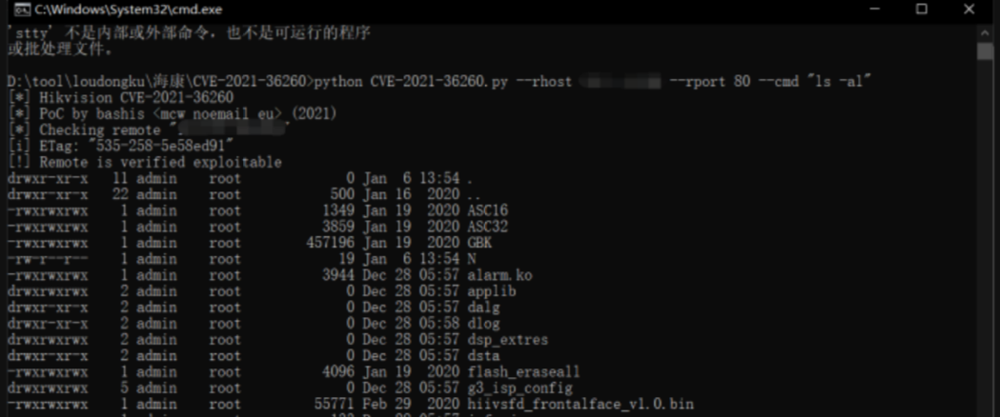

## 2.1. options参数

有时候我们从别人那里下载的`POC`，并非`GitHub`或者原作者的方式下载，那么很有可能都不知道如何使用，而我们会习惯性的使用`-h`的参数来展示一下，该脚本下的提示。

而`-h`是在命令行工具或脚本中，使用 `-h` 或 `--help` 作为参数来显示帮助信息是一个常见的约定。这种约定有助于用户了解如何使用命令行工具或脚本，以及该工具或脚本接受哪些参数。

那么我们通过-h就可以了解到该脚本下面的需求参数，像这个脚本中参数越多，而相应的功能也就越多，同时代码量也就越多。而这里有很多的参数其实，我们看一下就懂了，例如：`rhost`，通过后面显示的提示，就是让你输入IP地址，`rport`，通过后面显示的提示，就是让你输入端口，这两个参数是否在哪见过？

不知道有没有人想起来在`MSF`中也是这样的设定~~~~这里我就不去截图了，自行测试吧！

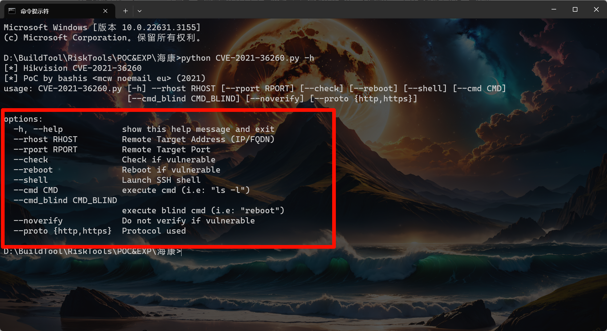

## 2.2. usage参数

有时候通过`-h`查看过帮助信息后，但是还是会发现，我们不知道怎么输入，因为有时候脚本中会添加一些固定格式的参数，也就是所谓的必须输入的内容，那只有查看过别人的使用教程才会知道，而且如果没教程，我们该如何使用呢？通常在编写`POC`的时候，作者也会在上面标注使用方式，而使用方式则会在`usage`位置展示出来！

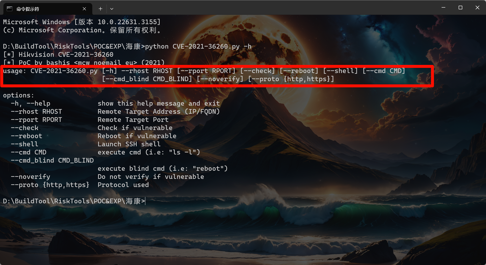

## 2.3. 前缀提示

我也不知道怎么形容，就叫前缀吧，该部分可以使用使用python的输入命令展示出来即可，那么基本上此时你再回头看第一张图片，是否就能够理解了，`POC`展示在外部所需要编写的内容！

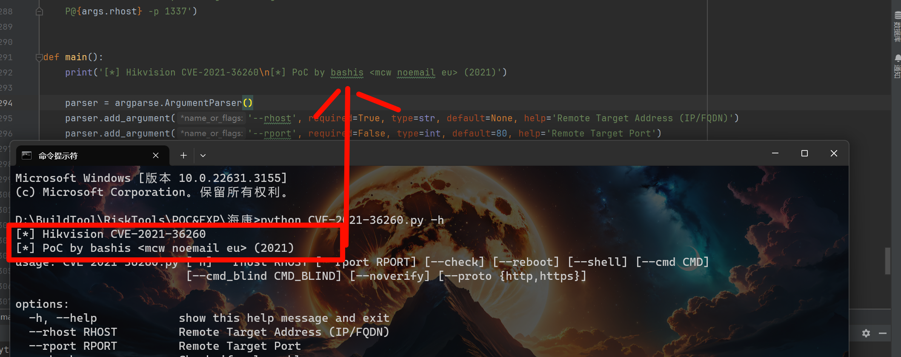

# 3. 窗口界面编写

通过前面的了解，那么这一章就需要去实现前面展示的三个地址，而这一章中可能会涉及到一些模块函数，其实这些模块函数真的不算难，在`python`中函数模块基本只需要去了解一下语法基本上都能使用上来，同时某些模块我解释不清楚的我也会附上相应的参考文章或者链接！

首先，我们在使用`POC`的时候都需要输入命令，应该会`Hello World`应该都会基本上的输入输出语句吧，那么这里我就不在赘述基础的输入输出语句。

关于`input`与函数，正常我们在代码实现过程，基本上很少会使用这个参数来去接收用户输入的内容，由于在脚本中可能会需要用户输入`URL` 、 `执行的命令` 、 `端口号` 等等，导致使用i`nput`会比较麻烦！

示例：

```python
url = input("你要验证的网站是：").strip()    ##.strip()默认去除头尾指定的字符（默认是空格）
print(f"[+]该{url}存在漏洞！")
```

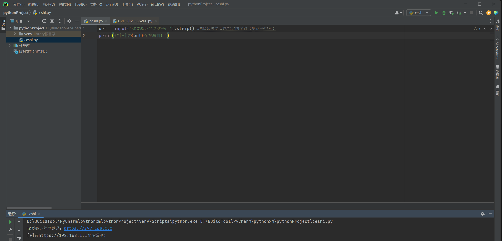

## 3.1. argparse模块

这里就需要使用到我们的`argparse模块`，`argparse模块`可以让人轻松编写用户友好的命令行接口。 程序定义它需要哪些参数，`argparse模块`将会知道如何从`sys.srgv` 解析它们。`argparse模块`模块还能自动生成帮助和用法消息文本。 该模块还会在用户向程序传入无效参数时发出错误消息。

相比，导入模块应该会吧，这里就不单独的说如何导入了。

参考：

[python命令行选项argparse模块详解](https://blog.csdn.net/weixin_41657089/article/details/135426689)

[命令行选项、参数和子命令解析器](https://docs.python.org/zh-cn/3.12/library/argparse.html)

### 3.1.1. 基础模块

要使用`argparse`库，第一步就是创建一个`ArgumentParser`对象。该对象将帮助您定义命令行接口的外观和行为。

1. **`argparse.ArgumentParser()`**: 这是`argparse`库的主要类，用于创建命令行参数解析器。
2. **`prog='ProgramName'`**: 这个参数设置了命令行工具的名称。当你在命令行中运行这个脚本并请求帮助时（例如，通过`-h`或`--help`选项），这个名称将显示在帮助信息的顶部。
3. **`description='What the program does'`**: 这个参数提供了程序的简短描述。当用户在命令行请求帮助时，这个描述会出现在帮助信息的主体部分，紧接着`prog`之后。
4. **`epilog='Text at the bottom of help'`**: 这个参数提供了在帮助信息的底部的额外文本。它通常用于提供进一步的指导或信息，或者对命令行选项的额外说明。

通常我们基本上就需要第二个参数，也就是`description`或者你直接就不写，使用print输出提示也可以，例如上面的海康脚本！

```python
parser = argparse.ArgumentParser(
                    prog='ProgramName',
                    description='What the program does',
                    epilog='Text at the bottom of help')
```

下面的示例，我们简短的展示了一下，基础的流程，注意，这个命令在编辑器中无法运行，需要使用黑框框运行。

示例：

```python
# 导入模块
import argparse
# 实例化一个对象 ，第一个参数，不写的话，默认是脚本的名称，正常不写，第二个参数介绍，可写不写，不写使用print也一样，第三个参数看心情。
parser = argparse.ArgumentParser(prog= "这是我的的一个脚本",description="这是脚本的提示信息",epilog="结束了")
# 解析命令行参数
parser.parse_args()
```

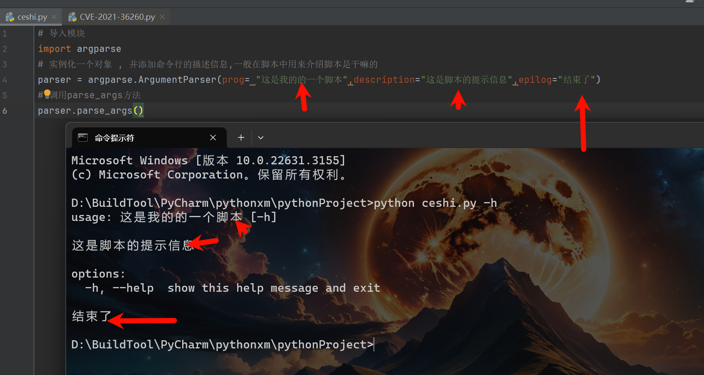

### 3.1.2. 位置参数

所谓的位置参数就是必选参数，在填写的时候必须需要输入的参数，同时位置参数不需要再前面输入`-`，它们不是必须提供的，但可以根据需要进行提供。下面我们将详细介绍如何使用`Argparse`定义和解析可选位置参数。

同时观察下图，位置参数是需要按照格式来输入的，并非随便输入，同时位置参数是没有[]框选的，目前很少脚本中会使用到位置参数，由于位置参数的局限性导致，如果再脚本中设置，除非你能保证再输入的时候一定按照你的格式来，否则基本上脚本就容易出现报错或者无法使用。

多数还是使用可选参数来指定。

```python
dest 指定要在结果命名空间中使用的属性名称,(可省略，直接写input_file)
metavar 要在帮助中显示的参数替代显示名称,(可省略)
help 某个参数的帮助消息
type 自动将参数转换为给定的类型,(可省略)
default 默认值
required 指定是可选参数还是必选参数
示例：
parser.add_argument("input_file",help="输入文件名")   
```

示例

```python
import argparse

parser = argparse.ArgumentParser()   
parser.add_argument(dest="input_file",metavar="文件名",type= int,help="输入文件名")   
args = parser.parse_args() # 解析命令行参数

print(args.input_file) ##结果，这里后面.的名称需要和你上面设定的选项名称一致。
```

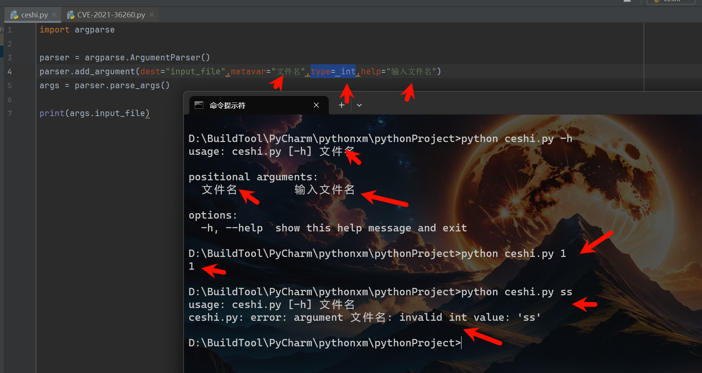

### 3.1.3. 可选参数

可选参数是在命令行中提供的，但不是必须的参数。它们通常用于配置程序行为，设置程序的不同模式，或者指定一些可选的参数值。同时可以让使用者，再不同的情况下使用不同的参数组合成不同的测试效果，例如，一个脚本中存在`POC&EXP`，而使用者仅仅想使用脚本的`POC`功能，那么就可以通过不同的可选参数来实现。

类似于位置参数，我们可以使用`add_argument()`来添加可选参数。我们可以指定短选项（使用单个破折号`-`）或长选项（使用双破折号`--`），并提供一些帮助信息。

其实需要携带的参数上和位置参数是一样的，至少在前面添加了一个`--`就成为了可选参数。

#### 3.1.3.1. 长选项

长选项，一般情况下都会使用，主要是用于让别人能够一下子就清楚是什么，举一个列子，如果长选项的是`--url`，那么就一看就知道是需要你输入`url`，但是如果使用的是`--u`，可能你通过后面的解释情况了是输入`url`，但是乍一看，可能还是会懵！

```python
import argparse

parser = argparse.ArgumentParser()
parser.add_argument("--name",help="输入你的名字")
parser.add_argument("--age",help="输入你的年龄")
args = parser.parse_args()

print(args.name,args.age)##结果，这里后面.的名称需要和你上面设定的选项名称一致。
```

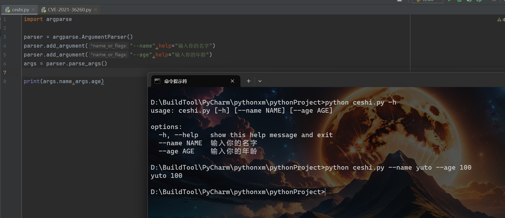

例如下面这个海康的脚本，这里就是使用长选项。

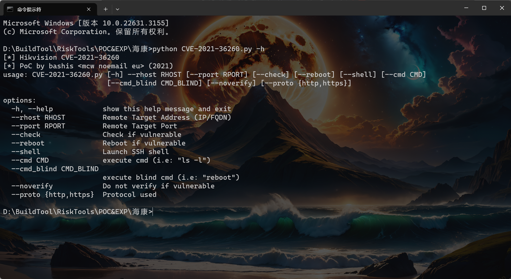

#### 3.1.3.2. 短选项

而且短选项主要是用于让别人输入的时候更好的输入，例如，你要输入`rport`，如果长选项就是`--rport`多多少少会比较麻烦，如果直接设置成`-p`是不是就方便多了。

同时这里我们将代码格式化，让其跟清晰明了。

关于`if __name__ == '__main__':   main()`解释：在Python中，`if __name__ == '__main__':` 这一行代码用于判断当前运行的脚本是作为主程序运行还是被导入作为模块使用。如果是直接运行这个脚本，那么 `__name__` 的值就会是 `'__main__'`，这时 `if __name__ == '__main__':` 下的代码块会被执行。如果这个脚本是被其他脚本导入的，那么 `__name__` 的值就会是这个脚本的名字（也就是模块名），这时 `if __name__ == '__main__':` 下的代码块不会被执行。

这种结构通常用于在脚本中定义一些函数和类，然后在 `if __name__ == '__main__':` 下调用这些函数，作为这个脚本的主入口点。这样做的好处是，当这个脚本被其他脚本导入时，它不会执行主入口点的代码，只会导入定义的函数和类，从而避免不必要的执行。

```python
import argparse


def cmd(url, port): ##模块（自定义）在java中应该叫有参构造
    print(f"地址为：{url}，端口为：{port}存在漏洞")


def main():  ##模块（自定义）在java中应该叫无参构造
    parser = argparse.ArgumentParser()  ##实例化一个对象 
    ## -u是短参数，用作调用，后面--url是实际参数，主要展示，而且实际在代码中去调用还是调用url，并非u，type=str设置参数类型，default=None 设置默认值，而url肯定不会有默认值的。但是看下面的端口，我设置了默认80端口！
    parser.add_argument("-u", "--url", type=str, default=None, help="输入地址")
    parser.add_argument("-p", "--port", type=int, default=80, help="输入端口")
    args = parser.parse_args()

    cmd(args.url, args.port)  ##调用方法，并且传参


if __name__ == '__main__':  
    main()

```

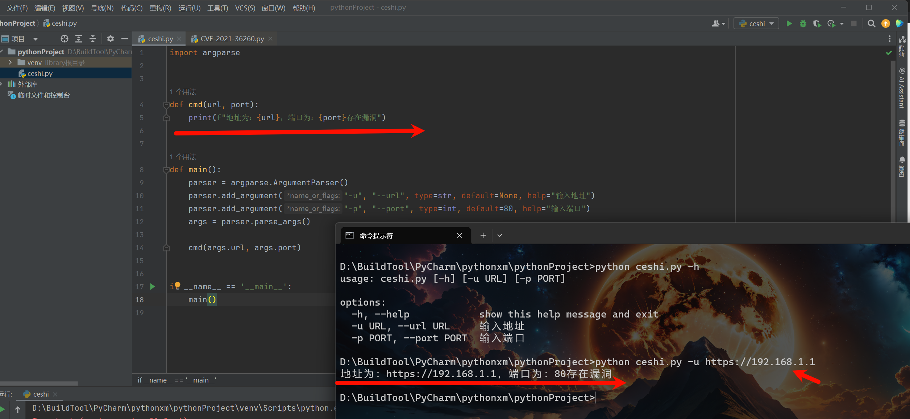

同时我们还可以通过使用`dest`参数，将原先展示的是属性名，修改成我们自己想要的名字！ 

```python
dest 指定要在结果命名空间中使用的属性名称
```

这里我们修改后`dest=IP`，那么我们的取值就不再是`url`，而是`IP`的值了，`dest` 通常会作为 `add_argument()` 的第一个参数 , 对于可选参数来说 , 默认属性名就是参数名 , 如果有 `dest` 指定则是 `dest`值。

同时这里我们测试一下`-p`参数是否也正常接收，也就相当于模拟上一个短选项的问题。

示例

```python
import argparse


def cmd(IP, port):
    print(f"地址为：{IP}，端口为：{port}存在漏洞")


def main():
    parser = argparse.ArgumentParser()
    ##注意这里添加了dest参数设定了额外的名称，那么下面调用的数据就需要调用这个设定的额外名
    parser.add_argument("-u", "--url", dest="IP",type=str, default=None, help="输入地址")
    parser.add_argument("-p", "--port", type=int, default=80, help="输入端口")
    args = parser.parse_args()

    cmd(args.IP, args.port)


if __name__ == '__main__':
    main()

```

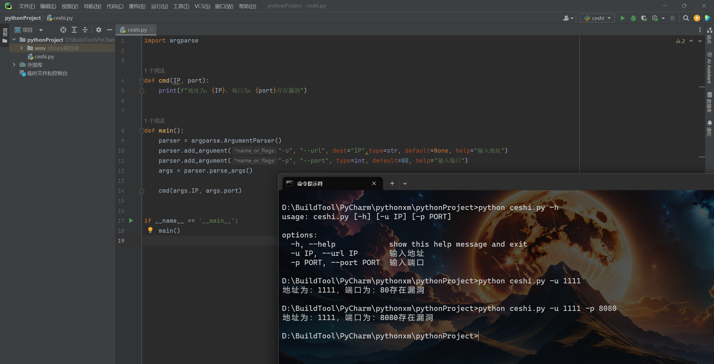

这里我们通过上述图片可以看到代码显示 `-u IP` 后面还有一个 `--url IP`显示的格外混乱，而这里就可以使用到参数`dest`，通过这个参数就可以让页面上显的不是那么混乱！

示例

```python
import argparse


def cmd(url, port):
    print(f"地址为：{url}，端口为：{port}存在漏洞")


def main():
    parser = argparse.ArgumentParser()
    ##这里我将长选项删除了，只是保留短选项，但是在之前我们测试过，如果担当设置一个短选项，函数参数是无法带入的，必须携带长选项，导致界面很乱，而这里使用dest参数后可以代替属性值，相当于代替长选项，界面显示的就没那么乱
    parser.add_argument("-u", dest="url",type=str, default=None, help="输入地址")
    parser.add_argument("-p", "--port", type=int, default=80, help="输入端口")
    args = parser.parse_args()
 
    cmd(args.url, args.port)   ##注意这里url填写的是dest的属性值，并非是原先的url


if __name__ == '__main__':
    main()
```

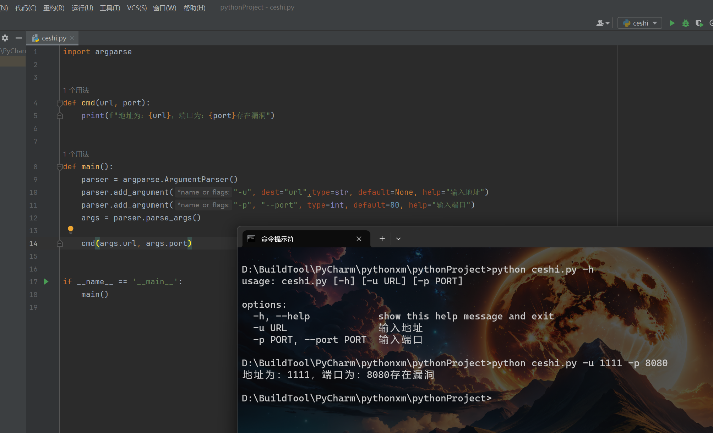

### 3.1.4. 必选参数

这个必选参数和位置参数有区别的，位置参数相当于在某个位置必须输入相应的参数，而且这里的必选参数是指在进行可选参数的时候，设定那些可选参数是执行过程中必须选择的，否则可能会导致程序崩溃，或者长时间无法运行出来。

```python
required #指明某个参数是必需的还是可选的 默认是不强制！
```

示例

```python
import argparse


def cmd(url, port):
    print(f"地址为：{url}，端口为：{port}存在漏洞")


def main():
    parser = argparse.ArgumentParser()

    parser.add_argument("-u", dest="url",required=True, type=str, default=None, help="输入地址")
    parser.add_argument("-p", "--port", required=True,type=int, default=80, help="输入端口")
    args = parser.parse_args()

    cmd(args.url, args.port)


if __name__ == '__main__':
    main()
```

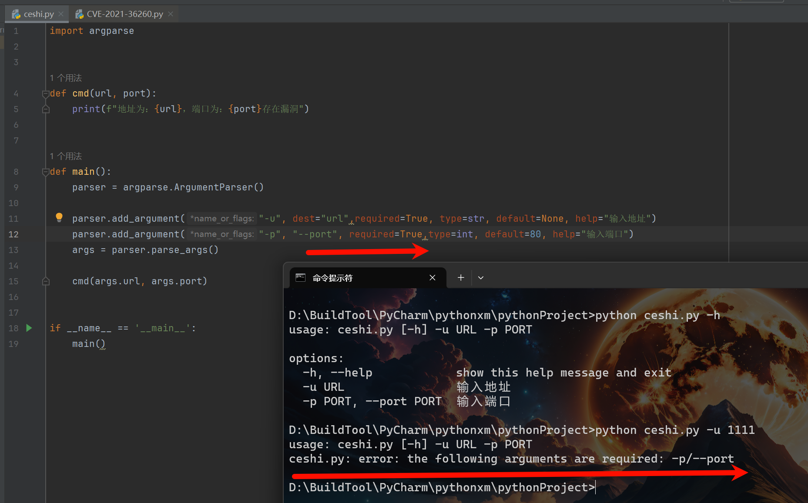

# 4. 界面选项模板

这里我们根据上述所学的内容，编写一个简易的模板，这里为了方便，将一些说明显示成中文，也方便了解！

字符画网站：

```
根据文字生成字符画：
http://patorjk.com/software/taag
http://www.network-science.de/ascii/
根据图片生成字符画：
http://www.degraeve.com/img2txt.php
http://life.chacuo.net/convertphoto2char
根据流程图生成字符画：
https://asciiflow.com/
```

模板示例

```python
##导入模块
import argparse


##执行漏洞验证
def cmd(url, port, cmd):  ##带入用户输入的参数
    print(f"地址为：{url}，端口为：{port}存在漏洞,并对其执行了{cmd}命令")


##构造方法
def main():
    ##输出字符画（装X用）
    print("""

'##:::'##:'##::::'##:'########::'#######::'##:::'##::::'###::::
. ##:'##:: ##:::: ##:... ##..::'##.... ##:. ##:'##::::'## ##:::
:. ####::: ##:::: ##:::: ##:::: ##:::: ##::. ####::::'##:. ##::
::. ##:::: ##:::: ##:::: ##:::: ##:::: ##:::. ##::::'##:::. ##:
::: ##:::: ##:::: ##:::: ##:::: ##:::: ##:::: ##:::: #########:
::: ##:::: ##:::: ##:::: ##:::: ##:::: ##:::: ##:::: ##.... ##:
::: ##::::. #######::::: ##::::. #######::::: ##:::: ##:::: ##:
:::..::::::.......::::::..::::::.......::::::..:::::..:::::..::

    """)
    ##输出版本信息及CVE名称
    print('[*] YUTO—CVE—2024\n[*] POC&EXP 0.0.1')
    ##创建对象
    parser = argparse.ArgumentParser()
    ##设置短选项、重置属性名、设置是否必选项、设置字符类型、设置默认值、设置帮助信息
    parser.add_argument("-u", dest="url", required=True, type=str, default=None, help="输入地址")
    parser.add_argument("-p", dest="post", required=False, type=int, default=80, help="输入端口")
    parser.add_argument("-c", dest="cmd", required=False, type=str, default="whoami", help="输入执行命令")
    ##解析命令行参数
    args = parser.parse_args()
    ##调用cmd有参构造
    cmd(args.url, args.port, args.cmd)


if __name__ == '__main__':
    main()

```

