# 1. **域名信息收集**

## 1.1. **whois查询**

### 1.1.1. **whois解释**

whois是用来查询域名的IP以及所有者等信息的传输协议。简单说，whois就是一个用来查询域名是否已经被注册，以及注册域名的详细信息的数据库（如域名所有人、域名注册商）。

### 1.1.2. **whois收集**

#### 1.1.2.1. **在线网站查询**

输入相关的域名即可进行查询。

（1）站长之家：whois域名查询：http://whois.chinaz.com/

（2）爱站工具网：whois域名查询：https://whois.aizhan.com/

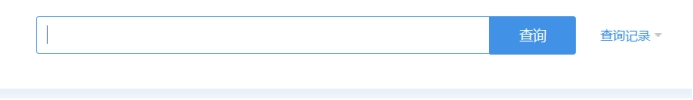 

（3）阿里云域名：阿里云域名查询：https://whois.aliyun.com/

#### 1.1.2.2. **工具查询**

（1）kail查询：whois+域名

 

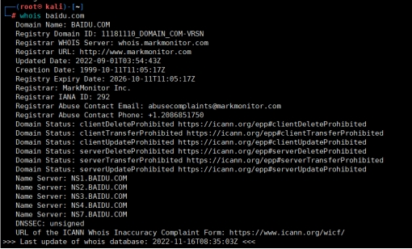 

（2）kail查询：dnsenum+域名

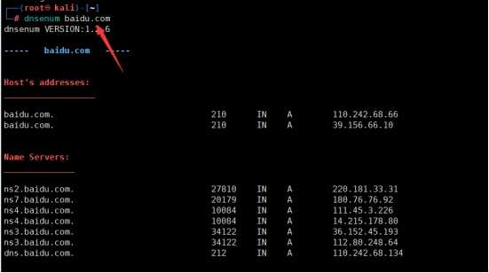 

## 1.2. **反查**

不单单可以使用域名进行whois进行查询，同样可以使用手机号、邮箱、注册人等相关信息进行反查。

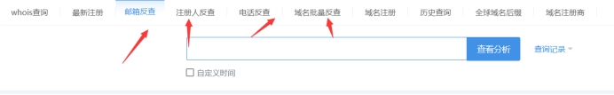 

## 1.3. **备案信息查询**

### 1.3.1. **备案信息解释**

备案是指向主管机关报告事由存案以备查考。行政法角度看备案，实践中主要是《[立法法](https://baike.baidu.com/item/立法法/2466159?fromModule=lemma_inlink)》和《[法规规章备案条例](https://baike.baidu.com/item/法规规章备案条例/7989003?fromModule=lemma_inlink)》的规定。根据[中华人民共和国信息产业部](https://baike.baidu.com/item/中华人民共和国信息产业部?fromModule=lemma_inlink)第十二次部务会议审议通过的《[非经营性互联网信息服务备案管理办法](https://baike.baidu.com/item/非经营性互联网信息服务备案管理办法/8007160?fromModule=lemma_inlink)》精神，在中华人民共和国境内提供非经营性[互联网](https://baike.baidu.com/item/互联网/199186?fromModule=lemma_inlink)信息服务，应当办理备案。未经备案，不得在中华人民共和国境内从事非经营性互联网信息服务。而对于没有备案的网站将予以罚款和关闭。

### 1.3.2. **备案信息收集**

输入相关的网站域名、备案编号、主办单位等信息。

（1）天眼查：备案信息查询：https://beian.tianyancha.com/

（1）ICP备案查询网：备案信息查询：https://www.beianx.cn/

## 1.4. **子域名收集**

### 1.4.1. **子域名解释**

子域名是顶级域名的下一级，子域名主要指的是二级域名。当一个网站比较大的情况下，直接通过顶级域名进行入手可能会比较困难，但是对于比较大的网站都可能会存在相当多的二级域名，并且顶级域名相对来说防范也比较严格，而二级域名可能就会存在防范不是那么严格的情况。

### 1.4.2. **子域名收集**

#### 1.4.2.1. **在线网站收集**

（1）子域名在线查询：子域名查询网站：https://searchdns.netcraft.com/

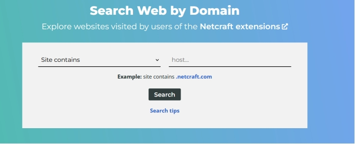 

（2）子域名在线查询：子域名查询网站：https://phpinfo.me/domain/

 

（3）子域名在线查询：子域名查询网站：http://z.zcjun.com/

 

#### 1.4.2.2. **工具收集**

（1）Layer子域名挖掘机

子域名挖掘机，是否能够挖掘到关键不在于工具本身，而在于收到的字典，字典越好，收集到的信息就越多，所以在日常中，需要常收集相关的字典。

Layer子域名挖掘机5.0：网盘链接：https://pan.baidu.com/s/16Tawn5a0GrwKxOU0POnjog?pwd=76rc 提取码：76rc 

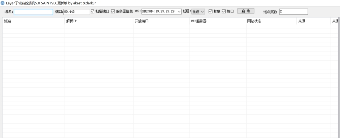 

（2）开源扫描器onlinetools

开源扫描器onlinetools，输入域名即可查询，至于怎么安装可以查询文档或者百度搜索。

开源地址：[**https://github.com/iceyhexman/onlinetools**](https://github.com/iceyhexman/onlinetools)

#### 1.4.2.3. **Google语法搜索**

site功能：搜索指定的域名网页内容，子网和网页相关的

​		site:网站 “想查询的信息”

​		site:baidu.com

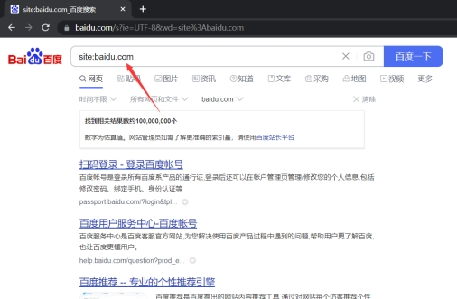 

 

# 2. **IP获取/信息收集**

## 2.1. **IP获取查询**

### 2.1.1. **ping**

通过ping收集相关的服务器IP地址，但是通过ping获取到的IP不一定是真实的。

语法：ping+域名

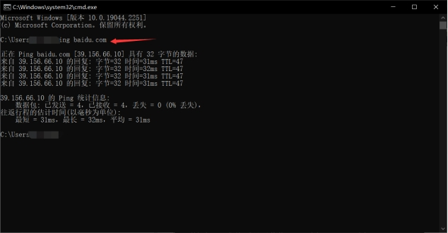 

### 2.1.2. **nslookup**

通过nslookup收集到的IP地址同样也不一定是真实的。并且命令也提示非权威答应。

语法：nslookup 进入后输入域名。

 

## 2.2. **CND绕过**

### 2.2.1. **CND解释**

CDN的全称Content Delivery Network，即内容分发网络，CDN的基本原理是广泛采用各种缓存服务器，将这些缓存服务器分布到用户访问的网络中，在用户访问网站时，由距离最近的缓存服务器直接响应用户请求。

### 2.2.2. **真实IP信息收集**

（1）超级ping：超级ping：https://ping.chinaz.com/

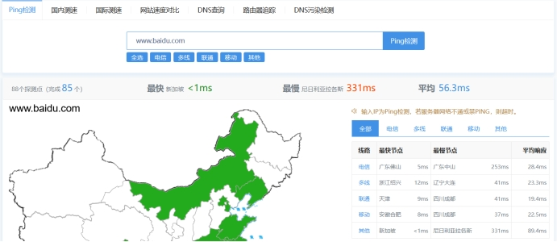 

（2）全球ping：全球ping：https://www.wepcc.com/

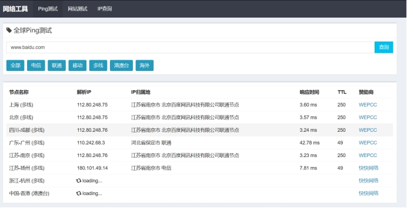 

（3）查询网：查询网：https://site.ip138.com/baidu.com/

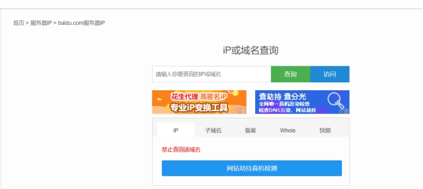 

（4）IP查询：IP查询：https://ipchaxun.com/

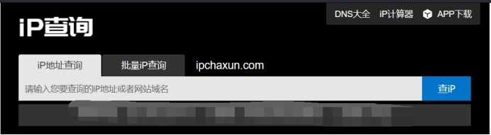 

## 2.3. **IP信息查询**

### 2.3.1. **在线查询**

（1）站长之家：站长之家https://ip.chinaz.com/192.168.1.1

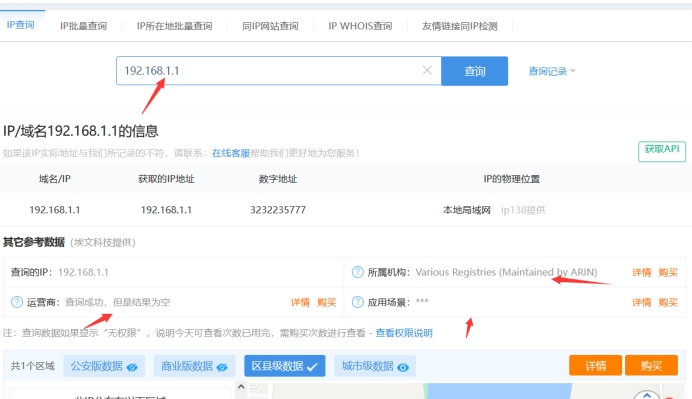 

# 3. **C段旁注**

## 3.1. **C段旁注解释**

C段旁注就是在对目标主机无计可施的时候，另辟蹊径从C段或旁注下手，C段也就是拿下同一C段也就是同一网段内其它服务器，然后从这台服务器对目标主机进行测试，旁注同服务器上的其它站点入手，进行相关的渗透获取权限，然后把服务器拿下，同理自然也就将目标主机拿下。

两者有着不同的区别，C段是同网段不同服务器，旁注是同服务器不同站点。

## 3.2. **C段旁注收集**

### 3.2.1. **在线查询**

（1）C段旁注：同IP网站查询：https://www.webscan.cc/

 

### 3.2.2. **工具查询**

（1）开源扫描器onlinetools

开源扫描器onlinetools，输入域名即可查询，至于怎么安装可以查询文档或者百度搜索。

开源地址：[**https://github.com/iceyhexman/onlinetools**](https://github.com/iceyhexman/onlinetools)

# 4. **网站架构**

## 4.1. **网站架构解释**

针对整个网站架构进行信息收集：服务器操作系统、网站服务组件、脚本类型、CMS类型、WAF等信息。

## 4.2. **网站架构收集**

### 4.2.1. **工具收集**

（1）kail收集：nmap -sV ip地址

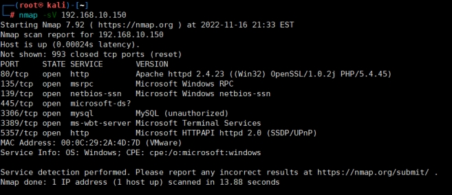 

（2）kail收集：whatweb+域名

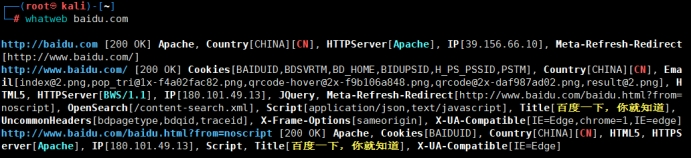 

（3）御剑WEB指纹识别系统

下载链接：链接：https://pan.baidu.com/s/1OMtzOmpxw_N4oL6WS7clDg?pwd=uy9z 提取码：uy9z 

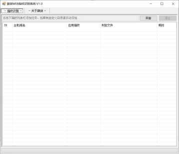 

### 4.2.2. **插件收集**

（1）Wappalyzer

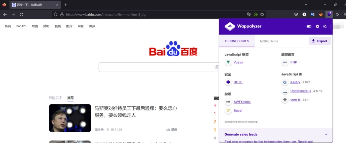 

### 4.2.3. **在线查询**

（1）在线查询：在线cms指纹识别：http://whatweb.bugscaner.com/look/

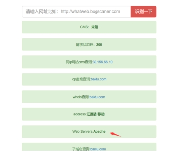 

（2）云悉：在线指纹识别：https://www.yunsee.cn/

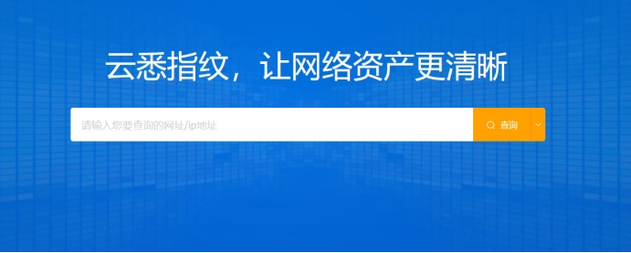 

（3）潮汐：在线指纹识别：http://finger.tidesec.net/

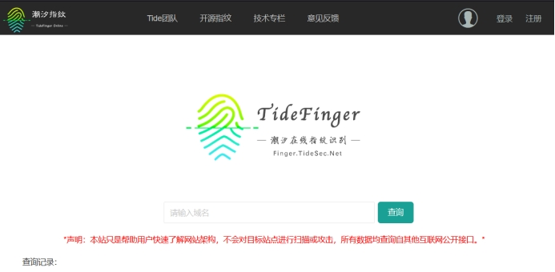 

# 5. **端口**

## 5.1. **端口解释**

一个网站可能会开放多个不通的端口，而对一个网站进行测试的时候，一个端口不行可以换一个端口进行测试，多个端口就存在多个可能。

## 5.2. **端口收集**

### 5.2.1. **在线收集**

（1）端口收集：在线检测：http://coolaf.com/tool/port

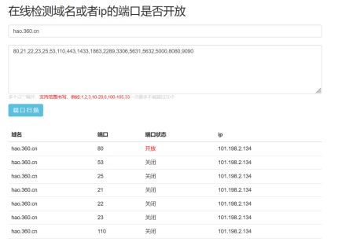 

### 5.2.2. **工具收集**

（1）kail收集：nmap -sS 域名/ip

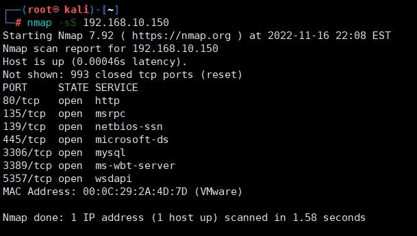 

（2）kail收集：masscan ip地址 -p 端口（1-1000）

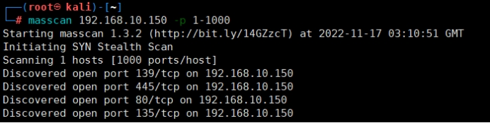 

（3）御剑端口扫描

下载链接：https://pan.baidu.com/s/1O-jnGajMtWXhQY9dHmD35A?pwd=l0kd 提取码：l0kd 

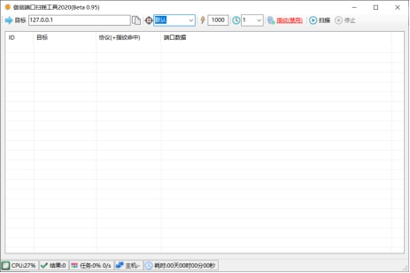 

# 6. **敏感目录收集**

## 6.1. **敏感目录类型**

数据文件、配置信息、上传目录、后台登录目录、安装页面、数据库版本、PHP版本、后台压缩包、未授权访问等。

## 6.2. **敏感目录收集**

### 6.2.1. **在线查询**

（1）Google语法

1）site:查找与指定的网站有联系的URL。

用法：site:网站名称

案例：site:baidu.com //查找和baidu.com网站相关的URL。

 

2）filetype:搜索指定类型的文件。

用法：filetype:文件类型

案例：site:baidu.com filetype:pdf //在百度中寻找pdf文件。

 

3）intitle:搜索网页正文内容中的指定字符。

用法：intitle:关键字

案例：intitle:后台搜索 //搜索网址中有后台搜索关键字的网页

 

4）inurl：搜索包含有特定字符的URL

用法：inurl:关键词URL

案例：		inurl:.php?id  //搜索网址中有php?id的网页

### 6.2.2. **工具查询**

（1）kail查询：dirb+URL链接

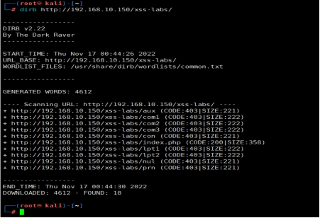 

（2）御剑目录收集工具

下载链接：https://pan.baidu.com/s/1H-499UU_QiHQWhMIDj_VMg?pwd=q1q3 提取码：q1q3 

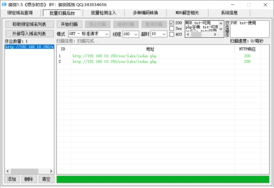 

（3）7KBwebpathBurute

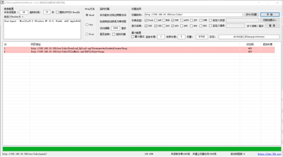 

# 7. **社会工程学**

社会工程学（Social Engineering，又被翻译为：社交工程学）在上世纪60年代左右作为正式的[学科](https://baike.baidu.com/item/学科/2634099?fromModule=lemma_inlink)出现，广义[社会工程学](https://baike.baidu.com/item/社会工程学?fromModule=lemma_inlink)的定义是：建立[理论](https://baike.baidu.com/item/理论/1732500?fromModule=lemma_inlink)并通过利用自然的、社会的和制度上的途径来逐步地解决各种复杂的社会问题，经过多年的应用发展，社会工程学逐渐产生出了分支学科，如[公安社会工程学](https://baike.baidu.com/item/公安社会工程学?fromModule=lemma_inlink)（简称[公安社工学](https://baike.baidu.com/item/公安社工学?fromModule=lemma_inlink)）和网络社会工程学。

## 7.1. **获取方式**

### 7.1.1. **聊天工具**

QQ、微信，通过添加对方好友，查看	QQ空间、朋友圈获取一些相关信息，比如核酸截图名字等。

同时在部分类似销售岗位都会将自己的手机号显示出来，以便比如方便联系，同时我们也方便了我们收集手机号。

### 7.1.2. **转账**

支付宝或者微信在初级添加好友就进行转账时候会出现姓名验证，通过这种方式获取真实姓名。

### 7.1.3. **钓鱼**

利用用户的好奇心、弱点、信任进行获取相关的资源对其进行获取相关信息，或者利用交谈中有意无意的导向进行套取相关信息。

## 7.2. **密码字典生成**

通过获取到的内容进行密码字典的生成。

网站：https://www.bugku.com/mima/

 

# 8. **其它**

其它一些在线信息收集网站，至于用法多数都能通过百度搜索到如何使用，这里就不一一介绍。

钟馗之眼：https://www.zoomeye.org/

shodan：https://www.shodan.io/

fofa：https://fofa.info/toLogin