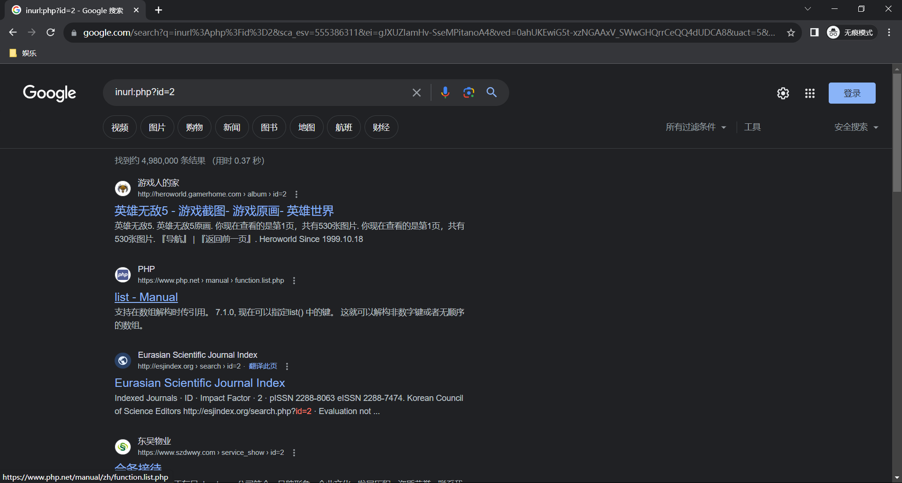
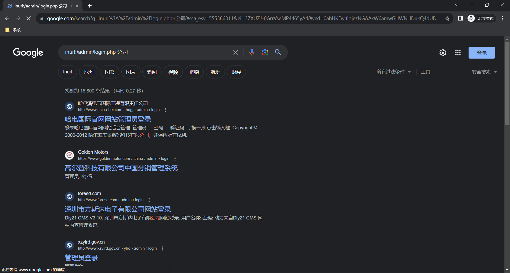
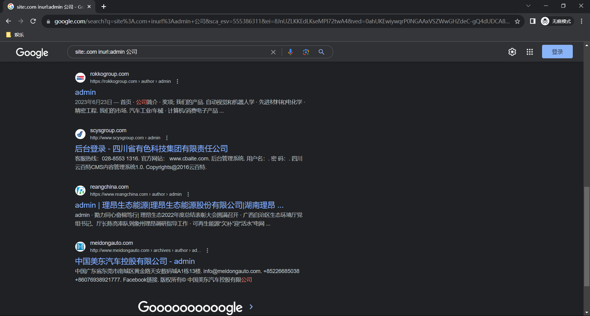
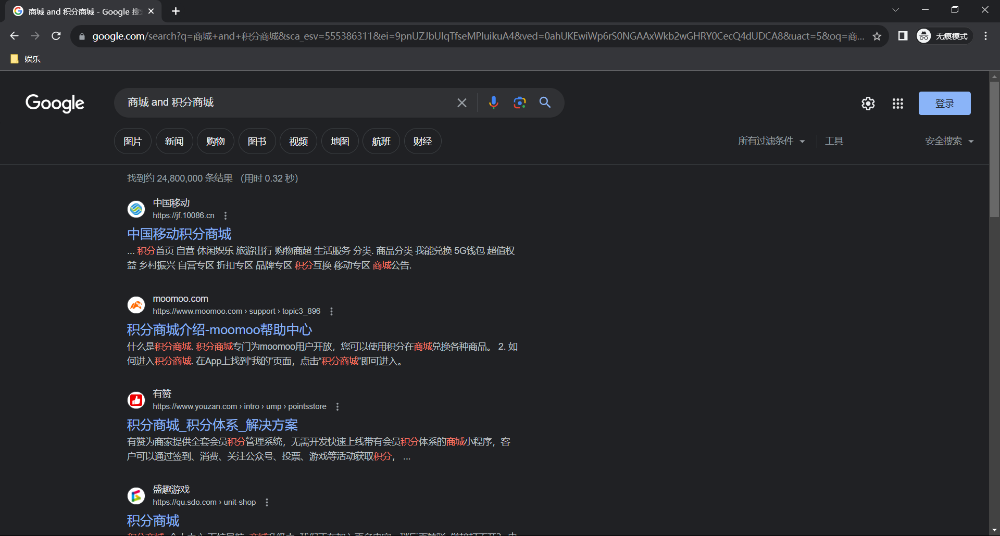
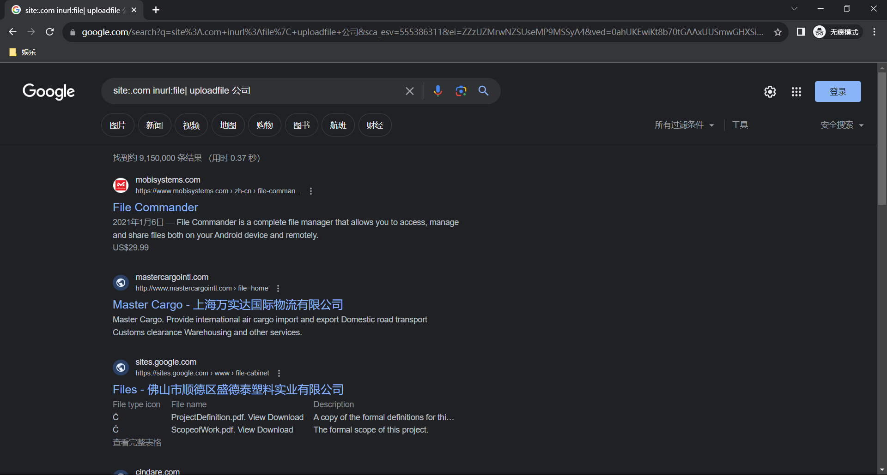
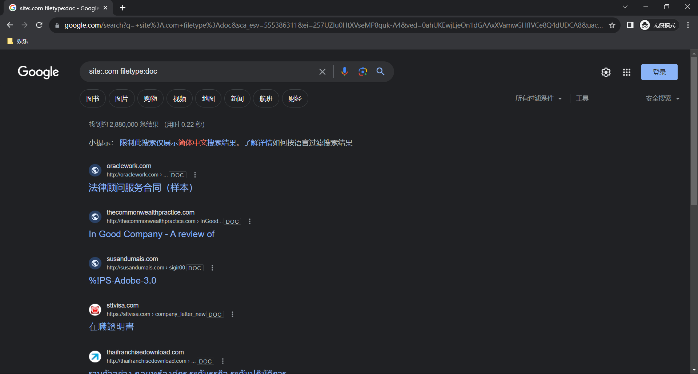
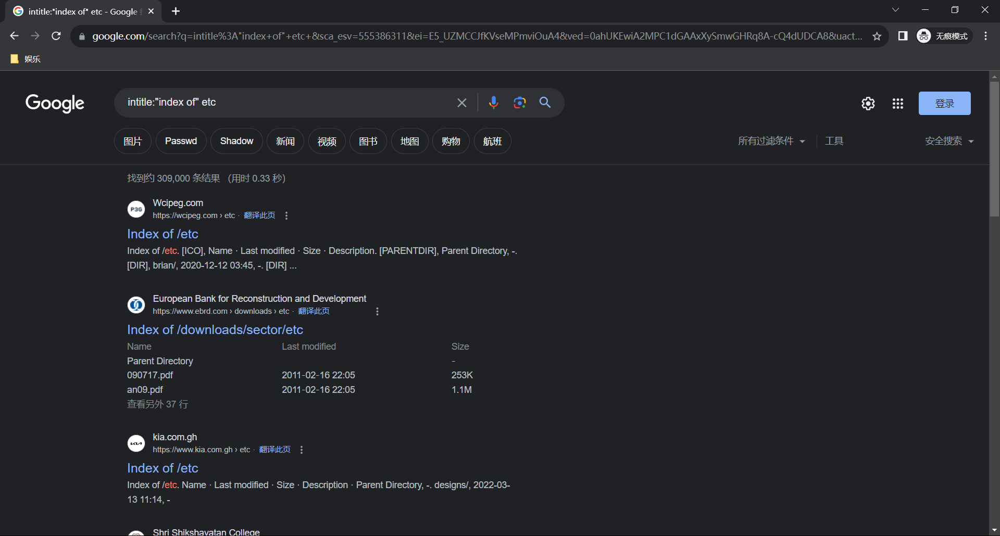

# 1. Google语法

不管是在挖掘公益漏洞还是SRC漏洞，都需要使用到Google语法，而本次就对Google语法进行一些总结。

## 1.1. 基础语法

当然在挖掘漏洞过程中，可能使用到的语法也就是几个常用的。

|    字符    |                  注释                   |
| :--------: | :-------------------------------------: |
|   intext   |       寻找正文中含有关键字的网页        |
|  intitle   |       寻找标题中含有关键字的网页        |
| allintitle | 用法和intitle类似，只不过可以指定多个词 |
|   inurl    |       将返回url中含有关键词的网页       |
|  allinurl  |  用法和inurl类似，只不过可以指定多个词  |
|    site    |             指定访问的站点              |
|  filetype  |           指定访问的文件类型            |
|    link    |             指定链接的网页              |
|  related   |             相似类型的网页              |
|    info    |           返回站点的指定信息            |
|   define   |           返回某个词语的定义            |

## 1.2. 操作符

| 字符 |                    注释                    |
| :--: | :----------------------------------------: |
|  +   |                  强制搜索                  |
|  -   |              把某个关键词忽略              |
|  ""  |                  精确查找                  |
|  *   | 通配符，表示一连串字符，关键词需要使用引号 |
|  ？  |  通配符，表示单个字符，关键词需要使用引号  |
| and  |                   逻辑与                   |
|  or  |                   逻辑或                   |

# 2. 寻找漏洞

关于寻找漏洞，我是个小菜鸟呀，我不配呀.......由于全程都是自学，并没有报什么培训班啥的，如果有大佬愿意带我，那我非常感谢，下面就是我有时候自己去找一些公益漏洞挖掘的办法。

不过也快了，等整个流程自学完，就要深入去学习如何挖掘漏洞了。

## 2.1. SQL注入

关于SQL注入漏洞，不得不说现在大的网站在WEB界面中已经很少能够挖掘到SQL注入漏洞了，不是说没有，而是很少，而且很多网站都是部署在云服务器上，通常都会自带WAF等设备，所以在日常的挖掘中还是比较困难的。

```
语法：
inurl:asp?id=X 公司
inurl:php?id=X 公司
```

这里要解释一下，关于id后面的X是表示数字，通过不断的变换数字你能找到很多意想不到的网站页面，有时候可能id=1页面是没有sql注入的，但是如果你改成id=2有时候就可能会出现sql注入，所以需要不断的去变化。

### 2.1.1. 不带公司

同时后面为什么要加上公司，我们来看下图，可以看到如果不加上公司，当你开代理后搜到的都是一些什么玩意，很容易搜到一些不是国内的。



### 2.1.2. 带公司

可以看到，如果带上公司，就会出现很多国内的网站，同时需要了解的是，现在有些网站id不单单说是从1.2....什么开始的，有些网站的id可能直接就是几千开始，所以不添加数字也是可以的。


### 2.1.3. 如何测试

至于搜索到一个网站后如何进行测试，那就各凭本事了，最简单的就是像下面一样，测试即可，如果有WAF可以尝试绕过，如果绕不过就换一个网站吧，当然大佬当我没说。

还有一种就是直接上sqlmap，有就测，没就拉到。

```
and 1=2--+ 
'and 1=2--+
“and 1=2--+
........
```

## 2.2. 后台管理漏洞

后台管理漏洞的话，多数可能是就是登录框的弱口令、sql注入、暴力破解，不过目前来说弱口令现在来说的话，单反大一点的企业，有一点安全概念的也不会出现弱口令的情况。

```
语法：
inurl:/admin/login.php 公司 
inurl:/phpmyadmin/index.php 公司
intitle:管理员登录
```

关于这个后台页面的话，不同的网站后台页面的URL也是不同的，所以语法中的URL仅作参考。当然也可以直接使用中文的管理员登陆或者后台登陆，这样查找到的网站基本上也都是国内的网站。



### 2.2.1. 查询单个网站

其实这个查询单个网站的后台，也就是把这个网站的域名输入上去，后面跟上URL中的关键词或者标题中的关键词即可，当然这个XXX.com安装域名补齐即可。

```
语法：
site:xxx.com inurl:admin
site:xxx.com intitle:管理|后台|登陆|用户名|密码|系统|帐号|admin|login|sys|managetem|password|username
site:xxx.com inurl:login|admin|manage|member|admin_login|login_admin|system|login|user
```



### 2.2.2. 常见后台管理路径

```
inurl: 
admin
admin_index
admin_admin
index_admin
admin/index
admin/default
admin/manage
admin/login
manage_index
index_manage
manager/login
manager/login.asp
manager/admin.asp
login/admin/admin.asp
houtai/admin.asp
guanli/admin.asp
denglu/admin.asp
admin_login/admin.asp
admin_login/login.asp
admin/manage/admin.asp
admin/manage/login.asp
admin/default/admin.asp
admin/default/login.asp
member/admin.asp
member/login.asp
administrator/admin.asp
administrator/login.asp
```


## 2.3. 支付漏洞

关于支付漏洞主要就是涉及一些0元购、逻辑漏洞、越权、容易密码重置等.....

```
语法：
商城 and 积分商城
```



## 2.4. 文件上传漏洞

这个就没什么好说的，文件上传一般情况下这类功能都是在你注册完后才能上传或者登陆后才能上传的，确实可能存在一些不需要验证就能上传的，但是只能说很少。

```
site:.com inurl:file| uploadfile 公司s
```



## 2.5. 查找文件类型

这些基本上都是来查找一些文件类型，看看有没有什么泄露的。

```
语法：site:.com
filetype:doc
filetype:xml
filetype:rar
filetype:docx
filetype:inc
filetype:mdb
filetype:txt
filetype:emali
filetype:xls
filetype:.sql
filetype:conf
filetyep:pdf
```



## 2.6. 敏感信息泄露

主要就是看有没有什么泄露其实也就是目录遍历，能找到的很多，但是至于是不是国内的就不确定了。

```
intitle:"index of" etc
intitle:"Index of" .sh_history
intitle:"Index of" .bash_history
intitle:"index of" passwd
intitle:"index of" people.lst
intitle:"index of" pwd.db
intitle:"index of" etc/shadow
intitle:"index of" spwd
intitle:"index of" master.passwd
intitle:"index of" htpasswd
intitle:"index of" admin
inurl:service.pwd
intitle:phpmyadmin intext:Create new database //搜索phpmyadmin直接进入后台
intitle:"php shell*" "Enable stderr" filetype:php//批量搜索webshell
intitle:"index of" data //列出data目录
intilte:"error occurred" ODBC request where (select|insert) //搜索sql注入出错页面
intitle:index.of filetype:log //搜索日志文件
```



# 3. 刷分

找网上公开的漏洞库，利用fofa刷分即可。

