# 1. 前言

在上篇文章中提到了Linux权限提升之前的信息收集操作，这里就不在赘述，在前言中讲上篇文章为提到的内容进行补充，至于其它内容可参考上篇文章。

## 1.1. 如何找编译好的EXP

这里提一下，之前在设计找EXP都是使用自动化进行编译，但是就会出现需要安装C语言环境，而如果目标靶机中没有C语言环境，如果你私自在别人的操作系统中去安装C语言环境，可能会导致服务器部分环境或服务产生问题，那么就需要在本地进行编译，在编译后好再上传。不过也较为麻烦，这里给几个github上编译好的环境。

[kernel-exploits](https://github.com/lucyoa/kernel-exploits)

[Unix-Privilege-Escalation-Exploits-Pack](https://github.com/Kabot/Unix-Privilege-Escalation-Exploits-Pack)

[linux-kernel-exploits](https://github.com/SecWiki/linux-kernel-exploits)

# 2. 定时任务提权

定时任务通常被设置用于备份文件、清理目录内容等。crontab命令可以创建一个cron文件，以指定的时间区间运行。

## 2.1. 查看定时任务

可以通过下列的命令去指定一个定时任务，这里关于Linux定时任务相关的内容，请百度自行了解。

```
cat /etc/crontab
```

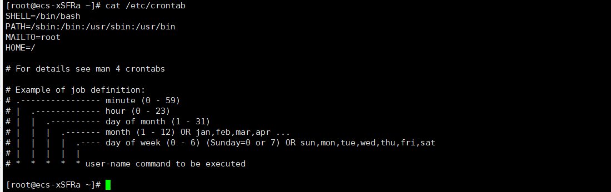

## 2.2. 通配符注入提权

先按照操作流程去操作一边，不懂的会在通配符总结中详细讲解到，最好先跟着操作一边，有印象再去看总结，就能看懂了。

通配符注入也就是Linux中用于匹配文件名的服务（*、？等），当存在这些符号的时候就可以用来提权，但是需要涉及到与类似解压缩类型的命令。

通配符通常是在查找文件夹时，可以使用它来代替一个或多个真正字符；当不知道真正字符或懒得输入完整名字时，常常使用通配符代替一个或多个真正的字符。

### 2.2.1. 创建执行脚本

这里创建一个bf.sh的执行脚本，并在里面写入一个备份执行命令。关于这条命令，为什么要这么设置，我想了很久，这里先设置，操作完看到效果后，我会对这个命令进行分析。

这里就是先到tmp目录下的123目录中，去打包里面的文件，并存放到tmp下。

```
cd /tmp/123;tar -zcf /tmp/bf.tar.gz *
```


### 2.2.2. 创建定时任务

这里创建一个压缩备份的定时任务，这个定时任务在大部分服务器中存在还是比较多的，由于服务器中的数据较为重要，所以多数都会使用到一个压缩备份的定时任务，同时如果在一个文件夹中需要备份的文件较多，管理者不可能一个一个压缩，那么就会使用到通配符来辅助压缩。

这里我设置的是：执行tmp下面的bf.sh。

```
vi /etc/crontab   ##编辑定时任务
* * * * * root /tmp/bf.sh  ##创建定时任务
cat /etc/crontab   ##查看定时任务
```

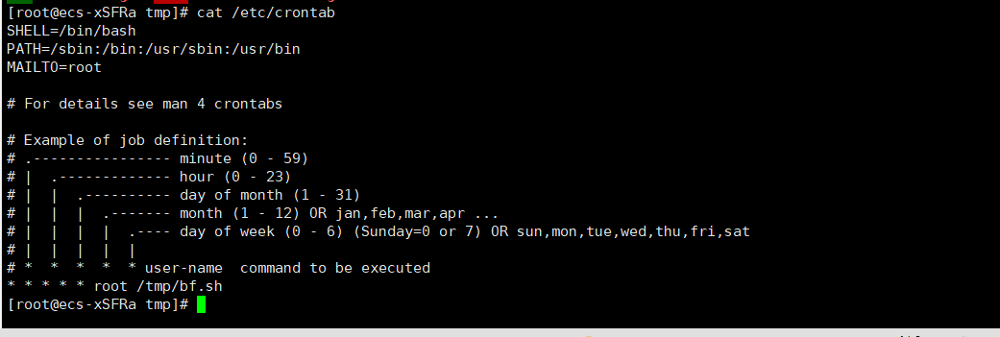

### 2.2.3. 查看效果

可以看到，这里成功压缩了文件，注意这个条件的确实是我备份的，我测试完又删除的，所以导致前后时间不对应。

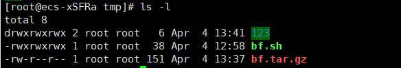

### 2.2.4. 提权操作

关于这个提权，web权限账户基本上不太可能能进行提权，同时普通用户若管理员设置备份的文件夹未给写入权，那么也GG，但是多数应该不太会出现这个情况，不过也不保证会排查。

#### 2.2.4.1. 切换普通用户

这里切换到普通用户，然后查看到存在root创建的定时任务，那么就可以利用这个定时任务进行提权，同时我们需要查看刚刚创建的执行脚本，对里面的内容进行分析，然后再去执行提权。

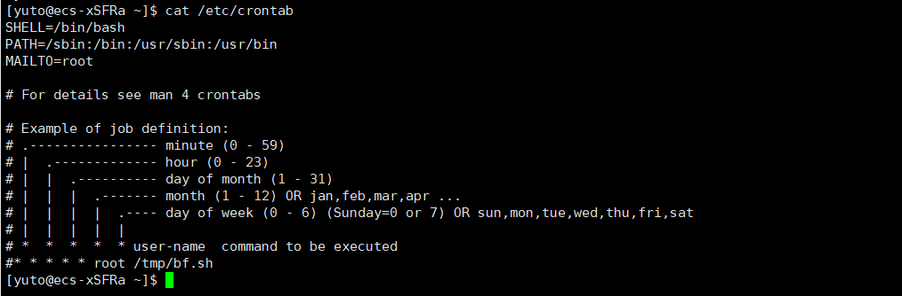

#### 2.2.4.2. 执行命令

由于备份的时候是备份123目录下的文件，那么我们执行的命令就需要再123命令下进行操作。

定时任务打包时使用了*将整个文件夹下的文件打包，而当系统真正执行打包操作时，会将目录下的所有文件名一个一个传参给*执行打包操作。前几个文件都没问题，但是当打包到--checkpoint=1文件和--checkpoint-action=exec=sh test.sh文件时，执行的相当于执行：

```
tar czf /tmp/backup.tar.gz --checkpoint=1 --checkpoint-action=exec=sh test.sh
```

而  --checkpoint、--checkpoint-action正好是tar命令的参数，打包到这里就会导致tar命令直接把--checkpoint=1和--checkpoint-action=exec=sh test.sh两个文件名当做参数执行，而不打包文件。--checkpoint-action=exec=sh  test.sh参数的意思是执行同目录下test.sh文件，test.sh文件内容又是把  bin/bash拷贝给/tmp/bash并给/tmp/bash赋SUID权限。此时我们再执行/tmp/bash就享有了suid权限，所以这里是一环套一环的。

```
echo "" > --checkpoint=1   
echo "" > "--checkpoint-action=exec=sh test.sh"   ##执行test.sh文件
echo 'cp /bin/bash /tmp/bash;chmod +s /tmp/bash' > test.sh  ##将/bin/bash复制到/tmp下，并提权SUID权限，同时将命令写入到test.sh脚本中
chmod +x test.sh  ##赋予执行权限
```

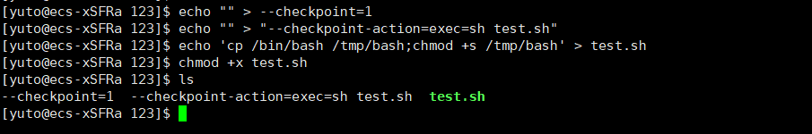

#### 2.2.4.3. 查看效果

可以看到这里成功的将bin目录下的bash复制到tmp下。

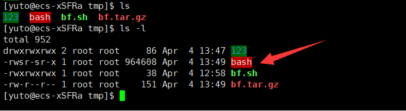

#### 2.2.4.4. 提权执行

这里可以参考之前提到的一个提权参考文章，在里面可以看到bash的提权操作，这里我们已经将bash复制过来了，同时又赋予了SUID权限，那么就是root权限了，通过参考文章中给予的操作方式，这里只需要下列命令即可。

那么完整的提权就结束了。

[suid-executables](https://pentestlab.blog/2017/09/25/suid-executables/)

```
./bash -p
```

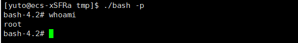

### 2.2.5. 总结

这里将一下在这个提权中需要注意的事项，总体来说有种莫名的鸡肋感觉。

- 如果备份的文件夹你没有写入权限就GG。
- 如果备份的命令是绝对路径也GG。
- 如果管理员设置了其它权限也GG。
- 如果是WEB权限也GG。

可能有些文章中是在定时任务中直接写入压缩命令，来完成压缩的，下面我们就来具体分析一下这两条命令。

```
cd /tmp/123;tar -zcf /tmp/bf.tar.gz *  ##执行成功的
tar -zcf /tmp/bf.tar.gz /tmp/123/*   ##执行未成功的
```

通过上面两条命令来看，其实都是成功对文件进行压缩，但是有上面不同呢？最好的办法就是把这两条命令的内容解压出来看看。

这里我由于使用香港服务器有点卡，我就切到华为云服务器上操作了。

#### 2.2.5.1. 执行成功的

通过整个验证流程来看，执行成功的命令是先到123目录中，通过匹配符去打包123目录中的所有文件，这样就符合了我们提权执行的流程。

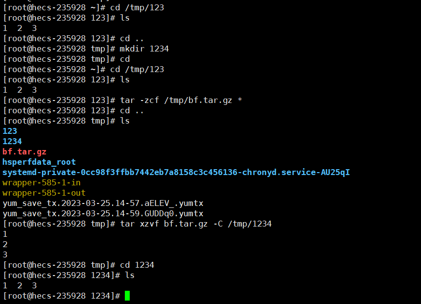

#### 2.2.5.2. 执行未成功的

这条命令也是网上很多人文章中使用的，但是从来没有下一步成功的截图或者内容，很多都直接提过了，都跳过了，你写个毛教程，这条命令我通过解压验证，他打包的内容是tmp整个目录，并不是123中的文件，整就导致了，提取目录无法执行的原因。

从验证流程上是错误的，所以我也不知道网上他们的文章是如何成功的，或者是我的理解有错误，有大佬知道的请反馈给我，解答我心中的疑惑。

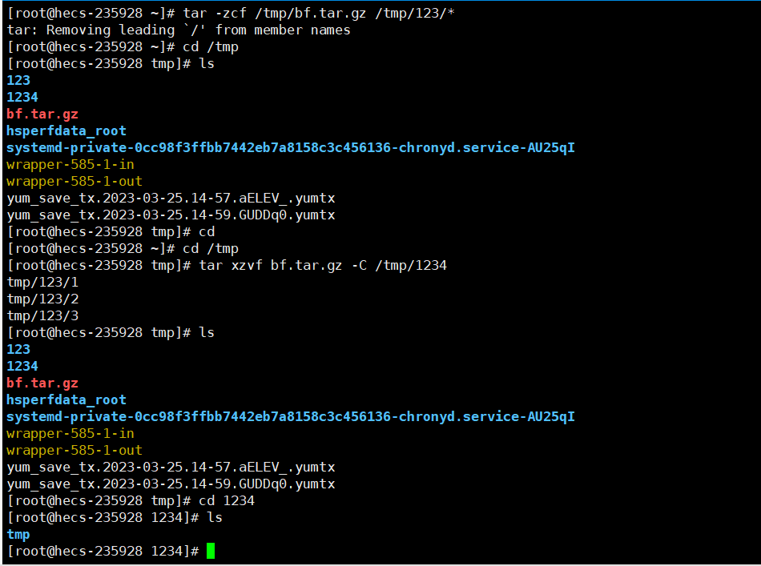

## 2.3. 权限配置不当提权

关于权限配置不当提权其实很好理解，比如管理员在设置一个定时任务的时候，通常都需要给定时任务的脚本添加一个执行权限，正常情况下都是"chmod +x test.sh",而有些管理员偷懒直接添加一个777权限，就会导致权限配置不当提权。

这里首选我们需要获取一个本地用户，WEB权限的用户不是不行，但是多数web权限都会被限制，不过也可以去尝试看看，能否进行操作。

### 2.3.1. 查看定时任务

可以看到管理员在定时任务中添加一个sh脚本任务，这里就可以看看这个脚本中写的是什么。

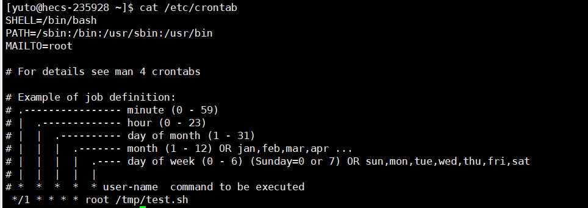

### 2.3.2. 查看脚本

通过查看脚本，发现是将时间写入time.log中，结合定时任务就是每分钟追加时间进入time.log中。并且查看权限的时候发现，是777权限，那么这里我们就可以考虑把这个文件覆盖或者在后面添加命令完成我们的提权操作。

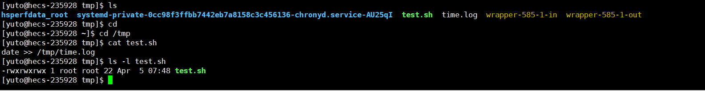

### 2.3.3. 编辑脚本

一定要有修改权限哦，如果没有修改权限那就GG了，是无法提权的。

在现实环境中最好是追加命令，不要去随意修改别人的脚本，确保原先的脚本也能执行，同时也能执行我们想要的执行权限，那么就可以直接在脚本中追加我们的命令。

```
cp /bin/bash /tmp/bash; chmod +s /tmp/bash  ##这里还是将bin下的bash复制到tmp下，同时加上SUID权限。
```

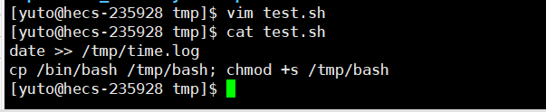

### 2.3.4. 查看执行效果

可以看到成功获取到bash。

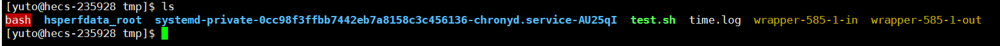

### 2.3.5. 提权执行

这里同样可以参考之前给的提权文章中使用命令进行提权，可以看到是root权限了。

```
bash -p
```

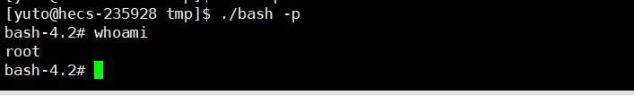

### 2.3.6. 疑问

可能有的人说，test.sh都是777权限了，能不能直接进行执行，这里测试是不行的，我们是没有权限的，由于time.log是由root的定时任务产生的，所以我们无法进行执行。

但是如果你把里面所有的内容都删除了，是可以进行执行的，或者你复制一份把里面的内容都删除了，然后进行执行也是可以的，但这些都基于权限配置出错的前提下。

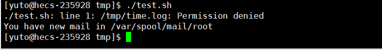

# 3. 环境变量提权

PATH是Linux 和 Unix  操作系统中的环境变量，它指定存储可执行程序的所有bin和sbin目录。当用户在终端上执行任何命令时，它会通过PATH变量来响应用户执行的命令，并向shell发送请求以搜索可执行文件。超级用户通常还具有/sbin和/usr/sbin条目，以便于系统管理命令的执行。

比如我想执行一个ls命令,其实我们执行的是/bin/ls这个可执行文件,而系统就是靠环境变量中我们设置的路径/bin中找到的ls并执行。而执行的优先级是从前向后查询的，例如下图，若在/usr/local/sbin中到到ls则会执行/usr/local/sbin中的ls，而不会再向下寻找。

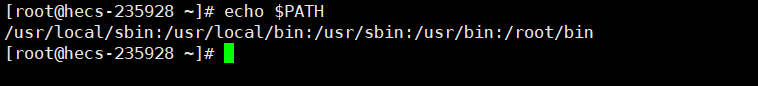

## 3.1. 环境搭建

这里我们先搭建一个模拟环境，模拟环境只是为了好演示以及知道原理，并不是在实际情况中一定会遇到。

### 3.1.1. 编辑C语言脚本

这个脚本意思很简单执行ps命令，而在实际环境中可能会其它的命令，基本上都是一致的替换即可。

```
#include<unistd.h>
void main()
{
        setuid(0);
        setgid(0);
        system("ps");
}
```

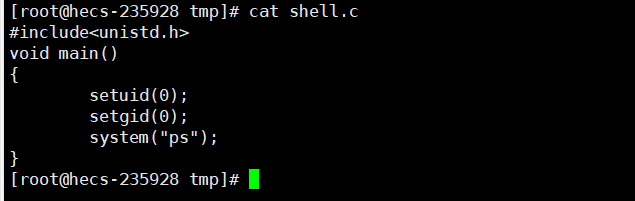

### 3.1.2. 编译C语言脚本

这里编译C语言脚本需要使用到gcc命令，若没有，可以自行安装，在我另外一篇文章中的5.2.2.1注意段中有写到关于这个C语言环境的情况。

[Linux权限提升—内核、SUID、脏牛等提权](https://blog.csdn.net/weixin_44268918/article/details/129907425?spm=1001.2014.3001.5501)

看到出现一个可执行的shell文件就证明编译成功了。

```
gcc shell.c -o shell   ##shell.c是脚本文件名，后面的shell是编译后的名称
```

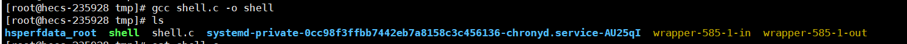

### 3.1.3. 添加SUID权限

这里添加SUID权限是由于在部分脚本中可能会出现一些命令必须使用root权限来执行，但是有些管理比较严格的公司，不允许随便使用root来管理服务器就会导致普通用户创建的文件可能会出现部分命令无法执行，那么就会使用root用户添加一个SUID权限来让其脚本在执行的时候默认使用root来执行，就能够解决这个问题。

```
chmod +s shell  ##添加SUID权限
```


## 3.2. 提权操作

这里的提权操作，整体的思路就是提权脚本中执行命令的环境变量，也就相当于对其进行环境变量的劫持。

### 3.2.1. 查找SUID权限文件

这里我们可以看到我们找到一个shell文件，文件路径是在tmp下。

```
find / -perm -u=s -type f 2>/dev/null
```

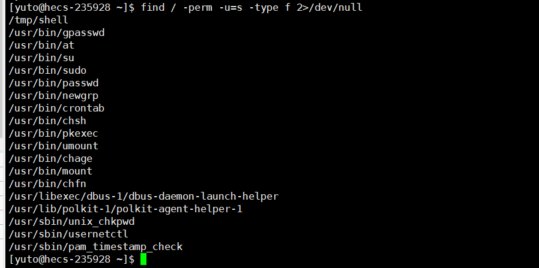

### 3.2.2. 尝试执行脚本

这里尝试执行shell后发现是执行ps命令，那么我们可以找找看看是否存在相关的源码，或者为了避免脚本影响一些服务，可以先对其进行反编译查看脚本里面是什么内容。

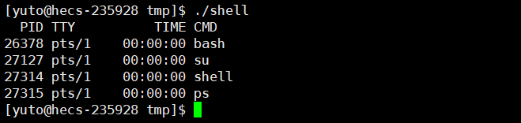

### 3.2.3. 查看源码

这里可以对文件进行反编译，或者查看是否存在关于shell脚本的源码，这里也是成功的找到shell脚本的源码，通过查看是执行ps命令。

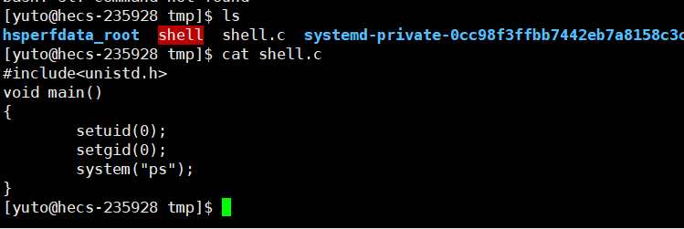

### 3.2.4. 分析环境变量

默认情况下执行ps是执行/bin/ps,同时这里设定的ps并未写绝对路径来执行，而是直接ps，那么就可以思考，默认情况下环境变量是一个一个查看，若找到了，就不会再向下查找，那么就可以对环境变量进行劫持。

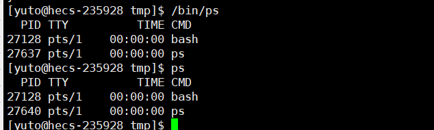

### 3.2.5. 查看环境变量

首先这里我们先查看一下现有的环境变量，通过现有的环境变量能够看到，默认再执行shell的时候会从前向后去一个一个查找，找到了就去执行。

```
echo $PATH
```

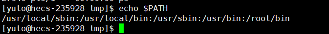

### 3.2.6. 复制bash

正如之前提到的从前向后查找，那么我们可以把我们的环境变量设置在第一个，同时修改文件名为ps，那么就实现了环境变量劫持，同时也实现了我们提权的操作，那么想要提权就需要使用到bash。

我们就可以将/bin/bash复制到脚本所在的目录下，当然不是强制复制到脚本所在的目录，只需要你将复制后的bash所在的目录添加在环境变量第一位即可。

同时修改/bin/bash为/tmp/ps,这里的tmp是脚本所在的目录，还是那句话，不一定强制要求在这个脚本目录下。而为什么要修改bash为ps呢？

这是由于ps去可执行的时候，相当于就是调用/bin/ps文件，那么修改为ps后就能实现文件名对应，就能进行执行。

```
cp /bin/bash /tmp/ps
```


### 3.2.7. 劫持环境变量

通过之前的分析逻辑，我们需要添加环境变量，并且将环境变量添加到第一位。

```
export PATH=路径:$PATH  ##从头添加
export PATH=$PATH:路径  ##从尾添加
```

那么这里我们就需要使用到从头添加的命令，将tmp添加进去，如果你复制的bash修改后的ps不再tmp下，可以根据你设定的目录进行添加，一定要是绝对路径哦。

添加完查看一下添加的路径是否成功。

```
export PATH=/tmp:$PATH 
echo $PATH
```

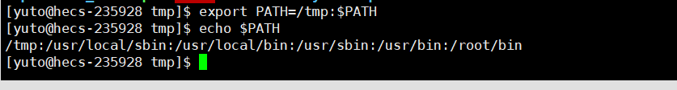

### 3.2.8. 执行脚本

这里执行完仔细看我截的图，是不是自动跳转到了root权限，这样的话就是成功提权了。

```
./shell
```

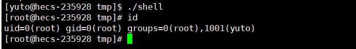

## 3.3. 总结

整体的原因就是由于开始管理员给予shell就是SUID权限，同时shell是一个执行脚本，通过对其反编译或者寻找源码，来判断脚本里面所调用的命令是什么。

然后根据这个命令将bash修改成对应的命令名称，同时添加环境变量，根据环境变量的特性，让其优先寻找到我们将bash修改后的命令名称，让其执行的ps命令成为执行bash。

而shell恰巧是SUID权限也就是root权限执行，那么root权限去执行bash就能够进行提权。

当然拉~这个提权有点鸡肋就是本地用户才可以，如果是web权限用户基本上是不能执行的。

# 4. MySQL数据库提权

其实这里的MySQL数据库提权本来是不想写的，由于在Linux中部署网站本来就会受到各种权限限制。同时Linux中的MySQL数据库提权和Windows的步骤基本上一致。

并且由于目前的高于5.5的数据库存在secure-file-priv的限制，很多情况下都实现不了，除非你胆大去改别人的数据库同时重启。这里就使用说一下工具自动化提权吧，手动的百度搜索吧，我也想写了，确实由于Linux下的这个secure-file-priv的限制，我以及研究了一下午，翻遍了网上很多文章，基本上清一色的Windows操作，Windows我也能，但是Linux怎么修改都还是nall我已经放弃了。

MySQL数据库提权，同样需要使用到外联，如果不能外联，那么只有老老实实手工提权了。关于外联提权操作，这里可以参考我之前写的一篇文章，在这个文章中详细写到了如何开启外联。[Windows权限提升—MySQL数据库提权](https://blog.csdn.net/weixin_44268918/article/details/129647576?spm=1001.2014.3001.5501)

## 4.1. 自动化提权

关于这个自动化提权，其实Windows和Linux均能使用这个工具，只是在之前Windows提权中未提到，这里进行操作一下。

工具下载地址：[MDUT](https://github.com/SafeGroceryStore/MDUT/releases/tag/v2.1.1)

### 4.1.1. 打开工具

这里将工具下载下来后，需要在cmd中使用java打开。

```
java -jar 工具名称
```

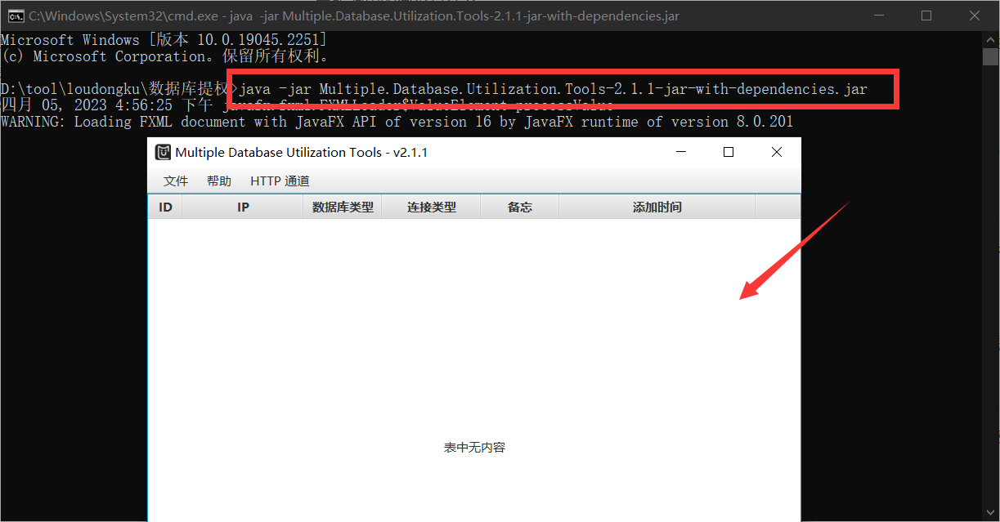

### 4.1.2. 连接目标数据库

这里我们打开工具后，将相关的信息输入进去后就可以进行提权了，不过需要注意数据库要支持外联哦。

右击》添加》选择数据库类型》输入地址》输入账户密码》确认端口是否正确》保存

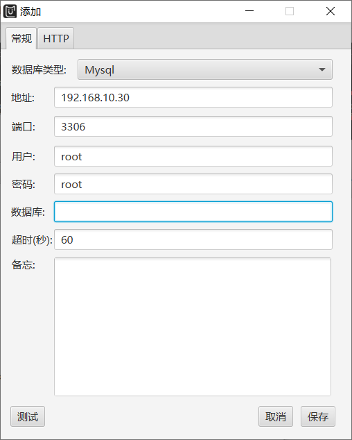

### 4.1.3. 进入目标数据库

这里是成功进入了，但是却无法提权，提示出了一个错误，这个错误是由于secure-file-priv的问题，这个问题我在Windows权限提升—MySQL数据库提权中也说到过，这个值如果为NULL直接就是GG，提权不了。

不过也不是不能修改，而是修改了需要重启数据库，同时如你所看到的，就是这个问题困扰了我一个下午了，解决不了。

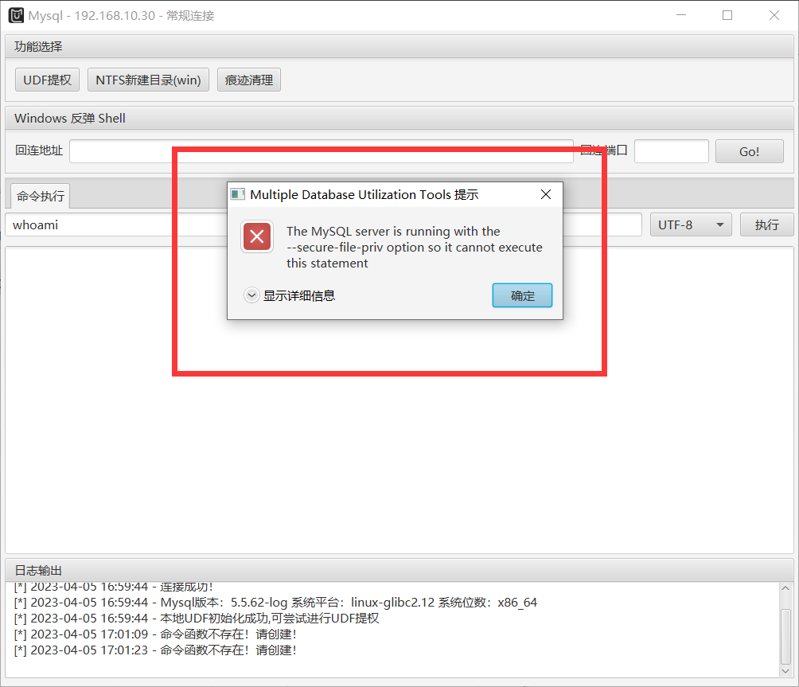

### 4.1.4. 查看secure-file-priv状态

可以看到明显是NULL，如果在Windows上修改好像挺简单的修改，重启，但是在Linux上我修改后重启了无数遍依旧不行，同时部分文章中也提到这个问题，同样也是没解决，注意如果修改成功后果自负哦！！！

```
show global variables like '%secure%';
```

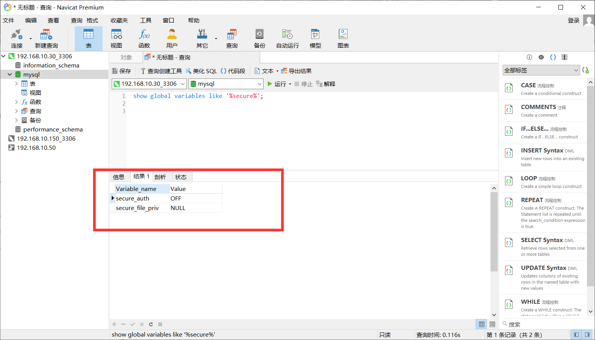

## 4.2. 总结

关于这里，算上烂尾了吧，但是实在是有心无力，可能有人说，为什么不使用低版本的数据库来演示呢，都2023年了，但凡负责任的管理员也会升级数据库了，比如我所在的公司，早就被强制升级了。

至于低版本的演示，百度一大堆，而且在我写过的Windows权限提升—MySQL数据库提权中的操作是一样的操作，我也就不想再去写一边了。

只是这里主要提及了一下这个工具，之前Windows没提过，如果提过了，我直接这章动不会写，同时我也参考了很多关于Linux权限提升的文章，都没涉及数据库提权，反倒Windows权限提升中很多都涉及到了数据库提权，可能在Linux中数据库提权比较麻烦吧，或者遇到的问题和我一样，一致无法让secure-file-priv的状态成为null导致无法演示。

