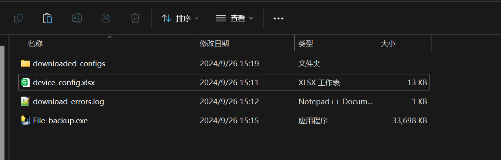
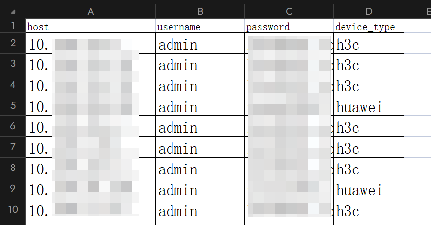
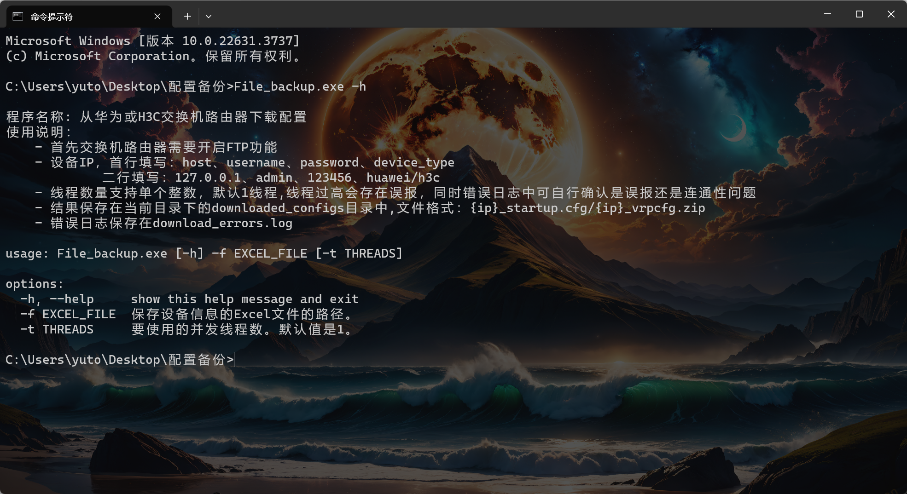
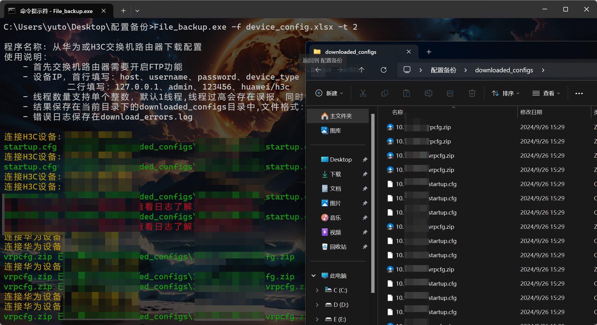

# 1. 前期准备

这里前期需要准备这些文件，不过部分文件是自动产生的，也并非需要手动创建，下面会提示。

重点：

注意需要将华为或华三设备的FTP功能开启，同时华为交换机配置名字为：vrpcfg.zip，华三交换机配置名字为：startup.cfg，所以当出现下载失败的时候，请第一时间确定配置名称是否为这两个，可能由于不同的型号或者版本导致配置名称不同出现下载失败。



downloaded_configs：备份完文件保存的目录，无需创建，会自动生成。

File_backup.exe：备份脚本，脚本名称无所谓，修改成什么都可以，这里我是制作成exe文件了。

download_errors.log：错误日志，无需创建，会自动生成。

device_config.xlsx：存放IP信息的，需要按照下图格式填写。

| host        | username | password     | device_type |
| ----------- | -------- | ------------ | ----------- |
| 192.168.1.1 | admin    | h3c@2021.com | h3c         |
| 192.168.1.2 | admin    | h3c@2021.com | h3c         |
| 192.168.1.3 | admin    | h3c@2021.com | huawei      |



## 1.1. 源代码程序

```python
import os
import time
import signal
import logging
import argparse
from ftplib import FTP, error_temp
import pandas as pd
from concurrent.futures import ThreadPoolExecutor, as_completed
from colorama import init, Fore, Style
import threading

# 初始化 colorama
init(autoreset=True)

# 设置日志记录
logging.basicConfig(filename='download_errors.log', level=logging.ERROR,
                    format='%(asctime)s %(levelname)s: %(message)s')

# 创建线程锁
lock = threading.Lock()


# 定义下载文件函数
def download_file(ftp, filename, local_filename):
    with open(local_filename, 'wb') as local_file:
        ftp.retrbinary(f'RETR {filename}', local_file.write)
        # 获取相对于当前工作目录的相对路径
        relative_path = os.path.relpath(local_filename, os.getcwd())
        with lock:
            print(Fore.GREEN + f'{filename} 已下载为 {relative_path}')  # 下载成功时显示绿色


# 定义下载华为配置函数
def download_huawei_config(host, username, password, download_dir, timeout=30):
    try:
        ftp = FTP(host, timeout=timeout)  # 设置超时时间
        ftp.login(user=username, passwd=password)
        with lock:
            print(Fore.YELLOW + f'连接华为设备: {host}')  # 连接设备时显示黄色

        # 下载文件到指定目录
        local_filename = os.path.join(download_dir, f'{host}_vrpcfg.zip')
        download_file(ftp, 'vrpcfg.zip', local_filename)

        ftp.quit()
    except error_temp as e:
        with lock:
            logging.error(f'下载华为配置时出错: {host} 连接超时或暂时不可用: {e}')
            print(Fore.RED + f"从 {host} 下载错误。查看日志了解更多详细信息。")  # 错误时显示红色
    except Exception as e:
        with lock:
            logging.error(f'下载华为配置时出错: {host}: {e}')
            print(Fore.RED + f"从 {host} 下载错误。查看日志了解更多详细信息。")  # 错误时显示红色


# 定义下载华三配置函数
def download_h3c_config(host, username, password, download_dir, timeout=30):
    try:
        ftp = FTP(host, timeout=timeout)  # 设置超时时间
        ftp.login(user=username, passwd=password)
        with lock:
            print(Fore.YELLOW + f'连接H3C设备: {host}')  # 连接设备时显示黄色

        # 下载文件到指定目录
        local_filename = os.path.join(download_dir, f'{host}_startup.cfg')
        download_file(ftp, 'startup.cfg', local_filename)

        ftp.quit()
    except error_temp as e:
        with lock:
            logging.error(f'下载H3C配置时出错: {host} 连接超时或暂时不可用: {e}')
            print(Fore.RED + f"从 {host} 下载错误。查看日志了解更多详细信息。")  # 错误时显示红色
    except Exception as e:
        with lock:
            logging.error(f'下载H3C配置时出错: {host}: {e}')
            print(Fore.RED + f"从 {host} 下载错误。查看日志了解更多详细信息。")  # 错误时显示红色


# 从 Excel 文件中读取设备信息
def load_config_from_excel(file_path):
    df = pd.read_excel(file_path)
    devices = df.to_dict(orient='records')
    return devices


# 根据设备类型调用相应的下载函数
def download_config(device, download_dir):
    timeout = 30  # 设置超时时间
    # 防止设备类型是浮点数或其他类型，先转换为字符串
    device_type = str(device['device_type']).lower() if 'device_type' in device else None

    if device_type == 'huawei':
        download_huawei_config(device['host'], device['username'], device['password'], download_dir, timeout)
    elif device_type == 'h3c':
        download_h3c_config(device['host'], device['username'], device['password'], download_dir, timeout)
    else:
        with lock:
            logging.error(f"未知设备类型: {device['device_type']}，主机: {device['host']}")
            print(Fore.RED + f"未知设备类型: {device['device_type']}，主机: {device['host']}")  # 错误时显示红色


# 捕获 Ctrl+C 信号并优雅退出
def signal_handler(sig, frame):
    with lock:
        logging.warning("程序被用户中断")
        print(Fore.RED + "\n过程中断，退出……")
    exit(0)


# 主函数
def main(excel_file, num_threads):
    # 清空日志文件
    open('download_errors.log', 'w').close()  # 清空日志文件

    # 记录开始时间
    start_time = time.time()

    # 创建下载目录
    download_dir = os.path.join(os.getcwd(), 'downloaded_configs')
    os.makedirs(download_dir, exist_ok=True)

    # 从 Excel 加载设备配置
    devices = load_config_from_excel(excel_file)

    # 使用多线程下载配置
    with ThreadPoolExecutor(max_workers=num_threads) as executor:
        futures = [executor.submit(download_config, device, download_dir) for device in devices]

        # 捕获所有任务完成的情况
        for future in as_completed(futures):
            try:
                future.result()
            except Exception as e:
                with lock:
                    logging.error(f"线程错误: {e}")

    # 计算并输出运行时间
    end_time = time.time()
    elapsed_time = end_time - start_time
    with lock:
        print(Fore.YELLOW + f"\n下载完成耗时: {elapsed_time:.2f} 秒。")  # 下载完成时显示黄色


if __name__ == '__main__':
    banner = """  
程序名称: 从华为或H3C交换机路由器下载配置      
使用说明：  
    - 首先交换机路由器需要开启FTP功能
    - 设备IP，首行填写：host、username、password、device_type
             二行填写：127.0.0.1、admin、123456、huawei/h3c
    - 线程数量支持单个整数，默认1线程,线程过高会存在误报，同时错误日志中可自行确认是误报还是连通性问题
    - 结果保存在当前目录下的downloaded_configs目录中,文件格式：{ip}_startup.cfg/{ip}_vrpcfg.zip
    - 错误日志保存在download_errors.log
    """
    print(banner)
    # 解析命令行参数
    parser = argparse.ArgumentParser()
    parser.add_argument('-f', dest='excel_file', type=str, required=True,
                        help='保存设备信息的Excel文件的路径。')  # 设置为必选参数
    parser.add_argument('-t', dest='threads', type=int, default=1, help='要使用的并发线程数。默认值是1。')

    args = parser.parse_args()

    # 捕获 Ctrl+C 信号
    signal.signal(signal.SIGINT, signal_handler)

    # 调用主函数
    main(args.excel_file, args.threads)

```



## 1.2. 运行效果

这里可以看以下运行的效果：

误报率还是很高的，但是线程调低就会好很多，由于生产网中会有很多的安全设备，并发太大多少会存在拦截。

```
File_backup.exe -f device_config.xlsx -t 2
```

