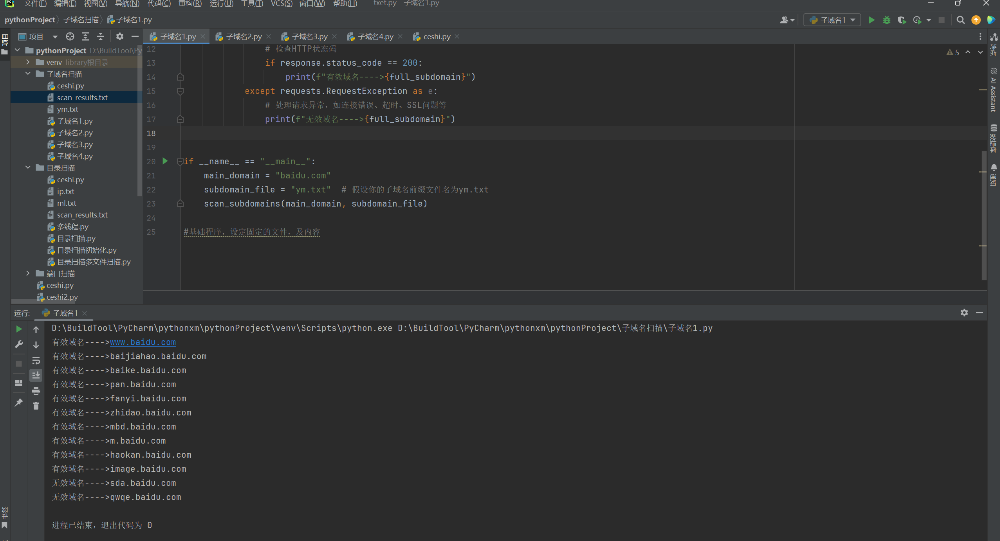
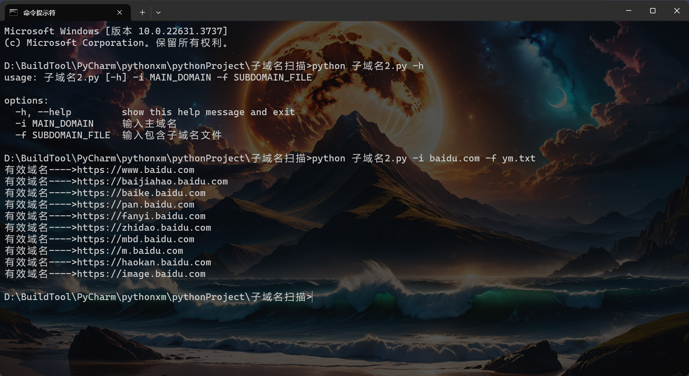
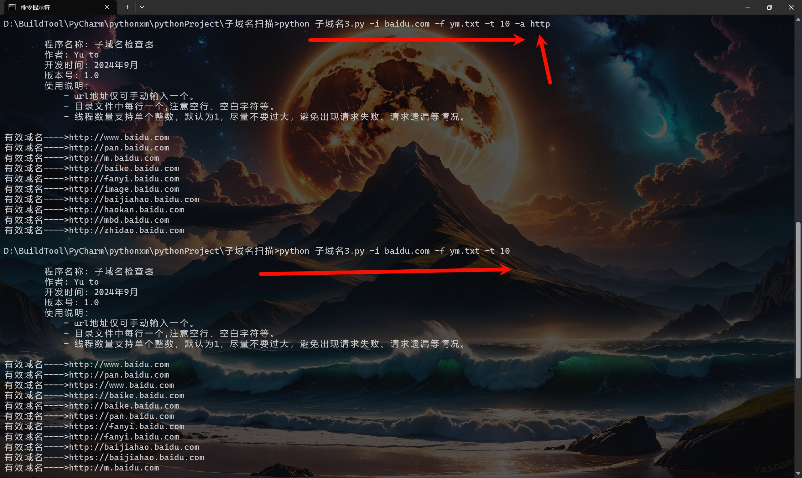
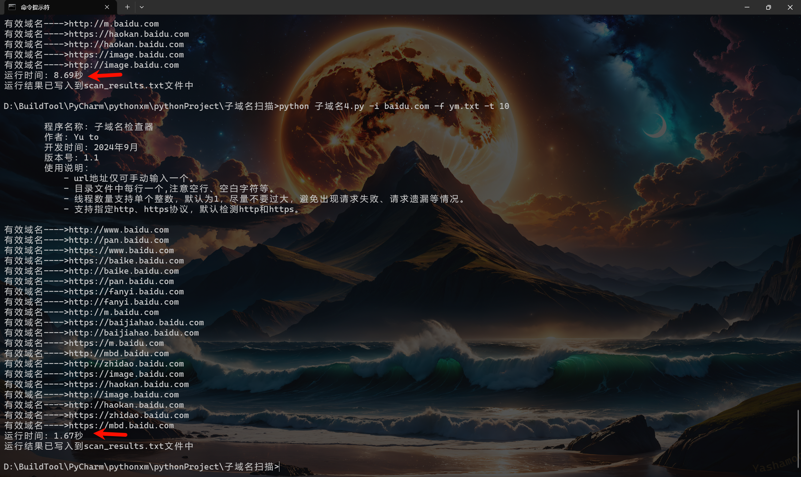

# 1. 前言

不想对内容解释过多了，自行去百度搜索相关的参数怎么使用的吧。对于编写工具基本上用到的无非就是多线程、请求等等这些，很多情况下基本上就是照搬就可以了。

# 2. 子域名扫描器开发

关于子域名扫描器，网上一大堆在线的扫描器，而且在线扫描，还能避免自己地址被发现，其实也挺好的，但是吧总归要了解一下程序是怎么开发的，请求是怎么开发的。

我在没写扫描器的时候感觉不就是通过请求来简单的判断呀，确实，从端口扫描器到目录扫描器再到子域名扫描器，第一阶段的入门扫描都很简单，python也有相应的包基本导入就可以了，但是当添加多线程后，就要考虑到组合，例如本次子域名一些http不会自动跳转到https，你就能说这个域名不通？包括ssl证书、不安全连接等等，都可能存在误报，编写后就能发现在简单的请求下代码就几行。但是如果考虑的全面的话，代码量就不断的增加。

## 2.1. 第一阶段

这一个开发的阶段很简单就几行代码，可以看到基本上就是一个读取文件，然后去执行get请求，有效就输出，无效也输出。

```python
import requests

def scan_subdomains(main_domain, subdomain_file):
    with open(subdomain_file, 'r') as file:
        for subdomain in file:
            # 去除行尾的换行符并添加主域名
            full_subdomain = f"{subdomain.strip()}.{main_domain}"
            try:
                # 发送GET请求到该子域名
                response = requests.get(f"https://{full_subdomain}", timeout=5)
                # 检查HTTP状态码
                if response.status_code == 200:
                    print(f"有效域名---->{full_subdomain}")
            except requests.RequestException as e:
                # 处理请求异常，如连接错误、超时、SSL问题等
                print(f"无效域名---->{full_subdomain}")


if __name__ == "__main__":
    main_domain = "baidu.com"
    subdomain_file = "ym.txt"  # 假设你的子域名前缀文件名为ym.txt
    scan_subdomains(main_domain, subdomain_file)

#基础程序，设定固定的文件，及内容
```



## 2.2. 第二阶段

这个阶段如果想要将脚本发给其它人使用，那么就需要设定一些手动输入的，比如在第一阶段中请求的域名、子域名文件都是固定的，倘若别人不是按照你设定的，那么必然会出现问题，这时候就需要添加一个给用户自行输入的功能。

同时在代码中添加https和http的判断，默认使用https进行测试，如果https不通则使用http再次进行测试。

```python
import requests
import argparse


def scan_subdomains(main_domain, subdomain_file, default_protocol="https"):
    protocols = [default_protocol]
    if default_protocol == "https" and "http" not in protocols:  # 默认以https执行，如果https不通则执行http
        protocols.append("http")

    with open(subdomain_file, 'r') as file:
        for subdomain in file:
            subdomain = subdomain.strip()  # 去除行尾的换行符
            if not subdomain:  # 忽略空行
                continue
            for protocol in protocols:  # 循环协议
                url = f"{protocol}://{subdomain}.{main_domain}" # 组合url
                try:
                    response = requests.get(url, timeout=5)  # 请求get 延迟5秒
                    if response.status_code == 200:
                        print(f"有效域名---->{url}")
                        break  # 如果找到有效域名，则不再尝试其他协议
                except requests.RequestException as e:
                    # 可以在这里打印异常信息，以便调试
                    continue  # 忽略异常，继续尝试下一个协议或下一个子域名


if __name__ == "__main__":
    # 使用 argparse 解析命令行参数
    parser = argparse.ArgumentParser()
    parser.add_argument('-i', dest='main_domain', type=str, required=True, help='输入主域名')
    parser.add_argument('-f', dest='subdomain_file', type=str, required=True,
                        help='输入包含子域名文件')

    args = parser.parse_args()
    main_domain = args.main_domain
    subdomain_file = args.subdomain_file

    scan_subdomains(main_domain, subdomain_file)

# 添加手动输入域名和文件

```



## 2.3. 第三阶段

基本上如果自己使用第二阶段已经可以了，但是如果涉及到很多的子域名测试，单线程的情况下运行会很慢，那么就需要添加多线程功能。

同时这里，我添加了可控的多线程功能，允许用户自行输入线程数，同时对之前的https与http进行了更新，允许用户手动输入测试https还是http，如果不输入，则默认https与http均测试。

```python
import requests
from concurrent.futures import ThreadPoolExecutor, as_completed
import argparse


def check_subdomain(args):
    subdomain, main_domain, protocol = args  # 解包
    url = f"{protocol}://{subdomain}.{main_domain}"
    try:
        response = requests.get(url, timeout=5)
        if response.status_code == 200:
            return url  # 返回有效的域名
    except requests.RequestException as e:
        return None  # 请求异常，返回None


def scan_subdomains(main_domain, subdomain_file, max_workers, protocols):
    with open(subdomain_file, 'r') as file:
        subdomains = [line.strip() for line in file if line.strip()]  # 去除空行，首尾换行符

    results = []  # 用于存储有效的域名
    with ThreadPoolExecutor(max_workers=max_workers) as executor:
        futures = {
            # 根据subdomains和protocols进行组合，也就是根据子域名和协议进行组合。
            executor.submit(check_subdomain, (subdomain, main_domain, protocol))
            for subdomain in subdomains
            for protocol in protocols
        }

        for future in as_completed(futures):
            result = future.result()  # 获取每个任务的结果
            if result:
                results.append(result)
                print(f"有效域名---->{result}")

    return results


if __name__ == "__main__":
    banner = """  
        程序名称: 子域名检查器    
        作者: Yu to   
        开发时间: 2024年9月    
        版本号: 1.0    
        使用说明：  
            - url地址仅可手动输入一个。  
            - 目录文件中每行一个,注意空行、空白字符等。  
            - 线程数量支持单个整数，默认为1，尽量不要过大，避免出现请求失败、请求遗漏等情况。  
                """
    print(banner)
    parser = argparse.ArgumentParser()
    parser.add_argument('-i', dest='main_domain', type=str, required=True, help='输入主域名')
    parser.add_argument('-f', dest='subdomain_file', type=str, required=True, help='输入包含子域名文件')
    parser.add_argument('-t', dest='max_workers', type=int, default=1, help='设置并发线程的最大数量，默认为1')
    parser.add_argument('-a', dest='protocol', type=str, default='both',
                        choices=['https', 'http', 'both'],
                        help='指定协议类型，可以是 https、http 或 both（同时测试两种协议），默认为 both')

    args = parser.parse_args()
    main_domain = args.main_domain
    subdomain_file = args.subdomain_file
    max_workers = args.max_workers

    # 判断用户输入的协议
    if args.protocol == 'both':
        protocols = ['https', 'http']
    else:
        protocols = [args.protocol]

    scan_subdomains(main_domain, subdomain_file, max_workers, protocols)


```



## 2.4. 第四阶段

这个阶段基本上就是最终的一个阶段了，添加了用户可以使用CTRL+C进行提前结束，并且添加了时间记录，可以直观的看出一共允许了多少秒，并且将所有的结果都写入到文件中，避免出现不小心结束终端，导致辛辛苦苦测试出来的结果丢失。

可以看一下最下面的图，分别使用默认1线程和10线程测试的速度。

```python
import requests
from concurrent.futures import ThreadPoolExecutor, as_completed
import argparse
import time


def check_subdomain(args):
    subdomain, main_domain, protocol = args
    url = f"{protocol}://{subdomain}.{main_domain}"
    try:
        response = requests.get(url, timeout=5)
        if response.status_code == 200:
            return url  # 返回有效的域名
    except requests.RequestException:
        return None  # 请求异常，返回None


def scan_subdomains(main_domain, subdomain_file, max_workers, protocols, result_file):
    with open(subdomain_file, 'r') as file:
        subdomains = [line.strip() for line in file if line.strip()]

    results = []  # 用于存储有效的域名
    with ThreadPoolExecutor(max_workers=max_workers) as executor:
        futures = {
            executor.submit(check_subdomain, (subdomain, main_domain, protocol))
            for subdomain in subdomains
            for protocol in protocols
        }

        try:
            for future in as_completed(futures):
                result = future.result()  # 获取每个任务的结果
                if result:
                    results.append(result)
                    print(f"有效域名---->{result}")

                    # 每次找到一个有效域名就立即写入文件
                    with open(result_file, 'a') as f:
                        f.write(f"{result}\n")
        except KeyboardInterrupt:
            print("\n程序被用户中断。")
            return results  # 返回中断时的结果

    return results


if __name__ == "__main__":
    banner = """  
        程序名称: 子域名检查器    
        作者: Yu to   
        开发时间: 2024年9月    
        版本号: 1.1    
        使用说明：  
            - url地址仅可手动输入一个。  
            - 目录文件中每行一个,注意空行、空白字符等。  
            - 线程数量支持单个整数，默认为1，尽量不要过大，避免出现请求失败、请求遗漏等情况。
            - 支持指定http、https协议，默认检测http和https。
    """
    print(banner)

    parser = argparse.ArgumentParser()
    parser.add_argument('-i', dest='main_domain', type=str, required=True, help='输入主域名')
    parser.add_argument('-f', dest='subdomain_file', type=str, required=True, help='输入包含子域名文件')
    parser.add_argument('-t', dest='max_workers', type=int, default=1, help='设置并发线程的最大数量，默认为1')
    parser.add_argument('-a', dest='protocol', type=str, default='both',
                        choices=['https', 'http', 'both'],
                        help='指定协议类型，可以是 https、http 或 both（同时测试两种协议），默认为 both')

    args = parser.parse_args()
    main_domain = args.main_domain
    subdomain_file = args.subdomain_file
    max_workers = args.max_workers

    # 判断用户输入的协议
    if args.protocol == 'both':
        protocols = ['https', 'http']
    else:
        protocols = [args.protocol]

    result_file = 'scan_results.txt'

    # 清空结果文件，防止追加到上次的内容
    with open(result_file, 'w') as f:
        f.write("扫描结果:\n")

    start_time = time.time()  # 记录开始时间
    with open(result_file, 'a') as f:
        f.write(f"开始时间: {time.strftime('%Y-%m-%d %H:%M:%S', time.localtime(start_time))}\n")
    try:
        scan_subdomains(main_domain, subdomain_file, max_workers, protocols, result_file)
    except Exception as e:
        print(f"程序出现错误: {e}")

    end_time = time.time()  # 记录结束时间
    elapsed_time = end_time - start_time
    with open(result_file, 'a') as f:
        f.write(f"运行时间: {elapsed_time:.2f} 秒\n")

    print(f"运行时间: {elapsed_time:.2f}秒")
	print("运行结果已写入到scan_results.txt文件中")
```



# 3. 总结

总得来说整体程序的编写基本上都是之前几个脚本模板的套写，有点像之前我写过的poc编写的那样，基本上都是套，无非就是判断需要根据实际的情况来进行判断一下。