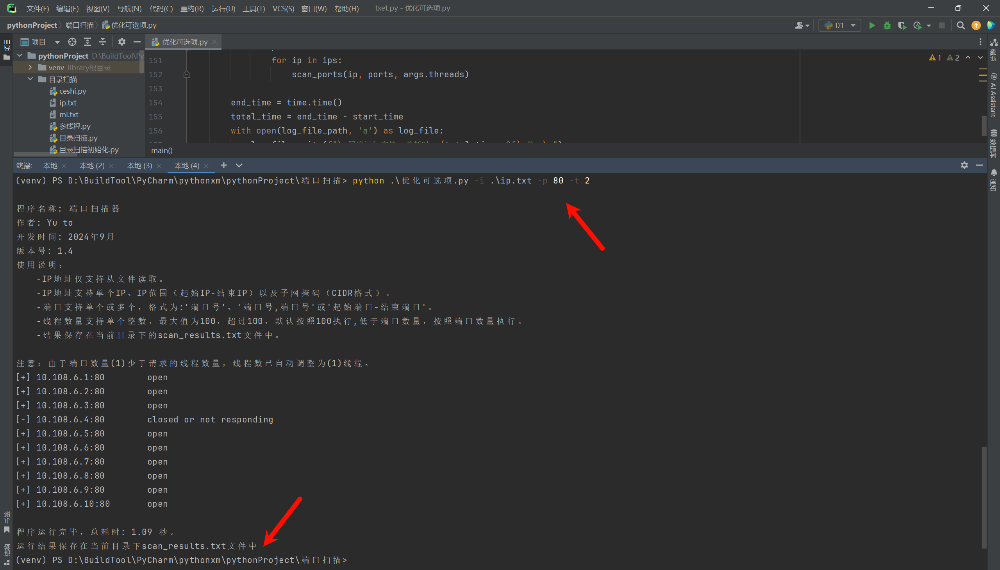
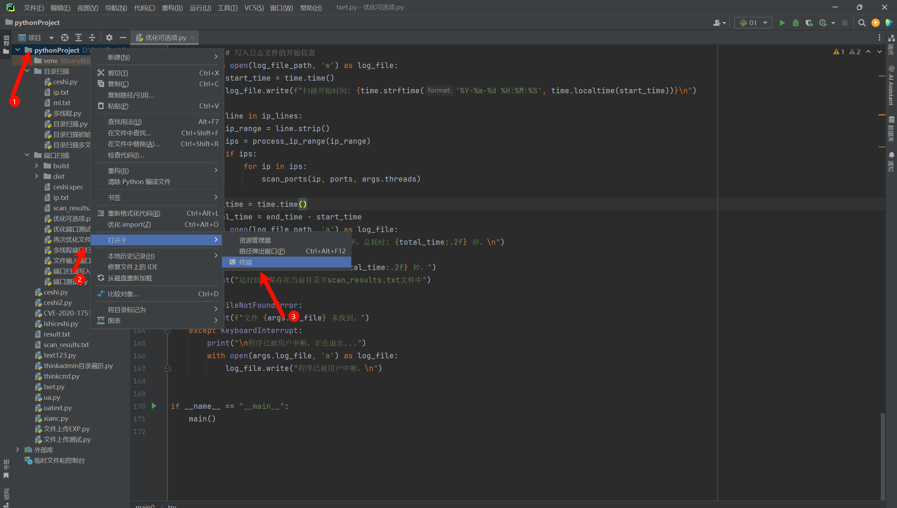
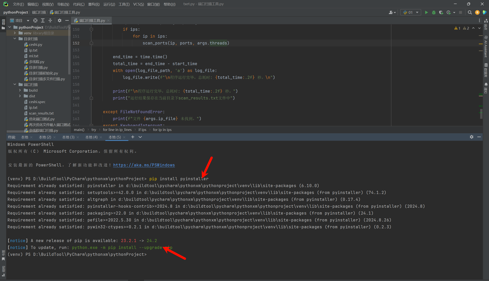
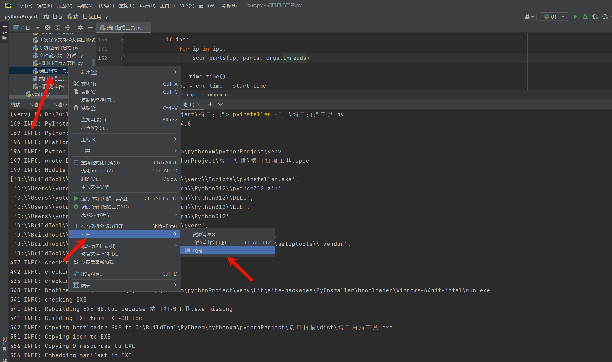
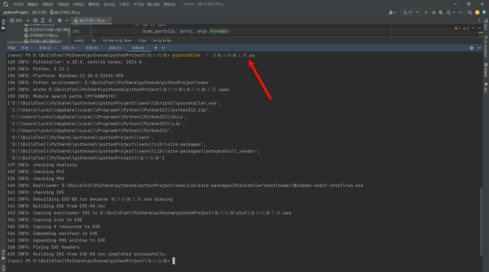
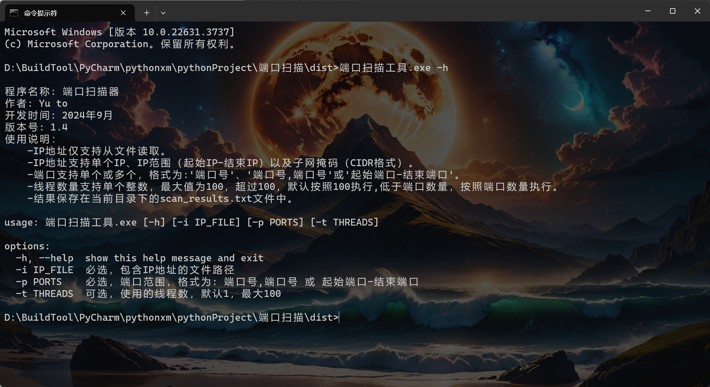
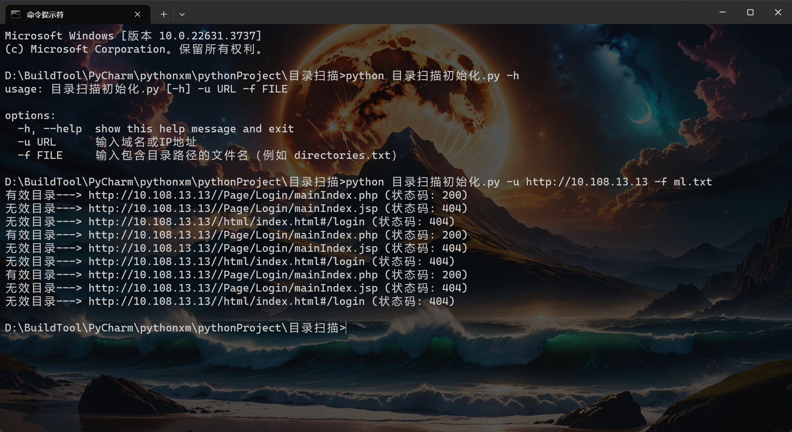
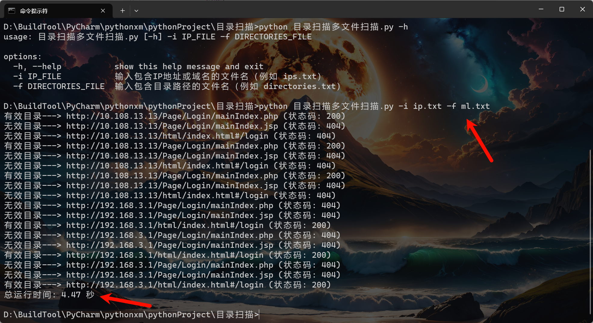
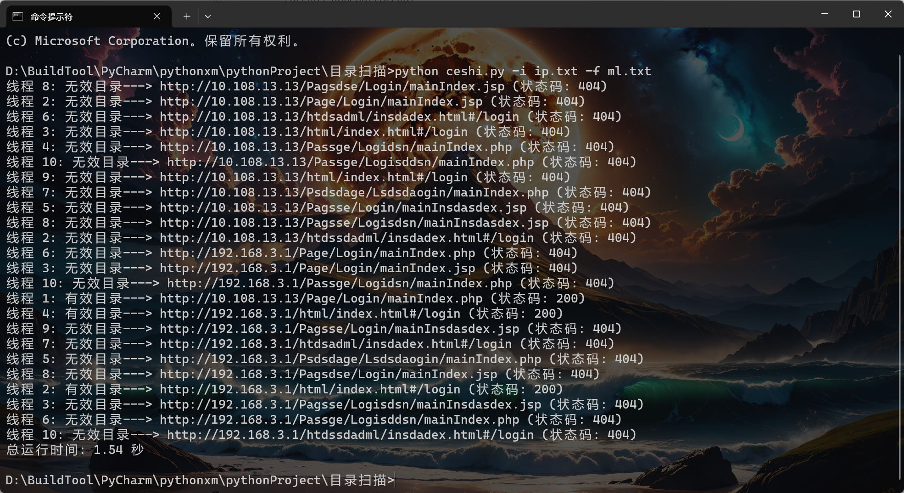
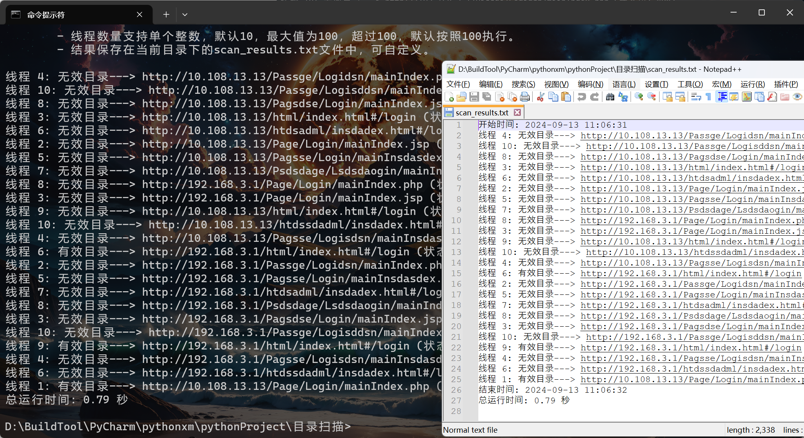

# 1. 前言

我发现前段时间写的python开发端口扫描工具，可能文章太长了，各位都不想看，那我也没办法，天天想着脱离脚本小子，又不想去看长文章，去花几百块去买视频看，不如一人打赏我5块钱吧。哈哈哈哈哈~~~~开玩笑。

上篇文章确实长，主要是想一次性说清楚，我也可以将文章分割成几天发，但是我觉得没意义！上篇大约一万余字吧，所以不要急着看我一段时间不更新，就取关了，一篇一万字的文章我得写多久，而且我还上班，都是抽空写的，同时截图上传等等都是时间，上次那片文章纯写了8个多小时，实际上我前前后后差不多准备了几天的时间，看着很简单，但是后面我准备的时间更久，例如今天的目录扫描，前前后后也三天下来了，而且最近网络安全宣传周很忙，都是抽空写的。

鱼头文章不划水，时间长不更新，多数在憋大招。

## 1.1. 完善端口扫描工具

上次写的是使用python编写端口扫描工具，后续我又完善了一下，具体完善内容如下：

- 添加命令参数，不再一条一条输入。
- 添加日志功能，将所有输出到终端的内容同步输入到日志文件中。
- 去除按q退出功能，仅支持ctrl+c退出。
- 使用方式：python 端口扫描.py -i IP地址 -p 端口 -t 线程数量

```python
import socket
import ipaddress
import time
import threading
import argparse

# 创建一个锁对象
print_lock = threading.Lock()

# 记录文件路径
log_file_path = "scan_results.txt"


def port_scan(ip, port):
    try:
        s = socket.socket(socket.AF_INET, socket.SOCK_STREAM)  # 基于TCP
        s.settimeout(1)  # 超时时间
        s.connect((ip, port))  # 连接服务端，也就是连接目标的IP地址及端口
        result = f"[+] {ip}:{port} \t open"  # 成功的结果
    except socket.error:
        result = f"[-] {ip}:{port} \t closed or not responding"  # 错误的结果
    finally:
        s.close()

    # 使用锁来确保输出和写入是互斥的
    with print_lock:
        # 打印结果到终端
        print(result)
        # 写入结果到文件
        with open(log_file_path, 'a') as log_file:
            log_file.write(result + '\n')


def scan_ports(ip, ports, num_threads):
    def worker(port):
        port_scan(ip, port)

    threads = []
    for i in range(0, len(ports), num_threads):
        for port in ports[i:i + num_threads]:
            t = threading.Thread(target=worker, args=(port,))
            t.start()
            threads.append(t)
        for t in threads:
            t.join()


def parse_ports(port_input):
    ports = []
    if ',' in port_input:
        port_strings = port_input.split(',')
        for port_string in port_strings:
            if port_string.isdigit():
                ports.append(int(port_string))
    elif '-' in port_input:
        parts = port_input.split('-', 1)
        if len(parts) == 2:
            if all(part.isdigit() for part in parts):
                start, end = map(int, parts)
                if start <= end:
                    ports.extend(range(start, end + 1))
                else:
                    print("起始端口不能大于结束端口。")
    elif port_input.isdigit():
        ports.append(int(port_input))
    else:
        print("无效的端口输入，请使用'端口号'、'端口号,端口号'或'起始端口-结束端口'的格式。")
    return ports


def process_ip_range(ip_range):
    try:
        network = ipaddress.ip_network(ip_range, strict=False)
        hosts_list = [str(ip) for ip in network.hosts()]
        return hosts_list
    except ValueError:
        try:
            start_ip_str, end_ip_str = ip_range.split('-', 1)
            start_ip = ipaddress.IPv4Address(start_ip_str.strip())
            end_ip = ipaddress.IPv4Address(end_ip_str.strip())
            if start_ip > end_ip:
                print("起始IP不能大于结束IP。")
                return []
            start_int = int(start_ip)
            end_int = int(end_ip)
            ip_list = [str(ipaddress.IPv4Address(ip)) for ip in range(start_int, end_int + 1)]
            return ip_list
        except ValueError:
            print("IP范围格式无效。")
            return []


def main():
    banner = """
程序名称: 端口扫描器  
作者: Yu to 
开发时间: 2024年9月  
版本号: 1.4  
使用说明：
    -IP地址仅支持从文件读取。
    -IP地址支持单个IP、IP范围（起始IP-结束IP）以及子网掩码（CIDR格式）。
    -端口支持单个或多个，格式为:'端口号'、'端口号,端口号'或'起始端口-结束端口'。
    -线程数量支持单个整数，最大值为100，超过100，默认按照100执行,低于端口数量，按照端口数量执行。
    -结果保存在当前目录下的scan_results.txt文件中。
        """
    print(banner)
    # 创建解析器
    parser = argparse.ArgumentParser()
    parser.add_argument("-i", dest='ip_file', type=str, help='必选，包含IP地址的文件路径')
    parser.add_argument("-p", dest='ports', type=str, help='必选，端口范围，格式为: 端口号,端口号 或 起始端口-结束端口')
    parser.add_argument("-t", dest='threads', type=int, default=1, help='可选，使用的线程数，默认1，最大100')

    # 解析命令行参数
    args = parser.parse_args()

    if args.threads < 1:
        print("线程数量必须大于0。")
        return
    if args.threads > 100:
        args.threads = 100

    if args.ip_file is None:
        print("必须指定包含IP地址的文件路径（-i 参数）。")
        return

    if args.ports is None:
        print("必须输入指定端口（-p 参数）。")
        return

    try:
        with open(args.ip_file, 'r') as file:
            ip_lines = file.readlines()

        ports = parse_ports(args.ports)
        if not ports:
            print("无效的端口输入。")
            return

        if len(ports) < args.threads:
            print(f"注意：由于端口数量({len(ports)})少于请求的线程数量，线程数已自动调整为({len(ports)})线程。")

            # 写入日志文件的开始信息
        with open(log_file_path, 'w') as log_file:
            start_time = time.time()
            log_file.write(f"扫描开始时间: {time.strftime('%Y-%m-%d %H:%M:%S', time.localtime(start_time))}\n")

        for line in ip_lines:
            ip_range = line.strip()
            ips = process_ip_range(ip_range)
            if ips:
                for ip in ips:
                    scan_ports(ip, ports, args.threads)

        end_time = time.time()
        total_time = end_time - start_time
        with open(log_file_path, 'a') as log_file:
            log_file.write(f"\n程序运行完毕，总耗时: {total_time:.2f} 秒。\n")

        print(f"\n程序运行完毕，总耗时: {total_time:.2f} 秒。")
        print("运行结果保存在当前目录下scan_results.txt文件中")

    except FileNotFoundError:
        print(f"文件 {args.ip_file} 未找到。")
    except KeyboardInterrupt:
        print("\n程序已被用户中断，正在退出...")
        with open(args.log_file, 'a') as log_file:
            log_file.write("程序已被用户中断。\n")


if __name__ == "__main__":
    main()

```



## 1.2. 制作exe文件

使用python毕竟不方便，当脱离这个python环境的时候就无法运行，这里就是简单的教一下将python文件打包成exe文件，能不能过免杀我不管。

首先打开pycharm的终端terminal



安装pyinstaller，输入命令：pip install pyinstaller，由于我这里安装过了，安装成功的库会在后面显示successful。



## 1.3. 打包教程

常用参数：

```
-i 或 -icon 生成icon
-F 创建一个绑定的可执行文件
-w 使用窗口，无控制台
-C 使用控制台，无窗口
-D 创建一个包含可执行文件的单文件夹包(默认情况下)
-n 文件名
```

首先选中你需要打包的文件，然后打开终端。



打开控制台后就可以输入打包命令了，这里需要注意我只是使用了-F的参数，由于我需要使用控制台，就不能添加-w的参数，使用-w的参数适合那些添加了GUI界面的，双击exe文件就能弹出窗口的，而我这个需要输入命令，所以不能使用这个参数。

```
pyinstaller -F .\端口扫描工具.py
```



在你当前文件的目录中会出现一个dist的文件，而这个制作好的exe文件就在里面，双击是无效果的，还是需要输入命令，只是不再依赖python程序了。



## 1.4. 关于文件大小

使用这种方式打包出现的exe文件会很大，至于怎么解决文件的大小方式，自行搜吧，网上一大堆。

# 2. 目录扫描工具

本次主要是目录扫描工具，关于目录扫描工具我就不把每个模块描述的很清楚了，可以自行百度搜索，因为我也不是专业编写的程序的，所以描述有时候也不准确，正好也相当于留点自行发挥的余地，是否能够拉开差距就在这里了。

## 2.1. 入门代码

这里的入门代码就是很简单的一串代码，循环读取目录文件中的每一行目录，然后与URL拼接起来，使用get请求去访问，并设定延迟5秒。如果状态码是200，则表明通信，如果状态码不是200则表明不通，同时将状态码输出来。

```python
import requests
import argparse


def check_url(url, file):
    # 读取目录文件
    try:
        with open(file, 'r') as file:
            directories = file.readlines()
    except FileNotFoundError:
        print(f"错误: 目录文件 '{file}' 不存在")
        return

        # 遍历每个目录并检查状态码
    for directory in directories:
        directory = directory.strip()  # 去除可能的换行符
        if directory:
            full_url = f"{url}/{directory}"  # 注意：通常在URL中添加'/'
            try:
                response = requests.get(url=full_url, timeout=5)
                if response.status_code == 200:
                    print(f"有效目录---> {full_url} (状态码: {response.status_code})")
                else:
                    print(f"无效目录---> {full_url} (状态码: {response.status_code})")
            except requests.RequestException as e:
                print(f"无效 URL: {full_url} (错误: {e})")


if __name__ == "__main__":
    # 创建解析器
    parser = argparse.ArgumentParser()

    # 添加参数
    parser.add_argument("-u", dest='url', type=str, required=True, help='输入域名或IP地址')
    parser.add_argument("-f", dest='file', type=str, required=True,
                        help='输入包含目录路径的文件名（例如 directories.txt）')

    # 解析命令行参数
    args = parser.parse_args()

    # 调用函数
    check_url(args.url, args.file)

```



## 2.2. 优化代码

这里我们发现每次智能输入一个url，可选项比较低，这里我将url也修改成从文件中读取，并添加了记时功能。

```python
import requests
from urllib.parse import urljoin
import argparse
import time  # 导入time模块

def check_url(ip_file, directories_file):
    start_time = time.time()  # 记录开始时间
    # 读取IP地址或域名文件
    base_urls = []
    try:
        with open(ip_file, 'r') as ip_f:
            for line in ip_f:
                stripped_line = line.strip()
                if stripped_line:  # 确保不是空行
                    base_urls.append(stripped_line)
    except FileNotFoundError:
        print(f"错误: IP地址或域名文件 '{ip_file}' 不存在")
        return

        # 读取目录文件
    directories = []
    try:
        with open(directories_file, 'r') as dirs_f:
            for line in dirs_f:
                stripped_line = line.strip()
                if stripped_line:  # 确保不是空行
                    directories.append(stripped_line)
    except FileNotFoundError:
        print(f"错误: 目录文件 '{directories_file}' 不存在")
        return

        # 遍历每个IP地址或域名
    for base_url in base_urls:
        # 遍历每个目录
        for directory in directories:
            # 使用urljoin来确保URL的正确拼接
            full_url = urljoin(base_url, directory)
            try:
                response = requests.get(url=full_url, timeout=5)
                if response.status_code == 200:
                    print(f"有效目录---> {full_url} (状态码: {response.status_code})")
                else:
                    print(f"无效目录---> {full_url} (状态码: {response.status_code})")
            except requests.RequestException as e:
                print(f"无效 URL: {full_url} (错误: {e})")
    end_time = time.time()  # 记录结束时间
    total_time = end_time - start_time  # 计算总时间
    print(f"总运行时间: {total_time:.2f} 秒")  # 打印总运行时间


if __name__ == "__main__":
    # 创建解析器
    parser = argparse.ArgumentParser()

    # 添加参数
    parser.add_argument("-i", dest='ip_file', type=str, required=True,
                        help='输入包含IP地址或域名的文件名（例如 ips.txt）')
    parser.add_argument("-f", dest='directories_file', type=str, required=True,
                        help='输入包含目录路径的文件名（例如 directories.txt）')

    # 解析命令行参数
    args = parser.parse_args()

    # 调用函数
    check_url(args.ip_file, args.directories_file)
```



## 2.3. 添加多线程

这里当添加多个IP地址与多个目录的时候就会出现扫描较慢的情况，这里就添加一个多线程，基本上和之前的端口扫描差不多原理调用。

### 2.3.1. urllib.parse模块

`urllib.parse` 是 Python 标准库中的一个模块，它提供了一系列用于解析和构建 URL 的函数。其中，`urljoin` 函数是 `urllib.parse` 模块中非常有用的一个，它用于将基本 URL（base URL）与另一个 URL（可能是一个相对 URL）合并成一个完整的 URL。这在处理网络请求或构建指向网站其他部分的链接时特别有用。

这里使用这个模块主要是避免在url及目录中可能出现如下的情况：

```python
IP地址：https://192.168.1.1/
目录地址：/index.php
拼接：https://192.168.1.1//index.php
```

正常思路拼接后会出现两个//的问题，就会导致网页出现无法通信的情况，而使用这个模块就可以避免这个问题。

使用方式：

```python
urljoin(base, url, allow_fragments=True) 函数接受三个参数：

base：基础 URL，即你想要与之合并的另一个 URL 的基础部分。
url：你想要合并到基础 URL 中的 URL。这个 URL 可以是相对的也可以是绝对的。
allow_fragments（可选）：一个布尔值，指定是否允许在结果 URL 中包含片段标识符（即 URL 的 # 部分）。默认值为 True。
```

```python
from urllib.parse import urljoin  
  
# 基础 URL  
base_url = 'http://example.com/path/to/'  
  
# 示例 1：相对 URL  
relative_url = 'file.html'  
result = urljoin(base_url, relative_url)  
print(result)  # 输出: http://example.com/path/to/file.html  
  
# 示例 2：包含查询参数的相对 URL  
relative_url_with_query = 'file.html?param=value'  
result = urljoin(base_url, relative_url_with_query)  
print(result)  # 输出: http://example.com/path/to/file.html?param=value  
  
# 示例 3：绝对 URL  
absolute_url = 'http://another.com/file.html'  
result = urljoin(base_url, absolute_url)  
print(result)  # 输出: http://another.com/file.html  
  
# 示例 4：带有片段标识符的 URL  
relative_url_with_fragment = 'file.html#section'  
result = urljoin(base_url, relative_url_with_fragment)  
print(result)  # 输出: http://example.com/path/to/file.html#section  
  
# 示例 5：禁用片段标识符  
result = urljoin(base_url, relative_url_with_fragment, allow_fragments=False)  
print(result)  # 输出: http://example.com/path/to/file.html （注意：#section 被移除了）
```

### 2.3.2. 案例

```python
import requests
from urllib.parse import urljoin
import argparse
import time
from threading import Thread, Lock
import queue

# 创建一个线程安全的队列和一个锁
task_queue = queue.Queue()
print_lock = Lock()


def check_url_thread(thread_id):
    while not task_queue.empty():
        base_url, directory = task_queue.get()
        full_url = urljoin(base_url, directory)
        try:
            response = requests.get(url=full_url, timeout=5)
            with print_lock:
                if response.status_code == 200:
                    print(f"线程 {thread_id}: 有效目录---> {full_url} (状态码: {response.status_code})")
                else:
                    print(f"线程 {thread_id}: 无效目录---> {full_url} (状态码: {response.status_code})")
        except requests.RequestException as e:
            with print_lock:
                print(f"线程 {thread_id}: 无效 URL: {full_url} (错误: {e})")
        finally:
            task_queue.task_done()


def check_url(ip_file, directories_file, num_threads):
    start_time = time.time()  # 记录开始时间

    # 读取IP地址或域名文件
    base_urls = []
    try:
        with open(ip_file, 'r') as ip_f:
            for line in ip_f:
                stripped_line = line.strip()
                if stripped_line:  # 确保不是空行
                    base_urls.append(stripped_line)
    except FileNotFoundError:
        print(f"错误: IP地址或域名文件 '{ip_file}' 不存在")
        return

    # 读取目录文件
    directories = []
    try:
        with open(directories_file, 'r') as dirs_f:
            for line in dirs_f:
                stripped_line = line.strip()
                if stripped_line:  # 确保不是空行
                    directories.append(stripped_line)
    except FileNotFoundError:
        print(f"错误: 目录文件 '{directories_file}' 不存在")
        return

    # 将所有任务添加到队列中
    for base_url in base_urls:
        for directory in directories:
            task_queue.put((base_url, directory))

    # 创建并启动线程
    threads = []
    for i in range(min(num_threads, 100)):
        thread = Thread(target=check_url_thread, args=(i + 1,))
        threads.append(thread)
        thread.start()

    # 等待所有线程完成
    task_queue.join()

    end_time = time.time()  # 记录结束时间
    total_time = end_time - start_time  # 计算总时间
    print(f"总运行时间: {total_time:.2f} 秒")  # 打印总运行时间


if __name__ == "__main__":
    # 创建解析器
    parser = argparse.ArgumentParser()

    # 添加参数
    parser.add_argument("-i", dest='ip_file', type=str, required=True,
                        help='输入包含IP地址或域名的文件名（例如 ips.txt）')
    parser.add_argument("-f", dest='directories_file', type=str, required=True,
                        help='输入包含目录路径的文件名（例如 directories.txt）')
    parser.add_argument("-t", dest='num_threads', type=int, default=10,
                        help='指定线程数量（上限为100）')

    # 解析命令行参数
    args = parser.parse_args()

    # 调用函数
    check_url(args.ip_file, args.directories_file, args.num_threads)

```



## 2.4. 最终代码

其中很多的功能和端口扫描中的案例基本上都是相符的，无太多的难度。

```python
import requests  # 导入requests库用于发送HTTP请求
from urllib.parse import urljoin  # 导入urljoin函数用于拼接URL
import argparse  # 导入argparse库用于解析命令行参数
import time  # 导入time库用于记录时间
from threading import Thread, Lock  # 导入Thread和Lock用于多线程和线程安全
import queue  # 导入queue库中的Queue用于线程安全的队列

# 创建一个线程安全的队列和一个锁
task_queue = queue.Queue()  # 用于存储待检查的URL任务
print_lock = Lock()  # 用于控制多线程打印时的线程安全
stop_threads = False  # 用于控制是否停止所有线程的布尔变量


def check_url_thread(thread_id, log_file):
    while not stop_threads and not task_queue.empty():  # 只要未停止且队列不为空，就继续循环
        base_url, directory = task_queue.get()  # 从队列中获取一个任务
        full_url = urljoin(base_url, directory)  # 拼接完整的URL
        try:
            response = requests.get(url=full_url, timeout=5)  # 发送GET请求
            with print_lock:  # 锁定打印区域，确保线程安全
                # 根据响应状态码构建输出字符串
                output_line = f"线程 {thread_id}: "
                if response.status_code == 200:
                    output_line += f"有效目录---> {full_url} (状态码: {response.status_code})"
                else:
                    output_line += f"无效目录---> {full_url} (状态码: {response.status_code})"
                print(output_line)  # 打印到控制台
                # 写入到日志文件
                with open(log_file, 'a') as log_f:
                    log_f.write(output_line + '\n')
        except requests.RequestException as e:  # 捕获请求异常
            with print_lock:
                # 构建并打印错误消息
                error_line = f"线程 {thread_id}: 无效 URL: {full_url} (错误: {e})"
                print(error_line)
                # 写入到日志文件
                with open(log_file, 'a') as log_f:
                    log_f.write(error_line + '\n')
        finally:
            task_queue.task_done()  # 表示队列中的一个任务已完成
            if stop_threads:
                with print_lock:
                    print(f"线程 {thread_id} 已终止")


def check_url(ip_file, directories_file, num_threads, log_file):
    global stop_threads  # 声明全局变量
    start_time = time.time()  # 记录开始时间
    # 写入日志文件的开始时间
    with open(log_file, 'w') as log_f:
        log_f.write(f"开始时间: {time.strftime('%Y-%m-%d %H:%M:%S', time.localtime(start_time))}\n")

        # 读取IP地址或域名文件
    base_urls = []
    try:
        with open(ip_file, 'r') as ip_f:
            for line in ip_f:
                stripped_line = line.strip()
                if stripped_line:  # 确保不是空行
                    base_urls.append(stripped_line)
    except FileNotFoundError:
        print(f"错误: IP地址或域名文件 '{ip_file}' 不存在")
        return

        # 读取目录文件
    directories = []
    try:
        with open(directories_file, 'r') as dirs_f:
            for line in dirs_f:
                stripped_line = line.strip()
                if stripped_line:  # 确保不是空行
                    directories.append(stripped_line)
    except FileNotFoundError:
        print(f"错误: 目录文件 '{directories_file}' 不存在")
        return

        # 将所有任务添加到队列中
    for base_url in base_urls:
        for directory in directories:
            task_queue.put((base_url, directory))

            # 创建并启动线程
    threads = []
    for i in range(min(num_threads, 100)):  # 确保线程数不超过100
        thread = Thread(target=check_url_thread, args=(i + 1, log_file))
        threads.append(thread)
        thread.start()

    try:
        # 等待所有任务完成
        task_queue.join()
    except KeyboardInterrupt:  # 捕获用户中断（如Ctrl+C）
        global stop_threads
        stop_threads = True
        print("\n程序已被用户中断，正在退出...")
        # 等待所有线程退出
        for thread in threads:
            thread.join()

    end_time = time.time()  # 记录结束时间
    total_time = end_time - start_time  # 计算总时间
    # 写入日志文件的结束时间和总运行时间
    with open(log_file, 'a') as log_f:
        log_f.write(f"结束时间: {time.strftime('%Y-%m-%d %H:%M:%S', time.localtime(end_time))}\n")
        log_f.write(f"总运行时间: {total_time:.2f} 秒\n")

    print(f"总运行时间: {total_time:.2f} 秒")  # 打印总运行时间到控制台


def main():
    # 打印程序信息
    banner = """  
    程序名称: 目录检查器    
    作者: Yu to   
    开发时间: 2024年9月    
    版本号: 1.0    
    使用说明：  
        - url地址中可输入IP地址与域名，每行一个。  
        - 目录支持单个或多个，格式为:'目录路径'。  
        - 线程数量支持单个整数，默认10，最大值为100，超过100，默认按照100执行。  
        - 结果保存在当前目录下的scan_results.txt文件中，可自定义。  
            """
    print(banner)

    # 创建解析器
    parser = argparse.ArgumentParser()
    # 添加命令行参数
    parser.add_argument("-i", dest='ip_file', type=str, required=True,
                        help='必须，输入包含IP地址或域名的文件名（例如 ips.txt）')
    parser.add_argument("-f", dest='directories_file', type=str, required=True,
                        help='必须，输入包含目录路径的文件名（例如 directories.txt）')
    parser.add_argument("-t", dest='num_threads', type=int, default=10,
                        help='可选，指定线程数量（上限为100）')
    parser.add_argument("-l", dest='log_file', type=str, default='scan_results.txt',
                        help='可选，指定日志文件的名称')

    # 解析命令行参数
    args = parser.parse_args()

    # 调用函数执行检查
    check_url(args.ip_file, args.directories_file, args.num_threads, args.log_file)


if __name__ == "__main__":
    main()
```

