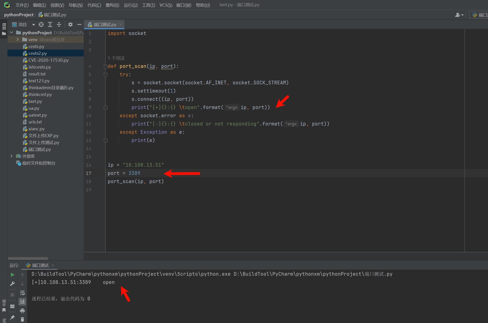
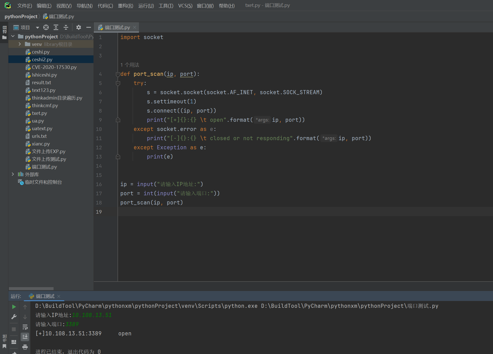
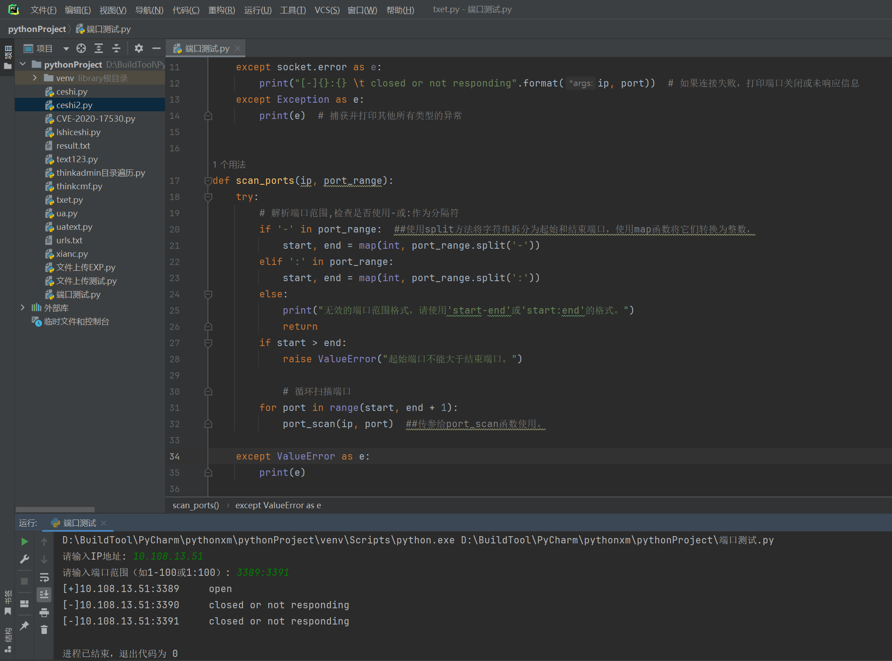
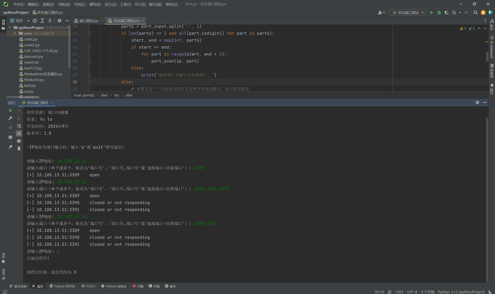
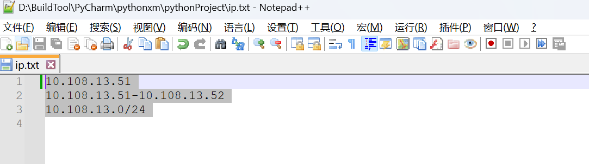
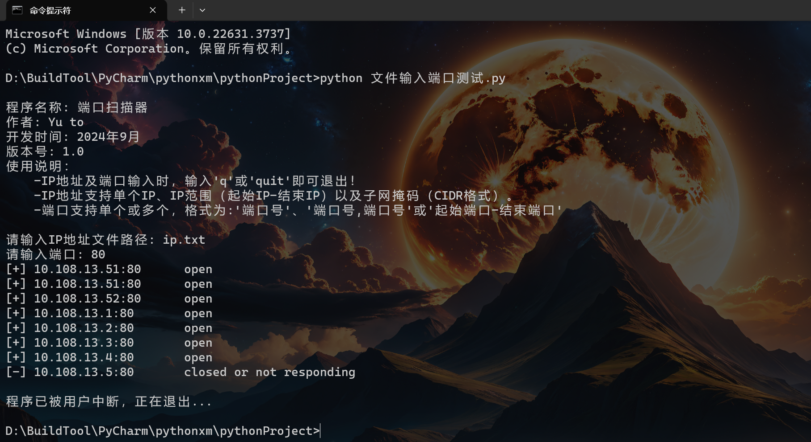
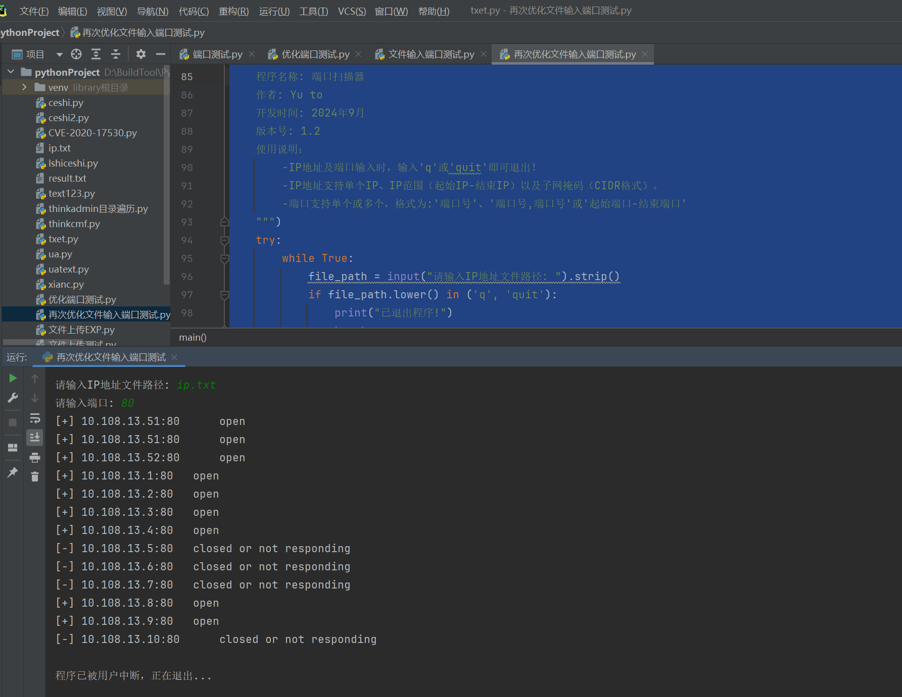
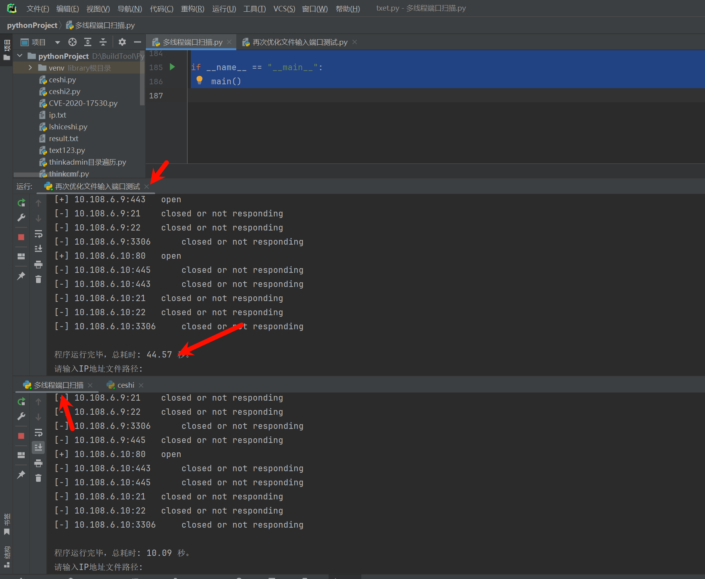

# 1. 前言

在很多时候编写程序工具的时候，能够熟练的使用库中的函数是很好的，但是也并非需要背下来，那么多的参数背下来也不容易，而且正常情况下我们不是主要搞开发的，背下来你不经常使用也会忘记，我想需要做到的应该是不懂后能够通过百度搜索函数来获取知识，看懂即可。

# 2. 端口扫描方式

端口扫描是网络安全领域中的一种技术，用于检测目标主机上哪些端口是开放的，从而了解目标主机上可能运行的服务和潜在的安全风险。端口扫描的方式多种多样，主要包括以下几种：

## 2.1. TCP扫描（全连接扫描）

**原理**：利用TCP协议的三次握手过程，扫描器尝试与目标主机的每个端口建立完整的TCP连接。如果连接成功，则认为该端口是开放的；如果连接失败（如被拒绝或超时），则认为该端口是关闭的。

**优点**：实现简单，不需要特殊权限，扫描速度快。

**缺点**：容易被目标主机上的防火墙或入侵检测系统（IDS）发现并记录，从而暴露扫描行为。

## 2.2. SYN扫描（半开放扫描）

**原理**：扫描器向目标端口发送一个SYN数据包（TCP三次握手中的第一个数据包），但不完成后续的三次握手过程。如果目标端口开放，会回应一个SYN-ACK数据包；如果端口关闭，会回应一个RST数据包。扫描器根据收到的回应来判断端口状态。

**优点**：隐蔽性较高，因为不建立完整的TCP连接，所以不会在目标主机的日志中留下记录。

**缺点**：需要攻击者拥有客户机的root权限，且可能被一些高级防火墙或IDS检测出来。

## 2.3. UDP扫描

**原理**：由于UDP是无连接的协议，扫描器向目标端口发送UDP数据包，并根据目标主机的回应来判断端口状态。如果目标端口未开放，通常会返回一个ICMP端口不可达消息；如果端口开放但没有相应服务监听，则可能不会有任何回应。

**优点**：可以扫描UDP端口，补充TCP扫描的不足。

**缺点**：UDP扫描的可靠性较低，因为UDP是无连接的协议，数据包可能会丢失或不被处理。此外，一些网络设备或防火墙可能会过滤或修改ICMP消息，导致扫描结果不准确。

## 2.4. ICMP扫描

**原理**：通过发送ICMP Echo请求（Ping）来检测目标主机是否在线。虽然这不是直接的端口扫描方式，但可以用来确定哪些IP地址是活动的，从而缩小后续端口扫描的范围。

**优点**：实现简单，可以快速确定目标网络中的活动主机。

**缺点**：容易被防火墙或路由器过滤掉ICMP请求和回应。

# 3. python编写端口扫描

现在有很多的工具都可以实现端口扫描，而很多情况下我们默认使用别人提供的工具来使用，而很少知道原理或者底层，而这次希望能够用最简单的方式来实现端口扫描，跨出脚本小子，虽然该用工具还是用工具，至少我们要懂得底层的原理是什么。

## 3.1. socket库

socket库是 Python 标准库中的一个重要部分，它提供了对底层网络接口的访问。通过使用 socket库，Python 程序可以创建网络连接、发送和接收数据。这使得 Python 能够实现各种网络应用，包括客户端和服务器程序、网络爬虫、聊天应用等。

### 3.1.1. socket库常用参数

#### 3.1.1.1. `socket.socket()` 参数

`family`（地址族）: 指定地址族，最常用的有 `socket.AF_INET`（IPv4 地址）和 `socket.AF_INET6`（IPv6 地址）。

`type`（套接字类型）: 指定套接字类型，常用的有 `socket.SOCK_STREAM`（TCP 套接字，面向连接的）和 `socket.SOCK_DGRAM`（UDP 套接字，无连接的）。

`proto`（协议号）: 大多数情况下，该参数为 0，因为协议是由地址族和套接字类型自动选择的。但在某些特殊情况下，可能需要显式指定协议号。

#### 3.1.1.2. `socket.bind()` 参数

`address`（地址）: 一个包含主机名和端口号的元组，用于将套接字绑定到一个特定的地址和端口上。对于 IPv4 地址，主机名可以是一个点分十进制的 IP 地址（如 `'192.168.1.1'`）或特殊值 `'0.0.0.0'`（表示绑定到所有可用的网络接口）。对于 IPv6 地址，主机名应该是一个包含 IPv6 地址的字符串，并可能包括作用域 ID（对于链路本地地址）。

#### 3.1.1.3. `socket.listen()` 参数

`backlog`（监听队列大小）: 指定在拒绝连接之前，系统应该为等待接受的连接请求排队的最大数量。大多数情况下，这个值设置为 5 到 10 就足够了，但在高负载情况下可能需要更高的值。有些系统可能会忽略这个参数，并使用默认值。

#### 3.1.1.4. `socket.connect()` 参数

`address`（地址）: 一个包含服务器地址和端口号的元组，用于建立到服务器的连接。对于客户端程序，这是连接到服务器所必需的。

#### 3.1.1.5. `socket.send()` 和 `socket.recv()` 参数

`buffer`（缓冲区）: 要发送或接收的数据的字节对象（bytes）。`send()` 方法将这个缓冲区中的数据发送到连接的套接字，而 `recv()` 方法从套接字接收最多 `buffersize` 字节的数据。

`buffersize`（缓冲区大小）: `recv()` 方法的一个可选参数，指定要接收的最大字节数。如果省略此参数，则通常使用默认值（通常是 8192 字节或更大）。

#### 3.1.1.6. 其他参数

虽然不直接作为 `socket` 方法的参数，但在使用 `socket` 库时还会遇到其他一些与套接字行为相关的参数，例如：

`timeout`（超时时间）: 可以通过 `socket.settimeout(timeout)` 方法设置套接字的超时时间（以秒为单位）。如果在指定的时间内没有发生 I/O 操作，则 `socket` 将抛出一个 `socket.timeout` 异常。如果设置为 `None`，则表示套接字没有超时限制。

`reuse_addr`（地址重用）: 可以通过 `socket.setsockopt(socket.SOL_SOCKET, socket.SO_REUSEADDR, 1)` 来设置地址重用选项。这允许在同一端口上启动服务器程序的新实例，即使旧实例仍在其超时时间范围内处于 TIME_WAIT 状态。

### 3.1.2. 常用参数使用

#### 3.1.2.1. 创建 Socket

在 Python 中，使用 `socket.socket()` 函数来创建一个新的 socket 对象。这个函数接受两个参数：地址族（AF_INET 用于 IPv4 地址，AF_INET6 用于 IPv6 地址）和套接字类型（SOCK_STREAM 表示 TCP 套接字，SOCK_DGRAM 表示 UDP 套接字）。

```python
import socket  
  
# 创建一个 IPv4 TCP 套接字  
s = socket.socket(socket.AF_INET, socket.SOCK_STREAM)
```

#### 3.1.2.2. 连接到服务器

对于客户端程序，可以使用 `connect()` 方法连接到服务器。这个方法需要一个包含服务器地址和端口的元组作为参数。

```python
# 连接到服务器  
server_address = ('localhost', 10000)  
s.connect(server_address)
```

#### 3.1.2.3. 绑定端口

对于服务器程序，需要使用 `bind()` 方法将套接字绑定到一个特定的地址和端口上。这通常是在服务器开始监听连接之前进行的。

```python
# 绑定到地址和端口  
host = 'localhost'  
port = 12345  
s.bind((host, port))
```

#### 3.1.2.4. 监听连接

服务器程序还需要调用 `listen()` 方法来开始监听传入的连接。这个方法可以指定一个参数，表示最大连接数，但大多数情况下可以省略此参数或设置为 0（表示无限制，但受限于系统资源）。

```python
# 开始监听  
s.listen(1)
```

#### 3.1.2.5. 接受连接

服务器使用 `accept()` 方法来接受一个连接。这个方法会阻塞，直到一个连接到达。当连接到达时，它返回一个包含新连接的 socket 对象和一个地址的元组。

```python
# 接受连接  
conn, address = s.accept()  
print('Connected by', address)
```

#### 3.1.2.6. 发送和接收数据

一旦建立了连接，就可以使用 `send()` 和 `recv()` 方法来发送和接收数据了。`send()` 方法发送数据，而 `recv()` 方法接收数据。这两个方法都可以指定一个缓冲区大小作为参数。

```python
# 发送数据  
message = 'Hello, world'  
conn.sendall(message.encode('utf-8'))  
  
# 接收数据  
data = conn.recv(1024)  
print('Received', repr(data))
```

## 3.2. 端口扫描基础案例

这里就编写一个基础的案例，简短的测试一下代码的连通性。

**公众号回复"240906"获取所有源代码**

```python
import socket   ##引入socket库


def port_scan(ip, port):  ##获取IP地址及端口
    try:
        s = socket.socket(socket.AF_INET, socket.SOCK_STREAM)  ##创建一个基于网络并且使用TCP协议的套接字
        s.settimeout(1)  ##设置超时时间
        s.connect((ip, port))  ##用于服务器连接，我们去连接别人，我们是作为客户端，对方为服务端
        print("[+]{}:{} \t open".format(ip, port))  ##拼接输出
    except socket.error as e:
        print("[-]{}:{} \t closed or not responding".format(ip, port))  ##不通的输出
    except Exception as e:
        print(e)  ##报错提示


ip = "10.108.13.51"
port = 33891
port_scan(ip, port)  ##传参

```



### 3.2.1. 手动输入地址端口

这里我们将IP地址以及端口都设置成手动添加的。

```python
import socket


def port_scan(ip, port):
    try:
        s = socket.socket(socket.AF_INET, socket.SOCK_STREAM)
        s.settimeout(1)
        s.connect((ip, port))
        print("[+]{}:{} \t open".format(ip, port))
    except socket.error as e:
        print("[-]{}:{} \t closed or not responding".format(ip, port))
    except Exception as e:
        print(e)


ip = input("请输入IP地址:")
port = int(input("请输入端口:"))
port_scan(ip, port)

```



### 3.2.2. 批量端口扫描

在上述中基本上我们已经实现端口扫描了，不过这个端口扫描是单个端口，无法实现多个端口扫描，例如我们要扫描0到65535端口，那么我们该如何实现这类功能，当然我们也可以使用读取文件的功能来实现，不过这类方式你需要手动输入6万多的数字，显然是不现实的，这里我们就可以使用循环以及字符串处理来解决这些问题。

其中在`scan_ports` 函数这里，它首先检查端口范围字符串是否包含`-`或`:`作为分隔符，然后使用`split`方法将字符串拆分为起始和结束端口，并使用`map`函数将它们转换为整数。之后，它使用一个`for`循环遍历从起始端口到结束端口的每个端口，并对每个端口调用`port_scan`函数。

```python
import socket


def port_scan(ip, port):
    try:
        s = socket.socket(socket.AF_INET, socket.SOCK_STREAM)
        s.settimeout(1)  # 设置超时时间为1秒
        s.connect((ip, port))  # 尝试连接到指定的IP和端口
        print("[+]{}:{} \t open".format(ip, port))  # 如果连接成功，打印端口开放信息
        s.close()  # 关闭socket连接
    except socket.error as e:
        print("[-]{}:{} \t closed or not responding".format(ip, port))  # 如果连接失败，打印端口关闭或未响应信息
    except Exception as e:
        print(e)  # 捕获并打印其他所有类型的异常


def scan_ports(ip, port_range):
    try:
        # 解析端口范围,检查是否使用-或:作为分隔符
        if '-' in port_range:  ##使用split方法将字符串拆分为起始和结束端口，使用map函数将它们转换为整数，
            start, end = map(int, port_range.split('-'))
        elif ':' in port_range:
            start, end = map(int, port_range.split(':'))
        else:
            print("无效的端口范围格式，请使用'start-end'或'start:end'的格式。")
            return
        
        if start > end: ##判断开始是否大于结束
            raise ValueError("起始端口不能大于结束端口。")

            # 循环扫描端口
        for port in range(start, end + 1):
            port_scan(ip, port)  ##传参给port_scan函数使用。

    except ValueError as e:  ##抛出异常
        print(e)


# 用户输入
ip = input("请输入IP地址: ")
port_range = input("请输入端口范围（如1-100或1:100）: ")
scan_ports(ip, port_range)
```



简单来说，这个整体的代码中还是存在很多错误未处理的，比如没有判断用户是否真实的输入了IP地址，虽然最后确实有一条可以判断的，但是无法在最开始就让用户重新输入，还有比如，全部输错后，整个程序会自动结束，并不会让用户重新输入，而这个也简单，直接做个循环就可以了，这里就自行解决。

### 3.2.3. 优化扫描

不知道这里有没有发现，我设置的是多个端口扫描，而当输入单个端口后则会报错，那么这样该如何解决，同时解决一些上述提到的一些问题，例如判断用户是否输入了IP地址，程序如何自动重新回到开始执行等等。

这里优化的内容：

端口可以输入三种类型，"3389"、"3389，3390，3391"、"3389-3391"

IP地址可以判断，用户是否未输入。

添加了循环，并且通过输入"q"来进行退出控制。

```python
import socket


def port_scan(ip, port):
    try:
        s = socket.socket(socket.AF_INET, socket.SOCK_STREAM)
        s.settimeout(1)
        s.connect((ip, port))
        print(f"[+] {ip}:{port} \t open")
    except socket.error:
        print(f"[-] {ip}:{port} \t closed or not responding")
    finally:
        # 无论连接是否成功，都关闭socket连接
        s.close()


def scan_ports(ip, port_input):
    # 检查是否为单个端口或多个用逗号分隔的端口
    if ',' not in port_input and port_input.isdigit():
        # 如果是单个端口，直接扫描
        port_scan(ip, int(port_input))
    elif ',' in port_input:
        # 如果是多个端口，分割并逐个扫描
        ports = []  # 初始化一个空列表来存储转换后的端口号
        port_strings = port_input.split(',')  # 使用split方法将字符串按逗号分割成列表
        # 遍历分割后的列表
        for port_string in port_strings:
            # 检查当前字符串是否全部由数字组成
            if port_string.isdigit():
                # 如果是，则将其转换为整数并添加到ports列表中
                ports.append(int(port_string))

        for port in ports:
            port_scan(ip, port)
    else:
        # 尝试解析为端口范围（只接受'-'作为分隔符）
        try:
            # 如果 port_input 包含 '-'，则使用 '-' 作为分隔符来分割字符串，并且限制分割次数为 1（即只分割第一个出现的 '-'）。
            parts = port_input.split('-', 1)
            # 首先检查parts的长度是否为2
            if len(parts) == 2:
                # 然后检查parts中的每个元素是否都是数字
                if all(part.isdigit() for part in parts):
                    # 如果两个条件都满足，使用map函数将parts中的每个字符串转换为整数
                    # 并将转换后的整数解包赋值给start和end
                    start, end = map(int, parts)
                    # 检查起始端口是否小于等于结束端口
                    if start <= end:
                        # 循环扫描端口范围
                        for port in range(start, end + 1):
                            port_scan(ip, port)
                    else:
                        print("起始端口不能大于结束端口。")
            else:
                # 如果不是'-'分隔或分割后不是两个有效的数字，给出错误提示
                print("无效的端口输入，请使用'端口号'、'端口号,端口号'（多个非连续端口）或'起始端口-结束端口'的格式。")
        except ValueError:
            # 如果在转换端口为整数时发生错误（例如，输入了非数字字符），打印错误信息
            print("端口输入包含非数字字符，请确保输入有效的端口号或端口范围。")


def main():
    print(f"""  
程序名称: 端口扫描器  
作者: Yu to 
开发时间: 2024年9月  
版本号: 1.0  
使用说明：
    -IP地址及端口输入时，输入'q'或'quit'即可退出！
    -IP地址仅支持单IP输入。
    -端口支持单个或多个，格式为:'端口号'、'端口号,端口号'或'起始端口-结束端口'
""")
    while True:
        # 获取用户输入的IP地址
        ip = input("请输入IP地址: ").strip().lower()
        if ip in ('q', 'quit'):
            print("已退出程序!")
            break
        if not ip:
            print("IP地址不能为空，请重新输入!")
            continue

            # 获取用户输入的端口信息
        port_input = input(
            "请输入端口: ").strip().lower()
        if port_input in ('q', 'quit'):
            print("已退出程序!")
            break
        if not port_input:
            print("端口不能为空，请重新输入!")
            continue

            # 调用scan_ports函数进行端口扫描
        scan_ports(ip, port_input)


if __name__ == "__main__":
    main()

```



## 3.3. ipaddress库

上述代码中都是使用手动输入IP地址，而我们更多的时候处理的是多个IP或者IP段，这里的话手动输入就不方便了，这里就需要使用到ipaddress库对文件中每一行的IP地址段进行处理。

这里只是简短的说明如何使用，具体的很多参数还需要自行的去学习参考，简单来说，我也说不全，只能到使用的时候，用到常见的。

`ipaddress` 是 Python 的一个标准库，用于处理 IPv4 和 IPv6 地址以及网络。它提供了丰富的功能来创建、操作、比较和迭代 IP 地址和网络。

### 3.3.1. ipaddress库常用参数

#### 3.3.1.1. 常用类

```python
ipaddress.IPv4Address类
表示一个 IPv4 地址。可以通过字符串或整数（作为网络字节顺序的整数）来创建实例。

ipaddress.IPv6Address类
表示一个 IPv6 地址。同样可以通过字符串或整数来创建实例。

ipaddress.IPv4Network类
表示一个 IPv4 网络，包括网络地址、广播地址和子网掩码。可以用来确定一个 IP 地址是否属于该网络。

ipaddress.IPv6Network类
表示一个 IPv6 网络，功能与 `IPv4Network` 类似，但用于 IPv6 地址。

ipaddress.ip_interface类
一个工厂函数，用于根据提供的字符串创建 `IPv4Interface` 或 `IPv6Interface` 实例。这些接口对象表示具有特定网络掩码长度的 IP 地址。
```

#### 3.3.1.2. 常用方法

由于 ipaddress 库主要通过其类来提供功能，所以“方法”通常指的是这些类的方法。以下是一些常用方法：

```python
__init__（构造函数）
用于创建 IPv4Address、IPv6Address、IPv4Network 或 IPv6Network 的实例。
通常通过传递一个表示 IP 地址或网络的字符串来调用。

is_private
返回一个布尔值，指示 IP 地址或网络是否是私有地址。

is_global
返回一个布尔值，指示 IP 地址或网络是否是全局唯一的（非私有）。

is_multicast
返回一个布尔值，指示 IP 地址是否是多播地址。

is_loopback
返回一个布尔值，指示 IP 地址是否是回环地址（如 127.0.0.1）。

is_link_local
返回一个布尔值，指示 IP 地址是否是链路本地地址。

hosts()
在 IPv4Network 或 IPv6Network 上调用时，返回一个迭代器，生成网络中的主机地址（不包括网络地址和广播地址）。

address_exclude(other)
在 IPv4Network 或 IPv6Network 上调用时，如果 other 是另一个网络，则返回一个包含两个网络的元组，这两个网络是原始网络减去 other 网络后的结果。

overlaps(other)
检查当前网络与 other 网络是否重叠。

subnets(prefixlen_diff=1, new_prefix=None)
在 IPv4Network 或 IPv6Network 上调用时，根据指定的子网掩码长度差异或新的子网掩码长度，生成子网的迭代器。
```

### 3.3.2. 案例使用

#### 3.3.2.1. 创建 IP 地址

你可以使用 `ipaddress.IPv4Address` 和 `ipaddress.IPv6Address` 类来创建 IPv4 和 IPv6 地址对象。

```python
ipv4_addr = ipaddress.IPv4Address('192.168.1.1')  
ipv6_addr = ipaddress.IPv6Address('2001:db8::1')
```

#### 3.3.2.2. 创建网络

使用 `ipaddress.IPv4Network` 和 `ipaddress.IPv6Network` 类可以创建表示 IP 网络的对象。这些对象可以包含地址范围、子网掩码等信息。

```python
ipv4_net = ipaddress.IPv4Network('192.168.1.0/24')  
ipv6_net = ipaddress.IPv6Network('2001:db8::/32')
```

#### 3.3.2.3. 迭代网络中的地址

你可以迭代网络对象来获取网络中的所有地址。

```python
for addr in ipv4_net:  
    print(addr)
```

#### 3.3.2.4. 检查地址是否在网络中

使用 `in` 关键字可以检查一个地址是否属于某个网络。

```python
print(ipv4_addr in ipv4_net)  # 输出: True
```

#### 3.3.2.5. 主机地址

网络对象有一个 `.hosts()` 方法，它返回一个迭代器，包含网络中的所有主机地址（排除了网络地址和广播地址）。

```python
for host in ipv4_net.hosts():  
    print(host)
```

#### 3.3.2.6. 广播地址

对于 IPv4 网络，你可以使用 `.broadcast_address` 属性来获取广播地址。

```python
print(ipv4_net.broadcast_address)
```

#### 3.3.2.7. 子网划分

你可以使用 `subnets()` 方法来将网络划分为更小的子网。

```python
for subnet in ipv4_net.subnets(new_prefix=26):  
    print(subnet)
```

## 3.4. 端口扫描进阶案例

这里的进阶扫描，就是实现如何从文件中读取单个IP地址或IP地址段或IP地址子网来进行对端口进行扫描，当然端口的输入方式依旧不变，还是需要手动输入，而不能通过文件，端口是否通过文件输入问题不是太大。因为我们已经解决单端口，多端口以及端口范围的测试了，这里我们主要是对IP地址进行输入，因为IP地址的输入问题会较多，不好使用代码来进行处理，而在python中有现成的库来调用，这里就使用库来实现。

### 3.4.1. 文件输入端口扫描

想要执行下属代码，需要在该代码文件的同目录创建一个txt文件，至于名词没有固定，我创建了一个IP.txt的文件，里面存放了以下内容：

```
10.108.13.51
10.108.13.51-10.108.13.52
10.108.13.0/24
```



```python
import socket
import ipaddress


def port_scan(ip, port):
    try:
        s = socket.socket(socket.AF_INET, socket.SOCK_STREAM)
        s.settimeout(1)
        s.connect((ip, port))
        print(f"[+] {ip}:{port} \t open")
    except socket.error:
        print(f"[-] {ip}:{port} \t closed or not responding")
    finally:
        s.close()


def scan_ports(ip, port_input):
    if ',' not in port_input and port_input.isdigit():
        port_scan(ip, int(port_input))
    elif ',' in port_input:
        ports = []
        port_strings = port_input.split(',')
        for port_string in port_strings:
            if port_string.isdigit():
                ports.append(int(port_string))

        for port in ports:
            port_scan(ip, port)
    else:
        try:
            parts = port_input.split('-', 1)
            if len(parts) == 2:
                if all(part.isdigit() for part in parts):
                    start, end = map(int, parts)

                    if start <= end:
                        for port in range(start, end + 1):
                            port_scan(ip, port)
                    else:
                        print("起始端口不能大于结束端口。")
            else:
                print("无效的端口输入，请使用'端口号'、'端口号,端口号'（多个非连续端口）或'起始端口-结束端口'的格式。")
        except ValueError:
            print("端口输入包含非数字字符，请确保输入有效的端口号或端口范围。")


def process_ip_range(ip_range):
    try:
        # 检查是否是CIDR格式
        """
        首先，函数尝试使用 ipaddress.ip_network(ip_range, strict=False) 来解析输入字符串 ip_range 是否为CIDR（无类别域间路由）格式。
        如果是，它将返回一个 IPv4Network 或 IPv6Network 对象，该对象代表了这个网络。
        然后，它for循环来获取这个网络内除了网络地址和广播地址之外的所有IP地址（即主机地址），并将它们转换为字符串形式，最后返回这个列表。
        """
        network = ipaddress.ip_network(ip_range, strict=False)
        hosts_list = []
        for ip in network.hosts():
            hosts_list.append(str(ip))
        return hosts_list
    except ValueError:
        # 处理'-'格式的IP地址段
        try:
            # 分割 IP 范围字符串
            start_ip_str, end_ip_str = ip_range.split('-', 1)
            # 去除前后的空格并转换为 IPv4Address 对象
            start_ip = ipaddress.IPv4Address(start_ip_str.strip())
            end_ip = ipaddress.IPv4Address(end_ip_str.strip())
            # 检查起始 IP 是否小于等于结束 IP
            if start_ip > end_ip:
                print("起始IP不能大于结束IP。")
                return []
            # 将 IP 地址转换为整数
            start_int = int(start_ip)
            end_int = int(end_ip)
            # 生成 IP 地址的整数列表
            ip_list = []
            for ip in range(start_int, end_int + 1):
                # 将整数转换回 IP 地址并添加到列表中
                ip_list.append(str(ipaddress.IPv4Address(ip)))
            return ip_list
        except ValueError:
            print("IP范围格式无效。")
            return []


def main():
    print(f"""  
程序名称: 端口扫描器  
作者: Yu to 
开发时间: 2024年9月  
版本号: 1.1  
使用说明：
    -IP地址及端口输入时，输入'q'或'quit'即可退出！
    -IP地址支持单个IP、IP范围（起始IP-结束IP）以及子网掩码（CIDR格式）。
    -端口支持单个或多个，格式为:'端口号'、'端口号,端口号'或'起始端口-结束端口'
""")
    try:
        while True:
            file_path = input("请输入IP地址文件路径: ").strip()
            if file_path.lower() in ('q', 'quit'):
                print("已退出程序!")
                break
            try:
                with open(file_path, 'r') as file:
                    ip_lines = file.readlines()
            except FileNotFoundError:
                print("文件未找到，请重新输入!")
                continue

            port_input = input("请输入端口: ").strip().lower()
            if port_input in ('q', 'quit'):
                print("已退出程序!")
                break
            if not port_input:
                print("端口不能为空，请重新输入!")
                continue

            for line in ip_lines:
                ip_range = line.strip()  # 去除空格
                ips = process_ip_range(ip_range)  # 对获取到的一行内容进行数据处理。
                if ips:
                    for ip in ips:  ##挨个传输IP地址。
                        scan_ports(ip, port_input)

    except KeyboardInterrupt:
        print("\n程序已被用户中断，正在退出...")


if __name__ == "__main__":
    main()

```



至于更多的测试方式，还自行测试，同时由于是自己使用，多少代码或程序中存在一些错误或者未测试出来的错误，理论上不影响使用。

### 3.4.2. 优化文件输入端口扫描

不知道这里有没有人看出来，上述代码中，每次对传过来的IP地址进行端口扫描的时候，端口扫描都需要再次对用户输入的内容进行一次分割。例如一个IP地址段：10.108.13.51-10.108.13.52，当执行10.108.13.51的时候会对端口进行处理，再次执行10.108.13.52的时候还是会对端口进行处理，而如果IP地址多的时候，就会导致程序运行占用内存巨大，当然使用的时候可能感觉不出来，这里涉及到内存优化，我也说不清楚，只是在编写代码的时候，发现了这个问题，就想着优化以下，当然不优化也无所谓。

这里具体优化就是加了一个 `parse_ports` 函数来解析用户输入的端口字符串，并将其转换为一个整数列表。然后，在主循环中，我调用这个函数一次来获取端口列表，并在处理每个IP地址时重复使用它。这样可以避免在每个IP地址上重复解析端口输入。

```python
import socket
import ipaddress


def port_scan(ip, port):
    try:
        s = socket.socket(socket.AF_INET, socket.SOCK_STREAM)
        s.settimeout(1)
        s.connect((ip, port))
        print(f"[+] {ip}:{port} \t open")
    except socket.error:
        print(f"[-] {ip}:{port} \t closed or not responding")
    finally:
        s.close()


def scan_ports(ip, ports):
    for port in ports:
        port_scan(ip, port)


def parse_ports(port_input):
    ports = []
    if ',' in port_input:
        port_strings = port_input.split(',')
        for port_string in port_strings:
            if port_string.isdigit():
                ports.append(int(port_string))
    elif '-' in port_input:
        parts = port_input.split('-', 1)
        if len(parts) == 2 and all(part.isdigit() for part in parts):
            start, end = map(int, parts)
            if start <= end:
                ports.extend(range(start, end + 1))
            else:
                print("起始端口不能大于结束端口。")
    elif port_input.isdigit():
        ports.append(int(port_input))
    else:
        print("无效的端口输入，请使用'端口号'、'端口号,端口号'或'起始端口-结束端口'的格式。")
    return ports


def process_ip_range(ip_range):
    try:
        # 检查是否是CIDR格式
        """
        首先，函数尝试使用 ipaddress.ip_network(ip_range, strict=False) 来解析输入字符串 ip_range 是否为CIDR（无类别域间路由）格式。
        如果是，它将返回一个 IPv4Network 或 IPv6Network 对象，该对象代表了这个网络。
        然后，它for循环来获取这个网络内除了网络地址和广播地址之外的所有IP地址（即主机地址），并将它们转换为字符串形式，最后返回这个列表。
        """
        network = ipaddress.ip_network(ip_range, strict=False)
        hosts_list = []
        for ip in network.hosts():
            hosts_list.append(str(ip))
        return hosts_list
    except ValueError:
        # 处理'-'格式的IP地址段
        try:
            # 分割 IP 范围字符串
            start_ip_str, end_ip_str = ip_range.split('-', 1)
            # 去除前后的空格并转换为 IPv4Address 对象
            start_ip = ipaddress.IPv4Address(start_ip_str.strip())
            end_ip = ipaddress.IPv4Address(end_ip_str.strip())
            # 检查起始 IP 是否小于等于结束 IP
            if start_ip > end_ip:
                print("起始IP不能大于结束IP。")
                return []
            # 将 IP 地址转换为整数
            start_int = int(start_ip)
            end_int = int(end_ip)
            # 生成 IP 地址的整数列表
            ip_list = []
            for ip in range(start_int, end_int + 1):
                # 将整数转换回 IP 地址并添加到列表中
                ip_list.append(str(ipaddress.IPv4Address(ip)))
            return ip_list
        except ValueError:
            print("IP范围格式无效。")
            return []


def main():
    print(f"""  
    程序名称: 端口扫描器  
    作者: Yu to 
    开发时间: 2024年9月  
    版本号: 1.2  
    使用说明：
        -IP地址及端口输入时，输入'q'或'quit'即可退出！
        -IP地址支持单个IP、IP范围（起始IP-结束IP）以及子网掩码（CIDR格式）。
        -端口支持单个或多个，格式为:'端口号'、'端口号,端口号'或'起始端口-结束端口'
    """)
    try:
        while True:
            file_path = input("请输入IP地址文件路径: ").strip()
            if file_path.lower() in ('q', 'quit'):
                print("已退出程序!")
                break
            try:
                with open(file_path, 'r') as file:
                    ip_lines = file.readlines()
            except FileNotFoundError:
                print("文件未找到，请重新输入!")
                continue

            port_input = input("请输入端口: ").strip().lower()
            if port_input in ('q', 'quit'):
                print("已退出程序!")
                break
            if not port_input:
                print("端口不能为空，请重新输入!")
                continue

            ports = parse_ports(port_input)  # 解析端口输入并保存
            if not ports:
                continue  # 如果端口解析失败，则跳过当前循环

            for line in ip_lines:
                ip_range = line.strip()
                ips = process_ip_range(ip_range)
                if ips:
                    for ip in ips:
                        scan_ports(ip, ports)  # 使用解析后的端口列表进行扫描

    except KeyboardInterrupt:
        print("\n程序已被用户中断，正在退出...")


if __name__ == "__main__":
    main()

```



## 3.5. threading库

### 3.5.1. threading.Thread类的常用参数

- **group**：默认值为`None`。这个参数目前主要用于未来的扩展，保留给`ThreadGroup`类的实现，通常不需要设置。
- **target**：目标函数，即线程启动后要调用的函数。该函数应当是可调用的（如函数名或方法名），且可以接收参数。`target`参数接收的是函数的地址，由`run()`方法调用执行函数中的内容。
- **name**：线程名，用于标识线程。如果不指定，Python会自动为线程分配一个名字，如“Thread-1”、“Thread-2”等。
- **args**：传递给`target`函数的位置参数元组。如果`target`函数需要参数，可以通过这个参数来传递。
- **kwargs**：传递给`target`函数的关键字参数字典。如果`target`函数需要关键字参数，可以通过这个参数来传递。
- **daemon**：守护线程标志，默认为`None`。如果设置为`True`，则表示该线程为守护线程。守护线程的特点是，当主线程退出时，守护线程也会随之退出，且不会等待守护线程执行完毕。注意，必须在`start()`方法调用之前设置`daemon`属性，否则将引发`RuntimeError`。

```python
import threading  
import time  
  
def my_function(name, delay):  
    time.sleep(delay)  
    print(f"Hello from {name}")  
  
# 创建线程  
t1 = threading.Thread(target=my_function, args=("Thread-1", 2), name="Thread1")  
t2 = threading.Thread(target=my_function, args=("Thread-2", 1), name="Thread2", daemon=True)  
  
# 启动线程  
t1.start()  
t2.start()  
  
# 等待t1线程结束  
t1.join()  
  
print("Main thread has ended!")  
# 注意：由于t2是守护线程，主线程结束后，t2也会立即结束，不会等待其执行完毕。
```

## 3.6. 端口扫描最终案例

这里就是最终案例了，主要涉及的就是端口扫描如何使用多线程来实现操作，这里需要注意一点，由于只是写工具，不是专业的程序开发，多少可能存在逻辑上的问题，同时也借助AI来实现代码优化。

同时以下功能：

计时器：计算运行时间。

多线程：更快的完成任务

界面问题：优化多线程在同一时间会将多条结果输出到同一行。

```python
import socket
import ipaddress
import time
import threading

# 创建一个锁对象
print_lock = threading.Lock()


def port_scan(ip, port):
    try:
        s = socket.socket(socket.AF_INET, socket.SOCK_STREAM)  # 基于TCP
        s.settimeout(1)  # 超时时间
        s.connect((ip, port))  # 连接服务端，也就是连接目标的IP地址及端口
        # 使用锁来确保输出是互斥的
        with print_lock:
            print(f"[+] {ip}:{port} \t open")  # 输出成功的结果
    except socket.error:
        with print_lock:
            print(f"[-] {ip}:{port} \t closed or not responding")  # 输出错误的结果
    finally:
        s.close()


def scan_ports(ip, ports, num_threads):
    # 定义了一个内部函数worker，用于执行端口扫描。它接受一个端口号作为参数，并调用另一个未定义的函数port_scan来进行实际的扫描工作。
    def worker(port):
        port_scan(ip, port)

    threads = []  ## 初始化一个空列表，用于存储创建的线程对象。
    for i in range(0, len(ports), num_threads):
        # 使用range函数生成一个序列，从0开始，到ports列表的长度（不包括），步长为num_threads。
        # 这个循环的目的是将端口列表分割成多个子列表，每个子列表包含num_threads个端口（除了最后一个可能少于num_threads）。
        for port in ports[i:i + num_threads]:
            # 在这个内部循环中，遍历当前子列表中的每个端口
            t = threading.Thread(target=worker, args=(port,))
            # 为每个端口创建一个线程，线程的目标函数是worker，传递给worker的参数是当前遍历到的端口号。
            t.start()
            # 启动线程。
            threads.append(t)
            # 将创建的线程对象添加到threads列表中。
        for t in threads:
            # 这个循环尝试等待所有线程完成。
            t.join()


def parse_ports(port_input):
    ports = []  # 空列表
    if ',' in port_input:  # 对输入的端口中如果存在"，"进行处理
        port_strings = port_input.split(',')  # 以逗号分割
        for port_string in port_strings:  # 传输
            if port_string.isdigit():  # 检查是否为数字
                ports.append(int(port_string))  # 追加到列表中
    elif '-' in port_input:  # 对输入的端口中如果存在"-"进行处理
        parts = port_input.split('-', 1)  # 以-为分隔符，分割成两个
        if len(parts) == 2:  # 首先检查parts的长度是否为2
            if all(part.isdigit() for part in parts):  # 然后检查parts中的每个元素是否都是数字
                # 如果两个条件都满足，使用map函数将parts中的每个字符串转换为整数
                # 并将转换后的整数解包赋值给start和end
                start, end = map(int, parts)
                # 检查起始端口是否小于等于结束端口
                if start <= end:
                    ports.extend(range(start, end + 1))
                else:
                    print("起始端口不能大于结束端口。")
    elif port_input.isdigit():
        # 如果是单个端口，直接扫描
        ports.append(int(port_input))
    else:
        print("无效的端口输入，请使用'端口号'、'端口号,端口号'或'起始端口-结束端口'的格式。")
    return ports


def process_ip_range(ip_range):
    try:
        # 检查是否是CIDR格式
        """
        首先，函数尝试使用 ipaddress.ip_network(ip_range, strict=False) 来解析输入字符串 ip_range 是否为CIDR（无类别域间路由）格式。
        如果是，它将返回一个 IPv4Network 或 IPv6Network 对象，该对象代表了这个网络。
        然后，它for循环来获取这个网络内除了网络地址和广播地址之外的所有IP地址（即主机地址），并将它们转换为字符串形式，最后返回这个列表。
        """
        network = ipaddress.ip_network(ip_range, strict=False)
        hosts_list = []
        for ip in network.hosts():
            hosts_list.append(str(ip))
        return hosts_list
    except ValueError:
        # 处理'-'格式的IP地址段
        try:
            start_ip_str, end_ip_str = ip_range.split('-', 1)
            # 去除前后的空格并转换为 IPv4Address 对象
            start_ip = ipaddress.IPv4Address(start_ip_str.strip())
            end_ip = ipaddress.IPv4Address(end_ip_str.strip())
            # 检查起始 IP 是否小于等于结束 IP
            if start_ip > end_ip:
                print("起始IP不能大于结束IP。")
                return []
            # 将 IP 地址转换为整数
            start_int = int(start_ip)
            end_int = int(end_ip)
            # 生成 IP 地址的整数列表
            ip_list = []
            for ip in range(start_int, end_int + 1):
                # 将整数转换回 IP 地址并添加到列表中
                ip_list.append(str(ipaddress.IPv4Address(ip)))
            return ip_list
        except ValueError:
            print("IP范围格式无效。")
            return []


def main():
    print(f"""  
    程序名称: 端口扫描器  
    作者: Yu to 
    开发时间: 2024年9月  
    版本号: 1.3  
    使用说明：
        -IP地址及端口输入时，输入'q'或'quit'即可退出。
        -IP地址仅支持从文件读取。
        -IP地址支持单个IP、IP范围（起始IP-结束IP）以及子网掩码（CIDR格式）。
        -端口支持单个或多个，格式为:'端口号'、'端口号,端口号'或'起始端口-结束端口'。
        -线程数量支持单个整数，最大值为100，超过100，默认按照100执行,低于端口数量，默认按照端口数量执行。
    """)
    try:
        while True:
            file_path = input("请输入IP地址文件路径: ").strip()
            if file_path.lower() in ('q', 'quit'):
                print("已退出程序!")
                break
            try:
                with open(file_path, 'r') as file:
                    ip_lines = file.readlines()
            except FileNotFoundError:
                print("文件未找到，请重新输入!")
                continue

            port_input = input("请输入端口: ").strip().lower()
            if port_input in ('q', 'quit'):
                print("已退出程序!")
                break
            if not port_input:
                print("端口不能为空，请重新输入!")
                continue

            try:
                num_threads = int(input("请输入线程数量（支持1-100）：").strip())
                if port_input in ('q', 'quit'):
                    print("已退出程序!")
                    break
                if num_threads < 1:
                    print("线程数量必须大于0。")
                    continue
                if num_threads > 100:
                    num_threads = 100
            except ValueError:
                print("无效的线程数量输入。")
                continue

            start_time = time.time()  # 计时器，记录开始时间
            ports = parse_ports(port_input)
            if not ports:
                continue

            # 确保线程数量不超过端口数量
            if len(ports) < num_threads:
                num_threads = len(ports)
                print(f"注意：由于端口数量({len(ports)})少于请求的线程数量，线程数已自动调整为({len(ports)})线程。")

            for line in ip_lines:
                ip_range = line.strip()
                ips = process_ip_range(ip_range)
                if ips:
                    for ip in ips:
                        scan_ports(ip, ports, num_threads)

            end_time = time.time()  # 记录结束时间
            total_time = end_time - start_time  # 获取最终时间
            print(f"\n程序运行完毕，总耗时: {total_time:.2f} 秒。")

    except KeyboardInterrupt:
        print("\n程序已被用户中断，正在退出...")


if __name__ == "__main__":
    main()

```

