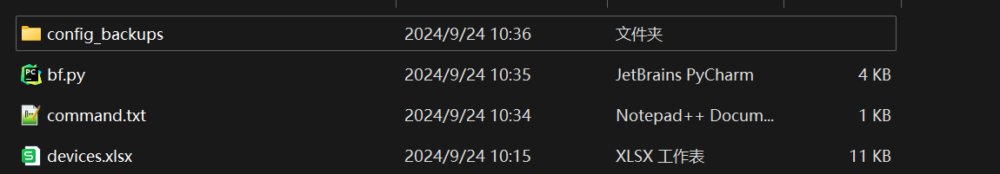
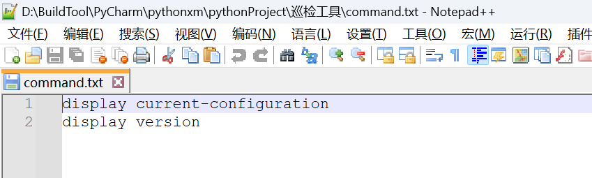
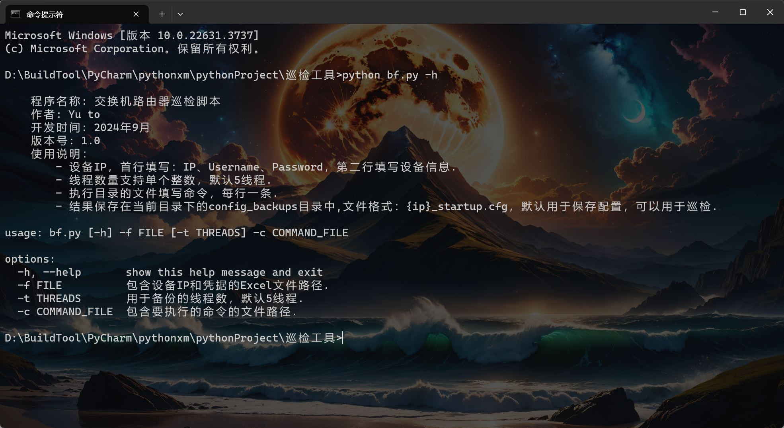
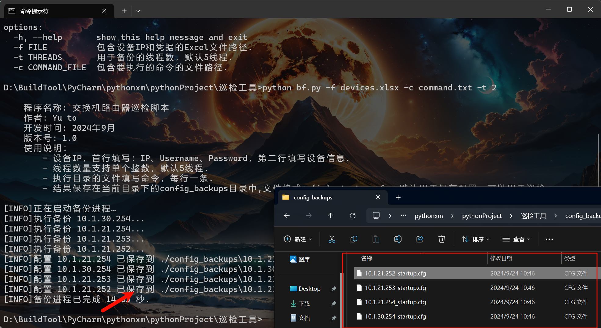

# 1. 前期准备

这里前期需要准备这些文件，不过部分文件是自动产生的，也并非需要手动创建，下面会提示。



config_backups：备份完文件保存的目录，无需创建，会自动生成。

by.py：备份脚本，脚本名称无所谓，修改成什么都可以。

command.txt：存放命令的文件，文件名称无所谓，修改成什么都可以，存放格式：每行一条命令。



devices.xlsx:存放设备信息的文件，文件名称无所谓，修改成什么都可以，存放格式：第一行必须按照这些字母写。


## 1.1. 源代码程序

```python
import paramiko
import pandas as pd
import os
import argparse
import time
from concurrent.futures import ThreadPoolExecutor


def backup_config(ip, username, password, output_dir, command):
    ssh = paramiko.SSHClient()
    ssh.set_missing_host_key_policy(paramiko.AutoAddPolicy())
    try:
        ssh.connect(ip, username=username, password=password, timeout=10)
        stdin, stdout, stderr = ssh.exec_command(command)
        # 读取并解码输出
        config = stdout.read().decode()
        # 处理输出内容，去除多余的空行
        config_lines = config.splitlines()
        filtered_lines = [line for line in config_lines if line.strip()]  # 去除空行
        cleaned_config = "\n".join(filtered_lines)

        # 写入文件
        output_filename = os.path.join(output_dir, f"{ip}_startup.cfg")
        with open(output_filename, 'w') as f:
            f.write(cleaned_config)
        print(f"[INFO]配置 {ip} 已保存到 {output_filename}")
    except Exception as e:
        print(f"[ERROR]连接错误 {ip} 或保存配置: {str(e)}")
    finally:
        ssh.close()


def main():
    banner = """  
    程序名称: 交换机路由器巡检脚本    
    作者: Yu to   
    开发时间: 2024年9月    
    版本号: 1.0    
    使用说明：  
        - 设备IP，首行填写：IP、Username、Password，第二行填写设备信息.
        - 线程数量支持单个整数，默认5线程.
        - 执行目录的文件填写命令，每行一条.
        - 结果保存在当前目录下的config_backups目录中,文件格式：{ip}_startup.cfg，默认用于保存配置，可以用于巡检. 
            """
    print(banner)
    # 设置命令行参数
    parser = argparse.ArgumentParser()
    parser.add_argument('-f', dest='file', type=str, required=True,
                        help='包含设备IP和凭据的Excel文件路径.')
    parser.add_argument('-t', dest='threads', type=int, default=5, help='用于备份的线程数，默认5线程.')
    parser.add_argument('-c', dest='command_file', type=str, required=True,
                        help='包含要执行的命令的文件路径.')
    args = parser.parse_args()

    # 读取命令文件
    with open(args.command_file, 'r') as cmd_file:
        command = cmd_file.read().strip()  # 读取命令并去除多余空白

    # 读取Excel文件
    df = pd.read_excel(args.file)

    # 设定输出目录
    output_dir = './config_backups'
    if not os.path.exists(output_dir):
        os.makedirs(output_dir)

    print("[INFO]正在启动备份进程…")
    start_time = time.time()  # 记录开始时间

    # 使用多线程执行备份
    with ThreadPoolExecutor(max_workers=args.threads) as executor:
        for index, row in df.iterrows():
            ip = row['IP']
            username = row['Username']
            password = row['Password']
            print(f"[INFO]执行备份 {ip}...")
            executor.submit(backup_config, ip, username, password, output_dir, command)

    # 等待所有线程完成
    executor.shutdown(wait=True)
    end_time = time.time()  # 记录结束时间
    duration = end_time - start_time  # 计算总耗时
    print(f"[INFO]备份进程已完成 {duration:.2f} 秒.")


if __name__ == '__main__':
    main()

```



## 1.2. 运行效果

这里可以看以下运行的效果：

```
bf.py -f 设备信息文件 -c 命令文件 -t 线程数
```

