# 1.**前言**

在上篇中间件安全—Apache常见漏洞中，并未对中间件漏洞进行解释，这里补充一下。

## 1.1.**中间件漏洞概念**

所谓的中间件漏洞就是并非是由于代码程序上设计存在缺陷而导致的漏洞，而是属于应用部署中环境配置不当或使用不当而导致的漏洞，同时这方面的漏洞也是最容易被管理员忽略的一部分。

同时不单单存在中间件安全，比如web服务器安全、web容器安全等等，还有一些其它常见的组件，都可能存在相应的漏洞。

## 1.2.**服务器、中间件、容器基本概念**

web服务器：web服务器用于提供http服务，即向客户端返回信息，其可以处理HTTP协议，响应针对静态页面或图片的请求，控制页面跳转，或者把动态请求委托其它程序（中间件程序）等。

web中间件：web中间件用于提供系统软件和应用软件之间的连接，以便于软件各部件之间的沟通，其可以为一种或多种应用程序提供容器。

web容器：web容器用于给处于其中的应用程序组件（JSP，SERVLET）提供一个环境，是中间件的一个组成部分，它实现了对动态语言的解析。比如tomcat可以解析jsp，是因为其内部有一个jsp容器。

## 1.3.**常见的组件**

web服务器：IIS、Apache、nginx、tomcat、weblogic、websphere等。

web中间件：apache tomcat、BEA WebLogic、IBM WebSphere等。

web容器：JSP容器、SERVLET容器、ASP容器等。

# 2.**Nginx常见漏洞**

一下漏洞环境均使用Vulhub一键搭建漏洞测试靶场，在靶场中输入Nginx即可查询到相应的靶场。

## 2.1.**CRLF注入漏洞**

### 2.1.1.**漏洞原理**

Nginx会将$uri进行解码，导致传入%0d%0a即可引入换行符，造成CRLF注入漏洞。

错误的配置文件示例（原本的目的是为了让http的请求跳转到https上）：

```
location / {

  return 302 https://$host$uri;

}
```

我们一旦在请求路径内添加换行符的urlcode编码，就可以将其混到返回的数据包内起到修改返回数据的作用。甚至可以让恶意语句进入返回体内部引发更严重的XSS攻击。

### 2.1.2.**漏洞复现**

#### 2.1.2.1.**注入Set-Cookie头**

我们将请求中插入编码，就可以注入Set-Cookie头。

```
payload：[http://your-ip:8080/%0d%0aSet-Cookie:%20a=1](http://your-ip:8080/ Set-Cookie: a=1)
```

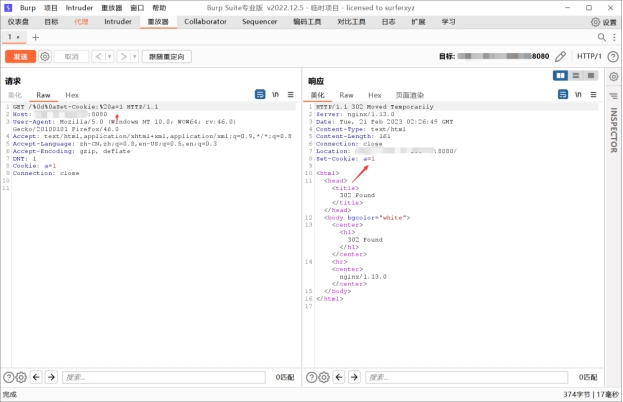 

#### 2.1.2.2.**XSS弹窗**

我们发送两个连续的换行\r\n后，可以直接修改返回报文的返回体。插入js代码引发xss。

```
payload：[http://your-ip:8080/%0d%0a%0d%0aalert(1)](http://your-ip:8080/ alert(1))
```

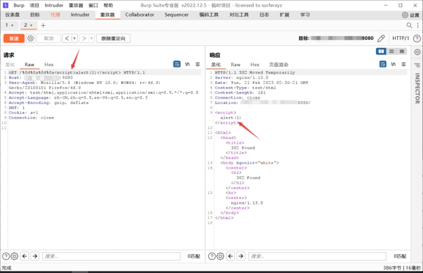 

## 2.2.**目录穿越漏洞**

### 2.2.1.**漏洞原理**

Nginx在配置别名（Alias）的时候，如果忘记加/，将造成一个目录穿越漏洞。

错误的配置文件示例（原本的目的是为了让用户访问到/home/目录下的文件）：

```
location /files {

  alias /home/;

}
```

但我们注意到/files没有加后缀/，而alias设置的/home/是有后缀/的，这个/就导致我们可以从/home/目录穿越到他的上层目录。

### 2.2.2.**漏洞复现**

#### 2.2.2.1.**访问网页**

```
http://your-ip:8081
```

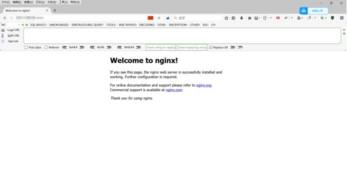 

#### 2.2.2.2.**目录穿越**

通过使用下列的payload就可以成功穿越到根目录。

```
payload：http://your-ip:8081/files../
```

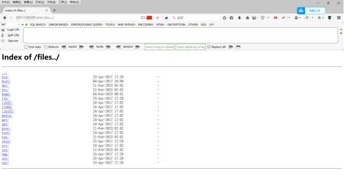 

## 2.3.**add_header被覆盖**

### 2.3.1.**漏洞原理**

Nginx配置文件子块（server、location、if）中的add_header，将会覆盖父块中的add_header添加的HTTP头，造成一些安全隐患。

如下列代码，整站（父块中）添加了CSP头：

```
add_header Content-Security-Policy "default-src 'self'";

add_header X-Frame-Options DENY;

location = /test1 {

  rewrite ^(.*)$ /xss.html break;

}

 
location = /test2 {

  add_header X-Content-Type-Options nosniff;

  rewrite ^(.*)$ /xss.html break;

}
```

但/test2的location中又添加了X-Content-Type-Options头，导致父块中的add_header全部失效。

### 2.3.2.**漏洞复现**

#### 2.3.2.1.**访问网页**

```
http://your-ip:8082
```

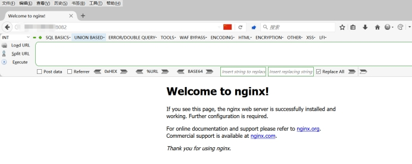 

#### 2.3.2.2.**触发XSS漏洞**

这里由于新的一点的浏览器都进行了一些过滤，所以导致无法弹出。

```
payload：http://your-ip:8082/test2#%3Cscript%3Ealert(1)%3C/script%3E
```

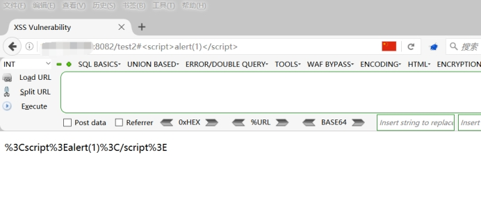 

## 2.4.**解析漏洞**

### 2.4.1.**漏洞原理**

```
cgi.fix_pathinfo=1   #php.ini --- 在php.ini中开启路径修复功能

security.limit_extensions = .php .jpg   #php-fpm.conf --- 在php-fpm模块中开启了.jpg的php解析
```

这二者合在一起，在网页有文件上传功能时，就会触发上传漏洞，总结来说漏洞成因就是同时开启路径修复和图片后缀名解析

### 2.4.2.**漏洞复现**

#### 2.4.2.1.**访问图片**

目前来看我们看到还是一张图片。

```
http://your-ip/uploadfiles/nginx.png
```

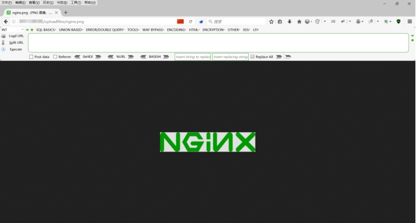 

#### 2.4.2.2.**添加后缀**

我们在图片的链接后面添加/.php来进行解析，通过添加后的解析效果来看，已经成功的将图片解析成php文件了。

```
http://your-ip/uploadfiles/nginx.png/.php
```

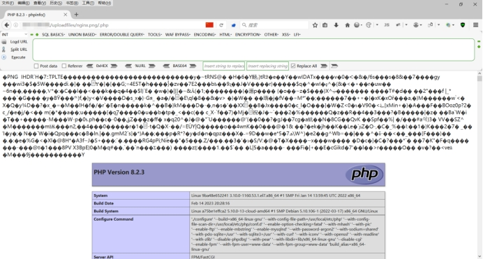 

#### 2.4.2.3.**访问上传界面**

```
http://your-ip/index.php
```

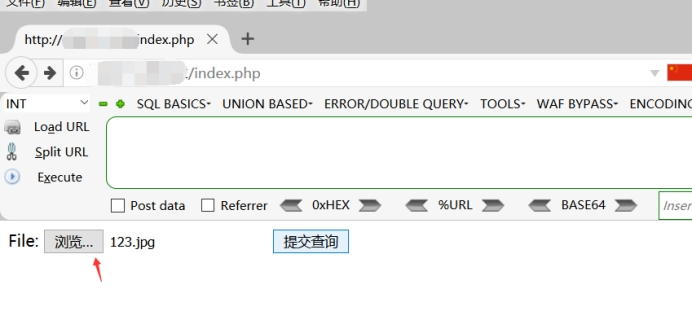 

#### 2.4.2.4.**上传文件**

这里我准备了一个图片马，当然图片马有很多，将代码写入图片马中即可，然后上传。

这里可以看到，上传后系统将我的图片重命名为：f47454d1d3644127f42070181a8b9afc.jpg那么到时候访问的时候就使用新的名字来访问。

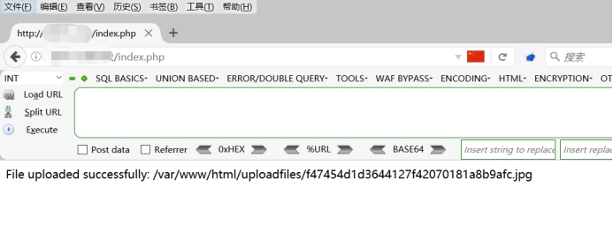 

#### 2.4.2.5.**访问上传的图片**

可以看到目前我上传的就是一张百度的图片，但是在图片中插入了图片马，我们对其进行解析试试

```
http://your-ip/uploadfiles/f47454d1d3644127f42070181a8b9afc.jpg
```

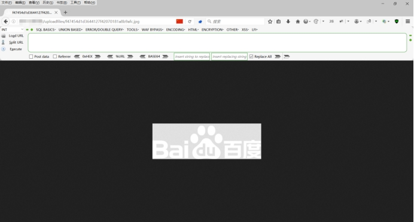 

#### 2.4.2.6.**解析图片马**

可以看到成功解析了图片马，这里我之前上传的图片马一点小问题，所以修改了一些，整体不影响效果。

```
http://your-ip/uploadfiles/f47454d1d3644127f42070181a8b9afc.jpg.php
```

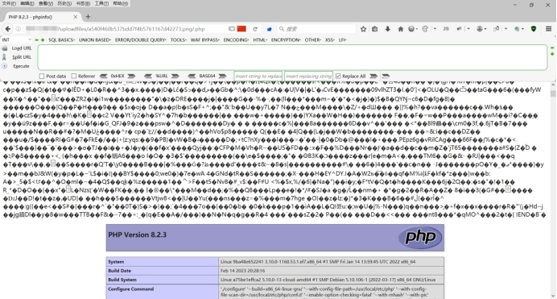 

