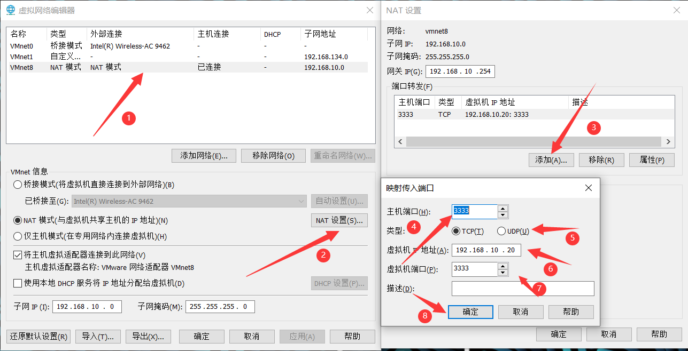
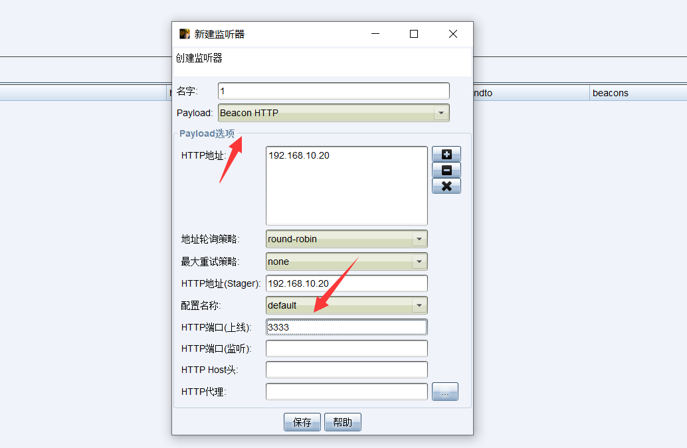
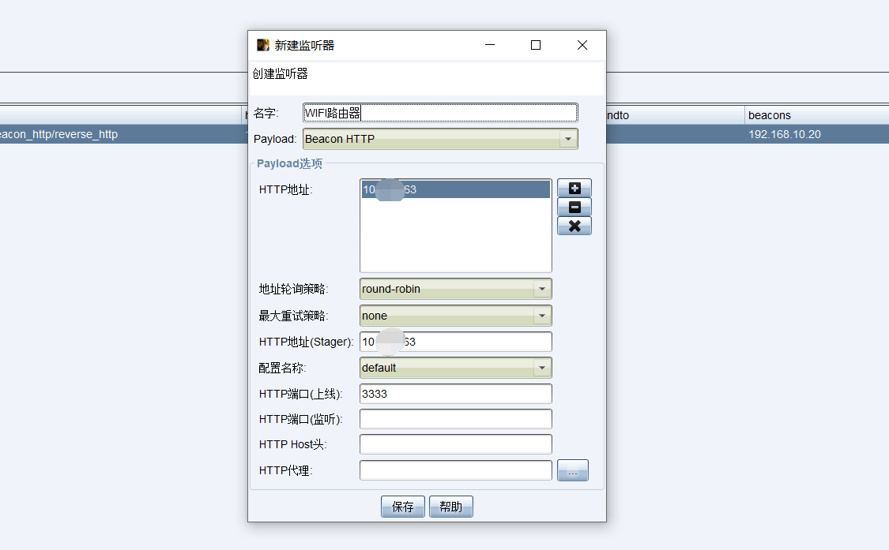
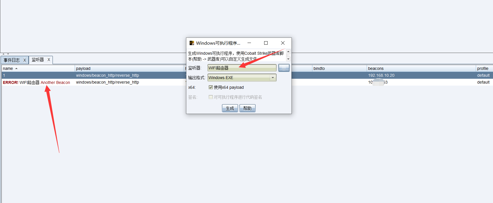
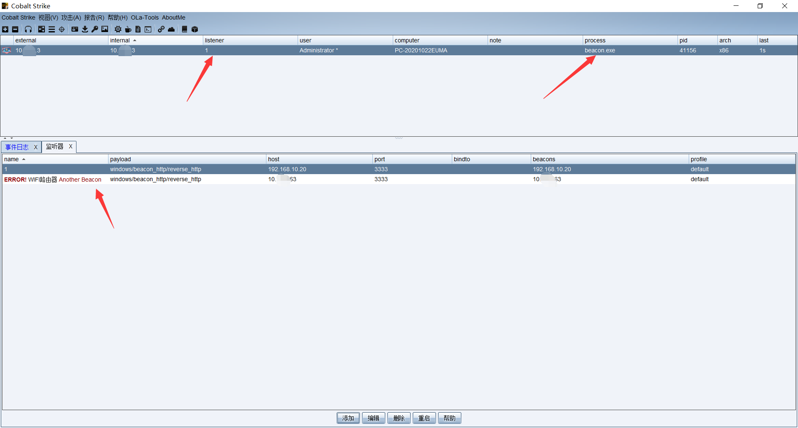

# 1. 前言

在日常的对客户的内网进行渗透的时候，通常会使用公网服务器来搭建CS来反弹shell，但是有时候会出现，客户不让你使用公网服务器来进行反弹shell，只允许本地来进行反弹shell，那么就会出现这样的一个，如果你能够直接连接网线来配置固定IP，那么更好，这个就不需要看了，没什么意义了，那么还有一种极端的情况是什么，只让你连接WIFI，或者条件不允许你去使用网线直连，那么有什么好的解决办法？

这里就是针对这中极端情况，进行演示，可能对于大佬来说，会有更多的方式来解决这个问题，但是对于一些刚接触到这方面的人，可能就会出现不知所措...

还需要注意的是，这里是介绍如何反弹shell，当然如果你非要使用正向shell去主动连接也可以哦，那么就不需要那么复杂了，也不需要向下看了，没意义了。

## 1.1. 前期准备

其实前期准备就是需要获取到WIFI路由器的密码，通常你可以试试么，一般企业内办公室的WIFI密码都挺简单的，不会太复杂，其次就是这个WIFI路由器需要支持端口映射。

## 1.2. 整体思路

首先，CS无法在Windows上运行服务端，需要使用到Linux系统，而个人电脑通常都是Windows系统，那么就需要使用到虚拟机来搭建服务端，在VM虚拟机中是支持端口映射，那么这里我们首先将CS反弹端口3333映射到本地的3333，然后再通过WIFI路由器将本地的3333端口在映射出去，如果难以理解，这里我们就实操吧。

# 2. 整体操作流程

IP地址如下：

```
WIFI路由器地址：10.X.X.63（企业内网IP）
本机IP地址：192.168.3.185（WIFI路由器自动分配地址）
虚拟机地址：192.168.10.20（虚拟机kali地址）
```

这里我建议端口全部都设置统一的，举两个例子：

客户端访问虚拟机的SSH端口案例：

首先客户端访问WIFI路由器的地址与设定的端口，那么假设WIFI对外提供访问的端口是222，内部的地址是333，那么就是访问WIFI地址的222端口，WIFI路由器将端口转发到主机的333端口，同时假设你虚拟机设置的主机端口是333，内部是22，那么主机将333端口获取到的流量再转发到虚拟机的22端口，使其实现通信。

CS反弹shell案例：

首先反弹shell，由于你使用的是WIFI连接，属于局域网中又套了一层局域网，那么反弹shell就会出现，你该监听哪个地址哪个端口，倘若你反弹shell设置端口与SSH端口案例是一样的，那么就涉及到222端口、333端口、22端口，那么你需要创建的监听器需要设定两个，一个用于生成木马的WIFI地址的222端口监听器，一个用于监听本地的22端口的监听器，那么就会乱，而且设置成同一个，虽然也要生成两个但是，能够一一对应上，至少不出出现乱套。

## 2.1. 虚拟机配置

这里我们需要理解的是，我们想要让CS木马反弹到哪个端口上，这里我设置的是反弹到3333端口上，那么就需要设置当访问主机的3333端口，自动传入到虚拟机的3333端口上。

```
主机端口：就是将你的端口映射到哪个端口上，解释看上面。
类型：看你CS木马的类型了。
虚拟机IP地址：这里就很简单了，你kali地址是多少就是多少。
虚拟机端口：简单来说就是你cs。
```



## 2.2. WIFI路由器设置

这里一定要支持NAT地址转发或者有端口映射功能的路由器，我这里是荣耀路由X1 增强版WIFI路由器，首先找到NAT服务，设置端口映射。

这里每个路由器操作可能不一样，但是用法都差不多，像荣耀这个路由器，不单单要确认设备的IP地址，还要选择设置，需要设置与IP地址相对应，部分路由器只需要输入IP地址就可以了。

```
端口协议：这个一定要以CS弹性木马的类型来设定。
内部端口：简单来说就是虚拟机去接收你本机的哪个端口，一定要按照虚拟机中设定的主机端口来定。
外部端口：这个就是外部去访问WIFI路由器的哪个端口，将流量转发给你。
```


## 2.3. CS设置

建立两个监听器，一个监听本地，一个用于生成木马。

### 2.3.1. 创建本地监听器

这里地址可以直接设置监听本地地址即可，端口一定要设置你监听的端口，不要搞错了。



### 2.3.2. 创建生成木马监听器

这个监听器保存后，你会发现无法开启监听，这里不用管，这个监听器主要是用于创建木马的。



### 2.3.3. 创建反弹木马

这里不要选错监听器了，一定要选择WIFI路由器地址创建的监听器。



### 2.3.4. 查看效果

可以看到是成功上线了，仔细观察有什么不同，发现没上线的监听器是1，并不是WIFI路由器那个监听器，这个问题可以自己考虑，如果考虑不出来，那么可能还是没理解我之前介绍了流程。

