# 1. Exchange介绍

Exchange是一个电子邮件服务组件，由微软公司开发。它不仅是一个邮件系统，还是一个消息与协作系统。Exchange可以用来构建企业、学校的邮件系统，同时也是一个协作平台，可以基于此开发工作流、知识管理系统、Web系统或其他消息系统。

# 2. Exchange测试案例

其实exchange的利用方式，主要还是使用漏洞进行攻击，在exchange服务中从18年至今也有不少漏洞，主要的横向移动的方式就是利用这些漏洞进行攻击。

像一些大型企业都会有自己的邮件服务器，这些邮件服务器可能是放在公网上也有可能是放在内网中，异地发邮件正常企业都会将邮件服务器放在外网上，倘若内部发邮件就会放在内网中，同时还有一些邮件服务器并不会放在域控上，可能是一个单独的邮件服务器，那么就算我们拿到权限也无法控制域控，但是可以通过获取到的这台邮件服务器进行深层次的利用，比如：发送钓鱼邮件或者利用之前学过的一些方式去上线域控。

## 2.1. 内网Exchange测试案例

这里我们提前控制其中一台域内主机进行上线，以便完成后续的操作，这里我们首先要去收集消息。

### 2.1.1. 服务探测

这里有很多种方式获取到关于exchange服务的信息。

#### 2.1.1.1. SPN扫描

之前我们提过，使用SPN进行扫描可以扫描域内主机的服务信息，那么这里我们也可以利用这种方式进行扫描。

```
setspn -T 0day.org -q */*
```

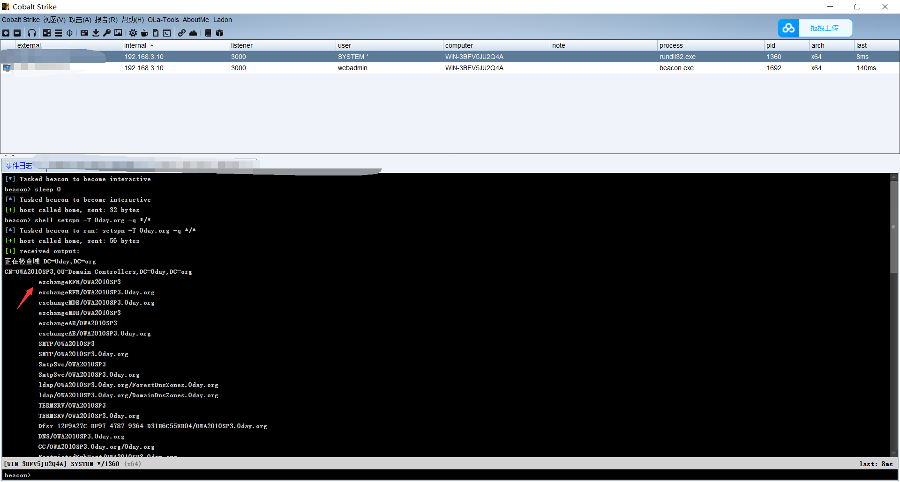

#### 2.1.1.2. 端口扫描

exchange会对外暴露接口如OWA,ECP等，会暴露在80端口，而且25/587/2525等端口上会有SMTP服务，所以可以通过一些端口特征来定位exchange。

例如445端口80端口，不是exchange服务唯一的端口，这里可以利用25端口来进行测试，由于我这里就开启域控主机与域内主机，所以这里扫描只有一个域控。

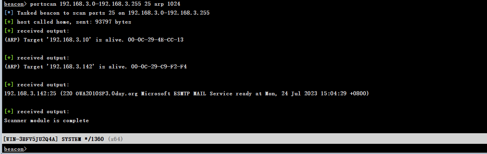

### 2.1.2. 脚本探针

这里需要注意的是，如果像服务是域内的话，不对外开放，那么就需要设置一个代理，比如这里使用socks代理即可。

#### 2.1.2.1. 代理登陆

这里我们设置好代理后测试一下是否能够登陆。

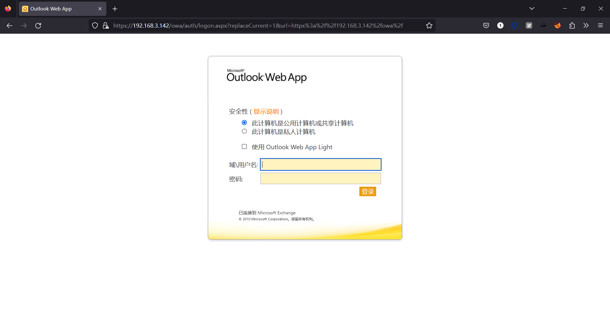

#### 2.1.2.2. 探针测试

这里就可以利用探针进行基础的漏洞测试，由于脚本在测试搭建的这个靶场的时候，发现没有检测出漏洞.....这个脚本漏洞更新到22年的3月30日，肯定还是有很多漏洞的没加入脚本中，那就需要手动去查找了。

[探针检测](https://github.com/3gstudent/Homework-of-Python/blob/master/Exchange_GetVersion_MatchVul.py)

```
python Exchange_GetVersion_MatchVul.py 192.168.3.142
```

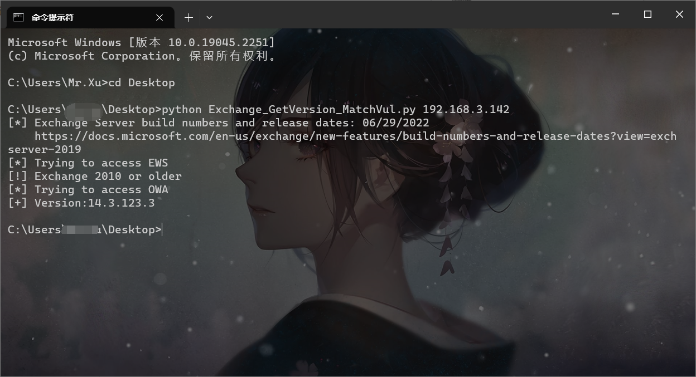

### 2.1.3. 内网爆破

当获取到邮件服务器的地址后，由于我们先前已经获取到其中一台主机的权限了，这里我们可以进行信息收集，对邮件服务器发起爆破，正常邮件服务器可能都是使用域内主机的账户密码来登陆，所以我们先要收集域内账户与密码，进行爆破。

#### 2.1.3.1. 收集账户

这里我们收集到很多的账户，至于密码我们只能去抓取本地的hash值或者明文去碰运气，有时候内部的用户的账户密码可能还有一定的规律。

```
net user /domain
```

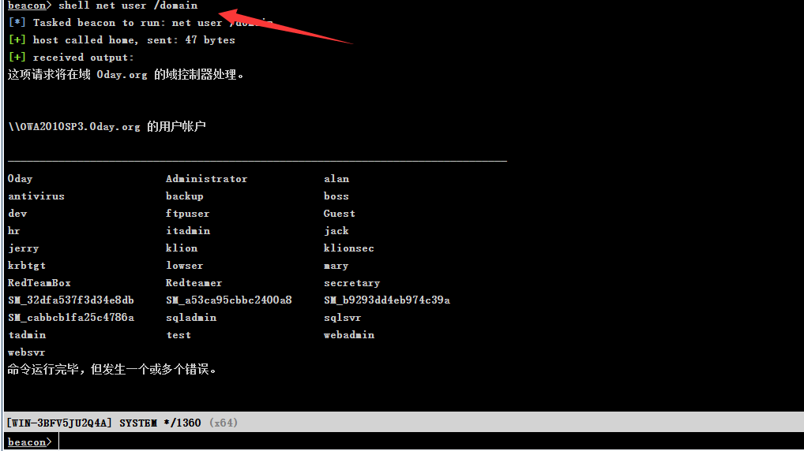

#### 2.1.3.2. 抓取密码

这里我们抓取了hash值与明文密码来进行测试，注意由于我这个密码被我修改过，所以为了方便，我不使用我修改后的密码来进行测试，我用靶机中提供的密码来测试。

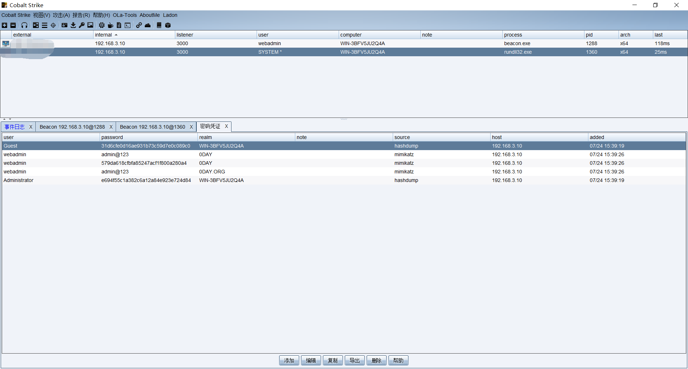

#### 2.1.3.3. burp爆破

这里使用burp爆破应该都知道吧....我直接上效果,这里主要修改的是用户名，至于密码，则是采用抓取获取到的密码进行测试。

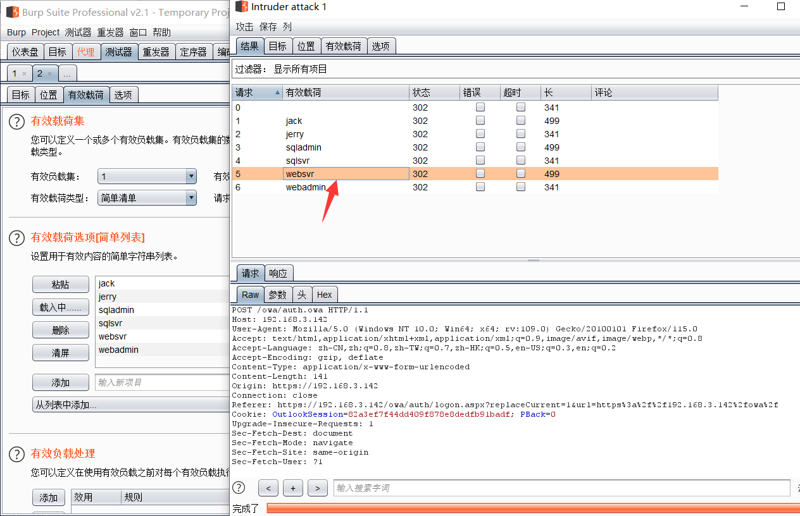

#### 2.1.3.4. 测试登陆

这里我想着测试一下的，不知道怎么了，发现连接失败了，可能我使用的VPS有问题，我的VPS禁止设代理.....尴尬了，这里只要将代理设置起来，任何使用正确的账户密码登陆即可。

## 2.2. 外网exchange测试案例

这里由于我的VPS有点问题，我要去修一下VPS，这里我看看，有没有外网的能够测试。同时关于外网的exchange邮件，正常情况下你是不知道登陆的账户密码的，所以只能使用漏洞来测试，很难进行弱口令爆破出来的。

### 2.2.1. fofa语法

下面提供一些fofa的语法，不过好像有些不能使用，我也是从github上搞来的，有些好像不支持了，也不知道是不是我复制的时候出现问题了。

```
microsoft exchange 2013：
app="Microsoft-Exchange-2013"||app="Microsoft-Exchange-Server-2013-CU21"||app="Microsoft-Exchange-Server-2013-CU17"||app="Microsoft-Exchange-Server-2013-CU23"||app="Microsoft-Exchange-Server-2013-CU13"||app="Microsoft-Exchange-Server-2013-CU22"||app="Microsoft-Exchange-Server-2013-CU11"||app="Microsoft-Exchange-Server-2013-CU2"||app="Microsoft-Exchange-Server-2013-CU16"||app="Microsoft-Exchange-Server-2013-CU19"||app="Microsoft-Exchange-Server-2013-CU3"||app="Microsoft-Exchange-Server-2013-CU18"||app="Microsoft-Exchange-Server-2013-CU5"||app="Microsoft-Exchange-Server-2013-CU20"||app="Microsoft-Exchange-Server-2013-CU12"||app="Microsoft-Exchange-Server-2013-CU15"||app="Microsoft-Exchange-Server-2013-CU10"||app="Microsoft-Exchange-Server-2013-CU9"||app="Microsoft-Exchange-Server-2013-CU6"||app="Microsoft-Exchange-Server-2013-CU7"||app="Microsoft-Exchange-Server-2013-CU1"||app="Microsoft-Exchange-Server-2013-CU14"||app="Microsoft-Exchange-Server-2013-CU8"||app="Microsoft-Exchange-Server-2013-RTM"||app="Microsoft-Exchange-Server-2013-SP1"||app="Microsoft-Exchange-2013"

microsoft exchange 2016：
app="Microsoft-Exchange-Server-2016-CU19"||app="Microsoft-Exchange-Server-2016-CU3"||app="Microsoft-Exchange-Server-2016-CU12"||app="Microsoft-Exchange-Server-2016-RTM"||app="Microsoft-Exchange-Server-2016-CU7"||app="Microsoft-Exchange-Server-2016-CU17"||app="Microsoft-Exchange-Server-2016-CU2"||app="Microsoft-Exchange-Server-2016-CU1"||app="Microsoft-Exchange-Server-2016-CU14"||app="Microsoft-Exchange-Server-2016-CU5"||app="Microsoft-Exchange-Server-2016-CU11"||app="Microsoft-Exchange-Server-2016-CU9"||app="Microsoft-Exchange-Server-2016-CU16"||app="Microsoft-Exchange-Server-2016-CU10"||app="Microsoft-Exchange-Server-2016-CU6"||app="Microsoft-Exchange-Server-2016-CU13"||app="Microsoft-Exchange-Server-2016-CU18"||app="Microsoft-Exchange-Server-2016-CU8"||app="Microsoft-Exchange-Server-2016-CU4"||app="Microsoft-Exchange-2016-POP3-server"

microsoft exchange 2019：
app="Microsoft-Exchange-Server-2019-CU5"||app="Microsoft-Exchange-Server-2019-CU3"||app="Microsoft-Exchange-Server-2019-Preview"||app="Microsoft-Exchange-Server-2019-CU8"||app="Microsoft-Exchange-Server-2019-CU1"||app="Microsoft-Exchange-Server-2019-CU7"||app="Microsoft-Exchange-Server-2019-CU2"||app="Microsoft-Exchange-Server-2019-CU6"||app="Microsoft-Exchange-Server-2019-RTM"||app="Microsoft-Exchange-Server-2019-CU4"

microsoft exchange 2010：
app="Microsoft-Exchange-2010-POP3-server-version-03.1"||app="Microsoft-Exchange-Server-2010"
```

### 2.2.2. 漏洞探针

这里我找到一个某国家的2019版本的exchange，这里我们测试一下，测试完好像是存在漏洞，并且能够看到版本。

```
python Exchange_GetVersion_MatchVul.py XXX.XXX.XXX.XXX
```

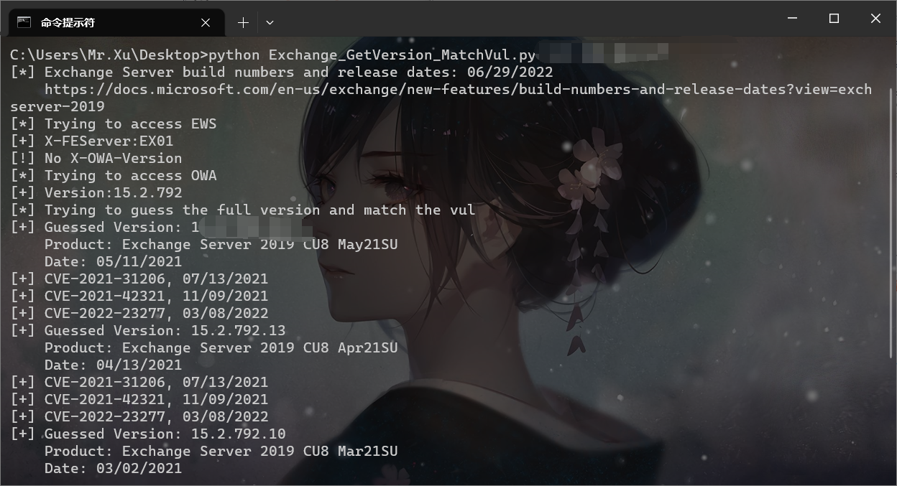

### 2.2.3. 查找漏洞

这里其实就很简单了，根据版本去对应的系统版本，一个是邮件的版本一个是系统的版本。

#### 2.2.3.1. 查找邮件版本

关于查找邮件的版本，使用上面的工具也能检测出来，同时利用右击查看源代码也能看到邮件的系统版本，这里我们获取到的是15.2.792版本。

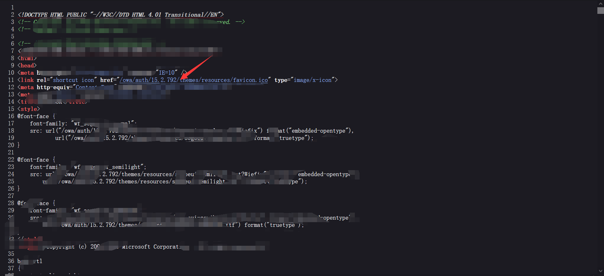

#### 2.2.3.2. 查找对应的版本

这里我们访问微软的官网就能够查询到，这个邮件系统版本适应的版本了，不过我提供的这个好像是属于补丁漏洞，点击进去后能够发现存在更新说明。

[查询操作系统版本](https://learn.microsoft.com/en-us/exchange/new-features/build-numbers-and-release-dates?view=exchserver-2019)

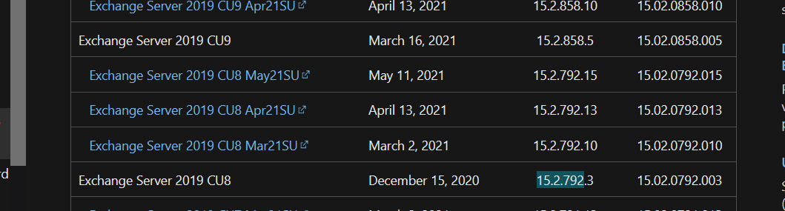

#### 2.2.3.3. 查看更新说明

点击进去后就能够看到更新说明了，里面还有相应的CVE，根据对应的CVE查找可以的exp即可，这里我随便点击了一个15.2.792.X版本下面，就出现了这些CVE。

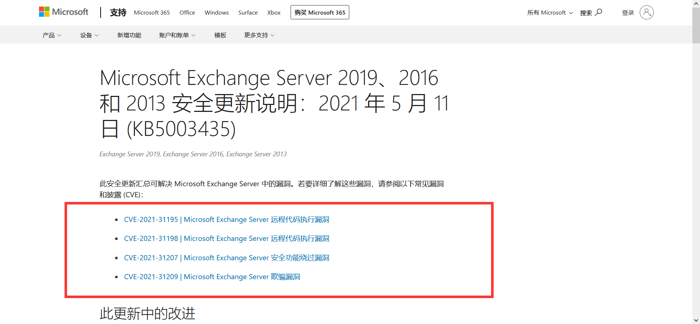

## 2.3. 整体思路

这里由于我也没找到对应的POC，可能比较新的POC都在个人手里面，老的环境也没找到，所以感兴趣去的可以自行去测试，这里我说一下整体思路吧。

```
首先通过源码查询版本
当获取到源码版本后，去对应的微软上去查询，使用ctrl+f查询，要重点查看前面的server版本可能要看整个名字，比如：Update Rollup 22 for Exchange Server 2010 SP3 有些漏洞的虽然支持2010版本，但是可能不支持sp3，就会导致漏洞验证不成功，所以不管使用exp还是POC都注意关注版本。
获取以上信息后，就可以去查找exp或者poc了，而网上很多关于Exchange的验证POC和攻击EXP都需要自己编译，所以可能还需自己进行编译成exe程序。
```

