# 1. 前言

本篇和上篇文章前置的知识基本差不多，这里我就不在赘述了，感兴趣的可以去上CSDN上或者公众号找上篇内容，那篇中涉及到了很多的前置知识，本篇主要以实操为主。

## 1.1. 实验背景

这里同样是模拟会遇到的一些情况，而本次模拟的是当遇到只允许访问80端口以及访问打印机的端口也就是445端口的情况，可能靠说无法理解，这里直接上图来演示吧。

## 1.2. 环境准备

这里需要准备一台攻击机，四台主机，来演示这个环境。

### 1.2.1. 环境介绍

攻击机的目标是`Windows7系统`，而攻击机是无法直接连接`Windows7`，如果这里不了解我说的是什么意思，请去学习一下路由原理吧！自然而然下面也就不用解释了，肯定是`Windows2008`能够连接`Windows2003`，`Windows2003`能够连接`Windows2012`，`Windows2012`能够连接到`Windows7`。目前攻击机只能够连接`Windows2008`，但是我们可以通过采用一些技术而实现和`Windows7`通信，这技术也就是本章需要介绍的。

这里我们不考虑是通过如何手段获取到`Windows2008`的权限，也不考虑怎么知道`Windows2003`、`windows2012`、`windows7`的IP地址，这些肯定是当获取到`Windows2008`的权限后通过一些信息收集得到的，而这里我们不要考虑如何得到权限、地址，我们只需要先学习如何让这些主机互相通信起来。
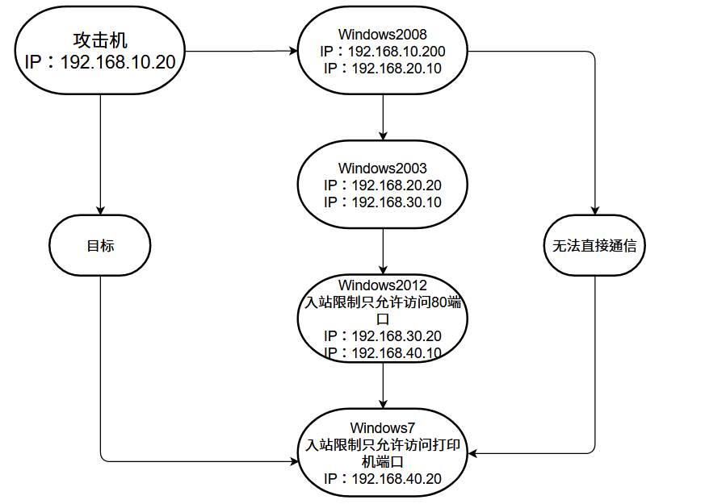

```
攻击机				192.168.10.20

Windows2008 192.168.10.200(外网出口)
						192.168.20.10(内网口)
						
Windows2003 192.168.20.20(内网口)
						192.168.30.10(内网口)
						
Windows2012 192.168.30.20(内网口)
						192.168.40.10(内网口)
						
Windows7    192.168.40.20(内网口)
```

### 1.2.2. 环境测试

本来是想一个个进行环境测试的，但是想一下这里还是不一个个测试了，挺简单的内容，无需进行测试，直接按照环境搭建即可。

# 2. CS上线

这里只介绍CS上线，至于MSF上线，其实差不多，并且在后面的渗透中，可能用到的CS是比较多的，而且msf毕竟是命令行，有时候确实不太好操作。

```
connect 192.168.20.20 2222
```

## 2.1. Windows2008上线

这里也不演示了，攻击机能够与Windows2008进行通信，那么通过前期的WEB漏洞或者其它漏洞获取权限，然后上传木马，在然后就是上线了。


## 2.2. Windows2003上线

这里的`Windows2003`上线和之前是一样的，采用socks代理进行上线。

### 2.2.1. 设置socks代理

这里右击之前获取到的`Windows2008`服务器，利用`Windows2008`代理设置上线，原理在上篇已经提及过了，这里直接操作了。

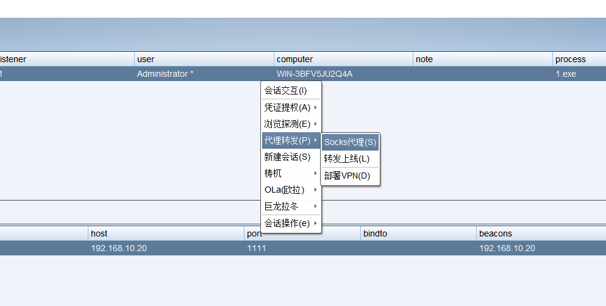

### 2.2.2. 设置正向连接

这里需要设置一个正向连接，如果使用反向连接，木马上线后，由于无法和攻击机连接，所以就会导致上线失败，而这里使用正向连接，让攻击机利用`Windows2008`设置的代理主动去连接进去。

所以这里创建一个正向连接的监听器。

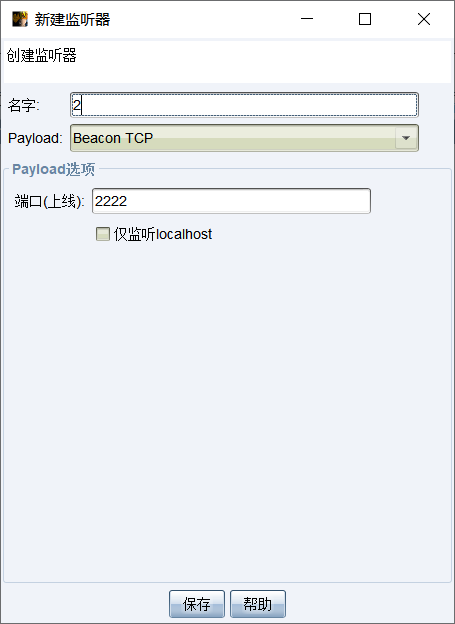

### 2.2.3. 生成木马

这里也还需要生成一个正向连接的木马，一个`Windows可执行程序E`一个`Windows可执行程序S`类型的木马在上篇文章中也提及到，所以也不在赘述，这里点击后，监听器要选择正向连接的监听器。

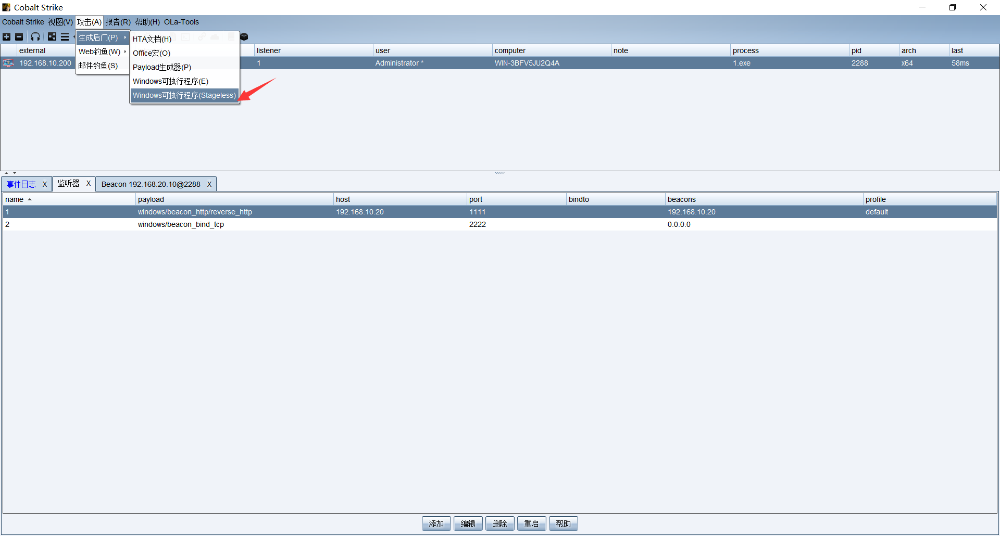

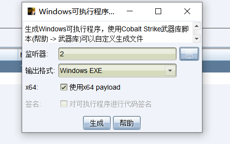

### 2.2.4. 上线木马

这里直接在`Windows2003`上运行木马是无效的，由于正向木马，是将连接的端口放在本地，然后攻击机去连接目标主机的本地端口，这里就能够上线，但是这里，由于攻击机是无法直接与`Windows2003`连接，所以需要使用到代理，而且这个代理就是利用Windows2008将流量转发到攻击机上，这里就能够上线成功。

```
connect 192.168.20.20 2222
```

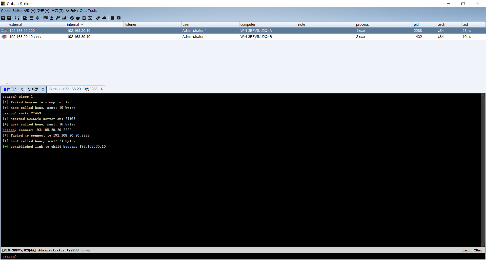

## 2.3. Windows2012上线

这里`Windows2012`上线就出现一个问题，他的入站是被封闭的，而我们之前的正向连接，是需要使用到入站的，而且现在入站只允许`80端口`通信，那么我们的正向连接就无法使用，这时候如果使用反向连接，确实可以，但是我们的攻击机无法连接到`Windows2012`上，那么该如何上线呢？

### 2.3.1. 转发上线

前面我们分析了一下这个问题，其实在CS中是有一个转发上线的，而我们可以利用这个转发上线，使其`Windows2012`进行上线，这里的选择转发上线后，会弹出一个创建监听器，而我们这里只需要修改名字以及端口即可，其它的保持不变，如何回到监听器就能够看到一条自动生成的监听器了。

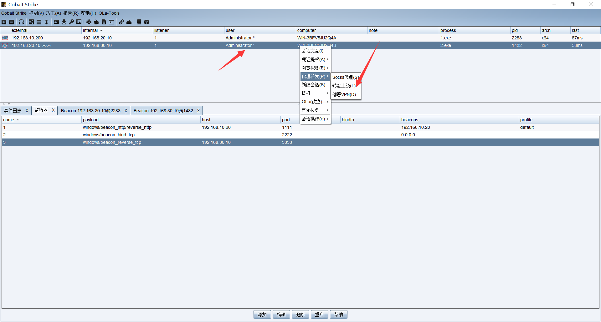

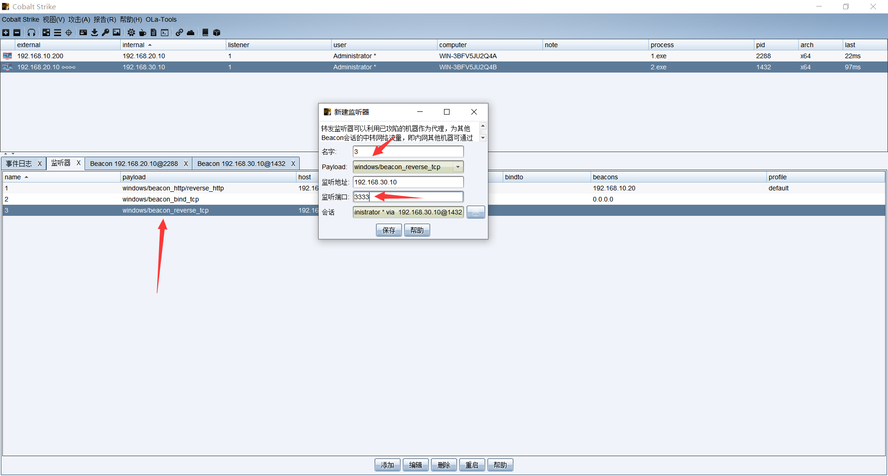

### 2.3.2. 创建木马

这里还是选择S类型，监听器设置刚刚自动生成的监听器，然后上传木马，进行上传执行。

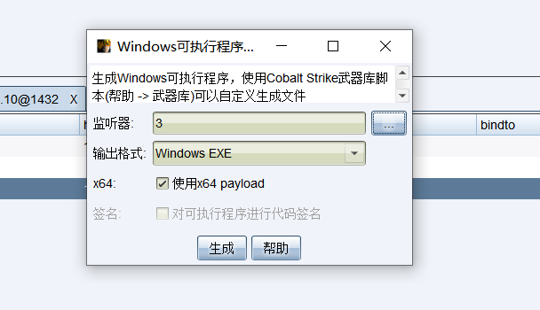

### 2.3.3. 上线木马

这里可以看到成功上线木马了。

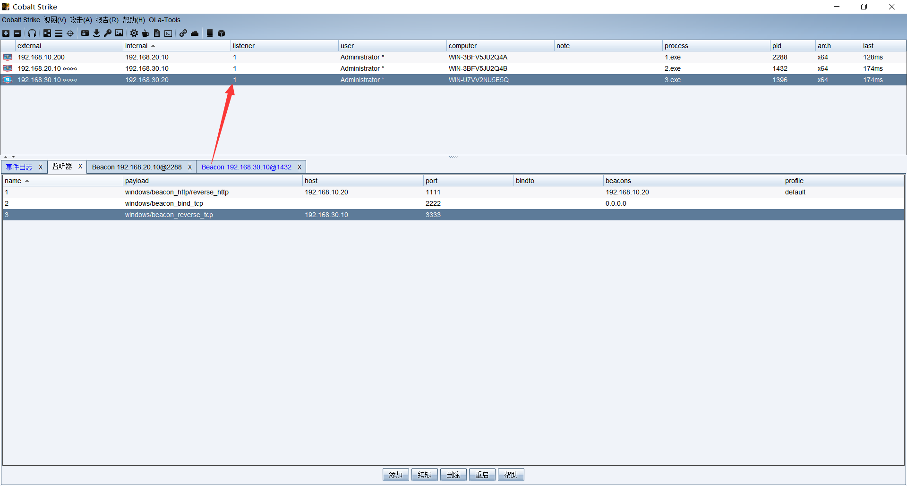

### 2.3.4. 查看导图

这里我们来看一下这个CS上的数据传输的导图，从这上面就能够看出，`Windows2012`流量是发送给`Windows2003`的，然后`Windows2008`正向连接到`windows2003`上面，然后流量就被转发过来了。

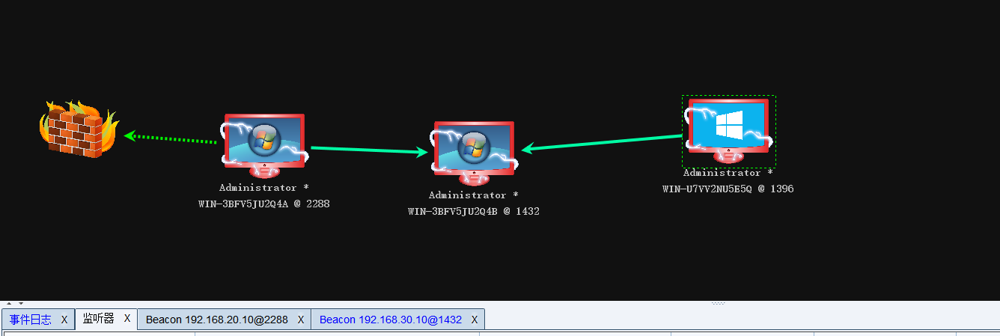

## 2.4. Windows7上线

这个就比较麻烦了，无法使用正常的思路来上线，如果采用反向连接，那么当`Windows7`对外发送到`Windows2012`上的时候，会遇上`Windows2012`的入站限制，如果采用正向连接，那么当就会遇到`Windows7`上面的正向连接，所以导致`Windows7`上线无法采用之前的方式来上线，但是`Windows7`是开启打印机的，那么就是445端口，那么就可以使用smb进行上线。

这里需要配合前期的信息收集来判断445端口是否开放。

### 2.4.1. 信息收集

 这里需要提前获取到目标主机的账号密码，以及开放的端口，这样才好上线。

#### 2.4.1.1. 端口探测

这里我们探测40段的中存在445端口的地址。

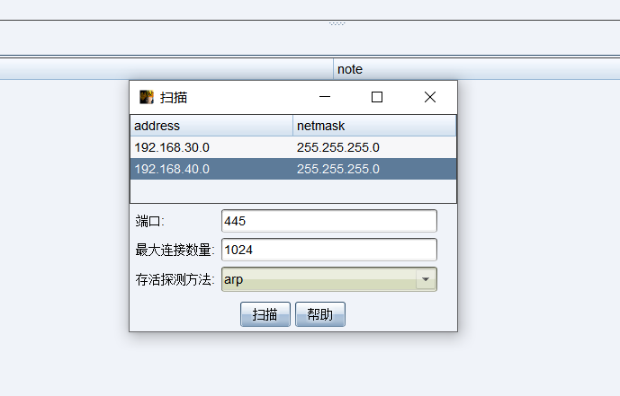

#### 2.4.1.2. 探测信息

可以看到，我们这里探测到存在445端口的有一个地址是`192.168.40.20`。

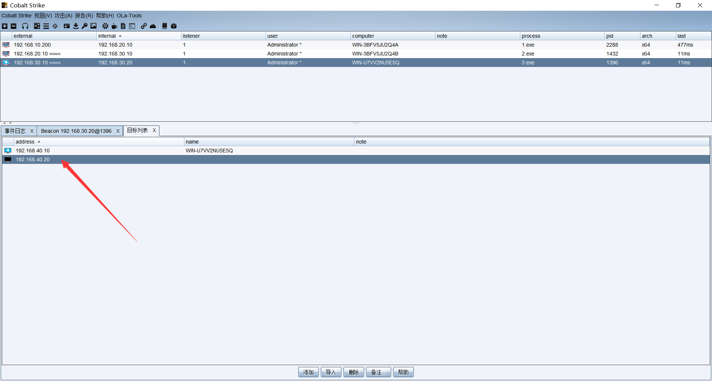

### 2.4.2. 创建监听器

这里需要创建一个SMB的监听器，而这个监听器只是个监听器无法创建木马，由于他是没有任何地址的，只是一个SMB的管道。

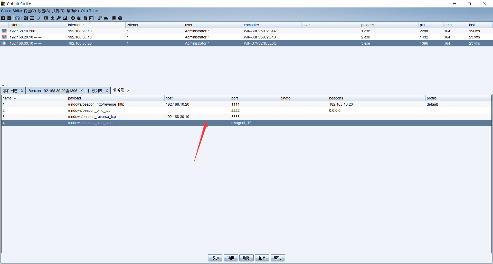

### 2.4.3. 横向移动

这里是无法使用到木马的，只能使用到横向移动，在前期我们需要获取到这台目标主机的密码，当然这个密码，需要前面的信息收集，或者套用已经获取到的密码，如果密码不对，那么这台主机大概率是无法上线的，而这里演示我们都是提前准备好的，而在实际的环境中必然是很复杂的一件事。

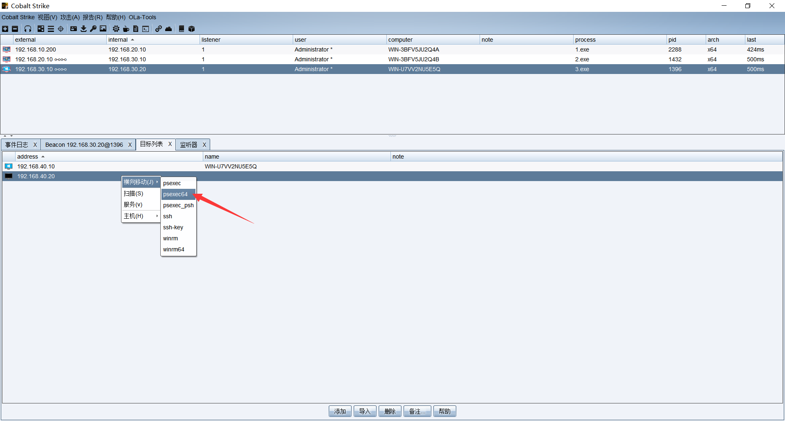

### 2.4.4. 上线测试

这里账号密码，是前期信息收集得到的，实际情况中不一定百分百对，而这里是模拟环境，那么肯定是提前准备好的，监听器选择刚刚创建的SMB监听器，会话要选择能够与目标连接的那一台主机。

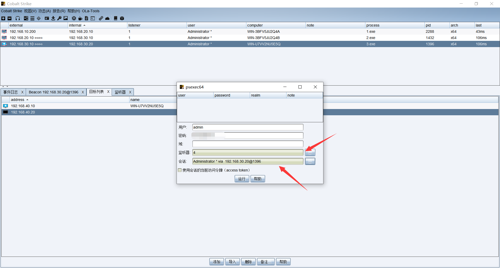

### 2.4.5. 上线成功

可以看到这里成功上线，而且是system的权限，其实也就是通过`Windows2012`去攻击`Windows7`的漏洞来获取到权限。

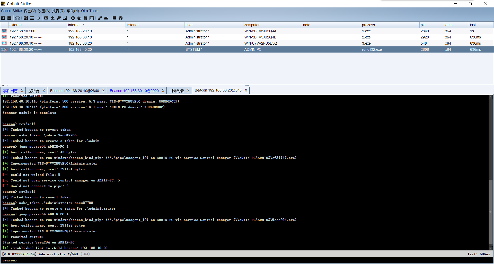

### 2.4.6. 查看导图

这里看到已经成功了，而且通过图来看，可以了解攻击的流程。

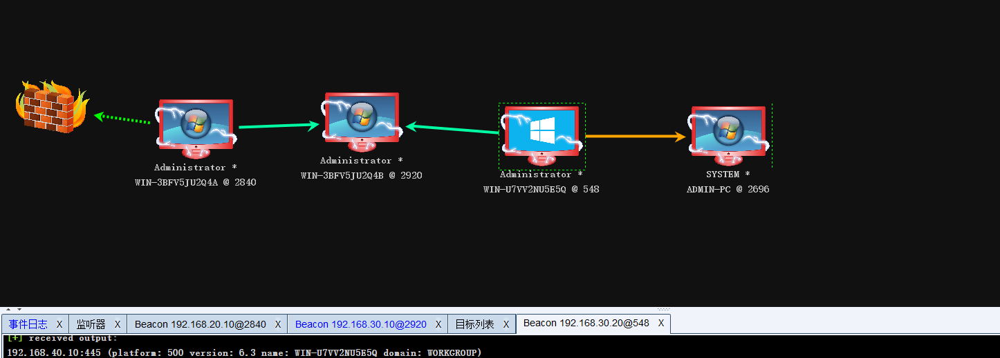

# 3. 总结

这里采用的都是针对性的绕过，下一篇主要介绍如何使用隧道技术来进行绕过。