# 1. 前言

渗透测试的本质就是信息收集，不管是web还是在内网中，信息收集的全面性会直接影响后续的渗透测试工作，通常web端使用文件上传等进入内网后，就需要判断当前的网络环境和权限，为后续的横向移动等工作做好铺垫。

# 2. 关于域

域英文叫DOMAIN——域(Domain)是Windows网络中独立运行的单位，域之间相互访问则需要建立信任关系(即Trust  Relation)。信任关系是连接在域与域之间的桥梁。当一个域与其他域建立了信任关系后，2个域之间不但可以按需要相互进行管理，还可以跨网分配文件和打印机等设备资源，使不同的域之间实现网络资源的共享与管理，以及相互通信和数据传输。

域既是 Windows 网络操作系统的逻辑组织单元，也是Internet的逻辑组织单元，在 Windows  网络操作系统中，域是安全边界。域管理员只能管理域的内部，除非其他的域显式地赋予他管理权限，他才能够访问或者管理其他的域，每个域都有自己的安全策略，以及它与其他域的安全信任关系。

如果企业网络中计算机和用户数量较多时，要实现高效管理，就需要windows域。

## 2.1. 域搭建

关于域搭建，我觉得是一个很简单的过程，这里我在总结的时候，在想到底要不要一步一步来操作，后来想了一下，域这个搭建是一个很简单的过程，我觉得没必要去写，如果实在不懂如何搭建的话去百度搜索一下吧。

当然实际在渗透测试中也不会要你去搭建域环境，但是多多少少还是需要去了解一下域。

## 2.2. 域渗透思路

域渗透思路：通过域成员主机，定位出域控制器IP及域管理员账号，利用域成员主机作为跳板，扩大渗透范围，利用域管理员可以登陆域中任何成员主机的特性，定位出域管理员登陆过的主机 IP，设法从域成员主机内存中 dump 出域管理员密码，进而拿下域控制器、渗透整个内网

# 3. 域信息收集

以及都是基于通过某种方式已经获取到域内主机的情况下操作，并且在域内进行信息收集，收集到的信息越多，那么拿下域内控制器的概率就越高。

下图来源你懂的~，这个更详细一些。


## 3.1. 判断是否存在域

### 3.1.1. 查询网络信息

一般通过查询IP网络或系统信息时，就能够发现域控。

```
ipconfig /all
```

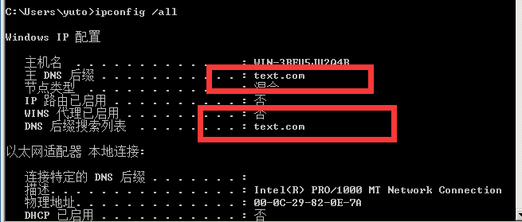

```
systeminfo
```

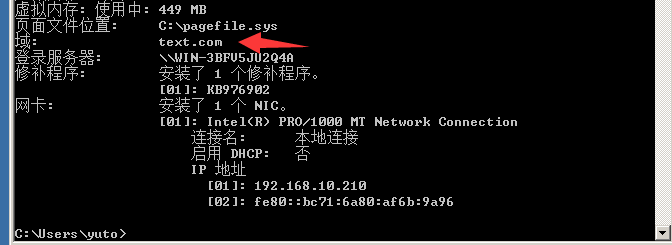

### 3.1.2. 查询当前登录域与域环境

通过查询可以判断当前的登录的域与域环境。

```
net config workstation
```

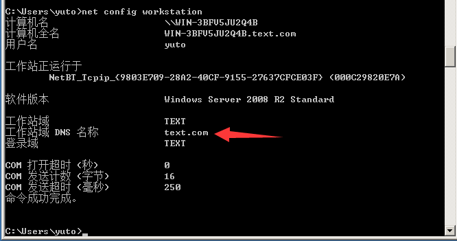

### 3.1.3. 判断主域

域服务器通常都会作为时间服务器，可以通过下列的命令来判断主域。

```
net time /domain
```

存在域，并且当前用户为域用户。

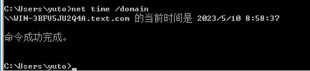

工作环境为工作组，不存在域。

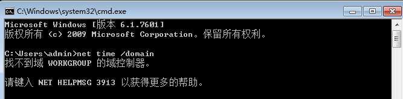

存在域，但当前用户不是域用户。


## 3.2. 查找域控制器

在得到域名后，就可以通过域名进一步的获取域控制器的地址及其它信息。

### 3.2.1. 查询DNS地址

一般情况下DNS地址就是域控制器的地址。

```
ping 域名
```

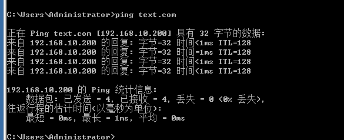

```
nslookup 域名
```

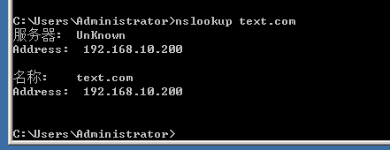

### 3.2.2. 查看域控制器的机器名

```
nltest /DCLIST:域名
```

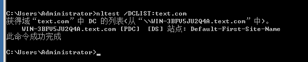

### 3.2.3. 查看域控制器

```
net group "Domain Controllers" /domain
```

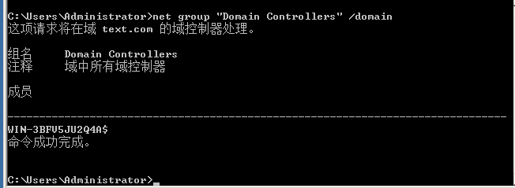

## 3.3. 获取域内用户和管理员

这里主要我们需要收集的就是域内的一下用户以及管理员信息。

### 3.3.1. 查询域内所有用户组列表

```
net group /domain
```

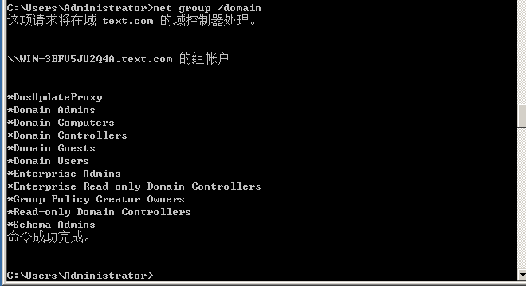

### 3.3.2. 查询域管理员列表

```
net group "Domain Admins" /domain
```

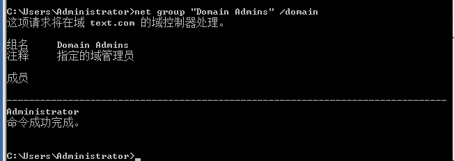

### 3.3.3. 获取所有域用户列表

```
net user /domain
```

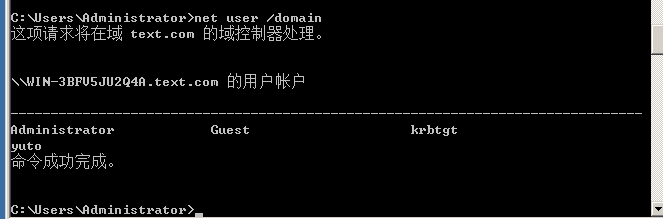

### 3.3.4. 获取指定域用户的详细信息

```
net user 用户名称 /domain
```

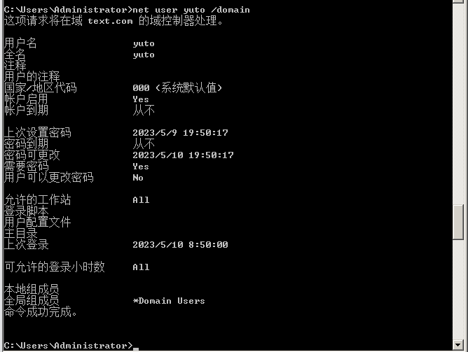

### 3.3.5. 查看域密码策略

```
net accounts /domain
```

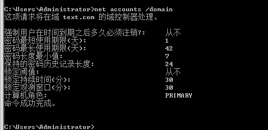

### 3.3.6. 查看加入域的所有计算机名

```
net group "domain computers" /domain
```

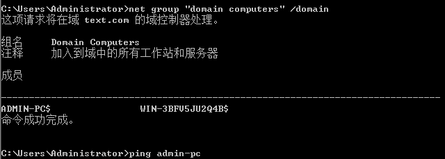

### 3.3.7. 获取加入域计算机地址

```
ping 计算机名
```

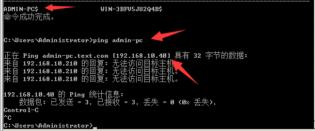

# 4. CS域信息收集

这里采用CS进行域信息收集，关于CS想必学到这里都应该知道了，同时在之前的权限提升文章中也大概介绍了CS的作用以及使用，同时相关的插件也基于了，如果没有相关的插件可以自行去搜索。

[棱角社区](https://forum.ywhack.com/center.php)

## 4.1. 上线与提权

这里就演示一下。

### 4.1.1. 域内主机上线

关于如何生成一个木马我就演示了，很简单的东西，之前也应该都知道了，这里我直接让域内的一台主机上线，可以看到我这个上线就是一个administrator用户，其实只是演示影响不大。

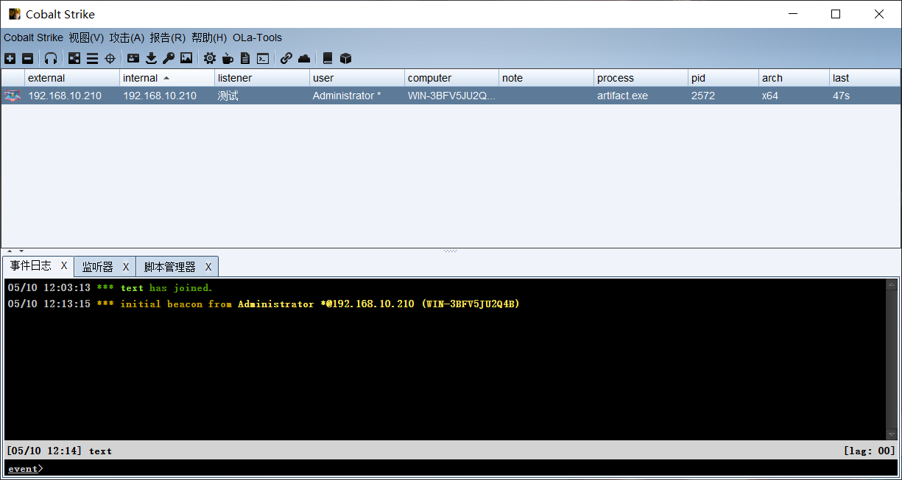

### 4.1.2. 提权

关于提权，这个在之前的提权文章中已经写很多了，这里直接使用工具中的提权来尝试提权，可以看到，这里我随便找了一个自动提权就成功提权了，也是由于我这个搭建的域是2008所以可能漏洞比较多，所以点一下就成功提权了。

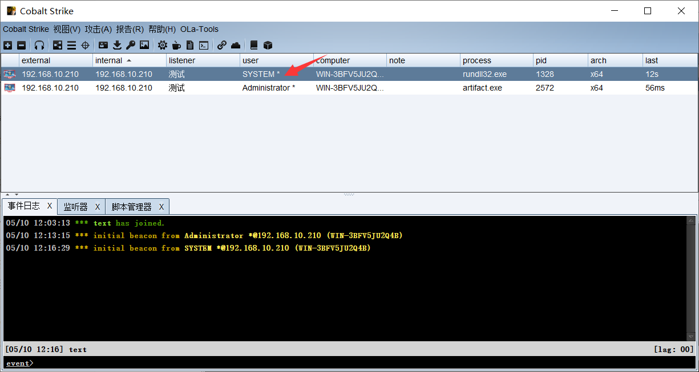

## 4.2. 自动化信息收集

通过自动化信息收集，可以更好的收集信息，而手动收集毕竟会比较麻烦。

### 4.2.1. 抓取明文密码凭证

这里需要先将权限提升到system然后去抓明文的密码，获取到的明文密码，就可以尝试对域内其它主机进行尝试登陆，由于管理员在基于用户的账户密码一定是有规律的，而为了方便，部分管理员会设定不能修改密码，所以你抓取到一个密码后，可能就能够实现登陆其它的域内主机。

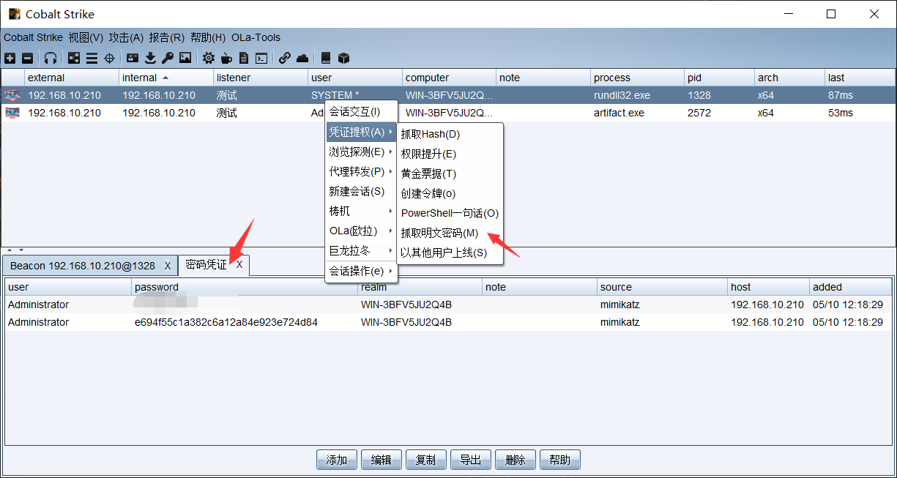

### 4.2.2. 利用明文密码

这里是属于后期的横向移动，这里只是演示一下，也没介绍，我也没学习到。

#### 4.2.2.1. 探测主机

通过前期的网络探测，探测到一些主机，这里我提前说一下10.200是我域控主机，我们最终的目的就是获取到域控主机的权限，而这里我探测到域控主机地址了，通过前期的地址也能够知道域控主机地址。


#### 4.2.2.2. 横向移动

这里我们点击这个横向移动选择64位的。

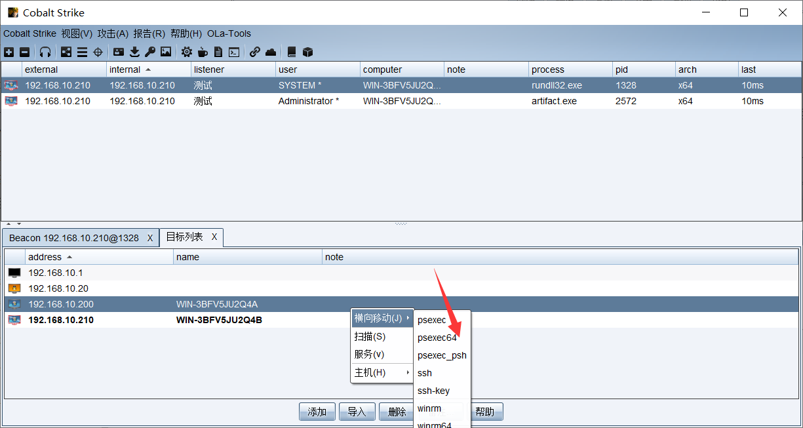

#### 4.2.2.3. 配置参数

在弹出的页面我们配置一些参数，需要注意这里我们就能够选择我们前期获取到的密码来尝试登陆，至于用户名，也可以在前期的信息收集中获取到，反之都输入进去试试，监听器就是选择需要反弹回来的监听器，会话，要选择刚刚提权后的system权限的会话。

通过获取也能够看到是成功获取到10.200的system权限也就是域控权限，当然实际渗透中可能获取还是比较复杂的，不过也不排除很幸运一下子就获取到。


### 4.2.3. 域信息收集

由于太多了，这里我就不一条一条测试了，这里给各位看看即可，简单来说就是省自己手动操作，不需要一条一条去敲命令。

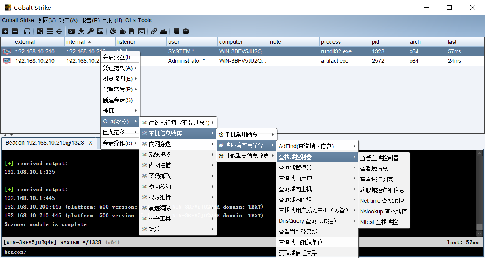

# 5. BloodHound

BloodHound 使用可视化图形显示域环境中的关系，攻击者可以使用 BloodHound  识别高度复杂的攻击路径，防御者可以使用 BloodHound 来识别和防御那些相同的攻击路径。蓝队和红队都可以使用 BloodHound  轻松深入域环境中的权限关系。

BloodHound 通过在域内导出相关信息，在将数据收集后，将其导入Neo4j 数据库中，进行展示分析。因此在安装 BloodHound 时，需要安装 Neo4j 数据库。

**这里注意去下载 BloodHound GUI 4.0.3，不要下载其它的版本了，我已经被恶心到了，无语了，最新的采集器根本就不兼容，搞了我一个下午，还有就是关于这些，我还是没解决，如果有解决的还请告知一下，由于目前很多文章就是沙雕引流的，直接复制几年前的，找解决办法就没找到，还有很多文章是新发的，但是一看内容，基本上就是复制粘贴没实操，我这时心里有一句话不知该说不该说........**

[BloodHound下载](https://github.com/BloodHoundAD/BloodHound)

## 5.1. 配置环境

这里我使用Windows来搭建这个环境，因为 Neo4j 数据库需要 Java 支持，因此安装 BloodHound 需要先安装 Java，这里想必关于JAVA方面的步骤我就不赘述了，也没多难，而且之前很多工具都需要使用到java，所以应该都安装了。

## 5.2. neo4j

在这里点击完可能需要让你输入一些信息才给你下载，这里不想填就随便天天，然后点击下载，就会弹出下载框。

[neo4j下载](https://neo4j.com/download-center/#community)

### 5.2.1. 启动neo4j

这里解压文件后加入bin中输入命令进行启动，需要注意的是java版本不能太低，同时若一个系统中有多个java版本，那么就需要切换，否则无法执行。

```
neo4j.bat console
```

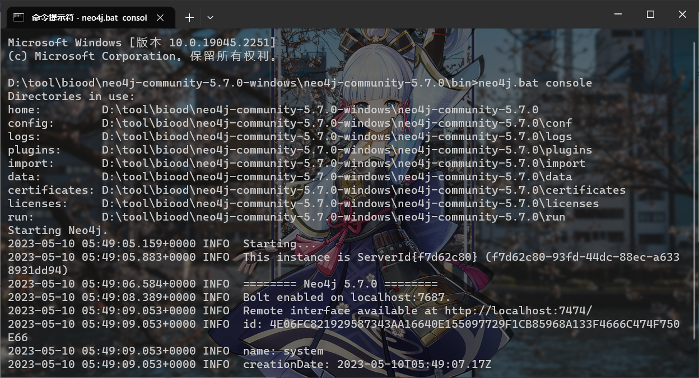

### 5.2.2. 打开页面

这里访问http://127.0.0.1:7474/即可打开页面，默认的账户密码都是neo4j，输入完会让你重置密码，这里你设置一个即可。

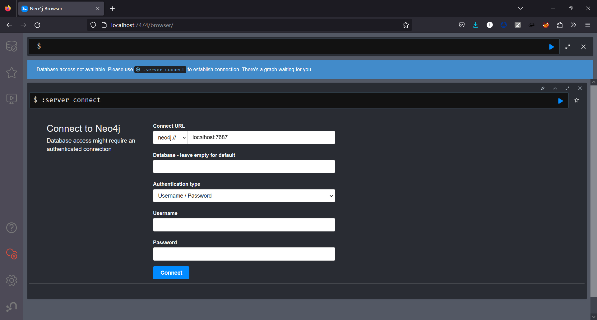

### 5.2.3. 设置密码

这里随便设置一个，完成后就成功了。

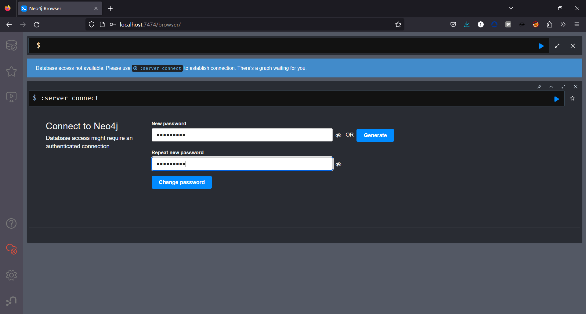

## 5.3. BloodHound

下载一定要下载对应的版本，千万不能下载错误了。

### 5.3.1. 运行界面

解压下载下来的文件，在目录中寻找到BloodHound.exe，点击运行，就会弹出一个登陆窗口，账户就是neo4j，密码就是刚刚设置的。

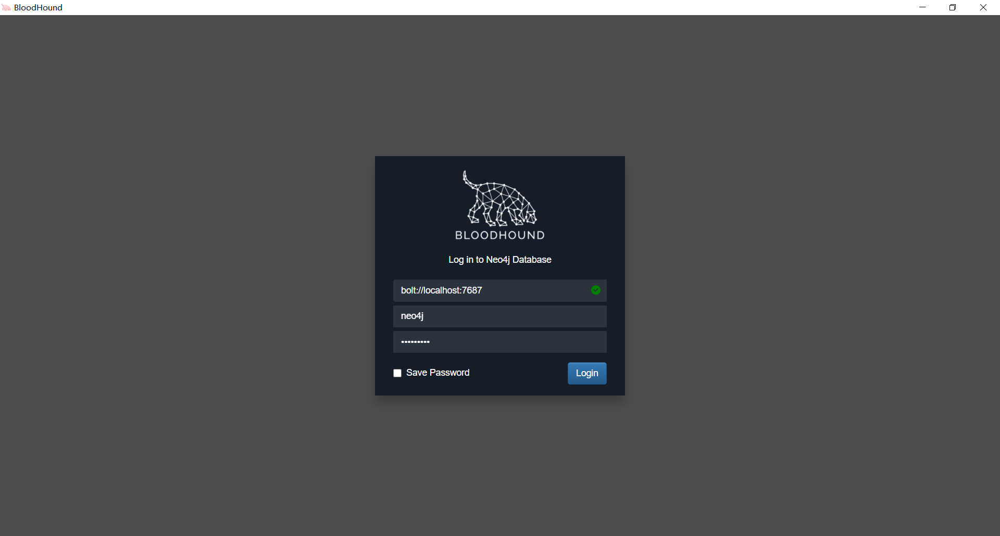

### 5.3.2. 界面介绍

在这个界面中就会有很多的功能，不过还是推荐去看官方的文档，你让我介绍我也是直接复制粘贴。

[官方文档](https://bloodhound.readthedocs.io/en/latest/index.html)

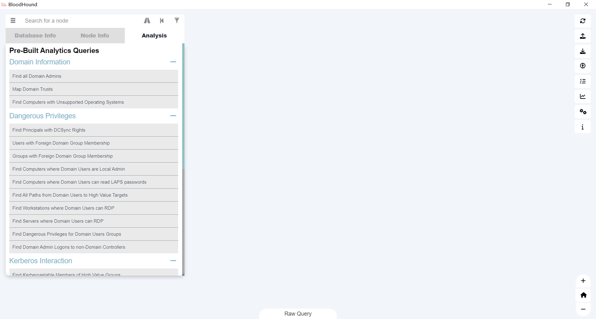

## 5.4. 数据收集

当做好前期的准备就可以下载采集器进行采集信息了，额，这里的话还是一样，各种报错，各种使用不了，网上也没找到解决的办法。

### 5.4.1. 下载采集器

关于采集器这里，下载完后，在目录中能够找到采集器，这里我看我的截图。

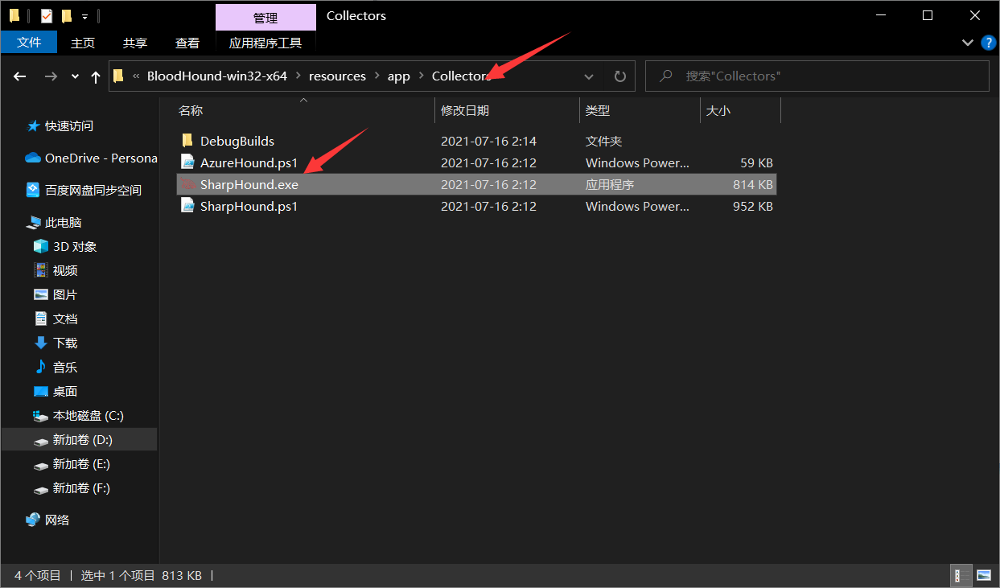

### 5.4.2. 执行采集器

这里我们将下载下来的采集器上传至域服务器中，然后就会获取到相关的压缩包，但是这里还是遇到问题了，一个下午了没解决......

这里只要执行就是出现这种错误，不管是管理员启动还是什么启动均会出现这种错误。

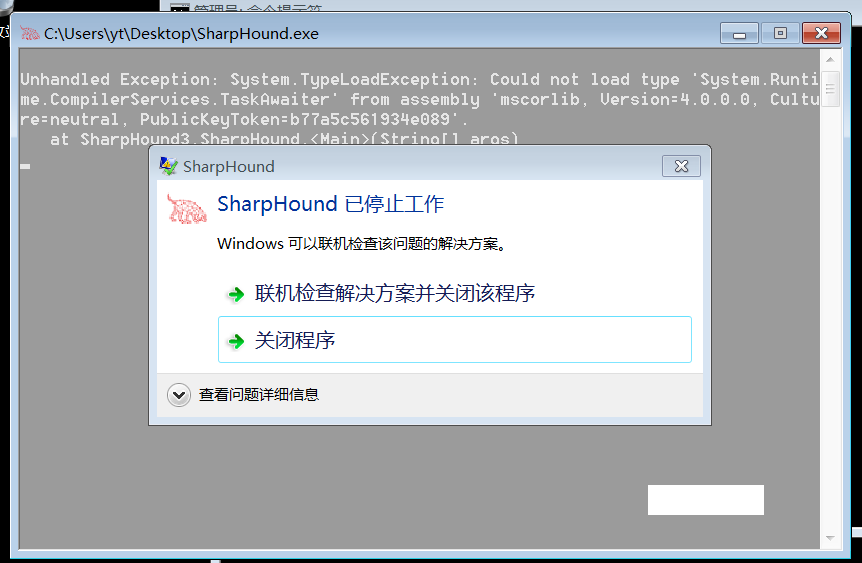

## 5.5. 总结

关于BloodHound倒是能够搭建出来，但是到采集器SharpHound的时候就出先很多问题了，这里我发现我使用Windows2012、2008、7、10等均为执行成功，根据部分解决办法下载了.NET Framework不行，后续就不知道如何解决了。如果后面能够解决了，我会单独写一篇介绍的，我个人觉得是没不要去试了。

