# 1. 前言

在内网渗透过程中会遇到很多的内网主机不能访问外网主机，或者做了很多的限制。导致我们的后门木马无法上线，而这时候就需要根据具体的显示是使用DNS隧道还是ICMP隧道以及其它的隧道技术，或者是使用内网穿透，使其内网主机穿透防火墙的限制，访问外网。

## 1.1. 隧道技术介绍

简单来说隧道技术就是解决通信上的问题，例如防火墙的限制，或者某个协议或端口被限制，这类隧道技术主要就是借用不同的协议以及不同的端口来绕过防火墙的限制，以实现内网主机与外网主机的连接。

## 1.2. 代理技术介绍

代理技术主要是用于解决两个网络不通信的情况，不管是正向代理还是反向代理以及透明代理，它们都是解决两个网络不通的情况，使其原本不互通的网络能实现通信。

同时代理技术还可以隐蔽访问者的信息，因为在通信过程中，实际上是代理服务器去对服务器进行访问，而不是主机直接去访问服务器，所以留在服务器上的访问信息实际上是代理服务器的IP地址。

### 1.2.1. 正向代理

正向代理，一般情况下代理技术默认就是采用正向代理，正向代理主要是位于用户主机与服务器之间的一个正向代理服务器，原先用户主机直接与服务器是不互相通信的，由于可能被设置了一些策略导致无法进行互相访问。

简单来说就是用户主机是一个局域网，服务器是一个局域网，两个局域网直接能够互相通信吗？就类似于在同一个网络中不同的两个网段，本质上是无法互相通信的，那么想要实现通信就需要设置路由，让路由器或者三层交换机去转发流量，相当于用户主机将请求的IP信息发送给路由器，让路由器去寻找目标。

而这里的正向代理服务器也相当于是充当了这个路由器，用户主机将数据交给正向代理服务器，让正向代理服务器去寻找服务器，服务器处理正向代理的数据，然后正向代理将服务器的相应结果再转发给用户主机，形成互相通信。而这里正向代理是用户利用正向代理服务器向服务器发送请求。

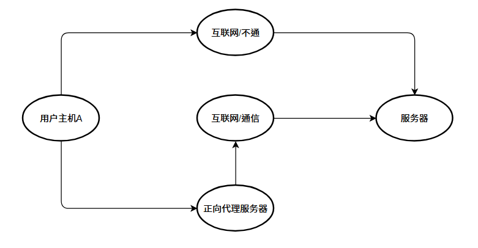

### 1.2.2. 反向代理

反向代理，简单来说就是用户将流量请求发送到反向代理服务器上，然后反向代理服务器接收到请求后，反向代理服务器再构建请求流量，转交给服务器进行处理，处理结束后，服务器再将处理结果转交给反向代理服务器，反向代理服务器再构建请求相应交给客户端，在这个过程中，反向代理服务器对于用户来说就是真实的服务器，但是对于服务器来说，反向代理服务器是代替服务器向用户服务。


### 1.2.3. 透明代理

透明代理和正向代理管理行为上和相似，首先用户将数据提交给服务器的过程中，透明代理服务器会将数据进行拦截，然后透明代理服务器会代为去访问服务端，然后将响应结果转交给用户主机，而且这个过程中用户是毫无感觉的，以为是访问真实的服务器，实则，这个数据包早就被透明代理给替换了，同时透明代理还可以用于监控用户访问的信息，像上网行为管理多数就是采用这中代理模式。

同时透明代理在访问过程中请求的IP信息是会发送真实的IP信息，而且透明代理去拦截的时候，只是代为发送数据包信息，并不会修改你的请求参数，当然加密的透明代理是属于匿名代理。

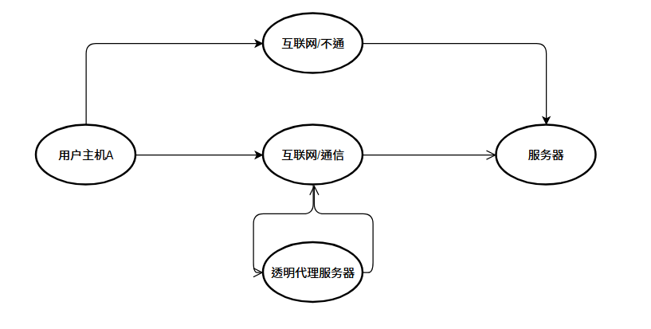

### 1.2.4. 正向代理与透明代理区别

正向代理：正向代理用户需要做相应的配置，用户明确知道自己实际上通过正向代理去访问服务器。

透明代理：透明代理用户无需做相应的配置，用户在访问服务器的时候，以为整个过程是自己完成的，实际上是由透明代理去替其访问的，整个过程对于用户来说是无感的。

# 2. 内网穿透

其实内网穿透就是采用代理来解决互相不通信的问题，而隧道技术本质上是能够通信的，但由于某些情况下被防火墙的策略限制，而无法通信所以才需要使用到隧道技术。

```
那么就出现以下情况：

目标有公网出口，攻击机无公网出口，反向木马无法上线，正向木马能上线。

目标无公网出口，攻击机有公网出口，反向木马能上线，正向木马无法上线。

目标无公网出口，攻击机无公网出口，反向、正向均无法上线，多数情况下都是这种情况。
```

## 2.1. Ngrok

**由于个人理解，这里如果方向或流程说错了，请大佬指点！！！！**

Ngrok的主要原理是反向代理，具体的流程按木马上线的流程来说吧！

首先攻击机与代理服务器建立隧道连接，将木马生成为代理服务器的IP地址与端口，再将木马发送给目标主机，目标主机上线后会反弹shell到代理服务器的IP与端口，而代理服务器会将反弹shell发送到本地，这个就是整个流程。

在这个过程中，目标主机全程不知道攻击机的IP地址，相当于目标主机也就变成了用户机，攻击机变成了服务器，目标主机去访问服务器的时候，实际上是访问的代理服务器，代理服务器将数据再转发给攻击机，所以也就是反向代理。

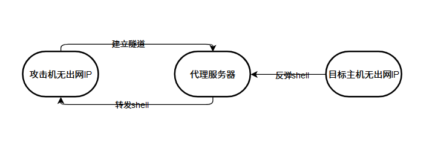

### 2.1.1. 访问Ngrok

由于现在Ngrok需要使用到实名认证，所以看需求吧！！

[Ngrok](https://www.ngrok.cc/user.html)

### 2.1.2. 代理设置

这里如果不会看官方手册，很详细！！

#### 2.1.2.1. 开通代理

这里我们就使用免费的隧道来做演示，但是免费的隧道终归比较差，所以这里只是演示，如果在实际测试中，还是花点小钱吧！！可能这里有点冲突了，买云服务器也要钱，买代理也要钱，难搞！！！

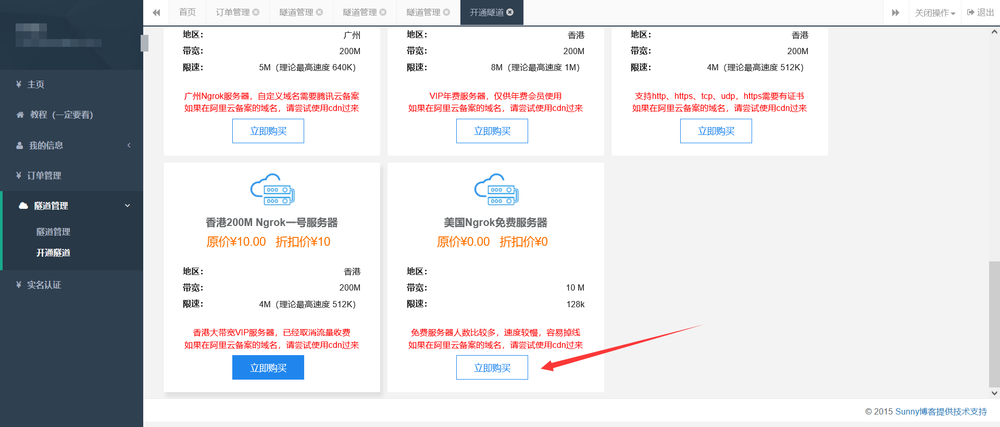

#### 2.1.2.2. 配置隧道

购买后，就会出现开通隧道，这里配置以下即可，端口随便填，会出现可用端口，选择一个即可，本地端口中的IP要输入你攻击机的本地地址以及一个端口。

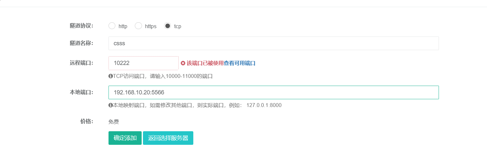

#### 2.1.2.3. 下载客户端

这里就能够看到一些详细的信息了，这时候就需要下载客户端了，由于使用cs作为测试，那么就需要下载Linux客户端，点击客户端下载，找到相应的系统以及版本即可。

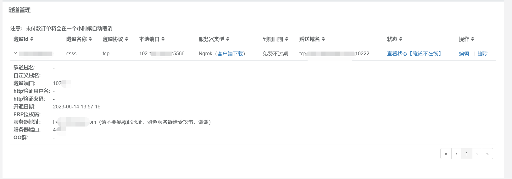

### 2.1.3. 配置客户端

到这里我们就需要配置客户端了。

#### 2.1.3.1. 添加执行权

我们下载的Linux会得到一共文件，但是这个文件没有执行权，这里我们添加给文件添加一个执行权。

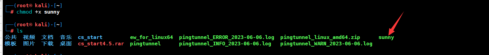

#### 2.1.3.2. 隧道连接

我们在前面添加执行权后，就可以进行连接了，连接后可以刷新以下状态，可以看到成功上线。

```
./sunny clientid 隧道ID
```

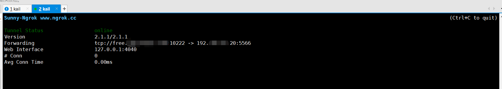

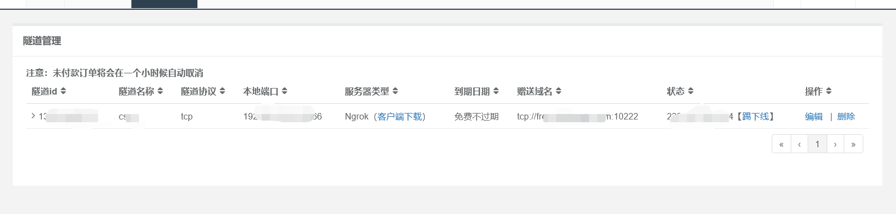

### 2.1.4. 生成木马

隧道建立成功了，这里我们尝试使用CS去创建一个后门木马，这里我们需要配置两个监听器，一个是用于生成后门木马，一个用于监听。

#### 2.1.4.1. 配置木马生成监听器

下面这个就是用于生成木马的监听器，这里的ip地址一定要是域名解析后的IP地址，端口使用的是上面提示的端口，也就是你创建隧道的时候出现让你填的端口，不是本地端口哦！！

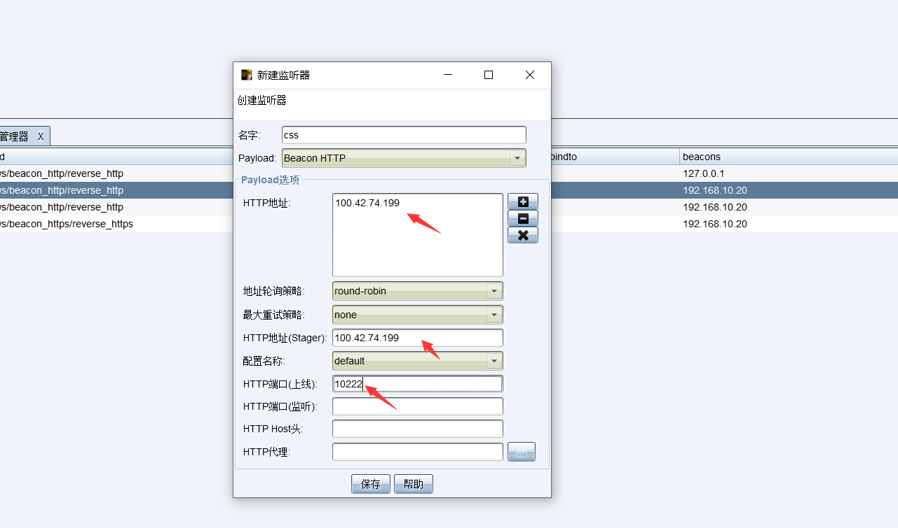

#### 2.1.4.2. 配置上线监听器

这里我们再配置一个上线监听器，这里监听的端口就是本地端口，由于后门木马去连接地址后，会将流量转发到本地。

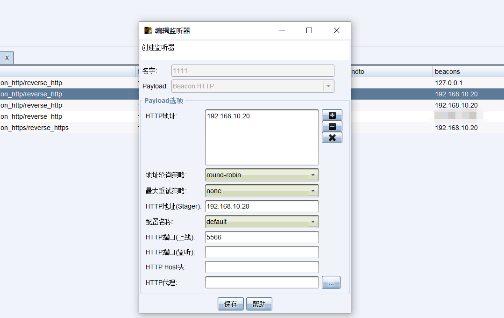

### 2.1.5. 查看上线情况

想必生成木马应该不用说了吧，挺简单的，这里就不说怎么生成了，这里直接看上线结果，可以看到这里是成功上线了，而且kail客户端也产生了相应的流量。

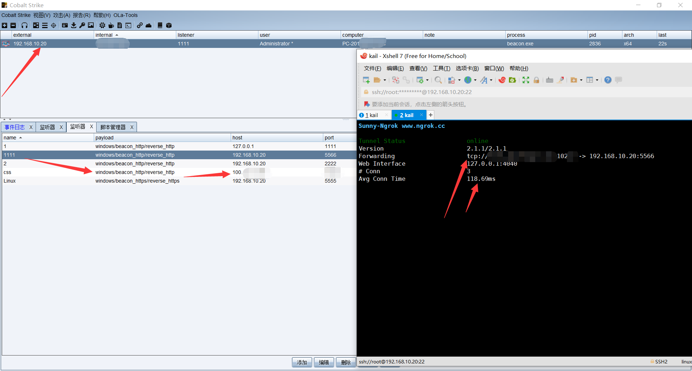

### 2.1.6. 总结

关于Ngrok代理，使用起来确实挺方便的，但是功能较少，对于内网情况较为复杂的时候，可能不是那么的好用，如果是MSF上线，那么更简单，可以使用TCP或者http的，如果是http，生成木马的时候回连地址直接填写域名，端口默认80，本地监听的依旧是与服务器相连的端口，可以自己去看看。

## 2.2. Frp

frp 是一个专注于内网穿透的高性能的反向代理应用，支持 TCP、UDP、HTTP、HTTPS 等多种协议。可以将内网服务以安全、便捷的方式通过具有公网 IP 节点的中转暴露到公网。

注意Frp需要使用到一台云服务器，服务端需要安装在云服务器上，客户端安装在本地。

### 2.2.1. Frp下载

具体的可以访问下面地址看具体的介绍，由于我是Linux的，我就下载Linux的。

[Frp中文介绍](https://github.com/fatedier/frp/blob/dev/README_zh.md)

[Frp下载](https://github.com/fatedier/frp/releases/tag/v0.49.0)

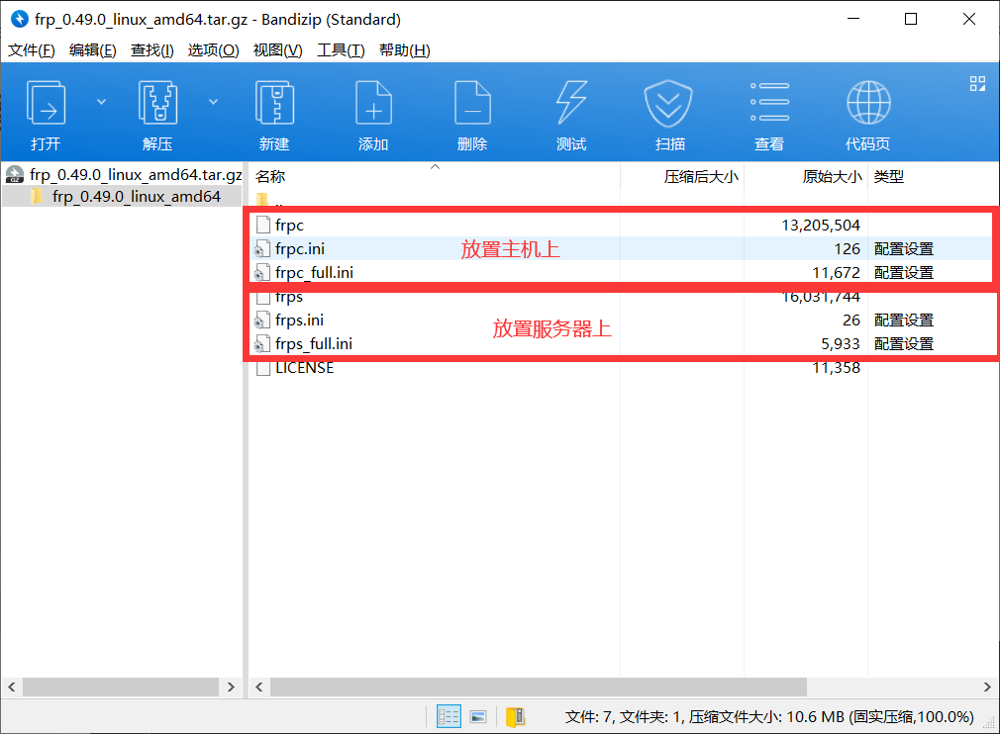

### 2.2.2. 修改相关配置

具体的流程看下面，因为先配置完后在去理解流程。

#### 2.2.2.1. 服务端配置

这里提前将相关的文件上传至云服务器中，然后修改云服务器中的Frp配置文件，这里修改的端口，需要在云服务器上进行放通哦，避免出现无法连接的情况。

```
chmod +777 frps ##给予执行权限
vim frps.ini    ##修改端口
	[common]
	bind_port = 7000  ##开放服务器上的一个端口即可
	
./frps -c ./frps.ini ##启动服务端
```

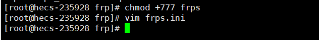

#### 2.2.2.2. 客户端配置

注意这里，是以建立代理隧道为主，可能在网上有很多其它的配置，哪些是以提供服务而做的配置，想法不通的，不要混淆。

```
chmod +777 frpc ##给予执行权限
vim frpc.ini    ##修改端口
	[common]
	server_addr = 124.XX.XX.62   ##云服务器地址
	server_port = 7000    ##frpc工作端口，与服务端保持同步

	[ssh]  ##名字不用管
	type = tcp
	local_ip = 127.0.0.1 ##本地地址，当然如果存在多个IP，最好定义一下具体的IP。
	local_port = 5656    ##转发到本机的5656端口
	remote_port = 6000   ##服务端6000端口来转发给本机
	
./frpc -c ./frpc.ini ##启动客户端
```

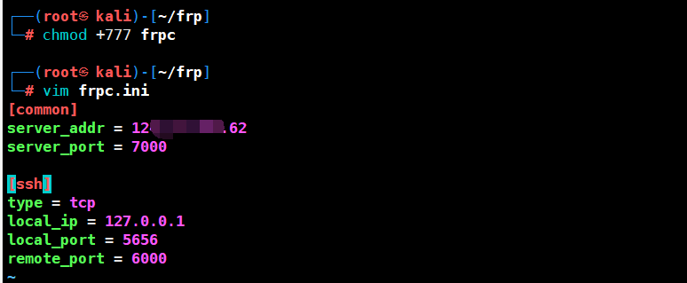

### 2.2.3. 查看运行情况

这里在服务端就能够看到相关的数据流量了。

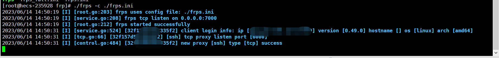

### 2.2.4. 生成木马

这里监听器还是一样，需要创建两个，一个是用于生成后门木马，一个用于监听。

#### 2.2.4.1. 配置木马生成监听器

这里我们连接的IP地址需要是云服务器的IP地址，端口是6000，也就是刚刚在客户端的配置文件中修改的那个转发端口。

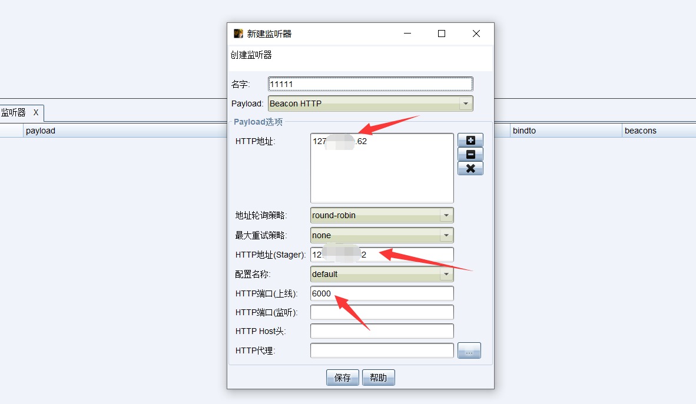

#### 2.2.4.2. 配置上线监听器

这里监听的地址是本地地址，监听的端口是刚刚配置接收6000转发过来的数据端口。

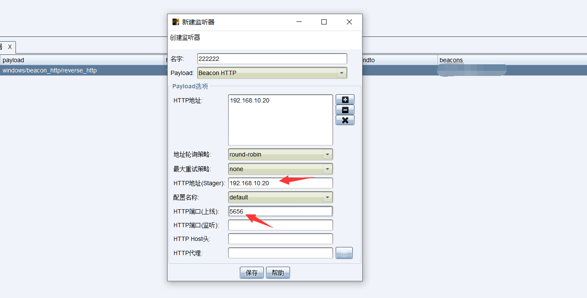

### 2.2.5. 查看上线情况

可以看到，服务端有流量过来，同时也成功上线。

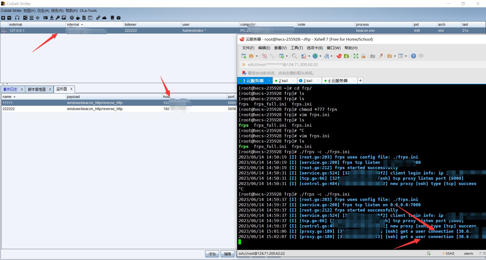

### 2.2.6. 流程介绍

攻击机的7000端口与云服务器的7000端口互相连接形成隧道，然后木马反弹shell到云服务器的6000端口，云服务器将6000端口转发到攻击机的5656端口上，攻击机监听本地的5656端口来接收shell。

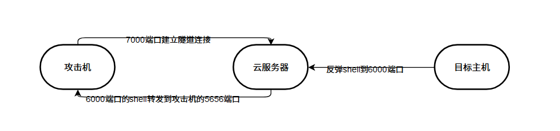

# 3. 总结

这里只是介绍了两个，其实还有几个，后门几个将在下篇文章中提到。