# 1.**账户安全**

## 1.1.**锁定或删除多余账户**

操作步骤：

```
cat /etc/passwd 

cat /etc/shadow
```

安全设置：

```
使用命令passwd -l <用户名>锁定不必要的账号。

使用命令passwd -u <用户名>解锁需要恢复的账号。

使用命令userdel [-r][-f] <用户名>删除不必要的账户。
```

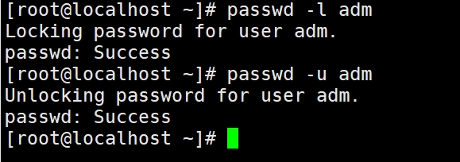 

## 1.2.**检查空口令用户**

操作步骤：

```
awk -F ":" '($2=="!"){print $1}' /etc/shadow 查找空口令用户
```

安全设置：

```
使用命令passwd <用户名> 添加口令或者将账户删除。
```

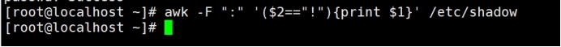 

## 1.3.**设置口令策略**

操作步骤：

```
vi /etc/login.defs  修改配置文件
```

安全设置：

```
PASS_MAX_DAYS		90	  #用户的密码最长使用天数

PASS_MIN_DAYS		0	  #两次修改密码的最小时间间隔

PASS_MIN_LEN		8	  #密码的最小长度

PASS_WARN_AGE 30    #密码过期前多少天开始提示
```

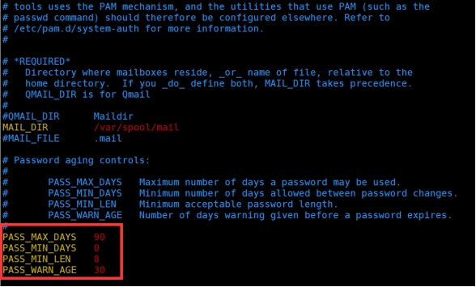 

## 1.4.**口令复杂度**

操作步骤：

```
vi /etc/pam.d/system-auth  打开配置文件
```

安全设置：

```
minlen=8   #最小长度8位

difok=5    #新旧密码最少5个字符不同

dcredit=-1   #最少1个数字

lcredit=-1   #最少1个小写字符

ucredit=-1   #最少1个大写字符

ocredit=-1   #最少1个特殊字符

retry=1    #1次错误后返回错误信息

type=XXX  #此选项用来修改缺省的密码提示文本
```

操作流程：

```
将这行注释  password   requisite   pam_pwquality.so try_first_pass local_users_only retry=3 authtok_type= 
```

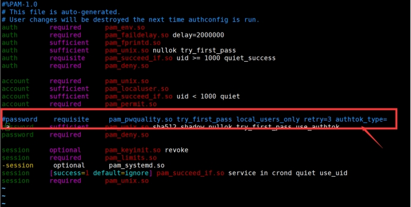 

```
并在其下面新增1行 password requisite pam_pwquality.so try_first_pass minlen=8 difok=5 dcredit=-1 lcredit=-1 ucredit=-1 ocredit=-1 retry=1 authtok_type=
```

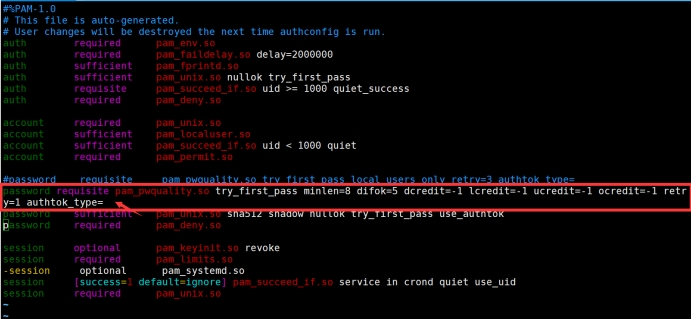 

```
如果要设定root也要履行该规则，需要添加enforce_for_root

例如：password requisite pam_pwquality.so try_first_pass minlen=8 difok=5 dcredit=-1 lcredit=-1 ucredit=-1 ocredit=-1 retry=1 enforce_for_root authtok_type=
```


## 1.5.**口令与近期不同**

操作步骤：

```
vi /etc/pam.d/system-auth 打开配置文件
```

安全设置：

```
remeber=5   #记住近期5个密码，改密码不能与近期5个有相同的。
```

操作流程：

```
在password   sufficient   pam_unix.so sha512 shadow nullok try_first_pass use_authtok 所在行的后面添加remember=5
```

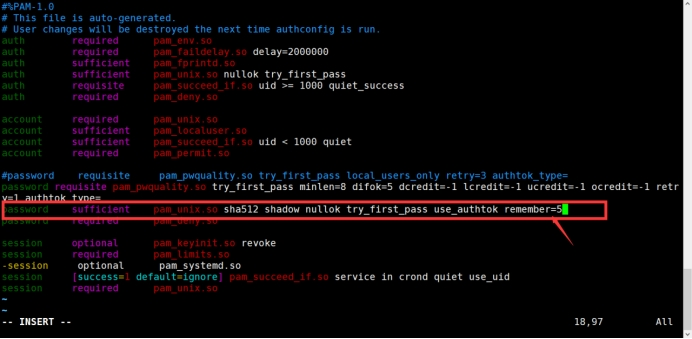 

## 1.6.**会话超时**

操作步骤：

```
vi /etc/profile 打开配置文件
```

安全设置：

```
在文件的末尾添加 export TMOUT=600，意思是export TMOUT=600 10分钟超时。
```

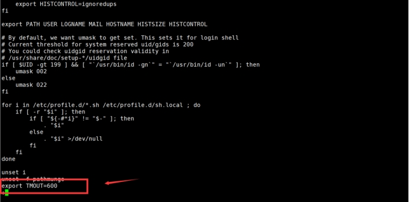 

## 1.7.**登录失败锁定**

操作步骤：

```
vi /etc/pam.d/system-auth 打开配置文件
```

安全设置：

```
deny=5      #5次登录失败

unlock_time=600  #600秒后重试

unlock_time=1800  #锁定30分钟
```

操作流程：

```
在# User changes will be destroyed the next time authconfig is run.下面添加auth    required   pam_tally2.so deny=5 unlock_time=600 even_deny_root root_unlock_time=1800
```

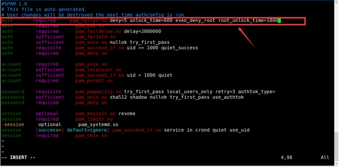 

## 1.8.**禁用其它超级用户**

操作步骤：

```
awk -F ":" '($3=="0"){print $1}' /etc/passwd 检查其它用户ID为0的用户
```

安全设置：

```
passwd -l <用户名> 锁定用户
```

# 2.**SSH安全**

## 2.1.**禁止root用户进行远程登录**

操作步骤：

```
cat /etc/ssh/sshd_config | grep PermitRootLogin  检查是否为no

vi /etc/ssh/sshd_config  打开配置文件
```

安全设置：

```
修改PermitRootLogin 为no
```

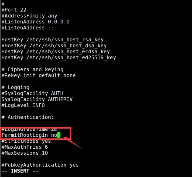 

## 2.2.**修改ssh端口**

操作步骤：

```
vi /etc/ssh/sshd_config  打开配置文件
```

安全设置：

```
修改Port 为2222 当然这里端口也可以设置成其它的，只要不冲突就可以了。
```

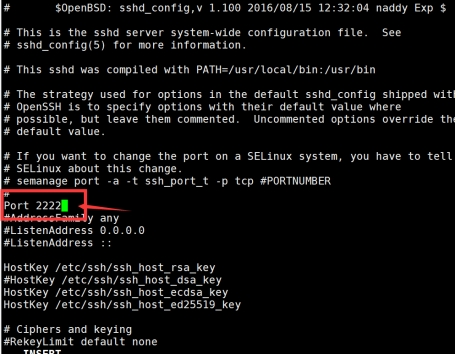 

## 2.3.**屏蔽版本信息**

操作步骤：

```
cat /etc/ssh/sshd_config #查看文件中是否存在banner字段，或banner字段为NONE

cat /etc/motd  #查看文件内容，该处内容作为banner信息显示给登录用户

vi /etc/ssh/sshd_config  打开配置文件

vi /etc/motd     打开配置文件
```

安全设置：

```
使用命令vi /etc/ssh/sshd_config，找到配置信息banner none，将前面的#删掉。
```

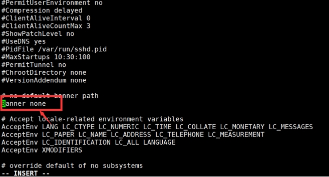 

```
执行命令vi /etc/motd，删除里面的内容或者将它改为自己的提示信息。
```

 

## 2.4.**仅允许SSH协议版本2**

操作步骤：

```
vi /etc/ssh/sshd_config 打开配置文件
```

安全设置：

```
把Protocol 设置成2 
```

## 2.5.**禁止SSH空密码用户登录**

操作步骤：

```
vi /etc/ssh/sshd_config 打开配置文件
```

安全设置：

```
配置PermitEmptyPasswords，设置为no
```

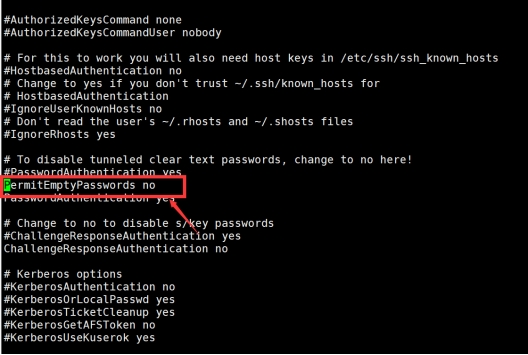 

## 2.6.**日志记录**

操作步骤：

```
vi /etc/ssh/sshd_config 打开配置文件
```

安全设置：

```
#取消注释 LogLevel INFO
```

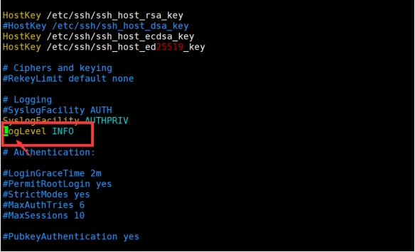 

# 3.**历史命令安全**

## 3.1.**设置BASH保留历史命令的条目**

操作步骤：

```
vi /etc/profile 打开配置文件
```

安全设置：

```
把HISTSIZE设置为5
```

 

## 3.2.**用户注销时删除命令记录**

操作步骤：

```
vi /etc/skel/.bash_logout 打开配置文件
```

安全设置：

```
添加rm -f $HOME/.bash_history，这样，系统中所有用户注销时都会自动伤处命令记录。
```

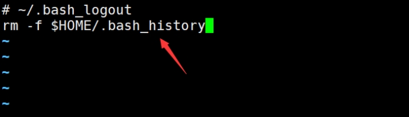 

# 4.**系统日志安全**

操作步骤：

```
ps -aef | grep syslog   #确定syslog服务是否启用

cat /etc/rsyslog.conf    #查看syslogd的配置，并确认日志文件日否存在
```

安全设置：

```
/var/log/messages  #系统日志 (默认) 

/var/log/cron    #cron日志 (默认)  

/var/log/secure   #安全日志 (默认)  
```

