# 1.**常用系统命令**

| ***\*命令（管理员启动cmd中打开）\**** | ***\*说明\****                          |
| ------------------------------------- | --------------------------------------- |
| ver                                   | 查看系统版本                            |
| hostname                              | 查看主机名                              |
| ipconfig /all                         | 查看网络配置                            |
| net user/localgroup/share/config      | 查看用户/用户组/共享/当前运行可配置服务 |
| schtasks.exe                          | 建立或查看系统作业                      |
| whoami                                | 查看当前操作用户的用户名                |
| netstat                               | 查看开放端口                            |
| ***\*命令（运行中打开）\****          | ***\*说明\****                          |
| secpol.msc                            | 查看和修改本地安全设置                  |
| services.msc                          | 查看和修改服务                          |
| eventvwr.msc                          | 查看日志                                |
| regedit                               | 打开注册表                              |

 

# 2.**账户管理**

## 2.1.**账户安全**

### 2.1.1.**默认账户修改**

操作步骤：

开始》管理工具》计算机管理》本地用户和组》用户》选中用户右键重命名。

安全设置：

不使用默认的账户，例如administrator可以修改为abc_admin，但是不能使用admin。

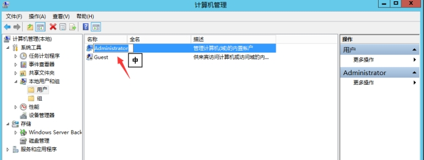 

### 2.1.2.**禁用删除无用账户**

操作步骤：

开始》管理工具》计算机管理》本地用户和组》用户》选中用户右键属性。

安全设置：

可以将无用的账户禁用或者删除，都可以。

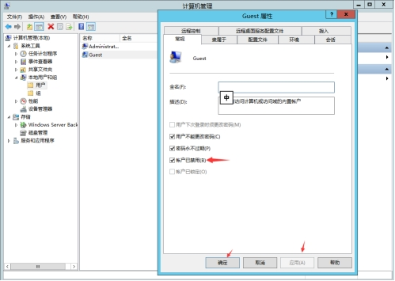 

### 2.1.3.**账户权限分类**

操作步骤：

开始》管理工具》计算机管理》本地用户和组》用户》右击空白处新建用户。

安全设置：

按照用户分配账户。根据业务要求，设定不同的用户和用户组。例如，管理员用户，数据库用户，审计用户，来宾用户等。

### 2.1.4.**不显示最后用户名**

操作步骤：

开始》管理工具》本地安全策略》本地策略》安全选项。

安全设置：

双击交互式登录:不显示最后的用户名，选择已启用并单击确定。

 

## 2.2.**口令安全**

### 2.2.1.**账户密码策略**

操作步骤：

开始》管理工具》本地安全策略》账户策略》密码策略。

安全设置：

1) 开启密码复杂度
2) 密码长度最小值为8个字符
3) 密码最短使用期限30天
4) 密码最长使用期限90天
5) 强制密码历史5个

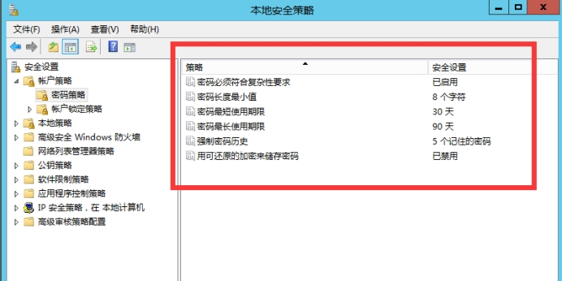 

### 2.2.2.**账户密码**

操作步骤：

开始》管理工具》计算机管理》本地用户和组》用户》选中用户右键修改密码。

安全设置：

1) 大小写字母
2) 数字
3) 特殊字符
4) 不低于8位

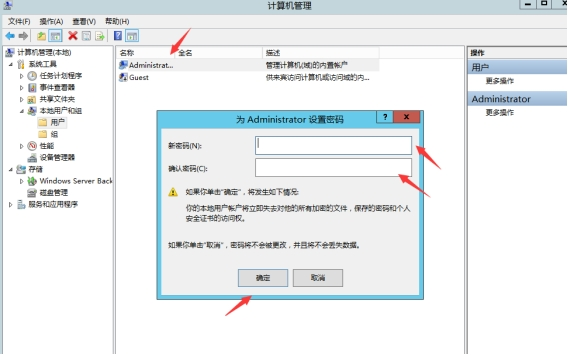 

### 2.2.3.**账户锁定**

操作步骤：

开始》管理工具》本地安全策略》账户策略》账号锁定策略。

安全设置：

1) 账户锁定时间30分钟
2) 账户锁定阈值5次
3) 重置账户锁定计算器10分钟

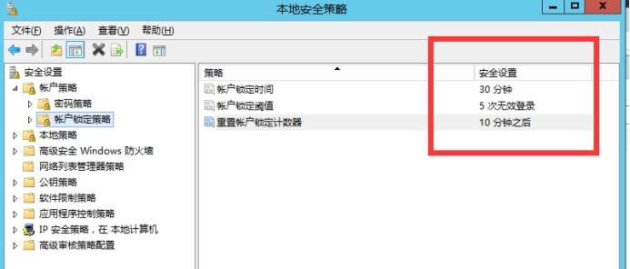 

## 2.3.**授权安全**

以下设置均可以在如下图中寻找到。

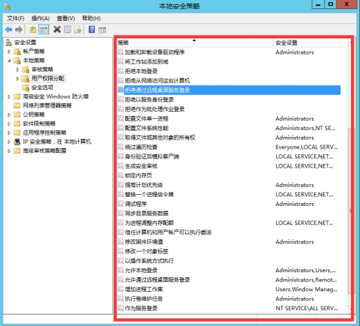 

### 2.3.1.**远程关机**

操作步骤：

开始》管理工具》本地安全策略》本地策略》用户权限分配。

安全设置：

配置从远端系统强制关机权限只分配给Administrators组。

### 2.3.2.**本地关机**

操作步骤：

开始》管理工具》本地安全策略》本地策略》用户权限分配。

安全设置：

配置关闭系统权限只分配给Administrators组。

### 2.3.3.**用户权限指派**

操作步骤：

开始》管理工具》本地安全策略》本地策略》用户权限分配。

安全设置：

配置取得文件或其它对象的所有权权限只分配给Administrators组

### 2.3.4.**授权账户登录**

操作步骤：

开始》管理工具》本地安全策略》本地策略》用户权限分配。

安全设置：

配置允许本地登录权限给指定授权用户。

### 2.3.5.**授权账户从网络访问**

操作步骤：

开始》管理工具》本地安全策略》本地策略》用户权限分配。

安全设置：

配置从网络访问此计算机权限给指定授权用户。

# 3.**日志管理**

## 3.1.**审核策略**

操作步骤：

开始》管理工具》本地安全策略》本地策略》审核策略。

安全设置：

1) 审核策略更改 修改为：成功，失败
2) 审核登录事件 修改为：成功，失败
3) 审核对象访问 修改为：成功，失败
4) 审核进程跟踪 修改为：成功，失败
5) 审核目录访问访问 修改为：成功，失败
6) 审核特权使用 修改为：成功，失败
7) 审核系统事件 修改为：成功，失败
8) 审核账户登录事件 修改为：成功，失败
9) 审核账户管理 修改为：成功，失败

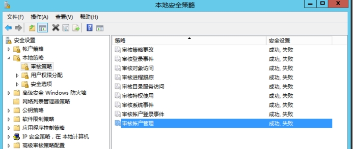 

## 3.2.**日志属性设置**

操作步骤：

开始》管理工具》事件查看器》windows日志

安全设置：

依次操作安全、设置、系统日志中存储的日志空间大小，具体可根据磁盘空间大小设置，且设置日志满时将其存档，不覆盖事件。

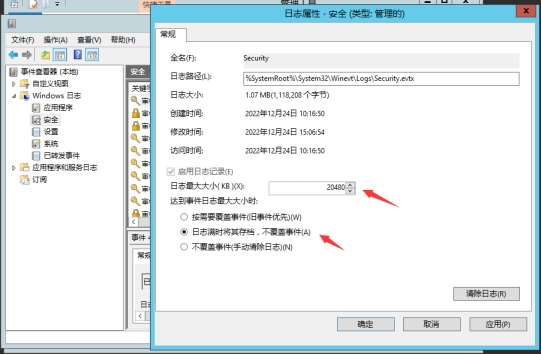 

# 4.**其它安全选项**

以下设置均可以在下图中找到。

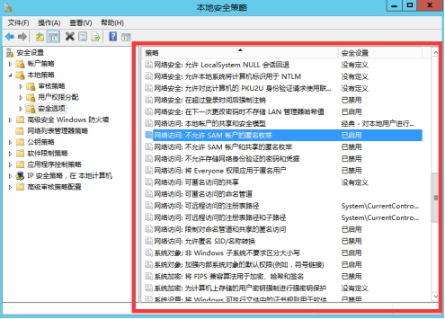 

## 4.1.**暂停会话**

操作步骤：

开始》管理工具》本地安全策略》本地策略》安全选项。

安全设置：

Microsoft 网络服务器: 暂停会话前所需的空闲时间量设置成10分钟。

## 4.2.**清除虚拟内存**

操作步骤：

开始》管理工具》本地安全策略》本地策略》安全选项。

安全设置：

关机：清除虚拟内存页面文件设置成已启用。

## 4.3.**超时登录注销**

操作步骤：

开始》管理工具》本地安全策略》本地策略》安全选项。

安全设置：

网络安全: 在超过登录时间后强制注销设置成已启用。该设置不适应管理员账户。

## 4.4.**未登录关机**

操作步骤：

开始》管理工具》本地安全策略》本地策略》安全选项。

安全设置：

关机：允许系统在未登录前关机设置成已禁用。

## 4.5.**网络访问**

### 4.5.1.**SAM匿名枚举**

操作步骤：

开始》管理工具》本地安全策略》本地策略》安全选项。

安全设置：

网络访问：不允许SAM账户的匿名枚举设置成已启用。

网络访问：不允许SAM账户和共享的匿名枚举设置成已启用。

### 4.5.2.**匿名访问**

操作步骤：

开始》管理工具》本地安全策略》本地策略》安全选项。

安全设置：

网络访问：可匿名访问共享设置成清空。

网络访问：可以匿名访问命名通道设置成清空。

### 4.5.3.**远程访问**

操作步骤：

开始》管理工具》本地安全策略》本地策略》安全选项。

安全设置：

网络访问：可远程访问注册表路径设置成清空，不允许远程访问注册表。

网络访问：可远程访问注册表路径和子路径设置成清空，不允许远程访问注册表。

# 5.**远程桌面设置**

## 5.1.**修改默认端口号**

操作步骤：

运行》regedit》注册表

安全设置：

1) 修改TCP3389端口号：HKEY_LOCAL_MACHINE\SYSTEM\CurrentControlSet\Control\Terminal Server\Wds\rdpwd\Tds\tcp。
2) 找到PortNumber选项，双击修改右边基数为十进制，然后修改数值数据为：例如33889等…

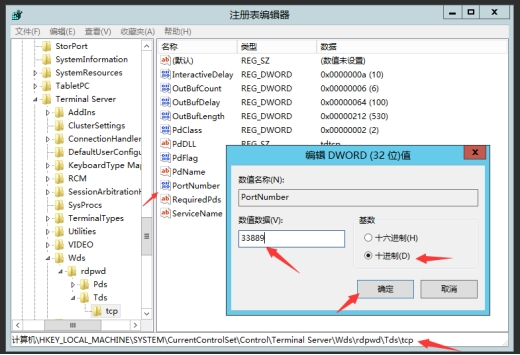 

3) 修改远程桌面3389端口号：HKEY_LOCAL_MACHINE\SYSTEM\CurrentContro1Set\Control\Tenninal Server\WinStations\RDP-Tcp
4) 找到PortNumber选项，双击修改右边基数为十进制，然后修改数值数据为：例如33889等…

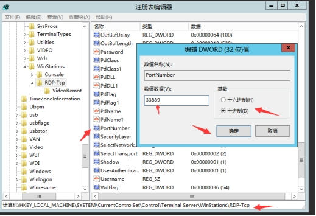 

5) 设置防火墙，开始》管理工具》高级安全Windows防火墙》入站规则》远程桌面》用户模式(TCP-In)，需要把策略禁用然后再启用。

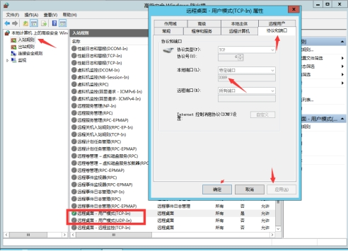 

6) 重启电脑
7) 进行远程桌面时，需要在输入的IP后面添加端口，例如：192.168.30.10:33889，就可以正常访问了。

## 5.2.**远程桌面空闲时间设置**

操作步骤：

运行》gpedit.msc》计算机配置》管理模板》Windows 组件》远程桌面服务》远程桌面会话主机》会话时间限制。

安全设置：

设置活动但空闲的远程桌面服务会话的时间限制，设置成已启用，空闲会话限制为10分钟。

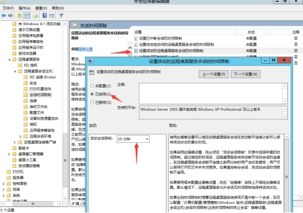 

# 6.**其它设置**

## 6.1.**屏幕保护**

操作步骤：

开始》控制面板》显示》更改屏幕保护程序。

安全设置：

设定屏幕保护程序，等待时间为10分钟，选择在恢复时显示登录屏幕。

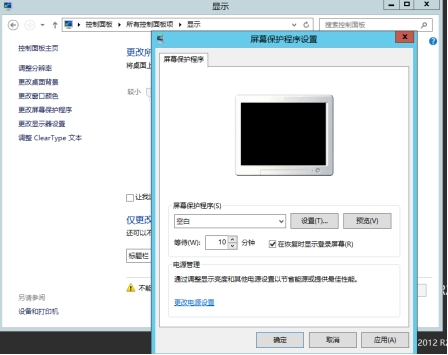 

## 6.2.**关闭自动播放**

操作步骤：

开始》控制面板》自动播放。

安全设置：

取消为所有媒体和设备使用自动播放。

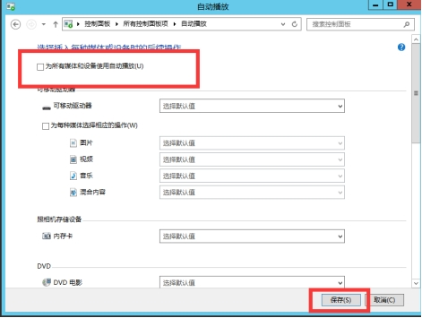 

## 6.3.**数据执行保护**

操作步骤：

控制面板》系统》高级系统设置》性能》设置》数据执行保护。

安全设置：

选择仅为基本 Windows 程序和服务启用 DEP(T)。

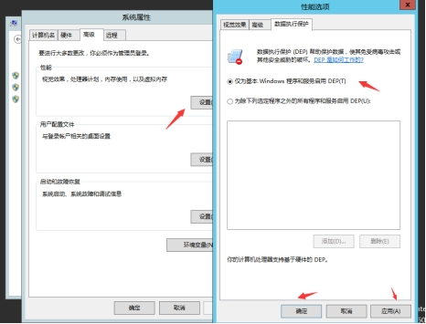 

## 6.4.**启动项检查**

操作步骤：

运行》msconfig》启动。

安全设置：

在启动项中取消不必要的启动项。

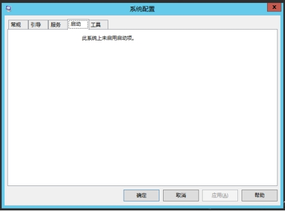 

## 6.5.**禁用不必要服务**

操作步骤：

开始》管理工具》服务。

安全设置：

可以参考下图。

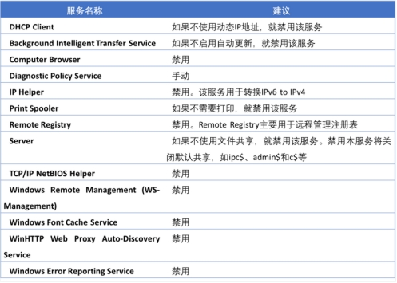 

# 7.**防火墙设置**

## 7.1.**开关防火墙**

操作步骤：

开始》控制面板》Windows防火墙》启用或关闭Windows防火墙。

安全设置：

这里我关闭防火墙的话，就需要有相应好的安全软件进行管理，如果没有的话，我是不太建议关闭防火墙的。

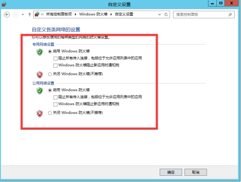 

## 7.2.**允许访问端口设置**

操作步骤：

开始》管理工具》高级安全Windows防火墙》入站规则

安全设置：

1) 新建入站规则。

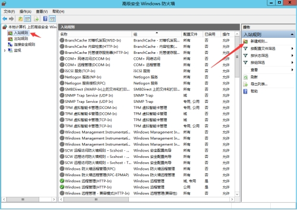 

2) 选择端口，下一步。

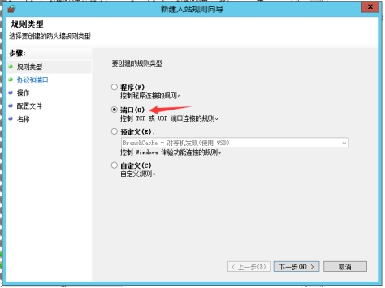 

3) 填入需要放行的端口，当然这里也可以选择是UDP连接还是TCP连接，正常情况下都是TCP连接，下一步。

多个端口可以使用英文逗号分隔，如3389,80等。

端口区间可以使用减号分隔，如1000-1100等。

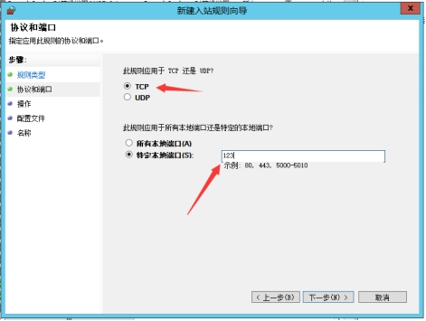 

4) 选择允许连接，下一步。

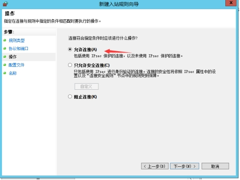 

5) 运用所有网络，当然这里也可以选择你想要选择的网络，下一步。

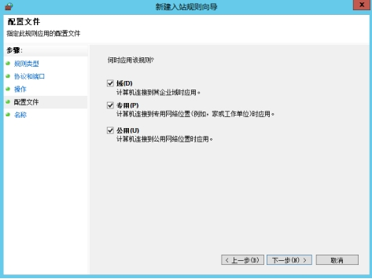 

6) 设定规则的名称，下一步。

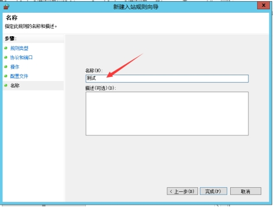 

7) 设置作用域，默认是对所有IP起作用，假如你就是想让任何IP都能连接，那么这一步就不需要设置了，如果需要对单独的IP起作用可以设定相关的IP。

这里的IP可以是IPv4和IPv6。

 

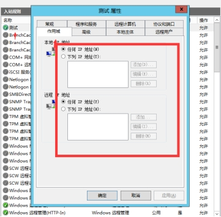 

## 7.3.**禁用访问端口设置**

操作步骤：

开始》管理工具》高级安全Windows防火墙》入站规则

安全设置：

这里和上面允许访问端口设置基本上是一直的，至少上面是允许连接，这里是禁止连接。

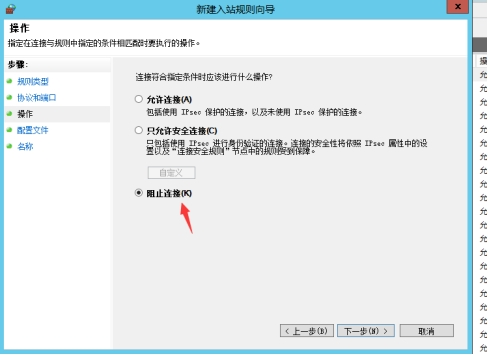 

## 7.4.**常见端口**

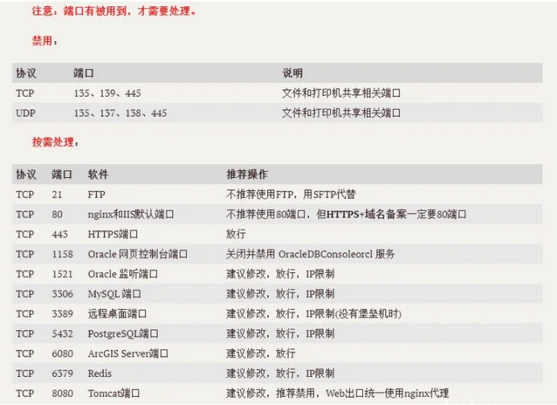 

# 8.**IP安全策略**

操作步骤：

开始》管理工具》本地安全策略》IP安全策略，在本地计算机

安全设置：

这里是IP策略是基于防火墙被关闭，但是又想让部分IP无法连接，情况下可以这样设置。

## 8.1.**设置流程**

### 8.1.1.**创建IP安全策略**

1) 右击“IP安全策略，在本地计算机”，选择“创建IP安全策略”，然后出现“IP安全策略向导”点击下一步。

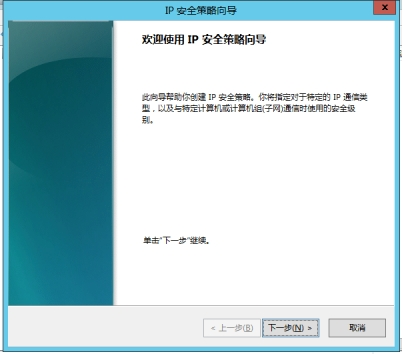 

2) 名称改一下，然后一直下一步。（注：如果有让选择“激活默认响应规则”不要选择）。

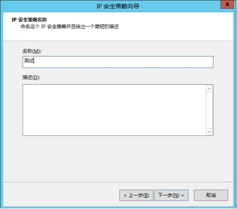 

3) 关闭编辑属性，然后点击完成。

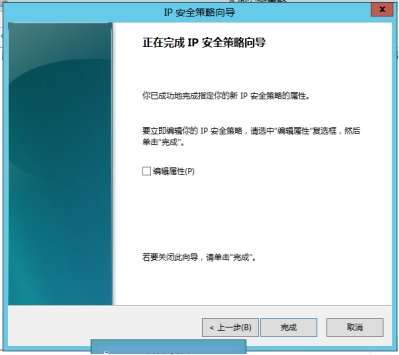 

### 8.1.2.**设置IP筛选器**

1) 继续右击“IP安全策略，在本地计算机”，选择“管理IP筛选器列表和筛选器操作”，第一个界面为：管理IP筛选器列表。点击左下角添加。

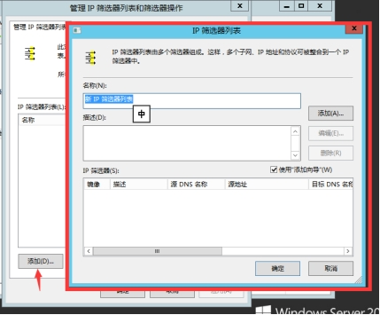 

2) 弹出的为：IP筛选器列表，修改一下名称。（注：不要使用“添加向导”），然后点击靠右边中间的添加。

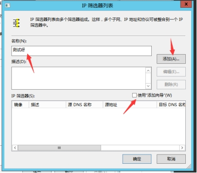 

3) 点击添加后弹出的为：IP筛选器属性，先点击地址，源地址选择：任何IP地址，目的地址选择：我的IP地址。注：下面的“镜像与源和目标地址正好相反的数据包匹配”，把√号取消）。这里是禁止别人访问我这台服务器的IP上的端口，所以才这么设置。

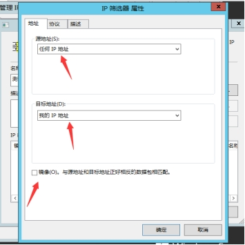 

4) 点击协议，然后点击选择协议类型，选择TCP协议，设置IP协议端口，第一排选择：从任意端口，第二排选择：到此端口，填写3389。这里我们让别人无法访问我的远程桌面，虽然有点傻，远程桌面可以直接关闭，但是这里就做个演示。

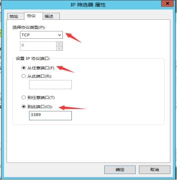 

5) 点击确认，点完后应该在IP筛选器列表这个界面，可以在列表中看到刚刚添加的，（注：如果需要描述也可以描述一下，如果还想添加UDP的话，同样的操作）。确认添加的没问题后点击确定。

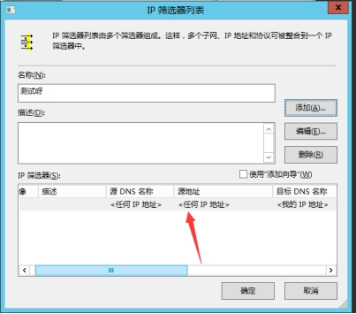 

6) 此时应该回到了管理IP筛选器列表和筛选器操作这个界面，这时选择第二个界面：管理筛选器操作，把下面使用“添加向导取消”，然后点击添加。

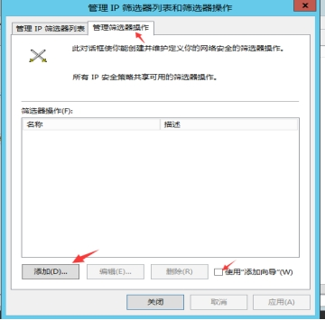 

7) 此时界面是：新筛选器操作属性。安全办法选择：阻止。常规中修改一下名称，不要默认，以防忘记。填写好后，先点击应用，再点击确定。

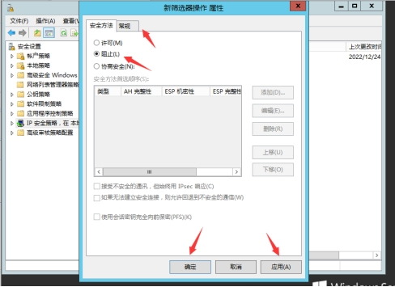 

8) 此时也可以在管理筛选器操作的列表中看到刚刚添加的。然后把：管理IP筛选器列表和筛选器操作这个界面关闭。

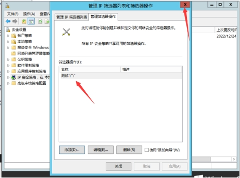 

9) 点击刚刚界面上的IP安全策略，会在右边看到刚刚第1步创建的IP安全策略。然后右击选择属性。

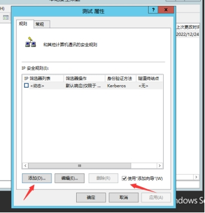 

10) 在规则中选择添加，（注：勾选右下角的使用添加向导），弹出来的第一个界面点击下一步，第二个界面选择：此规则不指定隧道，然后下一步，第三个界面选择：所有网络连接，然后下一步，第四个界面是IP筛选器列表，选择刚刚已经创建好的IP筛选器，然后下一步，第五个界面是筛选器操作，选择刚刚创建好的筛选器操作，然后下一步，就完成了。（注：不需要选择编辑属性）

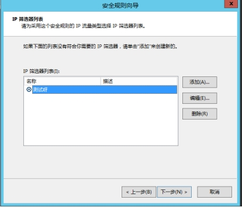 

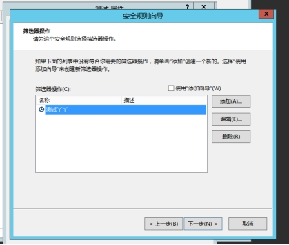 

11) 然后在刚刚：IP安全规则中能看到刚刚选择的，然后点击应用，最后点击确定。

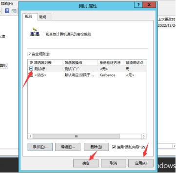 

12) 再次右击选择刚刚的：IP安全策略，选择第一个分配。

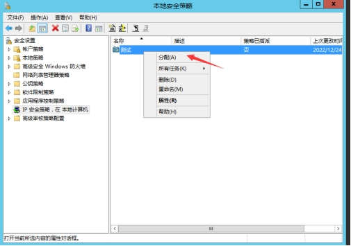 

### 8.1.3.**测试**

1) 测试，使用另外一台电脑telnet + IP +端口 我测试的虚拟机为 telnet 192.168.10.200 3389。如果进不去就设置成功了

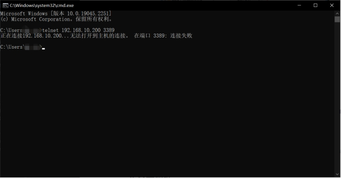 

2) 未成功检查服务是否正常运行，或者在打开CMD输入：gpupdate /force。

# 9.**注册表相关**

## 9.1.**注册表安全**

操作步骤：

文件管理器》C盘》Windows文件夹》regedit.exe

安全设置：

设置为只有管理员可以进行读取与执行，其它用户均只能读取。

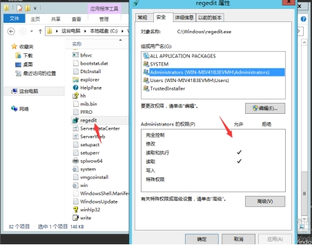 

## 9.2.**禁止空链接**

操作步骤：

运行》regedit》HKEY_LOCAL_MACHINE\SYSTEM\CurrentControlSet\Control\Lsa。

安全设置：

禁用IPC连接，编辑注册表restrictanonymous值为1，然后重启电脑。

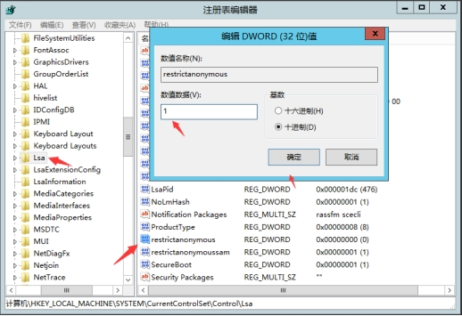 

## 9.3.**删除默认共享**

操作步骤：

运行》管理员启动cmd。

安全设置：

net share      #查看默认共享

net share <共享名> /del  #删除默认共享

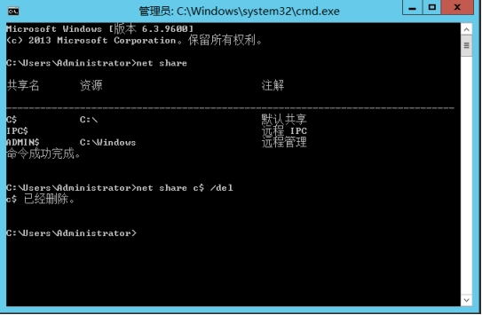 

 

 

# 10.**杀毒软件**

## 10.1.**杀毒软件须知**

1) 优先使用甲方采购的杀毒软件，没有的话，建议用户采购杀毒软件。
2) 最后才考虑免费的杀毒软件（Windows Defender、火绒、360杀毒）。
3) 杀毒软件建议设置密码（如果可以的话），防止人为关闭。
4) 启用自动更新，无法访问互联网的话，需定期更新杀毒软件和病毒库。
5) 破解的软件或自主研发的工具和插件可能会被误报，确定没问题的请添加白名单。
6) 其他操作请自行查阅官方文档。
7) 杀毒软件有可能导致程序变慢。可以先尝试关闭杀毒软件看看效果。如果确定是杀毒软件的原因，优先考虑添加白名单等，而不是弃用杀毒软件。

## 10.2.**火绒杀毒软件操作**

每家杀毒软件的操作是不同的，但是都是大差不差的操作，这里我拿火绒举例子，由于没在公司，无法拿企业版的火绒做操作，后续有时间补上来吧。

### 10.2.1.**自动升级**

操作步骤：

火绒杀毒》安全设置》常规设置》软件升级。

安全设置：

这里如果联网了可以设置成自动升级，如果是不联网的这里可以设置成手动升级，好像个人版的手动升级，就是手动检测，如果不联网，在内网设与不设置没却别，但正常个人版的多数都是在外网，很少在内网的，内网甲方一般都会买企业版的。

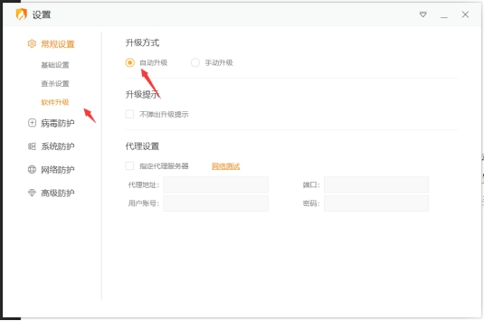 

### 10.2.2.**信任区**

操作步骤：

火绒杀毒》信任区》。

安全设置：

这里就可以根据你的需求设置白名单的网址或者软件。

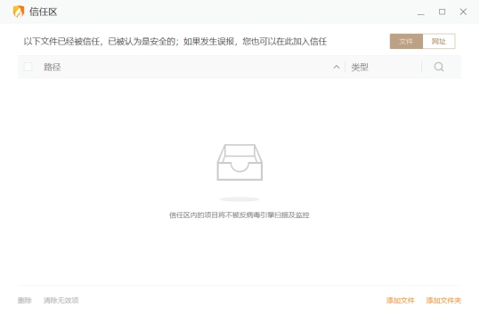 

### 10.2.3.**密码保护**

操作步骤：

火绒杀毒》安全设置》常规设置》基础设置》密码保护。

安全设置：

这里可以设置相关的密码，然后选择保护的范围，其实个人版设置密码作用不大，如果是安装在服务器上，就可以设置一个密码保护，但是服务器安装个人版好吗？？？

 

# 11.**系统补丁更新**

## 11.1.**自动更新**

操作步骤：

开始》控制面板》windows更新》更改设置

安全设置：

这里设置为：下载更新，但是让我选择是否安装更新。

对于正式运行服务器，建议使用通知并自动下载更新，由管理员选择是否安装更新，而不是使用自动安装更新，防止自动更新补丁对实际业务环 境产生影响。安装完之后，选择合适的时间重启服务器。

 

## 11.2.**手动更新**

操作步骤：

1) 访问微软官网的安全更新程序指南，选择相应的操作系统版本。链接：https://msrc.microsoft.com/update-guide

 

2) 查找对应操作系统版本的累计更新包。如果很久没有打过补丁，就下载Monthly Rollup的补丁，如果上个月已经安装过Monthly Rollup的补丁，那么只要下载安装这个月的Security Only的补丁即可。

 

3) 下载“月度安全质量汇总”的补丁包。

 

4) 在测试服务器上安装，若没有问题，则可以在一个合适的时间在正式服务器上安装并重启。 